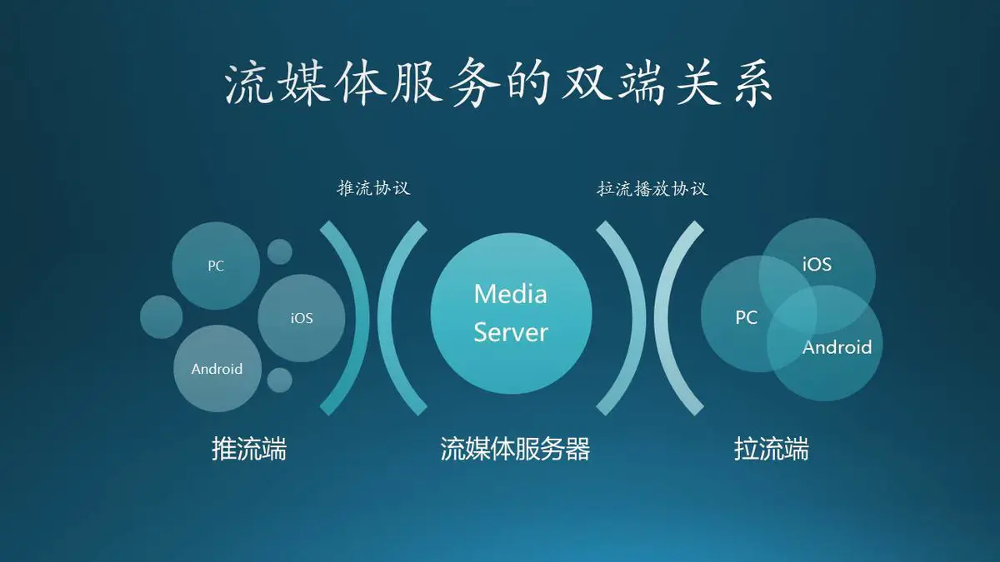
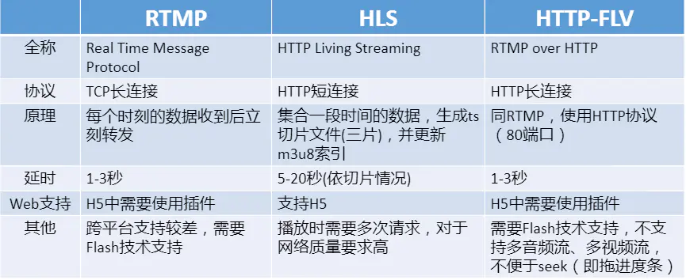

1

# 基本环境

之前看音频实时推流的时候，了解到srs这个国产的开源代码。

觉得适合用来做cpp的学习材料。

所以现在看看。

具体深入代码之前，还是把功能跑起来。先从宏观上了解。

从代码编译开始看。

编译很简单，就是先configure，再make。

总共代码文件也就200多个文件。不算太多。

启动，会监听3个tcp端口。

```
RTMP listen at tcp://0.0.0.0:1935, fd=8
HTTP-API listen at tcp://0.0.0.0:1985, fd=9
HTTP-Server listen at tcp://0.0.0.0:8080, fd=10
```

访问8080端口，需要指定/nginx.html。因为没有默认的index.html。

进行推流测试

用ffmpeg来推流，推到1935端口。

然后在我的另外一台电脑访问1935端口。

trunk目录下，有个doc目录。下面有不少文档。

下面有个source.200kbps.768x320.flv 文件，是用来做推流测试用的。

ffmpeg推流命令：

```
ffmpeg -re -i source.200kbps.768x320.flv -vcodec copy -acodec copy -f flv -y rtmp://172.16.2.196:1935/live/livestream
```

电脑上用vlc来点播。

可以正常点播。

除了用ffmpeg推流，还可以用obs来推流。

obs也可以推文件的。

# 理解rtmp

Macromedia，这个公司就活到2005年。这是一个短命的公司，但它拿出了一个长命协议，影响了之后的网上生活，也为全民直播奠定了基础。这就是RTMP，一个实时消息传输协议，一个让在线看片成为可能得协议

当时间拨到了2012年， Adobe 正式发布 RTMP specification v1.0 的时候。本以为拿着媒体服务的金钥匙，可以在未来世界纵横驰骋。但Adobe错了，未来已来，但那是一个Html5的世界，一个不需要Flash的世界。

在这种大背景下，RTMP被替换是迟早的，不是它不帅，只是这个世界变化快！

HttpFlv的出现最早是2008年，从它的协议本身我们能看到Adobe的影子，就是flv协议本身。

也可以说，httpflv是争夺与放弃之间妥协的产物。

人们再也不愿意看到Adobe，但又不得不面对海量Flv历史文档。在仇恨与无奈的交织中，httpflv诞生了。

**HttpFlv 就是 http+flv ，将音视频数据封装成FLV格式，然后通过 HTTP 协议传输给客户端。**

理解HttpFlv协议，这就话就是关键。

但聪明地你马上就会发现，虽然传输协议变了，但在flv数据格式下，脱离FlashPlayer还是无稽之谈。但在2016年，这一切都发生了改变，因为flv.js问世了！

Bilibili，也就是传说中的B站，不仅贡献了弹幕，为我们提供了另一种观影交互体验。

更重要的，Flv.js的诞生，让我们在视频播放领域彻底告别Adobe时代。

一个全新、干净的HTML5就这样向我们走来了。

HLS就是“HTTP Live Streaming”的缩写，它诞生自2009年，QuickTime和iPhone3GS黄金搭档下的一个标准，一个**意在颠覆流媒体产业的新协议**。

它的工作原理简单来说就是把一段视频流，分成一个个小的基于HTTP的文件来下载。

当媒体流正在播放时，客户端可以根据当前网络环境，方便地在不同的码率流中做切换，以实现更好的观影体验。

HLS的出现是为了解决苹果原生环境中的流媒体播放，这个协议可以方便地让Mac和iPhone播放视频流，不依赖Adobe，更不用去管什么标准委员会。

依赖自己，永远是最大力量的保障。

在视频播放领域，全民直播已经开启，这是一个**实时性需求强于稳定性的播放环境**。

苹果也跟曾经的Adobe一样，猜中了故事的开始，却踩空了这个故事的结局。




RTMP 可以用在双端，但 HLS 只能用在拉流端，记住这层关系。

所以说，HLS的慢的原因只有一个，就是**等数据**！




# srs配置

srs可以同时支持这3种协议，只要修改conf配置文件即可

obs+srs支持多路视频源同时直播，上图中阿凡达+本机摄像头，二路视频同时推流/拉流，毫无影响。


# 代码分析


# 参考资料

1、开源流媒体服务器SRS学习笔记(1) - 安装、推流、拉流

https://www.cnblogs.com/yjmyzz/p/srs_study_1_install_push_and_pull_stream.html

系列目录在这里：

https://www.cnblogs.com/yjmyzz/tag/srs/

2、SRS性能(CPU)、内存优化工具用法

这个是编译后打印的链接。作者的博客。

http://blog.csdn.net/win_lin/article/details/53503869

3、理解RTMP、HttpFlv和HLS的正确姿势

https://www.jianshu.com/p/32417d8ee5b6