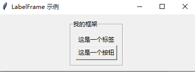
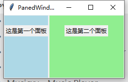

--

# 资源收集

官方文档

https://docs.python.org/zh-cn/3.6/library/tkinter.html

这个教程不错。

https://www.jiyik.com/w/tkinter/tkinter-label


tkinter其实是值得研究的，因为有很多人研究，做出了很多有意思的东西。

比wxpython的开源项目要多得多。

# 基本信息

Tcl/Tk集成到Python中已经有一些年头了。

Python程序员可以通过 [`tkinter`](https://docs.python.org/zh-cn/3.6/library/tkinter.html#module-tkinter) 包和它的扩展， [`tkinter.tix`](https://docs.python.org/zh-cn/3.6/library/tkinter.tix.html#module-tkinter.tix) 模块和 [`tkinter.ttk`](https://docs.python.org/zh-cn/3.6/library/tkinter.ttk.html#module-tkinter.ttk) 模块，来使用这套鲁棒的、平台无关的窗口工具集。

[`tkinter`](https://docs.python.org/zh-cn/3.6/library/tkinter.html#module-tkinter) 包使用面向对象的方式对Tcl/Tk进行了一层薄包装。

使用 [`tkinter`](https://docs.python.org/zh-cn/3.6/library/tkinter.html#module-tkinter) ，你不需要写Tcl代码，但可能需要参考Tk文档，甚至Tcl文档。

 [`tkinter`](https://docs.python.org/zh-cn/3.6/library/tkinter.html#module-tkinter) 使用Python类，对Tk的窗体小部件（Widgets）进行了一系列的封装。

除此之外，内部模块 `_tkinter` 针对Python和Tcl之间的交互，**提供了一套线程安全的机制。**

[`tkinter`](https://docs.python.org/zh-cn/3.6/library/tkinter.html#module-tkinter) 最大的优点就一个字：快，再一个，是Python自带的。

尽管官方文档不太完整，但有其他资源可以参考，比如Tk手册，教程等。

 [`tkinter`](https://docs.python.org/zh-cn/3.6/library/tkinter.html#module-tkinter) 也以比较过时的外观为人所知，但在Tk 8.5中，这一点得到了极大的改观。

除此之外，如果有兴趣，还有其他的一些GUI库可供使用。

更多信息，请参考 [其他图形用户界面（GUI）包](https://docs.python.org/zh-cn/3.6/library/othergui.html#other-gui-packages) 小节。


# tkinter介绍

Tkinter是Python中内置的图形用户界面（GUI）库，用于创建桌面应用程序的用户界面。

它基于Tk GUI工具包，是Tkinter的Python接口。

Tkinter提供了一组用于创建窗口、标签、按钮、文本框等GUI组件的工具，

使得开发者能够创建直观且交互性强的用户界面。

以下是一些Tkinter的主要特点和概念：

1. **跨平台性：** Tkinter是Python标准库的一部分，因此可以在几乎所有支持Python的平台上运行，包括Windows、Linux和macOS。

2. **组件：** Tkinter提供了各种GUI组件，如窗口、标签、按钮、文本框、滚动条等，可以通过这些组件来构建用户界面。

3. **事件驱动：** Tkinter是事件驱动的，即用户与界面交互时，程序会响应相应的事件，例如按钮点击、鼠标移动等。

4. **布局管理：** Tkinter提供了不同的布局管理器，如`pack`、`grid`和`place`，以帮助开发者更灵活地安排界面上的组件。

5. **绑定与回调：** 使用Tkinter，您可以将事件（如按钮点击）与特定的函数关联起来，这样当事件发生时，相关的函数将被调用，实现特定的功能。

6. **标准对话框：** Tkinter提供了一些标准对话框，如文件选择对话框、消息框等，方便开发者处理常见的交互。

以下是一个简单的Tkinter示例，展示了如何创建一个简单的窗口：

```python
import tkinter as tk

# 创建主窗口
root = tk.Tk()

# 创建标签
label = tk.Label(root, text="Hello, Tkinter!")

# 将标签放置在窗口中
label.pack()

# 启动事件循环
root.mainloop()
```

这只是一个简单的入门示例，Tkinter还有很多其他功能和选项，可以根据项目的需要进行更复杂的界面设计。

# 发展历史

Tkinter的发展历史可以追溯到Tk工具包的诞生。以下是Tkinter和Tk的主要发展历程：

1. **Tcl/Tk的诞生（1988年）**：Tcl（Tool Command Language）是一种脚本语言，由约翰·奥斯特比（John Ousterhout）于1988年创建。Tk是与Tcl一同开发的图形用户界面工具包，提供了创建图形界面的功能。

2. **Python与Tkinter的结合（1991年）**：Tkinter最早是由Guido van Rossum于1991年作为Python的一个标准库加入到Python中的。它是Python的一个重要模块，为Python程序员提供了创建图形用户界面的能力。

3. **Tkinter的成长（1990年代至今）**：随着Python的发展，Tkinter也不断完善和发展。Python社区对Tkinter进行了改进，增加了新的功能和小部件，提高了性能和稳定性。

4. **Python 3的引入（2008年）**：Python 3于2008年发布，与Python 2相比，它对Tkinter进行了一些改进和优化。Python 3的发布进一步推动了Tkinter的发展和应用。

5. **其他图形界面工具包的竞争**：随着时间的推移，出现了许多其他的Python图形界面工具包，如PyQt、wxPython等，它们提供了更丰富的功能和更现代化的界面设计。尽管如此，Tkinter仍然是Python中最常用的GUI工具包之一，因为它的简单易用和与Python的紧密集成。

总的来说，Tkinter作为Python的标准GUI工具包，在Python的发展历程中扮演了重要的角色，并持续为Python开发者提供创建图形界面应用程序的能力。

## Tk GUI工具包

Tk是一个用于创建图形用户界面（GUI）的工具包，最初是为Tcl编程语言设计的。

Tk提供了一组用于构建窗口、按钮、标签等GUI组件的工具，

使得开发者能够创建直观且交互性强的用户界面。Tk的Python接口就是Tkinter。

以下是Tk工具包的一些关键特点：

1. **跨平台性：** Tkinter是Tk的Python接口，而Tk本身是一个独立的工具包，可以在多个平台上运行，包括Windows、Linux和macOS。

2. **简单易学：** Tkinter提供了一个相对简单的API，容易学习和使用。这使得它成为Python初学者和快速原型开发的理想选择。

3. **组件丰富：** Tkinter提供了各种常用的GUI组件，如窗口、标签、按钮、文本框、滑块等。这些组件可以通过简单的调用进行创建和配置。

4. **布局管理：** Tkinter支持多种布局管理器，例如`pack`、`grid`和`place`，允许开发者以不同的方式安排和组织界面元素。

5. **事件处理：** Tkinter是事件驱动的，可以通过绑定函数到特定的事件来响应用户的交互。例如，单击按钮时触发的事件可以与相应的函数关联起来。

6. **可扩展性：** Tkinter可以与其他Python库和工具集成，使得开发者可以利用Python丰富的生态系统来增强应用程序的功能。

在Python中，Tkinter是使用Tk工具包创建GUI的主要方式。虽然Tkinter在功能上较为基础，但对于许多小到中型的GUI应用程序，它是一个简单而有效的选择。如果需要更复杂的GUI功能，也可以考虑使用其他GUI库，如PyQt、wxPython等。

# tkinter程序的基本结构

Tkinter程序的基本结构通常包括创建主窗口、定义和布局GUI组件、设置事件处理函数以及启动主循环。以下是一个简单的Tkinter程序的基本结构示例：

```python
import tkinter as tk

# 创建主窗口
root = tk.Tk()

# 定义函数（可用于事件处理）
def button_click():
    label.config(text="Button Clicked!")

# 创建组件
label = tk.Label(root, text="Hello, Tkinter!")
button = tk.Button(root, text="Click Me", command=button_click)

# 布局管理
label.pack(pady=10)
button.pack(pady=10)

# 启动事件循环
root.mainloop()
```

这个简单的程序包括以下几个关键步骤：

1. **导入Tkinter模块：** 使用`import tkinter as tk`语句导入Tkinter模块，通常将其重命名为`tk`以简化代码。

2. **创建主窗口：** 使用`tk.Tk()`创建一个主窗口对象，这是GUI应用程序的顶层窗口。

3. **定义函数：** 可以定义与按钮点击等事件相关的函数，这些函数将在事件发生时被调用。

4. **创建组件：** 使用Tkinter提供的组件类（例如`Label`和`Button`）创建GUI组件。

5. **布局管理：** 使用布局管理器（例如`pack`、`grid`、`place`）将组件放置在主窗口中，以便在界面上进行适当的排列。

6. **设置事件处理：** 将事件与相应的函数关联，例如将按钮点击事件与`button_click`函数关联。

7. **启动主循环：** 使用`root.mainloop()`启动Tkinter的主事件循环，使应用程序保持运行，等待用户交互。

这只是一个简单的例子，Tkinter还提供了许多其他组件和选项，以及更复杂的布局和功能。您可以根据项目的需求扩展和定制这个基本结构。

# tkinter的布局管理逻辑

Tkinter提供了三种主要的布局管理器：`pack`、`grid`和`place`。这些布局管理器允许您灵活地安排和定位GUI组件。以下是每个布局管理器的基本逻辑：

1. **`pack` 布局管理器：**
   
   - `pack` 布局管理器将组件按照添加的顺序一个接一个地放置在父容器中。
   - 使用 `side` 参数指定组件相对于父容器的位置，例如 `side='top'` 表示在顶部，`side='left'` 表示在左侧等。
- 可以使用 `fill` 参数控制组件在其可用空间内的填充方式，`fill='both'` 表示填充水平和垂直方向。
  
   示例：
   ```python
   label.pack(side='top', fill='both', pady=10)
   ```
```
   
2. **`grid` 布局管理器：**
   - `grid` 布局管理器通过指定行和列的索引来放置组件。
   - 使用 `row` 和 `column` 参数指定组件所在的行和列，可以使用 `rowspan` 和 `columnspan` 来指定组件跨越的行数和列数。
   - 可以使用 `sticky` 参数来指定组件在其格内的对齐方式。

   示例：
   ```python
   button.grid(row=0, column=1, sticky='e', padx=10, pady=10)
```

3. **`place` 布局管理器：**
   
   - `place` 布局管理器允许您以绝对坐标的方式放置组件。
   - 使用 `x` 和 `y` 参数指定组件左上角的坐标，以像素为单位。
- 可以使用 `relx` 和 `rely` 参数以相对于父容器的比例来指定组件的位置。
  
   示例：
   ```python
   entry.place(x=50, y=20)
   ```

在实际应用中，通常会根据布局的需求选择适当的管理器。有时，也可以混合使用这些布局管理器，以实现更复杂的界面布局。布局的选择通常取决于个人偏好、项目需求以及开发者对每个管理器的熟悉程度。

# 跟wxpython对比

当然可以！让我们从比较wxPython和Tkinter的基本概念开始，然后一步步了解如何使用Tkinter。

### 1. 安装与导入
**wxPython**：

```python
import wx

app = wx.App(False)
frame = wx.Frame(None, wx.ID_ANY, "Hello World")
frame.Show(True)
app.MainLoop()
```

**Tkinter**：
```python
import tkinter as tk

root = tk.Tk()
root.title("Hello World")
root.mainloop()
```

### 2. 创建窗口
**wxPython**使用`wx.Frame`，而**Tkinter**使用`tk.Tk()`。

### 3. 控件与布局
**wxPython**：
```python
panel = wx.Panel(frame)
button = wx.Button(panel, label="Click Me", pos=(50,50))
```

**Tkinter**：
```python
button = tk.Button(root, text="Click Me")
button.pack(padx=50, pady=50)
```
- **布局**：`wxPython`通常使用位置参数，而`Tkinter`有多种布局管理器（如`pack`、`grid`和`place`）。

### 4. 事件处理
**wxPython**：
```python
def on_button_click(event):
    print("Button clicked")

button.Bind(wx.EVT_BUTTON, on_button_click)
```

**Tkinter**：
```python
def on_button_click():
    print("Button clicked")

button.config(command=on_button_click)
```
- **事件绑定**：`wxPython`使用`Bind`，而`Tkinter`使用`command`属性。

### 5. 更多控件
| 控件类型   | wxPython                                     | Tkinter          |
| ---------- | -------------------------------------------- | ---------------- |
| 标签       | `wx.StaticText`                              | `tk.Label`       |
| 文本框     | `wx.TextCtrl`                                | `tk.Entry`       |
| 多行文本框 | `wx.TextCtrl` (with `style=wx.TE_MULTILINE`) | `tk.Text`        |
| 单选按钮   | `wx.RadioButton`                             | `tk.Radiobutton` |
| 复选框     | `wx.CheckBox`                                | `tk.Checkbutton` |

### 6. 综合示例
**wxPython**：

```python
import wx

class MyApp(wx.App):
    def OnInit(self):
        frame = wx.Frame(None, wx.ID_ANY, "Hello World")
        panel = wx.Panel(frame)
        button = wx.Button(panel, label="Click Me", pos=(50, 50))
        button.Bind(wx.EVT_BUTTON, self.on_button_click)
        frame.Show(True)
        return True

    def on_button_click(self, event):
        wx.MessageBox("Button clicked", "Info", wx.OK | wx.ICON_INFORMATION)

app = MyApp(False)
app.MainLoop()
```

**Tkinter**：
```python
import tkinter as tk
from tkinter import messagebox

def on_button_click():
    messagebox.showinfo("Info", "Button clicked")

root = tk.Tk()
root.title("Hello World")
button = tk.Button(root, text="Click Me", command=on_button_click)
button.pack(padx=50, pady=50)
root.mainloop()
```

### 7. 总结
- **安装**：两者的安装方式相似。
- **窗口创建**：wxPython 使用`wx.Frame`，Tkinter 使用`tk.Tk()`。
- **控件与布局**：wxPython 控件多通过位置参数设置，Tkinter 有更灵活的布局管理器。
- **事件处理**：wxPython 使用`Bind`，Tkinter 使用`command`属性。

希望这些对比能帮助你快速掌握Tkinter的用法！

# HelloWorld

```
import tkinter as tk
root_window = tk.Tk()
root_window.title('test')
root_window.mainloop()
```

# 增加一个label和一个button

```
import tkinter as tk
root_window = tk.Tk()
root_window.title('test')
root_window.geometry('450x300')
root_window['background'] = '#c9c9c9'
text = tk.Label(root_window, text='label test', bg='yellow', fg='red', font=('Times', 20, 'bold italic'))
text.pack()
button = tk.Button(root_window, text='close', command=root_window.quit)
button.pack(side='bottom')
root_window.mainloop()

```

# pack表示了什么

## 简而言之，就是相对位置布局

`pack` 是 Tkinter 中的一个布局管理器，用于将控件放置在父容器中。

`pack` 方法是每个可包装（packable）控件的实例方法，它用于将控件放置在父容器中的适当位置。

```python
widget.pack(options)
```

在 `pack` 方法中，你可以指定一些选项来控制控件的布局和放置。以下是一些常用的选项：

- `side`：控件相对于父容器的放置位置，可以是 `"top"`、`"bottom"`、`"left"` 或 `"right"`。
- `fill`：控件沿着其所在方向填充可用空间，可以是 `"x"`（水平填充）、`"y"`（垂直填充）或 `"both"`（水平和垂直填充）。
- `expand`：控件是否在父容器中扩展，可以是 `True` 或 `False`。
- `padx` 和 `pady`：控件相对于周围空间的水平和垂直填充值。

以下是一个示例，演示如何使用 `pack` 方法将两个按钮控件放置在一个框架中：

```python
import tkinter as tk

root = tk.Tk()

frame = tk.Frame(root)
frame.pack()

button1 = tk.Button(frame, text="Button 1")
button1.pack(side="left", padx=10, pady=5)

button2 = tk.Button(frame, text="Button 2")
button2.pack(side="right", padx=10, pady=5)

root.mainloop()
```

在上面的示例中，我们首先创建一个根窗口 `root`。然后，创建一个框架 `frame` 并将其使用 `pack` 方法放置在根窗口中。最后，创建两个按钮 `button1` 和 `button2`，并使用 `pack` 方法将它们分别放置在框架中的左侧和右侧。

`pack` 方法的调用顺序决定了控件的放置顺序和位置。根据需要，你可以在父容器中嵌套多个框架和控件，并使用 `pack` 方法将它们放置在合适的位置。

**请注意，`pack` 布局管理器对于简单的布局需求非常方便，**

但对于更复杂的布局需求，例如网格布局，你可能需要使用 `grid` 或 `place` 布局管理器来实现更精确的控件放置。


`pack()` 方法用来对主控件里面的小控件来进行布局分布。它有如下的参数列表，

| pack() 方法                         | 描述                         |
| ----------------------------------- | ---------------------------- |
| after=widget                        | 打包widget后打包             |
| anchor=NSEW (or subset)             | position widget according to |
| before=widget                       | 在打包小部件之前打包它       |
| expand=bool                         | 如果父级大小增加则扩展小部件 |
| fill=NONE or X or Y or BOTH         | 如果小部件增长，则填充小部件 |
| in=master                           | 使用 master 来包含这个小部件 |
| in_=master                          | 请参阅“in”选项说明           |
| ipadx=amount                        | 在x方向添加内部填充          |
| ipady=amount                        | 在y方向添加内部填充          |
| padx=amount                         | 在x方向添加填充              |
| pady=amount                         | 在y方向添加填充              |
| side=TOP or BOTTOM or LEFT or RIGHT | 在哪里添加这个小部件。       |

通过更改 `pack()` 的参数，你可以获取不同的控件布局。

## pack的side和anchor的关系

`anchor` 对控件的显示位置和大小有影响，但仅在控件的 `pack()` 布局已经确定后生效。

因此，`anchor` 更多地影响控件在其分配空间内的居中或对齐，而不改变控件在父容器中的位置。

# tkinter里的frame用途

在Tkinter中，Frame是一个容器控件，用于组织和管理其他控件。它可以用作其他控件的父容器，以便将它们组织成逻辑上的单元或者实现复杂的布局。

以下是一些Frame控件的常见用途：

1. **布局管理器的容器**：Frame可以用作其他控件的容器，例如放置按钮、标签、输入框等控件的容器。通过在Frame中使用布局管理器（如pack、grid或place），可以更好地控制这些控件的放置方式和位置。

2. **分组控件**：Frame可以用于将相关的控件组合在一起，形成一个逻辑上的单元或者功能块。通过将相关的控件放置在同一个Frame中，可以提高代码的可读性和维护性，并使代码结构更清晰。

3. **边框和装饰**：Frame可以用于添加边框、背景色、装饰和样式等效果，以增强界面的外观。通过设置Frame的relief、borderwidth和background等属性，可以为其中的控件提供可视化的边界和视觉分隔。

4. **页面切换**：Frame可以用于实现多个页面或视图之间的切换。通过在Frame中放置不同的控件组合，可以根据需要显示和隐藏特定的Frame，以实现用户界面的动态切换和导航。

5. **复杂布局**：Frame可以嵌套使用，形成层次化的布局结构。通过将多个Frame嵌套在一起，可以实现复杂的布局，并按照需要组合和组织控件。

总的来说，Frame是一个非常有用的控件，用于组织和管理其他控件，实现更好的布局和界面组织。它提供了一种组织控件的方式，并为其他控件提供容器和装饰功能。

## frame切换页面的例子

```
import tkinter as tk

class Page(tk.Frame):
    def __init__(self, parent, name):
        tk.Frame.__init__(self, parent)
        self.name = name

    def show(self):
        self.lift()

class PageManager(tk.Frame):
    def __init__(self, parent):
        tk.Frame.__init__(self, parent)
        self.pages = {}

    def add_page(self, page):
        self.pages[page.name] = page
        page.place(in_=self, x=0, y=0, relwidth=1, relheight=1)

    def show_page(self, name):
        page = self.pages.get(name)
        if page:
            page.show()

# 创建根窗口
root = tk.Tk()

# 创建页面管理器
page_manager = PageManager(root)
page_manager.pack(fill="both", expand=True)  # 将页面管理器放置在根窗口上

# 创建页面1
page1 = Page(page_manager, "Page 1")
label1 = tk.Label(page1, text="This is Page 1", font=("Helvetica", 24))
label1.pack()

# 创建页面2
page2 = Page(page_manager, "Page 2")
label2 = tk.Label(page2, text="This is Page 2", font=("Helvetica", 24))
label2.pack()

# 添加页面到页面管理器
page_manager.add_page(page1)
page_manager.add_page(page2)

# 创建按钮控件
button1 = tk.Button(root, text="Page 1", command=lambda: page_manager.show_page("Page 1"))
button1.pack(side="left")

button2 = tk.Button(root, text="Page 2", command=lambda: page_manager.show_page("Page 2"))
button2.pack(side="left")

# 显示初始页面
page_manager.show_page("Page 1")

# 运行主循环
root.mainloop()

```


# 控件类型

有15种控件

```
Button
Canvas
Checkbutton
Entry
Frame
Label
LabelFrame
ListBox
Menu
MenuButton
Message
MessageBox
OptionMenu
PanedWindow
RadioButton
Scale
Spinbox
Scrollbar
Text
Toplevel
```

控件的基本属性：

```
anchor
bg
bitmap
borderwidth
command
cursor
font
fg
height
image
justify
padx/pady
relief
text
state
width

```

## Label

## Button

按钮回调函数示例：

```
import tkinter as tk

app = tk.Tk()
labelExample = tk.Button(app, text="0")

def change_label_number():
    counter = int(str(labelExample['text']))
    counter += 1
    labelExample.config(text=str(counter))

buttonExample = tk.Button(app, text="Increase", width=30,
                          command=change_label_number)

buttonExample.pack()
labelExample.pack()
app.mainloop()

```

回调函数带参数，靠partial函数。下面的效果是每次点击一下加2 。

```
import tkinter as tk
from functools import  partial
app = tk.Tk()
labelExample = tk.Button(app, text="0")

def change_label_number(num):
    counter = int(str(labelExample['text']))
    counter += num
    labelExample.config(text=str(counter))

buttonExample = tk.Button(app, text="Increase", width=30,
                          command=partial(change_label_number, 2))

buttonExample.pack()
labelExample.pack()
app.mainloop()

```

## 布局

有三种布局：

pack、grid、place（固定位置布局）

## Entry 文本输入

## Combobox下来列表

## Radiobutton 单选

## Checkbutton 多选


# window

主窗口控件（window）是一切控件的基础，它好比是一台高速运转的机器，而其他控件则相当于这台机器上的部件，比如齿轮、链条、螺丝等等。

由此我们知道，主窗口是一切控件的基础，所有的控件的都需要通过主窗口来显示。

创建一个空白的窗口

```
# 导入tk
from tkinter import *
# 创建一个主窗口对象
window = Tk()
# 调用mainloop()显示主窗口
window.mainloop()
```

window的常用方法

```
title
resizable
geometry
quit
update
mainloop
iconbitmap
config
minsize
maxsize
attributes
state
withdraw
iconify
deiconify
winfo_screenwidth
winf_screenheight
protocol
```

# ttkbootstrap

https://blog.csdn.net/qq_59142194/article/details/123937365

# tkinter缺失哪些高级功能

尽管Tkinter是Python的标准GUI库，但在某些高级功能方面相对较简单，缺少一些现代GUI框架所提供的一些功能。以下是Tkinter相对较简单的一些方面以及缺失的一些高级功能：

1. **外观和主题：** Tkinter的外观和主题相对较为基础，用户定制化的选项有限。一些现代GUI框架提供更灵活的外观定制和主题支持。

2. **现代控件：** Tkinter的控件集合相对有限，缺少一些现代GUI框架提供的一些复杂和高级的控件，如树状列表、表格、富文本编辑器等。

3. **绑定到数据模型：** 一些现代GUI框架提供了更强大的数据绑定机制，可以轻松地将界面控件与数据模型同步。在Tkinter中，这通常需要手动编写代码来处理数据更新和界面更新之间的关系。

4. **MVVM（Model-View-ViewModel）架构：** Tkinter缺少对MVVM架构的内建支持，这是一种在许多现代GUI框架中广泛使用的设计模式，有助于分离界面逻辑和业务逻辑。

5. **动画和过渡效果：** Tkinter在处理动画和过渡效果时相对简单。一些现代GUI框架提供了更丰富的动画支持，允许开发者创建更吸引人的用户界面。

6. **复杂布局：** 尽管Tkinter提供了几种布局管理器，但在处理复杂的自定义布局时，可能需要编写更多的代码。一些现代GUI框架提供更灵活的布局选项和工具。

尽管Tkinter可能缺少一些高级功能，但它在编写简单到中等复杂度的GUI应用程序时仍然是一个强大而方便的工具。对于更复杂的需求，开发者可能需要考虑使用其他GUI框架，如PyQt、wxPython等，这些框架提供了更多现代GUI应用程序开发所需的功能。

# 简单计算器

```
import tkinter as tk

# 创建主窗口
root = tk.Tk()
root.title("简单计算器")

# 输入框
entry = tk.Entry(root, width=20, font=('Arial', 14))
entry.grid(row=0, column=0, columnspan=4)

# 按钮点击事件
def button_click(event):
    entry.insert(tk.END, event.widget.cget("text"))

# 创建按钮
buttons = [
    '7', '8', '9', '/',
    '4', '5', '6', '*',
    '1', '2', '3', '-',
    'C', '0', '=', '+'
]

for i, button_text in enumerate(buttons):
    button = tk.Button(root, text=button_text, width=5, height=2, font=('Arial', 14))
    button.grid(row=i // 4 + 1, column=i % 4)
    button.bind("<Button-1>", button_click)

# 计算结果
def calculate():
    try:
        result = eval(entry.get())
        entry.delete(0, tk.END)
        entry.insert(tk.END, str(result))
    except Exception as e:
        entry.delete(0, tk.END)
        entry.insert(tk.END, "Error")

# 绑定 "=" 按钮点击事件
equal_button = None
for child in root.winfo_children():
    if child.cget("text") == "=":
        equal_button = child

if equal_button:
    equal_button.bind("<Button-1>", lambda event: calculate())

# 运行主循环
root.mainloop()

```

`"<Button-1>"` 是Tkinter事件绑定中的一种事件描述符，它表示鼠标左键的单击事件。

在Tkinter中，你可以通过使用`bind()`方法将事件（如鼠标点击、键盘按键等）与函数或方法关联起来。`bind()`方法接受两个参数，第一个参数是事件描述符，用于指定要绑定的事件类型，第二个参数是处理该事件的函数或方法。

在这个例子中，我们使用`"<Button-1>"`作为事件描述符，它表示鼠标左键的单击事件。当用户单击按钮时，Tkinter会触发该事件，并调用与之关联的`button_click()`函数来处理该事件。

在Tkinter中，还有许多其他的事件描述符，用于指定不同类型的事件，例如鼠标右键单击事件`"<Button-3>"`、鼠标移动事件`"<Motion>"`等。

# 复杂tkinter应用

## 基于tkinter做的界面设计器

https://github.com/honghaier-game/PyMe

不开源的。

这篇文章有一些介绍。

https://cloud.tencent.com/developer/article/1919868

我只是尝试着写一个简单的界面编辑器，

它基于tkinter，提供简单的控件拖拽设计和代码生成，可以直接运行，

并通过pyinstaller打包成EXE。

我将它命名为“TkinterDesigner”，并在github上提交了可执行程序，很快，就有人关注，并成为了第一批用户。

于是，我利用工作之余，不断的完善它，加入了变量绑定、事件响应函数映射与代码编辑，

并加入了一些预设的工程案例模版，使它看起来像VisualBasic一样简单而易用。

TkinterDsigner”成长为一个可视化的桌面应用开发工具，

在这个过程中，我熟练的掌握了Python的编程，

但我并没有打算结束它，而是有了一些更大的想法。

因为我逐渐的认知到，随着Python语言在全世界的广泛学习和应用，未来Python有机会成为像英语一样的通用语言！

人的价值 = 积累的经验素材 + 处理事情的方法 = 数据 + 算法

PyMe不开源，它是一款工具产品，

但PyMe中你生成的所有工程代码，包括内置的Fun函数库和游戏引擎底层源码，都是公开的。

https://cloud.tencent.com/developer/article/1919868

## 做复杂界面的一些经验

https://blog.csdn.net/jumpbull01/article/details/127306081

# Variable

```
from tkinter import Variable, StringVar, IntVar, DoubleVar, BooleanVar
```

这个Variable是做什么的？

`tkinter` 的 `Variable` 类及其子类提供了一种简单的方式来管理和更新 GUI 组件的状态，使得应用程序更加动态和响应式。

在 `tkinter` 中，`Variable` 是一个基类，用于创建与界面组件（如标签、按钮、输入框等）绑定的变量。这些变量可以是 `StringVar`、`IntVar`、`DoubleVar` 或 `BooleanVar` 等类型，用于管理和更新 GUI 元素的状态。

# filedialog

看这个例子就好了。

```
import tkinter as tk
from tkinter import filedialog

def open_file():
    file_path = filedialog.askopenfilename(title="选择文件", filetypes=[("文本文件", "*.txt"), ("所有文件", "*.*")])
    if file_path:
        with open(file_path, 'r') as file:
            content = file.read()
            print(content)

def save_file():
    save_path = filedialog.asksaveasfilename(title="保存文件", defaultextension=".txt", filetypes=[("文本文件", "*.txt"), ("所有文件", "*.*")])
    if save_path:
        with open(save_path, 'w') as file:
            file.write("这是一个示例文本。")

app = tk.Tk()
app.title("文件对话框示例")

open_button = tk.Button(app, text="打开文件", command=open_file)
open_button.pack(pady=10)

save_button = tk.Button(app, text="保存文件", command=save_file)
save_button.pack(pady=10)

app.mainloop()
```

# bind的字符串的规律是什么

在 `tkinter` 中，`bind()` 方法用于将事件与特定的处理函数关联。事件字符串的格式遵循一定的规律，通常包括以下几个部分：

### 事件字符串的基本结构

1. **事件类型**：
   - 表示发生的事件类型，例如：
     - `<Button-1>`：左键单击。
     - `<Button-2>`：中键单击（通常是鼠标中间的滚轮）。
     - `<Button-3>`：右键单击。
     - `<Key>`：按键事件（例如 `<Return>` 表示回车键）。
     - `<Motion>`：鼠标移动事件。
     - `<FocusIn>` 和 `<FocusOut>`：焦点进入和离开事件。

2. **修饰符**（可选）：
   - 可以与事件类型结合使用的修饰符，例如：
     - `<Control-Key>`：表示按下控制键时的事件。
     - `<Shift-Key>`：表示按下 Shift 键时的事件。
     - `<Alt-Key>`：表示按下 Alt 键时的事件。
   - 例如，`<Control-KeyPress-a>` 表示按下 Control 和字母 "a" 的组合。

3. **虚拟事件**（可选）：
   - 在 `tkinter` 中，还可以使用虚拟事件，例如 `<Enter>` 和 `<Leave>`，表示鼠标进入或离开控件。

### 示例

以下是一些常见的事件字符串示例：

- **键盘事件**：
  - `<Return>`：表示回车键。
  - `<Escape>`：表示 Esc 键。
  - `<KeyPress-a>`：表示按下字母 "a" 键。

- **鼠标事件**：
  - `<Button-1>`：表示左键单击。
  - `<Button-3>`：表示右键单击。
  - `<Motion>`：表示鼠标移动。

- **组合键事件**：
  - `<Control-Return>`：表示同时按下 Control 和回车键。
  - `<Shift-Button-1>`：表示在按住 Shift 键的同时单击鼠标左键。

### 示例代码

以下是一个简单的示例，展示如何使用 `bind()` 方法：

```python
import tkinter as tk

class App:
    def __init__(self, root):
        self.root = root
        self.root.title("Bind Example")

        self.entry = tk.Entry(root)
        self.entry.pack(pady=10)

        # 绑定回车键事件
        self.root.bind("<Return>", self.add_task)

    def add_task(self, event):
        task = self.entry.get()
        print(f"Task added: {task}")
        self.entry.delete(0, tk.END)  # 清空输入框

root = tk.Tk()
app = App(root)
root.mainloop()
```

### 说明

- 在这个示例中，`<Return>` 事件与 `add_task` 方法绑定，当用户按下回车键时，输入框中的内容会被读取并打印。
- `event` 参数在事件处理函数中是必需的，尽管在某些情况下你可能不会直接使用它。

如果你还有其他问题或需要进一步的解释，请告诉我！

## .bind("<Configure>", 

在 `tkinter` 中，`<Configure>` 事件表示一个控件的大小或位置发生变化时触发的事件。这个事件通常用于监测窗口或其他控件的配置变化，例如：

- 窗口被调整大小。
- 控件的尺寸或位置发生变化。
- 窗口的状态（如最小化或最大化）发生变化。

### 使用场景

- **动态布局**：当窗口大小变化时，你可以使用 `<Configure>` 事件来调整子控件的布局或大小。
- **响应用户操作**：当用户调整窗口时，可以更新显示的信息或重新计算布局。

### 示例代码

以下是一个简单的示例，展示如何使用 `<Configure>` 事件：

```python
import tkinter as tk

class App:
    def __init__(self, root):
        self.root = root
        self.root.title("Configure Event Example")
        
        # 绑定 Configure 事件
        self.root.bind("<Configure>", self.on_frame_configure)

        self.label = tk.Label(root, text="Resize the window!")
        self.label.pack(pady=20)

    def on_frame_configure(self, event):
        width = event.width
        height = event.height
        self.label.config(text=f"Width: {width}, Height: {height}")

root = tk.Tk()
app = App(root)
root.mainloop()
```

### 说明

- 在这个示例中，当用户调整窗口大小时，`on_frame_configure` 方法会被调用，更新标签的文本以显示当前窗口的宽度和高度。
- `event` 参数包含有关事件的信息，`event.width` 和 `event.height` 分别提供当前窗口的宽度和高度。

### 注意事项

- `<Configure>` 事件可能会被频繁触发，因此在处理这个事件时，建议使用适当的逻辑来避免不必要的计算或更新。
- 如果只想在某个特定控件上监测配置变化，可以将 `bind()` 方法应用于该控件，而不是整个窗口。

如果你还有其他问题或需要进一步的解释，请告诉我！

# button-4/5表示什么

**`<Button-4>`**：代表鼠标滚轮向上滚动，此事件在某些系统中（如 X Window 系统）被用来表示向上滚动的动作。

**`<Button-5>`**：与之对应，表示鼠标滚轮向下滚动。

在 Windows 和 macOS 系统上，通常使用 `<MouseWheel>` 事件来处理鼠标滚轮的滚动，而在 Linux 系统上，则更可能使用 `<Button-4>` 和 `<Button-5>`。

在处理鼠标滚轮事件时，最好考虑不同平台的兼容性，以确保应用程序的可移植性。

那就是是都进行处理。

```
self.bind_all("<MouseWheel>", self.mouse_scroll)
self.bind_all("<Button-4>", self.mouse_scroll)
self.bind_all("<Button-5>", self.mouse_scroll)
```

# bind处理函数的event有哪些属性

在 `tkinter` 中，当使用 `bind()` 方法将事件与处理函数关联时，事件处理函数会接收一个 `event` 对象作为参数。这个 `event` 对象包含了与事件相关的各种信息。以下是一些常用的 `event` 属性：

### 常用 `event` 属性

1. **`event.x` 和 `event.y`**:
   - 表示鼠标指针在控件内的 x 和 y 坐标（相对于控件的左上角）。

2. **`event.x_root` 和 `event.y_root`**:
   - 表示鼠标指针在屏幕上的 x 和 y 坐标（相对于屏幕的左上角）。

3. **`event.widget`**:
   - 表示触发事件的控件对象。这可以用来获取与该控件相关的属性和方法。

4. **`event.type`**:
   - 表示事件的类型，是一个整数，通常与事件名称对应（例如，`<Button-1>` 为 4，`<KeyPress>` 为 2 等）。

5. **`event.keysym`**:
   - 当处理键盘事件时，表示按下的键的名称（例如，`"Return"`、`"Escape"`、`"a"` 等）。

6. **`event.char`**:
   - 当处理键盘事件时，表示按下的键的字符（例如，按下字母 "a" 时，`event.char` 为 `"a"`）。

7. **`event.num`**:
   - 表示鼠标按钮的编号，通常用于鼠标事件（例如，左键单击为 1，右键单击为 3）。

8. **`event.state`**:
   - 表示当前按下的修饰键的状态，例如 `Shift`、`Control`、`Alt` 等的状态。

### 示例代码

以下是一个简单示例，展示如何使用 `event` 对象的属性：

```python
import tkinter as tk

def on_mouse_click(event):
    print(f"Mouse clicked at ({event.x}, {event.y})")
    print(f"Widget: {event.widget}")
    print(f"Button number: {event.num}")

def on_key_press(event):
    print(f"Key pressed: {event.keysym} (char: {event.char})")

root = tk.Tk()
root.title("Event Properties Example")

# 绑定鼠标点击事件
root.bind("<Button-1>", on_mouse_click)

# 绑定键盘按下事件
root.bind("<KeyPress>", on_key_press)

root.mainloop()
```

### 说明

- 在这个示例中：
  - `on_mouse_click` 函数会在左键单击时输出鼠标点击的位置、触发事件的控件和鼠标按钮编号。
  - `on_key_press` 函数会在按下任意键时输出按下的键的名称和字符。

### 注意事项

- `event` 对象的属性会根据事件类型的不同而有所变化。例如，键盘事件的 `event` 对象会有 `keysym` 和 `char` 属性，而鼠标事件则会有 `x` 和 `y` 属性。
- 理解 `event` 对象的属性可以帮助你更好地处理用户交互，提高应用程序的响应能力。

如果你还有其他问题或需要进一步的解释，请告诉我！


# Canvas的itemconfig

在 `tkinter` 的 `Canvas` 控件中，`itemconfig` 方法用于修改已经绘制的图形项（如线条、矩形、文本、图像等）的属性。通过这个方法，你可以动态更改图形项的外观或行为，例如颜色、大小和字体。

### 方法语法

```python
canvas.itemconfig(item_id, **options)
```

### 参数说明

- **`item_id`**: 
  - 要修改的图形项的 ID。这个 ID 是在调用 `create_*` 方法（如 `create_line`、`create_rectangle` 等）时返回的。

- **`options`**: 
  - 关键字参数，指定要更改的属性及其新值。常见的属性包括：
    - `fill`: 填充颜色（适用于矩形、椭圆等）。
    - `outline`: 边框颜色。
    - `width`: 边框宽度。
    - `font`: 字体（适用于文本项）。
    - `state`: 控件状态（如 `tk.NORMAL` 或 `tk.DISABLED`）。

### 示例代码

以下是一个简单的示例，展示如何使用 `itemconfig` 方法：

```python
import tkinter as tk

def change_color():
    # 改变矩形的填充颜色
    canvas.itemconfig(rect_id, fill="lightgreen")

root = tk.Tk()
root.title("Canvas ItemConfig Example")

# 创建 Canvas
canvas = tk.Canvas(root, width=400, height=300, bg='white')
canvas.pack()

# 创建一个矩形，并存储其 ID
rect_id = canvas.create_rectangle(50, 50, 150, 100, fill="blue")

# 创建一个按钮，点击后改变矩形颜色
button = tk.Button(root, text="Change Color", command=change_color)
button.pack(pady=10)

root.mainloop()
```

### 说明

- 在这个示例中：
  - 创建了一个蓝色的矩形，并将其 ID 存储在 `rect_id` 变量中。
  - 点击 "Change Color" 按钮时，调用 `change_color` 函数，使用 `itemconfig` 方法将矩形的填充颜色改为浅绿色。

### 注意事项

- `itemconfig` 只对已经存在的图形项有效。如果你试图修改一个不存在的 ID，将不会有任何效果。
- 可以使用 `itemconfig` 来动态更新图形项的属性，增强用户交互体验。

如果你还有其他问题或需要进一步的解释，请告诉我！

# Text控件的**get**(1.0,**tk**.END)方法

这个1.0很奇怪。

**行列表示法**：`1.0` 表示第一行的第一列。它将行号和列号用点（`.`）分隔开，使得用户可以明确指定文本中的位置。

# ttk新增了哪些内容

`ttk`（Themed Tkinter）是 `tkinter` 的一个子模块，提供了一组更现代化的控件和主题，使得图形用户界面（GUI）看起来更加美观和一致。以下是一些 `ttk` 中新增的控件和功能：

### 1. 新增控件

- **`ttk.Combobox`**:
  - 下拉组合框，允许用户从下拉列表中选择一个选项，也可以输入自定义值。

- **`ttk.Notebook`**:
  - 选项卡控件，用于在一个窗口中组织多个页面。

- **`ttk.Treeview`**:
  - 树状视图控件，适用于显示分层数据，支持多列显示。

- **`ttk.Progressbar`**:
  - 进度条控件，用于指示任务进度。

- **`ttk.Frame`**:
  - 带主题的框架控件，可以用作其他控件的容器。

- **`ttk.LabelFrame`**:
  - 带标题的框架，适用于分组控件。

- **`ttk.Separator`**:
  - 用于分隔其他控件的线条。

### 2. 样式和主题

- **主题管理**:
  - `ttk` 提供了多种主题（如 `clam`、`alt`、`default`、`classic`），可以通过 `ttk.Style` 类轻松切换和自定义控件的外观。

- **自定义样式**:
  - 可以使用 `ttk.Style` 来创建和修改控件的样式，例如更改颜色、字体和边框。

### 3. 支持的控件

`ttk` 主要是为了提供比 `tkinter` 默认控件更现代化的替代品。以下是一些常用的 `ttk` 控件：

- **`ttk.Button`**: 美化的按钮。
- **`ttk.Label`**: 美化的标签。
- **`ttk.Entry`**: 带主题的单行文本框。
- **`ttk.Checkbutton`**: 带主题的复选框。
- **`ttk.Radiobutton`**: 带主题的单选框。
- **`ttk.Scale`**: 带主题的滑块控件。
- **`ttk.Spinbox`**: 带主题的数字输入框。

### 4. 事件和绑定

`ttk` 控件支持与 `tkinter` 相同的事件处理机制，可以通过 `bind()` 方法绑定各种事件。

### 示例代码

以下是一个使用 `ttk` 控件的简单示例：

```python
import tkinter as tk
from tkinter import ttk

def on_combobox_select(event):
    selected_value = combobox.get()
    print(f"Selected: {selected_value}")

root = tk.Tk()
root.title("ttk Example")

# 创建 Combobox
combobox = ttk.Combobox(root, values=["Option 1", "Option 2", "Option 3"])
combobox.bind("<<ComboboxSelected>>", on_combobox_select)
combobox.pack(pady=10)

# 创建 Notebook
notebook = ttk.Notebook(root)
notebook.pack(fill='both', expand=True)

# 添加选项卡
frame1 = ttk.Frame(notebook)
notebook.add(frame1, text='Tab 1')
label1 = ttk.Label(frame1, text="Content for Tab 1")
label1.pack(pady=20)

frame2 = ttk.Frame(notebook)
notebook.add(frame2, text='Tab 2')
label2 = ttk.Label(frame2, text="Content for Tab 2")
label2.pack(pady=20)

root.mainloop()
```

### 总结

`ttk` 提供了更美观和现代化的控件，增强了 `tkinter` 的功能和可用性。通过使用 `ttk`，开发者可以创建更吸引用户的图形界面。

如果你有更多问题或需要进一步的解释，请告诉我！

# tk.Menu的tearoff表示什么

在 `tkinter` 中，`tk.Menu` 的 `tearoff` 属性用于控制菜单是否可以被“撕开”成一个独立的窗口。具体来说：

- **`tearoff=0`（默认值）**：菜单将不会允许撕开。这意味着菜单将始终作为下拉菜单显示在其原始位置。
  
- **`tearoff=1`**：允许菜单撕开。用户可以通过菜单上的撕开手柄将其拖动到屏幕上的其他位置，创建一个独立的菜单窗口。

这种设计可以使用户在使用某些菜单时更加灵活，特别是在需要频繁访问某些选项时。撕开的菜单可以保持在屏幕上，方便用户随时使用。

### 示例代码

以下是一个简单的示例，展示如何创建一个可撕开的菜单：

```python
import tkinter as tk

def do_something():
    print("Menu item clicked!")

root = tk.Tk()

# 创建菜单
menu = tk.Menu(root, tearoff=1)  # 设置tearoff为1，允许撕开
menu.add_command(label="Item 1", command=do_something)
menu.add_command(label="Item 2", command=do_something)

# 将菜单添加到菜单栏
root.config(menu=menu)

root.mainloop()
```

在这个示例中，菜单可以被撕开，允许用户将其作为单独的窗口使用。

这个实际测试，没有什么效果。一般不用这个。

# `<<Hide>>为什么有2个<< `

在 Tkinter 中，`<<` 和 `>>` 是用来表示虚拟事件（virtual event）的特殊符号。虚拟事件不是由用户直接触发的事件，而是由程序员定义的自定义事件。

在这个例子中，`"<<Hide>>"` 是一个虚拟事件，它可能是由程序员定义的，用于表示某个菜单项或控件被隐藏时触发的事件。两个 `<<` 和 `>>` 符号是 Tkinter 虚拟事件的语法要求，用于区分虚拟事件和普通事件。

tk提供了一些class，用来显示、布局和控件。

顶层控件是Tk和TopLevel这2个。

其他控件：

Frame、Label、Entry、Text、Canvas、Button、RadioButton

CheckButton、Scale、Listbox、Scrollbar、OptionMenu、Spinbox

LabelFrame、PanedWindow

LabelFrame是这个样子。

```
import tkinter as tk

# 创建主窗口
root = tk.Tk()
root.title("LabelFrame 示例")

# 创建 LabelFrame
label_frame = tk.LabelFrame(root, text="我的框架", padx=10, pady=10)
label_frame.pack(padx=10, pady=10)

# 在 LabelFrame 中添加控件
label = tk.Label(label_frame, text="这是一个标签")
label.pack()

button = tk.Button(label_frame, text="这是一个按钮")
button.pack()

# 启动主循环
root.mainloop()
```





PanedWindow是这样：

```
import tkinter as tk

# 创建主窗口
root = tk.Tk()
root.title("PanedWindow 示例")

# 创建 PanedWindow
paned_window = tk.PanedWindow(root, orient=tk.HORIZONTAL)
paned_window.pack(fill=tk.BOTH, expand=True)

# 添加第一个面板
frame1 = tk.Frame(paned_window, bg="lightblue", width=200, height=200)
paned_window.add(frame1)

# 添加第二个面板
frame2 = tk.Frame(paned_window, bg="lightgreen", width=200, height=200)
paned_window.add(frame2)

# 向第一个面板添加控件
label1 = tk.Label(frame1, text="这是第一个面板")
label1.pack(pady=20)

# 向第二个面板添加控件
label2 = tk.Label(frame2, text="这是第二个面板")
label2.pack(pady=20)

# 启动主循环
root.mainloop()
```





控件的属性是通过keyword参数来指定的。

控件的布局通过这3种几何管理器做的：

* Place。
* Pack。
* Grid。

# cursor样式

https://www.tcl.tk/man/tcl8.6/TkCmd/cursors.htm

# tcl/tk文档

https://www.tcl.tk/man/tcl8.6/contents.htm


# configure 方法

在 Tkinter 中，`configure` 方法用于动态修改控件的属性。这使得你可以在程序运行时更改控件的外观和行为。几乎所有 Tkinter 控件（如 `Button`、`Label`、`Frame` 等）都可以使用 `configure` 方法。

### 常用参数

1. **bg (或 background)**: 设置控件的背景颜色。
2. **fg (或 foreground)**: 设置控件的文本颜色。
3. **font**: 设置字体样式和大小。
4. **text**: 设置按钮或标签显示的文本。
5. **relief**: 设置控件的边框样式（如 `flat`, `raised`, `sunken`, `groove`, `ridge`）。
6. **cursor**: 设置鼠标悬停时的光标样式（如 `hand2`, `arrow` 等）。
7. **width**: 设置控件的宽度（以字符为单位，适用于文本控件）。
8. **height**: 设置控件的高度（以行数为单位，适用于文本控件）。
9. **state**: 设置控件的状态（如 `normal`, `disabled`, `active`）。


# StringVar用法

**创建 StringVar**：使用 `StringVar()` 创建实例。

**设置值**：使用 `set()` 方法设置变量的值。

**获取值**：使用 `get()` 方法获取当前值。

# Menu 的tearoff表示什么

在 Tkinter 中，`Menu` 的 `postcommand` 属性用于指定一个回调函数，该函数在菜单显示之前被调用。这可以用于动态更新菜单的内容或状态，或者执行一些其他操作。

### postcommand 属性

- **类型**: 应该是一个无参数的函数。
- **用途**: 当菜单被请求显示时（例如，当用户点击菜单按钮），`postcommand` 指定的函数将被调用。这使得你可以在菜单显示前更新菜单项的状态（如启用或禁用某些项）。

# compound

在 Tkinter 中，`compound` 是一个用于配置控件（如 `Button`、`Label` 等）中文本和图像位置的属性。它允许你在控件中同时显示文本和图像，并指定它们的相对位置。

### compound 属性

- **类型**: 字符串
- 可用选项
  - `tk.LEFT`: 图像在文本的左侧。
  - `tk.RIGHT`: 图像在文本的右侧。
  - `tk.TOP`: 图像在文本的上方。
  - `tk.BOTTOM`: 图像在文本的下方。
  - `tk.CENTER`: 图像和文本重叠（默认情况下）。

# 资源管理器布局

```
import tkinter as tk
from tkinter import ttk, messagebox

class FileExplorer(tk.Tk):
    def __init__(self):
        super().__init__()
        self.title("简易资源管理器")
        self.geometry("600x400")

        # 创建树形视图
        self.tree = ttk.Treeview(self)
        self.tree.pack(side=tk.LEFT, fill=tk.BOTH, expand=True)

        # 创建滚动条
        scrollbar = ttk.Scrollbar(self, orient=tk.VERTICAL, command=self.tree.yview)
        scrollbar.pack(side=tk.RIGHT, fill=tk.Y)
        self.tree.configure(yscrollcommand=scrollbar.set)

        # 插入示例文件夹和文件
        self.insert_example_data()

        # 绑定选中事件
        self.tree.bind("<<TreeviewSelect>>", self.on_item_selected)

        # 创建文本区域
        self.text_area = tk.Text(self, height=10)
        self.text_area.pack(side=tk.BOTTOM, fill=tk.X)

    def insert_example_data(self):
        # 添加根节点
        root_node = self.tree.insert("", "end", text="根目录", open=True)
        
        # 添加子文件夹和文件
        folder1 = self.tree.insert(root_node, "end", text="文件夹1", open=True)
        self.tree.insert(folder1, "end", text="文件1.txt")
        self.tree.insert(folder1, "end", text="文件2.txt")

        folder2 = self.tree.insert(root_node, "end", text="文件夹2", open=True)
        self.tree.insert(folder2, "end", text="文件3.txt")

    def on_item_selected(self, event):
        selected_item = self.tree.selection()
        item_text = self.tree.item(selected_item)['text']
        self.text_area.delete(1.0, tk.END)
        
        if self.tree.parent(selected_item):
            self.text_area.insert(tk.END, f"选中的文件: {item_text}")
        else:
            self.text_area.insert(tk.END, f"选中的文件夹: {item_text}")

if __name__ == "__main__":
    app = FileExplorer()
    app.mainloop()
```

# 写一个浏览器

```
import tkinter as tk
from tkinter import ttk
from tkinterweb import HtmlFrame  # 确保安装 tkinterweb 库

class SimpleBrowser(tk.Tk):
    def __init__(self):
        super().__init__()
        self.title("简易浏览器")
        self.geometry("800x600")

        # 创建地址栏
        self.address_bar = ttk.Entry(self, width=60)
        self.address_bar.pack(pady=10, padx=10)

        # 创建导航按钮
        self.go_button = ttk.Button(self, text="前往", command=self.load_page)
        self.go_button.pack(pady=10)

        # 创建网页显示区域
        self.browser_frame = HtmlFrame(self, horizontal_scrollbar="auto")
        self.browser_frame.pack(fill=tk.BOTH, expand=True)

    def load_page(self):
        url = self.address_bar.get()
        if not url.startswith("http://") and not url.startswith("https://"):
            url = "http://" + url
        self.browser_frame.load_website(url)

if __name__ == "__main__":
    app = SimpleBrowser()
    app.mainloop()
```

# 类似utools

```
import tkinter as tk
from tkinter import messagebox
import pystray
from PIL import Image, ImageDraw
import threading

class SearchApp(tk.Tk):
    def __init__(self):
        super().__init__()
        self.title("全局搜索框")
        self.geometry("400x100")

        # 创建搜索框
        self.search_entry = tk.Entry(self, font=("Arial", 16))
        self.search_entry.pack(pady=20, padx=20, fill=tk.X)

        # 创建托盘图标
        self.tray_icon = None
        self.create_tray_icon()

        # 绑定关闭事件
        self.protocol("WM_DELETE_WINDOW", self.on_closing)

    def create_tray_icon(self):
        # 创建托盘图标
        image = self.create_image()
        self.tray_icon = pystray.Icon("SearchApp", image, "全局搜索应用", menu=self.create_tray_menu())
        threading.Thread(target=self.tray_icon.run, daemon=True).start()

    def create_image(self):
        # 创建托盘图标的图像
        width = 64
        height = 64
        image = Image.new("RGB", (width, height), (255, 255, 255))
        draw = ImageDraw.Draw(image)
        draw.ellipse((width // 4, height // 4, width * 3 // 4, height * 3 // 4), fill="blue")
        return image

    def create_tray_menu(self):
        # 创建托盘菜单
        from pystray import MenuItem as item
        return (item("恢复", self.show), item("退出", self.quit))

    def on_closing(self):
        # 最小化到系统托盘
        self.withdraw()
        self.tray_icon.visible = True

    def show(self):
        # 显示主窗口
        self.deiconify()
        self.tray_icon.visible = False

if __name__ == "__main__":
    import pystray
    from PIL import Image

    app = SearchApp()
    app.mainloop()
```

# 烧录工具

```
import tkinter as tk
from tkinter import ttk, filedialog, messagebox

class FlashTool(tk.Tk):
    def __init__(self):
        super().__init__()
        self.title("烧录工具")
        self.geometry("400x300")

        # 文件选择
        self.file_label = ttk.Label(self, text="选择固件文件:")
        self.file_label.pack(pady=10)

        self.file_entry = ttk.Entry(self, width=50)
        self.file_entry.pack(padx=10)

        self.browse_button = ttk.Button(self, text="浏览", command=self.browse_file)
        self.browse_button.pack(pady=5)

        # 目标设备选择
        self.device_label = ttk.Label(self, text="选择目标设备:")
        self.device_label.pack(pady=10)

        self.device_combo = ttk.Combobox(self, values=["设备1", "设备2", "设备3"])
        self.device_combo.pack(pady=5)

        # 烧录进度条
        self.progress = ttk.Progressbar(self, orient="horizontal", length=300, mode="determinate")
        self.progress.pack(pady=20)

        # 烧录按钮
        self.flash_button = ttk.Button(self, text="开始烧录", command=self.start_flashing)
        self.flash_button.pack(pady=10)

    def browse_file(self):
        file_path = filedialog.askopenfilename(filetypes=[("固件文件", "*.bin;*.hex")])
        if file_path:
            self.file_entry.delete(0, tk.END)
            self.file_entry.insert(0, file_path)

    def start_flashing(self):
        file_path = self.file_entry.get()
        device = self.device_combo.get()

        if not file_path or not device:
            messagebox.showwarning("警告", "请先选择固件文件和目标设备！")
            return

        # 模拟烧录过程
        self.progress['value'] = 0
        self.progress['maximum'] = 100
        
        for i in range(101):
            self.progress['value'] = i
            self.update_idletasks()
            self.after(50)  # 模拟时间延迟

        messagebox.showinfo("完成", "烧录完成！")

if __name__ == "__main__":
    app = FlashTool()
    app.mainloop()
```

# 参考资料

1、

http://c.biancheng.net/tkinter/the-first-tkinter.html