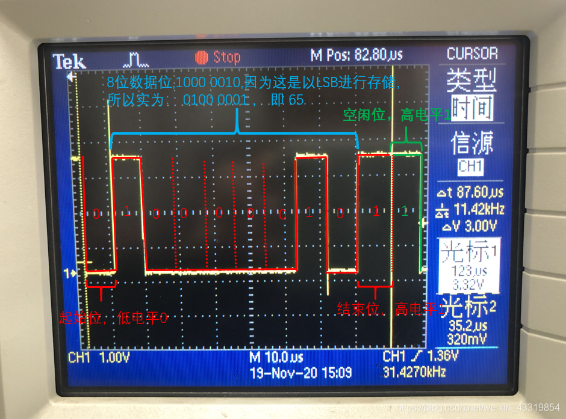

--

UART的全称是通用异步收发器（Universal Asynchronous Receiver/Transmitter），

是实现设备之间低速数据通信的标准协议，

**异步指不需要额外的时钟线进行数据的同步传输。**

UART是一种串行总线接口，且只需占用两根线就可以完成数据的收发（一根接收数据，另外一根发送数据），

常用的标准波特率有9600bps、115200bps等。


UART没有数据传输时，总线为HIGH，当需要数据传输时，首先发送一个起始位，即一个低电平信号。

**需要起始位的原因是，**

UART没有控制线，数据的传输只有一根线，如果想要让接收方知道什么时候开始接收数据，则需要在发送数据前，先发一位低电平信号作为数据发送的起始标志，接收方在空闲时，当检测到有一个低电平，则开始逐位接收数据。

# 报文格式

通过抓取串口波形，对串口的报文格式有了进一步了解，串口报文格式为：

起始位（1bit）+ 数据位（5~8bit）+ 奇偶校验位（1bit）+ 停止位（1~1.5bit）

在发送完成一组报文后，会自动产生1 bit 的空闲位，以便进行下一组数据的传输。



# uart通信数据解析

下面是一个简单的示例代码，用于从串口接收数据并识别出一个完整的数据帧。该示例假设数据帧以特定的起始标志和结束标志进行标识，数据帧格式为起始标志 + 数据内容 + 结束标志。

```c
#include <stdio.h>
#include <stdlib.h>
#include <string.h>

#define BUFFER_SIZE 1024
#define START_FLAG 0xAA
#define END_FLAG 0x55

typedef struct {
    unsigned char* buffer;
    int size;
    int capacity;
} SerialBuffer;

void initializeBuffer(SerialBuffer* buffer, int capacity) {
    buffer->buffer = (unsigned char*)malloc(capacity * sizeof(unsigned char));
    buffer->size = 0;
    buffer->capacity = capacity;
}

void appendToBuffer(SerialBuffer* buffer, unsigned char data) {
    if (buffer->size < buffer->capacity) {
        buffer->buffer[buffer->size] = data;
        buffer->size++;
    }
}

void clearBuffer(SerialBuffer* buffer) {
    buffer->size = 0;
}

void processFrame(SerialBuffer* buffer) {
    // 检查起始标志
    if (buffer->buffer[0] != START_FLAG) {
        printf("Invalid frame: Missing start flag\n");
        return;
    }

    // 检查结束标志
    if (buffer->buffer[buffer->size - 1] != END_FLAG) {
        printf("Invalid frame: Missing end flag\n");
        return;
    }

    // 提取数据内容
    int dataSize = buffer->size - 2;
    unsigned char* data = (unsigned char*)malloc(dataSize * sizeof(unsigned char));
    memcpy(data, buffer->buffer + 1, dataSize);

    // 处理数据帧
    printf("Received frame with data: ");
    for (int i = 0; i < dataSize; i++) {
        printf("%02X ", data[i]);
    }
    printf("\n");

    free(data);
}

void processReceivedData(unsigned char* receivedData, int dataSize, SerialBuffer* buffer) {
    for (int i = 0; i < dataSize; i++) {
        unsigned char data = receivedData[i];

        // 如果是起始标志，则清空缓冲区并添加到缓冲区
        if (data == START_FLAG) {
            clearBuffer(buffer);
        }

        appendToBuffer(buffer, data);

        // 如果是结束标志，则处理数据帧
        if (data == END_FLAG) {
            processFrame(buffer);
            clearBuffer(buffer);
        }
    }
}

int main() {
    SerialBuffer buffer;
    initializeBuffer(&buffer, BUFFER_SIZE);

    unsigned char receivedData[] = {0xAA, 0x01, 0x02, 0x03, 0x55, 0xAA, 0x04, 0x05, 0x55};

    processReceivedData(receivedData, sizeof(receivedData) / sizeof(receivedData[0]), &buffer);

    free(buffer.buffer);

    return 0;
}
```

在示例代码中，`SerialBuffer`结构体表示串口数据缓冲区，包含了缓冲区的数据、大小和容量。

`initializeBuffer()`函数用于初始化缓冲区。

`appendToBuffer()`函数用于将接收到的数据追加到缓冲区。

`clearBuffer()`函数用于清

空缓冲区。

`processFrame()`函数用于处理一个完整的数据帧，包括检查起始标志、结束标志，并提取数据内容进行进一步处理。

`processReceivedData()`函数用于处理接收到的数据流，遍历接收到的数据，根据起始标志和结束标志来判断并处理完整的数据帧。

在`main()`函数中，模拟接收到的数据流，然后调用`processReceivedData()`函数进行处理。

请注意，这只是一个简单的示例，实际的实现可能需要根据具体的通信协议和数据帧格式进行适当的调整和扩展。您需要根据自己的需求和通信协议规范来修改代码以适应您的环境和要求。

# ttyS的 read函数什么时候可以读取到数据

在串口通信中，使用 `read()` 函数从 `ttyS` 设备读取数据时，以下情况下可以读取到数据：

1. 数据已经到达缓冲区：当串口接收到数据后，数据将被存储在接收缓冲区中。在这种情况下，`read()` 函数将从接收缓冲区读取数据，并返回接收到的字节数。

2. 缓冲区已有数据：即使没有新的数据到达，但是之前已经接收到的数据仍然存储在接收缓冲区中。此时，`read()` 函数可以从接收缓冲区读取先前接收到的数据。

需要注意的是，`read()` 函数是一个阻塞函数，它会一直等待直到满足以下条件之一才返回：

- 接收缓冲区中有数据可读取。
- 发生了错误或遇到了文件结束。

如果没有数据可读取，`read()` 函数将一直等待，直到有数据可用或出现错误（例如超时或读取错误）。

可以通过在打开串口设备时设置串口的超时机制（通过 `fcntl()` 函数和 `F_SETFL` 命令设置 `O_NONBLOCK` 标志）来将 `read()` 函数设置为非阻塞模式。在非阻塞模式下，`read()` 函数会立即返回，无论是否有数据可读取。

总之，`read()` 函数可以在接收缓冲区中有数据可读取时读取到数据。可以使用循环和适当的条件来读取和处理串口接收到的数据。

# 是有一个字节到到缓冲区，read函数就返回吗？

不一定。`read()` 函数的行为取决于底层的输入设备和读取操作的设置。

当有一个字节到达缓冲区时，`read()` 函数可能返回该字节，也可能继续等待更多的数据。这取决于以下几个因素：

1. 阻塞模式 vs 非阻塞模式：如果串口设备处于阻塞模式，`read()` 函数将一直等待，直到至少有指定的字节数可读取，或者发生错误或文件结束。在非阻塞模式下，`read()` 函数可能在缓冲区中有一个字节时立即返回。

2. 缓冲区的可用数据量：如果缓冲区中有可读取的数据，但不满足指定的读取字节数，`read()` 函数可能会等待更多的数据到达，直到满足读取条件。

3. 读取设置和标志：使用 `fcntl()` 函数可以设置串口设备的读取行为，如设置超时时间、最小读取字节数等。这些设置可以影响 `read()` 函数的返回行为。

需要注意的是，即使 `read()` 函数在有一个字节到达缓冲区时返回，也不能保证该字节就是一个完整的数据帧的一部分。串口通信中的数据通常以数据帧的形式传输，可能需要读取多个字节才能获取完整的数据帧。

因此，为了正确处理数据帧，您可能需要根据具体的通信协议和数据帧格式，使用循环读取足够的字节数，并进行适当的解析和处理，以确保完整的数据帧的接收和处理。

# 缓冲区的可用数据量 怎么配置参数

在串口通信中，控制缓冲区可用数据量的参数配置通常由串口驱动程序或串口库提供的设置选项来完成。具体的配置方法可能因使用的串口驱动程序或库而有所不同。以下是一些常见的配置参数和方法：

1. 输入缓冲区大小：输入缓冲区用于存储从串口接收到的数据。它的大小决定了可以存储的最大数据量。在设置串口参数时，可以通过设置 `termios` 结构体中的 `c_cc[VMIN]` 和 `c_cc[VTIME]` 字段来控制输入缓冲区的行为。

   - `c_cc[VTIME]` 表示等待数据的最长时间（以十分之一秒为单位），当输入缓冲区中有数据可读时，定时器开始计时。如果超过指定的时间而输入缓冲区中没有足够的数据可读，则 `read()` 函数将返回。设置为0表示不启用定时器。
   - `c_cc[VMIN]` 表示读取数据的最小字节数。当输入缓冲区中的数据达到或超过指定的最小字节数时，`read()` 函数将返回。设置为0表示不需要满足最小字节数的要求。

2. 输出缓冲区大小：输出缓冲区用于存储要通过串口发送的数据。它的大小决定了可以存储的最大数据量。在设置串口参数时，可以通过 `termios` 结构体中的 `c_cc[VMIN]` 和 `c_cc[VTIME]` 字段来控制输出缓冲区的行为。

   - 对于输出缓冲区，`c_cc[VTIME]` 和 `c_cc[VMIN]` 字段的设置与输入缓冲区的设置无关。

3. 驱动程序或库提供的配置选项：某些串口驱动程序或串口库提供了额外的配置选项，允许您调整缓冲区的大小、阈值或其他行为。这些选项通常是通过调用特定的函数或使用特定的 API 来进行配置。

   - 例如，在 Linux 中，可以使用 `termios` 结构体和 `tcsetattr()` 函数来配置串口参数，包括输入缓冲区大小和输出缓冲区大小。

需要注意的是，具体的参数配置方法取决于您使用的操作系统、串口驱动程序和库。建议查阅相关的文档和手册，以了解如何在特定平台上配置串口缓冲区的可用数据量。


```
    options.c_cc[VTIME] = 0;
    options.c_cc[VMIN] = 1; //至少读取1个，否则阻塞
```


# tcflush(uart_fd, TCIOFLUSH);

`tcflush()` 是一个函数，用于刷新（清空）串口的输入和输出缓冲区。它的原型定义如下：

```c
int tcflush(int fd, int queue_selector);
```

其中，`fd` 是串口的文件描述符，`queue_selector` 是一个参数，用于指定要刷新的队列。

常用的 `queue_selector` 值有以下几种：

- `TCIFLUSH`：刷新输入队列，即清空接收缓冲区中的数据。
- `TCOFLUSH`：刷新输出队列，即清空发送缓冲区中的数据。
- `TCIOFLUSH`：同时刷新输入和输出队列，即清空接收缓冲区和发送缓冲区中的数据。

`tcflush()` 函数在应用程序中调用时，可以使用适当的 `queue_selector` 参数来清空串口的输入或输出缓冲区，以确保缓冲区中不包含任何未处理的数据。

例如，`tcflush(uart_fd, TCIOFLUSH)` 将清空串口的输入和输出缓冲区，丢弃任何未处理的数据。

需要注意的是，调用 `tcflush()` 函数并不会关闭或重新打开串口设备，它只清空缓冲区中的数据。如果需要重新初始化串口设备的其他参数，例如波特率、数据位数等，需要使用 `tcsetattr()` 函数进行配置。

请确保在调用 `tcflush()` 函数之前已经打开了正确的串口设备，并且将其文件描述符（`uart_fd`）传递给函数。

# 参考资料

1、UART概述（上）

https://blog.csdn.net/Sisyphus415/article/details/124717765

2、

这篇有示波器波形说明，很具体。

https://blog.csdn.net/weixin_43319854/article/details/109844860