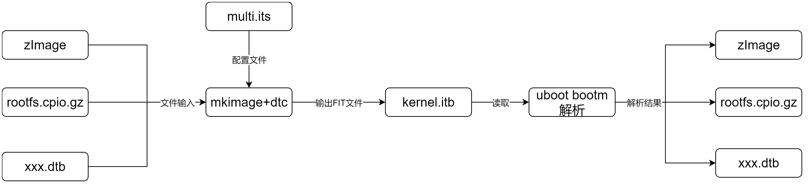

# 基本信息

这些信息是从https://github.com/u-boot/u-boot readme的内容总结得到的。

## summary

uboot的开发跟Linux紧密相关。

有些代码是直接从Linux kernel那边拿过来的。

有一些公用的头文件。

还有些特殊代码用来支持Linux的启动。

## 项目由来

1、最早是8xxrom的代码。

2、创建了PPCboot project。PPC是PowerPC的缩写。

3、然后增加了对其他的板子的支持。

4、创建ARMBoot project。

5、增加其他CPU支持。

6、创建u-boot project。

## 软件配置

make xx_defconfig

## sandbox环境

## 板子init flow

首先是架构相关的start.S汇编是入口。

```
lowlevel_init
board_init_f
board_init_r
```

## image format

两种格式：

1、New uImage format (FIT)。基于 Flattened Image Tree 。文档在 doc/uImage.FIT 

2、Old uImage format。

## Linux支持


# sandbox

在这个doc\driver-model\README.txt文件里。

看到有这样的说明：

```
   make sandbox_defconfig
   make
   ./u-boot -d u-boot.dtb
```

看来是一个类似于qemu的可以在本机执行进行测试的配置。

看看。

# FIT image

Linux kernel在ARM架构中引入device tree（全称是flattened device tree，后续将会以FDT代称）的时候[1]，

其实怀揣了一个Unify Kernel的梦想----同一个Image，可以支持多个不同的平台。

随着新的ARM64架构将FDT列为必选项，并将和体系结构有关的代码剥离之后，这个梦想已经接近实现：


本文将基于嵌入式产品中普遍使用的u-boot，

**以其新的uImage格式（FIT image，Flattened uImage Tree）为例，**

介绍达到此目标的步骤，以及背后的思考和意义。


为了解决上述缺点，u-boot自定义了一种Image格式----uImage。

最初的时候，uImage的格式比较简单，

就是为二进制文件加上一个header（具体可参考“[include/image.h](https://github.com/wowotechX/u-boot/blob/x_integration/include/image.h)”中的定义），

标示该文件的特性。

然后在boot该类型的Image时，从header中读取所需的信息，按照指示，进行相应的动作即可。

这种原始的Image格式，称作Legacy uImage，其特征可总结为：

1）使用mkimage工具（位于u-boot source code的tools/mkimage中）生成。

2）支持OS Kernel Images、RAMDisk Images等多种类型的Image。

3）支持gzip、bzip2等压缩算法。

4）支持CRC32 checksums。

5）等等。

最后，之所以称作Legacy，说明又有新花样了，这种旧的方式，我们就不再过多关注了，拥抱新事物去吧。


device tree在ARM架构中普及之后，u-boot也马上跟进、大力支持，

毕竟，美好的Unify kernel的理想，需要bootloader的成全。

为了支持基于device tree的unify kernel，u-boot需要一种新的Image格式，这种格式需要具备如下能力：

1）Image中需要包含多个dtb文件。

2）可以方便的选择使用哪个dtb文件boot kernel。


综合上面的需求，u-boot推出了全新的image格式----FIT uImage，

其中FIT是flattened image tree的简称。

是不是觉得FIT和FDT（flattened device tree）有点像？

没错，它利用了Device Tree Source files（DTS）的语法，

生成的image文件也和dtb文件类似（称作itb），下面我们会详细描述。

为了简单，我们可以直接把FIT uImage类比为device tree的dtb文件，其生成和使用过程为[2]：

> image source file    mkimage + dtc              transfer to target
>       \+        -----------------------------> image file -----------------------------------> bootm
> image data file(s)

其中image source file(.its)和device tree source file(.dts)类似，

负责描述要生成的image file的信息（上面第2章描述的信息）。

mkimage和dtc工具，可以将.its文件以及对应的image data file，打包成一个image file。

我们将这个文件下载到么memory中，**使用bootm命令就可以执行了。**


image source file的语法和device tree source file完全一样（可参考[3][4][5]中的例子），

只不过自定义了一些特有的节点，包括images、configurations等。


## 命名

Kernel中引入的Device Trace概念，将配置信息放入dtb中。达到一个kernel，结合不同dtb适配多个平台。

FIT是Flattened Image Tree的意思，即将多个镜像通过dts语法编译生成一个镜像文件。

==uboot支持编写its文件，通过mkimage和dtc创建kernel、ramdisk、dtb等等文件的打包镜像。==

这里的dts文件通常命名为.its，输出的镜像文件通常命名.itb。

## 工具

安装mkimage工具：

```
sudo apt install  u-boot-tools
```

还需要安装dtc：

```
sudo apt-get install device-tree-compiler
```

mkimage调用dtc创建itb文件。

## FIT镜像的创建流程

创建FIT镜像的命令：

```
mkimage -f multi.its fit.itb
```

查看FIT镜像头：

```
mkimage -l fit.itb
```

its(image tree source)是创建FIT镜像的配置脚本，itb(flattened image tree blob)是FIT镜像。



## its文件的示例

```
/dts-v1/;

/ {
    description = "Various kernels, ramdisks and FDT blobs";--对本镜像的描述。
    #address-cells = <1>;--下面load/entry属性的格式，1表示只有一个地址。
　　timestamp = <12399321>--镜像修改时间。
    images {--镜像节点，必须包含一个子节点。
        kernel-1 {--子节点名称。
            description = "Linux ARM kernel";--子节点描述。
            data = /incbin/("arch/arm/boot/zImage");--子节点二进制数据。
            type = "kernel";--子节点类型为IH_TYPE_KERNEL，可以是"standalone", "kernel", "kernel_noload", "ramdisk", "firmware", "script","filesystem", "flat_dt"等。            arch = "arm";--架构名称，比如arm等。
            os = "linux";--OS名称。
            compression = "none";--对data使用的压缩算法。
            load = <0x830000e8>;--本数据加载到的地址，注意地址要正确。
            entry = <0x830000e8>;--镜像启动入口地址。Linux的load地址也是entry地址。
            hash-1 {--使用md5进行哈希。哈希值存放于value属性中。
                algo = "crc32";--支持的hash算法包括：crc32、md5、sha1、sha256。
            };
            hash-2 {--使用sha256进行哈希。
                algo = "sha256";
            };
        };

        ramdisk {
            description = "Linux ramdisk";
            data = /incbin/("rootfs.cpio.gz");
            type = "ramdisk";--数据类型为ramdisk，对应类型为IH_TYPE_RAMDISK。
            arch = "arm";
            os = "linux";
            compression = "none";--注意这里的数据虽然被gzip压缩了，但是不需要uboot处理。所以uboot认为的数据压缩类型为none。
            hash-1 {
                algo = "crc32";
            };
        };

        kernel-fdt {
            description = "NAND FDT blob";
            data = /incbin/("nand.dtb");
            type = "flat_dt";
            arch = "arm";
            compression = "none";　　　　　　　load = <0x86F00000>;
            hash-1 {
                algo = "crc32";
            };
        };

        ramdisk-fdt {
            description = "RAMDISK FDT blob";
            data = /incbin/("ramdisk.dtb");
            type = "flat_dt";--子镜像类型为flat_dt，对应类型为IH_TYPE_FLATDT。
            arch = "arm";
            compression = "none";
            load = <0x86F00000>;--dtb加载到指定地址。
            hash-1 {
                algo = "sha1";
            };
        };
    };

    configurations {--提供对上述镜像的组合，有默认配置和多种配置可选。
        default = "kernel";--默认配置，bootm未指定特殊配置时使用。

        kernel {--配置名称。加载zImage和nand.dtb，rootfs从NAND中获取。
            description = "Boot Linux kernel with FDT blob";--配置说明。
            kernel = "kernel";
            fdt = "kernel-fdt";
        };

        ramdisk {--加载zImage和dtb，文件系统通过rootfs.cpio.gz解压作为ramdisk使用。
            description = "Boot Linux kernel with FDT blob and ramdisk";
            kernel = "kernel";--指向kernel类型镜像。
            ramdisk = "ramdisk";--指向ramdisk类型镜像。
            fdt = "ramdiskfdt";--指向flat_dt类型数据。
        };

    };
};
```


完整语法：

https://docs.u-boot.org/en/stable/usage/fit/source_file_format.html#root-node-properties

## 参考资料

1、u-boot FIT image介绍

http://www.wowotech.net/u-boot/fit_image_overview.html

2、

https://www.cnblogs.com/arnoldlu/p/17912109.html

# 重要的文件

```
include\image.h
include\bootstage.h
```


# DECLARE_GLOBAL_DATA_PTR 

在U-Boot的源码中，使用了寄存器r9来表示全局数据结构gd。

> ​          \#define DECLARE_GLOBAL_DATA_PTR   register [volatile](https://so.csdn.net/so/search?q=volatile&spm=1001.2101.3001.7020) gd_t *gd asm ("r9")

那么，到底应该如何定义一个寄存器变量呢？从GCC的使用手册中可知，定义如下：

> ​                         register int *foo asm ("reg");


其中register关键字是必须的，

asm ("reg")为嵌入式汇编，

表示用reg寄存器存储gd指针，

reg和CPU体系结构相关。

需要注意的是，不能使用static const 和volatile等限定符，

否则，预期可能与你设想的相反。

特别需要主要的是volatile，

就算加了也是阻止不了编译器优化的（U-Boot的定义是不符合GCC编译器规范的，如果你用grep DECLARE_GLOBAL_DATA_PTR -nr 命令在U-Boot源码中查找，你就会发现，有的定义就没有volatile）。


定义寄存器变量，单有上面的定义还是不行的。

因为，你虽然申明了使用reg来表示foo指针，

但编译器还是会是使用reg去作其他的用途（参数传递等等）。

如果想让编译器不使用reg寄存器作其他用途，

则还需要使用‘-ffixed-reg’ 编译选项告诉编译器reg寄存器是固定用途寄存器。

在arch/arm/config.mk文件中，可以找到‘-ffixed-reg’选项（U-Boot使用了r9寄存器）：

> ​             PLATFORM_RELFLAGS += -ffunction-sections -fdata-sections \
> ​                        -fno-common -ffixed-r9


参考资料

1、如何理解U-Boot中的#define DECLARE_GLOBAL_DATA_PTR register volatile gd_t *gd asm ("r9")

https://blog.csdn.net/xunmengxiaozi/article/details/100176690

# 对aarch64的启动

```
Essentially, the boot loader should provide (as a minimum) the
following:

1. Setup and initialise the RAM
2. Setup the device tree
3. Decompress the kernel image
4. Call the kernel image
```

```
The device tree blob (dtb) must be placed on an 8-byte boundary and must
not exceed 2 megabytes in size.
```

dtb不能超过2M的大小。

解压内核镜像

这个bootloader可以选择进行解压。

Image.gz的头部有这样的信息：

```
The decompressed kernel image contains a 64-byte header as follows::

  u32 code0;			/* Executable code */
  u32 code1;			/* Executable code */
  u64 text_offset;		/* Image load offset, little endian */
  u64 image_size;		/* Effective Image size, little endian */
  u64 flags;			/* kernel flags, little endian */
  u64 res2	= 0;		/* reserved */
  u64 res3	= 0;		/* reserved */
  u64 res4	= 0;		/* reserved */
  u32 magic	= 0x644d5241;	/* Magic number, little endian, "ARM\x64" */
  u32 res5;			/* reserved (used for PE COFF offset) */
```

# autoboot

基本的autoboot选项是：

```
  bootdelay
  bootcmd
  CONFIG_BOOTDELAY
  CONFIG_BOOTCOMMAND
```

doc\README.autoboot


cat u-boot.bin u-boot.dtb >image.bin

# hush脚本支持

Hush Parser是U-Boot中的一种解释器，用于解析并执行Hush脚本语言中的命令。Hush是U-Boot的命令解释器，类似于Linux中的Bash或其他Shell。它允许用户在U-Boot的命令行界面中输入和执行命令，以及编写和运行脚本。

Hush Parser的工作原理如下：

1. **解析命令行输入：** 当用户在U-Boot的命令行中输入命令时，Hush Parser负责解析这些输入。它会识别并分析命令行中的命令、选项和参数。

2. **执行命令：** 解析器识别命令后，会执行相应的操作。这可能涉及到调用U-Boot内部的函数或外部设备的操作。

3. **执行脚本：** Hush Parser也能够解析和执行Hush脚本文件。用户可以编写包含一系列U-Boot命令的脚本文件，并通过Hush解释器执行这些脚本。

4. **错误处理：** 解析器还负责处理用户输入中的错误，并向用户提供相应的错误信息或警告。

Hush Parser在U-Boot中扮演着重要的角色，它使用户能够更方便地与U-Boot进行交互，并自动化执行一系列命令操作。


Hush是U-Boot中使用的一种脚本语言，用于编写和执行脚本以自动化一系列命令操作。下面是对Hush脚本语言的简要介绍：

1. **语法：** Hush的语法类似于Bourne shell（如Bash），但是更加简单。它支持基本的语句、条件语句、循环语句、变量赋值、函数定义等基本结构。

2. **注释：** 使用`#`字符可以注释一行代码，注释部分将被忽略。

3. **变量：** 变量在Hush中使用`$`符号进行引用，变量名不需要事先声明。例如，`$var`表示变量`var`的值。

4. **条件语句：** Hush支持类似于Bash的`if-then-else`语句用于条件判断。语法如下：
   ```
   if condition; then
       commands
   elif condition; then
       commands
   else
       commands
   fi
   ```

5. **循环语句：** Hush支持`for`和`while`循环，用于迭代执行一系列命令。语法如下：
   ```
   for var in list; do
       commands
   done
   ```
   或者
   ```
   while condition; do
       commands
   done
   ```

6. **函数定义：** 可以使用`function`关键字定义函数，并在需要时调用它们。语法如下：
   ```
   function name {
       commands
   }
   ```

7. **命令替换：** 可以使用反引号（`）或 `$()` 来执行命令并将其输出结果赋值给变量。例如：
   ```
   output=`ls`
   或者
   output=$(ls)
   ```

8. **特殊变量：** Hush中有一些特殊的预定义变量，如`$#`表示参数个数，`$?`表示上一个命令的返回值等。

这是Hush脚本语言的基本概述。使用Hush脚本语言，用户可以编写自定义的脚本来自动化U-Boot环境中的一系列操作，提高工作效率。

# bl33z 是做什么的

BL33z 是 U-Boot 中的一个特定版本或分支，通常用于处理 ARM 架构的启动加载阶段。

BL33z 通常是指 U-Boot 的 SPL（Secondary Program Loader）或 TPL（Third Program Loader）的扩展版本，用于引导和加载操作系统内核（比如 Linux 内核）。

在 ARM 架构中，启动过程通常包括三个阶段：

1. **Primary Program Loader（PPL）**：通常是 SoC（System on Chip）内部的 ROM Bootloader，用于引导 SPL 或 TPL。

2. **Secondary Program Loader（SPL）**：负责引导和初始化 U-Boot 的一部分，通常包括基本的初始化代码和引导设备的功能。SPL 通常被设计成非常小巧，以适应在启动时加载，以及在系统中不断减少内存占用。

3. **Third Program Loader（TPL）**：在某些 ARM 架构中，TPL 是 SPL 的进一步分割，用于更细粒度地管理启动过程。TPL 在 SPL 之后运行，用于进一步引导操作系统内核。

BL33z 通常指 SPL 或 TPL 的变种，用于处理引导和加载操作系统内核的工作。BL33z 的目标是优化和改进 SPL 或 TPL 的功能，以更有效地引导和加载操作系统内核，同时保持启动过程的可靠性和稳定性。

因此，BL33z 可能包含一些特定的功能或优化，以适应特定的硬件平台或应用场景。

# 默认环境变量

include\env_default.h

```
const uchar default_environment[] = {
这个结构体包含了默认的环境变量。
在最后包含了每个板子自己定义的CONFIG_EXTRA_ENV_SETTINGS
```

# CONFIG_SYS_MAXARGS

`CONFIG_SYS_MAXARGS` 是 U-Boot 中的一个配置选项，用于定义命令行输入的最大参数数量。这个选项规定了在 U-Boot 命令行中可以一次性输入的最大参数数量，包括命令本身在内。

这个选项的默认值通常是 16，但是可以根据具体的需求进行调整。如果你的应用程序或者特定的使用场景需要更多的参数，你可以增加这个值，反之亦然。

增加 `CONFIG_SYS_MAXARGS` 可以增加命令行的灵活性，允许用户在 U-Boot 命令行中一次性输入更多的参数，这在一些复杂的操作或者特定的应用场景中可能非常有用。但是，需要注意的是增加这个值可能会占用更多的内存空间，因为 U-Boot 在解析命令行参数时需要分配额外的内存空间来存储这些参数。

在 U-Boot 的配置文件（通常是 `include/configs/xxx.h`）中，你可以找到并修改 `CONFIG_SYS_MAXARGS` 的定义，以调整命令行参数的最大数量，例如：

```c
#define CONFIG_SYS_MAXARGS 32
```

这样就将 `CONFIG_SYS_MAXARGS` 的值增加到 32，允许命令行输入的最大参数数量为 32。

# 参考资料

1、

