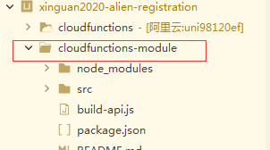

1

hbuilder默认有提供一个hello-cloud的例子项目。直接新建测试运行一下。

大部分很简单，就是common模块这里，安装官方文档操作一遍才能正常运行。

使用的npm命令，可以是系统安装的npm命令。不需要指定hbuilder内部的npm。

但是看出入人员登记系统的，它的云开发复杂一些。

cloudfunctions下面的，都是编译得到的。可读性不好。

代码是写在cloudfunctions-module下面的。这个是怎么做的？



这个并不是官方的规定做法，只是这个项目的开发人员自己的一个做法。

看build-api.js。这个就是把cloudfunctions-module里的内容处理后，输出到cloudfunctions里。

```
const apiPath = path.resolve(__dirname, 'src/api')
const distPath = path.resolve(__dirname, '../cloudfunctions-aliyun/')

if (apiList.length === 0) {
	apiList = fs.readdirSync(apiPath)
}
```

使用了rollup这个打包工具。专门写一篇文章来梳理一下rollup的用法。

云函数目录为`api/functionName/functionName.js`，打包云函数后在`cloudfunctions-aliyun`下对应目录生成云函数`index.js`


参考资料

https://uniapp.dcloud.io/uniCloud/cf-common