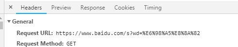

--

如果URL中有汉字，就必须编码后使用。

但是麻烦的是，RFC 1738没有规定具体的编码方法，

而是交给应用程序（浏览器）自己决定。

这导致"URL编码"成为了一个混乱的领域。

下面就让我们看看，"URL编码"到底有多混乱。

我会依次分析四种不同的情况，

在每一种情况中，浏览器的URL编码方法都不一样。

把它们的差异解释清楚之后，我再说如何用Javascript找到一个统一的编码方法。

输入网址`http://zh.wikipedia.org/wiki/春节`。注意，"春节"这两个字此时是网址路径的一部分。

实际在http请求里，是这样：

```
http://zh.wikipedia.org/wiki/%E6%98%A5%E8%8A%82
```

实际上把春节这2个字节的unicode码前面加上%得到的。

**结论1就是，网址路径的编码，用的是utf-8编码。**

然后看看query里有汉字的情况。

```
http://www.baidu.com/s?wd=春节
```

在chrome里，还是utf-8编码。




实际上，escape()不能直接用于URL编码，

它的真正作用是返回一个字符的Unicode编码值。

比如"春节"的返回结果是%u6625%u8282，

也就是说在Unicode字符集中，

"春"是第6625个（十六进制）字符，"节"是第8282个（十六进制）字符。

encodeURI()是Javascript中真正用来对URL编码的函数。


参考资料

1、

http://www.ruanyifeng.com/blog/2010/02/url_encoding.html