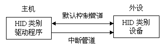
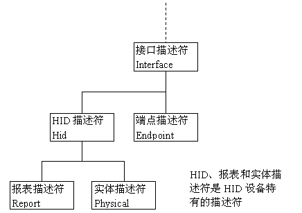
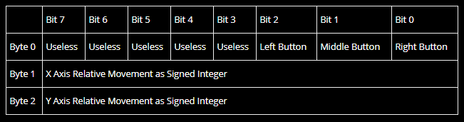
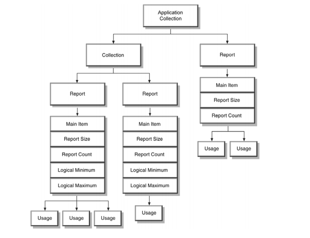
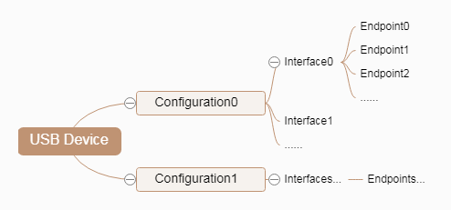
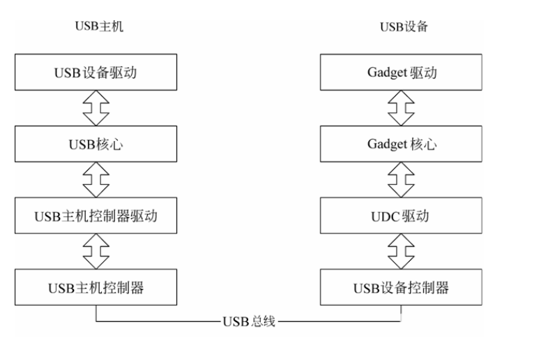
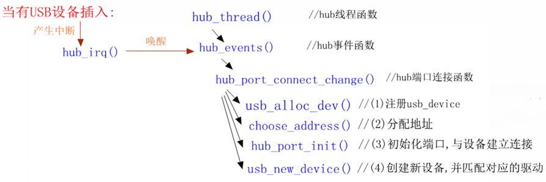
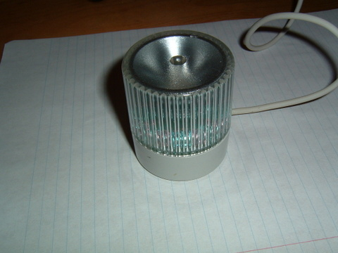

--

示例代码：

```
import hid

vid = 0x093a	# Change it for your device
pid = 0x2510	# Change it for your device

with hid.Device(vid, pid) as h:
	print(f'Device manufacturer: {h.manufacturer}')
	print(f'Product: {h.product}')
	print(f'Serial Number: {h.serial}')
```

运行报错，

```
Unable to load any of the following libraries hidapi.dll
```

https://github.com/libusb/hidapi/releases

这里下载压缩包，解压，把x86目录下的库文件放到到C:\Windows\System32。我尽量用win32的。

因为这样可以保证在32位和64位的电脑上都可以用。

但是下载运行还是提示找不到对应的库。


```
OSError: [WinError 193] %1 不是有效的 Win32 应用程序
```

Python调试出现OSError: [WinError 193] %1 不是有效的 Win32 应用程序，

一般来讲是因为python位数和dll位数不一样导致的，dll是32位的，而python是64位的。

我的系统是64位Win7安装了64位的python，当调用32位dll（比如32位的ODBC驱动）的时候，就报错。

如何解决：

1、安装64位的dll（一般很难找到）

2、安装32位的python


为了最好的兼容性，我考虑这种涉及底层硬件操作的。

python用2.7版本的，32位的。

```
from __future__ import print_function

import hid

vid = 0x093a	# Change it for your device
pid = 0x2510	# Change it for your device

with hid.Device(vid, pid) as h:
	print(h.manufacturer)
	print(h.product)
```

现在这样hid可以读出信息来。


HID设备的描述符除了5个USB的标准描述符（设备描述符、配置描述符、接口描述符、端点描述符、字符串描述符，见[百合电子工作室](http://www.baiheee.com/)的另一篇文章：[USB开发基础－－USB命令（请求）和USB描述符](http://www.baiheee.com/Documents/090518/090518112619.htm)）外，

还包括3个HID设备类特定描述符：

HID描述符、

报告描述符、

实体描述符。


HID设备的报告描述符比较复杂也比较难理解。

报告描述符的语法不同于USB标准描述符，

它是以项目（items）方式排列而成，无一定的长度。

HID的报告描述符已经不是简简单单的描述某个值对应某个固定意义了，

它已经能够组合出很多种情况，

并且需要PC上的HID驱动程序提供parser解释器来对描述的设备情形进行重新解释，

**进而组合生成出本HID硬件设备独特的数据流格式，**

所以我觉得可以把它理解为“报告描述符脚本语言”更为贴切。

我们使用“报告描述符”专用脚本语言，

让用户来自己定义他们的HID设备都有什么数据、以及这些数据各个位（bit）都有什么意义。


有关报告描述符的详细信息可参考USB HID协议，

*USB* 协会提供了一个*HID* 描述符编辑工具称作*HID Descriptor Tool，用它可方便生成我们的报告描述符。*

例如鼠标报告的就是位置信息，

```
@ 11:41:16 139 +8.0
Device[4]:  InputMouse
LB MB RB 4B 5B   Xcnts   Ycnts  Zdelta  Hdelta
1  0  0  0  0        0      -2       0       0

@ 11:41:16 147 +7.7
Device[4]:  InputMouse
LB MB RB 4B 5B   Xcnts   Ycnts  Zdelta  Hdelta
1  0  0  0  0       -1      -2       0       0
```


键盘报告的就是按键信息。

```
@ 11:39:56 350 +551.4
Device[2]:  InputKeyboard
Vkey   Event  E[1:0]  Scancode
50      Make      00        19

@ 11:39:56 531 +180.7
Device[2]:  InputKeyboard
Vkey   Event  E[1:0]  Scancode
50     Break      00        19

```


实体描述符被用来描述设备的行为特性。

实体描述符是可选的描述符，

HID设备可以根据其本体的设备特性选择是否包含实体描述符。


HID设备类特定的命令（请求）有6个，

它们分别是

Get_Report、

Get_Idle、

Get_Protocol、

Set_Report、

Set_Idle

Set_Protocol。


USB主机在请求HID设备的配置描述符时，

设备首先返回的描述符为：

配置描述符、接口描述符、HID描述符、端点描述符。

HID描述符里包含了其附属的描述的类型和长度（如报告描述符），

然后主机再根据HID描述符的信息请求其相关的描述符。


HID协议有其局限性，

但所有现代主流操作系统都识别标准USB HID设备（例如键盘和鼠标），而无需专门的驱动程序。

在设备安装时，屏幕上可能呈现“一个‘HID兼容设备’已安装”消息。


HID协议中有两个实体：主机（host）和设备（device）。

设备是直接与人类交互的实体，例如键盘或鼠标；

主机则是负责与设备通信并接收人类在设备上输入的数据。

输出数据则是主机传送给设备，设备再展现给人类。

最常见的主机就是PC，但有些手机和PDA也可作为主机。


HID协议使得设备的实现非常简单。

设备定义它们的数据包，然后向主机呈递“HID描述符”。

HID描述符是描述设备的数据包的硬编码字节数组，其中包括：

设备支持多少个数据包，数据包大小，以及数据包中各个字节和比特的目的。

例如，计算器程序的键盘按钮可以告诉主机，该按钮的按压/松开状态被存储为数据包4号中第6个字节中的第2比特（注意：这些位置仅为说明目的，并且依设备而不同）。

设备通常将HID描述符存储在ROM中，并且不需要本质上理解或解析HID描述符。

目前市场上的一些鼠标和键盘硬件仅使用8位[CPU](https://zh.wikipedia.org/wiki/中央处理器)来实现。


主机的预期是比设备更复杂的实体。

主机需要检索来自设备的HID描述符，并需要解析它才可以与设备进行完全通信。

解析HID描述符可能很复杂。

已知有多个操作系统的负责解析HID描述符的驱动程序在发布给公众几年后被发现存在缺陷。

但是，这种复杂性也成就了HID设备的快速创新。


上述机制描述了什么是HID“报告协议”。

因为可以理解并非所有主机都能够解析HID描述符，

HID还定义了“引导协议”（boot protocol）。

因为引导协议中使用固定的数据包格式，所以只支持特定功能的特定设备。

在该模式中不使用HID描述符，因此创新是有限的，但好处是可以在无法支持HID的主机上仍可实现有限的功能。


鼠标只有X轴、Y轴和前3个按钮可用。鼠标上的任何额外功能将不可用。


USB－HID是Human Interface Device的缩写，属于人机交互操作的设备，

如USB鼠标，USB键盘，USB游戏操纵杆，USB触摸板，USB轨迹球、电话拨号设备、VCR遥控等等设备。

 TPYBV101除了具有usb host功能以外，还可作为USB－HID设备来应用，

这里重点讲述如果作为鼠标和键盘使用。


TPYBV101作为鼠标的应用可以参考micropython官方实例中的usb-mouse应用。这里以官方实例为例。


而pc端上的”HID”一般指的是USB-HID标准，更多指微软在USB委员会上提议创建的一个人体学输入设备工作组。


**HID标准概念之后，**所有HID定义的设备驱动程序提供可包含任意数量数据类型和格式的自我描述包。计算机上的单个HID驱动程序就可以解析数据和实现数据[I/O](https://link.zhihu.com/?target=https%3A//zh.wikipedia.org/wiki/I/O%22%20%5Co%20%22I/O)与应用程序功能的动态关联。


HID attack 通过插入带有攻击向量的USB设备等方式，恶意代码直接就被加载执行，攻击操作也就瞬时发生。此类方式属于物理层面攻击。

相对来说，攻击者控制了用户的键盘，则就可以说控制了对方主机的权限。


既然，USB插得有可能是移动储存设备，也有可能是类似键盘鼠标的输入设备，那么计算机是如何分辨的呢？


答案就是 HID协议中的定义的HID设备标识符。

就我们人类而言，键盘之所以是键盘，是因为能打字，

鼠标之所以能是鼠标，是因为能控制光标的移动

U盘之所以是U盘，是因为他能长得像U盘，能传入传输文件。

但是计算机不是人，他只认识0和1，Device Class Definition for Human Interface Devices是一个公开的国际标准，用于规定HID设备的类型。

当任何一个HID设备在接入电脑时，操作系统就首先会读取其设备标识符，


**你如果具备U盘的标识，那我就给你挂载一个盘符。**

**你如果具备键盘的标识符，我就接受你给我输入的信息。**

原则上HID 是一出厂，就被设定好了的，出厂了就不能再更改了。


老生常谈的一句话“**互联网本身是安全的，自从有了安全的人，互联网就变得不安全了。**”

但是HID规范和协议是公开，通过自定义HID标识，让计算机模拟了键盘的输入。

则达到了我们所说的HID攻击。


在USB设备中，HID设备的成本较低。另外，HID设备并不一定要有人机交互功能，只要符合HID类别规范的设备都是HID设备。

Wndows操作系统最先支持的HID设备。在windows 98以及后来的版本中内置有 HID设备的驱动程序，应用程序可以直接使用这些驱动程序来与设备通信。




在设计一个USB接口的计算机外部设备时，如果HID类型的设备可以满足需要，可以将其设计为HID类型设备，

这样可以省去比较复杂的USB驱动程序的编写，直接利用Windows操作系统对标准的HID类型USB设备的支持。


交换的数据储存在称为报表（Report）的结构内，

设备的固件必须支持HlD报表的格式。

主机通过控制和[中断传输](https://www.bytekits.com/usb/usb-interrupt-transfer.html)中的传送和请求报表来传送和接收数据。报表的格式非常灵活。

每一笔事务可以携带小量或中量的数据。

> 低速设备每一笔事务最大是8B,一个报表可以使用多笔事务。
> 全速设备每一笔事务最大是64B
> 高速设备每一笔事务最大是1024B。

设备可以在未预期的时间传送信息给主机，例如键盘的按键或是鼠标的移动。

所以主机会定时轮询设备，以取得最新的数据。

HID设备的最大传输速度有限制。

主机可以保证低速的中断端点每10ms内最多1笔事务，每一秒最多是800B（8×100）。

保证全速端点每lms一笔事务，每一秒最多是64000B(64×1000)。

保证高速端点每125 us三笔事务，每一秒最多是24.576MB(1024×8000×3)。

HID设备没有保证的传输速率。

如果设备是设置在10ms的时距，事务之间的时间可能等于或小于10ms。除非设备是设置在全速时在每个帧传输数据，或是在高速时在每个微帧传输数据。这是最快的轮询速率，所以端点可以保证有正确的带宽可供使用。

HID设备除了传送数据给主机外，它也会从主机接收数据。只要能够符合HlD类别规范的设备都可以是HID设备。

设备除了HlD接口之外，它可能同时还包含有其他的USB接口。

例如影像显示设备可能使用HID接口来做亮度、对比度的软件控制，

而使用传统的影像接口来传送要显示的数据。

USB扩音器可以使用实时传输来播放语音，同时使用HID接口来控制音量、低音等。


HID类别设备的规范文件主要是以下两份：

- Device Class Definition for Human interface Devices
- HID Usage Tables

所有的HID传输都是使用默认控制管道或是一个中断管道，

HID设备必须有一个中断输入端点来传送数据到主机，中断输出端点则不是必需的。

主机与设备之间所交换的数据，可以分成两种类型：

- 低延迟的数据，必须尽快地到达目的；
- 配置或其他的数据，没有严格时间限制的需求。


主机的驱动程序要与HID设备通信，设备的固件必须符合下列需求：

- 设备的描述符必须识别该设备包含有HID接口。
- 除了默认控制管道外，固件必须另外支持一个中断输入管道。
- 固件必须包含一个[报表描述符](https://www.bytekits.com/hid/hid-report-descriptor.html)来定义要传送与接收的设备数据


Windows 中的 HID 驱动程序堆栈的体系结构基于名为 hidclass.sys 的类驱动程序。 

客户端和传输微型驱动程序从用户模式或内核模式下访问的类驱动程序。


HID设备连接到USB主机后，主机通过发送Get_Descriptor请求读取HID设备的描述符，了解描述符对了解USB设备是至关重要的。





对于一个HID设备，[设备描述符](https://www.bytekits.com/usb/usb-device-descriptor.html)与[配置描述符](https://www.bytekits.com/usb/usb-configure-descriptor.html)没有HID特定的信息。其[设备描述符](https://www.bytekits.com/usb/usb-device-descriptor.html)的bDeviceClass和bDeviceSubClass字段的值为0，接口描述符的bInterfaceClass字段值为03，表示设备的该接口是HID类别。


在接口描述符中**子类别码字段**等于1表示此设备支持启动接口（Boot Interface）。

**如果设备有启动接口，即便主机的HID没有加载驱动程序，设备也可以使用。**

这种情形可能发生在计算机是由DOS直接启动，在启动时观看系统设置画面或使用Wndows的安全模式时。

在操作系统加载HlD驱动程序后会使用Set_Protocol请求，将设备由启动协议转换成报表协议。

| 偏移量 | 字段                   | 字节数 | 数值类型 | 说明                                                         |
| ------ | ---------------------- | ------ | -------- | ------------------------------------------------------------ |
| 0      | bLength                | 1      | Numeric  | 描述符字节数                                                 |
| 1      | bDescriptorType        | 1      | Constant | 0x21 = [HID描述符](https://www.bytekits.com/hid/hid-hiddescriptor.html) |
| 2      | bcdHID                 | 2      | Numeric  | HID规范版本号（BCD）                                         |
| 4      | bCountryCode           | 1      | Numeric  | 硬件设备所在国家的国家代码                                   |
| 5      | bNumDescriptors        | 1      | Numeric  | 类别描述符数目（至少有一个[报表描述符](https://www.bytekits.com/hid/hid-report-descriptor.html)） |
| 6      | bDescriptorType        | 1      | Constant | 类别描述符的类型                                             |
| 7      | wDescriptorLength      | 2      | Numeric  | [报表描述符](https://www.bytekits.com/hid/hid-report-descriptor.html)的总长度 |
| 9      | [bDescriptorType]...   | 1      | Constant | 附加的描述符的类型，可选的                                   |
| 10     | [wDescriptorLength]... | 2      | Numeric  | 附加的描述符的总长度，可选的                                 |


[报表描述符](https://www.bytekits.com/hid/hid-report-descriptor.html)定义了执行设备功能的数据格式和使用方法。

和USB的其他描述符是不一样的，它不是一个简单的表格，[报表描述符](https://www.bytekits.com/hid/hid-report-descriptor.html)是USB所有描述符中最复杂的。

[报表描述符](https://www.bytekits.com/hid/hid-report-descriptor.html)非常复杂而有弹性，**因为它需要处理各种用途的设备。**

报表的数据必须**以简洁的格式来储存**，这样才不会浪费设备内的储存空间以及数据传输时的总线时间。


报表描述符由item构成。

item可以分为两种：短item和长item。

短item

短item的第一个byte，可以分为3个部分：

bit0和bit1：bSize。表示数据部分的长度，取值0、1、2、3依次对应0、1、2、4个字节。

bit2和bit3：bType。0：Main。1：Global。2：Local。

bit4到bit7：bTag。

长item

长item的第一个byte是这样：1111   11  10 。这样说明这个item是长item。

第二个byte是bDataSize。所以数据长度最长是255字节。


USB规范官网提供了一个HID报告描述符工具，https://www.usb.org/document-library/hid-descriptor-tool

使用我们此工具，我们可以：

- 创建、编辑和验证HID报告描述符。

- 输出多种输出（.txt、.inc、.h等）

- 查看一些标准的设备报告描述符示例。

  > 该工具包中，包含有大量的常用设备的报告描述符。


有三种类型的 HID Api：设备发现和设置、数据移动和报表创建/解释。


# BUS hound工具

在USB的设计、调试中监听数据传输十分重要。监听USB数据可以使用USB总线分析仪，但这样的设备比较昂贵，于是我们可以用Bus Hound这个软件来监听总线数据。不过它只能看到传输成功的数据包，对于令牌包和应答包时看不到，但是足以满足大部分的应用场合了。这个强大的软件可以捕捉如鼠标、键盘、硬盘、串口等众多设备的数据。


# 协议分析

一个鼠标，3个按键，还有x和y轴。

1个bit代表一个按键。

一个char来表示移动的距离。

所以数据就是这样格式：



对应的C数据结构

```
struct mouse_report_t
{
    uint8_t buttons;
    int8_t x;
    int8_t y;
}
```

描述符

第一个item就是描述按键。

```
USAGE_PAGE (Button)
USAGE_MINIMUM (Button 1)
USAGE_MAXIMUM (Button 3)
```

每个按键的状态一个bit。

```
LOGICAL_MINIMUM (0)
LOGICAL_MAXIMUM (1)
```

那就有3个bit

```
REPORT_COUNT (3)
REPORT_SIZE (1)
```

发送这些数据给电脑。

```
INPUT (Data,Var,Abs)
```

最后的就是这样：

```
USAGE_PAGE (Button)
USAGE_MINIMUM (Button 1)
USAGE_MAXIMUM (Button 3)
LOGICAL_MINIMUM (0)
LOGICAL_MAXIMUM (1)
REPORT_COUNT (3)
REPORT_SIZE (1)
INPUT (Data,Var,Abs)
```

没有使用的5个bit呢？

```
REPORT_COUNT (1)
REPORT_SIZE (5)
INPUT (Cnst,Var,Abs)
```

下面我们看X轴的移动

```
USAGE_PAGE (Generic Desktop)
USAGE (X)
LOGICAL_MINIMUM (-127)
LOGICAL_MAXIMUM (127)
```

使用了8个bit

```
REPORT_SIZE (8)
REPORT_COUNT (1)
```

发送相对位置给电脑

```
INPUT (Data,Var,Rel)
```

合并起来就是：

```
USAGE_PAGE (Generic Desktop)
USAGE (X)
LOGICAL_MINIMUM (-127)
LOGICAL_MAXIMUM (127)
REPORT_SIZE (8)
REPORT_COUNT (1)
INPUT (Data,Var,Rel)
```

Y轴也是类似。

所以是这样：

```
USAGE_PAGE (Button)
USAGE_MINIMUM (Button 1)
USAGE_MAXIMUM (Button 3)
LOGICAL_MINIMUM (0)
LOGICAL_MAXIMUM (1)
REPORT_COUNT (3)
REPORT_SIZE (1)
INPUT (Data,Var,Abs)
REPORT_COUNT (1)
REPORT_SIZE (5)
INPUT (Cnst,Var,Abs)
USAGE_PAGE (Generic Desktop)
USAGE (X)
USAGE (Y)
LOGICAL_MINIMUM (-127)
LOGICAL_MAXIMUM (127)
REPORT_SIZE (8)
REPORT_COUNT (2)
INPUT (Data,Var,Rel)
```

但是这还没有完。

为了让电脑知道这个设备是鼠标。

```
USAGE_PAGE (Generic Desktop)
USAGE (Mouse)
COLLECTION (Application)
    USAGE (Pointer)
    COLLECTION (Physical)
     
    ... What we wrote already goes here
     
    END COLLECTION
END COLLECTION
```

最后，一个标准的mouse的hid 报表描述符是这样：

```
0x05, 0x01,                    // USAGE_PAGE (Generic Desktop)
0x09, 0x02,                    // USAGE (Mouse)
0xa1, 0x01,                    // COLLECTION (Application)
0x09, 0x01,                    //   USAGE (Pointer)
0xa1, 0x00,                    //   COLLECTION (Physical)
0x05, 0x09,                    //     USAGE_PAGE (Button)
0x19, 0x01,                    //     USAGE_MINIMUM (Button 1)
0x29, 0x03,                    //     USAGE_MAXIMUM (Button 3)
0x15, 0x00,                    //     LOGICAL_MINIMUM (0)
0x25, 0x01,                    //     LOGICAL_MAXIMUM (1)
0x95, 0x03,                    //     REPORT_COUNT (3)
0x75, 0x01,                    //     REPORT_SIZE (1)
0x81, 0x02,                    //     INPUT (Data,Var,Abs)
0x95, 0x01,                    //     REPORT_COUNT (1)
0x75, 0x05,                    //     REPORT_SIZE (5)
0x81, 0x03,                    //     INPUT (Cnst,Var,Abs)
0x05, 0x01,                    //     USAGE_PAGE (Generic Desktop)
0x09, 0x30,                    //     USAGE (X)
0x09, 0x31,                    //     USAGE (Y)
0x15, 0x81,                    //     LOGICAL_MINIMUM (-127)
0x25, 0x7f,                    //     LOGICAL_MAXIMUM (127)
0x75, 0x08,                    //     REPORT_SIZE (8)
0x95, 0x02,                    //     REPORT_COUNT (2)
0x81, 0x06,                    //     INPUT (Data,Var,Rel)
0xc0,                          //   END_COLLECTION
0xc0                           // END_COLLECTION
```




USAGE_PAGE

相当于一个namespace。

INPUT

Data,Var,Abs

Add the above data variables to the report

Cnst,Var,Abs

Add the above constant variables to the report (e.g. padding bits to byte align for the next data section)


# python代码

这个库看起来操作简单。

https://github.com/ahtn/python-easyhid

对外的类，就2个：

```
HIDDevice
	open()
	close()
	write(data, report_id=0)
	read(size=64, timeout=None)
	set_nonblocking(block)
	is_open()
	is_connected()
	send_feature_report(data, report_id=0)
	get_feature_report(size, report_id=0)
	get_error()
	get_manufactory_string()
	get_production_string()
	get_serial_number()
	get_indexed_string()
	description()
	
Enumeration
	这个就2个函数。
	一个是find。
	一个是show。
	代码不长。
```

操作都是对hdiapi.dll里的函数的调用。

使用cffi来跟C混合编程。

总体上看起来比较简单。

例如读取鼠标数据为例，应该怎样操作呢？


板子到之后，就开始研究HID通信。

客户发来一个工具读取参数的，可与设备正常通信。

不过自编写的代码读取不到参数。

重新研究HID协议，安装bus hound抓USB包，对照协议分析报文，对HID有一点认识。

深入跟踪hidapi库源码，发现打开USB设备时出错，具体来说，枚举阶段，以读的方式打开，其后使用读写方式，但失败，返回ERROR_ACCESS_DENIED（错误码为5L），于是再使用读方式打开，成功。

于是怀疑是因为读写方式打开失败的原因。

网上说windows10系统不让以读写方式打开HID，切换win7虚拟机，测试，效果一样。

在Linux系统用root权限跑同样代码，却正常。一度陷入困境。


Windows使用HID通信相对比较简单，HID都是通过PID、VID信息来查找连接的，相比于串口，几乎无变化，连接无需人工选择，十分方便，也不需要驱动。

本实例将HID接口分成3层，支持自动连接、断开状态通知，异步收发数据，单个数据包大小为64bytes（因为从设备的数据包设定为64bytes，保持一致）。


feature report 收发：
1、hid_get_feature_report：获取 Feature report。
2、hid_send_feature_report：发送 Feature report。

读写：
1、hid_read：读取数据 Input report。
2、hid_write：写数据 Output report。


这里是一个命令行工具。

https://github.com/OpenAcousticDevices/USB-HID-Tool

参数是vid、pid和64字节的数据。

Linux下默认不允许hid写入。


# hid数据格式

现在让我很困惑的，就是用工具下发是可以的。

我把工具下发的数据，填到代码里下发就不行。

工具应该是多封装了一些信息。那么是多封装了哪些信息呢？

还是在windows上用hidapi的官方例子编译测试看看。

如果可以，下发命令就用C语言来写。通过python里调用命令来发送。

找到问题所在了。是因为发送的长度不对。

应该发送61字节。最前面是report id。当前设备的report id是0x24 。

用下面的代码可以正常发送。

这个是问了设备端的人员才知道的。关键就是report的长度。

```
    write_data=bytearray(60)
    write_data[0] = 0xf0
    len = dev.send_feature_report(write_data,report_id=0x24)
```


# Linux下hid调试

现在在windows下找不到思路。

在Linux下看看。

我的笔记本，只接了一个usb鼠标。

在/sys/kernel/debug/hid下面都有暴露对应的调试接口，从这边我们可以结合hidrd工具来获取他们的HID报告描述符。

该目录下，有一个目录。

```
0003:046D:C077.0001
```

下面有2个只读文件。

```
events  rdesc
```

cat events，然后移动鼠标。就可以看到打印。

```
report (size 4) (unnumbered) =  00 fa 00 00
Button.0001 = 0
Button.0002 = 0
Button.0003 = 0
Button.0003 = 0
Button.0003 = 0
Button.0003 = 0
Button.0003 = 0
Button.0003 = 0
GenericDesktop.X = -6
GenericDesktop.Y = 0
GenericDesktop.Wheel = 0
```

rdesc的内容：后面的文本部分是对前面hex数据的解释。

```
root@thinkpad:/sys/kernel/debug/hid/0003:046D:C077.0001# cat rdesc 
05 01 09 02 a1 01 09 01 a1 00 05 09 19 01 29 03 15 00 25 01 95 08 75 01 81 02 05 01 09 30 09 31 09 38 15 81 25 7f 75 08 95 03 81 06 c0 c0 

  INPUT[INPUT]
    Field(0)
      Physical(GenericDesktop.Pointer)
      Application(GenericDesktop.Mouse)
      Usage(8)
        Button.0001
        Button.0002
        Button.0003
        Button.0003
        Button.0003
        Button.0003
        Button.0003
        Button.0003
      Logical Minimum(0)
      Logical Maximum(1)
      Report Size(1)
      Report Count(8)
      Report Offset(0)
      Flags( Variable Absolute )
    Field(1)
      Physical(GenericDesktop.Pointer)
      Application(GenericDesktop.Mouse)
      Usage(3)
        GenericDesktop.X
        GenericDesktop.Y
        GenericDesktop.Wheel
      Logical Minimum(-127)
      Logical Maximum(127)
      Report Size(8)
      Report Count(3)
      Report Offset(8)
      Flags( Variable Relative )

Button.0001 ---> Key.LeftBtn
Button.0002 ---> Key.RightBtn
Button.0003 ---> Key.MiddleBtn
Button.0003 ---> Key.SideBtn
Button.0003 ---> Key.ExtraBtn
Button.0003 ---> Key.ForwardBtn
Button.0003 ---> Key.BackBtn
Button.0003 ---> Key.TaskBtn
GenericDesktop.X ---> Relative.X
GenericDesktop.Y ---> Relative.Y
GenericDesktop.Wheel ---> Relative.Wheel
```


在kernel/samples/hidraw下面有个hid-example.c。

是通过对/dev/hidraw0这个设备进行操作。

操作有：

```
获取描述符大小
ioctl(fd, HIDIOCGRDESCSIZE, &desc_size);
获取report desc
ioctl(fd, HIDIOCGRDESC, &rpt_desc);
获取名字
ioctl(fd, HIDIOCGRAWNAME(256), buf);
设置feature
	/* Set Feature */
	buf[0] = 0x9; /* Report Number */
	buf[1] = 0xff;
	buf[2] = 0xff;
	buf[3] = 0xff;
	res = ioctl(fd, HIDIOCSFEATURE(4), buf);
获取feature
/* Get Feature */
	buf[0] = 0x9; /* Report Number */
	res = ioctl(fd, HIDIOCGFEATURE(256), buf);
	
发送report
	/* Send a Report to the Device */
	buf[0] = 0x1; /* Report Number */
	buf[1] = 0x77;
	res = write(fd, buf, 2);
读取report
	/* Get a report from the device */
	res = read(fd, buf, 16);
```


https://www.kernel.org/doc/html/latest/hid/uhid.html

还有一个 /dev/uhid设备。

uhic是一个misc设备。

通过struct uhid_event结构体来进行交互。


Linux下，用libusb来做编程，需要做这些：

1、使用命令行工具lsusb，**查看当前设备的通信端点的通信方式**。lsusb -v后，在Endpoint中的Transfer Type可以看到，我用的这个设备的通信方式为interrupt，中断模式。

2、使用lsusb查看**输出端点和输入端点，记录端点号**。一般情况为，写设备为0x01(朋友的设备为0x02)，读设备为0x81.

3、**查看输出缓冲区的大小**，在写设备时会用到---绊在这块时间比较久。


完成了上述三点就可以进行编程了，示例代码如下：


在Linux平台上与单片机等设备进行USB-HID通讯，一般是使用开源项目libusb 使用是最多，不像Windows 那样，直接使用win32 api 进行操作。既然如此，就是决定用libusb。


# usb之python操作

安装pyusb。

```
pip install pyusb
```

输出设备信息。

```
import usb
import sys

dev = usb.core.find(idVendor=0xe5b8, idProduct=0x0812)

if dev is None:
    raise ValueError('device not found')

print(dev)
```

获取配置进行打印。

```
cfg = dev.get_active_configuration()
print(cfg)
```


# usb mouse驱动分析

在linux/hid.h

```
//长item和短item的flag
#define HID_ITEM_FORMAT_SHORT	0
#define HID_ITEM_FORMAT_LONG	1
//item的类型。
#define HID_ITEM_TYPE_MAIN		0
#define HID_ITEM_TYPE_GLOBAL		1
#define HID_ITEM_TYPE_LOCAL		2
#define HID_ITEM_TYPE_RESERVED		3
//item的tag
#define HID_MAIN_ITEM_TAG_INPUT			8
#define HID_MAIN_ITEM_TAG_OUTPUT		9
#define HID_MAIN_ITEM_TAG_FEATURE		11
#define HID_MAIN_ITEM_TAG_BEGIN_COLLECTION	10
#define HID_MAIN_ITEM_TAG_END_COLLECTION	12
//report分类
#define HID_INPUT_REPORT	0
#define HID_OUTPUT_REPORT	1
#define HID_FEATURE_REPORT	2

#define HID_REPORT_TYPES	3
```


```
struct hid_device 

```


```
static struct bus_type hid_bus_type = {
	.name		= "hid",
	.dev_groups	= hid_dev_groups,
	.match		= hid_bus_match,
	.probe		= hid_device_probe,
	.remove		= hid_device_remove,
	.uevent		= hid_uevent,
};
```


有了上面的了解，我们现在来写一个简单的usb鼠标驱动，我们的目标是：当按下左键时上报按键L，当按下右键时上报S，中键E。


一个 USB 总线引出两个重要的链表，

一个为 USB 设备链表，

一个为 USB 驱动链表。

设备链表包含各种系统中的 USB 设备以及这些设备的所有接口，

驱动链表包含 USB 设备驱动程序（usb device driver）和 USB 驱动程序（usb driver）。


**USB 设备驱动程序（usb device driver）和 USB 驱动程序（usb driver）的区别是什么？**
USB 设备驱动程序包含 USB 设备的一些通用特性，将与所有 USB 设备相匹配。

在 USB core 定义了：

struct usb_device_driver 

usb_generic_driver。

usb_generic_driver 是 USB 子系统中唯一的一个设备驱动程序对象。

而 USB 驱动程序则是与接口相匹配，接口是一个完成特定功能的端点的集合。


```
/*
* 鼠标结构体，用于描述鼠标设备。
*/
struct usb_mouse
{
/* 鼠标设备的名称，包括生产厂商、产品类别、产品等信息 */
char name[128];
/* 设备节点名称 */
char phys[64];
/* USB 鼠标是一种 USB 设备，需要内嵌一个 USB 设备结构体来描述其 USB 属性 */
struct usb_device *usbdev;
/* USB 鼠标同时又是一种输入设备，需要内嵌一个输入设备结构体来描述其输入设备的属性 */
struct input_dev *dev;
/* URB 请求包结构体，用于传送数据 */
struct urb *irq;
/* 普通传输用的地址 */
signedchar *data;
/* dma 传输用的地址 */
dma_addr_t data_dma;
};
```


鼠标仅有一个 interrupt 类型的 in 端点，不满足此要求的设备均报错


usbmouse.c代码完全注释

https://www.cnblogs.com/image-eye/archive/2011/08/24/2152580.html


目前无论是在PC、手持终端，还是在嵌入式领域，USB设备都被广泛应用。

本文暂时抛开大量USB协议、概念等细节，

从最基础的框架入手介绍如何设计设备驱动。

在丰富细节功能的同时，逐步介绍涉及到的概念。


要开始USB设备驱动设计，首先需要有个USB设备。

对于刚开始进行设备驱动开发学习的同学而言，不太容易找到现成的物理USB设备来做为练习使用；

即是手头上有现成的优盘、音视频小设备，也会因为不清楚厂商的设计细节，无法拿来练手。

出于这种目的，我专门针对模拟器设计了一个USB Sample的设备，

将它实现一个通用输入输出功能（General IO）设备。

基本功能比较简单：

可进行基本设置与信息获取（速率，环回），可以将数据送出，并获取其接收到的数据。


如何在模拟器上模拟出一个USB设备，不是本文的主要内容（或许在下一篇专栏文章中介绍）。

需要强调的是，使用软件方式模拟设备的做法在很多场景下非常有用，

能够大大加速产品设计、开发进度；

能够在真正投产（流片）之前，便完成功能设计、验证等工作。





某些设备，会有多种配置、多种接口；

**多数设备则往往只有一种配置，一个接口，若干个端点。**

这里，

配置可以理解为设备的工作模式，

接口专指功能，

端点表征传输通道。

举例说明这种功能，

某一个USB视音频卡，只存在一个配置，

接口0负责视频处理传输，接口1负责音频处理传输；

两个接口分别有三个端点：

控制端点、输入端点、输出端点。

**所以在Linux内核驱动中，probe函数接受的是usb_interface对象而不是usb_device对象：**

**接口才表征了一个独立的功能。**


USB Sample设备（以下简称usample设备）设计功能如下：

设备只包含一个配置（Configuration），

该配置中只包含一个接口（Interface），

该接口中除控制端点之外，还包含两个端点（Endopint），

端点1的属性为入向（in）批传输类型（bulk transfer），

端点2的属性为出向（out）批传输类型；

传输的最大包长均为64字节。


系统启动时，HCD（Host Controller Driver）驱动会对挂载在USB总线上的设备进行枚举（热插拔同样会触发这个过程），

**对发现的设备将会创建一个usb_device设备对象**（device，interface，endpoint三者之间的关系见第一章描述）并记录下来。

通过lsusb命令，我们可以看到设备信息：

本例usample是处于第1号总线的第004号设备，其Vendor厂商ID为efb8，

Product产品ID为f201（每个厂商都有向IEEE组织申请的唯一ID，这两个组合可以用于确定设备类型）。

**此处，efb8以及f201为我们在模拟设备时指定的ID，取的数值偏大用来避开真实产品ID。**


新注册驱动或者设备时，内核遍历设备或者驱动，进行ID匹配、探测处理。因此，我们并不用担心驱动注册或者设备发现两个事件发生的先后时序关系。

struct usb_driver 是针对 interface的.

struct usb_device_driver 是和 usb_device 搭的.

 

先扫 usb_device 再扫 interface. 在interface 中还要继续扫用的是 usb_driver 里的 probe.  运气好的话, 还可以继续扫.



usb系统一般由三个部分组成，主机，一个或多个usb hub,以及与之些hub连接的usb设备。

主机

在任何的usb系统中仅有一个主机，主机系统中的usb接口即上图中的主机控制器，主机控制器可由硬件，软件或固件组成。主机主要负责:

a.检测usb设备的连接与拆除

b.管理主机与usb设备之间的控制流

c.管理主机与usb设备之间的数据流

d.收集状态和活动的统计

e.为连接的usb设备提供电源


(2)usb设备

所有的usb设备都是通过地址来存取的，**这个地址在连接或枚举时分配**。

**usb设备对usb系统来说是端点的集合**，一组端点实现一个接口。

设备端点是usb设备中**唯一可寻址的部分**。

它是主机与设备之间**通信流的结束点。**

一系列的相互独立的端点构成了usb逻辑设备。

**每个端点支持流进设备或者是流出设备。**

主机与设备端点上的usb数据传输是通过管道的方式。


(3)hub

所有的usb device都连接在hub端口上。


usb传输模式

1、控制模式（control）。支持双向传输。用于控制命令发送、查询状态和确认命令。

2、同步模式。对准确性要求不高，但是对实时性要求高的，例如视频和音频数据。

3、中断模式。这个是对于没有规律的、数据量较小的。例如键盘和鼠标。

4、批量传输。大量且准确的数据传输。例如数码相机。扫面议。


usb设备类型

```
1：声音设备
2：网卡
3：hid
4：无
5：物理设备
6：静止图形捕捉
7：打印机
8：存储
9：usb hub
0x0b：智能卡
0x0e：视频设备
0xff：厂商自定义
```


https://blog.csdn.net/qq_44884706/article/details/89278256


**为什么一插上就有会提示信息?**

是因为windows自带了USB总线驱动程序,


**USB总线驱动程序负责:**

识别USB设备,给USB设备找到对应的驱动程序

新接入的USB设备的默认地址(编号)是0，在未分配新编号前，PC主机使用0地址和它通信。

然后USB总线驱动程序都会给它分配一个地址(编号)

PC机想访问USB总线上某个USB设备时，发出的命令都含有对应的地址(编号)

USB是一种主从结构。主机叫做Host，从机叫做Device,所有的USB传输，都是从USB主机这方发起；USB设备没有"主动"通知USB主机的能力。

例子：USB鼠标滑动一下立刻产生数据，但是它没有能力通知PC机来读数据，只能被动地等得PC机来读。


要想成为一个USB主机,硬件上就必须要有USB主机控制器才行,USB主机控制器又分为4种接口:

**OHCI（Open Host Controller Interface）:** 微软主导的低速USB1.0(1.5Mbps)和全速USB1.1(12Mbps),OHCI接口的软件简单,硬件复杂  

**UHCI（Universal Host Controller Interface）:** Intel主导的低速USB1.0(1.5Mbps)和全速USB1.1(12Mbps), 而UHCI接口的软件复杂,硬件简单  

**EHCI（Enhanced Host Controller Interface）：**高速USB2.0(480Mbps),

**xHCI（eXtensible Host Controller Interface）：**USB3.0(5.0Gbps),采用了9针脚设计,同时也支持USB2.0、1.1等





从上面代码中分析到每次的地址编号是连续加的,USB接口最大能接127个设备,我们连续插拔两次USB键盘,也可以看出,如下图所示:


这个作者的Linux驱动系列写得不错。是根据韦东山的视频总结记录的。

https://www.cnblogs.com/lifexy/p/7631900.html

https://www.cnblogs.com/lifexy/category/1076894.html?page=3


由于USB是主从模式的结构，设备与设备之间、主机与主机之间不能互连，为解决这个问题，扩大USB的应用范围，出现了USB OTG，全拼 ON The Go。USB OTG 同一个设备，在不同的场合下可行在主机和从机之间切换。


USB网络的基本拓扑结构是星型的。一个USB系统由一个或多个USB设备（外设）、一个或多个集线器（hub）和一个主机组成。计算机主机有时又叫作主控制器，在一个USB网络中只能有一个主机。主控制器内置了一个根集线器，提供主控制器上的初始附属点。USB是一种高速总线，它连接的设备数量最多可达127个。


主机**定时**对集线器的状态进行**查询**。

当一个新设备接入一个集线器时，这个集线器就会向主机报告状态改变，

主机发出一个命令使端口有效并对其进行重新设置。

位于这个端口上的设备进行响应，主机收到关于设备的信息。

根据这些信息，主机的操作系统确定对这个设备使用哪种驱动程序，

接着设备被分配一个唯一标识的地址，主机向它发出内部设置请求。

当一个设备从总线上移走时，主机就从其可用资源列表中将这个设备删除。

**主机对USB设备的探测和识别叫作总线列举（bus enumeration）。**


前面介绍了Linux USB Gadget的软件结构与各软件层的整合过程。

经过各种注册函数，Gadget功能驱动层，**USB设备层与UDC底层结合在了一起形成了一个完整的USB设备。**

而这个设备已经准备好了接受主机的枚举。

在介绍USB设备枚举之前。

先熟悉一下各层通信所用的数据结构，**在USB主机端编写USB设备驱动程序，最重要的结构就是URB了，**

我们只需要将各种URB提交给USB核心，核心就会自动给我们的数据发送到指定的设备。

而对于设备端也有这样一个类似的重要的数据结构。

**这个数据结构就是urt--usb_request。**

每一个端点都有一个urt链表，上面挂着各种urt。

在底层的UDC的中断处理程序中，针对不同的端点调用不同的处理函数，总之是处理端点上的urt链表，处理完一个urt就调用预先设置好的回调函数。

这就是设备端数据处理的流程。下面分析一下usb_request结构：


实例抓包分析USB鼠标枚举数据流

https://blog.csdn.net/deep_pro/article/details/4692182


所有USB通讯均为请求-->响应模式，USB设备不会主动向Host发送数据。

写数据：USB设备驱动发送urb请求给USB设备，USB设备不需要回数据。

读数据：USB设备驱动发送urb请求给USB设备，USB设备需要回数据。


USB 设备驱动通过urb和所有的 USB 设备通讯。

urb用 struct urb 结构描述（include/linux/usb.h ）。

 urb 以一种异步的方式同一个特定USB设备的特定端点发送或接受数据。

一个 USB 设备驱动可根据驱动的需要，分配多个 urb 给一个端点或重用单个 urb 给多个不同的端点。

设备中的每个端点都处理一个 urb 队列, 所以多个 urb 可在队列清空之前被发送到相同的端点。


 一个 urb 的典型生命循环如下:
 （1）被创建；
 （2）被分配给一个特定 USB 设备的特定端点；
 （3）被提交给 USB 核心；
 （4）被 USB 核心提交给特定设备的特定 USB 主机控制器驱动；
 （5）被 USB 主机控制器驱动处理, 并传送到设备；
 （6）以上操作完成后，USB主机控制器驱动通知 USB 设备驱动。


# stm32实现hid

USB通信与串口通信相比，复杂得多。

但从硬件上来说，对于支持 USB 的芯片来说，其电路又相对简单，而且成本更为便宜。

使用UART通信，必须使用 USB 转串口芯片，为保证通信质量，还得使用一个价格昂贵的坦电容。

而 USB 通信只需几个电阻就搞定了。

另一方面，USB 无需安装驱动，UART 通信则需要安装 CH340 驱动，这就很有吸引力了，

我们有什么理由不使用 HID 呢。

HID 通信最常使用的地方就是鼠标和键盘，

另外条码的扫码枪以及部分 RFID 读卡器也使用 HID 通信，

**只要标注免驱的读卡器，其肯定是使用 HID 进行通信。**


在 UART 通信中，信息是以字节为单位进行传送，下位机传一个字节，上位机接收一个字节，接收到多个字节后，上位机进行解析即可使用。

**而 HID 通信中，信息以数据包（报告 report）的方式进行传送，**

一个数据包可包含多个字节，你需要指定数据包中每个 Bit 及字节的格式及含义，这就是报告描述符。

上位机根据报告描述符来解析数据包。

鼠标和键盘的报告描述符是固定格式的，属于 HID 标准的一部分。

这也是为什么大部分 USB 鼠标和键盘一插到你的电脑上就能使用的根本原因。

说到这里，大家应该明白了，HID 是高级货，

既然是高级货，那学习和使用起来就会困难一些。


鼠标和键盘做完后，我们已经对 HID 设备有所了解，

但大多数时候，我们希望使用 HID 设备象 UART 一样与上位机进行通信。

本文我们就来讲讲如何定义自己的 HID 设备，并向上位机发送或接收上位机的数据。


Writing a Simple USB Driver

https://www.linuxjournal.com/article/7353

举例的上一个usb led灯。

a simple USB lamp device work well with Linux

the USB Visual Signal Indicator, 



支持完整的usb协议。

ship the entire USB protocol specification their devices use with the product

还在网上提供了文档

This documentation shows what commands the USB controller chip accepts and how to use them. 

还提供了为windows dll文件。

USB Snoopy

可以用这个工具来分析。在windows下运行。抓usb通信包。

如果只有Linux系统电脑，可以安装虚拟机，虚拟机里运行windows。这种方式不影响抓包。

在usb/misc/usbled.c。就有代码。


# 参考资料

1、

https://pypi.org/project/hid/

2、How to Determine where to install hidapi.dll?

https://stackoverflow.com/questions/62620247/how-to-determine-where-to-install-hidapi-dll

3、Using Python and the hidapi library with ADU USB Data Acquisition Products (Linux & OS X)

https://www.ontrak.net/pythonhidapi.htm

4、USB HID 设备类协议入门

https://blog.csdn.net/phenixyf/article/details/7580286

5、

https://my.oschina.net/micropython/blog/2996027

6、浅析几种HID硬件攻击

https://zhuanlan.zhihu.com/p/37659947

7、HID 简介

这个系列文章不错。

https://www.bytekits.com/hid/hid-intro.html

8、HID 应用程序编程接口 (API)

https://docs.microsoft.com/zh-cn/windows-hardware/drivers/hid/introduction-to-hid-concepts

9、Bus Hound使用步骤

https://jingyan.baidu.com/article/6525d4b194f5beac7c2e9467.html

10、如何查看BUSHOUND内容

https://blog.csdn.net/yu704645129/article/details/38819437

11、USB之HID类Set_Report Request[调试手记1]

http://www.cnblogs.com/libra13179/p/7365910.html

12、

https://eleccelerator.com/tutorial-about-usb-hid-report-descriptors/

13、

https://www.cnblogs.com/libra13179/p/6840049.html

14、STM32 USB HID的GET_REPORT 与 SET_REPORT请求

https://blog.csdn.net/xqhrs232/article/details/79525793

15、Python device Examples

https://python.hotexamples.com/examples/hid/-/device/python-device-function-examples.html

16、USB HID学习：一点开发记录

https://www.latelee.org/programming-under-windows/usb-note-develop-record.html

17、

https://blog.csdn.net/encourage2011/article/details/43603889

18、

https://www.cnblogs.com/xiaowuyi/p/5677827.html

19、【C#】HID API

https://www.cnblogs.com/beatfan/p/13624778.html

20、Python PyUSB HID Feature Report

https://stackoverflow.com/questions/35162889/python-pyusb-hid-feature-report

21、

https://my.oschina.net/u/3846209/blog/1805792

22、Linux USB 鼠标驱动程序详解

https://zhuanlan.zhihu.com/p/158375269

23、Linux USB设备驱动设计

https://zhuanlan.zhihu.com/p/68425080

24、stm32实现鼠标

http://article.iotxfd.cn/Network%20programming/HID-Mouse