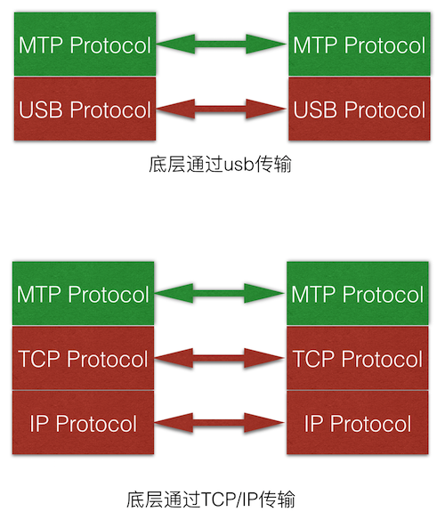

--

# 简介

MTP协议是应用层协议，底层协议可以走USB或TCP/IP协议，只要能够无差错传输即可。

## 协议模型

MTP协议有两个角色，

类似于客户端与服务端，

在MTP协议里面有特定的称号，

发起请求的叫Initiator,

对请求进行响应的叫Responder。

Initiator通常对应于PC/MAC宿主机，

Responder对应于被管理的设备，例如Android手机。

==任何操作都需要Inititaor发起，然后Reponder进行响应。==

Initiator对Reponder的大多数请求

都是需要打开一个Session会话，

类似于HTTP里面的Session，

用于保存上下文相关的环境信息，

例如，在MTP传输媒体文件过程中，Inititor传输媒体文件到Reponder是需要发送两次请求才能完成的，

第一次请求发送SendObjectInfo的消息，告诉Reponder即将要发送的媒体信息，包括大小，格式，媒体文件名称等；

第二次请求发送SendObject传输实际的文件，在这两次请求中第二次请求需要使用第一次请求保存的相关信息，所以就需要保持在一个Session会话里面。MTP按理论上说是可以支持多Session会话的。

还有另一个关键的概念，

就是Transaction，

对应于Initiator发起请求，然后数据传输，Responder响应一次完整的过程，有点类似于数据库里面的事务，

比如Initiator发起一次请求，在Reponder没有响应之前，是不能进行另一次请求。

所以在USB单Session实现中，Initiator是不能同时发送多次请求的。

https://wujingchao.github.io/2018/01/28/mtp/

# 维基百科总结

媒体传输协议（英语：Media Transfer Protocol，缩写：MTP）

==是一个基于图片传输协议（Picture Transfer Protocol，PTP）的自定义扩展协议。==

该协议允许用户在移动设备上线性访问媒体文件。

PTP只是被设计用于从数字相机下载照片，

而MTP可以支持数字音频播放器上的音乐文件和便携式媒体播放器上的媒体文件，

以及个人数字助理的个人信息的传输。

媒体传输协议（即通常所说的MTP）是“Windows Media”框架的一部分，

从而与Windows Media Player密切相关。

Windows系统从Windows XP SP2开始支持MTP。

USB开发者论坛在2008年5月将MTP标准化为一个成熟的USB类。

自此以后MTP成为PTP的官方扩展，两者拥有相同的类代码。

建立MTP协议的最主要目的是

让移动设备可以只传输媒体文件和关联元数据，

并且一次传输只能单独完成读取或写入，

使读取和写入无法并行。

诸如读取，编辑和修改等功能需要将相关文件读取到本地，完成后再传输回移动设备。

==MTP最初应用于USB传输，==

==不过现已扩展应用到TCP/IP和蓝牙领域。==

Windows Vista支持TCP/IP上的MTP协议。

Windows 7和已升级平台的Windows Vista支持蓝牙上的MTP协议。

==连接到MTP设备的主机端称为MTP Initiator（MTP发起端），==

==连接到主机的MTP设备称为MTP Responder（MTP应答端）。==

选择使用MTP连接

而不是诸如USB大容量存储设备（USB mass-storage device class，MSC）等其他连接方式

是因为后者在大容量存储设备的块（例如FAT块）上完成读写操作，

而MTP在逻辑文件层完成读写。

换句话说，

USB大容量存储设备连接模式

使主机端可以建立无差别连接到大容量存储批量块的连接。

而MTP连接模式使主机连接到文件系统，

==这样的连接使文件更安全，减少损毁文件的风险==

（正在移动设备上进行读取或修改的文件在文件系统层级上无法访问）。

Windows Vista 及其之后的 Windows 版本都原生支持MTP。

# USB两种挂载方式MTP与UMS

MTP的全称是Media Transfer Protocol（媒体传输协议），它是微软公司提出的一套媒体文件传输协议。 

UMS(USB Mass Storage:大容量存储)是一个计算通信协议的设置 由USB实现者论坛定义，运行于串行总线。标准提供了各种存储设备的界面。

### UMS和MTP不同

- UMS模式下，PC操作存储设备的粒度是设备块（FAT block），而非文件系统。什么意思？此处举一个简单例子。==当Android手机通过UMS将sdcard挂载到PC后，PC就拥有对sdcard的绝对控制权。==这样，手机就无法同时访问sdcard了。这种做法带来的后果就是Camera或Music程序将因没有外部存储空间而提示无法进行操作（注意，有些厂商的手机对此进行过修改，使得Camera能短时间录制一部分视频到内部存储空间）。这也是Android早期版本中一个很明显的特点。另外，由于PC在操作sdcard时可能弄坏其文件系统，这将导致sdcard重新挂载到手机后不能被识别。
- 如果Android手机的sdcard以MTP模式挂载到PC机上，==sdcard的控制权其实还是属于手机。只不过智能手机通过MTP协议向PC机构建了一个虚拟文件系统。==PC机操作其中的文件时，都会通过标准MTP协议向智能手机发起请求。另外，Android把MTP功能集成在MediaProvider[1]中，其好处是PC机操作（例如拷贝或删除等）媒体文件时，媒体数据都会及时更新到媒体数据库中。而UMS模式下，当sdcard挂载回手机后，Android还得花较长时间重新扫描媒体文件以更新媒体数据库。

虽然MTP协议由微软提供，但因为历史原因，其使用程度相当广泛，以至于Android也提供了最基本的MTP实现。

当然，如果要做到真正实用并通过微软认证，手机厂商还需要在此基础上做进一步的开发。

结合笔者自己的使用经历，国外大牌手机厂商例如Sony、Samsung、Nokia等对MTP的支持相当到位。

相比而言，国内手机厂商的起步稍微晚一点，需要投入更多的精力才能超越。

另外，随着无线技术的普及，MTP基于IP的实现也将极大方面用户的使用。笔者在此希望大家能一起努力，早日让用户从USB数据线中解放出来。

https://blog.csdn.net/w2064004678/article/details/104681126

# linux实现mtp responder

首先来介绍一下MTP，MTP是Media Transfer Protocol的缩写，

由Microsoft设计并在Windows Media Player中引入，

之前曾经有一个协议是PTP，缩写是Picture Transfer Protocol，

PTP被设计为传输图片而MTP主要被设计为传输媒体。

有些人可能想问了，和移动设备传输文件的话，

直接用挂载USB存储的方式就好了，

何必用一个特殊的协议呢？

挂载的方式将会独占设备上的某个分区，如果你在这个时候使用手机的话，可以注意到某些程序提示在挂载时无法使用。

MTP和PTP表现为一个文件系统，而不是一个块设备(你需要在块设备上建立文件系统才能使用)，因此避免了USB存储方式访问的问题。

但是相对带来的一些缺点就是需要有人来实现对他们的支持。

有些设备只提供了MTP的访问方式从而来避免使用FAT32的专利问题。

那么我们回到MTP的Linux的支持上，

==Linux的MTP支持是通过libmtp来实现的，==

但这玩意如果能在你系统上正常工作，你应该已经要谢天谢地了。

按道理我的N9是应该支持MTP的，但几乎从来没工作过。

首先遇到的第一个问题是权限问题，你没有权限去访问这个设备。

这个某种意义上可以用一些 udev rules来workaround，

虽然还不知道那些所谓“正确”的做法是什么，

不过自己的电脑先这么凑合好了。

但是接下来就是所有对mtp的调用都stuck在某个地方，

今天我非常蛋疼的去libmtp的代码库看了看README，然后看到了这么一句话：

\* mtp-* tools doesn’t work because someone else is already hogging the device

简单来说，就是你必须保证对设备的独占访问。

我的n9插上之后nm就会自动连接一个以太网设备。

于是我终于意识到我应该把它断掉才有希望访问mtp。

然后通过kio mtp，我终于看到了手机上的文件……我都要泪流满面了。

然后你就会悲剧的发现，你没法同时访问一个设备，即使是MTP访问，同时也只能进行一个，研究许久也不知是mtp协议的限制，还是设备的限制，还是libmtp的限制。

如果继续翻阅MTP的README，还会发现各种各样设备奇葩的行为，不如说这个协议本身也命途多舛……

# 参考资料

1、

https://www.cnblogs.com/skywang12345/p/3474206.html