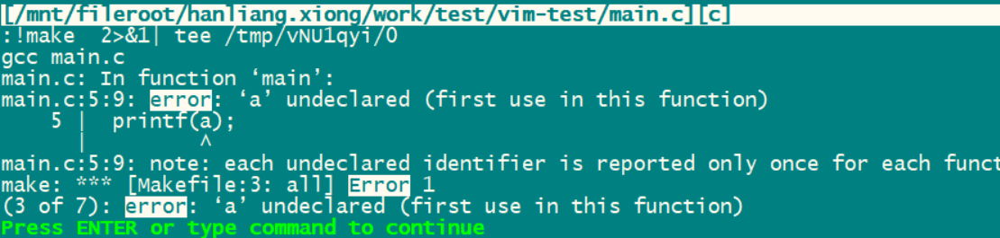
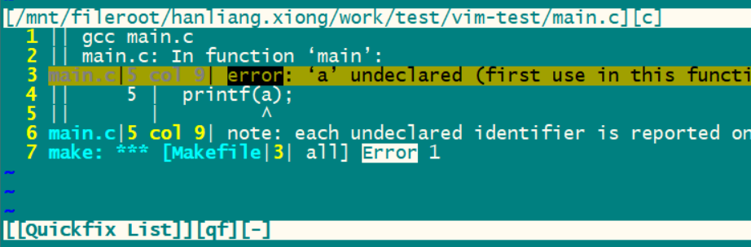

代码在这里：

https://github.com/VSCodeVim/Vim

关于按键操作方法，总结一下。

全称是VscodeSim，是一个Vim Emulator。

实现的feature可以这里看。

https://github.com/VSCodeVim/Vim/blob/master/ROADMAP.md

feature的支持情况：

```
这些是支持的
Normal mode
insert mode
visual mode
visual line mode
number prefix
. operator
search with ? and /
correct undo/redo
text objects
visual block mode
replace mode
multiple select mode

下面的不支持
command remapping
marks
macros
buffer/window/tab
```

左右移动：

```
1h: 1表示移动的字符的个数，可选。
1l
0：0 和^的区别是，0到是最前面，而^是到第一个非空字符的位置。
^
1$：到下面第几行的结尾处，数字也是可选的。
1|：到第几列，数字可选。
f后面跟字母，例如fa，表示到这一行的这个字母的位置。前面还可以加数字。2fa，表示到本行的第二个a的位置。
```

上下移动

```
10j:向下移动10行。
10k:向上移动10行。
10G：到第10行的位置。
```

text object移动

```
10w:向后移动10个word。
10W：向前移动10个单词。
e：跟w类似，是到单词的end位置。
E：
(
) 小括号是以sentence为单位。
[
] 中括号是以section为单位。
{
} 大括号是以paragraph为单位。
```

搜索

```
/
```

mark and motion

```
相当于打tag，移动到指定的tag位置。
```

其他的移动

```
% 移动到匹配的括号、#if等成对出现的位置。
H
M
L 移动到屏幕的顶部、中间、底部。
```

翻页

```

```


插入模式相关的按键

退出插入模式

```
esc
ctrl+c 这个是退出插入模块，不是复制。
ctrl+o cmd 执行命令并退出插入模式。
```


函数跳转到定义和返回：

```
ctrl+] 跳转到定义，可以gd（goto define）
ctrl+t 返回跳转之前的位置。
```

# 使用系统剪贴板

默认使用的不是系统剪贴板，需要设置一下。

https://blog.csdn.net/funnyPython/article/details/107484105

然后重启一下vscode。

yy复制一行文本测试一下，可以粘贴到外面的其他应用里去。

# 一些使用经验

## 通过映射解决一些vscode本来快捷键跟vim的冲突

把空格键设置为vim的leader键。这也是spacevim的做法。

空格键做leader键，按起来方便。

不用刻意去找，可以节省心力。

一个原则：不要动vscode本身的快捷键。改动vim的快捷键。最简单的做法，就是把冲突的快捷键，加上一个leader键，例如ctrl+r快捷键冲突了。那么就把vim的ctr+r改成 leader ctrl+r的方式。

## 一些vscode里特有的操作

切换tab

```
gt 切换到下一个tab
gT  切换到上一个tab。
也可以用ctrl+tab键来切换。
```

代码注释：

```
gcc 来注释当前行。两次就是取消注释。
ctrl+/也还可以用。
```

显示代码的帮助信息

```
gh h可以记忆为hover。
```

窗口操作

```
ctrl+w，然后按v，可以新建一个垂直切分的窗口。
ctrl+w ，然后h、l这样可以在窗口之间切换。
这些我基本不用，只是说明这个逻辑还是有的。
```

代码的折叠和打开

```
zc 记忆为zip code
zo 记忆为zip open
zR 展开所有
zM 折叠所有
za 切换折叠状态
```


vscode默认的快捷键

我通过依次查看菜单里的提示来一个个看一遍。

```
File下面的
	有2个键的，3个键的，还有4个键的。
	2个键的，以ctrl或alt修饰。
	还有两组键的，例如打开目录，是先按ctrl+k，再按ctrl+o。这个倒是比较少见。
	4个按键的是：ctrl+win+alt+n，新建一个文件。
	对我来说，常用的就2个：
	ctrl+shift+N：新建一个window。
	ctrl+F4：关闭当前的tab。
	
Edit下面的
	本来是ctrl+F这些查找替换的。
	还有一个ctrl+/的注释。
	大部分的是ctrl修饰的2个键的。
	
Selection下面的
	对我来说，现在没有用了。
View
	有点用，就是要切换到文件目录这边来。ctrl+shift+E。
	切换到全局文件朝着。ctrl+shift+F。
	其他的都没有啥。
Go
	这个是跳转的。现在没有用了。
	
```

总结，对我有用的，就是3个：

```
ctrl+shift+N：新建一个window。
ctrl+shift+E。有点用，就是要切换到文件目录这边来。
ctrl+shift+F。切换到全局文件朝着。
```

然后点击左下角的齿轮，打开keyboard shortcut查看。

这个内容非常多，是按照字母排序的。


看看vscode的settings。


操作中发现现在vscodevim里的文件目录这边的行为，跟nerdtree的类似，也是jk来上下移动，hl来进行打开和关闭目录。那就非常好。

其实目录树这边，也是一个window的行为，所以可以ctrl+w，然后按h这样来切换过来。

nerdtree查看不支持搜索。没事，还能接受，配合vscode自身的搜索可以做。

# 代码snippet搜索


https://www.freecodecamp.org/chinese/news/definitive-guide-to-snippets-visual-studio-code/


# 列操作

```
aa
bb
cc
```

有上面三行，要在前面加上--。

这样操作：

```
1、先按Ctrl+v。
2、然后按ctrl+d，可以一次性选中三行的（估计d这个是以空行来把这个块都选中的），你也可以用jk来微调。
3、输入I--，I表示插入，--就是我们要插入的内容。
```

# 宏

vscodevim的@没有实现。


# 配置默认shell为git-bash

https://www.cnblogs.com/remixnameless/p/14826532.html

# 无插件vim编程

很多时候，都面对这没有插件的vim环境。

这个情况，也要保证可以基本流畅地进行使用。

在编辑界面打开文件管理器，

```
输入 :E  就可以了。
等价于vi ./xx
```

进入的文件管理界面，有提示你操作，有几个简单的快捷键。例如 `-`是返回上一层。

还可以删除目录、改文件名这些操作。

还可以执行文件。

要切换目录，就在命令行模式下，执行cd就可以。

然后打开了多个文件，要在文件之间进行切换，那么：

```
:ls
然后执行:bn（buffer next）、:bp进行文件的切换
:bf 切换到第一个
:bl 切换到最后一个。
```

然后需要的就是窗口分屏的操作。

例如打开一个窗口，来显示文件目录。

```
:He 上下窗口，在下面的窗口打开文件目录管理。
:He  这个是在上面窗口打开文件管理。

:Ve 这个是左右分屏。
```


分屏的体验不是很好，可能更加喜欢tab的方式。

打开一个tab

```
:Te   用tab的方式打开文件浏览器
```

然后tab之间如何切换呢？

就是gt、gT来切换就可以。

切换到指定编号的tab，就是2gt这样，在最前面加上一个指定的数字即可。

还可以用

```
:tabs 这个命令来查看当前有哪些tabs。
```

然后我当前打开的这些窗口、tab的内容，我想要保存起来，怎么做呢？

可以这样：

```
:mksession ~/.myctestsession.vim
```

如果文件重复，会报错。你可以强行覆盖：

```
:mksession! ~/.xx.vim
```

下次要重新打开这个session。就vim 带上-S 的参数即可。

## quickfix

先建立一个简单的工程。

就一个main.c，一个Makefile。

把当前目录下的所有文件，每个文件建立一个tab，一次性打开：

```
vi -p *
```

-p就是表示针对后面的 文件每个单独建立一个tab。

先往main.c和Makefile里写入内容。

然后main.c里故意写错。

然后vim里执行：

```
:make
```

则肯定会报错。

会提示我们按enter继续，




这个时候，我们可以输入：

```
:cw
```

然后就自动新建了一个错误处理用的quickfix的窗口。




现在我们可以在quickfix窗口里移动，并定义到错误指示行。按enter键。

然后我们的mian.c的窗口，就自动定位到出错的行了。

```
int main()
{
        printf(a);
        printf(b);
        printf(c);
}
```

我们的main.c故意写了三行错误的代码，都是没有定义的变量。

所以会有3个错误。

我们要定位到下一个错误的位置，可以直接输入：

```
:cn
```

这样就避免了在quickfix里一行行找了。

对于cscope的替代，简单项目可以不用。

直接用vim的grep就可以简单替代。

## 自动补全

就按ctrl+n就可以了。


参考资料

https://coolshell.cn/articles/11312.html

# 参考资料

1、

https://zhuanlan.zhihu.com/p/512935904

2、

https://www.ohyee.cc/post/note_vim

3、vim键位图

看那个分情况的多个图，就非常清晰。

https://www.runoob.com/w3cnote/all-vim-cheatsheat.html

4、一份vscode的总结

https://github.com/Imymirror/mirror-vscode

5、

https://www.yuexun.me/blog/the-vim-guide-for-vs-code-users

6、

这个不错。

https://coolshell.cn/articles/5426.html