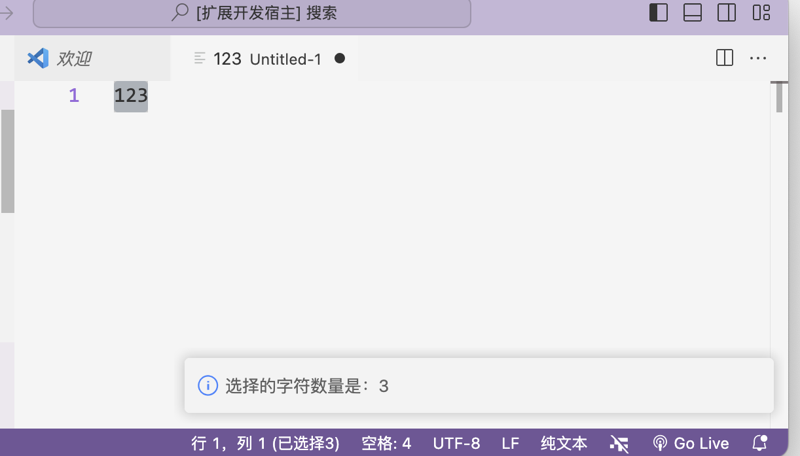
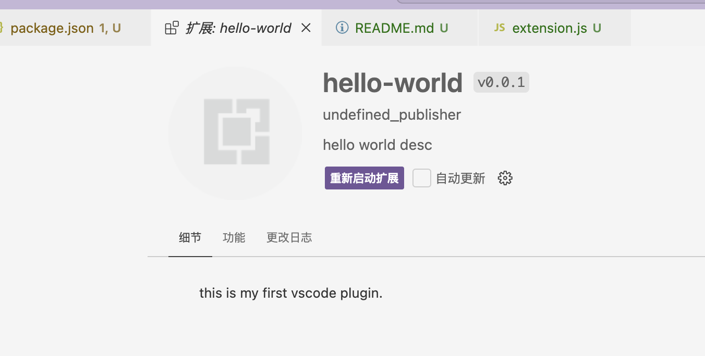

--

为了深入研究vscode的原理，决定从插件开发这个点进行切入。

因为我现在写代码重度依赖vscode，对于重要的工具，有必要进行深入的掌握。

```
npm install -g yo generator-code
```

yo就是yeoman，是一个vscode插件的脚手架工具，可以快速生成vscode插件代码的框架。

yeoman是一个通用的脚手架，generator-code这个就是针对vscode插件的模板。

# Helloworld

创建项目hello-world。

```
yo code
```

然后会提示你进行各种选择。

我选择js而不是ts。

然后默认生成的就是一个基本的代码。

点击调试，打开调试，会弹出一个新的window来运行这个 插件。

按ctrl+shift+p来打开命令输入，输入hello 可以看到有对应的命令，执行，可以看到会在状态栏弹出提示。

当前的最小的vscode插件的extension.js的内容如下：

```js
// The module 'vscode' contains the VS Code extensibility API
// Import the module and reference it with the alias vscode in your code below
const vscode = require('vscode');

// This method is called when your extension is activated
// Your extension is activated the very first time the command is executed

/**
 * @param {vscode.ExtensionContext} context
 */
function activate(context) {

	// Use the console to output diagnostic information (console.log) and errors (console.error)
	// This line of code will only be executed once when your extension is activated
	console.log('Congratulations, your extension "hello-world" is now active!');

	// The command has been defined in the package.json file
	// Now provide the implementation of the command with  registerCommand
	// The commandId parameter must match the command field in package.json
	const disposable = vscode.commands.registerCommand('hello-world.helloWorld', function () {
		// The code you place here will be executed every time your command is executed

		// Display a message box to the user
		vscode.window.showInformationMessage('Hello World from hello-world!');
	});

	context.subscriptions.push(disposable);
}

// This method is called when your extension is deactivated
function deactivate() {}

module.exports = {
	activate,
	deactivate
}

```

本质上就是2个方法，一个activate，一个deactivate。

而上面注册的hello world命令，是在package.json里注册的：

```
  "contributes": {
    "commands": [{
      "command": "hello-world.helloWorld",
      "title": "Hello World"
    }]
  },
```


# 统计代码里的字符数

上面的Helloworld没有一点实用价值，下面我们看一个有点用途的东西。

统计一下字符数。

需要在package.json的commands里增加一个showNumber的命令。

```
  "contributes": {
    "commands": [{
      "command": "hello-world.helloWorld",
      "title": "Hello World"
    }, {
      "command": "hello-world.showNumber",
      "title": "show number"
    }]
  },
```

然后在extension.js里的activate函数里加上showNumber的命令的注册和具体行为。

```
	const showNumber = vscode.commands.registerCommand('hello-world.showNumber', function() {
		let editor = vscode.window.activeTextEditor;
		if (!editor) {
			return;
		}
		let selection = editor.selection;
		let text = editor.document.getText(selection);
		vscode.window.showInformationMessage("选择的字符数量是：" + text.length);
	})
```

然后重新启动调试。可以看到运行正常。



https://blog.csdn.net/qq_45701130/article/details/125206645

# package.json里的重要字段介绍

## activationEvents

当前默认是空的。

这个属性用来说明插件在什么情况下会被激活。

因为只有在激活后，插件才能被使用。

常见的有这些值：

| event                  | 说明                                                         |
| ---------------------- | ------------------------------------------------------------ |
| onLanguage             | 打开特定的编程语言的文件时激活，例如打开python时激活，就是：onLanguage:python。 |
| onCommand              | 调用命令是激活。                                             |
| onDebug                | 在启动调试之前激活。                                         |
| workspaceContains      | 当打开的目录里包含了至少一个匹配了glob模式的文件时激活。     |
| onFileSystem           | ？                                                           |
| onView                 | 就是打开侧边栏的那个view的时候激活，就是搜索、插件那些类似的。 |
| onUri                  |                                                              |
| onWebViewPanel         |                                                              |
| onCustomEditor         |                                                              |
| onAutenticationRequest |                                                              |
| *                      | 只要启动vscode就激活                                         |
| onStartupFinished      |                                                              |

## contributes

用来扩展各项技能。

| 技能                    | 说明                                                         |
| ----------------------- | ------------------------------------------------------------ |
| breakpoints             |                                                              |
| colors                  | 主题颜色                                                     |
| commands                | 注册的命令                                                   |
| configuration           | 配置                                                         |
| configurationDefaults   |                                                              |
| customEditors           |                                                              |
| debuggers               |                                                              |
| grammars                |                                                              |
| iconThemes              |                                                              |
| jsonValidation          |                                                              |
| keybindings             |                                                              |
| languages               |                                                              |
| menus                   | 这个比较重要，可以注册文件右键菜单和context菜单。分别对应的是：editor/context和explorer/context |
| problemMathers          |                                                              |
| productIconThemes       |                                                              |
| resourceLabelFormatters |                                                              |
| snippets                |                                                              |
| submenus                |                                                              |
| taskDefinitions         |                                                              |
| themes                  |                                                              |
| typescriptServerPlugins |                                                              |
| views                   |                                                              |
| viewsContainers         |                                                              |
| viewsWelcome            |                                                              |
| walkthroughs            |                                                              |

# 打包插件

```
npm install -g vsce
vsce package
```

这样打开就会得到vsix这种扩展包的文件。

可以这样来命令安装：

```
code --install-extension /path/to/your/extension.vsix
```

也可以在命令面板里安装。

打包之前还需要readme里有内容：

```
 vsce package
 ERROR  Make sure to edit the README.md file before you package or publish your extension.
```

安装后是这样。

