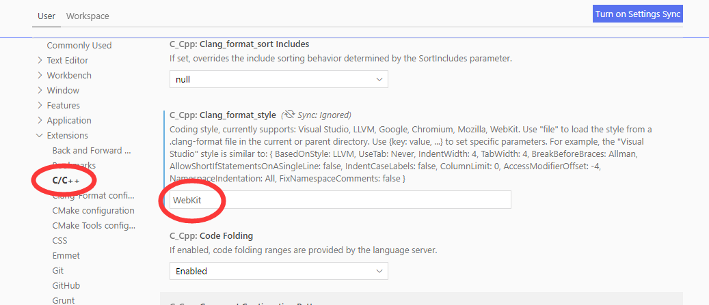

现在vscode特别火。学习一下这个编辑器的使用方法。

# 主题

GithubPlus这个主题挺好的。我一直不喜欢深色的主题。

# 常用快捷键

F1：可以搜索各种东西。很好。


# 配置vim模式

有一个插件，就是vim模式的，安装后，reload一下插件就可以生效。

怎么把esc键remap一下呢？esc键太远了。

看到网上都是映射到`jj`上。

先按一下F1，找到user settings。然后改这个。

```
"vim.insertModeKeyBindings": [
     {
         "before": ["j", "j"],
         "after": ["<esc>"]
     }
]
```

让vim模式可以跟系统剪切板交互。

在user settings里，勾选useSystemClipboard。

# 打开空白显示

我习惯看到空格和tab键。

在user setting里搜索whitespace。就可以看到，勾选就好了。


# 配置文件的位置

C:\Users\Administrator\AppData\Roaming\Code\User\settings.json

我的当前是这样：

```
{
    "workbench.colorTheme": "Default Light+",
    "editor.minimap.enabled": false,
    "vim.insertModeKeyBindings": [
     {
         "before": ["j", "j"],
         "after": ["<esc>"]
     }
    ],
    "vim.useSystemClipboard": true,
    "files.trimTrailingWhitespace": true,
    "editor.renderWhitespace": "all"
}
```

# nodejs补全

搜索插件node.js，安装第一个就好了。


# 安装PlatformIO插件

这样开发esp8266就很方便了。


# 配置调试html

搜索安装debugger for chrome


# workspace概念

在当前目录，右键，选择vscode打开目录。

如果进行了某些配置，会在当前目录下生成.vscode目录。里面放了一些配置。

典型的是有tasks.json、launch.json这2个文件。


# C语言自动补全

我一般都是在windows下工作。

但是我的开发是需要linux的。

vscode，在linux下，是可以很方便地进行stdio.h这些头文件及函数名进行补全的。

我觉得把linux的头文件拷贝到windows，然后把目录加入到vscode的索引目录下，应该是可以做到的。


# 配置python环境

1、安装插件。

2、记得import，不import对应的库，就不会补全的。

3、右键，有运行的选项。


# 配置python3环境

1、头部写上

```
#!/usr/bin/env python3
```

2、用python3语法写代码。

```
def func() ->int:
    return 1
print(func())
```

pylint提示出错。

3、把鼠标移动到错误上，根据提示安装python3的pylint。安装好后，reload一下vscode就好了。

在windows上，我的python环境都是靠anaconda来安装的。

安装了python2.7和python3.6的。

还是写python3语法的文件，出错，在左下角点击选择python版本就好了。


# 设置护眼色

https://blog.csdn.net/Lean_on_Me/article/details/84552487


# vue文件增加html补全

只需要在json配置文件里加上这个：

```
"files.associations": {
        "*.vue": "html"
    }
```


# 快速生成常用代码片段

例如，vue的简单例子，经常使用。

点击左下角，齿轮图标，选择用户代码片段。

选中html.json文件。

里面当前都是注释的内容，都删掉。

粘贴下面的内容进去。

```


{"vue代码": {
	"prefix": "ve",
	"body": [
	"<!DOCTYPE html>",
	"",
	"<html lang='en'>",
	"<head>",
		"\t<meta charset=\"UTF-8\">",
		"\t<meta name=\"viewport\" content=\"width=device-width, initial-scale=1.0\">",
		"\t<meta http-equiv=\"X-UA-Compatible\" content=\"ie=edge\">",
		"\t<title>Document</title>",
		"\t<script src=\"./node_modules/vue/dist/vue.min.js\"></script>",
		"</head>",
		"",
		"<body>",
		"\t<div id=\"app\">",
	 
		"\t</div>",
	 
	 
		"\t<script>",
		" \t\tvar vm = new Vue({",
			"\t\t\tel : '#app',",     
			"\t\t\tdata : {  }," ,         
			"\t\t\tmethods : { }    "  ,   
			"\t\t});",
			"\t</script>",
			"</body>",
			"",
			"</html>"
		]
		}
	}
```

然后，我们在html文件里，输入ve，就会提示，我们直接回车，就会帮我们生成一大堆的代码。

在这个上面继续做就很方便。

直接在vscode里打开浏览器预览html

安装open-in-browser这个插件。

# 调试c++程序

很简单。

插件之前安装好了。

只需点击左边的debug图标。

当前还没有配置debug。

配置一下，然后在launch.json里写一下程序的相对路径就好了。

# Ubuntu下cpu占用高

进入设置，把followSymlinks  设置为false。

好像有用。

# 配置远程开发

1、安装Remote Development插件。

2、服务器配置了ssh免密码登陆。这个我当前就是好的。

3、打开vscode的命令面板。深入Remote SSH，会出现一些提示，选择其中的connect to host。然后会让你输入一个ssh xx@xx -A的命令，填入，就可以正常连上进行开发了。还是很简单的。


# vscode原理

这里分享一个小知识——Eclipse核心部分的开发者就是早期的VS Code团队。嗯，所以他们没有两次踏入同一条河流。**与Eclipse不同，VS Code选择了把插件关进盒子里**。

这样做首先解决的问题就是**稳定性**，这个问题对于VS Code来说尤为重要。都知道VS Code基于Electron，实质上是个Node.js环境，单线程，任何代码崩了都是灾难性后果。所以VS Code干脆不信任任何人，把插件们放到单独的进程里，任你折腾，主程序妥妥的。

**遗憾的是，Eclipse的插件运行在主进程中，任何插件性能不佳或者不稳定，都直接影响到Eclipse**，最终结果是大家抱怨Eclipse臃肿、慢、不稳定。**VS Code基于进程做到了物理级别的隔离，成功解决了该问题**。实际上进程级别的隔离也带出了另一个话题，那就是界面与业务逻辑的隔离。

界面和业务逻辑的彻底隔离，使得所有插件有了一致的行为，用户就得到了整齐划一的体验。不仅如此，这种接口和行为层面的一致性，最终转化成了另一个“伟大”的功能——Remote Development，我们稍后讨论。接下来我们要聊的是VS Code另一个创举——Language Server Protocol。


全栈开发早已成为这个时代的主流，软件从业者们也越来越不被某个特定的语言或者技术所局限，这也对我们手里的金刚钻提出了新的挑战。

举个栗子，我用TypeScript和Node.js做前端，同时用Java写后台，偶尔也用Python做一些数据分析，那么我很有可能需要若干工具的组合，这样做的问题就在于需要在工具间频繁切换，无论从系统资源消耗和用户体验的角度来看，都是低效的。


那么有没有一种工具能在同一个工作区里把三个语言都搞定呢？没错，就是VS Code——支持多语言的开发环境，而多语言支持的基础就是Language Server Protocol(LSP)。

更难能可贵的是，该协议还做到了轻量和快速，可以说是VS Code的杀手级特性了，同时也是微软最重要的IP之一。。。哇塞，又强大又轻巧，怎么看都是个骗局啊，那我们就来看看它到底怎么做到的。


而LSP提出的改变了这种局面，使得编程语言社区能专注于不断完善一个能提供语法检查、自动补全、跳转位置、引用查找等语言特性检查的高性能“语言服务器”实现。与此同时，IDE厂商和组织只专注于提供能与任何“语言服务器”交互和“渲染”响应数据的实现方案即可。

但由于LSP是自从2016年才由微软开源推广的，而主流的编辑器或者IDE通常已经有支持各类语言的插件，所以实际上来看，“语言服务器”的数量，可能并不比某主流IDE的语言支持插件要多。


相较之下，LSP显然把小巧作为设计目标之一，它选择做最小子集，贯彻了团队一贯节制的作风。它**关心的是用户在编辑代码时最经常处理的物理实体（比如文件、目录）和状态（光标位置）**。它根本没有试图去理解语言的特性，编译也不是它所关心的问题，所以自然不会涉及语法树一类的复杂概念。

它也不是一步到位的，而是随着VS Code功能的迭代而逐步发展的。所以它自诞生至今依然保持着小巧的身材，易懂，实现门槛也很低，迅速在社区得到了广泛的支持，各种语言的Language Server(LS)遍地开花。


举个栗子，用户把鼠标悬停在某个类名上方，查看相关的定义和文档。这时VS Code会发送一个'textDocument/hover'请求给LS，这个请求里最关键的信息就是当前的文档和光标的位置。LS收到请求之后，经过一系列内部计算（识别出光标位置所对应的符号，并找出相关文档），找出相关的信息，然后发回给VS Code显示给用户看。这样一来一回的交互，在LSP里被抽象成请求(Request)和回复(Response)，LSP同时也规定了它们的规格(Schema)。在开发者看来，概念非常少，交互形式也很简单，实现起来非常轻松。


首先这是一个基于文本的协议，文本降低了理解和调试的难度。参考HTTP和REST的成功，很难想象如果这是一个二进制协议会是什么局面，甚至同样是文本协议的SOAP也早已作古，足以说明“简单”在打造开发者生态里的重要性。

其次这是一个基于JSON的协议，JSON可以说是最易读的结构化数据格式了，大家看看各个代码仓库里的配置文件都是啥格式就知道这是个多么正确的决定了，现在还有人在新项目里用XML吗？又一次——“简单”。

再次，这是一个基于JSONRPC的协议，由于JSON的流行，各大语言都对它有极好的支持，所以开发者根本不需要处理序列化、反序列化一类的问题，这是实现层面的“简单”。


vscode为什么这么牛

https://blog.csdn.net/coderising/article/details/100021895

什么是Language Server protocol（LSP）?

https://blog.csdn.net/u012930117/article/details/79291677

vscode源码解析

http://www.ayqy.net/blog/vs-code%E6%BA%90%E7%A0%81%E7%AE%80%E6%9E%90/


# 提示需要java11才能正常解析java文件

把插件降级到0.64.1就好了。

如果有多余的插件，也去掉。

https://stackoverflow.com/questions/63043585/visual-studio-code-showing-java-11-or-more-recent-is-required-to-run-please-do

# C语言格式化

安装c/c++插件后，自动就安装了clangformat这个插件。

但是这个格式化，默认是把左边大括号另外起一行。

这个不符合我们的规则。

看看怎么调整。

用everything搜索ms-vscode.cpptools，找到这个目录下。

C:\Users\hanliang.xiong\.vscode\extensions\ms-vscode.cpptools-1.2.2\LLVM\bin

执行下面命令，生成默认的配置。

```
.\clang-format -style="llvm" --dump-config > .clang-format
```

然后用notepad++打开这个配置文件，进行编辑。

然后进vscode的配置，Clang-format: Executable 填写clang-format运行位置的绝对路径 ,PS我就是这里没有设置才不生效的。

```
C:\Users\hanliang.xiong\.vscode\extensions\ms-vscode.cpptools-1.2.2\LLVM\bin\clang-format.exe
```

需要把下图这里改成WebKit。默认是file。file的方向需要你在代码目录下放一个.clang-format文件。就在上面生成的文件基础上修改就好了。

我测试了一下，WebKit的，符合我的需要。就直接用WebKit的。



https://blog.csdn.net/sinat_26685721/article/details/109906411

# .vscode-server调整位置

因为home目录空间有限。.vscode-server默认在home目录下。

所以需要调整位置。

没有配置文件可以配置的。所以就通过软链接的方式来调整。

```
cp .vscode-server ~/work -rf # work本身就是一个软链接，指向一个大的磁盘。
rm .vscode-server -rf
ln -s .vscode-server ~/work/.vscode-server
```


# Saving dirty editors is taking longer than expected...


# 显示宽度标尺

https://blog.csdn.net/weixin_39449570/article/details/78445199


# 格式化C语言失败

是因为clang-format.exe插件升级了。需要修改对应的路径。

https://blog.csdn.net/qq_39549803/article/details/111877597

# windows下占用空间大

可以参考这个调整缓存数据的位置。

https://blog.csdn.net/weixin_42880082/article/details/121242368

修改快捷方式的参数为这样：

```
Code.exe --user-data-dir d:\vscode-data
```

然后每次都从快捷方式来启动vscode即可。


# 头文件ifndef snippet

```
{
	"#ifndef … #define … #endif":{
		"prefix": "def",
		"body": "#ifndef ${1:${TM_FILENAME_BASE/(.*)/_${1:/upcase}_H/i}} \n#define $1 \n#ifdef __cplusplus\nextern \"C\" {\n#endif\n${2:}\n\n\n#ifdef __cplusplus\n}\n#endif\n#endif\t// $1"
				
}

```

上面的内容配置到c.json里。

然后在头文件里输入def可以快速生成保护宏。

但是我的用了不生效。

看了下面这个文章，说是把h文件当成c++了。所以c.json的配置不能覆盖到。

那我直接改cpp.json不就好了。

而且内容换成下面的：效果非常好。输入guard就可以触发。

```
{
	"Add include guard": {
		"prefix": "guard",
		"description": "Adds an ifndef include guard to a C header",
		"body": [
			"#ifndef __${TM_FILENAME/^([^\\.]*)\\..*$/${1:/upcase}/}_${TM_FILENAME/^.*\\.([^\\.]*)$/${1:/upcase}/}__",
			"#define __${TM_FILENAME/^([^\\.]*)\\..*$/${1:/upcase}/}_${TM_FILENAME/^.*\\.([^\\.]*)$/${1:/upcase}/}__",
			"",
			"$0",
			"",
			"#endif // __${TM_FILENAME/^([^\\.]*)\\..*$/${1:/upcase}/}_${TM_FILENAME/^.*\\.([^\\.]*)$/${1:/upcase}/}__",
			""
		]
	}
}
```


https://blog.csdn.net/booksyhay/article/details/119572280


vscode用户用好user snippets能极大提高开发效率，这是我的配置文件。选择：File->Perferences->User Snippets->targert.json


但是当前的写法，只有文件名，有的文件名比较短，感觉很可能会产生相同的的guard而导致冲突。

所以最好是可以把目录也加入到guard里。

```

{
	"Add include guard": {
		"prefix": "guard",
		"description": "Adds an ifndef include guard to a C header",
		"body": [
            "#ifndef ${TM_FILEPATH/(?:^.*\\\\src\\\\)?(\\w+)(?!\\w*$)|(\\W)|(\\w+)$/${1:/upcase}${2:+_}${3:/upcase}${3:+_}/g}",
            "#define ${TM_FILEPATH/(?:^.*\\\\src\\\\)?(\\w+)(?!\\w*$)|(\\W)|(\\w+)$/${1:/upcase}${2:+_}${3:/upcase}${3:+_}/g}",
            "\n#endif // ${TM_FILEPATH/(?:^.*\\\\src\\\\)?(\\w+)(?!\\w*$)|(\\W)|(\\w+)$/${1:/upcase}${2:+_}${3:/upcase}${3:+_}/g}"
		]
	}
}
```

但是这个也有问题，就是把完整的路径都加进来了。又没有必要这么长。


参考资料

1、

https://zhuanlan.zhihu.com/p/171797717

2、

https://devpress.csdn.net/cloud/6325abf36213ca4d56909c68.html

# 禁用cpptools

这个导致了cpu占用高和磁盘占用的主要原因。

我无法忍受这个。所以要禁用掉。

在settings.json中添加如下设置即可
`"C_Cpp.intelliSenseEngine": "Disabled"`

## 兼顾性能和效率的做法

2个vscode，各自有自己的插件目录。

一个不打开cpptools，用来专门打开大代码目录，进行普通的修改。

一个打开cpptools，专门用来写代码，不要用来打开大目录，可以进行代码的跳转。


参考资料

https://blog.csdn.net/qq_43827595/article/details/105613954

# 绘制drawio图

搜索drawio，安装插件。

然后新建test.drawio，打开，就会自动进入绘图界面。

# 绘制脑图

搜索mindmap。安装插件。

新建test.km文件。打开，就可以进入脑图编辑界面。

脑图内容是以json格式保存的。

跟百度脑图是一个开源方案的。

# 查询unicode值

因为在看有些代码的时候，里面有不少的emoji表情，就想知道这个标签的unicode值是多少。

插件里搜索unicode，找到这个：

Unicode code point of current character

这个会在状态栏显示当前的符号的unicode值。

点击状态栏，会跳转到网页查看详细信息。

插件代码在这里，实现不复杂。可以学习一下。

https://github.com/zeithaste/cursorCharCode/blob/master/src/extension.ts

# 参考资料

1、

https://stackoverflow.com/questions/37777417/how-to-use-vim-key-bindings-with-visual-studio-code-vim-extension/38604086

2、How to use clipboard for Vim in VSCode

https://codeyarns.com/2018/04/26/how-to-use-clipboard-for-vim-in-vscode/

3、vscode调试html页面，及配置说明

https://www.cnblogs.com/codeww/p/7667543.html

4、VScode中Vue快速生成代码片段

https://blog.csdn.net/qq_40428678/article/details/83781769

5、

https://zhuanlan.zhihu.com/p/93239107