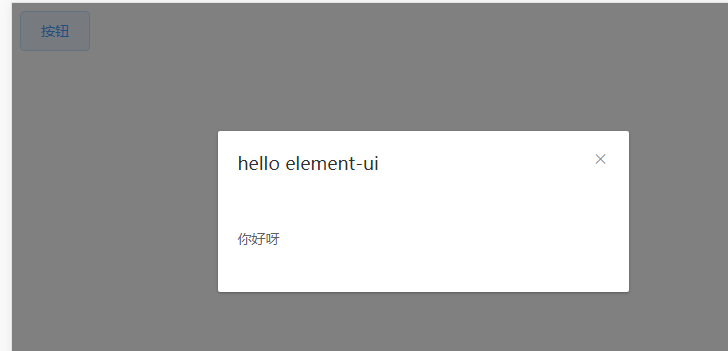

--

# 基本信息

Element，一套为开发者、设计师和产品经理准备的基于 Vue 2.0 的桌面端组件库

设计原则

一致性、反馈、效率、可控。

导航

导航可以解决用户在访问网页时，知道自己在哪里，去哪里，怎么去。

导航一个有侧栏导航和顶部导航这两种。


侧栏导航

可以把侧栏固定在左侧，提高导航的可见性。

方便在页面之间切换。

而在顶部，可以放常用工具，例如搜索框、帮助按钮、通知。

适用于中后台的管理型、工具型网站。

结构简单的，可以只有一级导航。不需要使用面包屑指示。

使用二级导航的时候，最好配合面包屑，这样可以让用户清楚地知道自己的位置，也方便进行跳转。


# 使用入门

安装

```
npm i -S element-ui
```

在一个vue-cli创建的工程里，安装。

在main.js里写入：

```
import Vue from 'vue'
import ElementUI from 'element-ui'
import 'element-ui/lib/theme-chalk/index.css'
import App from './App.vue'

Vue.use(ElementUI)
new Vue({
  el: '#app',
  render: h=>h(App)
})

```

在App.vue里

```
<template>
  <div id="app">
    <el-button @click="visible=true">按钮</el-button>
    <el-dialog :visible.sync="visible" title="hello element-ui">
      <p>你好呀</p>
    </el-dialog>
  </div>
</template>

<script>
export default {
  name: 'App',
  data() {
    return {
      visible: false
    }
  }
}
</script>
```

然后npm run dev，就可以看到效果。



在上面的代码框架基础上，把所有的组件的都测试一遍。

需要安装

```
npm install sass-loader --save-dev
npm install --save-dev node-sass
```

因为使用scss，报了不少的错误。

把版本sass-loader和node-sass的版本降低就好了。

参考其实可行的例子，

```
"node-sass": "^4.9.0",
"sass-loader": "^7.0.1",
```

这样的版本，是可以用的。

# 提供给vue的符号和函数

```
Vue.prototype.$loading = Loading.service;
Vue.prototype.$msgbox = MessageBox;
Vue.prototype.$alert = MessageBox.alert;
Vue.prototype.$confirm = MessageBox.confirm;
Vue.prototype.$prompt = MessageBox.prompt;
Vue.prototype.$notify = Notification;
Vue.prototype.$message = Message;
```


```
import {
  Pagination,
  Dialog,
  Autocomplete,
  Dropdown,
  DropdownMenu,
  DropdownItem,
  Menu,
  Submenu,
  MenuItem,
  MenuItemGroup,
  Input,
  InputNumber,
  Radio,
  RadioGroup,
  RadioButton,
  Checkbox,
  CheckboxButton,
  CheckboxGroup,
  Switch,
  Select,
  Option,
  OptionGroup,
  Button,
  ButtonGroup,
  Table,
  TableColumn,
  DatePicker,
  TimeSelect,
  TimePicker,
  Popover,
  Tooltip,
  Breadcrumb,
  BreadcrumbItem,
  Form,
  FormItem,
  Tabs,
  TabPane,
  Tag,
  Tree,
  Alert,
  Slider,
  Icon,
  Row,
  Col,
  Upload,
  Progress,
  Spinner,
  Badge,
  Card,
  Rate,
  Steps,
  Step,
  Carousel,
  CarouselItem,
  Collapse,
  CollapseItem,
  Cascader,
  ColorPicker,
  Transfer,
  Container,
  Header,
  Aside,
  Main,
  Footer,
  Timeline,
  TimelineItem,
  Link,
  Divider,
  Image,
  Calendar,
  Backtop,
  PageHeader,
  CascaderPanel,
  Loading,
  MessageBox,
  Message,
  Notification
} from 'element-ui';

```

# 跟element-ui类似的前端组件库

除了Element UI，还有许多其他优秀的Vue.js组件库，它们提供了丰富的组件和样式，可以帮助你快速构建用户界面。以下是一些流行的Vue.js组件库：

### 1. Vuetify

Vuetify 是一个基于Material Design的Vue.js组件库，提供了大量的组件和工具，帮助你构建美观且功能丰富的应用。

- **官方网站**：https://vuetifyjs.com/
- **特点**：Material Design、丰富的组件、响应式设计、主题定制

### 2. Ant Design Vue

Ant Design Vue 是Ant Design的Vue.js实现，提供了高质量的UI组件，适用于企业级后台产品。

- **官方网站**：https://2x.antdv.com/
- **特点**：高质量的UI组件、企业级后台产品、丰富的生态系统

### 3. Quasar

Quasar 是一个基于Vue.js的框架，提供了丰富的UI组件和工具，支持构建响应式网站、PWA、移动应用和Electron应用。

- **官方网站**：https://quasar.dev/
- **特点**：多平台支持、响应式设计、高性能、丰富的组件

### 4. BootstrapVue

BootstrapVue 将Bootstrap的强大功能与Vue.js的灵活性结合在一起，提供了丰富的组件和工具，帮助你快速构建现代Web应用。

- **官方网站**：https://bootstrap-vue.org/
- **特点**：与Bootstrap集成、丰富的组件、响应式设计、易于使用

### 5. Buefy

Buefy 是基于Bulma的Vue.js轻量级UI组件库，提供了简洁且美观的组件。

- **官方网站**：https://buefy.org/
- **特点**：基于Bulma、轻量级、简洁美观、易于使用

### 6. Chakra UI Vue

Chakra UI Vue 是一个简洁且可定制的Vue.js组件库，提供了丰富的组件和工具，帮助你构建现代Web应用。

- **官方网站**：https://vue.chakra-ui.com/
- **特点**：简洁、可定制、丰富的组件、易于使用

### 7. Naive UI

Naive UI 是一个基于Vue.js的组件库，提供了丰富的组件和工具，帮助你快速构建用户界面。

- **官方网站**：https://www.naiveui.com/
- **特点**：丰富的组件、易于使用、高性能、可定制

### 8. Element Plus

Element Plus 是Element UI的下一代版本，提供了更现代的UI组件和工具，帮助你构建美观且功能丰富的应用。

- **官方网站**：https://element-plus.org/
- **特点**：现代UI组件、丰富的组件、易于使用、高性能

### 选择组件库的建议

- **项目需求**：根据项目的需求和目标选择合适的组件库。
- **社区支持**：选择一个有活跃社区和良好文档支持的组件库。
- **学习曲线**：考虑团队成员的学习曲线，选择一个易于上手的组件库。
- **定制能力**：根据项目的定制需求，选择一个提供良好定制能力的组件库。

通过以上组件库，你可以快速上手使用Vue.js来构建前端应用，而不需要深入了解CSS的细节。这些组件库提供了丰富的组件和样式，可以帮助你快速构建出美观且功能齐全的用户界面。

# 参考资料

1、官网

https://element.eleme.cn/#/zh-CN

2、vue 安装scss

https://www.cnblogs.com/juanph/p/13585706.html