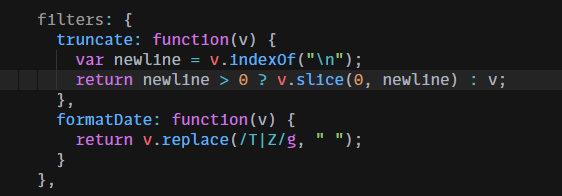
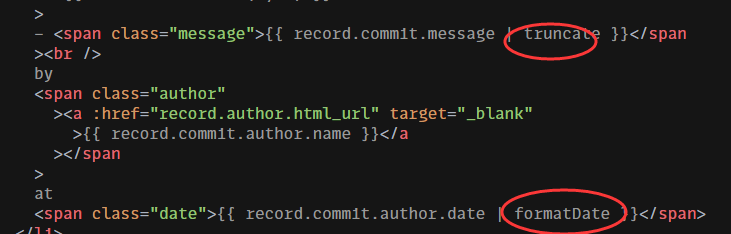

--

filter是类函数。set和get函数都是一样，靠参数个数来区分。

```
Vue.filter('my-filter', function(value) {
	
})

var myFilter = Vue.filter('my-filter')
```

看vue官网的《github提交记录》这个例子。就可以很直观地看出filter的用途。

js代码里定义了这么2个filter函数。



在html代码里，这样使用。加个管道符号就可以了。




参考资料

1、

https://www.cnblogs.com/hwj369/p/12652990.html