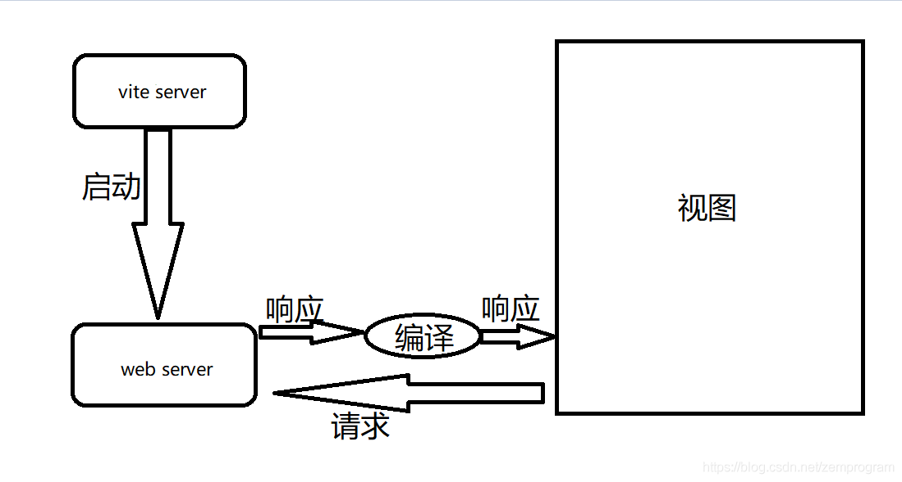

--

vite是尤雨溪写的一个简单的打包工具，出发点是webpack使用太复杂，大多数情况不需要这么复杂的用法。所以用vite来简化打包过程。

我了解到这个东西，是看ninja这个工具的时候，看到readme里说是对vue和vite的简单使用。

首先，vite为什么叫做vite，

vite实际上是法语中快的意思，

所以顾名思义，这个工具给我们带来的就是更快的开发体验，

它实际上是一个**面向现代浏览器**，基于ECMA标准的**ES module**实现的一个**更轻更快**的**web应用开发工具**

之所以是面向现代浏览器，而不顾之前的浏览器，

是因为vite本身是一个web应用开发者工具，

而对于开发者来说，一般都是使用比较先进的浏览器来进行开发，

所以我们可以直接使用一些现代浏览器支持的特性，而不考虑去兼容一些老的浏览器

而现代浏览器支持的特性中，

在vite中最为重要的一个，就是ES module。

由于vite是面向现代浏览器的，

所以它利用浏览器去解析imports，在服务器端按需编译返回，跳过打包过程。

同时支持[Vue](https://so.csdn.net/so/search?from=pc_blog_highlight&q=Vue)文件和HMR（热更新），针对生产环境可以使用rollup打包。

<u>此外要注意的一点是，vite仅支持vue3.0+的项目，也即是说我们无法在其中使用vue2.x</u>

vite 是一个基于 [Vue](https://so.csdn.net/so/search?from=pc_blog_highlight&q=Vue)3 单文件组件的非打包开发服务器，

它做到了本地快速开发启动：

快速的冷启动，不需要等待打包操作；

即时的热模块更新，替换性能和模块数量的解耦让更新飞起；

真正的按需编译，不再等待整个应用编译完成，这是一个巨大的改变。

vite项目中使用的不是vue.config.js,而是vite.config.js


安装vite

```
npm i -g vite
```


vite项目是基于create-vite-app脚手架搭建的，这里我们直接使用npm init命令（cliName是脚手架名，projectName是项目名）

```
npm init <cliName> <projectName>
```

```
npm init vite-app hello
cd hello
npm i
npm run dev
```


其实和我们平时的vue项目差不多，

而可以注意到的一点是，

vite将index.html放到了文件的根目录，

而实际上，在vite服务器启动后，该服务器下访问的根目录，就是该项目的根目录


# vite的工作机制

既然使用vite启动项目了，那么接下来我们就要透过vite启动的这个项目来了解vite的工作机制了

首先，我们要知道的是，vite整体的工作机制，可以简单地看一下下图



由图我们也可以看到，vite实际上也是一个server，在启动vite构建web server（就是上面的localhost:3000）后，我们访问这个地址，该页面会向web server发送请求，请求对应的文件，我们可以从network中看到，如下


在请求这些资源后，这些资源并非是直接返回的，我们可以看看其中的App.vue，实际上可以看到，这里有两个App.vue，两个HelloWorld.vue，实际上这就是因为在我们请求这些文件的时候，被vite server拦截了，经过编译后才返回对应的内容


vite就是通过这两种缓存，又一次提升了速度

等等，刚刚我们说了啥，websocket连接，

怎么会有websocket连接，

这个hello world页面好像没有什么websocket相关的东西啊，

实际上，这是vite实现HMR的手段

vite通过使用websocket连接，

当我们修改一个文件保存时，将这个修改的文件编译推送到浏览器，实现一个热更新，

具体实现我们可以留待后面讲和websocket的比较以及实现一个简单的vite的时候来讲，

这个时候先知道它是一个实现HMR的一个方式就可以了

那么到这里，我们基本了解完vite的使用和其整体的工作机制了，

接下来就是要通过和webpack比较，

看看vite给我们带来了什么比webpack更好的东西，

什么情况下要用vite，什么情况下又要用webpack，


参考资料

1、vite学习之路（一）初识vite，vite的使用与工作机制

https://blog.csdn.net/zemprogram/article/details/109403787