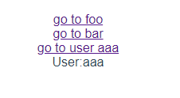
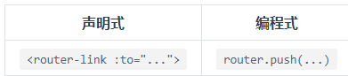
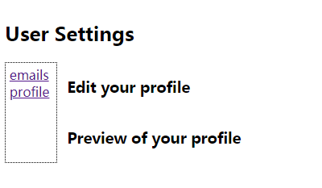

--

为什么我们不能像原来一样直接用<a></a>标签编写链接哪？

vue-router如何使用？

常见路由操作有哪些？

等等这些问题，就是本篇要探讨的主要问题。

**这里的路由就是SPA（单页应用）的路径管理器**。

再通俗的说，vue-router就是WebApp的**链接路径管理系统。**

vue-router是vue的官方路由插件。

跟vue是深度集成的。

非常适合用于SPA的构建。

vue的单页应用是基于路由和组件的。

路由设定path。

并把path和组件映射起来。

传统的页面应用。是靠一些超链接来实现页面切换和跳转的。

在单页应用里，则是path之间的切换，也就是组件的切换。


路由模块的本质就是建立起url和页面之间的映射关系。

至于为什么不能用<a>标签。

因为vue做的是单页应用，只有一个index.html和一些资源文件。

所以你写的<a>标签是不起作用的。你必须使用vue-router来管理。


单页应用的核心之一是：更新视图而不是重新请求页面。

vue-router实现单页面前端路由时，提供了两种方式：

hash模式和history模式。

你可以通过构造的时候，传递参数来选择你需要的模式。


hash模式

这个是默认的模式。使用url的hash来模拟一个完整的url。

这样当url改变的时候，页面不会重新加载。

hash，就是#，表示的是网页里的一个位置。

只改变#后面的部分，浏览器只会把页面滚动到对应的位置，不会重新加载页面。

也就是说，hash出现在url里，但不会被包含在http请求里。

对后端没有任何影响。

因此改变hash不会重新加载页面。

同时，每一次改变hash，都会在浏览器访问历史里增加一个记录。

使用回退按钮，可以回到上一个位置。

hash模式，根据不同的hash值，渲染指定dom位置的不同数据。

有onhashchange事件，在window对象上监听这个事件。


history模式

因为hash模式会在url里带上#号，看起来有点丑。

如果不想url里有#号，那么就使用history模式。

这种模式充分利用了html5 history interface里新增的pushState()和replaceState()方法。

这两个方法应用与浏览器记录栈。

修改了历史记录。

他们执行的时候，虽然修改了当前的url，但是不会立刻向后端发起请求。

使用history模式的时候，url看起来就跟普通的网页一样。

不过这种模式，还需要后端进行一定的配合。

要避免404，在找不到页面的时候，要调回到首页。


使用路由模式来实现页面跳转的方式

有3种：

1、直接修改地址栏。

2、this.$router.push('地址')

3、`<router-link to="地址"></router-link>`


vue-router的使用步骤

```
1、安装：npm i -s vue-router
2、在main.js里引入: import VueRouter from 'vue-router'
3、安装到Vue：Vue.use(VueRouter)
4、创建路由对象，并配置路由规则
	let router = new VueRouterZ({
		routes: [
			{path:'/home', component:Home}
		
		]
	})
5、把router实例传递给Vue实例。
	var app = new Vue({
		router,
		//...
	})
6、index.html代码里，写这：
	<div id="app" v-cloak>
        <router-view></router-view>
    </div>
```


在引入vue-router之前，我们的单页应用，是靠组合多个component来完成。

引入vue-router之后，我们需要把component映射到路由。


# HelloWorld

用vue-cli来创建一个demo项目。

```
vue init webpack demo
```

然后需要修改一下webpack里的config的host为0.0.0.0，方便我进行测试。

然后修改App.vue的内容如下：

```
<template>
  <div id="app">
    <router-link to="/foo">go to foo</router-link>
    <router-link to="/bar">go to bar</router-link>
    <router-view/>
  </div>
</template>

<script>

export default {
  name: 'App',
  methods: {
    goBack() {
      window.history.length>1 ? this.$router.go(-1) : this.$router.push('/')
    }
  }
}
</script>

```

router/index.js如下：

```
import Vue from 'vue'
import Router from 'vue-router'

Vue.use(Router)

const Foo = {template: '<div>foo</div>'}
const Bar = {template: '<div>bar</div>'}

const routes = [
  {
    path: '/foo', component: Foo
  },
  {
    path: '/bar', component: Bar
  }
]
export default new Router({
  routes
})
```

其实的不动。

然后npm run dev。

就可以访问到。


点击go to链接，就可以跳转到对应的界面。

可以点击浏览器的前进后退按钮进行浏览。

# 动态路由匹配

就是对于/user/:id 这样的路径，统一都由User这个component来处理。

这个就叫动态路由匹配。

使用动态路径参数来达到这个效果。

在router/index.js里加上

```
const User = {template: '<div>User:{{$route.params.id}}</div>'}
//在routes数组里加上
  {
    path: '/user/:id', component: User
  }
在App.vue里加上：
<router-link to="/user/aaa">go to user aaa</router-link><br>
```


当匹配到一个路由的时候，参数值会被设置到this.$route.params里。




## 动态路由参数的变化

从/user/aaa到/user/bbb的时候，原来的component实例会被复用。

因为使用的是同一个component，销毁再创建，没有必要。

但是这个就导致了一个需要注意的点：组件的生命周期钩子函数不会被调用。

所以，在复用组件的时候，如果想对路由参数的变化做出响应的话，你可以简单地watch一下$route对象。

```
const User = {
	template: '...',
	watch: {
		$route(to, from) {
			//在这里对路由变化做出响应。
		}
	}
}
```

在vue2.2引入了一个新的钩子函数，beforeRouteUpdate。

你可以在这个里面做你的事情。

```
const User = {
	//...
	beforeRouteUpdate(to, from, next) {
		//记得最后调用一下next()函数
	}
}
```

## 兜底路由

常规参数只会匹配被`/`分割的url片段里的字符。

如果想匹配任意路径，那么就可以使用通配符`*`

```
{
	path: '*' //匹配所有路径
}，
{
	path: '/user-*'//匹配所有以/user-开头的路径。
}
```

使用通配符路由时，带通配符的要放到靠后的位置。

而“*”这个应该放到最后，作为404的处理。

当使用通配符的时候，$route.params会自动被添加一个参数，名为pathMatch。


```
this.$route.push('/user-admin')
//这样pathMatch的值为admin。
```


# 嵌套路由

什么是嵌套路由？

在实际的项目里，应用界面都是由多层嵌套的component组合而成。

url的动态路径也按某种结构对应嵌套的各层component。

在User这个component下面，还有Profile和Posts这2个component。

```
/user/foo/profile                     /user/foo/posts
+------------------+                  +-----------------+
| User             |                  | User            |
| +--------------+ |                  | +-------------+ |
| | Profile      | |  +------------>  | | Posts       | |
| |              | |                  | |             | |
| +--------------+ |                  | +-------------+ |
+------------------+                  +-----------------+
```

我们看看如何实现这个。

App.vue这样改一下。

```
<template>
  <div id="app">
    <router-link to="/user/aaa">/user/aaa/</router-link><br>
    <router-link to="/user/aaa/profile">/user/aaa/profile</router-link><br>
    <router-link to="/user/aaa/posts">/user/aaa/posts</router-link><br>
    <router-view/>
  </div>
</template>
```

router/index.js

```
import Vue from 'vue'
import Router from 'vue-router'

Vue.use(Router)


const User = {
  template: `
  <div>
  <h2>User:{{$route.params.id}}</h2>
  <router-view></router-view>//这里放一个router-view。
  </div>`
}
const UserHome = {
  template: '<div>Home</div>'
}
const UserProfile = {
  template: '<div>Profile</div>'
}
const UserPosts = {
  template: '<div>Posts</div>'
}

const routes = [

  {
    path: '/user/:id',
    component: User,
    children: [//这里增加children数组。
      {
        path: '',
        component: UserHome
      },
      {
        path: 'profile',
        component: UserProfile
      },
      {
        path: 'posts',
        component: UserPosts
      }
    ]
  }
]
export default new Router({
  routes
})

```

# 函数方式来导航

上面我们都是在router-link里设置to来进行导航的。

其实也可以在js代码里用函数来进行导航。

用router.push函数。

```
router.push(location, onComplete?, onAbort?)
```

这个方法会向浏览器历史里添加一条记录。

实际上，点击router-link的时候，内部就是调用的这个函数。



location这个参数，可以是字符串，也可以是一个描述地址的对象。

```
router.push('home')//字符串
router.push({path:'home'})//对象
//命名的路由
router.push({
	name: 'user',
	params: {
		userid: '123'
	}
})
//带查询参数，等价于/register?name=aaa
router.push(
	{
		path: 'register',
		query: {
			name: 'aaa'
		}
	}
)
```

如果提供了path，那么后面的params会被忽略。

path你可以这样写：

```
router.push({
	path: `/user/${userId}`
})
```


router.replace()函数

参数跟push函数一样。

还有一个router.go函数。这个函数的参数是一个数字，大于0表示前进，小于0表示后退。


# 命名视图

如果要同时展示多个同级的视图（不是嵌套的）。

例如一个布局，有sidebar（侧边导航）和main这2个视图。

这个时候，就需要使用命名视图。

```
<router-view class="view one"></router-view>
<router-view class="view two" name="a"></router-view>
<router-view class="view three" name="b"></router-view>
```

如果一个router-view没有给name属性，那么name就是default。

这样

```
const router = new VueRouter({
  routes: [
    {
      path: '/',
      components: {
        default: Foo,
        a: Bar,
        b: Baz
      }
    }
  ]
})
```

## 嵌套命名视图

这个是非常常见的。

你点击emails和profile，则右边的页面进行变化。




参考资料

1、从头开始学习vue-router

https://www.jianshu.com/p/4c5c99abb864

2、官方文档

https://router.vuejs.org/zh/guide/#html