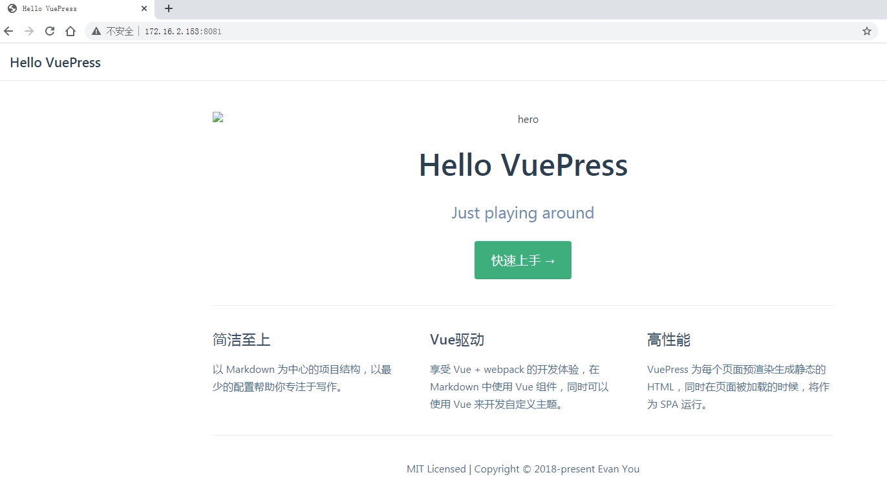
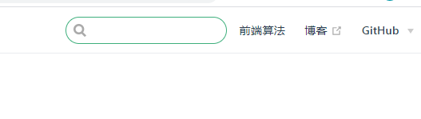

在github上搜索魔趣的时候，发现它的官网是用vuepress生成的。

https://github.com/MoKee/www/blob/master/package.json

我觉得整体风格挺好的。

看看vuepress。

先自己按照官网说明操作一遍。

```
yarn create vuepress-site
```

这个会安装一些东西，然后让你设置一些基本信息。

然后得到的目录结构是这样：

```
teddy@thinkpad:~/work/test/vuepress-test$ tree
.
└── docs
    ├── package.json
    └── src
        ├── config
        │   └── README.md
        ├── guide
        │   ├── README.md
        │   └── using-vue.md
        └── index.md
```

在当前目录下执行：

```
mkdir vuepress-starter && cd vuepress-starter
```

然后执行

```
yarn init
```

然后本地安装vuepress

```
yarn add -D vuepress
```

然后就可以在docs目录下写markdown文档。

```
mkdir docs && echo '# Hello VuePress' > docs/README.md
```

然后在package.json里加上需要的命令。

```
{
  "scripts": {
    "docs:dev": "vuepress dev docs",
    "docs:build": "vuepress build docs"
  }
}
```

运行：

```
yarn docs:dev
```

然后本机访问这个地址：

http://localhost:8081/


# 详细一点的过程

上面的官网过程，感觉有点乱。

还是另外找一篇教程来重新做一遍。

用npm来做工具。不用yarn。

安装命令行工具。

```
npm install -g vuepress
```

```
npm init -y
```


手动创建project目录下的层次如下：

```
teddy@thinkpad:~/work/test/vuepress-test/project$ tree -a
.
├── docs
│   ├── README.md
│   └── .vuepress
│       ├── config.js
│       └── public
│           └── logo.png
└── package.json
```


config.js内容这样写：

```
module.exports = {
  title: 'Hello VuePress',
  description: 'Just playing around'
}
```

在docs目录下，新建一个README.md

```
---
home: true
heroImage: /logo.jpg
actionText: 快速上手 →
actionLink: /zh/guide/
features:
- title: 简洁至上
  details: 以 Markdown 为中心的项目结构，以最少的配置帮助你专注于写作。
- title: Vue驱动
  details: 享受 Vue + webpack 的开发体验，在 Markdown 中使用 Vue 组件，同时可以使用 Vue 来开发自定义主题。
- title: 高性能
  details: VuePress 为每个页面预渲染生成静态的 HTML，同时在页面被加载的时候，将作为 SPA 运行。
footer: MIT Licensed | Copyright © 2018-present Evan You
---
```

现在就可以得到一个不错的页面了。



要实现顶部导航和侧板导航，我们可以修改config.js。

下面只是一个示例。要自己去修改调整。

```
module.exports = {
  title: '我的网站',
  description: '我的网站描述',
  // 注入到当前页面的 HTML <head> 中的标签
  head: [
    ['link', { rel: 'icon', href: '/favicon.ico' }], // 增加一个自定义的 favicon(网页标签的图标)
  ],
  base: '/web_accumulate/', // 这是部署到github相关的配置 下面会讲
  markdown: {
    lineNumbers: true // 代码块显示行号
  },
  themeConfig: {
    nav:[
      { text: '前端算法', link: '/algorithm/' }, // 内部链接 以docs为根目录
      { text: '博客', link: 'http://obkoro1.com/' }, // 外部链接
      // 下拉列表
      {
        text: 'GitHub',
        items: [
          { text: 'GitHub地址', link: 'https://github.com/OBKoro1' },
          {
            text: '算法仓库',
            link: 'https://github.com/OBKoro1/Brush_algorithm'
          }
        ]
      }        
    ]
  }
};
```

效果的这样



# 用vuepress搭建企业官网

这个就是一个工业企业的官网，用vuepress搭建的，看起来还不错。

http://lylmhbkj.yaya12.com/

这个作者对vuepress研究倒是挺多的。

https://github.com/Heyff12/vuepress-theme-yaya

参考资料

1、

https://www.yaya12.com/works/company-website.html

# 用vuepress搭建项目文档展示网站

这个是文字版本。

https://www.jianshu.com/p/93c532cdf951

这个是视频说明

https://www.bilibili.com/video/BV1mo4y1S7AH

# VitePress

vuepress自己开发的新版本。

# 一些用vuepress开发的网站


# 参考资料

1、VuePress 手摸手教你搭建一个类Vue文档风格的技术文档/博客

https://segmentfault.com/a/1190000016333850

2、Leader让我做CMS帮助中心的技术选型，我撸了VuePress和GitBook，然后选择...

https://zhuanlan.zhihu.com/p/96031517

3、

https://segmentfault.com/a/1190000020971477