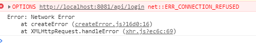

# 总结

1、前端编译成静态资源，只启动后端就可以了。

2、前端也需要运行，前后端进行实时通信。

前后端通信，用axios这个模块。


# 只启动后端

这种前端编译好，只启动后端就好了。


先创建一个vue工程。

```
vue init webpack vue-node
cd vue-node
npm install
npm run dev
```

然后修改src目录名字为client。

将webpack.base.config.js里的src也改成client。有3处，替换就好了。

然后到项目根目录，新建一个server目录。

```
touch app.js
npm install express body-parser --save
```

把下面的内容粘贴到app.js里。

```
var express = require('express');
var fs = require('fs');
var path = require('path');
var bodyParser = require('body-parser');
var app = express();
app.use(bodyParser.json());
app.use(bodyParser.urlencoded({ extended: false }));
// 访问静态资源
app.use(express.static(path.resolve(__dirname, '../dist')));
// 访问单页
app.get('*', function (req, res) {
    var html = fs.readFileSync(path.resolve(__dirname, '../dist/index.html'), 'utf-8');
    res.send(html);
});
// 监听
app.listen(8081, function () {
    console.log('success listen...8081');
});
```

然后编译，运行：

```
npm run build       
node server/app.js
```

访问就可以了。

生成的前端的文件是在dist目录下，

index.html里的内容是这样：

```
<body>
  <div id=app></div>
  <script type=text/javascript src=/static/js/manifest.2ae2e69a05c33dfc65f8.js> </script> <script type=text/javascript
    src=/static/js/vendor.eefaac73d06c156e050b.js> </script> <script type=text/javascript
    src=/static/js/app.535b277e186fe52c1562.js> </script> </body> </html>
```


# vue和express的前后端分离

express是后端服务器，它是一个独立的服务器，vue启动的是前端服务器，vue-cli中已经集成了一个小型的express，这两个服务器是分开放的。

可以都借助vue和express命令行工具来搭建最简单基本的环境。

```
vue init webpack myapp
```

```
express server
```

这样就创建了2个目录，一个myapp。一个server。

对myapp目录下做如下修改：

在main.js里加上这两行。这个是为了引入axios。并指定axios请求的模板网址，这个网址就是express运行的地址。

```
Vue.prototype.$axios = axios
axios.defaults.baseURL = 'http://localhost:3000'
```

把HelloWorld.vue改成下面这样。这个就是在创建页面的时候，去请求express的内容。因为默认打开了eslint。下面的代码不完全符合eslint的规则。所以需要在build/webpack.base.conf.js里，注释掉eslint那一行。

`*...(config.dev.useEslint ? [createLintingRule()] : []),*`就是这一行。

```
<template>
  <div>Hello World！</div>
</template>
<script>
export default {
  name: 'HelloWorld',
  data() {
    return {
      msg: 'Welcome to Your Vue.js App',
    };
  },
  methods: {
    init() {
      this.$axios
        .get('/login')
        .then((res) => {
          console.log(res);
        })
        .catch((err) => {
          console.log(err);
        });
    },
  },
  created() {
    this.init();
  },
};
</script>

<!-- Add 'scoped' attribute to limit CSS to this component only -->
<style >
</style>
```


对于express这边做这些修改：

在routes目录下，新增login.js。内容如下：

```
var express = require('express');
var router = express.Router();

/* GET login page. */
router.get('/', function(req, res, next) {
  // 处理一些业务并返回下面数据
  res.json({name:'adoctors',pwd:'123'});
});

module.exports = router;
```

在app.js里，加上这些语句，要加到合适的位置上。

需要安装cors模块。这个是实现跨域访问的。并允许从8080端口过来的访问（也就是托管前端代码的服务器地址）

```
var cors = require('cors')
app.use(cors({
  origin:['http://localhost:8080'],
  methods:['GET', 'POST'],
  allowedHeaders: ['Content-Type', 'Authorization']
}))
```

还要加上login的。

```
var loginRouter = require("./routes/login")
app.use('/login', loginRouter)
```

然后运行后端：

```
node ./bin/www
```

运行前端：

```
npm run dev
```

然后打开浏览器，访问http://localhost:8080，就可以在控制台看到后端返回的数据了。

这样就实现了前后端分离。

**一般我们把前端就托管到80端口。后端托管到8080等不知名的端口。**

这样就是前端负责渲染，后端只负责提供json格式的数据就好了。


# 复杂一点的前后端分离

https://juejin.im/post/5aabc2caf265da239376d5ff

对这篇文章的分析。

代码在这里：

https://github.com/weirui88888/express-mongodb-node

下载到本地。

需要先安装好mongodb，并创建一个数据库，名字为myDbs。

解压，进入到目录


安装依赖包：

```
npm i
```

执行build

```
npm run build
```

运行dev

```
npm run dev
```

上面只是启动了前端，

还需要手动启动后端。（后端如果没有启动，则进行添加没有反应，也不报错）

```
node app.js
```

然后可以在本机进行访问（如果不做改动，只能本机访问，其他机器用局域网ip也访问不了）。

其他机器访问会报这种错误。



可以正常进行操作。


参考资料

1、vue与node结合开发部署

https://julytian.github.io/2017/04/06/vue%E4%B8%8Enode%E7%BB%93%E5%90%88%E5%BC%80%E5%8F%91%E9%83%A8%E7%BD%B2/

2、打通前后端 -- 构建一个 Vue + Express 的开发环境

https://juejin.im/entry/5a6198c5518825734f52c71a

3、express+mongodb+vue实现增删改查-全栈之路

https://juejin.im/post/5aabc2caf265da239376d5ff

4、

https://www.cnblogs.com/adoctors/p/8911151.html