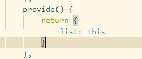
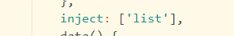

把常见的前端框架都简单过一遍，了解一下基本的使用方法。

web库和web框架的区别

jQuery就是库。核心是dom操作。jQuery只是简化了这个操作。

vue就是框架。你按照框架要求填写代码。

vue是MVVM模式的应用。

在vue里，你关注的核心是数据，不要再去操作dom了。

vue，发音跟view一样。

用来构造用户界面的渐进式框架。

vue只关注视图层。

采用自底向上的增量开发设计。

下面的内容，参考https://cn.vuejs.org/v2/guide/#%E5%A3%B0%E6%98%8E%E5%BC%8F%E6%B8%B2%E6%9F%93来写的。

# 声明式渲染

```
<html lang="en">
<head>
    <meta charset="UTF-8">
    <meta name="viewport" content="width=device-width, initial-scale=1.0">
    <meta http-equiv="X-UA-Compatible" content="ie=edge">
    <title>Document</title>
    <script src="https://cdn.staticfile.org/vue/2.4.2/vue.min.js"></script>
</head>
<body>
    <div id="app">
        <p>{{ message }}</p>
    </div>
    <script>
    var app = new Vue({
        el: "#app",
        data: {
            message: 'hello vue'
        }
    })
    </script>
</body>
</html>
```

我们在chrome里，按F12打开控制台，输入：

```
app.message = "hello xhl"
```

然后就可以看到网页直接就变了。

除了文本插值，我们还可以像这样来绑定元素特征。

```
<div id="app">
        <span v-bind:title="message">
            鼠标悬停此处查看此处动态绑定的提示信息。
        </span>
    </div>
    <script>
        var app = new Vue({
            el: "#app",
            data: {
                message: "页面加载于 " + new Date().toDateString()
            }
        })
    </script>
```

这里我们遇到一点新的东西，v-bind，这种叫做指令。

指令是前面带有v-前缀的。用来表示它们是vue提供的特殊属性。


# 条件与循环

控制一个元素是否显示。

```
<div id="app">
        <p v-if="seen">你看到我了</p>
    </div>
    <script>
        var app = new Vue({
            el: "#app",
            data: {
                seen: true
            }
        })
    </script>
```

我们只需要在控制上输入

```
app.seen = false
```

“你看到我了”这行字就会消失。

vue提供了一个强大的过渡效果系统。可以在vue插入、更新、移除元素时，自动应用过渡效果。

v-for指令用来绑定数组的数据来渲染一个项目列表。

```
<div id="app">
        <ol>
            <li v-for="todo in todos">
                {{todo.text}}
            </li>
        </ol>
    </div>
    <script>
        var app = new Vue({
            el: "#app",
            data: {
                todos: [
                    {text: "xx"},
                    {text: "yy"},
                    {text: "zz"}
                ]
            }
        })
    </script>
```

然后我们在控制台：

```
app.todos.push({text:"aa"})
```

可以看到列表自动增加了。


# 处理用户输入

用v-on增加监听器。

```
<div id="app">
        <p>{{message}}</p>
        <button v-on:click="reverseMessage">逆转消息</button>
    </div>
    <script>
        var app = new Vue({
            el: "#app",
            data : {
                message: "hello vue"
            },
            methods: {
                reverseMessage: function() {
                    this.message = this.message.split('').reverse().join('')
                }
            },
        })
    </script>
```

这个过程中，我们都没有去操作dom的。

vue还提供了v-model指令，它可以实现表单输入和应用状态之间的双向绑定。

```
<div id="app">
        <p>{{message}}</p>
        <input v-model="message">
    </div>
    <script>
        var app = new Vue({
            el: "#app",
            data : {
                message: "hello vue"
            }
            
        })
    </script>
```

然后我们在输入框里进行输入，外面的显示也会变化。

# 组件化应用构建

组件系统是vue的一个重要概念。

是一种抽象，允许我们使用小型、独立和通常可以复用的组件构建大型应用。

在vue里，一个组件，本质上是一个拥有预定义选项的vue实例。

在vue里注册组件很简单。

```
<div id="app">
        <ol>
            <todo-item
                v-for="item in mylist"
                v-bind:todo="item"
                v-bind:key="item.id"
            >

            </todo-item>
        </ol>
    </div>
    <script>
        Vue.component("todo-item", {
            props: ['todo'],
            template: '<li>{{todo.text}}</li>'
        })
        var app = new Vue({
            el: "#app",
            data : {
                mylist: [
                    {id:0, text: 'xx'},
                    {id:1, text: 'yy'},
                    {id:2, text: 'zz'}
                ]
            }
            
        })
    </script>
```


# vue实例

## 创建一个vue实例

每个vue应用都是通过用Vue函数创建一个新的Vue实例开始的。

```
var vm = new Vue({
  //选项
})
```

虽然没有完全遵守mvvm模型，但是vue的设计也受到了它的启发。

因此在文档里经常用vm（ViewModel）这个变量名来表示Vue实例。

一个Vue应用由根Vue实例和组件树来构成。

例如，一个todo应用的组件树可以是这样：

```
根实例
	TodoList
		TodoItem
			DeleteTodoButton
			EditTodoButton
		TodoListFooter
			ClearTodoButton
			TodoListStatistics
```

## 数据与方法

当一个vue实例被创建时，它向vue的响应式系统里加入了data对象里的所有属性。

当这些属性值发生变化时，视图会发生响应。就是匹配为新的值。

## 实例生命周期钩子

每个vue实例在被创建的时候，都要经过一系列的初始化过程。

例如：

需要设置数据监听。

编译模板。

将实例挂接到dom

在数据变化时更新dom。

在这些节点上，可以挂接钩子函数，让用户实现自定义。

```
var app = new Vue({
            el: "#app",
            data : {
                a:1
            },
            created() {
                console.log("a is :" + this.a)
            },
        })
```

还有其他函数：

mounted

updated

destroyed。


# 模板语法

vue使用了基于html的模板语法。

允许开发者声明式地把dom绑定到底层vue实例的数据。

所有vue的模板都是合法的html。

如果你对虚拟dom很熟悉，而且喜欢使用JavaScript的原始力量，你可以直接写render函数。

## 插值

```
文本
html
```

文本的很简单，就是双层大括号。

html的需要使用v-html指令。

```

```

# 计算属性和监听器

模板里的表达式使用非常便利，但是设计的初衷是进行简单的运算的。

在模板里放入太多的逻辑，会让模板过重，而且难以维护。

所以对于任何复杂逻辑，都应该使用计算属性。

```
<div id="app">
        <p>{{message}}</p>
        <p>reverse: {{reversedMessage}}</p>
    </div>
    <script>
        Vue.component("todo-item", {
            props: ['todo'],
            template: '<li>{{todo.text}}</li>'
        })
        var app = new Vue({
            el: "#app",
            data : {
                message: "hello"
            },
            computed: {//这里就是计算属性。
                reversedMessage: function() {
                    return this.message.split('').reverse().join('')
                }
            },
        })
    </script>
```

计算属性，也可以用methods属性里的函数调用来做。

区别是：methods的方式，不会有缓存。

监听属性是watch。

```
<div id="app">
        <p>{{fullName}}</p>
    </div>
    <script>
        Vue.component("todo-item", {
            props: ['todo'],
            template: '<li>{{todo.text}}</li>'
        })
        var app = new Vue({
            el: "#app",
            data : {
                firstName: "foo",
                lastName: "bar",
                fullName: "foo bar"
            },
            watch: {
                firstName: function(val) {
                    this.fullName = val + " " + this.lastName;
                },
                lastName: function(val) {
                    return this.firstName + " " + val;
                }
            },
        })
    </script>
```

computed比watch要简洁很多。

## 计算属性的setter

计算属性默认只有getter。

我们可以自己实现setter。

```
var app = new Vue({
            el: "#app",
            data : {
                firstName: "foo",
                lastName: "bar",
                fullName: "foo bar"
            },
            computed: {
                fullName: {
                    get: function() {
                        return this.firstName + " " + this.lastName;
                    },
                    set: function(newValue) {
                        var names = newValue.split(' ')
                        this.firstName = names[0]
                        this.lastName = names[names.lengh - 1]
                    }
                }
            },
        })
```


虽然计算属性在大多数情况下更加合适，但是有时候还是需要自定义侦听器。

这就是为什么vue通watch选项提供了一个更加通用的方法。来响应数据的变化。

当需要在数据变化时，执行异步或者开销比较大的操作时，这种方式是最有用的。


```
v-text：改变dom对象的text内容。
v-html：改变dom对象的innerHTML。
v-bind
	简写就是冒号。
	<a v-bind:href="xxx"></a>
	<a :href="xxx"></a>
v-on
	v-on:click="say" or v-on:click="say('参数', $event)"
	简写：@click="say"
v-model
	实现form元素的双向数据绑定。
	说明：监听用户的输入事件以更新数据
v-for
	推荐：使用 v-for 的时候提供 key 属性，以获得性能提升。
	使用 key，VUE会基于 key 的变化重新排列元素顺序，并且会移除 key 不存在的元素。
	
提升性能：v-pre
提升性能：v-once
```


# 组件通信

有这种3种：

父组件到子组件：通过子子组件的props属性（一个数组）来传递。

子组件到父组件：父组件给子组件传递一个函数，子组件调用这个函数。

组件A到组件B，A和B没有父子关系：这个就创建一个空的vue实例，用来做通信。


# SPA

单页应用。

只有第一次会加载页面。后面的操作，都是js局部更新数据。

带来的好处：请求的数据少了。减轻了服务器的负担。

给用户本地应用类似的体验。

实现的技术：

1、ajax。

2、锚点的使用。

3、hashchange事件。


SPA往往是功能复杂的应用，为了有效管理所有视图内容，前端路由 应运而生

简单来说，路由就是一套映射规则（一对一的对应规则），由开发人员制定规则。
当URL中的哈希值（# hash）发生改变后，路由会根据制定好的规则，展示对应的视图内容


# props

组件接受的选项之一 props 是 Vue 中非常重要的一个选项。父子组件的关系可以总结为：

props down, events up

父组件通过 props 向下传递数据给子组件；子组件通过 events 给父组件发送消息。

## 什么是prop

prop就是出现在标签里的东西。

```
<mycomp prop1="xx"></mycomp>
```

"xx"，引号里面是js表达式。

一个实际一点的例子

```
<blog-post v-bind:is-published="post.isPublished">
</blog-post>
```

prop只能从父组件传递给子组件。

这样可以防止子组件意外改变父组件的内容。

父组件更新prop后，子组件里会自动刷新。


## props和data区别

Vue提供了两种不同的存储变量：`props`和`data`。

这些方法一开始可能会让人感到困惑，因为它们做的事情很相似，而且也不清楚什何时使用`props`，何时使用`data`。

那么`props`和`data`有什么区别呢？

`data`是每个组件的私有内存，可以在其中存储需要的任何变量。`props`是将数据从父组件传递到子组件的方式。

数据从根组件(位于最顶端的组件)沿着树向下流动。就像基因是如何代代相传的一样，父组件也会将自己的`props`传给了他们的孩子。

然而，当我们从组件内部访问`props`时，我们并不拥有它们，所以我们不能更改它们(就像你不能改变你父母给你的基因一样)。

但是有些情况我们需要改变变量，所以 `data` 就派上用场了。


# router-link

在vue1.0版本的超链接标签还是原来的`a`标签，链接地址由`v-link`属性控制

而vue2.0版本里超链接标签由`a`标签被替换成了`router-link`标签，但最终在页面还是会被渲染成a标签的

至于为什么要把a换成router-link原因还是有的，

比如我们之前一直惯用的nav导航里面结构是（ul>li>a），

router-link可以渲染为任何元素，

这里可以直接渲染成li标签，同样能实现跳转效果，节省了a标签的使用，

还有一个原因可能是因为a标签正常是链接的跳转的作用，

点击a时可能会重载页面，使用router-link，此标签会被vue所监听，跳转链接时就不会刷新页面了。

# provide和inject

provider/inject：简单的来说就是在父组件中通过provider来提供变量，然后在子组件中通过inject来注入变量

在vue的组件树里，任何一个组件，都可以通过`this.$root`来访问根节点。

也可以通过`this.$parent`来访问自己的父节点。

这是一种不太推荐的方式，用来在组件之间进行通信。（正常通信是用props来做）

因为可能在多层嵌套后，出现这样的代码：

```
this.$parent.$parent.$parent.xx
```

这样代码无法维护。

为了解决这种问题，vue提供了provide和inject这2个选项，用来实现依赖注入。

provide是一个函数，写在父组件里，用来给子组件提供数据或者方法。

```
provide: function() {
	return {
		getData: this.getData
	}
}
```

在任意的后代组件里，可以使用inject选项来指定接收。

```
inject: ['getData']
```

在uniapp的uni-list和uni-list-item里，就使用了这个。

父组件uni-list，把自己暴露给子组件。



子组件，接收



https://www.cnblogs.com/zhangmingyan/articles/12669987.html

官网介绍provide

https://cn.vuejs.org/v2/guide/components-edge-cases.html

# ref

ref是给你提供一个从js代码里操作一个dom控件的把手。


# slot

是在需要向组件传递内容的时候，在组件里放一个slot。这样传递进来的内容，就会插入到slot的位置上。

这篇文章写得非常好。值得学习。

https://blog.csdn.net/qq_41809113/article/details/121640035

# 大小写

组件名和prop名字，会有自动的大小写转换。

事件名不会有这种转换。推荐使用连字符的方式，因为事件名不会作为js变量名。


# .sync修饰符

虽然不推荐，但是有时候还是有对一个prop进行“双向绑定”。

真正的双向绑定会带来维护问题。

所以这里用触发事件的方式来替代真正的双向绑定。

例如，更新标题。

在子组件里，

```
this.$emit('update:title', 'new title')
```

在父组件里

```
<text-document
	v-bind:title="doc.title"
	v-on:update:title="doc.title = $event"
>
</text-document>
```

这样看起来比较啰嗦，提供一种简写方式，就是sync修饰符。

```
<text-document
	v-bind.title.sync="doc.title"
>
</text-document>
```

# data-v-xxx

在Vue开发中，会遇到html被浏览器解析后，在标签中出现’data-v-xxxxx’标记，如下：

```
<div data-v-fcba8876 class="xxx"> aaa</div>
```

​    这是在标记vue文件中css时使用scoped标记产生的，因为要保证各文件中的css不相互影响，给每个component都做了唯一的标记，所以每引入一个component就会出现一个新的'data-v-xxx'标记


由于样式中使用了scoped，所以编译后标签对中生成data-v-xxx属性。


https://blog.csdn.net/fengjingyu168/article/details/79769608

# 参考资料

1、

http://www.runoob.com/vue2/vue-directory-structure.html

2、Vue学习看这篇就够

https://juejin.im/entry/5a54b747518825734216c3df

3、

https://cn.vuejs.org/v2/guide/#%E5%A3%B0%E6%98%8E%E5%BC%8F%E6%B8%B2%E6%9F%93

4、Vue props用法详解

https://www.jianshu.com/p/89bd18e44e73

5、

https://www.html.cn/web/vue-js/17249.html

6、Vue-详解设置路由导航的两种方法：` <router-link :to="..."> 和router.push(...)`

https://www.cnblogs.com/superlizhao/p/8527317.html

7、Vue的router-link标签

https://www.cnblogs.com/mr-wuxiansheng/p/11309507.html