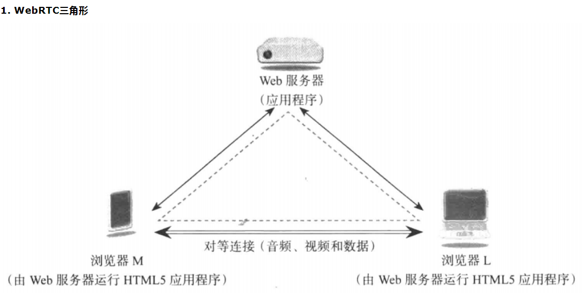
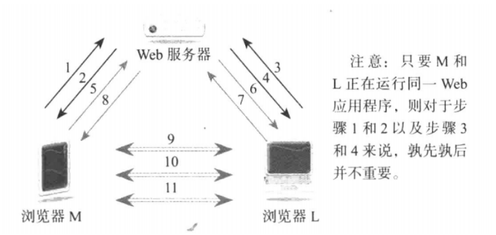
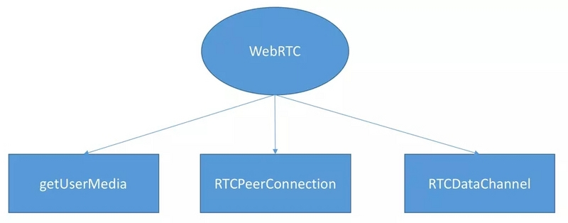
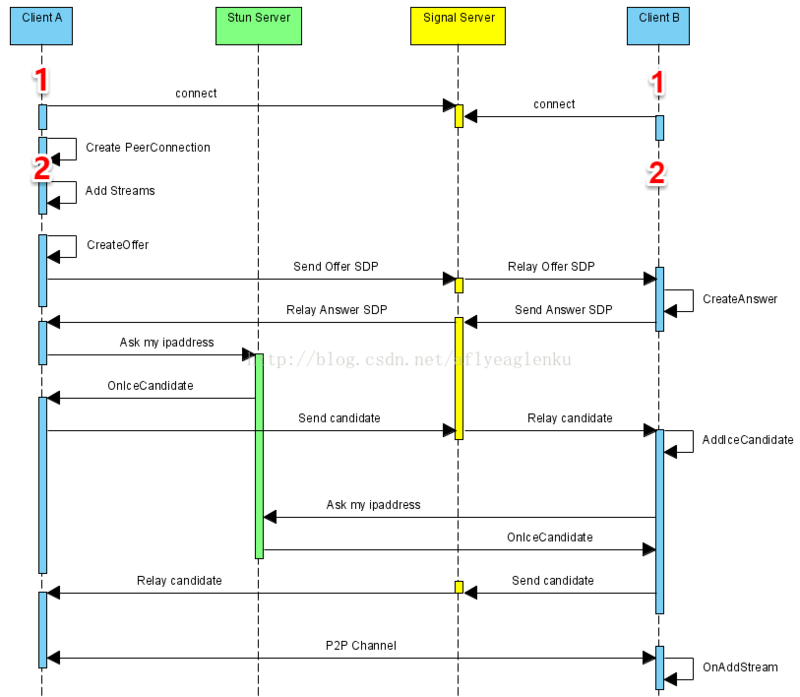

--

# 简介

webrtc是web Real-Time Communication网络实时通信的缩写。

表示一种支持网页浏览器进行语音和视频对话的技术。

谷歌在2010年收购了一家公司得到的这个技术。

并且在2011年开源了出来，在业内得到的广泛的支持，成为下一代的视频通话的标准。

WebRTC实现了**基于网页的语音对话或视频通话**，目的是无插件实现web端的实时通信的能力。

## 发展历史

经历过Adobe Flash、Microsoft SilverLight的失败，也经历过Skype的辉煌，

Google最终把目标放在Html5。

WebRTC实时通信（Web Real-Time Communication）是一项开源技术，


**用来在Web浏览器中实现实时直接的多媒体通信功能，**

它能够建立两个或更多的人之间的端到端的**音频和视频流连接。**

这项只需要使用HTML 5和简单的Javascript API，

**开发者可以很轻松的创建RTC应用，只要浏览器支持，就可在不安装任何扩展和插件的前提下进行实时音频和视频聊天，**

它的原始动机当然希望用这个开源工程击败微软的Skype和苹果的Facetime。


十余年来，WebRTC终于获得了绝大多数浏览器厂商的支持，可谓是十年媳妇熬成婆。

但这只是一种技术。

在实际的技术实践中，就算你有许多理论、有多牛的技术，但不管你如何努力，

都不能够直接的被表达为一种结果。

这种需要通过一种介质才能够间接的表达我们核心能力的神秘现象，那就是＂场景＂。


当然，场景的讨论很难，因为，只要是黑科技，一定是一种场景的表达而不是技术表达。

比如华为的鸿蒙操作系统，它可以通过一套OS来完成物联网全连接，但这不是场景。

它必须通过PC、Pad、手机、电视、汽车等等多种连接场景，

让你们感受到它的那种震憾，这就是场景所带给我们的体验和商业价值。


WebRTC何尝不是，十年时间，WebRTC孜孜不倦的在寻找场景。

各种 App 包括 WhatsApp、Facebook Manager、appear.in 和 TokBox 平台上。

甚至在 iOS 浏览器上的WebRTC实验和微软在 Edge 中增加了 MediaCapture 和 Stream API。

这是一种试图在商业应用中证明自己的能力的努力。

非常遗憾的是，十年时间，真正掌握企业通信的主流厂商一直沉默中，他们或许在等待企业级应用的节点的到来。

**因此，WebRTC的应用，一直处于边缘和非企业级商业应用的状态**


## 组成

视频引擎（VideoEngine）
音效引擎（VoiceEngine）
会议管理（Session Management）
iSAC：音效压缩
VP8：Google自家的WebM项目的视频编解码器
APIs（Native C++ API, Web API）

## api分类

WebRTC原生APIs文件是基于WebRTC规格书撰写而成，

这些API可分成

Network Stream API、 

RTCPeerConnection、

Peer-to-peer Data API

三类。


## 流程

WebRTC易于使用，只需极少步骤便可建立媒体会话。有些消息在浏览器和服务器之间流动，有些则直接在两个浏览器（成为对等端）之间流动。

最简单的场景就是这个webrtc三角形。




具体步骤有11个步骤。



```
1、浏览器M向web服务器请求网页。
2、web服务器向浏览器M返回带有webrtc js的网页。
3、浏览器L请求网页。
4、web服务器向浏览器L返回带有webrtc js的网页。
5、M决定跟L通信，所以通过js代码把自己的session对象（offer、提议）发送到web服务器。
6、web服务器把M的session对象发送到L的js。
7、L上的js将L的session对象（answer、应答）发送到web服务器。
8、web服务器转发应答到M的js。
9、M和L开始交互，确定访问对方的最佳方式。
10、M和L开始协商通信秘钥。
11、M和L交换语音和视频数据。
```

### WebRTC组成



- getUserMedia负责获取用户本地的多媒体数据
- RTCPeerConnection负责建立P2P连接以及传输多媒体数据。
- RTCDataChannel提供的一个信令通道实现双向通信

# 代码编译

官方没有把代码放在github。

下面这个是个人上传的。

https://github.com/JumpingYang001/webrtc

webrtc 全部下载到本地的话，大约会占用 6.4 G 的磁盘空间；

# 演示代码

https://github.com/webrtc/samples


# coturn

https://github.com/coturn/coturn

coturn是一个开源的turn和stun服务器代码。

一般大家把这个叫打洞服务器。


webrtc在连接之前，需要进行2个协商：

1、媒体协商。用sdp协议。

2、网络协商。这个叫candidate。

媒体协商是通话双方，例如A和B。A支持VP8和H264，B支持VP9和H264，那么协商的结果就是使用H264编码。

而对于网络协商

**彼此要了解对方的网络情况，这样才有可能找到一条相互通讯的链路**

**先说结论：(1)获取外网IP地址映射；（2）通过信令服务器（signal server）交换"网络信息"**

理想的网络情况是每个浏览器的电脑都是私有公网IP，可以直接进行点对点连接。

实际情况是：我们的电脑和电脑之前或大或小都是在某个局域网中，**需要NAT（Network Address Translation，网络地址转换）**

在解决WebRTC使用过程中的上述问题的时候，我们需要用到**STUN和TURN**。

**STUN**
STUN（Session Traversal Utilities for NAT，NAT会话穿越应用程序）是一种网络协议，

它允许位于NAT（或多重NAT）后的客户端找出自己的公网地址，

查出自己位于哪种类型的NAT之后，以及NAT为某一个本地端口所绑定的Internet端端口。

这些信息被用来在两个同时处于NAT路由器之后的主机之间**创建UDP通信**。

该协议由RFC 5389定义。

使用一句话说明STUN做的事情就是：告诉我你的公网IP地址+端口是什么。搭建STUN服务器很简单，媒体流传输是按照P2P的方式。

那么问题来了，**STUN并不是每次都能成功的为需要NAT的通话设备分配IP地址的，**

**P2P在传输媒体流时，使用的本地带宽，在多人视频通话的过程中，通话质量的好坏往往需要根据使用者本地的带宽确定。**

那么怎么办？TURN可以很好的解决这个问题。

**TURN**

TURN的全称为Traversal Using Relays around NAT，

是STUN/RFC5389的一个拓展，

主要添加了Relay功能。

如果终端在NAT之后， 那么在特定的情景下，有可能使得终端无法和其对等端（peer）进行直接的通信，

这时就需要公网的服务器作为一个中继， 对来往的数据进行转发。这个转发的协议就被定义为TURN。

在STUN分配公网IP失败后，可以通过TURN服务器请求公网IP地址作为中继地址。

这种方式的带宽由服务器端承担，在多人视频聊天的时候，本地带宽压力较小，

并且，根据Google的说明，TURN协议可以使用在所有的环境中。（单向数据200kbps 一对一通话）

从上面1/2点我们知道了2个客户端协商媒体信息和网络信息，那怎么去交换？

是不是需要一个中间商去做交换？

所以我们需要一个信令服务器（Signal server）转发彼此的媒体信息和网络信息。

**信令服务器不只是交互 媒体信息sdp和网络信息candidate，比如：**

**（1）房间管理**

**（2）人员进出房间**

## 建立连接的流程



## 在云服务器上搭建

为了简单处理，使用docker方式来搭建。

这样安装卸载都比较方便。

https://github.com/ging/licode

# 简单示例

浏览器里的这个js api，就可以使用webrtc了。很简单。

只要实现一个函数就好了。

```
navigator.mediaDevices.getUserMedia(constraints)
.then(function(stream) {
  /* 使用这个stream stream */
})
.catch(function(err) {
  /* 处理error */
});
```

# Janus-gateway

这个是一个基于webrtc的流媒体服务器。

janus是Meetecho开发的一个WebRTC网关，

janus的主要作用就是它可以和你的内网设备和浏览器同时建立连接，

并将浏览器发来的音视频数据包如rtp/rtcp包，

通过自定义插件转发给你的内网设备，

也可以将你发给janus的音视频数据包，加密后转发给浏览器。

这样就完成了内网音视频服务器和外网浏览器的互通。


janus为我们完成了与浏览器建立会话的复杂逻辑，

并且提供给我们简单的插件机制来处理音视频数据。


对于PeerConnection连接的建立过程，

涉及到复杂的NAT穿透的ICE协议的实现，SDP的交换，DTLS-SRTP的握手和数据包加密发送，数据包接收后解密的复杂逻辑。

janus将我们从与浏览器交互的PeerConnection建立的过程中解脱出来，更专注于音视频业务逻辑。


## janus的设计思想 

janus基于插件思想，通过实现基础架构，完成了与浏览器链接的建立过程。

janus的插件主要完成一些必须的函数实现，如RTP/RTCP数据的接收。

我们通过实现自己的插件，来完成在将浏览器RTP数据转发到内网服务器的业务逻辑。

## janus的用途 

janus一般用于拓展已有视频会议系统，提供对浏览器客户端的支持。


安装

```
docker pull canyan/janus-gateway:latest
```

运行

```
docker run -itd  --name janus --hostname janus --network host canyan/janus-gateway:latest
```

这样可以跑起来。


# 网易云信

搜索webrtc资料的时候，找到一些网易云信技术团队写的一些文章。

看看网易云信是做什么的。

网易云信（NeteaseYunXin）是集网易20年IM以及音视频技术打造的PaaS服务产品，来自网易核心技术架构的通信与视频云服务，稳定易用且功能全面，致力于提供全球领先的技术能力和场景化解决方案。

开发者通过集成客户端SDK和云端OPEN API，即可快速实现包含IM、音视频通话、直播、点播、互动白板、短信等功能。


看看这个demo程序。

https://github.com/netease-kit/NIM_Web_Demo

```
git clone https://github.com/netease-kit/NIM_Web_Demo
```

Demo仅供参考，使用的SDK可能不是最新版本。

替换最新的SDK：将SDK的js文件拷贝至Demo文件夹下的 `./webdemo/3rd/`

聊天室源码位于webdemo/chartroom下

安装依赖并运行：

```
npm install
node app.js
```

默认监听在8182端口上。

访问：http://ip:8182/webdemo/index.html 就可以看到。

看起来不错，不仅可以做聊天室，还可以做即时通信。

自己搭建一个内部使用也是可以的。


WebRTC本来就是给浏览器用的，没有native代码可以参考。

但是，在2011年它被Google开源了，源码被应用于各种native开发，**并被业内广泛借鉴**，大有一统天下的趋势。

有了WebRTC，是不是就等于有了实时音视频引擎呢？并不是，以烹饪来做比喻的话，有了WebRTC就好比是有了厨具/原材料，而实时音视频引擎是给客户的那顿大餐。

有了厨具/原材料，第一步是什么呢？“学会厨具使用方法”—WebRTC的源码工程化。

WebRTC 官网和其他第三方渠道已有不少资料介绍如何使用Google 提供的工具编译出WebRTC的生成物，本文不再详细赘述。

在网易云信的实践中，我们选择了怎样的步骤呢？

因为基于WebRTC建立通话的基础是通过设置SDP来完成的，

所以我们选择了通过信令传递SDP信息，然后设置SDP信息给PeerConnection来完成建联。

整个多人音视频能力中**核心的是发布、订阅、响应订阅等媒体功能**，

其他的功能都是围绕着这些核心功能来做的。

而核心功能是采用如下流程来完成的：


WebRTC的Simulcast功能，并不是由WebRTC团队完成的，而是一个第三方开发团队开发，并merge到WebRTC里去的。

要开启它，需要开启一个实验室接口，然后在Video quality control里更改相应的源码才能正常运行。配合上层的信令，就能做到灵活订阅了。


通常，视频硬件编解码会比软件编解码性能开销更低。

无论在日常使用还是上高清分辨率（比如1080P）都有很重要的作用。

WebRTC的硬件编解码功能不够完整，为了能用起来，我们在整条路径中做了不少事情

Android端主要是硬件的碎片化引起，iOS端主要是偶发的崩溃引起。

碎片化靠下发白名单来解决（只对认证过的硬件启用），

偶发崩溃靠收集线上信息来限制特定版本/特定机型来解决。

两个移动端都有偶发失败的问题，所以设计了一个失败时的回退机制，以免视频卡住的现象发生。

最后再补完simulcast逻辑，就完成了这个硬件编解码的支持。


Audio 的优化做了很多，这其中挑了一个 Audio profile 的优化来讲。

语音场景里，需要的编码码率不太高，而娱乐场景里（比如播放伴音歌曲的），对码率要求就高很多了，不然会丢失音质。

码率要求高了对网络要求也会高，所以为了应对不同的场景，audio 的采样数/声道数都是不一样的。

音频硬件又是五花八门，能力不统一，如果采集上来的数据不合适，就需要做重采样支持。

同时codec的倾向也做了speech 和 music 的区分，以适应不同的需要。

WebRTC原先的设计里，基本只考虑了语音，跟娱乐场景相关的部分都需要优化支持。

同时，为了能够兼容更多的音频处理/更差性能的机器，

我们在优化过程中，将播放/采集线程进行了分离，相当于硬件要求降低了一半。


通信场景一般对实时性要求高。

举个例子，你跟别人语音聊天，隔了一秒钟才听见对面的声音，那么两个人的聊天很容易“打架”，互相抢着发言。

如果是多人语音聊天，那这个现象就更加严重了。

娱乐直播场景对清晰度要求很高，但却可以接受较高的延时。

所以我们在实践过程中给予了不同的策略支持，就好比做不同口味的饭菜来满足不同人的口味。


下载linux版本的sdk看看。就3个so文件，加几十个头文件。

头文件看起来接口还比较清晰，但是可以实现哪些功能呢？怎么进行实现呢？

这个sdk有点老了，2018年的了。

根据这个文档来看。

https://doc.yunxin.163.com/docs/TM5MzM5Njk/DI2NzkzMjA?platformId=60091

网易作为国内最大最早的即时通信开发商之一，从最早的网易泡泡到后来的易信，已经有了超过二十年的通讯技术积累。现在我们整合了这些产品高稳定、高可靠即时通信能力，开发者能以很小的成本将即时通信功能集成到自己的 APP 中。

Linux SDK全部使用c语言进行开发，对外提供c接口。

```
include：SDK 头文件

api: 存放所有SDK功能的接口声明头文件
export_headers：存放SDK接口回调函数和JSON key定义头文件
util：存放SDK配置和类型定义头文件
```

免费试用，用户帐号不能超过100人

每月按照当月日活峰值收费，月结账单每月2日发送，每月6日扣费

**IM即时通讯：** 一步接入,1天实现稳定的APP 私聊、群聊、多人大群、聊天室、自定义消息等功能。

**音视频通话：**30分钟即可构建,流畅清晰的视频通话、音频通话、点对点通话、多对多通话、录制等能力。

# 嵌入式里使用webrtc

之前我提出了两种在嵌入式设备上实现webrtc的方式，

一是用官方代码，然后改编译链，但是这条路是留给c++高玩的，因为它的代码是用最新的c++17写的，你必须重写adm(Audio Device Manager)，我其实根本不会c++，平时只是改改同事的代码，所以路是断的；

第二种是使用[janus](https://github.com/meetecho/janus-gateway)(实际上用到的就一两百行代码，我是直接参考[webrtcgateway](https://github.com/wangdxh/Desert-Eagle/tree/master/webrtcgateway))和[rtcdc](https://github.com/xhs/librtcdc)组合拳，

这个我根本没法跟大家解释原理，因为这条路我虽然走通了，但比前一条路应该是难太多，它要求你懂webrtc协议栈所有网络协议，然后还得会使用和整合数个三方库，期间你会移植十几个库……

而且最终你还面临没有jitterbuffer的窘境，而且还得自己做aec(Acoustic Echo Cancellation)

实际上第二条路是很舒服的，如果走通，你会发现你进入了一个新境界。

好，废话说太多了，进入正题，今天我介绍一个目前看起来更优于前两个方法的webrtc嵌入式实现。他就是amazon-kinesis提供的设备端sdk。

大家可以看作是第二种方式的优化版本，毕竟是大厂，肯定比我们自己拧螺丝更健壮。


webrtc对PC和移动端的支持已经很好，但在嵌入式端的进展不理想。

没有嵌入式，就没有硬件产品。

Google的那帮白胡子老头工程师估计都已财务自由，写代码更多出于自身兴趣，偏重于算法理论，对产品化和工程实践关注较少。

Webrtc中很多算法对cpu要求很高，而嵌入式芯片性能大多比较差。

如用于流媒体传输的SRTP用到AES加密算法（个人觉得只对I帧的部分数据加密足矣），海思3516C下，加密的情况下客户端预览两路2Mbps的码流，设备端cpu占用达到80%，在不做加密的情况下只占40%。

AES加密算法，webrtc有对X86和nenon的汇编优化，但没有嵌入式汇编优化。

其他如回声消除、带宽自适应算法都需要大量计算。

webrtc中存在不少流媒体数据(rtp包)的内存拷贝。

再一个webrtc用ninja编译，而嵌入式下没相应的gn工具, 需要手写makefile， ninja是个坑人的玩意。

另外对嵌入式下sleep的精确度考虑不足（嵌入式下sleep的精度很多是10-15毫秒， PC和移动端是1毫秒），易导致延时

webrtc花了大量精力来实现音视频采集、编解码，但这些功能对于安防行业是鸡肋。

安防芯片和客户端有成熟的h264、h265编解码方案，包括硬软编解码。

应把首尾两端的采集编解码裁剪，保留中间流程，采集和编解码模块平台差异性很大，这些模块裁剪后也利于跨平台移植。

可根据ninja文件中对各平台下的宏定义、需包含的文件、依赖的库，来制作windows vs2015工程和linux makefile文件。

有了linux makefile文件，再来写嵌入式下的makefile和android下的Android.mk就比较容易。


可以直接用 gstreamer 的 webrtc实现。

# 把vad代码扒出来

https://github.com/dreamno23/vad


参考资料

https://www.cnblogs.com/Johness/p/implement-webrtc-in-embedded-system-sec-1.html


https://zhuanlan.zhihu.com/p/36507637


# webrtc里的音频算法

WebRTC 在音频通信领域应用了多种音频算法，以提供高质量、低延迟的实时音频通信体验。以下是一些 WebRTC 中常见的音频算法和技术：

1. **Opus 编解码器**：Opus 是一种开放的音频编解码器，被广泛用于 WebRTC 中的音频通信。Opus 具有较低的编码延迟和高压缩效率，适用于广泛的比特率和带宽范围。它可以实现音频的高质量传输，适用于语音通话和音乐播放。

2. **Echo Cancellation（回声消除）**：回声消除是 WebRTC 中重要的音频处理技术，用于消除通话中的回声，以提供清晰的声音质量。WebRTC 实现了自适应数字回声消除，可以有效地处理通话中的回声问题。

3. **Noise Suppression（降噪）**：降噪技术用于消除环境噪音，以提高音频的清晰度。WebRTC 使用降噪算法来抑制噪音，使通话在各种环境中都能保持良好的声音质量。

4. **Automatic Gain Control（自动增益控制）**：自动增益控制用于平衡输入音频信号的音量水平，确保在通话中的不同音量下都能保持合适的音频水平。

5. **Adaptive Jitter Buffer（自适应抖动缓冲）**：WebRTC 在音频传输中实现了自适应抖动缓冲，以处理网络延迟和不稳定性，从而保持通话的稳定性和音频质量。

6. **Resampling（重采样）**：WebRTC 支持音频重采样，允许在不同的采样率之间进行转换，以适应不同设备和网络的要求。

7. **声学回溯消除**：在多方通话场景中，WebRTC 采用声学回溯消除技术，用于消除远端参与者的音频，以确保通话的清晰度。

总之，WebRTC 在音频通信中应用了一系列高级音频算法和技术，以提供优质的实时音频通信体验。这些算法和技术的应用使得 WebRTC 成为在网页和移动应用中实现音频通话、语音交互和音频流媒体的强大工具。

# 参考资料

1、搭建WebRtc环境

https://www.cnblogs.com/wunaozai/p/5520084.html

2、webrtc

https://baike.baidu.com/item/WebRTC/5522744?fr=aladdin

3、WebRTC介绍及简单应用

https://www.cnblogs.com/vipzhou/p/7994927.html

4、2020：WebRTC应用之路

http://www.ccmw.net/article/170033.html

5、120行代码实现 浏览器WebRTC视频聊天

https://wdd.js.org/webrtc-tutorial-simple-video-chat.html

6、WebRTC入门与提高1：WebRTC基础入门

这个系列文章可以。

https://zhuanlan.zhihu.com/p/93107411

7、

https://zhuanlan.zhihu.com/p/93122564

8、WebRTC实现p2p视频通话

https://segmentfault.com/a/1190000020741658

9、WebRTC服务器——Licode 环境搭建

https://www.cnblogs.com/harlanc/p/10226614.html


https://zhuanlan.zhihu.com/p/151380707