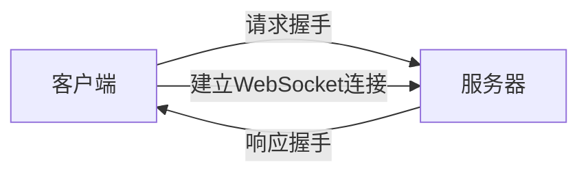

--

iflyos是使用了websocket跟服务端进行通信。所以需要把websocket进行学习。

# 简介

WebSocket是一种在Web浏览器和Web服务器之间进行==全双工通信的协议==。

它允许在一个持久连接上进行双向数据传输，

与传统的HTTP通信相比，它更高效、更轻量级，

并且可以实现实时性更强的数据交换。

WebSocket协议最初由HTML5规范中提出，并在RFC 6455中正式定义。

它通过在==HTTP握手过程中引入新的Upgrade头部来启动连接，==

并且使用标准的TCP端口（通常是80或443），

==这意味着它可以穿透大多数防火墙和代理服务器。==

WebSocket连接的建立是通过一次握手完成的，

之后双方可以通过该连接发送数据，

而无需每次通信都重新建立连接。

这使得WebSocket==非常适合于需要频繁交换数据的实时应用，==

比如在线游戏、即时通讯和实时数据更新等场景。

总的来说，WebSocket提供了一种更加高效、实时的网络通信方式，它已经成为许多现代Web应用程序中不可或缺的一部分。


websocket是一种在tcp长连接上进行全双工通信的协议。

它的出现，使得服务端和客户端之间的数据交换变得容易。

允许服务端主动向客户端推送消息。

这个是传统http协议不支持而又非常需要的一个功能。

为了实现服务端对客户端的消息推送，传统的解决方法，是通过ajax轮询，这样非常耗费流量。效率及其低下。

浏览器通过JavaScript向服务器发出建立websocket连接的请求。

**WebSocket并非一个工具，而是HTML5里面的协议。**

它从某种角度上弥补了上一部分中我们介绍过的HTTP协议的缺陷。

由于使用WebSocket使用HTTP的端口，因此TCP连接建立后的握手消息是基于HTTP的，由服务器判断这是一个HTTP协议，还是WebSocket协议。 

WebSocket连接除了建立和关闭时的握手，数据传输和HTTP没有任何关系。

# 发展历史

WebSocket的发展历史可以追溯到2008年，

当时Ian Hickson在HTML5规范中首次提出了WebSocket的概念。

最初，WebSocket的目标是解决Web浏览器和服务器之间双向通信的需求，以便实现更丰富的Web应用程序。

随后，WebSocket的草案经过多次讨论和修改，==最终在2011年被纳入HTML5规范。==

在此期间，WebSocket协议的设计和标准化工作由W3C（World Wide Web Consortium）负责推动。

2011年末，WebSocket协议的首个版本（RFC 6455）由IETF（Internet Engineering Task Force）正式发布。

该版本定义了WebSocket协议的基本特性和通信流程，并为Web开发人员提供了一种新的方式来实现实时通信和数据交换。

随着时间的推移，WebSocket得到了广泛的应用和支持。

越来越多的Web开发人员开始利用WebSocket来构建实时性更强、交互性更好的Web应用程序，

比如在线聊天、多人游戏、股票行情更新等。

WebSocket的发展也促进了相关技术的发展，

比如一些流行的WebSocket库和框架的出现，以及一些基于WebSocket的通信协议的制定和应用。

同时，WebSocket的性能和安全性也得到了不断改进和加强，以满足不断增长的实时通信需求和安全性要求。

总的来说，WebSocket在Web开发领域的发展历程是一个持续演进的过程，它为构建更加实时、交互式的Web应用程序提供了强大的技术支持和基础设施。

# 各个主流的webserver分别是在哪个版本加入对websocket的支持的

是的，WebSocket需要Web服务器端进行支持。

各个主流的Web服务器在不同的版本中加入了对WebSocket的支持，

以下是一些主要的Web服务器和它们加入WebSocket支持的版本：

1. **Apache HTTP Server**：Apache 2.4.2 版本及以后的版本开始支持WebSocket。需要通过mod_proxy模块和mod_proxy_wstunnel模块来启用WebSocket代理支持。

2. **Nginx**：Nginx 1.3 版本及以后的版本开始支持WebSocket。需要在配置中显式启用WebSocket支持。

3. **Microsoft IIS**：Windows Server 2012及以后的版本的IIS开始支持WebSocket。WebSocket支持被纳入IIS 8.0中。

4. **Tomcat**：Tomcat 7.0.27 版本及以后的版本开始支持WebSocket。Tomcat提供了原生的WebSocket支持，开发人员可以通过Java API来创建WebSocket应用程序。

5. **Node.js**：Node.js 8 版本及以后的版本天生支持WebSocket。Node.js提供了多种WebSocket库，比如ws和Socket.IO，开发人员可以轻松地在Node.js环境中构建WebSocket应用程序。

这些是一些主流的Web服务器和它们加入WebSocket支持的大致版本。实际上，随着技术的发展和更新，这些服务器的版本可能会有所调整和更新，因此在使用时最好查阅官方文档以获取最新信息。

## lighttpd支持websocket吗

是的，lighttpd（Lightweight HTTP Server）从版本1.4.32开始提供了对WebSocket的支持。

Lighttpd通过mod_proxy模块和mod_proxy_wstunnel模块来支持WebSocket代理。

要在Lighttpd中启用WebSocket支持，您需要确保已经编译了这些模块，并在配置文件中进行相应的设置。以下是一个简单的配置示例：

```plaintext
server.modules += ( "mod_proxy", "mod_proxy_wstunnel" )

$HTTP["host"] == "yourdomain.com" {
    proxy.server = ( "" => ( ( "host" => "127.0.0.1", "port" => 8080 ) ) )
    proxy.server = ( "/ws" => ( ( "host" => "127.0.0.1", "port" => 8080, "websocket" => 1 ) ) )
}
```

在这个配置中，"/ws"路径被代理到了WebSocket服务器（在本例中是127.0.0.1:8080），并启用了WebSocket代理支持。

请注意，具体的配置可能会因您的环境和需求而有所不同，因此建议查阅Lighttpd的官方文档以获取更详细和准确的配置指南。

# 建立websocket连接



client向server发出http请求，带上header

```
GET /chat HTTP/1.1
Host: server.example.com
Upgrade: websocket # 重点是这里。
Connection: Upgrade
Sec-WebSocket-Key: x3JJHMbDL1EzLkh9GBhXDw==
Sec-WebSocket-Protocol: chat, superchat
Sec-WebSocket-Version: 13
Origin: http://example.com
```

然后server回复client。

```
HTTP/1.1 101 Switching Protocols
Upgrade: websocket
Connection: Upgrade
Sec-WebSocket-Accept: HSmrc0sMlYUkAGmm5OPpG2HaGWk=
Sec-WebSocket-Protocol: chat
```

一次握手成功之后，客户端和服务器之间就可以建立持久连接的双向传输数据通道，而且服务器不需要被动地等客户端的请求，服务器这边有新消息就可以通知客户端，化被动为主动。

此外，使用WebSocket时，不会像HTTP一样无状态，服务器会一直知道客户端的身份。

服务器与客户端之间交换的标头信息也很小。

Websocket使用 `ws` 或 `wss` 的统一资源标志符，类似于 `HTTP` 或 `HTTPS`，其中 `wss` 表示在 TLS 之上的 Websocket ，相当于 HTTPS 了。如：

```
ws://example.com/chat
wss://example.com/chat
```


Nginx 自从 1.3 版本就开始支持 WebSocket 了，并且可以为 WebSocket 应用程序做反向代理和负载均衡。

默认情况下，Websocket 的 ws 协议使用 80 端口；运行在TLS之上时，wss 协议默认使用 443 端口。

```
客户端                                                 服务器
   |                                                       |
   |---- 发送握手请求（包含 Upgrade 和 Connection 头部字段） --->|
   |                                                       |
   |<--- 返回握手响应（包含 Upgrade 和 Connection 头部字段） ----|
   |                                                       |
   |---- 发送握手确认（包含握手密钥的哈希值） --->                |
   |                                                      |
   |<-------------- WebSocket 连接建立 --------------  |
   |                                                  |
   |--------------------- WebSocket 连接 --------------------|
   |                                                  |
   |                                               数据交换
   |                                                  |

```


# nopoll分析

nopoll是一个C语言写的很小的websocket库。

io复用机制是select的。

nopoll是linux常用的开源的websocket的实现。

安装成功后，只需要在我们的源文件中包含头文件nopoll.h

如果在多个线程中同时调用nopoll的api，需要设置4个回调用以执行nopoll的创建，销毁和上锁和解锁。

```
noPollPtr nopoll_freertos_mutex_create(void)
{
	OS_Mutex_t *mutex  = nopoll_new(OS_Mutex_t, 1);
	if (mutex == NULL)
		return NULL;

	if (OS_MutexCreate(mutex) == OS_OK)
		return mutex;
	else
		return NULL;
}

void nopoll_freertos_mutex_destroy(noPollPtr mutex)
{
	if (OS_MutexDelete(mutex) == OS_OK)
		nopoll_free(mutex);
}

void nopoll_freertos_mutex_lock(noPollPtr mutex)
{
	OS_MutexLock(mutex, 10000);
}

void nopoll_freertos_mutex_unlock(noPollPtr mutex)
{
	OS_MutexUnlock(mutex);
}

int nopoll_freertos_gettimeofday(struct timeval *tv, noPollPtr notUsed)
{
	return gettimeofday(tv, NULL);
}
```


使用nopoll接口创建一个简单的websocket server。

```
noPollConn *listener = nopoll_listener_new(ctx, "0.0.0.0", 1234);
if(!nopoll_conn_is_ok(listener)) {
	
}
nopoll_ctx_set_on_msg(ctx, listener_on_message, NULL);
nopoll_loop_wait(ctx, 0);
```

从websocket的链接上接收数据：

使用nopoll_loop_wait()循环等待，设置消息接收的处理函数（nopoll_ctx_set_on_msg 和nopoll_conn_set_on_msg）.


碰到一个棘手的问题。

就是设备端被服务端主动断开连接后。

nopoll函数会卡死。找到解决方法了。还是要使用nopoll_conn_is_ok和nopoll_conn_is_ready进行检查。


把nopoll的client例子都看一遍。

nopoll_conn_send_ping：这个是

```
nopoll_log_enable (ctx, debug);
```


# python下的server和client

Python里的websocket的package是

```
pip install websockets
```

新建server.py，写入下面的内容：

```
import asyncio
import websockets

async def handler(websocket, path):
    data = await websocket.recv()
    reply = f'recv data: {data}'
    await websocket.send(reply)

start_server = websockets.serve(handler, "0.0.0.0", 8000)

asyncio.get_event_loop().run_until_complete(start_server)
asyncio.get_event_loop().run_forever()
```

然后写一个client.html，内容如下：（html代码是vscode里输入html自动生成的，忽略。只看script部分的）

```
<!DOCTYPE html>
<html lang="en">
<head>
    <meta charset="UTF-8">
    <meta http-equiv="X-UA-Compatible" content="IE=edge">
    <meta name="viewport" content="width=device-width, initial-scale=1.0">
    <title>Document</title>
</head>
<body>
    <button onclick="contactServer">connect server</button>

</body>
<script>
    let socket = new WebSocket('ws://192.168.56.101:8000')
    socket.addEventListener('open', function(event) {
        socket.send('conn setup')
    })
    socket.addEventListener('message', function (event) {
        console.log(event.data)
    })
    let contactServer = ()=> {
        socket.send('init')
    }
</script>
</html>
```

然后直接打开client.html文件就可以测试。

我们也可以写一个python版本的client。

client.py

```
import asyncio
import websockets

async def test():
    async with websockets.connect('ws://localhost:8000') as websocket:
        await websocket.send("hello")
        response = await websocket.recv()
        print(response)

asyncio.get_event_loop().run_until_complete(test())
```


参考资料

1、How To Build WebSocket Server And Client in Python

https://www.piesocket.com/blog/python-websocket

# 参考资料

1、WebSocket

https://baike.baidu.com/item/WebSocket/1953845?fr=aladdin

2、Python3+WebSockets实现WebSocket通信

https://www.cnblogs.com/lsdb/p/10949766.html

3、

https://blog.csdn.net/antony9118/article/details/54343534

4、Nginx 支持websocket的配置

https://blog.csdn.net/weixin_37264997/article/details/80341911

5、WebSocket 结合 Nginx 实现域名及 WSS 协议访问

https://www.cnblogs.com/mafly/p/websocket.html

6、使用nopoll实现websocket的接口点用流程

https://blog.csdn.net/u010299133/article/details/91491344