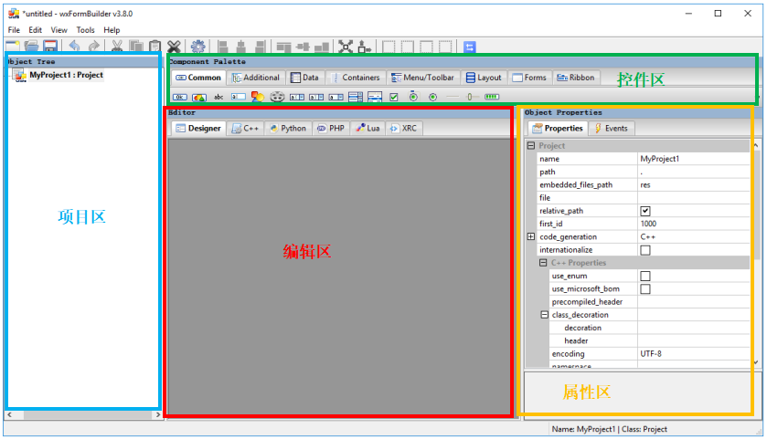

1

写一些简单的PC端工具。对界面没有太高要求。

用代码来写，对布局不熟悉。很难做。

所以希望用拖拽控件的方式来做界面。




让我们开始创建一个GUI的基础框架，基础框架包括：

Frame（外围轮廓）、

Sizer（内部控件区）、

menubar（顶部菜单栏）、

statusBar（底部状态栏）。

第一步是添加一个Frame，这是GUI的轮廓基础，

其size（default为500； 300）决定了GUI整体界面的大小。


第二步是在Frame下添加一个Sizer，后**续所有控件均是放在Sizer里的。**

关于Sizer部分需要特别说明一下，wxPython提供的Sizer类型有如下七种：

wxBoxSizer、wxWrapSizer、wxStaticBoxSizer、wxGridSizer、wxFlexGridSizer、wxGridBagSizer、wxStdDialogButtonSizer，

**Sizer的样式决定了后续控件的整体相对位置关系**，选定了Sizer即选定了GUI界面样式。

如果你觉得单个Sizer里的控件布局太单调，你可以嵌套使用Sizer，这是实现GUI界面控件布局多样化的关键。


第三步是在Frame顶部添加一个menubar：

第四步是在Frame底部添加一个statusBar：


基础布局搞定之后，接下来便是在Sizer里添加控件，

wxPython支持的控件非常丰富，

其中比较常用的是如下几个：

button（按钮）、staticText（静态显示文本框）、textCtrl（输入输出文本框）、Choice（复选框）、checkBox（选中框）、slider（滑动条）。

前面选择的Sizer是wxBoxSizer，即自上而下布局，因此这些控件在Sizer是自上而下排列的，

**各个控件的位置后续在属性里还可以微调，但改变不了自上而下的格局。**


最后使用生成的代码

```
import wx
# 导入my_win.py中内容
import my_win

# 创建mainWin类并传入my_win.MyFrame1
class mainWin(my_win.MyFrame1):

   # 实现Button控件的响应函数showMessage
   def showMessage(self, event):
       self.m_textCtrl1.Clear()
       self.m_textCtrl1.SetValue('hello world')

if __name__ == '__main__':
    # 下面是使用wxPython的固定用法
    app = wx.App()

    main_win = mainWin(None)
    main_win.Show()

    app.MainLoop()
```


参考资料

1、痞子衡嵌入式：极易上手的可视化wxPython GUI构建工具(wxFormBuilder)

https://www.cnblogs.com/henjay724/p/9426966.html

2、布局

https://docs.wxpython.org/sizers_overview.html#sizers-overview