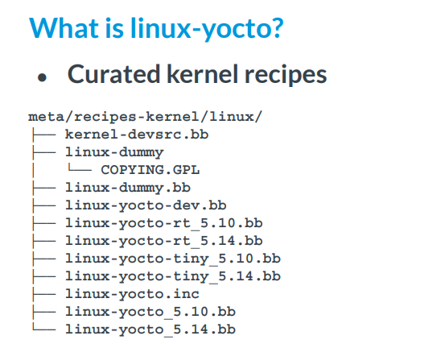
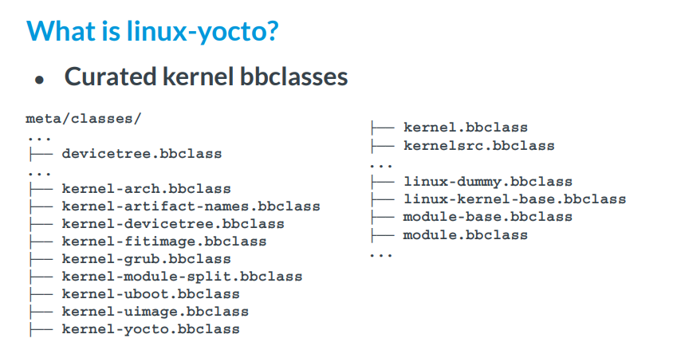
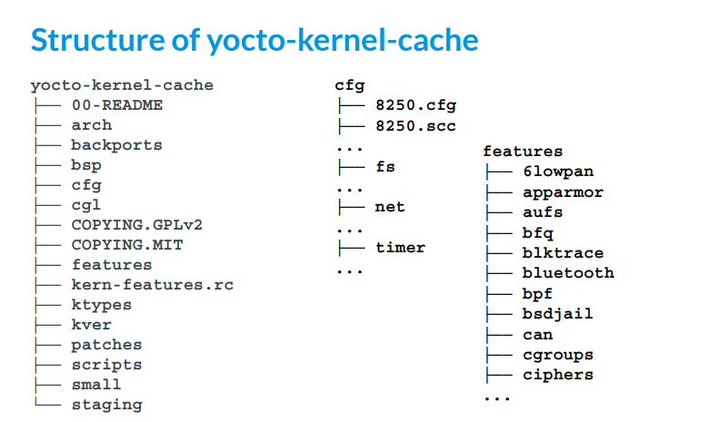

--

# 一篇培训ppt

这个是yocto内核开发的培训ppt

https://elinux.org/images/b/be/Yps2021.11-handson-kernel.pdf

这个很好，理论和实践结合。


## 为什么需要linux-yocto？

主要是提供工具来避免错误的kernel配置。

包含了什么？

kernel代码：https://git.yoctoproject.org/linux-yocto/

recipe文件：



bbclass文件



## 为什么需要内核配置片段

主要是为了方便定制和重用配置。相当于C语言的include头文件。

## yocto kernel cache

这个是一个代码仓库。

https://git.yoctoproject.org/yocto-kernel-cache/

里面的内容是这样：



## 传统的内核开发流程

### 传统的做法1

使用mainline的内核

1、我只要一份内核代码和一个defconfig文件。

2、内核代码一般是kernel.org下载的压缩包。

3、用menuconfig生成的一个完整的defconfig。

### 传统做法2

使用自己本地的内核

1、自己本地的内核git和defconfig文件。

### 传统做法3

用quilt打一些patch。

用mainline的内核，打上一堆的patch。

## yocto下面的kernel最佳实践

1、不要创建一个evil vendor kernel。

2、除非有特别的原因，否则你的内核要inherit linux-yocto

3、不要使用完整的defconfig，使用yocto-kernel-cache仓库加配置片段的方式。

## 操作

这里有下面实验用的layer的代码。

https://github.com/moto-timo/kernel-lab-layers

## lab1测试传统方法1

创建这个layer

poky/meta-lab1-qemuarm64


linux-korg。korg表示kernel.org。表示标准版本的linux。

yocto下面的命名都是linux-xxx的方式。

例如linux-yocto、linux-meson这样。

meta-lab1-qemuarm64目录

```
.
├── conf
│   ├── layer.conf
│   └── machine
│       └── lab1-qemuarm64.conf
└── recipes-kernel
    └── linux
        ├── linux-korg
        │   ├── arm64_defconfig
        │   ├── defconfig
        │   ├── qemuarm64_defconfig
        │   └── yocto-testmod.patch
        └── linux-korg_5.17.bb
```

linux-korg_5.17.bb的内容是：

```
inherit kernel

SRC_URI = "${KERNELORG_MIRROR}/linux/kernel/v5.x/linux-${PV}.tar.xz;name=kernel \
           file://defconfig"
```

所以就是标准内核加defconfig文件。


# 介绍

主要以这个为指南。

https://docs.yoctoproject.org/kernel-dev/intro.html

## overview

无论您打算如何使用 Yocto 项目，您都有可能使用 Linux 内核。

本手册介绍了如何设置构建主机以支持内核开发，

介绍了内核开发过程，

提供了 Yocto Linux 内核元数据的背景信息，

描述了可以使用内核工具执行的常见任务，

并向您展示了如何使用内核元数据需要使用 Yocto 项目内的内核，

并深入了解 Yocto 项目团队如何开发和维护 Yocto Linux 内核 Git 存储库和元数据。


每个 Yocto 项目版本都有一组 Yocto Linux 内核配方，

您可以在“Yocto Linux Kernel”标题下的 Yocto 源存储库中查看其 Git 存储库。

该版本的新配方跟踪 https://www.kernel.org 上最新的 Linux 内核上游开发，并引入新支持的平台。


该版本中的先前配方已更新并支持至少一个额外的 Yocto 项目版本。

随着它们的调整，这些先前的版本会进行更新，以包含长期支持计划 (LTSI) 项目的最新内容。

您可以在“Yocto 项目内核开发和维护”部分了解有关 Yocto Linux 内核和 LTSI 的更多信息。

如果您想使用上游 Yocto Linux 内核开发和内核元数据开发的最新内容，还包括 Yocto Linux 内核开发秘籍 (linux-yocto-dev.bb)。


Yocto 项目还提供了一组强大的内核工具，

用于管理 Yocto Linux 内核源和配置数据。

您可以使用这些工具进行单个配置更改、应用多个补丁或使用您自己的内核源代码。


特别是，内核工具允许您生成配置片段，这些片段仅指定您必须的内容，仅此而已。

配置片段只需要包含 Yocto Linux 内核 menuconfig 系统提供的最高级别可见 CONFIG 选项。

将此与完整的 Yocto Linux 内核 .config 文件进行对比，其中包括所有自动选择的 CONFIG 选项。

这种效率减少了您的维护工作，

并允许您以对您的项目有意义的方式进一步分离您的配置。

常见的划分是将策略和硬件分开。

例如，所有内核可能都支持 proc 和 sys 文件系统，

但只有特定的板需要声音、USB 或特定驱动程序。

单独指定这些配置允许您根据需要将它们聚合在一起，但仅将它们维护在一处。

类似的逻辑适用于分离源更改。

如果您不维护自己的内核源代码并且只需要对源代码进行最小程度的更改，则已发布的配方提供了一个经过审查的基础，可以在此基础上对您的更改进行分层。

这样做可以让您从 Yocto 项目开发期间执行的持续内核集成和测试中受益。

==相反，如果您有一个非常具体的 Linux 内核源代码树，并且无法与官方 Yocto Linux 内核配方之一保持一致，那么您可以通过一种方法将 Yocto Project Linux 内核工具与您自己的内核源代码结合使用。==

## kernel修改流程

内核修改涉及更改 Yocto 项目内核，

这可能涉及更改配置选项以及添加新的内核配方。

配置更改可以以配置片段的形式添加，

而配方修改则通过您创建的内核层中的内核配方内核区域进行。

本节提供 Yocto 项目内核修改工作流程的高级概述。插图和随附列表提供了一般信息和更多信息的参考。

# common tasks

本章介绍了使用 Yocto Project Linux 内核时执行的几个常见任务。

这些任务包括

为内核开发准备主机开发系统、

准备layer、

修改现有方案、

修补内核、

配置内核、

迭代开发、

使用您自己的源代码以及合并树外模块。

## 准备

内核开发最好使用 devtool 来完成，而不是通过传统的内核工作流程方法。

本节的其余部分提供了这两种情况的信息。

### 使用devtool

按照以下步骤准备使用 devtool 更新内核映像。

完成此过程后，您将获得一个干净的内核映像，并准备好进行修改，

如“使用 devtool 修补内核”部分中所述：

#### 初始化环境

```
$ cd poky
$ source oe-init-build-env
```

#### 准备你的local.conf文件

默认情况下，MACHINE 变量设置为“qemux86-64”，

如果您在 64 位模式下构建 QEMU 模拟器，则该值很好。

但是，如果不是，则需要在构建目录（即本例中的 poky/build）中找到的 conf/local.conf 文件中适当地设置 MACHINE 变量。


此外，由于您正准备处理内核映像，==因此需要设置 MACHINE_ESSENTIAL_EXTRA_RECOMMENDS 变量以包含内核模块。==


在此示例中，我们希望构建 qemux86，因此必须将 MACHINE 变量设置为“qemux86”并添加“kernel-modules”。

正如所描述的，我们通过附加到conf/local.conf来做到这一点：

```
MACHINE = "qemux86"
MACHINE_ESSENTIAL_EXTRA_RRECOMMENDS += "kernel-modules"
```

#### 创建一个layer来放patch

您需要创建一个层来保存为内核映像创建的补丁。

您可以使用 bitbake-layers create-layer 命令，如下所示：

```
$ cd poky/build
$ bitbake-layers create-layer ../../meta-mylayer
```

#### 添加刚刚创建的layer

```
$ cd poky/build
$ bitbake-layers add-layer ../../meta-mylayer
NOTE: Starting bitbake server...
$
```

#### bitbake core-image-minimal

### 准备传统的方式来开发内核

使用 Yocto 项目为传统内核开发做好准备涉及许多与上一节中所述相同的步骤。

但是，您需要建立内核源代码的本地副本，因为您将编辑这些文件。

按照以下步骤准备使用 Yocto 项目的传统内核开发流程来更新内核映像。

完成此过程后，您就可以按照“使用传统内核开发来修补内核”部分中所述对内核源代码进行修改：

前面的4步跟上面的一样。

#### 第五步：

创建内核 Git 存储库的本地副本：您可以在 Yocto 项目源存储库的“Yocto Linux Kernel”下找到受支持的 Yocto 项目内核的 Git 存储库，网址为 https://git.yoctoproject.org/。

为简单起见，建议您在源目录之外创建内核 Git 存储库的副本，该目录通常名为 poky。

另外，请确保您位于standard/base支中。

以下命令显示如何创建 linux-yocto-4.12 内核的本地副本并位于 standard/base 分支中：

```
$ cd ~
$ git clone git://git.yoctoproject.org/linux-yocto-4.12 --branch standard/base
```

## 创建和准备一个layer

如果您要修改内核配方，建议您创建并准备自己的层来完成您的工作。

您的层包含其自己的 BitBake 附加文件 (.bbappend)，

并提供了一种方便的机制来创建您自己的配方文件 (.bb) 以及存储和使用内核补丁文件。

为了更好地理解为内核开发创建的层，以下部分介绍如何在不借助工具的情况下创建层。

这些步骤假设在您的主目录中创建一个名为 mylayer 的层：

```
$ mkdir meta-mylayer
$ mkdir meta-mylayer/conf
$ mkdir meta-mylayer/recipes-kernel
$ mkdir meta-mylayer/recipes-kernel/linux
$ mkdir meta-mylayer/recipes-kernel/linux/linux-yocto
```

## 修改一个已有的recipe

在许多情况下，您可以自定义现有的 linux-yocto 配方来满足项目的需求。

Yocto 项目的每个版本都提供了一些 Linux 内核配方供您选择。

它们位于 meta/recipes-kernel/linux 的源目录中。

修改现有配方可以包括以下内容：

## 使用devtool来patch kernel

```
$ devtool modify linux-yocto
```

```
$ devtool build linux-yocto
```

```
$ cd ~
$ devtool build-image core-image-minimal
```

## 传统方法patch kernel

## 配置kernel

配置 Yocto 项目内核包括确保 .config 文件中包含您正在构建的映像的所有正确信息。

您可以使用 menuconfig 工具和配置片段来确保您的 .config 文件正是您所需要的。

您还可以将已知配置保存在 defconfig 文件中，构建系统可将其用于内核配置。

本节介绍如何使用 menuconfig、创建和使用配置片段，

==以及如何以交互方式修改 .config 文件以创建尽可能精简的内核配置文件。==

### 使用menuconfig

定义内核配置的最简单方法是通过 menuconfig 工具进行设置。

该工具提供了一种用于设置内核配置的交互式方法。


要在 Yocto Project 开发环境中使用 menuconfig 工具，

您必须执行以下操作：

由于您使用 BitBake 启动 menuconfig，因此必须确保通过运行构建目录中的 oe-init-build-env 脚本来设置环境。

您必须确定源目录中构建配置的状态。

您的构建主机必须安装以下两个软件包：

```
libncurses5-dev
libtinfo-dev
```

执行命令：

```
$ bitbake linux-yocto -c kernel_configme -f
$ bitbake linux-yocto -c menuconfig
```


保存选择会更新 .config 配置文件。

这是 OpenEmbedded 构建系统在构建期间用于配置内核的文件。

您可以在 tmp/work/ 的构建目录中找到并检查该文件。

实际的.config位于构建特定内核的区域。

例如，如果您正在构建基于 linux-yocto-4.12 内核的 Linux Yocto 内核，

并且正在构建针对 x86 架构的 QEMU 映像，则 .config 文件将为：


隔离更改的配置的一个好方法是结合使用 menuconfig 工具和简单的 shell 命令。

在使用 menuconfig 更改配置之前，

复制现有的 .config 并将其重命名为其他名称，

使用 menuconfig 进行任意数量的更改并保存它们，

==然后将重命名的配置文件与新创建的文件进行比较。==

==您可以使用产生的差异作为基础来创建配置片段以永久保存在内核层中。==

### 创建一个defconfig文件

Yocto 项目上下文中的 defconfig 文件通常是从构建复制的 .config 文件或从内核树获取并移动到配方空间的 defconfig 文件。

您可以使用 defconfig 文件来保留一组已知的内核配置，

OpenEmbedded 构建系统可以从中提取以创建最终的 .config 文件。

要创建 defconfig，

请从完整的、工作的 Linux 内核 .config 文件开始。

将该文件复制到层的recipes-kernel/linux 目录中相应的 ${PN} 目录，

并将复制的文件重命名为“defconfig”（例如
/meta-mylayer/recipes-kernel/linux/linux-yocto/defconfig） 。

然后，将以下行添加到层中的 linux-yocto .bbappend 文件中：

```
FILESEXTRAPATHS:prepend := "${THISDIR}/${PN}:"
SRC_URI += "file://defconfig"
```

SRC_URI 告诉构建系统如何搜索文件，

而 FILESEXTRAPATHS 扩展 FILESPATH 变量（搜索目录）

以包含您创建的用于保存配置更改的 ${PN} 目录。

### 创建config片段

配置片段只是出现在 OpenEmbedded 构建系统

可以找到并应用它们的文件中的内核选项。


从语法上讲，配置语句与构建目录中的 .config 文件中显示的内容相同。

所有配置片段文件必须使用 .cfg 扩展名，以便 OpenEmbedded 构建系统将它们识别为配置片段。


另一种方法是使用两个配置文件之间的差异来创建配置片段：

一个是先前创建并保存的，另一个是使用 menuconfig 工具新创建的。

要使用此方法创建配置片段，请按照下列步骤操作：

1、创建.config文件

```
bitbake linux-yocto -c kernel_configme -f
```

2、运行menuconfig

```
$ bitbake linux-yocto -c menuconfig
```

3、创建片段。

```
$ bitbake linux-yocto -c diffconfig
```

### 验证配置

可以用下面的命令：

```
$ bitbake linux-yocto -c kernel_configcheck -f
```

### tuning配置

## 扩展变量

有时，确定变量在构建过程中扩展为什么内容会很有帮助。

您可以通过检查 bitbake -e 命令的输出来检查变量的值。

输出很长，在文本文件中更容易管理，这样可以轻松搜索：

```
$ bitbake -e virtual/kernel > some_text_file
```

## 如果内核镜像名字里带了dirty的字符串

如果您构建内核映像并且版本字符串末尾有“+”或“-dirty”，

则意味着内核的源目录中存在未提交的修改。

请按照以下步骤清理版本字符串：

## 用你自己的代码来做

如果您无法使用现有 linux-yocto 配方支持的 Linux 内核版本之一，

您仍然可以通过使用您自己的源代码来使用 Yocto 项目 Linux 内核工具。

当您使用自己的kernel代码时，

您将无法利用 linux-yocto 源的现有内核元数据和稳定工作。

但是，您将能够以与 linux-yocto 源相同的格式管理自己的元数据。

保持格式兼容性有助于与 linux-yocto 融合到未来相互支持的内核版本上。


为了帮助您使用自己的源，

Yocto 项目提供了一个 linux-yocto 自定义配方，

它使用 kernel.org 源和 Yocto 项目 Linux 内核工具来管理内核元数据。

您可以在Git 存储库中找到此配方：meta-sketch/recipes-kernel/linux/linux-yocto-custom.bb。

## 处理out-of-tree的模块

### 在板端编译out-of-tree模块

虽然传统的 Yocto 项目开发模型

将包含内核模块作为正常构建过程的一部分，

==但您可能会发现在target上构建模块很有用。==

如果您的target系统有足够的能力和强大的能力来处理必要的编译，则可能会出现这种情况。

但是，在决定在您的目标上进行构建之前，

您应该考虑从构建主机使用适当的交叉开发环境的好处。


如果您希望能够在目标上构建树外模块，

则需要对运行 SDK 映像的目标执行一些步骤。

简而言之，kernel-dev 软件包默认安装在所有 *.sdk 映像上，kernel-devsrc 软件包安装在许多 *.sdk 映像上。但是，在尝试在运行该映像的目标上构建树外模块之前，您需要创建一些脚本。


这个对我来说没啥用。不管。

### 合并out-of-tree模块

虽然最好使用集成到 Linux 内核源代码中的源代码，

但如果您需要外部内核模块，

可以使用 hello-mod.bb 配方作为模板，

您可以从中创建自己的树外 Linux 内核模块配方。


该模板配方位于 Yocto 项目的狭小的 Git 存储库中：meta-sculpt/recipes-kernel/hello-mod/hello-mod_0.1.bb。


首先，将此配方复制到您的图层并为其指定一个有意义的名称（例如 mymodule_1.0.bb）。

在同一目录中，创建一个名为 files 的新目录，您可以在其中存储任何源文件、补丁或构建模块所需的其他文件（不随源一起提供）。

最后，根据模块的需要更新配方。

通常，您需要设置以下变量：

DESCRIPTION

LICENSE*

SRC_URI

PV


根据模块代码使用的构建系统，您可能需要进行一些调整。

例如，典型的模块 Makefile 看起来很像 hello-mod 模板提供的：

```
obj-m := hello.o

SRC := $(shell pwd)

all:
     $(MAKE) -C $(KERNEL_SRC) M=$(SRC)

modules_install:
     $(MAKE) -C $(KERNEL_SRC) M=$(SRC) modules_install
...
```

这里需要注意的重点是 KERNEL_SRC 变量。

模块类将此变量和 KERNEL_PATH 变量设置为 ${STAGING_KERNEL_DIR} 以及构建模块所需的 Linux 内核构建信息。

如果您的模块 Makefile 使用不同的变量，

您可能需要覆盖 do_compile 步骤，

或者为 Makefile 创建补丁以使用更典型的 KERNEL_SRC 或 KERNEL_PATH 变量。


准备好食谱后，您可能希望将该模块包含在image中。

为此，请参阅 Yocto 项目参考手册中以下变量的文档，

并为您的机器配置文件适当地设置其中之一：

MACHINE_ESSENTIAL_EXTRA_RDEPENDS

MACHINE_ESSENTIAL_EXTRA_RRECOMMENDS

MACHINE_EXTRA_RDEPENDS

MACHINE_EXTRA_RRECOMMENDS

模块通常不是启动所必需的，并且可以从某些构建配置中排除。以下允许最大的灵活性：

```
MACHINE_EXTRA_RRECOMMENDS += "kernel-module-mymodule"
```

该值是通过将不带 .ko 扩展名的模块文件名附加到字符串“kernel-module-”而得出的。

由于该变量是 RRECOMMENDS 而不是 RDEPENDS 变量，

因此如果该模块不可包含在映像中，构建也不会失败。

## 检查修改和提交

使用内核时的一个常见问题是：“代码做了哪些更改？”

您可以使用 Git 检查或搜索内核树，

而不是在目录中使用“grep”来查看发生了什么变化。

使用 Git 是查看树中发生了什么变化的有效方法。

## 在recipe里添加kernel features

您可以使用 KERNEL_FEATURES 变量并在 SRC_URI 语句中指定功能的 .scc 文件路径，在recipe空间中添加内核功能。

当您使用此方法添加功能时，

OpenEmbedded 构建系统会检查以确保这些功能存在。

如果这些功能不存在，构建就会停止。

 ==KERNEL_FEATURES 是为配置和修补内核而处理的最后一个元素。==

因此，==以这种方式添加功能是强制存在并启用特定功能的一种方法，==

而无需对 SRC_URI 语句中任何其他层的添加进行全面审核。


您可以通过将功能作为 KERNEL_FEATURES 变量的一部分提供并提供功能的 .scc 文件的路径（相对于内核元数据的根）来添加内核功能。 

OpenEmbedded 构建系统在 SRC_URI 语句上搜索所有形式的内核元数据，

无论元数据是否位于“内核缓存”、系统内核元数据或配方空间元数据（即内核配方的一部分）中。


当您在 SRC_URI 语句上指定功能的 .scc 文件时，

OpenEmbedded 构建系统会将该 .scc 文件的目录及其所有子目录添加到内核功能搜索路径中。

由于会搜索子目录，因此您可以在 SRC_URI 语句中引用单个 .scc 文件来引用多个内核功能。

考虑以下示例，该示例将“test.scc”功能添加到构建中。

# 处理高级metadata

## overview

除了支持配置片段和补丁之外，

Yocto Project 内核工具还支持丰富的元数据，

您可以使用这些元数据来定义复杂的策略和主板支持包 (BSP) 支持。

元数据和管理它的工具的目的

是帮助您管理用于支持多个 BSP 和 Linux 内核类型的配置和源的复杂性。


内核元数据存在于很多地方。 

Yocto 项目源存储库中的一个区域是 yocto-kernel-cache Git 存储库。

您可以在 Yocto 项目源存储库的“Yocto Linux Kernel”标题下找到该存储库。

内核开发工具（“kern-tools”）也可以在 Yocto 项目源存储库中的 yocto-kernel-tools Git 存储库的“Yocto Linux Kernel”标题下找到。

构建这些工具的配方是源目录中的meta/recipes-kernel/kern-tools/kern-tools-native_git.bb（例如poky）。

## 在recipe里使用kernel metadata

正如简介中提到的，

Yocto 项目包含内核元数据，

它位于 yocto-kernel-cache Git 存储库中。

此元数据定义了与相应 BSP 的 linux-yocto 配方中的定义相对应的板支持包 (BSP)。 

BSP 由内核策略和启用的硬件特定功能的聚合组成。 

BSP 可能会受到 linux-yocto 配方的影响。


每个 linux-yocto 风格的配方都必须定义 KMACHINE 变量。

该变量通常设置为与 BitBake 使用的 MACHINE 变量相同的值。

但是，在某些情况下，该变量可能会引用机器的底层平台。

如果多个 BSP 使用相同的 BSP 描述构建，则它们可以重用相同的 KMACHINE 名称。

多个基于 Corei7 的 BSP 可以共享 KMACHINE 的相同“intel-corei7-64”值。

重要的是要认识到 KMACHINE 仅用于内核映射，

而 MACHINE 是 BSP 层中的机器类型。

然而，即使有这种区别，这两个变量也可以保持相同的值。

每个 linux-yocto 风格的配方还必须指示用于构建 Linux 内核的 Linux 内核源代码存储库分支。

必须设置 KBRANCH 变量来指示分支。

linux-yocto 风格的配方==可以选择定义==以下变量：

KERNEL_FEATURES

LINUX_KERNEL_TYPE


LINUX_KERNEL_TYPE 定义了组装配置时使用的内核类型。

如果不指定 LINUX_KERNEL_TYPE，则默认为“标准”。 

LINUX_KERNEL_TYPE 与 KMACHINE 一起定义了内核工具使用的搜索参数，

以在内核元数据中查找适当的描述，从而构建源和配置。 

linux-yocto 配方定义了“standard”、“tiny”和“preempt-rt”内核类型。

有关内核类型的更多信息，请参阅“内核类型”部分。


在构建过程中，kern-tools 会搜索与从配方传入的 KMACHINE 和 LINUX_KERNEL_TYPE 变量最匹配的 BSP 描述文件。

这些工具使用他们发现的第一个与这两个变量匹配的 BSP 描述。

如果这些工具找不到匹配项，则会发出警告。

这些工具首先搜索 KMACHINE，

然后搜索 LINUX_KERNEL_TYPE。

如果工具找不到部分匹配，它们将使用 KBRANCH 中的源以及 SRC_URI 中指定的任何配置。

## kernel metadata语法

内核元数据由三种主要类型的文件组成：

scc [1] 描述文件、配置片段和补丁。 


scc 文件定义变量并包含或以其他方式引用三种文件类型中的任何一种。

描述文件用于将所有类型的内核元数据聚合成最终描述构建针对特定机器定制的 Linux 内核所需的源和配置的内容。

### 配置

### patches

### features

### kernel types

### bsp描述

## kernel metadata的位置

内核元数据始终存在于内核树之外，

无论是在内核配方（配方空间）中定义还是在配方之外。

您选择在何处定义元数据取决于您想要做什么以及您打算如何工作。

无论您在何处定义内核元数据，所使用的语法都同样适用。


==如果您不熟悉 Linux 内核，并且只想应用其他人提供的配置和可能的几个补丁，建议使用配方空间方法。==


如果您正在使用不受您控制的 Linux 内核源代码，或者您只是不想自己维护 Linux 内核 Git 存储库，那么此方法也是一个好方法。

有关如何在配方空间中定义内核元数据的部分信息，请参阅“修改现有配方”部分。


相反，如果您正在积极开发内核并且已经在维护自己的 Linux 内核 Git 存储库，您可能会发现使用保存在配方空间之外的内核元数据更方便。


在该领域使用元数据可以使 Linux 内核的迭代开发在 BitBake 环境之外更加高效。

## 组织你的代码

许多基于 linux-yocto-custom.bb 配方的配方使用仅具有单个分支的 Linux 内核源。

这种类型的存储库结构非常适合支持单台机器和架构的线性开发。

但是，如果您使用多个板和架构，则具有多个分支的内核源存储库会更有效。

例如，假设您需要一系列补丁才能启动一块板。

有时，这些补丁正在开发中或根本上是错误的，但对于特定的主板来说它们仍然是必要的。

在这些情况下，您很可能不希望在您构建的每个内核中包含这些补丁（即将补丁作为默认分支的一部分）。

正是这样的情况导致了 Linux 内核源 Git 存储库中使用多个分支。

## scc描述

# 高级kernel概念

## yocto的kernel开发和维护

与其他内核一样，通过 Yocto 项目提供的内核（Yocto Linux 内核）基于 https://www.kernel.org 上的 Linux 内核版本。

在主要 Linux 内核开发周期开始时，Yocto 项目团队根据发布时间、最终上游 kernel.org 版本的预期发布时间以及 Yocto 项目功能要求等因素选择 Linux 内核。


通常，Linux 社区选择的 Linux 内核处于开发的最后阶段。

换句话说，Linux 内核处于候选版本或“rc”阶段，尚未达到最终版本。

但是，由于处于外部开发的最后阶段，团队知道 kernel.org 最终版本显然将处于 Yocto 项目开发窗口的早期阶段。

这种平衡使 Yocto 项目团队能够提供最新的 Yocto Linux 内核，同时仍然确保团队拥有基准 Linux 内核版本的稳定官方版本。


如前所述，Yocto Linux 内核的最终来源是 kernel.org 发布的内核。

除了 kernel.org 的基础内核之外，可用的 Yocto Linux 内核还包含重要的新主线开发、非主线开发（当没有替代方案时）、主板支持包 (BSP) 开发和自定义功能的组合。

这些添加导致了商业发布的 Yocto Project Linux 内核，

可满足嵌入式设计人员对目标硬件的特定需求。


您可以在 Yocto 项目源存储库中找到 Yocto Linux 内核的 Web 界面：https://git.yoctoproject.org/。

如果您查看界面，您将在左侧看到一组标题为“Yocto Linux Kernel”的 Git 存储库。

在该组中，您会发现 Yocto 项目版本中开发并包含的几个 Linux Yocto 内核：


一般来说，每个新的 Linux 内核都会增加功能并引入新的错误。

这些结果是上游 Linux 内核开发的基本属性，

并由 Yocto 项目团队的 Yocto Linux 内核开发策略进行管理。 

Yocto 项目团队的政策是不向已发布的 Yocto Linux 内核向后移植次要功能。

他们只考虑向后移植重大的技术跳跃——而且这是在完整的差距分析之后完成的。

制定此政策的原因是，从不断发展的 Linux 内核向后移植任何中小型更改都可能很容易造成不匹配、不兼容和非常微妙的错误。

本节中描述的策略产生了稳定且先进的 Yocto Linux 内核，该内核混合了现有 Linux 内核功能的转发端口和重要且关键的新功能。

通过 Yocto 项目将 Linux 内核功能向前移植到 Yocto Linux 内核中可以被视为“微升级”。

许多“微升级”产生了 Yocto Linux 内核版本，其中混合了重要的新主线、非主线、BSP 开发和功能集成。

这个 Yocto Linux 内核提供了对新功能的深入了解，并允许在内核上进行集中的大量测试，这可以防止在选择下一个主要升级版本时出现意外。

这些尖端 Yocto Linux 内核的质量不断发展，并且这些内核用于前沿功能和 BSP 开发。

## yocto linux kernel架构和分支策略

如前所述，Yocto 项目的一个关键目标是向开发人员提供一个具有用户可见的清晰、连续历史记录的内核。

所使用的架构和机制，特别是分支策略，以类似于 kernel.org 中的上游 Linux 内核开发的方式实现该目标。

您可以将 Yocto Linux 内核视为由基线 Linux 内核以及在基线之上逻辑构建的附加功能组成。

这些功能通过 Yocto 项目团队使用源代码管理器 (SCM) Git 实施的分支策略进行标记和组织。


使用 Git 的标记和分支功能，

Yocto 项目团队在功能不再共享并因此需要隔离的点创建内核分支。

例如，特定于主板的不兼容性将需要不同的功能，并且需要一个分支来分离这些功能。同样，对于特定的内核功能，使用相同的分支策略。


这种“树状”架构产生的结构具有针对特定功能、单个内核类型或内核类型子集而组织的特征。

因此，用户能够查看添加的功能以及构成这些功能的提交。

除了能够看到添加的功能之外，用户还可以查看构成基线 Linux 内核的历史记录。

该策略的另一个结果是不必在树内部两次存储相同的特征。

相反，内核团队存储将该功能应用到相关内核类型所需的独特差异。

## kernel 输出目录的结构


