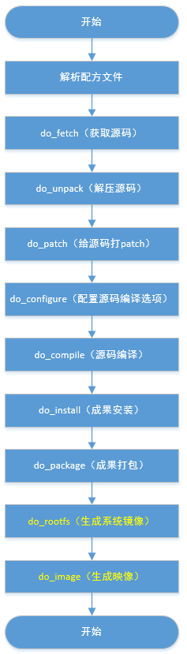
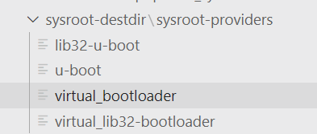
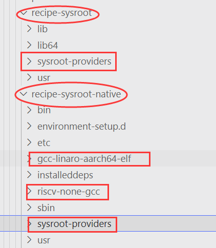
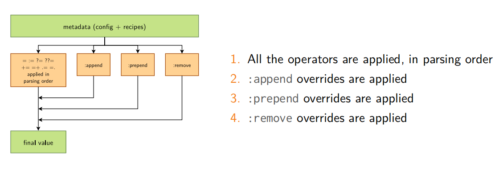
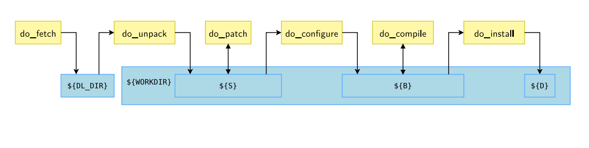
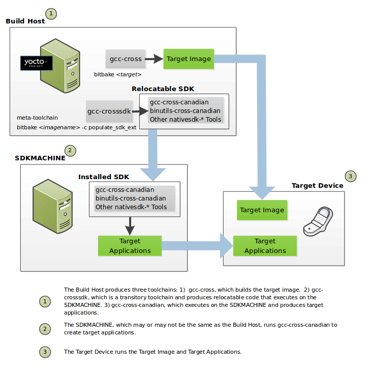

--

yocto是什么？

跟buildroot比较有什么优势？

主要应用的场景？发展的情况如何？

另外还有openwrt，也是一套构建嵌入式Linux系统的工具。

大概看了一些，我觉得还是把buildroot玩好就够用了。

现在需要用yocto来做项目。所以还是研究一下。

先按照公司里的文档把环境搭建起来。

先不用管太多的概念和细节。

编译出镜像，直接分析脚本文件。


这个的确是没有buildroot那么直观简单。

构建是基于bitbake。

就相当于buildroot里的make。

OpenEmbedded（OE）

将BitBake和OE组件组合在一起形成参考构建主机，该主机以前称为 Poky。


Poky两层含义：

含义一：

OpenedHand（公司名）最初开发的开源项目。

该项目可以从现有的OpenEmbedded构建系统中开发出poky，

从而成为对嵌入式Linux商业支持的构建系统。

公司被英特尔收购后，该项目便成为Yocto Project构建系统的基础。

含义二：

在Yocto Project源存储库中， poky作为一个单独的Git存储库存在，

您可以克隆它之后在主机系统上生成本地副本。

**Metadata**：元数据集，所谓元数据集就是发行版内各基本元素的描述与来源 。

**Layers**：即各种meta-xxx目录，将Metadata按层进行分类，有助于项目的维护。
**Bitbake**：一个任务执行引擎，用来解析并执行Metadata。
**Output**：即各种输出image。

总结：假如用烹饪一桌酒席来形容构建发行版，则Yocto就是餐厅名，Poky就是厨房（以及提供作为参考搭配套餐），Metadata就是烹饪资源（.bb表示配方，.bbappend就是配方上的贴士，.conf表示厨房里的管事的小组长），Layers就是菜谱的分类（如川菜谱、粤菜谱），Bitbake就是厨师，Output就是得到的一桌酒席。


BitBake与各种类型的配置文件、任务、执行器一起形成 OpenEmbedded-Core（OE-Core）。

BitBake是OpenEmbedded构建系统的核心工具， 负责解析元数据，从中生成任务列表，然后执行这些任务。

# yocto发展历史

Yocto Project 是一个开源的、跨平台的嵌入式 Linux 构建系统，它提供了一整套工具和方法来创建自定义的嵌入式 Linux 发行版。以下是 Yocto Project 的发展历史：

1. **2009年**: Yocto Project 的前身是 OpenEmbedded 构建系统，由开源社区形成，并由 Linux 基金会提供支持。OpenEmbedded 是一个构建和集成嵌入式 Linux 发行版的框架，致力于为嵌入式设备提供灵活性和可定制性。

2. **2010年**: Linux 基金会宣布成立 Yocto Project，旨在为嵌入式 Linux 提供一个共同的基础设施和工具链。Yocto Project 的目标是提供一个开发者友好的、可扩展的构建系统，以便开发者可以定制和构建适合他们的特定嵌入式设备的 Linux 发行版。

3. **2011年**: Yocto Project 发布了第一个稳定版本 1.0，其中包含了核心构建系统 BitBake 和 OpenEmbedded-Core 组件。

4. **2012年**: Yocto Project 发布了版本 1.2，引入了更多的工具和功能，包括 Hob 图形界面工具和 Toaster 前端。

5. **2014年**: Yocto Project 发布了版本 1.6，其中引入了新的图形界面工具 Hob 2.0，以及新的构建系统扩展功能。

6. **2015年**: Yocto Project 发布了版本 2.0，引入了新的构建系统层次结构和改进的软件包管理工具。此版本还提供了更好的 Docker 集成和嵌入式虚拟化支持。

7. **2016年**: Yocto Project 发布了版本 2.1，引入了更多的构建系统改进和功能增强，包括新的 BSP 工具和构建配置工具。

8. **2017年**: Yocto Project 发布了版本 2.4，其中包含了许多性能改进、新的软件包和工具，以及对容器化和 IoT 设备的增强支持。

9. **2019年**: Yocto Project 发布了版本 3.0，带来了许多重要的变化，包括对 Python 3 的支持、改进的构建系统性能、新的层管理工具等。

10. **2020年**: Yocto Project 发布了版本 3.2，其中包含了对 Rust 语言的支持、增强的 SDK 功能、更好的多架构支持等。

Yocto Project 持续不断地发展和改进，通过每年的新版本发布，为嵌入式开发者提供更好的构建工具和功能。它已经成为了嵌入式 Linux

 构建的主要解决方案之一，广泛应用于各种嵌入式系统和设备。

# yocto跟buildroot比较

Yocto Project和Buildroot都是用于构建嵌入式Linux系统的流行工具。它们有一些共同点，但也有一些区别。以下是Yocto Project和Buildroot之间的比较：

1. **灵活性和可定制性**：Yocto Project被设计为高度可定制和灵活的构建系统。它使用分层的元数据和概念，允许用户根据需要自定义各个组件和功能。Buildroot则更加简单和直接，提供了一个简单的配置文件，以选择和构建所需的软件包。它的定制性较低，更适合简单的嵌入式系统需求。

2. **学习曲线**：Yocto Project的学习曲线相对较陡峭，它有更复杂的架构和概念，需要一些时间和精力来理解和使用。相比之下，Buildroot更容易上手，学习和使用起来相对简单，适合初学者和对定制需求较少的项目。

3. **社区支持和生态系统**：Yocto Project拥有广泛的社区支持和活跃的开发者社区，它由Linux基金会支持，并且有许多官方和第三方的层和组件可用。Buildroot社区也相当活跃，但相对规模较小，可用的软件包和层的数量较少。

4. **目标设备和架构支持**：Yocto Project在目标设备和架构的支持方面非常强大，它支持广泛的硬件平台，并具有强大的跨体系结构的构建能力。Buildroot也提供了一些目标设备和架构的支持，但相对较少。

5. **工具和生态系统集成**：Yocto Project提供了广泛的工具集成，包括BitBake构建引擎、OpenEmbedded Core、Crosstool-NG等。它还支持与其他工具和框架的集成，如Docker、Systemd等。Buildroot则专注于提供简单而完整的构建环境，没有像BitBake那样复杂的构建引擎。

总的来说，Yocto Project适用于需要更高度定制和灵活性的复杂嵌入式系统项目，它的学习曲线较陡峭，但提供了更强大的功能和更广阔的生态系统。而Buildroot则适用于简单的嵌入式系统需求，学习曲线较平缓，更易于上手和使用。选择哪个工具取决于项目的需求、团队的技术水平和对定制程度的要求。

# bitbake基本用法

如您要构建的配方的名称为matchbox-desktop_1.2.3.bb：

```
# 编译对应的镜像
bitbake matchbox-desktop
# 清除
bitbake matchbox-desktop -c clean
# 编译某个包
bitbake optee_example -c compile
# 下载代码
bitback -c fetchall 
# 使用-k忽略过程中的错误
```

## bb文件

带.bb后缀的文件是“配方”文件。这些配方文件为BitBake提供以下内容：

有关软件包的描述性信息（作者，主页，许可证等）
配方版本
现有依赖关系（构建和运行时依赖关系）源代码
所在的位置以及如何获取它
源代码是否需要任何补丁，在哪里可以找到它们以及如何应用它们
如何配置和编译源代码
如何将生成的工件组装到一个或多个可安装的程序包中
在目标计算机上的哪个位置安装软件包或创建的软件包

例如yocto-code/meta-meson/recipes-bsp目录下的u-boot_2019.01.bb文件。

## conf文件


这要从发行版的定制流程说起。

我们的目的很简单，是要得到uboot、kernel、rootfs这三个image；

Yocto的目的也很简单，它要经过一级一级配置，逐步缩小配方，

直至得到uboot、kernel、rootfs这三个image。

每一级需要哪些配方，由该级对应的配置文件（.conf/.bb）决定。

越上级的配置是越笼统的，越下级的配置越细致。

如果下级的配置项相对于上级有补充或者冲突，则以下级的内容为准，可以认为下级会对上级进行“重写”。


有关构建的路线和流程：

对于整个发行版构建，虽然每一级的配方由（.conf/.bb）决定，

但是每一级路线和方向的选择，是由我们最终bitbake的对象决定的，

比如bitbake avi-image-core，我们想要获得rootfs.img，


conf文件定义了各种管理build过程的变量。

这些文件分为几个部分：

1、机器配置。

2、分发配置。

3、编译器调整。

4、通用公共配置。

5、用户配置。

主配置文件是bitbake.conf这个文件。


## bbclass文件

类文件（.bbclass）包含有助于在**配方文件之间共享的信息**。

一个示例是 autotools类，其中包含Autotools使用的任何应用程序的通用设置。

BitBake构建系统过程中必须要包含的一个类是 base.bbclass ,

您可以在classes目录中找到此文件。

base.bbclass类文件是特殊的，

因为它总是被所有的配方和类自动包含。

此类包含用于标准基本任务的定义，

例如获取，解压缩，配置（默认情况下为空），编译（运行存在的任何Makefile），安装（默认情况下为空）和打包（默认情况下为空）。这些任务通常被在项目构建过程中被其它类进行覆盖或者扩展。


bbclass里可以写的语句举例：

添加额外的PATH：

```
def extra_path_elements(d):
    path = ""
    elements = (d.getVar('EXTRANATIVEPATH') or "").split()
    for e in elements:
        path = path + "${STAGING_BINDIR_NATIVE}/" + e + ":"
    return path

PATH:prepend = "${@extra_path_elements(d)}"
```

直接给CFLAGS赋值：

```
OECMAKE_C_FLAGS ?= "${HOST_CC_ARCH} ${TOOLCHAIN_OPTIONS} ${CFLAGS}"
OECMAKE_C_COMPILER ?= "${@oecmake_map_compiler('CC', d)[0]}"
```

addtask和设置task的属性：

```

```

重写模块的task实现：

```
cmake_do_install() {
	DESTDIR='${D}' cmake_runcmake_build --target ${OECMAKE_TARGET_INSTALL}
}

EXPORT_FUNCTIONS do_configure do_compile do_install do_generate_toolchain_file

```

进行inherit

```
inherit cross
```

不能写普通的shell语句。非python的函数只能是task。


### bb和bbclass文件关系

在 Yocto Project 构建系统中，`bb` 和 `bbclass` 文件是两种不同类型的文件，

它们在配方（recipe）的定义和构建过程中发挥不同的作用。

1. **.bb 文件**：这是 BitBake 配方文件的扩展名，==通常用于定义如何构建一个软件包或镜像==。 `.bb` 文件包含有关软件包的元数据，包括软件包的名称、版本、来源、依赖关系、安装目标等。这些文件通常被放置在 Yocto Project 的层目录结构中的 `recipes` 子目录中。 `.bb` 文件定义了构建软件包所需的任务和依赖关系。它们是 BitBake 构建系统的核心。

2. **.bbclass 文件**：这些文件包含 BitBake 类的定义，==它们提供了一组通用的功能或方法==，可以在多个 `.bb` 文件中共享和重用。 `.bbclass` 文件定义了一组变量、函数和任务，以简化或通用化配方的构建过程。它们通常包含在 BitBake 层目录结构中的 `classes` 子目录中。开发人员可以将 `.bbclass` 文件包含到自己的 `.bb` 文件中，以获得这些通用功能。这有助于避免在不同 `.bb` 文件中重复定义相同的功能，从而提高代码的可维护性。

关系和作用：

- `.bb` 文件是特定软件包或镜像的配方文件，定义了如何构建该软件包。它包含有关软件包的元数据以及构建任务和依赖关系。

- `.bbclass` 文件定义通用的功能和方法，可以在多个 `.bb` 文件中共享。这些类允许开发人员重用常见功能，如自动配置、构建和安装任务，从而减少重复的代码。

- `.bb` ==文件可以包含一个或多个 `.bbclass` 文件，以继承和使用其中定义的功能。==这允许 `.bb` 文件继承 `.bbclass` 文件中的功能，同时可以在 `.bb` 文件中进行定制和配置。

总之，`.bb` 文件是软件包或镜像的具体构建定义，而 `.bbclass` 文件是用于提供通用构建功能和任务的类定义。它们共同构成了 Yocto Project 构建系统中的配方和通用构建功能的基础。

## layer

层的可以将不同类型的自定义内容相互隔离。

尽管您可能会发现在单个项目中将所有内容都保留在一层中很诱人，但是元数据的模块化程度越高，应对将来的更改就越容易。

用一句话概括层：

层是组织文件和目录结构的元数据（配置文件、配方）集合。

创建层：
即使你只有一两个配方文件，还是建议你创建自己的层，

而不是把配方添加到OE-Core或者Yocto项目层，

随着你的配方越来越多，这种好处更能体现出来，

且容易迁移到你的其它项目中去。

你可以修改配置文件，使你的层添加到项目中。

还可以用yocto-layer脚本来创建层。


Layer包含了一系列告诉OE构建系统应该做什么的指令，它以仓库的形式存在于你的项目中。

Layer拥有强大的重写功能，以便于你对其他Layer的内容进行修改，使用于你自己的产品。

你可以使用多个Layer，从逻辑上分割你的构建内容，例如，你可以拥有BSP, GUI, distro 配置, 中间件, 应用层这些不同的配置，以帮助你在项目长期运转中灵活的做出任何修改。


参考资料

https://zhuanlan.zhihu.com/p/111688338

## bbappend文件

追加文件是以.bbappend结尾的扩展名文件，

用于扩展或覆盖现有配方文件中的信息。

每个追加文件都应有一个对应的配方文件，且二者具有相同的文件名，

仅后缀不同（例如formfactor_0.0.bb和 formfactor_0.0.bbappend）。

# 常用命令

Yocto Project 是一个强大的嵌入式 Linux 构建系统，它有很多命令和工具，用于构建和管理嵌入式 Linux 发行版。以下是一些常用的 Yocto 命令：

1. **初始化构建环境：**

   - `source oe-init-build-env`：进入构建目录并设置构建环境。
   
2. **构建软件包和映像：**
- `bitbake <recipe>`：构建指定的软件包或映像。
  
3. **清理构建目录：**

   - `bitbake -c clean <recipe>`：清理指定软件包的构建文件。
   - `bitbake -c cleansstate <recipe>`：清理指定软件包的 sstate 缓存。
   - `bitbake -c cleanall <recipe>`：清理指定软件包的构建文件和 sstate 缓存。

4. **构建整个发行版：**

   - `bitbake <image>`：构建整个 Linux 发行版映像。
   
5. **查看可用的软件包和映像：**
- `bitbake-layers show-recipes`：显示可用的软件包和配方。
   - `bitbake-layers show-recipes -i`：显示已安装的软件包和配方。
   
6. **查看构建日志：**

   - `less <log_file>`：查看构建日志文件。
   
7. **查看软件包信息：**

   - `bitbake -e <recipe>`：显示指定软件包的环境变量和配置。
   
8. **清理整个构建目录：**

   - `bitbake -c cleanall <recipe>`：清理整个构建目录，包括构建文件和 sstate 缓存。

9. **更新 sstate 缓存：**

   - `bitbake -c sstate_update <recipe>`：更新 sstate 缓存，以便在多个构建中共享构建结果。

10. **运行软件包测试：**

    - `bitbake -c test <recipe>`：运行软件包的测试。

11. **导出构建结果：**

    - `bitbake -c populate_sdk <recipe>`：导出 SDK（Software Development Kit）以供开发人员使用。

这些命令是 Yocto Project 中的一些常用工具，用于构建、管理和定制嵌入式 Linux 发行版。根据您的项目需求，还有其他 Yocto 命令和工具可供使用。

# av400

https://confluence.amlogic.com/display/SW/Yocto+A5+Environment+Setup

yocto-dunfell-a5.xml 

```
$ cd <Your_Local_Path>/Yocto-A5
$ export BUILD_DIR=$PWD/build-av400
$ source meta-meson/aml-setenv.sh mesona5-av400
$ bitbake amlogic-sbr-yocto
```

增加的环境变量是这3个。

```
TARGET_MACHINE=mesona5-av400
BUILDDIR=/mnt/fileroot/hanliang.xiong/work/a113x2/yocto-code/build-av400
MESON_ROOT_PATH=/mnt/fileroot/hanliang.xiong/work/a113x2/yocto-code
```

amlogic-sbr-yocto对应的文件是：

```
 find -name "amlogic-sbr-yocto*"
./meta-meson/recipes-core/images/amlogic-sbr-yocto.bb
```


直接看av400当前基础的配置。

从最底层的配置开始看。

```
TUNEVALID[arm] = "Enable ARM instruction set"
```

TUNEVALID代表了什么？

```
TUNECONFLICTS[aarch32] = "armv4 armv5 armv6 armv7 armv7a armv7ve"
```

TUNECONFLICTS有是什么？

```
require conf/machine/include/arm/arch-arm.inc
```

require就是include文件的机制吧。


devtool与bitbake类似，同属于yocto中的构建工具

内核开发最好使用[devtool](https://docs.yoctoproject.org/sdk-manual/extensible.html#using-devtool-in-your-sdk-workflow)来完成， 而不是通过传统的内核工作流方法。

## 编译运行

之前编译出错，把代码完全删掉重新同步编译成功了。

烧录可以运行。

可以得出这些信息：

```
1、使用的是toybox。而不是busybox，但是busybox也编译进去了。
2、使用的是systemd init系统。

```


```
meson_do_compile() {
    ninja ${PARALLEL_MAKE}
}
```

是靠这些来配置systemd的。在mesona1-av400.conf里。

```
DISTRO_FEATURES_BACKFILL_CONSIDERED = "sysvinit"
DEFAULT_DISTRO_FEATURES += " systemd"
DISTRO_FEATURES_append = " systemd"
DISTRO_FEATURES_remove = " sysvinit"
```


# addtask write_config before do_configure

这句怎么理解？

看了openeuler的yocto分享视频，B站上有。

自定义插入自定义的hook函数的意思。


yocto的版本有些是不兼容的。

好像3.3就跟之前的不兼容。

我现在用的是dunfell。这个版本号是3.1的。

当前最新的是4.0，名字叫kirkstone。


bitbake语法有这样特别的变量操作。

```
.=  这个点号，可以理解为字符串的连接符。这个相当于prepend
=.  这个相当于append。
```

FILESEXTRAPATHS

添加到构建系统的搜索路径里，扩展的是[`FILESPATH`](https://www.yoctoproject.org/docs/1.4.2/ref-manual/ref-manual.html#var-FILESPATH)

一般的用法，就是在bbappend里，写上这个：

```
FILESEXTRAPATHS_prepend := "${THISDIR}/${PN}:"
```

还有这种用法：

```
FILESEXTRAPATHS_prepend := "${THISDIR}/files:"
```

files对应目录下一个files名字的子目录。


THISDIR


Yocto 变量选择 bb.utils.contains 使用

https://blog.csdn.net/xue1065540183/article/details/105663248

```
ABC = “${@bb.utils.contains('val', 1', 'true', 'false ', d)}"

val = 1 则 ABC 赋值 true，否则 ABC 赋值 false
```

# bitbake 一个recipe的步骤流程



https://blog.csdn.net/zz2633105/article/details/122336873


# 各种Features

[DISTRO_FEATURES](https://docs.yoctoproject.org/ref-manual/variables.html#term-DISTRO_FEATURES) 

[MACHINE_FEATURES](https://docs.yoctoproject.org/ref-manual/variables.html#term-MACHINE_FEATURES) 

[**IMAGE_FEATURES**](https://docs.yoctoproject.org/ref-manual/variables.html#term-IMAGE_FEATURES) 

[EXTRA_**IMAGE_FEATURES**](https://docs.yoctoproject.org/ref-manual/variables.html#term-EXTRA_IMAGE_FEATURES)


## IMAGE_FEATURES

```
IMAGE_FEATURES ?= ""
IMAGE_FEATURES[type] = "list"
IMAGE_FEATURES[validitems] += "debug-tweaks read-only-rootfs read-only-rootfs-delayed-postinsts stateless-rootfs empty-root-password allow-empty-password allow-root-login post-install-logging overlayfs-etc"

```

所以从这里可以看出image_features是比较固定的。

一般不去修改他的内容。

这是 Yocto Project 中 image 配置的一部分，其中定义了一些特性（features）以控制生成的 Linux 发行版镜像的行为和属性。以下是其中一些特性的简要解释：

1. **debug-tweaks**: 启用调试相关的调整和功能，以便在开发过程中更轻松地进行故障排除。

2. **read-only-rootfs**: 根文件系统（rootfs）以只读模式挂载，以提高系统的稳定性和安全性。

3. **read-only-rootfs-delayed-postinsts**: 延迟执行 `postinst` 脚本，直到 root 文件系统从只读模式切换到可写模式。

4. **stateless-rootfs**: 使根文件系统变得无状态，通常用于创建可恢复的嵌入式系统。

5. **empty-root-password**: 禁用 root 用户的密码，通常用于安全性考虑。

6. **allow-empty-password**: 允许空密码。

7. **allow-root-login**: 允许 root 用户登录。

8. **post-install-logging**: 启用 `postinst` 脚本的日志记录。

9. **overlayfs-etc**: 使用 OverlayFS 来管理 `/etc` 目录的变更，以便支持动态修改配置文件。

这些特性可以根据项目的需求进行调整，以生成定制的嵌入式 Linux 发行版。选择哪些特性要启用取决于系统的安全性、性能、需求以及具体应用场景。


在一个image里包含的feature。

最好是写在image的bb文件里，

==你可以写在conf文件里，但是不推荐这么做。==

==如果要在image的bb文件外面对image feature进行修改。==

==使用EXTRA_IMAGE_FEATURES这个变量来进行操作。==

```
meta/conf/bitbake.conf文件里：
IMAGE_FEATURES += "${EXTRA_IMAGE_FEATURES}"
```


用IMAGE_FEATURES和

https://docs.yoctoproject.org/dev-manual/common-tasks.html#customizing-images-using-custom-image-features-and-extra-image-features

poky/meta/conf/bitbake.conf里定义了PN等变量的。值得看一下。


`IMAGE_FEATURES` 是 Yocto Project 中的一个变量，

==用于定义将包含在生成的镜像中的特性或功能。==

这些特性可以包括额外的软件包、配置选项、文件系统设置等。

通过设置 `IMAGE_FEATURES`，您可以定制生成的镜像以满足特定的需求或配置。

以下是一些常见的 `IMAGE_FEATURES` 的示例和解释：

1. **"debug-tweaks"**：==启用额外的调试功能，如 gdbserver 支持和日志级别设置。==

2. **"ssh-server-openssh"**：在镜像中包含 OpenSSH 服务器，以便通过 SSH 连接到目标设备。

3. **"package-management"**：启用包管理功能，如 opkg 或 apt，以便在目标设备上安装和管理软件包。

4. **"tar"**：包含 tar 命令行工具，以便在目标设备上进行文件操作。

5. **"audio"**：启用音频支持，包括 ALSA 驱动和相关工具。

6. **"usb-gadget"**：启用 USB Gadget 支持，允许目标设备模拟 USB 设备。

7. **"x11"**：启用 X Window System（X11）支持，以便在目标设备上运行图形用户界面应用程序。

您可以根据项目需求自定义 `IMAGE_FEATURES` 变量，以在生成的镜像中包含特定的功能或软件包。这允许您创建适用于不同目标设备或应用程序需求的镜像配置。配置 `IMAGE_FEATURES` 变量通常是在 Yocto Project 的配方文件（如 `.bb` 文件）中执行的。

# PACKAGECONFIG

这个是configure的选项配置。

我现在需要去掉gstreamer的libgles的配置。

应该怎么做呢？


在recipe的PACKAGECONFIG变量的基本架构如下:

```
PACKAGECONFIG[f1] = "--with-f1,--without-f1,build-deps-f1,rt-deps-f1"
```

在一个recipe中, 如果f1属性使能, 则--with-f1, build-deps-f1就会应用于这个recipe,

而如果f1属性被禁止, --without-f1 会被应用.


使能recipe的某个属性

==如果要增加使能recipe的某个属性的话, 有以下两种方法==

方法一: 在recipe的附件文件即.bbappend文件中添加该依赖属性

```
PACKAGECONFIG_append = " f1"
```

方法二: 在bsp包的配置文件conf/local.conf中增加recipe的依赖属性

```
PACKAGECONFIG_append_pn-[recipename] = " f1"
```


应用实例

接下来, 以qtbase增加sql-sqlite为例, 对PACKAGECONFIG进行介绍.

在qtbase的recipe文件qtbase_git.bb中, sql-sqlite的属性配置为

```
PACKAGECONFIG[sql-sqlite] = "-sql-sqlite -system-sqlite,-no-sql-sqlite,sqlite3"
```

当sql-sqlite属性使能后, sqlite3会应用于qtbase中.

有一下两种方法, 使能qtbase的sql-sqlite属性.

方法一: 在qtbase_git.bbappend文件中增加sql-sqlite属性

```
PACKAGECONFIG_append = " sql-sqlite"
```

方法二: 在conf/local.conf文件中增加sql-sqlite属性

```
PACKAGECONFIG_append_pn-qtbase = " sql-sqlite"
```


用法说明：
PACKAGECONFIG[foo] = "--enable-foo,--disable-foo,foo_depends,foo_runtime_depends"

==有四个参数，==

==--enable-foo：表示如果有foo的那么使能它==

==--disable-foo:表示没有foo的情况下就不使能它==

==foo_depends： 表示如果有foo的情况下编译时的依赖。==

==foo_runtime_depends:表示如果有foo的情况下，运行时的依赖==

上面的例子是pango对基于x11或direcrfb的情况

如果是基于x11的`（${@base_contains('DISTRO_FEATURES', 'x11', 'x11', '', d)}），那么configure时，--with-x, 编译依赖${X11DEPENDS}`

`如果是基于direcrfb(${@base_contains('DISTRO_FEATURES', 'directfb', 'directfb', '', d)})的，那么运行confiure时，--without-x，编译依赖direcrfb`


这个是gstreamer-plugin-base的，在bbappend里增加opus配置。传递给meson程序来进行configure的。

```
DEPENDS += " libopus"
RDEPENDS_${PN} += " libopus"

PACKAGECONFIG_append = " opus"
PACKAGECONFIG[opus]  = "-Dopus=enabled,-Dopus=disabled,libopus"
```


参考资料

https://wiki.phytec.com/pages/viewpage.action?pageId=151257902

https://blog.csdn.net/xiaofeng_yan/article/details/7018349


# virtual provider

https://docs.yoctoproject.org/dev-manual/common-tasks.html#using-virtual-providers

如果你知道不同的配方提供了同一个功能。

那么就可以抽象一个virtual provider。

actual provider会在编译时确定。

例如你有3个kernel配方，分别是kernel-big、kernel-mid、kernel-small。


The following lists specific examples of virtual providers:

- `virtual/kernel`: Provides the name of the kernel recipe to use when building a kernel image.
- `virtual/bootloader`: Provides the name of the bootloader to use when building an image.
- `virtual/libgbm`: Provides `gbm.pc`.
- `virtual/egl`: Provides `egl.pc` and possibly `wayland-egl.pc`.
- `virtual/libgl`: Provides `gl.pc` (i.e. libGL).
- `virtual/libgles1`: Provides `glesv1_cm.pc` (i.e. libGLESv1_CM).
- `virtual/libgles2`: Provides `glesv2.pc` (i.e. libGLESv2).


# 某个开源组件下载失败或者速度较慢

可以把下载好的同版本组件放到DL_DIR指定目录下，然后复制一个*.done文件并改为对应名字即可

# 一个recipe可以提供多个PROVIDER吗

是的，一个 recipe 可以提供多个 PROVIDER。

在 Yocto 中，一个 recipe 可以定义和提供多个功能或者虚拟包。

通过在 recipe 中设置多个 `PROVIDES` 条目，您可以定义多个提供者。

这样做的一个常见情况是为了确保一个软件包可以提供多个不同的功能，以满足不同软件包或组件的依赖关系。

例如，一个 recipe 可能会定义如下的 `PROVIDES` 条目：

```python
PROVIDES += "virtual/aarch64-poky-linux-binutils"
PROVIDES += "my-custom-functionality"
```

这样就同时提供了 `virtual/aarch64-poky-linux-binutils` 和 `my-custom-functionality` 两个功能。这些提供者可以满足其他软件包在构建时的依赖关系，使得这个软件包能够被其他组件所使用。

# 官网示例教程

```
git clone https://github.com/YoeDistro/poky
git checkout -t origin/kirkstone -b my-kirkstone
```

```
$ cd poky
$ source oe-init-build-env
```

然后

```
bitbake core-image-minimal
```

并发下载速度确实非常快。

编译完成后，

```
runqemu qemux86-64
```

# 添加打印调试

https://stackoverflow.com/questions/62337145/echo-statements-in-yocto-recipe-not-printing-to-terminal

inherit logging，然后使用这些函数进行打印

```
Functions are : bbplain, bbnote, bbwarn, bberror, bbfatal, bbdebug
```

必须要加在函数里

```
do_configure() {
    bbwarn "xxxxxxxxxxxxxxxxxxxxxx"
    bbwarn "--------${TOOLCHAIN_OPTIONS}--------------"
    ${S}/configure ${EXTRA_OECONF}
}
```

# 添加一个package

https://blog.csdn.net/sy373466062/article/details/50381067

https://blog.csdn.net/sy373466062/category_9264954.html

https://github.com/tonyho/helloYocto


```
内核放在了哪里？ 这个是放在了如下位置，我们可以用下面命令来确定：
bitbake -e linux-imx  | grep ^S=
```

LIC_FILES_CHKSUM这个随便找一个文件求md5值就行。

LIC_FILES_CHKSUM：这个是checksum，如果是基于版本管理的source，那么不需要，例如git与svn

```
LIC_FILES_CHKSUM = "file://helloYocto.c;md5=2dac018fa193620dc085aa1402e0b346"
S = "${WORKDIR}"
do_compile () {
    make
}
```

还有两个方法，这2个方法重载了bitbake中默认方法：

1. do_compile
2. do_install

这两个方法，对应了Package中的compile与install task。


Yocto中可以配置一个Distrbution的License，然后所有的软件包，都需要符合这个license才可以被shipped到image中，如果我们需要使用违反此license的软件包，那么就需要额外配置。


Toolchian中静态库的添加
没有静态库，是无法静态编译应用程序的，因此，为了方便，还需要在SDK中添加静态库，例如libc。

这个特性在只需要开启即可，在local.conf中添加一行：

SDKIMAGE_FEATURES_append = "staticdev-pkgs"


现在下载kernel代码特别慢。

在这个文件里看到

Z:\work\test\yocto-test\poky\meta\recipes-kernel\linux\linux-yocto_5.15.bb

```
SRC_URI = "git://git.yoctoproject.org/linux-yocto.git;name=machine;branch=${KBRANCH}; \
           git://git.yoctoproject.org/yocto-kernel-cache;type=kmeta;name=meta;branch=yocto-5.15;destsuffix=${KMETA}"
```

我先手动clone到本地。

```

```


FEATURE_PACKAGES

指定编译到image里的package

packagegroup-core-x11


IMAGE_FEATURES_REPLACES


MACHINE_HWCODECS


# core-image-minimal分析

https://blog.csdn.net/groundhappy/article/details/52859237

先不去考虑local.conf里面的一些配置内容，比如MACHINE等等，同时也不深入分析代码的构建那一部分，我们只分析通过Documentation可以查询到的。

只从bb文件以及配置的角度来查看。


指定了了需要安装到这个image里面的包，使用的时候需要很小心避免顺序的问题。

当core-image-minimal-initramfs使用的时候，

不要使用这个变量，

而是是要使用PACKAGE_INTALL来替代，

这样可以使initial内存磁盘菜谱使用一些固定的包。

而不受到IMAGE_INSTALL的影响。

```
CORE_IMAGE_BASE_INSTALL = '\
    packagegroup-core-boot \
    packagegroup-base-extended \
    \
    ${CORE_IMAGE_EXTRA_INSTALL} \
    '

CORE_IMAGE_EXTRA_INSTALL ?= ""

IMAGE_INSTALL ?= "${CORE_IMAGE_BASE_INSTALL}"
```

packagegroup-core-boot这个对应Z:\work\test\yocto-test\poky\meta\recipes-core\packagegroups\packagegroup-core-boot.bb


FEATURE_PACKAGES

这些FEATURE都是可以指定添加到image里面去的。

具体变量通过 IMAGE_FEATURES来配置

```
FEATURE_PACKAGES_hwcodecs = "${MACHINE_HWCODECS}"
说明有N种特性这可以添加到这个image里面。
```

例如，sato的就表示要把这些打包打image里。

```
IMAGE_FEATURES += "splash package-management x11-base x11-sato ssh-server-dropbear hwcodecs"

LICENSE = "MIT"

inherit core-image
```

# 文件下载过程

https://blog.csdn.net/groundhappy/article/details/55046166

bitbake通过几步来获取源代码或者文件。主要按顺序处理两个不同的步骤。

1主要是先从某个地方（缓存或者其他地方）获取源码，

2然后将源码解压到特定的位置或者指定的位置

```
处理第1部分的代码类似如下

src_uri = (d.getVar('SRC_URI', True) or "").split()
fetcher = bb.fetch2.Fetch(src_uri, d)
fetcher.download()
```

从BB文件的SRC_URI变量获取具体的下载地址

使用SRC_URI变量 产生一个 下载器，调用fetcher实现下载

```
处理第2部分的代码类似如下
 rootdir = l.getVar('WORKDIR', True)
 fetcher.unpack(rootdir)
```

通常下载好的文件会指定解压到WORKDIR目录中

SRCURI和WORKDIR变量不是硬编码到fetcher里面的。因为fetcher的方式可能是多种多样的。

比如OE的共享状态代码（sstate 主要是指已经编译过的）使用fetch模块获取sstate文件

当download()方法调用的时候。bitbake尝试使用下面的搜索顺序来解决URL

1 pre-mirror sites 首先使用预镜像地址来取得源码。这些位置定义在PREMIRRORS变量中

2 如果pre-mirror sites下载失败 那么再使用 SRC_URI地址来下载

3 如果下载还是失败。尝试使用镜像来下载。MIRRORS 


bitbake是支持cross-url的。可以镜像一个git仓库到一个http服务器上作为一个压缩包。

bitbake维护了一系列从网络下载的文件的缓存，所有非本地的文件都被放置在了download directory。这个目录通过DL_DIR指定

同时文件的完整性是很有必要的。

对于非本地的文档下载fetcher代码可以通过验证sha-256和MD5checksum来确定文档被准确下载了。

可以通过SRC_URI变量来指定合适的值。

比如

SRC_URI[md5sum] = "value"
SRC_URI[sha256sum] = "value"
**也可以在SRC_URL的尾部指定校验值**

SRC_URI = "http://example.com/foobar.tar.bz2;md5sum=4a8e0f237e961fd7785d19d07fdb994d"

```
如果存在多个下载URL，可以通过上面直接在末尾指定md5sum的方式，也可以命名这个url，然后指定名字的md5。如下
SRC_URI = "http://example.com/foobar.tar.bz2;name=foo"
SRC_URI[foo.md5sum] = 4a8e0f237e961fd7785d19d07fdb994d
```

一旦下载校验完毕。bitbake就会使用这个.done标记放在DL_DIR里面。

bitbake用这个标记来识别，避免后续重新下载或者计算checksum

## 本地文件获取器(file://)

本模块处理以file://开头的URLs.文件名指定的URL可以是一个相对或者绝对路径。

如果文件名是相对的。那么FILESPATH变量和系统PATH变量都会用来查找这个文件。

（如果FILESPATH和PATH没有找到，那么FILESDIR被用来查找这个合适的相对文件，由于FILESDIR将被遗弃了，所以不要使用）

如果这个文件不能找到。那么假定在变量DL_DIR指定的目录中。

如果你指定的是一个目录。那么整个目录都将被被解压缩。

以下是两个例子

```
SRC_URI = "file://relativefile.patch"
SRC_URI = "file:///Users/ich/very_important_software"
```


# sstate共享状态

sstate是shared state的意思。用来支持部分构建的。

*Supports Partial Builds:* You can build and rebuild individual packages as needed. Yocto Project accomplishes this through its [Shared State Cache](https://docs.yoctoproject.org/overview-manual/concepts.html#shared-state-cache) (sstate) scheme. Being able to build and debug components individually eases project development.


从根本上说，从头构建是有吸引力的，

因为它意味着所有部件都是全新构建的，不存在可能导致问题的过时数据。

当开发人员遇到问题时，他们通常会默认从头开始构建，

这样他们从一开始就有一个已知的状态。


从零开始构建镜像对这个过程来说既是一个优点，也是一个缺点。

如前一段所述，从头开始构建可以确保一切都是最新的，并且从已知的状态开始。

然而，从头开始建设也需要更长的时间，因为它通常意味着重建不一定需要重建的东西。


Yocto Project实现了**支持增量构建**的共享状态代码。

共享状态代码的实现回答了以下问题，

这些问题是开放式增量构建支持系统中的基本障碍：

1、系统的哪些部分发生了变化，哪些部分没有发生变化？

2、如何删除和替换已更改的软件？

3、不需要从头开始重建的预构建组件在可用时如何使用？


对于第一个问题，构建系统通过创建任务输入的校验和（或签名）来检测给定任务的“inputs”中的更改。

如果校验和发生变化，系统假设输入已更改，需要重新运行任务。

对于第二个问题，共享状态（sstate）代码跟踪哪些任务向构建过程添加了哪些输出。

这意味着可以删除、升级或以其他方式操作给定任务的输出。

第三个问题的部分解决方案解决了第二个问题，假设构建系统可以从远程位置获取sstate对象，并在认为它们是有效的情况下安装它们。


在确定需要构建系统的哪些部分时，

**BitBake是以task为单位，而不是以recipe为单位。**

您可能会想知道为什么使用每个任务比每个配方优先级更高。


为了帮助解释，考虑启用IPK打包后端，然后切换到DEB。

在这种情况下，[do_install](http://www.yoctoproject.org/docs/3.1/ref-manual/ref-manual.html#ref-tasks-install) 和[do_package](http://www.yoctoproject.org/docs/3.1/ref-manual/ref-manual.html#ref-tasks-package) 任务输出仍然有效。

但是，使用按配方的方法，构建将不包括`.deb`文件。

因此，您必须使整个构建无效并重新运行它。

重新运行所有内容并不是最好的解决方案。

而且，在这种情况下，核心是必须“taught”很多关于具体任务的知识。

这种方法不能很好地扩展，并且不允许用户在不接触打包的登台核心的情况下轻松地在层中添加新任务或作为外部配方。


参考资料

https://blog.csdn.net/Neutionwei/article/details/111059587

# 添加一个driver 

https://blog.csdn.net/yangzhiwen56/article/details/50592845

新建目录mkdir recipes-kernel/chardriver

新建文件chardriver_0.1.bb，内容如下：

```
DESCRIPTION = "Chardriver kernel module out of the kernel tree"
LICENSE = "CLOSED"

PROVIDES = "virtual/kernel-module-chardriver"
RPROVIDES_${PN} = "virtual/kernel-module-driver"
RPROVIDES_${PN}-dev = "virtual/kernel-module-driver"

#PR = "r0"

inherit module

SRC_URI = "file://chardriver.c \
                file://Makefile \
"

S = "${WORKDIR}"
```

写driver的Makefile

```
obj-m := chardriver.o

SRC := $(shell pwd)

all:
        $(MAKE) -C $(KERNEL_SRC) M=$(SRC)

modules_install:
        $(MAKE) -C $(KERNEL_SRC) M=$(SRC) modules_install

clean:
        rm -f *.o *~ core .depend .*.cmd *.ko *.mod.c
        rm -f Module.markers Module.symvers modules.order
        rm -rf .tmp_versions Modules.symvers
```

编译bitbake chardriver

编译过程文件在tmp/work/imx6ulevk-poky-linux-gnueabi/chardriver/0.1-r0/

现在驱动编译是OK了，但查看镜像却没有我们的驱动，也是因为我们没把驱动加入系统

vi ../sources/meta-elmo/conf/layer.conf

```
MACHINE_ESSENTIAL_EXTRA_RRECOMMENDS += "chardev"    #添加此2行代码，此行表示将驱动编译进系统，下面那行表示系统运行里加载驱动
KERNEL_MODULE_AUTOLOAD += "chardev"
```

# RREPLACES

# RPROVIDES

A list of package name aliases that a package also provides.

本package提供的一些alias。

例如dropbear是这样：

```
RPROVIDES_${PN} = "ssh sshd"
```

dropbear提供了ssh和sshd的别名。

而这个表示跟openssh会冲突。

```
RCONFLICTS_${PN} = "openssh-sshd openssh"
```


# native是指什么

native表示在服务器上使用的内容，跟板端相对。


# 


# CVE_PRODUCT

```
CVE_PRODUCT = "dropbear_ssh"
```

就是在CVE上检查漏洞用哪个名字来查找。

# INITSCRIPT_NAME

这个表示安装到/etc/init.d下面的脚本的名字。

```
INITSCRIPT_NAME = "dropbear"
INITSCRIPT_PARAMS = "defaults 10"
```

# Feature Backfilling

有时候需要对MACHINE_FEATURES和DISTRO_FEATURES这2个变量进行extend。

用来控制前面被enable的功能，或者无法被disable的功能。

对于这种情况，我们需要添加一个额外的feature item

但是我们不想强制那些已经有变量值在conf文件里的开发者添加新的feature。

所以，yocto提供了一个机制，自动backfill这些被添加的feature

你可以在bitbake.conf里找到DISTRO_FEATURES_BACKFILL和MACHINE_FEATURES_BACKFILL这2个变量。

他们的值是这样的：

```
DISTRO_FEATURES_BACKFILL = "pulseaudio sysvinit gobject-introspection-data ldconfig"
MACHINE_FEATURES_BACKFILL = "rtc qemu-usermode"
```

因为上面这些feature默认就被backfill了。

如果你想要添加新的feature被backfilled，就需要使用这2个变量：

```
DISTRO_FEATURES_BACKFILL_CONSIDERED
MACHINE_FEATURES_BACKFILL_CONSIDERED
```


# DISTRO_FEATURES

一个feature的有还是没有，会影响相关的多个软件。

影响的是这些软件的configure的选项。

例如，你支持X11这个feature。

那么相关的软件的`--enable-x11`这样的选项都会被打开。

另外常用的feature是bluetooth和nfs。

feature并不对应一个软件package。而是跟多个package产生关系。

有些distro feature同时也是machine feature。对应的就是combined feature

支持的features列表如下：

```
alsa
api-documentation
	是否编译时产生对应的文档。
bluetooth 支持蓝牙功能
cramfs
directfb
ext2
ipsec
ipv6
keyboard
ldconfig
nfs
opengl
pci
ptest
	表示package test，是否编译package下面的test内容。
systemd
usbgadaget
usbhost
usrmerge
	合并/usr目录。
wayland
wifi
x11
```

现在实际使用中发现问题。

我在amlogic-sbr-yocto.bb这个image的bb里修改DISTRO_FEATURES。

对于我单独编译某一个package时，没有起作用。

所以bb里改的，都是局部的。

要全局的改动。还是要在local.conf里做。

但是build/local.conf的改动，怎么进行保存呢？因为build目录是生成的临时目录。

知道了。mesona5-av400.conf，conf文件都是全局的。在这个里面加也是可以的。

之前的改动也是在这里。

## MACHINE_FEATURES和DISTRO_FEATURES 分别有哪些特性，如何划分？

简单点，一个描述硬件，一个描述软件。

MACHINE_FEATURES 和 DISTRO_FEATURES 是 Yocto 构建系统中用于控制特定功能和配置选项的变量。它们的作用如下：

**MACHINE_FEATURES：**
==MACHINE_FEATURES 用于描述目标设备或机器的特定功能和属性，以便在构建过程中进行相关配置。==不同的目标设备可能需要不同的配置选项，因此 MACHINE_FEATURES 允许你在构建针对不同设备的软件镜像时进行适当的设置。以下是一些常见的 MACHINE_FEATURES：

- `kernel26`：表示目标设备使用 Linux 内核 2.6。
- `usbhost`：表示目标设备支持 USB 主机模式。
- `wifi`：表示目标设备支持无线网络。
- `touchscreen`：表示目标设备配备了触摸屏。

要启用或禁用这些特性，你可以在 `local.conf` 或 `.conf` 文件中设置 `MACHINE_FEATURES` 变量。

**DISTRO_FEATURES：**
==DISTRO_FEATURES 用于描述目标 Linux 发行版或发行配置中的功能和属性。==这些特性通常用于指定软件包集合、系统服务和默认配置选项，以确保生成的 Linux 发行版与目标环境的需求相匹配。以下是一些常见的 DISTRO_FEATURES：

- `systemd`：表示使用 systemd 作为 init 系统。
- `x11`：表示支持 X Window 系统（图形用户界面）。
- `opengl`：表示支持 OpenGL 图形库。
- `pam`：表示支持 Pluggable Authentication Modules（PAM）。

要启用或禁用这些特性，你可以在 `local.conf` 或 `.conf` 文件中设置 `DISTRO_FEATURES` 变量。

划分 MACHINE_FEATURES 和 DISTRO_FEATURES 的关键在于，前者主要用于描述硬件特性和属性，而后者主要用于描述软件特性和配置选项。这有助于确保构建系统生成的软件镜像与目标硬件和目标 Linux 发行版的需求相匹配。

# IMAGE_FEATURES和DISTRO_FEATURES关系

`IMAGE_FEATURES` 和 `DISTRO_FEATURES` 是 Yocto Project 构建系统中的两个关键变量，

它们之间存在一定的关系，但也有不同的作用。


1. **DISTRO_FEATURES**：`DISTRO_FEATURES` 是用于==描述发行版特性的变量。==它定义了整个发行版或分发中的全局特性，==这些特性会影响所有镜像和软件包。==例如，`DISTRO_FEATURES` 可以包括 "systemd"、"x11"、"pam" 等，用于标识发行版所支持的系统特性。

2. **IMAGE_FEATURES**：`IMAGE_FEATURES` 是==用于描述生成的镜像特性的变量==。它允许您在生成的镜像中包括与特定镜像相关的特性。==这些特性通常是与硬件平台或用途相关的==，因此可以在不同的镜像中定义不同的 `IMAGE_FEATURES`，以满足特定需求。例如，一个针对嵌入式系统的镜像可能包括 "debug-tweaks"、"package-management" 和 "ssh-server-openssh"，而一个用于 IoT 设备的镜像可能只包括 "package-management" 和 "ssh-server-dropbear"。

关系和区别：

- `DISTRO_FEATURES` 定义了整个发行版的特性，影响所有镜像和软件包，而 `IMAGE_FEATURES` 定义了特定镜像的特性。

- ==`DISTRO_FEATURES` 在全局范围内设置，通常在发行版层或 BSP 层配置文件中定义。`IMAGE_FEATURES` 在特定镜像的 BitBake 配方文件中定义。==

- `DISTRO_FEATURES` 通常包括基本系统特性，如 init 系统、包管理器等。`IMAGE_FEATURES` 包括特定于镜像的特性，如调试支持、网络服务等。

- `DISTRO_FEATURES` 是发行版开发者定义的，而 `IMAGE_FEATURES` 是系统集成者或设备制造商定义的，以满足特定硬件和应用程序需求。

总之，`DISTRO_FEATURES` 和 `IMAGE_FEATURES` 都是用于配置 Yocto Project 构建的关键变量，==但它们的作用范围和目的不同。==

`DISTRO_FEATURES` 定义全局发行版特性，而 `IMAGE_FEATURES` 允许为不同镜像定义特定特性，以满足目标设备的需求。

# COMBINED_FEATURES

bluetooth就是一个典型例子。


# MACHINE_ESSENTIAL_EXTRA_RRECOMMENDS

essential表示必要。

对应一个list，

包含的是一组推荐的，机器相关的package，安装到image里去。

build过程不依赖这些package。

会影响基于packagegroup-core-boot 的image。

一般来说，这个变量是用来处理必要的内核模块。

而且这个模块是会被编译进kernel image，而不是单独成一个ko文件。

这样的情况下，不会产生一个package。


`MACHINE_ESSENTIAL_EXTRA_RRECOMMENDS` 是一个 Yocto Project 构建系统中的机器配置变量，

==用于定义适用于特定目标机器（`MACHINE`）的附加软件包建议（`RRECOMMENDS`）列表。==

这个变量允许您为特定机器添加额外的建议性软件包，以满足特定目标机器的需求。

在 Yocto 构建系统中，`RRECOMMENDS` 变量用于指定一个软件包所建议安装的其他软件包。这些建议性软件包通常与目标软件包相关，以提供额外的功能或增强性能。

`MACHINE_ESSENTIAL_EXTRA_RRECOMMENDS` 的作用是为特定的目标机器定义附加的建议性软件包。这在以下情况下非常有用：

1. **硬件相关功能**：某些机器可能具有特定的硬件功能，需要额外的软件包来充分利用这些功能。通过 `MACHINE_ESSENTIAL_EXTRA_RRECOMMENDS`，您可以为这些机器添加相关的建议性软件包。

2. **性能优化**：某些机器可能需要特定的性能优化或配置，这可以通过添加建议性软件包来实现。

3. **自定义需求**：如果特定机器有自定义需求或限制，您可以通过 `MACHINE_ESSENTIAL_EXTRA_RRECOMMENDS` 为其添加相应的建议性软件包。

下面是一个示例，演示了如何在 `MACHINE` 配置文件中使用 `MACHINE_ESSENTIAL_EXTRA_RRECOMMENDS`：

```bitbake
MACHINE_ESSENTIAL_EXTRA_RRECOMMENDS = "package1 package2"
```

在上述示例中，`MACHINE_ESSENTIAL_EXTRA_RRECOMMENDS` 定义了一个空格分隔的软件包列表，这些软件包将会成为特定机器的建议性软件包。

总之，`MACHINE_ESSENTIAL_EXTRA_RRECOMMENDS` 是 Yocto 构建系统中的一个机器配置变量，用于为特定目标机器指定额外的建议性软件包。这可以帮助您根据机器的需求自定义构建，以满足特定硬件或性能要求。


参考资料

https://blog.csdn.net/qq_27149449/article/details/119188694


# OVERRIDES

```
OVERRIDES .= ":av400:onepass"
```

这个怎么理解？

https://docs.yoctoproject.org/ref-manual/variables.html?highlight=machineoverrides#term-OVERRIDES

OVERRIDES代表的是build时的state。

例如，一个an-override的字符串，出现在OVERRIDES的值里。

则下面的语句的影响是：FOO会被overridden覆盖掉。

```
FOO:an-override = "overridden"
```

这个是bitbake的条件语句语法的一部分。

https://docs.yoctoproject.org/bitbake/2.0/bitbake-user-manual/bitbake-user-manual-metadata.html#conditional-syntax-overrides

bitbake使用OVERRIDES来控制哪些变量被覆盖。

在bitbake解析了recipe和conf文件后。


你可以使用OVERRIDES来选择一个指定的版本。

OVERRIDES只能使用小写字母、数字和中划线。

注意，不能使用冒号。

下面是一个例子

```
OVERRIDES = "architecture:os:machine"
TEST = "default"
TEST:os = "osspecific"
TEST:nooverride = "othercondvalue"
```

`OVERRIDES` 变量列出了三个替代（条件）：“`architecture`”，“`os`”和“`machine`”。


```
DEPENDS = "glibc ncurses"
OVERRIDES = "machine:local"
DEPENDS:append:machine = "libmad"
```

上面语句的最终效果是：

```
DEPENDS值变成了"glibc ncurses libmad"
```


https://blog.csdn.net/weixin_44410537/article/details/108004470

https://www.cnblogs.com/chegxy/p/15731481.html#tid-zSnFS3

在bitbake中，一个变量可能有多个版本。

为了能够将变量切换到某个版本。

我们可以将版本的名字添加到OVERRIDES变量中。

通常情况下，我们用`:`来追加一个版本名称到变量名后。

一次表示不同版本的变量。

```
VAR = "var"
VAR:a = "vara"
VAR:b = "varb"
```

如果你使用VAR这个变量，你会发现它的值始终是var，

那么怎么使用其他版本的VAR呢？

这个就需要用到OVERRIDES机制了。

bitbake在解析完所有内容之后，会查看OVERRIDES变量。

（这个变量是由多个字符串组成）

然后bitbake会将有多个版本的变量替换为OVERRIDS变量里指定的版本。

例如，我们现在选择a版本。

```
OVERRIDES = "a"
```

基于这个代码搭建bitbake环境。

https://github.com/teddyxiong53/bbTutorial

然后在meta-tutorial目录下新建third目录和third_1.0.bb文件。

写入下面的内容：

```
DESCRIPTION = "Prints Hello World"
PN = 'printhello'
PV = '1'

OVERRIDES = "a:b"
VAR1 = "var"
VAR1_a = "vara"
VAR1_a_append = "a"
VAR2 = "var"
VAR2_b = "varb"
VAR2_append_b = "b"
VAR3 = "var"
VAR3_a_append = "a"
VAR4 = "var"
VAR4_append_b = "b"
VAR5 = "var"
VAR5_a = "vara"
VAR5_a_append = "a"
VAR5_a_append = "a"

python do_build() {
    bb.plain("********************");
    bb.plain("*                  *");
    bb.plain("*  Hello, World!   *");
    bb.plain("*                  *");
    bb.plain("********************");
    bb.plain("OVERRIDES: " + d.getVar("OVERRIDES", True));
    bb.plain("VAR1: " + d.getVar("VAR1", True));
    bb.plain("VAR2: " + d.getVar("VAR2", True));
    bb.plain("VAR3: " + d.getVar("VAR3", True));
    bb.plain("VAR4: " + d.getVar("VAR4", True));
    bb.plain("VAR5: " + d.getVar("VAR5", True));
}
```

运行结果是这样：

```
********************
*                  *
*  Hello, World!   *
*                  *
********************
OVERRIDES: task-build:a:b
VAR1: vara
VAR2: varbb
VAR3: a
VAR4: varb
VAR5: vara
```


当前的overrides展开是这样

```
OVERRIDES="linux:aarch64:pn-defaultpkgname:aarch64:armv8a:mesona5-av400:client:poky:dunfell:class-target:libc-glibc:forcevariable:a5:smarthome_kernel64:av400:onepass"
```


```
LIBCOVERRIDE=":libc-glibc"
DISTROOVERRIDES="poky:dunfell"
MACHINEOVERRIDES="aarch64:armv8a:mesona5-av400:client"
```

```
TOPDIR="/mnt/fileroot/hanliang.xiong/work/a113x2/yocto-code/code/build-av400"
SSTATE_DIR="/mnt/fileroot/hanliang.xiong/work/a113x2/yocto-code/code/build-av400/../sstate-cache"
```

这些为什么不导出？

```
# Make sure MACHINE isn't exported
# (breaks binutils at least)
MACHINE[unexport] = "1"
```

```
BUILD_SYS="x86_64-linux"
TARGET_SYS="aarch64-poky-linux"
export prefix="/usr"
```

## 实际使用

我发现OVERRIDES机制并不符合我的预期。

```
PACKAGES =+ "\
    ${PN}-wifi-power \
    ${PN}-usb-monitor \
"
PACKAGES_av400 =+ ""
```

PACKAGES_av400相当于 PACKAGES变量整个都清空了。


# MACHINEOVERRIDES

一个list，用冒号分割，


# 自己加DISTRO_FEATURE

看amlogic的代码，有这样的：

```
DISTRO_FEATURES_append = " aml-dtv "
```

按我的理解，DISTRO_FEATURES就是官方的那10几个。这个aml-dtv是怎么可以被当成DISTRO_FEATURES的？

搜索一下。

在这里：

```
./recipes-core/images/packagegroup-amlogic-baserootfs.bb:    ${@bb.utils.contains('DISTRO_FEATURES', 'aml-dtv', 'aml-dtvdemod', '', d)} \
```

这样DISTRO_FEATURES实际上退化成跟package一一对应了。

也有非一一对应的。

```
    ${@bb.utils.contains('DISTRO_FEATURES', 'optee', 'optee-userspace', '', d)} \
    ${@bb.utils.contains('DISTRO_FEATURES', 'optee', 'tee-supplicant', '', d)} \
    ${@bb.utils.contains('DISTRO_FEATURES', 'optee', 'optee-video-firmware', '', d)} \
```


./aml-comp/prebuilt/hosttools/aml-image-packer/a5/aml_upgrade_package.conf


# image features

https://docs.yoctoproject.org/ref-manual/features.html#ref-features-image

```
allow-empty-password
	允许dropbear和openssh使用空密码进行登陆。
dbg-pkgs
	安装调试工具。
debug-tweaks
dev-pkgs
doc-pkgs
empty-root-password
overlayfs-etc
package-management
post-install-logging
ptest-pkgs
read-only-rootfs
splash 开机画面
staticdev-pkgs

tools-debug
	安装strace、gdb等工具。
tools-sdk
x11
x11-base
x11-sato
```

# 只读rootfs

添加`read-only-rootfs`到IMAGE_FEATURES。

```
可以这样
IMAGE_FEATURES += "read-only-rootfs"
也可以这样
EXTRA_IMAGE_FEATURES = "read-only-rootfs"
```

# IMAGE_INSTALL

通过这个变量来指定要安装到image里的软件。

是通过image.bbclass来做的。

一下辅助的bbclass，例如core-image，会把IMAGE_FEATURES转换成IMAGE_INSTALL。

需要注意的是：

当使用core-image-minimal-initramfs的时候，

不要使用IMAGE_INSTALL来指定要安装的包。

而要使用PACKAGE_INSTALL变量。


## PACKAGE_INSTALL


这个文档不错。对于一些概念解释比较清楚。

https://www.icode9.com/content-4-1287459.html


## `PACKAGE_INSTALL` 和 `IMAGE_INSTALL` 

通过bitbake-getvar查看到的变量推导过程，看到doc信息里写的是：

```
# $PACKAGE_INSTALL [4 operations]
#   set /mnt/fileroot/hanliang.xiong/work/a113x2/yocto-code/code/poky/meta/conf/documentation.conf:315
#     [doc] "List of the packages to be installed into the image. The variable is generally not user-defined and uses IMAGE_INSTALL as part of the list."
```

意思是：

PACKAGE_INSTALL这个变量，用户一般不修改。

==PACKAGE_INSTALL包含了IMAGE_INSTALL的内容。==

==用户只需要修改IMAGE_INSTALL的内容。==

PACKAGE_INSTALL的值是：

```
"${IMAGE_INSTALL} ${ROOTFS_BOOTSTRAP_INSTALL} ${FEATURE_INSTALL}"
```


# 创建initramfs

步骤如下：

1、创建一个initramfs 配方，参考core-image-minimal-initramfs.bb。

2、确定是否要把initramfs打包到kernel镜像里。把INITRAMFS_IMAGE_BUNDLE变量设置为1 。

这个是推荐的，可以避免循环依赖。

3、通过PACKAGE_INSTALL变量控制initramfs里的内容。

initramfs默认安装了这些

```
PACKAGE_INSTALL = "${INITRAMFS_SCRIPTS} ${VIRTUAL-RUNTIME_base-utils} udev base-passwd ${ROOTFS_BOOTSTRAP_INSTALL}"
```


INITRAMFS_SCRIPTS

包含的脚本在这个目录下

Z:\work\a113x2\yocto-code\code\poky\meta\recipes-core\initrdscripts\initramfs-framework_1.0.bb


amlogic的PACKAGE_INSTALL

```
PACKAGE_INSTALL += "base-files netbase ${VIRTUAL-RUNTIME_base-utils} ${VIRTUAL-RUNTIME_dev_manager} base-passwd ${ROOTFS_BOOTSTRAP_INSTALL} initramfs-meson-boot e2fsprogs "
```


# IMAGE_ROOTFS_SIZE

定义image的大小，单位是KB。

yocto计算的逻辑是这样的：

```
if (image-du * overhead) < rootfs-size:
    internal-rootfs-size = rootfs-size + xspace
else:
    internal-rootfs-size = (image-du * overhead) + xspace
where:
    image-du = Returned value of the du command on the image.
    overhead = IMAGE_OVERHEAD_FACTOR
    rootfs-size = IMAGE_ROOTFS_SIZE
    internal-rootfs-size = Initial root filesystem size before any modifications.
    xspace = IMAGE_ROOTFS_EXTRA_SPACE
```

`IMAGE_ROOTFS_SIZE` 是 Yocto Project 构建系统中的一个变量，

用于指定生成的镜像文件系统（rootfs）的大小。

通过设置 `IMAGE_ROOTFS_SIZE` 变量，您可以控制生成的镜像文件系统的大小，以确保它满足特定的存储要求。

`IMAGE_ROOTFS_SIZE` 的值通常以字节为单位，

==并可以采用常见的存储单位，如 KB、MB 或 GB。==

例如，您可以设置 `IMAGE_ROOTFS_SIZE` 为 `1024M` 表示 1GB 的镜像文件系统大小。

以下是一个示例 `IMAGE_ROOTFS_SIZE` 变量的设置：

```shell
IMAGE_ROOTFS_SIZE = "512M"
```

在这个示例中，`IMAGE_ROOTFS_SIZE` 被设置为 512MB。

# IMAGE_ROOTFS_EXTRA_SPACE

`IMAGE_ROOTFS_EXTRA_SPACE` 是 Yocto Project 构建系统中的一个变量，

==用于指定生成的镜像文件系统（rootfs）的额外空间大小。==

通过设置 `IMAGE_ROOTFS_EXTRA_SPACE` 变量，您可以为镜像文件系统预留额外的可用空间，以确保在实际使用中有足够的空间来安装和运行应用程序或进行其他操作。

`IMAGE_ROOTFS_EXTRA_SPACE` 的值通常以字节为单位，也可以使用常见的存储单位，如 KB、MB 或 GB。例如，您可以设置 `IMAGE_ROOTFS_EXTRA_SPACE` 为 `256M` 表示预留 256MB 的额外空间。

以下是一个示例 `IMAGE_ROOTFS_EXTRA_SPACE` 变量的设置：

```shell
IMAGE_ROOTFS_EXTRA_SPACE = "256M"
```

在这个示例中，`IMAGE_ROOTFS_EXTRA_SPACE` 被设置为 256MB。

# IMAGE_PREPROCESS_COMMAND

`IMAGE_PREPROCESS_COMMAND` 是 Yocto Project 构建系统中的一个变量，

==用于指定在生成镜像之前执行的自定义命令或脚本。==

这些命令用于在构建过程中预处理镜像，允许您执行一些自定义操作以满足特定需求。

`IMAGE_PREPROCESS_COMMAND` 的值是一个 shell 命令或脚本的字符串。这些命令将在生成镜像之前执行。这些自定义操作可以包括以下内容：

- 拷贝、移动或删除文件或目录。
- 修改配置文件。
- 执行任何其他必要的自定义设置。

通过设置 `IMAGE_PREPROCESS_COMMAND`，您可以在构建镜像之前执行任何必要的自定义操作，以满足特定的需求。这对于在镜像生成过程中自动执行一些任务非常有用。

以下是一个示例 `IMAGE_PREPROCESS_COMMAND` 变量的设置：

```shell
IMAGE_PREPROCESS_COMMAND = "my_custom_script.sh"
```

在这个示例中，`my_custom_script.sh` 是一个自定义脚本，将在生成镜像之前执行。这个脚本可以包括您希望在镜像生成之前执行的所有自定义操作。

# IMAGE_CLASSES

`IMAGE_CLASSES` 是 Yocto Project 构建系统中的一个变量，

==用于指定在生成镜像时要应用的 BitBake 类。==

BitBake 类是一组功能和任务的集合，它们可以用于自定义镜像的构建过程。通过设置 `IMAGE_CLASSES` 变量，您可以选择应用哪些类来构建生成的镜像，以满足特定需求或要求。

`IMAGE_CLASSES` 的值是一个以空格分隔的 BitBake 类的列表。这些类通常包含在 Yocto Project 构建系统中，或者您也可以自定义自己的类。

以下是一些常见的 `IMAGE_CLASSES` 类的示例：

- `image`：==这是默认的镜像类，用于构建标准的 Linux 镜像==。

- `live`：用于构建 Live CD 或 Live USB 镜像，允许从可启动的媒体引导并运行 Linux。

- `tar`：用于构建 tarball 格式的镜像，通常用于离线分发。

- `wic`：用于使用 Yocto Image Creator (Wic) 构建镜像，支持更高级的自定义。

- `ext4`：用于创建 ext4 文件系统格式的镜像。

- `ubi`：用于创建 UBI（Unsorted Block Images）格式的镜像，通常用于嵌入式系统。

您可以通过设置 `IMAGE_CLASSES` 变量来组合这些类，以满足特定的镜像需求。例如，如果您需要构建一个 Live CD 镜像，您可以设置：

```shell
IMAGE_CLASSES = "image live"
```

通过选择不同的类组合，您可以定制生成的镜像以满足不同目标设备或应用程序的需求。这提供了 Yocto Project 构建系统中的灵活性和可定制性。

# DM_VERITY_IMAGE

`DM_VERITY_IMAGE` 是 Yocto Project 构建系统中的一个变量，

用于指定是否启用 Device Mapper Verity 验证（DM-Verity）功能。

DM-Verity 是一个用于校验 Linux 文件系统完整性的技术，通常用于嵌入式系统中，以确保文件系统没有被损坏或篡改。


# variable flags

我是看这个

```
create_version_file[vardepsexclude] += "DATETIME"
```

vardepsexclude表示什么含义？

在bitbake的手册里搜索，找到是属于variable flags这个章节。

variable flags又表示什么含义呢？

用来控制一个task的概念和依赖。

简称为varflags。

bitbake预定义了一组varflags。给recipe和class用。

```
dirs
	指定在task执行之前应该创建的目录。
cleandirs
	task执行前应该创建的空目录。
noexec
	标记task为空，且不执行，一般做为占位符使用。
nostamp
	告诉bitbake不要给这个task创建时间戳文件，这样就每次都会执行。
	do_aml_pack[nostamp] = "1"
fakeroot
	让一个task在fakeroot的环境里执行。
umask
	在这个umask下执行这个task。
deptask
	控制task的编译时依赖。
rdeptask
	控制task的运行时依赖。
depends
	控制inter-task依赖。
rdepends
	控制inter-task运行时依赖。
postfuncs
	在task之后执行的函数。
prefuncs
	在task之前执行的函数。
vardeps
	
```

## vardepsexclude

看这个解释就懂了：

```
PKG_CONFIG_PATH[vardepsexclude] = "datadir WORKDIR"

在 Yocto Project 中，`PKG_CONFIG_PATH` 是一个 BitBake 变量，用于定义用于查找 pkg-config 包配置文件的路径。`PKG_CONFIG_PATH` 变量允许您明确指定 pkg-config 工具用于查找依赖库的路径。

`PKG_CONFIG_PATH[vardepsexclude]` 是 `PKG_CONFIG_PATH` 变量的一个设置，用于控制哪些 BitBake 变量不会自动引发 `PKG_CONFIG_PATH` 的重新解析。在这种情况下，通过设置 `PKG_CONFIG_PATH[vardepsexclude] = "datadir WORKDIR"`，您告诉 BitBake 不要重新解析 `PKG_CONFIG_PATH` 变量，即使 `datadir` 和 `WORKDIR` 这两个变量的值发生变化。

这是有用的，因为 `PKG_CONFIG_PATH` 通常包括了一系列路径，它们在构建时应该是稳定的，不随其他变量的变化而变化。通过设置 `PKG_CONFIG_PATH[vardepsexclude]`，您可以避免不必要的重新解析，提高构建系统的效率。

通常情况下，`vardepsexclude` 是一个用于排除特定 BitBake 变量的列表，以防止它们触发 `PKG_CONFIG_PATH` 的重新解析。这有助于确保 `PKG_CONFIG_PATH` 只在必要时被重新解析，从而避免不必要的构建延迟。
```


字面含义是变量依赖排除。

表示：从变量的依赖里排除掉。

具体怎么理解？这里有说明。

https://blog.csdn.net/Neutionwei/article/details/111059587

共享状态代码使用校验和（任务输入的唯一签名）来确定任务是否需要再次运行。

因为任务输入的更改会触发重新运行，

因此流程需要检测给定任务的所有输入。

对于shell任务，这是相当容易的，

因为构建过程为每个任务生成一个“run”shell脚本，并且可以创建一个校验和，

可以很好地了解任务的数据何时更改。

使问题复杂化的是，有些东西不应该包括在校验和中。

首先，有一个给定任务的实际特定构建路径—[WORKDIR](http://www.yoctoproject.org/docs/3.1/ref-manual/ref-manual.html#var-WORKDIR)。

工作目录是否更改并不重要，

因为它不应影响目标包的输出。

此外，**构建过程的目标是使本机包或跨包可重定位。**

注意：本机包和交叉包都在构建主机上运行。

但是，跨包为目标体系结构生成输出。

因此校验和需要排除`WORKDIR`。

排除工作目录的简单方法是将`WORKDIR`设置为某个固定值，并为“run”脚本创建校验和。

另一个问题来自“run”脚本，

这些脚本包含可能被调用或可能未被调用的函数。

增量构建解决方案包含用于计算shell函数之间依赖关系的代码。

这段代码用于将“run”脚本缩减到最小值集，从而缓解了这个问题，并使“run”脚本更具可读性。

到目前为止，shell脚本的解决方案已经存在。

Python任务呢？

即使这些任务比较困难，也可以采用同样的方法。

这个过程需要弄清楚Python函数访问的变量以及它调用的函数。

同样，增量构建解决方案包含的代码首先确定变量和函数的依赖关系，

然后为用作任务输入的数据创建校验和。

**像`WORKDIR` 的例子一样，存在依赖关系应该被忽略的情况。对于这些情况，可以使用如下行指示生成过程忽略依赖项：**

```html
PACKAGE_ARCHS[vardepsexclude] = "MACHINE"     
```


此示例确保[PACKAGE_ARCHS](http://www.yoctoproject.org/docs/3.1/ref-manual/ref-manual.html#var-PACKAGE_ARCHS) 变量不依赖于[MACHINE](http://www.yoctoproject.org/docs/3.1/ref-manual/ref-manual.html#var-MACHINE)的值，即使它引用了[MACHINE](http://www.yoctoproject.org/docs/3.1/ref-manual/ref-manual.html#var-MACHINE)的值。

同样，在某些情况下，您需要添加BitBake无法找到的依赖项。您可以使用以下行来完成此操作：

```html
PACKAGE_ARCHS[vardeps] = "MACHINE"
```

作为一个例子，考虑一个内嵌Python的例子，

BitBake无法找出依赖关系。

在调试模式下运行（即使用`-DDD`）时，

BitBake会在发现无法确定依赖关系的内容时生成输出。


到目前为止，仅讨论对任务的直接投入。

基于直接输入的信息在代码中称为“basehash”。

但是，任务的间接输入问题仍然存在——已经构建并存在于[Build Directory](http://www.yoctoproject.org/docs/3.1/ref-manual/ref-manual.html#build-directory)中的项目。

特定任务的校验和（或签名）需要添加特定任务所依赖的所有任务的哈希值。

选择要添加的依赖项是一个策略决策。

然而，其效果是生成一个主校验和，它结合了basehash和任务依赖项的散列。


在代码级别上，存在多种方法可以影响basehash和依赖任务哈希。

在BitBake配置文件中，可以为BitBake提供一些额外的信息，以帮助它构造basehash。

下面的语句有效地生成了一个全局变量依赖排除列表（即变量从未包含在任何校验和中）：

```
BB_HASHBASE_WHITELIST ?= "TMPDIR FILE PATH PWD BB_TASKHASH BBPATH DL_DIR \
     SSTATE_DIR THISDIR FILESEXTRAPATHS FILE_DIRNAME HOME LOGNAME SHELL TERM \
     USER FILESPATH STAGING_DIR_HOST STAGING_DIR_TARGET COREBASE PRSERV_HOST \
     PRSERV_DUMPDIR PRSERV_DUMPFILE PRSERV_LOCKDOWN PARALLEL_MAKE \
     CCACHE_DIR EXTERNAL_TOOLCHAIN CCACHE CCACHE_DISABLE LICENSE_PATH SDKPKGSUFFIX"
```


前面的例子排除了[WORKDIR](http://www.yoctoproject.org/docs/3.1/ref-manual/ref-manual.html#var-WORKDIR) ，

因为该变量实际上是作为[TMPDIR](http://www.yoctoproject.org/docs/3.1/ref-manual/ref-manual.html#var-TMPDIR)中的路径构造的，[TMPDIR](http://www.yoctoproject.org/docs/3.1/ref-manual/ref-manual.html#var-TMPDIR)位于白名单中。


决定通过依赖链包含哪些依赖任务哈希的规则更为复杂，

通常使用Python函数来完成。

`meta/lib/oe/sstatesig.py`显示了两个示例，

并说明了如何在需要时将自己的策略插入到系统中。

这个文件定义了[OE-Core](http://www.yoctoproject.org/docs/3.1/ref-manual/ref-manual.html#oe-core)使用的两个基本签名生成器：“OEBasic”和“OEBasicHash”。

默认情况下，BitBake中启用了一个虚拟的“noop”签名处理程序。

这意味着行为与以前的版本没有变化。

默认情况下，OE-Core通过中的此设置使用“OEBasicHash”签名处理程序`bitbake.conf`文件：

```html
BB_SIGNATURE_HANDLER ?= "OEBasicHash" 
```


https://forums.openpli.org/topic/41447-how-to-get-rid-of-taskhash-mismatch/

# native概念

在tmp/work/x86_64-linux目录下，有很多xx-native的包。例如：

```
acl-native           
aml-hosttools-native 
aml-img-packer-native
android-tools-native 
```

native应该就相当于buildroot里的host概念。

tmp/work下面这4个目录的用途：

```
aarch64-poky-linux
	所有aarch64都可以用的包编译放在这下面。
all-poky-linux
	这个是对于x86、aarch这些都是可以用的。都是一些文本文件类的。
mesona5_av400-poky-linux
	这个是av400特有的一些包。
x86_64-linux
	这个是x86的包，就是一些xx-native的包。
```

# 编译kernel和uboot

```
KERNEL_DEVICETREE = "a5_a113x2_av400_1g.dtb "
UBOOT_MACHINE = "a5_av400"
```

指定的这2个变量，是怎么传递使用的？

KERNEL_DEVICETREE这个是官方定义的。

是dtb文件，而不是dts文件。

要使用这个变量，需要inherit kernel-devicetree这个bbclass。

另外，是怎么指定使用自己的kernel仓库的？

应该是mesona5-av400.conf里这一行指定的：

```
include conf/machine/include/mesona5_k5.4_64b.inc
```

在meta-meson里，是这个bb文件。怎么指定到这个文件的？

Z:\work\a113x2\yocto-code\code\meta-meson\recipes-kernel\linux\linux-meson_5.4.bb

在Z:\work\a113x2\yocto-code\code\meta-meson\conf\machine\include\amlogic_common.inc里，指定了：

```
PREFERRED_PROVIDER_virtual/kernel ?= "linux-meson"
```


```
AML_GIT_ROOT ?= "git.myamlogic.com"
AML_GIT_PROTOCOL ?= "git"
AML_GIT_ROOT_YOCTO_SUFFIX ?= "/yocto"
AML_GIT_ROOT_PR ?= "git.myamlogic.com"
AML_GIT_ROOT_WV ?= "git.myamlogic.com"
AML_GIT_ROOT_PROTOCOL ?= "git"
```


```
AML_RDK_PREBUILT_SITE ?= "http://10.18.11.6/shanghai/image/linux-distro/Public/YOCTO/prebuilt/"
```

最终是这里确定的kernel版本。

```
PREFERRED_VERSION_u-boot = "v2019.%"
PREFERRED_VERSION_linux-meson = "5.4.%"
OVERRIDES .= ":a5:smarthome_kernel64"
```


```
PROVIDES = "virtual/bootloader"
```


# DISTROOVERRIDES

冒号分割的list。

默认是包含DISTRO变量的内容。

而DISTRO表示的是发行版的short name。

例如poky这个名字。

而long name，是对应DISTRO_NAME这个变量。

如果DISTRO变量没有被赋值，那么使用的是meta/conf/distro/defaultsetup.conf这个里面的值。

```
IMAGE_LINGUAS ?= "en-us en-gb"

DISTRO_FEATURES_DEFAULT ?= "acl alsa argp bluetooth ext2 ipv4 ipv6 largefile pcmcia usbgadget usbhost wifi xattr nfs zeroconf pci 3g nfc x11 vfat"
DISTRO_FEATURES ?= "${DISTRO_FEATURES_DEFAULT}"
IMAGE_FEATURES ?= ""
```

# TCMODE


在 Yocto 构建系统中，`TCMODE`（Target Configuration Mode）是一个变量，用于指定目标体系结构的构建配置模式。

它定义了构建系统在为目标体系结构构建软件包时的行为。

`TCMODE` 变量有以下几个可能的值：

1. `nativesdk`：在本地主机（native）上构建 SDK 时使用。这允许构建 SDK，以便在开发目标体系结构的应用程序时使用。

2. `cross`：用于目标体系结构的交叉编译。这是构建目标体系结构软件包的标准模式。

3. `crosssdk`：在构建 SDK 时使用的目标体系结构模式。这允许构建目标体系结构的 SDK，以便在开发目标体系结构的应用程序时使用。

不同的 `TCMODE` 值会影响构建系统的行为，以确保适当的软件包和工具被构建，以满足不同的构建需求。在创建构建配置或在构建系统配置文件中指定 `TCMODE` 值是很常见的，以便控制目标体系结构的构建行为。

# EXTRA_IMAGEDEPENDS

一组recipe，不会install到rootfs里的。

用来构建image，但是不需要install 到rootfs的一些package。

典型就是bootloader。

```
EXTRA_IMAGEDEPENDS += "u-boot"
```

在这里使用的：

```
./meta/classes/image.bbclass:143:        for dep in (d.getVar('EXTRA_IMAGEDEPENDS') or "").split():
```


# TARGET_PREFIX

这个哪里定义的？怎么传递的？

https://docs.yoctoproject.org/ref-manual/variables.html?highlight=target_prefix#term-TARGET_PREFIX

指定工具链的前缀。

**TARGET_PREFIX的值根据情况变化：**

1、对于target的，值是TARGET_SYS

2、对于native的，是BUILD_PREFIX

3、对于nativesdk的，是SDK_PREFIX

以binutils的距离：

```
bitbake-layers show-recipes |grep binutils

binutils:
binutils-cross-aarch64:
binutils-cross-canadian-aarch64:
binutils-cross-testsuite:
binutils-crosssdk-x86_64-pokysdk-linux:

bitbake-getvar -r binutils  TARGET_PREFIX
TARGET_PREFIX="aarch64-poky-linux-"

bitbake-getvar -r binutils-cross-aarch64  TARGET_PREFIX
TARGET_PREFIX="aarch64-poky-linux-"

bitbake-getvar -r binutils-crosssdk-x86_64-pokysdk-linux  TARGET_PREFIX
TARGET_PREFIX="x86_64-pokysdk-linux-"
```


## TARGET_SYS

你不需要自己设置TARGET_SYS的值。

yocto会自动基于 [TARGET_ARCH](https://docs.yoctoproject.org/ref-manual/variables.html?highlight=target_prefix#term-TARGET_ARCH), [TARGET_VENDOR](https://docs.yoctoproject.org/ref-manual/variables.html?highlight=target_prefix#term-TARGET_VENDOR), and [TARGET_OS](https://docs.yoctoproject.org/ref-manual/variables.html?highlight=target_prefix#term-TARGET_OS) variables. 来设置。

Consider these two examples:

- Given a native recipe on a 32-bit, x86 machine running Linux, the value is “i686-linux”.
- Given a recipe being built for a little-endian, MIPS target running Linux, the value might be “mipsel-linux”.

TARGET_ARCH在哪里被设置的？

在bitbake.conf里来定义，来自于TUNE_ARCH，

而TUNE_ARCH是这里：

```
./conf/machine/include/arm/arch-armv8a.inc:90:TUNE_ARCH = "${@bb.utils.contains('TUNE_FEATURES', 'aarch64', '${TUNE_ARCH_64}', '${TUNE_ARCH_32}' ,d)}"
```


# deploy

这个bbclass的作用是通过sstate来加速deploy的步骤。

## do_deploy[stamp-extra-info] = "${MACHINE_ARCH}"

这行代码是 Yocto 构建系统中一个 BitBake recipe 中的一个 task 或动作 (`do_deploy`) 的附加信息 (`stamp-extra-info`) 的设置。

- `do_deploy` 是一个任务名称，它指代了构建系统中的一个步骤，通常用于将构建好的产物部署到指定位置或者执行一些额外的部署操作。

- `[stamp-extra-info]` 表示这是针对任务执行过程中的附加信息。这个信息可能被用于在执行任务后产生的“标记”（stamp），这个标记可能会记录一些额外的信息或元数据。

- `= "${MACHINE_ARCH}"` 设置了 `stamp-extra-info` 的值为 `${MACHINE_ARCH}`。`${MACHINE_ARCH}` 是 Yocto 中一个表示目标机器架构或体系结构的变量。它通常指示了正在构建的软件或镜像所针对的硬件体系结构，比如 x86、ARM 等。

因此，这个设置的含义可能是在执行 `do_deploy` 这个任务后，在相关的标记（stamp）中记录了关于目标机器架构的信息，这可以在后续的构建步骤或流程中被参考或使用。


# require、include、inherit的区别

BitBake 有两种指令引用文件：

- `include filename`，这是一种可选引用，如果 filename 找不到，不会有 error 产生；
- `require filename`，如果 filename 没找到，会产生 error。

值得一提的是，include 和 require 都是在 BBPATH 中指定的目录查找 filename。


参考资料

这篇文档翻译比较好，写得清晰。

https://blog.csdn.net/Archer1991/article/details/62423014
https://www.cnblogs.com/zxc2man/p/14545663.html


# bluez5.inc文件分析

```
SUMMARY
	这个信息是给rpm、opkg这些包管理器看的。不超过72个字符。
	如果没有写DESCRIPTION，同时会把SUMMARY当成DESCRIPTION用。
DESCRIPTION
	还是给包管理器看的。
HOMEPAGE
	这个是更详细的信息。
SECTION
	这个也是给包管理器看的分类信息。
LICENSE
	使用的license。详细规则见后面。
LIC_FILES_CHKSUM
	专门关注协议文档的变化，因为协议变更是很严重的。
	所有配方文件必须定义此变量（除非LICENSE设置为“CLOSED”）。
	
DEPENDS
	build时的依赖。
	依赖的内容是其他的配方文件名字。
	bitbake会保证本配置执行时，依赖的东西都已经被build，而且已经被安装到sysroot下面。
	DEPENDS 使得配方“a”的do_configure任务取决于配方“b”的do_populate_sysroot任务。 	  这意味着当配方“a”正在配置自身时，配方“b”放入sysroot的任何内容都必须可用。
PROVIDES
	提供本配方的别名。
	默认情况下，PROVIDES里加入了PN。也就是别名跟本名是一致的。
	例如liav，你可以给它起别名为libpostproc。
	那么这么写：
	PROVIDES += "libpostproc"
	你就可以在其他的地方使用libpostproc来指代libav了。
	
RPROVIDES
	运行时依赖的包提供别名。
RCONFLICTS
	冲突包。
	一般这样：RCONFLICTS _ $ {PN} =“foo（> = 1.2）”
PACKAGECONFIG
	这个是用打开或者关闭软件的某些feature。
	基本格式是：
	PACKAGECONFIG ?? =“f1 f2 f3 ...”
    PACKAGECONFIG [f1] =“--with-f1， - without-f1，build-deps-f1，rt-deps-f1”
    PACKAGECONFIG [f2] =“--with-f2， - without-f2，build-deps-f2，rt-deps-f2”
    PACKAGECONFIG [f3] =“--with-f3， - without-f3，build-deps-f3，rt-deps-f3”
EXTRA_OECONF
	指定configure的参数。
S
	源代码解压后，在build目录下的位置。
	此位置在工作目录（WORKDIR）中，且不是静态的。
	$ {WORKDIR} / $ {PN} - $ {PV}
D
	目标目录。do_install任务在build目录中安装组件的位置。
ALLOW_EMPTY
	如果输出包为空，仍然应该生成包。 默认情况下，BitBake不产生空包。
PACKAGES
	配方创建的包的列表。
SYSTEMD_SERVICE
	如果配方继承了systemd类，那么此变量为配方生成包的指定了systemd的服务名称
	
RDEPENDS
	RDEPENDS使得配方“a”的do_build任务取决于配方“b”的do_package_write_ipk任务。
	这意味着当构建配方“a”时，“b”的包文件必须可用。
	更重要的是，以包管理器理解的方式，包“a”将被标记为依赖于包“b。
INITSCRIPT_PACKAGES
	包含初始化的软件包列表。 
	如果有多个包，则应该使用带有附加的包名称的形式的变量名。
	只有配方继承update-rc.d.bbclass，此变量才可使用。
	该变量是可选的且默认为值为PN。
INITSCRIPT_NAME
	安装到$ {sysconfdir} /init.d的初始化脚本名。
	只有配方继承update-rc.d.bbclass，此变量才可使用。 此变量是必需的。
EXCLUDE_FROM_WORLD
	排除在bitbake world命令之外。
```

bitbake里的配置

```
SECTION = "base"
PRIORITY = "optional"
SUMMARY ?= "${PN} version ${PV}-${PR}"
DESCRIPTION ?= "${SUMMARY}."

LICENSE ??= "INVALID"
MAINTAINER = "OE-Core Developers <openembedded-core@lists.openembedded.org>"
HOMEPAGE = ""

T = "${WORKDIR}/temp"
D = "${WORKDIR}/image"
S = "${WORKDIR}/${BP}"
B = "${S}"

OLDEST_KERNEL = "3.2.0"

export MAKE = "make"
EXTRA_OEMAKE = ""
EXTRA_OECONF = ""
export LC_ALL = "en_US.UTF-8"
export TZ = 'UTC'

DISTRO ??= "nodistro"
DISTRO_NAME ??= "OpenEmbedded"

BB_NUMBER_THREADS ?= "${@oe.utils.cpu_count()}"

MACHINE_FEATURES ?= ""
DISTRO_FEATURES ?= ""


```


# LICENSE规则

配方的源文件LICENSE列表。LICENSE需遵循以下规则：
　　（1）不要在单个LICENSE名称中使用空格。
　　（2）当LICENSE可选择多个时，使用 | 分隔LICENSE。
　　（3）当存在涵盖源文件的不同部分的多个LICENSE时，使用 ＆ 分隔LICENSE。
　　（4）您可以在LICENSE名称之间使用空格。
　　（5）对于标准LICENSE，请使用meta / files / common-licenses /中的LICENSE，或者在meta / conf / licenses.conf中定义的具有SPDXLICENSEMAP标志的LICENSE。
下面是一些例子：

 LICENSE =“LGPLv2.1 | GPLv3”
 LICENSE =“MPL-1＆LGPLv2.1”
 LICENSE =“GPLv2 +”

第一个示例来自Qt的配方，源文件可以选择LGPLv2.1或GPLv3许可。第二个示例来自Cairo，其中两个 LICENSE涵盖源代码的不同部分。最后一个示例来自sysstat，它提供了一个单一的 LICENSE。
您还可以针对每个包指定 LICENSE以处理输出组件具有不同的LICENSE情况。例如，如果某个软件的代码根据GPLv2许可，但是文档却根据GNU 1.2自由文档许可，其LICENSE可以被规定如下：

```
LICENSE =“GFDL-1.2＆GPLv2”
LICENSE _ $ {PN} =“GPLv2”
LICENSE _ $ {PN} -doc =“GFDL-1.2”
```

amlogic的meta-meson，LICENSE统一这样指向同一个文件了。

```
LIC_FILES_CHKSUM = "file://${COREBASE}/../meta-meson/license/COPYING.GPL;md5=751419260aa954499f7abaabaa882bbe"
```


# amlogic uboot的bb文件

这样来指定代码目录。

```
S = "${WORKDIR}/uboot-repo"
SRCREV_FORMAT = "bl2_bl30_src_ao_bl31_bl31-1.3_bl32-3.8_bl33_fip"
PR = "r1"
PV = "v2019.01+git${SRCPV}"
```


# 强制一个package每次都重新编译

在对应的bb文件里写上：

```
do_compile[nostamp] = "1"
```

如果还想要每次都重新执行configure，则写上：

```
do_configure[nostamp] = "1"
```


https://stackoverflow.com/questions/46688182/how-to-force-package-to-be-recompiled-on-yocto


# do_image_complete执行时机


https://www.icode9.com/content-4-1287459.html


# avs-sdk的编译

下面语句的含义是：使用git仓库的最新版本的代码。

```
SRCREV = "${AUTOREV}"
```


# INSANE_SKIP

跳过对so文件的检查。

```
INSANE_SKIP_${PN} = "dev-elf dev-so textrel"
INSANE_SKIP_${PN}-dev = "dev-elf dev-so"
```


构建配方时，OpenEmbedded 构建系统会对输出执行各种 QA 检查，以确保检测和报告常见问题。

虽然忽略 QA 消息甚至禁用 QA 检查很诱人，但最好尝试解决任何报告的 QA 问题。


`INSANE_SKIP` 是 Yocto Project 构建系统中用于==控制静态检查（sanity check）过程的一个变量==。

这个变量允许您指定哪些检查应该被跳过，以满足特定的构建需求。

静态检查是构建过程中的一项重要步骤，

==用于检查生成的软件包和镜像是否符合标准和预期的要求。==

然而，在某些情况下，由于特殊需求或其他原因，您可能希望跳过特定的检查步骤。

`INSANE_SKIP` 的值是一个以逗号分隔的检查列表，每个检查都有一个特定的名称。

您可以将这些检查的名称添加到 `INSANE_SKIP` 变量中，以告诉 Yocto Project 构建系统跳过这些检查。以下是一些示例：

```shell
INSANE_SKIP = "ldflags ldflagslibs"
```

==在这个示例中，`INSANE_SKIP` 变量设置为跳过 "ldflags" 和 "ldflagslibs" 这两个检查步骤。==

常见的 `INSANE_SKIP` 检查包括：

- `ldflags`：用于检查链接标志（ldflags）是否正确设置。
- `ldflagslibs`：用于检查链接标志中的库是否正确。
- `dev-so`：用于检查共享库是否包含正确的符号（symbol）。
- `pkgconfig`：用于检查 pkg-config 文件是否正确。

通过使用 `INSANE_SKIP` 变量，您可以在特定情况下灵活地跳过某些检查，以满足特定的构建需求。请注意，应谨慎使用 `INSANE_SKIP`，以确保不会导致潜在的问题或安全风险。跳过某些检查可能会导致生成的软件包或镜像不符合预期的标准。


检查 .so 符号链接是否位于 -dev 包中，而不位于任何其他包中。

一般来说，这些符号链接仅用于开发目的。

因此，-dev 包是它们的正确位置。

在极少数情况下，例如动态加载的模块，在主包中需要这些符号链接。


https://blog.csdn.net/happybeginner/article/details/122339305

https://blog.csdn.net/qq_15269787/article/details/119829987

这个里面的demo写得不错。

https://blog.csdn.net/BGK112358/article/details/83827172

这篇讲了常见问题的解决。

https://blog.csdn.net/punmpkin/article/details/103135537

## INSANE_SKIP:${PN} += "installed-vs-shipped"

这个 Yocto 中的 INSANE_SKIP 参数通常用于告诉 Yocto 框架在检查软件包时跳过某些特定的问题或规则。

在这种情况下，`INSANE_SKIP` 参数中的 `"installed-vs-shipped"` 规则是告诉 Yocto ==不要对比已安装文件与软件包中已包含的文件是否匹配。==

这种情况可能会在开发或构建过程中出现，当 Yocto 发现已安装的文件与软件包中记录的文件不匹配时，可能会产生这个问题。

有时这可能是因为软件包中的一些文件并未被正确安装，或者可能是由于其他问题导致的文件不匹配。

使用 `INSANE_SKIP` 可能是一种绕过此类问题的方式，

但需要注意的是，如果这个问题实际上与软件包的完整性或正确性有关，可能需要更仔细地检查和解决这个问题，而不是简单地跳过检查。

# 工具链toolchain的生成

downloads目录下只有这2个压缩包：

```
gcc-9.3.0.tar.xz
gcc-linaro-7.3.1-2018.05-x86_64_aarch64-elf.tar.xz
```


# `tmp/work-shared`目录

为了提高效率，yocto用这个目录来存放某些recipe，这些recipe的特点是跟其他的recipe共用了work目录。

在实际使用中，这个只给gcc使用

```
gcc-cross
libgcc
gcc-runtime
```


# do_build和do_compile关系

listtasks看到的帮助信息里写的：

```
do_build                       Default task for a recipe - depends on all other normal tasks required to 'build' a recipe

do_compile                     Compiles the source in the compilation directory
```


# phytec的confluence

这个phytec对外可见的confluence，挺好的

https://wiki.phytec.com/pages/viewpage.action?pageId=69501955

这家公司的官网

http://www.phytec.cn/

查看kernel使用的哪个版本

```
bitbake virtual/kernel -e | grep "PREFERRED_PROVIDER_virtual/kernel"
```

查看bootloader使用的版本

```
bitbake virtual/bootloader -e | grep "PREFERRED_PROVIDER_virtual/bootloader"
```


# yocto调试工具

## 从失败的任务中查看日志

可以在`${WORKDIR}/temp/log.do_taskname`文件中找到任务的日志。

## 使用`devshell`

在调试某些命令甚至只是编辑包时，

`devshell`可能是一个有用的工具。

当调用`devshell`时，将为指定的目标运行到`do_patch`之前和包括`do_patch`在内的所有任务。

然后，打开一个新终端，并将放置在源目录`${S}`中。

在新的终端中，仍然定义了所有与构建相关的`OpenEmbedded`环境变量，

因此可以使用`configure`和`make`等命令。

这些命令执行起来就像`OpenEmbedded`构建系统正在执行它们一样。

因此，在调试构建或准备与`OpenEmbedded`构建系统一起使用的软件时，这种方法非常有用。

```
bitbake android-tools-adbd -c devshell
```

在这个环境中，可以运行`configure`或`compile`命令，就好像它们是由`OpenEmbedded`构建系统本身运行的一样。如前所述，工作目录也会自动更改为源目录。

值得记住的是，在使用devshell时，需要使用完整的编译器名称，比如arm-poky-linux-gnuea -gcc，而不是仅仅使用gcc。这同样适用于其他应用程序，如binutils、libtool等。BitBake设置了环境变量，比如CC来帮助应用程序，比如make来找到正确的工具。

```
which make
/mnt/fileroot/hanliang.xiong/work/a113x2/yocto-code/code/build-av400/tmp/hosttools/make
```

使用devshell带来了哪些便利呢？

大家一般在什么情况下使用devshell呢？

感觉也没有特别有用。可能就是在频繁编译的时候，可以少敲一些字符吧。


我现在就碰到一个情况，感觉需要借助devshell。

alsa-lib的编译，为什么没有看到c文件？


参考资料

https://blog.csdn.net/weixin_44410537/article/details/90734459

# cflags等编译选项的传递和修改

在bb文件里

```
TARGET_CFLAGS_append = "xx"
```


# u-boot的编译分析

怎么定位到这个代码目录的？

```
NOTE: u-boot: compiling from external source tree /mnt/fileroot/hanliang.xiong/work/a113x2/yocto-code/code/aml-comp/uboot
```

是需要inherit externalsrc

Z:\work\a113x2\yocto-code\code\meta-meson\conf\machine\include\amlogic_externalsrc.inc

```
./conf/machine/include/amlogic_common.inc:2:include conf/machine/include/amlogic_externalsrc.inc
```

这个文件包含了amlogic_common.inc

Z:\work\a113x2\yocto-code\code\meta-meson\conf\machine\include\mesona5_k5.4_64b.inc

还定义了

```
PREFERRED_VERSION_u-boot = "v2019.%"
PREFERRED_VERSION_linux-meson = "5.4.%"
OVERRIDES .= ":a5:smarthome_kernel64"
```

`OVERRIDES .= ":a5`这个就表示有些带后缀的，使用带_a5后缀的版本。


```
EXTERNALSRC_pn-linux-meson = "${@'${MESON_ROOT_PATH}/aml-comp/kernel/aml-5.4' if (os.path.isdir('${MESON_ROOT_PATH}/aml-comp/kernel/aml-5.4')) else ''}"
```


```
+ export
 CROSS_COMPILE=aarch64-elf-
+ unset SOURCE_DATE_EPOCH
+ UBOOT_TYPE=a5_av400
+ LDFLAGS= ./mk a5_av400
```

编译出来的文件在这里：

```
hanliang.xiong@walle01-sz:~/work/a113x2/yocto-code/code/aml-comp/uboot/build$ ls -lh
total 11M
-rw-r--r-- 1 hanliang.xiong szsoftware 2.0M Jun 21 11:08 a5_av400-u-boot.aml.zip
-rw-r--r-- 1 hanliang.xiong szsoftware 3.1M Jun 21 11:08 u-boot.bin.sd.bin.signed
-rw-r--r-- 1 hanliang.xiong szsoftware 3.1M Jun 21 11:08 u-boot.bin.signed
-rw-r--r-- 1 hanliang.xiong szsoftware 3.1M Jun 21 11:08 u-boot.bin.usb.signed
```

uboot的o文件就生成在这个目录下

```
aml-comp/uboot/bl33/v2019/build
```

因为build目录整个都是在gitignore里。所以编译对git没有影响。

但是这个目录有起什么作用呢？

```
/mnt/fileroot/hanliang.xiong/work/a113x2/yocto-code/code/build-av400/tmp/work/mesona5_av400-poky-linux/u-boot/v2019.01+git999-r1/u-boot-v2019.01+git999/
```

没有uboot的代码编译o文件。都是一些yocto需要的文件。

这样install了

```
install /mnt/fileroot/hanliang.xiong/work/a113x2/yocto-code/code/aml-comp/uboot/fip/u-boot.bin.signed /mnt/fileroot/hanliang.xiong/work/a113x2/yocto-code/code/build-av400/tmp/work/mesona5_av400-poky-linux/u-boot/v2019.01+git999-r1/deploy-u-boot/u-boot-mesona5-av400-v2019.01+git999-r1.bin.signed
```

对应的代码是u-boot-meson.inc里的do_deploy

```
do_deploy () {
    install -d ${DEPLOYDIR}
    install ${S}/fip/${UBOOT_BINARY} ${DEPLOYDIR}/${UBOOT_IMAGE}
```


https://wiki.koansoftware.com/index.php/Building_Software_from_an_External_Source


# devtool

Yocto Project Devtool 是一个工具，用于简化嵌入式 Linux 软件开发和构建工作流程。

它可以帮助开发人员添加、修改、调试和测试软件包，

==而无需手动编写 BitBake 配方（recipes）。==

## 什么需要devtool


## 用法

以下是一些基本的 `devtool` 命令和用法：


```bash
devtool add recipe fetchuri
```
用于将一个软件包添加到当前 Yocto Project 工程中。`<recipe-name>` 是软件包的名称，Devtool 将自动生成一个 BitBake 配方。

以我的argcv加入为例：

```
devtool add argcv  https://github.com/teddyxiong53/argcv --srcbranch main
```

需要指定分支为main，因为现在github默认是main分支，为不指定的时候，默认是找master分支。会出错。

默认是在这个目录下：

```
build-av400/workspace$ tree
.
├── appends
│   └── argcv_git.bbappend
├── conf
│   └── layer.conf
├── README
├── recipes
│   └── argcv
│       └── argcv_git.bb
└── sources
    ├── argcv
    │   ├── argcv.c
    │   ├── argcv.h
    │   ├── LICENSE
    │   ├── Makefile
    │   ├── README.md
    │   └── test.c
    └── devtoolsrcq0mulksg
```

argcv_git.bbappend的内容是：指定了externalsrc的信息。

```
inherit externalsrc
EXTERNALSRC = "/mnt/fileroot/hanliang.xiong/work/yocto-study/code/poky/build-arm64-ext-tc/workspace/sources/argcv"
EXTERNALSRC_BUILD = "/mnt/fileroot/hanliang.xiong/work/yocto-study/code/poky/build-arm64-ext-tc/workspace/sources/argcv"
```

recipe的内容是：

```
LICENSE = "MIT"
LIC_FILES_CHKSUM = "file://LICENSE;md5=09a1b191c4afac6965f59fed518b762d"

SRC_URI = "git://github.com/teddyxiong53/argcv;protocol=https;branch=main"

# Modify these as desired
PV = "1.0+git${SRCPV}"
SRCREV = "06affcc5156495b7558badf131d61adba68da98d"

S = "${WORKDIR}/git"

# NOTE: this is a Makefile-only piece of software, so we cannot generate much of the
# recipe automatically - you will need to examine the Makefile yourself and ensure
# that the appropriate arguments are passed in.

do_configure () {
	# Specify any needed configure commands here
	:
}

do_compile () {
	# You will almost certainly need to add additional arguments here
	oe_runmake
}

do_install () {
	# NOTE: unable to determine what to put here - there is a Makefile but no
	# target named "install", so you will need to define this yourself
	:
}

```


## devtool的帮助信息

```
NOTE: Starting bitbake server...
usage: devtool [--basepath BASEPATH] [--bbpath BBPATH] [-d] [-q] [--color COLOR] [-h] <subcommand> ...

OpenEmbedded development tool

options:
  --basepath BASEPATH   Base directory of SDK / build directory
  --bbpath BBPATH       Explicitly specify the BBPATH, rather than getting it from the metadata
  -d, --debug           Enable debug output
  -q, --quiet           Print only errors
  --color COLOR         Colorize output (where COLOR is auto, always, never)
  -h, --help            show this help message and exit

subcommands:
  Beginning work on a recipe:
    add                   Add a new recipe
    modify                Modify the source for an existing recipe
    upgrade               Upgrade an existing recipe
  Getting information:
    status                Show workspace status
    search                Search available recipes
    latest-version        Report the latest version of an existing recipe
    check-upgrade-status  Report upgradability for multiple (or all) recipes
  Working on a recipe in the workspace:
    build                 Build a recipe
    rename                Rename a recipe file in the workspace
    edit-recipe           Edit a recipe file
    find-recipe           Find a recipe file
    configure-help        Get help on configure script options
    update-recipe         Apply changes from external source tree to recipe
    reset                 Remove a recipe from your workspace
    finish                Finish working on a recipe in your workspace
  Testing changes on target:
    deploy-target         Deploy recipe output files to live target machine
    undeploy-target       Undeploy recipe output files in live target machine
    build-image           Build image including workspace recipe packages
  Advanced:
    create-workspace      Set up workspace in an alternative location
    export                Export workspace into a tar archive
    menuconfig            Alter build-time configuration for a recipe
    extract               Extract the source for an existing recipe
    sync                  Synchronize the source tree for an existing recipe
    import                Import exported tar archive into workspace
Use devtool <subcommand> --help to get help on a specific command
```


## devtool系列文章

https://zhuanlan.zhihu.com/p/363402893


https://docs.yoctoproject.org/ref-manual/devtool-reference.html

现在已经做了一段时间的yocto。觉得有必要把devtool研究一下了。

devtool是一个命令行工具。

提供了一些功能，帮助你build、test和打包软件。

这个命令是跟随bitbake一起提供的。

```
常用的命令是：

add                      添加recipes

modify                  提取源码

upgrade               更新recipes

search                   搜索package
```


```
devtool modify busybox
```

这个命令会把busybox的代码拷贝到workspace目录下面。

这个时候在构建项目，则使用的是workspace目录下的源码，如下所示：


参考资料

https://blog.csdn.net/jiangwei0512/article/details/120407354


https://blog.csdn.net/qq_34160841/article/details/107287365

## devtool一篇pdf

https://elinux.org/images/8/8f/003-1745-SLIDES-devtool.pdf

# PREFERRED_VERSION

```
PREFERRED_VERSION_u-boot = "v2019.%"
PREFERRED_VERSION_linux-meson = "5.4.%"
```

`PREFERRED_VERSION` 是 Yocto Project 和 OpenEmbedded 构建系统中的一个特殊变量，

用于指定软件包的首选版本。

这个变量通常用于指定项目所需软件包的特定版本或版本范围。下面是关于 `PREFERRED_VERSION` 的一些关键信息：

1. **目的**：`PREFERRED_VERSION` 的主要目的是允许开发人员控制构建所使用的软件包版本。这对于确保构建的稳定性和可重现性非常重要。

2. **语法**：`PREFERRED_VERSION` 的语法是一个表达式，可以使用通配符来匹配多个版本。通常，它的形式是 `"package-name = "version""`，其中 `"package-name"` 是软件包名称，而 `"version"` 是首选的版本或版本范围。

3. **示例**：以下是一些 `PREFERRED_VERSION` 的示例：

   - `PREFERRED_VERSION_u-boot = "v2019.%"`：表示首选 `u-boot` 软件包的版本是 `v2019`，后面的 `%` 通配符表示匹配 `v2019` 后的任何版本。

   - `PREFERRED_VERSION_linux-meson = "5.4.%"`：表示首选 `linux-meson` 软件包的版本是 `5.4`，后面的 `%` 通配符表示匹配 `5.4` 后的任何版本。

4. **作用范围**：==`PREFERRED_VERSION` 的作用范围通常是软件包的配置文件（`.bb` 文件）。每个软件包可以具有自己的 `PREFERRED_VERSION` 设置。==

5. **版本解析**：`PREFERRED_VERSION` 会在可用版本中查找与给定版本或版本范围匹配的软件包。如果找到多个匹配项，构建系统将尝试选择最匹配的版本，以满足构建要求。

6. **通配符**：通配符如 `%` 用于匹配任何字符串。这可以在首选版本中用于选择特定版本号之后的所有版本。

总之，`PREFERRED_VERSION` 是一个在 Yocto 构建系统中用于管理软件包版本的重要工具，允许开发人员更好地控制构建过程中使用的软件包版本，以确保构建的稳定性和一致性。

# STAGING相关变量

STAGING_DIR_NATIVE，对于uboot，这个目录是在：

```
/mnt/fileroot/hanliang.xiong/work/a113x2/yocto-code/code/build-av400/tmp/work/mesona5_av400-poky-linux/u-boot/v2019.01+git999-r1/recipe-sysroot-native
```

重点是recipe-sysroot-native

staging相关的变量有：

```
STAGING_BASE_LIBDIR_NATIVE
STAGING_BASELIBDIR
STAGING_BINDIR
STAGING_BINDIR_CROSS
STAGING_BINDIR_NATIVE
STAGING_DATADIR
STAGING_DATADIR_NATIVE
STAGING_DIR
STAGING_DIR_HOST
STAGING_DIR_NATIVE
STAGING_DIR_TARGET
STAGING_ETCDIR_NATIVE
STAGING_EXECPREFIXDIR
STAGING_INCDIR
STAGING_INCDIR_NATIVE
STAGING_KERNEL_BUILDDIR
STAGING_KERNEL_DIR
STAGING_LIBDIR
STAGING_LIBDIR_NATIVE
```

比较关键的是STAGING_DIR_TARGET这个。

对于aml-halaudio，是这样：

```
bitbake -e aml-halaudio  |grep STAGING_DIR_TARGET

STAGING_DIR_TARGET="/mnt/fileroot/hanliang.xiong/work/a113x2/yocto-code/code/build-av400/tmp/work/aarch64-poky-linux/aml-halaudio/git-r0/recipe-sysroot"
```

用file命令查看这个目录下的东西，是x64的。

不是应该是aarch64的吗？

对于yocto，

host和target是一回事。

native才是不一样的。

```
 bitbake -e aml-utils |grep  ^STAGING_DIR
STAGING_DIR="/mnt/fileroot/hanliang.xiong/work/a113x2/yocto-code/code/build-av400/tmp/sysroots"
STAGING_DIR_HOST="/mnt/fileroot/hanliang.xiong/work/a113x2/yocto-code/code/build-av400/tmp/work/aarch64-poky-linux/aml-utils/999-r0/recipe-sysroot"
STAGING_DIR_NATIVE="/mnt/fileroot/hanliang.xiong/work/a113x2/yocto-code/code/build-av400/tmp/work/aarch64-poky-linux/aml-utils/999-r0/recipe-sysroot-native"
STAGING_DIR_TARGET="/mnt/fileroot/hanliang.xiong/work/a113x2/yocto-code/code/build-av400/tmp/work/aarch64-poky-linux/aml-utils/999-r0/recipe-sysroot"
```


# task顺序研究

以linux-yocto为例。

查看log。有20个。顺序如下。

```
do_fetch (8359): log.do_fetch.8359
do_unpack (8441): log.do_unpack.8441
do_patch (5650): log.do_patch.5650
do_copy_defconfig (27693): log.do_copy_defconfig.27693
do_configure (27788): log.do_configure.27788
do_compile (31731): log.do_compile.31731
do_shared_workdir (20614): log.do_shared_workdir.20614
do_compile_kernelmodules (16664): log.do_compile_kernelmodules.16664
do_uboot_mkimage (3088): log.do_uboot_mkimage.3088
do_strip (9837): log.do_strip.9837
do_sizecheck (10052): log.do_sizecheck.10052
do_install (10208): log.do_install.10208
do_package (7880): log.do_package.7880
do_packagedata (10268): log.do_packagedata.10268
do_populate_sysroot (25948): log.do_populate_sysroot.25948
do_bundle_initramfs (26152): log.do_bundle_initramfs.26152
do_deploy (26174): log.do_deploy.26174
do_package_write_rpm (460): log.do_package_write_rpm.460
do_populate_lic (10276): log.do_populate_lic.10276
do_package_qa (21158): log.do_package_qa.21158
```

涉及的脚本

```

从上面可以获得共有20个任务，他们的执行脚本具体在下面四个目录下面的文件中：
poky/meta/classes/base.bbclass
poky/meta/classes/kernel.bbclass
 
poky/meta/classes/kernel-yocto.bbclass
 
fsl-release-bsp/sources/meta-fsl-bsp-release/imx/meta-bsp/recipes-kernel/linux/linux-imx_4.1.15.bb
```

这些任务的顺序主要是由poky/meta/class目录下面的*.bbclass文件创建的，还有部分由bsp目录下面创建的。

先看base.bbclass，搜索addtask

```
addtask fetch
addtask unpack after do_fetch
addtask configure after do_patch
addtask compile after do_configure
addtask install after do_compile
addtask build after do_populate_sysroot

addtask cleansstate after do_clean
addtask cleanall after do_cleansstate
```

再看kernel.bbclass，搜索addtask

```
addtask symlink_kernsrc before do_configure after do_unpack

addtask bundle_initramfs after do_install before do_deploy

addtask compile_kernelmodules after do_compile before do_strip

addtask shared_workdir after do_compile before do_compile_kernelmodules
addtask shared_workdir_setscene

addtask savedefconfig after do_configure

addtask kernel_link_images after do_compile before do_strip

addtask sizecheck before do_install after do_strip

addtask deploy after do_populate_sysroot do_packagedata
```


参考资料

https://blog.csdn.net/kunkliu/article/details/122562290

# 查看环境变量

```
bitbake -e | grep -w DISTRO_FEATURES
	查看DISTRO_FEATURES变量值
bitbake -e busybox | grep ^S=
	S="/mnt/fileroot/hanliang.xiong/work/a113x2/yocto-code/code/build-av400/tmp/work/aarch64-poky-linux/busybox/1.31.1-r0/busybox-1.31.1"
	
bitbake -e | grep -w MACHINEOVERRIDES
	MACHINEOVERRIDES="aarch64:armv8a:mesona5-av400:client"
	
bitbake -e u-boot | grep ^WORKDIR=
	WORKDIR="/mnt/fileroot/hanliang.xiong/work/a113x2/yocto-code/code/build-av400/tmp/work/mesona5_av400-poky-linux/u-boot/v2019.01+git999-r1"
```

查看overrides

```
OVERRIDES="linux:aarch64:pn-defaultpkgname:aarch64:armv8a:mesona5-av400:client:poky:dunfell:class-target:libc-glibc:forcevariable:a5:smarthome_kernel64:av400:onepass"
```


# ERROR: Unable to connect to bitbake server, or start one 

解决办法是：

```
rm -rf ./bitbake.lock
```


https://blog.csdn.net/hhs_1996/article/details/121316806


# Yocto do_install build issue : "installed-vs-shipped"

解决办法：

对应模块bb 或者 bbappend文件写入

> INSANE_SKIP_${PN} += "installed-vs-shipped"


# KERNEL_MODULE_AUTOLOAD

列出启动期间需要自动加载的内核模块。

该变量取代了已弃用的 module_autoload 变量。

您可以在内核配方或树外内核模块配方（例如机器配置文件、分发配置文件、配方的附加文件或配方本身）可以识别的任何地方使用 KERNEL_MODULE_AUTOLOAD 变量）。

指定如下：

```
KERNEL_MODULE_AUTOLOAD += "module_name1 module_name2 module_name3"
```

包含 KERNEL_MODULE_AUTOLOAD 会导致 OpenEmbedded 构建系统使用要在启动时自动加载的模块列表来填充 /etc/modules-load.d/modname.conf 文件。

这些模块在文件中每行出现一个。

# VOLATILE_BINDS

这个是给readonly rootfs加类似mount --bind来实现可写的。

例如这样：

```
VOLATILE_BINDS:append = "\
    /data/etc/ssh /etc/ssh\n\
"
```

看这个文件。

Z:\work\a113x2\yocto-code\code\poky\meta\classes\rootfs-postcommands.bbclass

参考资料

https://stackoverflow.com/questions/34067897/bitbake-not-installing-my-file-in-the-rootfs-image

https://stackoverflow.com/questions/71210980/check-volatile-binds-content-in-bbclass-file


# 各种dir的具体位置

例如这个：

```
FILES_${PN} += "${libdir}/alsa-lib/lib*.so ${datadir}/alsa"
FILES_${PN}-dev += "${libdir}/alsa-lib/*.la"
```

libdir和datadir在哪里，又谁定义的？

```
Variable name	Definition	        Typical value
-------------  --------------------    --------------------
prefix	        /usr                    /usr
base_prefix	(empty)	                (empty)
exec_prefix	${base_prefix}	        (empty)
base_bindir	${base_prefix}/bin	/bin
base_sbindir	${base_prefix}/sbin	/sbin
base_libdir	${base_prefix}/lib	/lib
datadir        ${prefix}/share	        /usr/share
sysconfdir	/etc	                /etc
localstatedir	/var	                /var
infodir        ${datadir}/info	        /usr/share/info
mandir         ${datadir}/man	        /usr/share/man
docdir         ${datadir}/doc	        /usr/share/doc
servicedir	/srv	                /srv
bindir         ${exec_prefix}/bin	/usr/bin
sbindir        ${exec_prefix}/sbin	/usr/sbin
libexecdir	${exec_prefix}/libexec	/usr/libexec
libdir         ${exec_prefix}/lib	/usr/lib
includedir	${exec_prefix}/include	/usr/include
palmtopdir	${libdir}/opie	        /usr/lib/opie
palmqtdir	${palmtopdir}	        /usr/lib/opie
```


下面的命令，相当于在本package的image目录下，创建了对应的目录。

```
install -d ${D}${libdir}
install -d ${D}${includedir}
install -d ${D}${bindir}
```


https://wiki.koansoftware.com/index.php/Directories_and_installation_variables

http://www.embeddedlinux.org.cn/OEManual/index.html


# 出错解决

这篇文章思路值得学习。

https://blog.csdn.net/happybeginner/article/details/122339305


# 调整使用本地的代码包

主要是为了解决某些包默认下载非常慢的问题。


https://blog.csdn.net/Gary_F/article/details/91378450


# 使能staticdev静态库

没有静态库，是无法静态编译应用程序的，因此，为了方便，还需要在SDK中添加静态库，例如libc。

这个特性在只需要开启即可，在local.conf中添加一行：

SDKIMAGE_FEATURES_append = "staticdev-pkgs"


参考资料

https://blog.csdn.net/lyn631579741/article/details/108183021

# 安装到rootfs里

是靠FILES_${FN}来做的。

要修改或移除，则：

```
do_install_append(){
     rm -r ${D}/sxe
     rm -r ${D}/${datadir}/sxm
}
```


还有就是在镜像对应的bb文件里，例如amlogic-sbr-yocto.bb里，

给IMAGE_INSTALL添加内容。

https://stackoverflow.com/questions/58336239/how-to-install-files-in-yocto

https://blog.csdn.net/lyn631579741/article/details/108183021

# 配置包管理器server

就用Python来启动一个简单的server。


以rpm方式的为例说明。

服务器上，就在tmp/deploy/rpm目录下启动http server

```
python -m SimpleHTTPServer
```

板端有个smart命令可以进行软件包的管理。

查看软件状态。

```
smart status
```

配置服务器信息

```
smart channel --add all type=rpm-md baseurl=http://192.168.2.100:8000/all
smart channel --add  cortexa9hf_vfp_neon  type=rpm-md baseurl=http://192.168.2.100:8000/cortexa9hf_vfp_neon 
smart channel --add cortexa9hf_vfp_neon_mx6qdl type=rpm-md baseurl=http://192.168.2.100:8000/cortexa9hf_vfp_neon_mx6qdl
smart channel --add imx6qsabresd type=rpm-md baseurl=http://192.168.2.100:8000/imx6qsabresd
```

然后就可以适应smart upate命令进行软件包的更新了。

还可以安装

```
smart install bash-completion
```

服务器如果新编译了程序，需要刷新一下index，

```
bitbake package-index
```


## ipk的情况

服务器上还是一样，启动server。

板端配置是这样：

修改/etc/opkg/opkg.conf

```
src/gz all http://192.168.10.8/all
src/gz cortexa9hf-vfp-neon http://192.168.10.8/cortexa9hf-vfp-neon
src/gz dart http://192.168.10.8/dart
dest root /
lists_dir ext /var/lib/opkg
```


./poky/meta/recipes-devtools/opkg/opkg_0.4.2.bb

https://blog.csdn.net/lyn631579741/article/details/108183021

https://jumpnowtek.com/yocto/Using-your-build-workstation-as-a-remote-package-repository.html

这篇文章讲得很详细了。

https://wiki.phytec.com/pages/viewpage.action?pageId=128713168

# 允许商业license软件的加入

只需要在local.conf里加上：

```
LICENSE_FLAGS_WHITELIST="commercial"
```

也可以只允许某些商业license的软件加入。

```
LICENSE_FLAGS_WHITELIST="commercial_libav libxpm"
```

# IMAGE_FSTYPES

这个是指生成rootfs的文件格式。

```
IMAGE_FSTYPES = "ext3 tar.bz2"
```

这个表示的含义是，以ext3和tar.bz2这2种格式。

# selinux-image和core-image对比

```
IMAGECLASS ?= " ${@bb.utils.contains('DISTRO_FEATURES', 'selinux', 'selinux-image', 'core-image', d)} "
```

从上面语句，可以看出，selinux-image和core-image是两种并列的情况。

Z:\work\a113x2\yocto-code\code\poky\meta\classes\core-image.bbclass

./meta-selinux/classes/selinux-image.bbclass


# += .= append区别

你可以使用_append方式来给一个已经存在的变量追加值，

跟+=不一样的是这种方式不会在原值和你要追加的值中间加上空格。


# BBCLASSEXTEND

一般是这么用的

```
BBCLASSEXTEND = "native nativesdk"
```

我觉得跟buildroot的

```
$(eval $(host-generic-package))
```

作用类似。

表示编译一个host的版本。native相当于host版本。nativesdk相当于target版本。


1. **"native" 类别**：这表示配方将被处理为本地主机（开发主机）上的本地构建。这通常用于构建主机本身使用的工具或程序。如果您在配方中指定了 `do_configure`、`do_compile` 等任务，它们将在本地主机上运行。
2. **"nativesdk" 类别**：这表示配方将被处理为 SDK（Software Development Kit）构建，用于交叉编译工具链和库以供目标设备使用。如果您需要为目标设备构建开发工具、库或 SDK，则可以使用这个类别。


允许你扩展一个recipe，用来build对应软件的变种。

```
BBCLASSEXTEND =+ "native nativesdk"
BBCLASSEXTEND =+ "multilib:multilib_name"
```

**相当于对xxx这个recipe产生了2个新的recipe，名字为xxx-native.bb和xxx-nativesdk.bb。**

BitBake支持两个功能，便于从单个配方文件创建该配方文件的多个化身，其中所有化身都是可构建的。

这些功能通过[`BBCLASSEXTEND`](https://www.yoctoproject.org/docs/1.6/bitbake-user-manual/bitbake-user-manual.html#var-BBCLASSEXTEND) 和 [`BBVERSIONS`](https://www.yoctoproject.org/docs/1.6/bitbake-user-manual/bitbake-user-manual.html#var-BBVERSIONS) 变量启用 。


Bitbake可以使用相同的配方为目标或本机构建主机构建配方.

这可以通过`BBCLASSEXTEND = "native"`配方来实现.

**这将使您能够使用-native来引用本机构建主机的配方构建.**


但有时候你想要构建该配方的方式有所不同,

具体取决于你是为目标还是主机构建,

这是在使用_class-target或_class-native的时候.

因此,在您的示例中,该`DEPENDS_append_class-target = " grub-efi-native"`行

意味着在为目标构建此配方时,DEPENDS也将包括`grub-efi-native`.


https://blog.csdn.net/fulinus/article/details/121904179

https://stackoverflow.com/questions/61425186/bbclassextend-native-nativesdk


# bootlin 300页ppt总结

https://bootlin.com/doc/training/yocto/yocto-slides.pdf

全局变量：在conf文件里的是全局的。

局部变量：在bb、bbclass、bbappend文件里的是局部的。

所有变量的最后覆盖是在build/conf/local.conf里。在这个文件里，要避免使用+=和.=这种操作。

变量的解析顺序难以预测。

```
bitbake world --runall=fetch
```

查看recipe的依赖有哪些

```
bitbake -g -u taskexp core-image-minimal
```


SDK的意义，很多人只需要开发应用，不需要生成image。

所以他们只需要基于sdk来做。就可以得到ipk文件用来发布。

```
bitbake -c populate_sdk core-image-minimal
```


```
TOOLCHAIN_OPTIONS = " --sysroot=${STAGING_DIR_TARGET}"
```

```
export MAKE = "make"
EXTRA_OEMAKE = ""
EXTRA_OECONF = ""
export LC_ALL = "en_US.UTF-8"
export TZ = 'UTC'
```


```
export BUILD_CC="gcc "
```

```
export CC="aarch64-poky-linux-gcc  -march=armv8-a+crc -fstack-protector-strong  -D_FORTIFY_SOURCE=2 -Wformat -Wformat-security -Werror=format-security --sysroot=/mnt/fileroot/hanliang.xiong/work/a113x2/yocto-code/code/build-av400/tmp/work/aarch64-poky-linux/defaultpkgname/1.0-r0/recipe-sysroot"
```

```
DATE := "${@time.strftime('%Y%m%d',time.gmtime())}"
TIME := "${@time.strftime('%H%M%S',time.gmtime())}"
DATETIME = "${DATE}${TIME}"
```


# COREBASE

对应的是这个目录

```
COREBASE="/mnt/fileroot/hanliang.xiong/work/a113x2/yocto-code/code/poky"
```


# No space left on device or exceeds fs.inotify.max_user_watches

bitbake的时候，出现了这个问题，需要执行下面的命令：

```
sudo sysctl -w fs.inotify.max_user_watches="99999999"
```


# ASSUME_PROVIDED

https://lynxbee.com/speed-up-yocto-build-time-using-assume-provided/

从这篇文章看，这个是可以加快构建速度的。

具体指代了什么行为？

就是告诉bitbake，你本地已经安装了哪些native的软件了。不要yocto自己去编译这些了。

例如

```
ASSUME_PROVIDED = "\
    git-native \
    u-boot-mkimage \
    "
```

# toolchain

当前的toolchain是怎么指定的？都是编译出来的吗？如果要使用现成的二进制，怎么做？

```
hanliang.xiong@walle01-sz:/mnt/fileroot/hanliang.xiong/work/a113x2/yocto-code/code/build-av400/tmp/sysroots-components/x86_64$ find -name "*aarch64"
这里放的是strip这些工具。
./binutils-cross-aarch64
这里放的是gcc、g++这些工具。
./gcc-cross-aarch64/usr/lib/aarch64-poky-linux/gcc/aarch64-poky-linux/9.3.0/plugin/include/config/aarch64

```


工具链是在这里指定的。

poky\meta\recipes-devtools\gcc

参考资料

https://blog.csdn.net/Neutionwei/article/details/111059573

# image-info.txt内容

```
./buildhistory/images/mesona5_av400/glibc/amlogic-sbr-yocto/image-info.txt
./buildhistory/images/mesona5_av400/glibc/vendor-image/image-info.txt
./buildhistory/images/mesona5_av400/glibc/recovery-image/image-info.txt
./buildhistory/images/mesona5_av400/glibc/core-image-minimal/image-info.txt
```

amlogic-sbr-yocto/image-info.txt

```
DISTRO = poky
DISTRO_VERSION = 3.1.11
USER_CLASSES = buildstats
IMAGE_CLASSES = license_image
IMAGE_FEATURES = debug-tweaks tools-debug
IMAGE_LINGUAS = 
IMAGE_INSTALL = packagegroup-core-boot packagegroup-base-extended packagegroup-amlogic-sbr-baserootfs gdb aml-bluez-alsa
BAD_RECOMMENDATIONS = 
NO_RECOMMENDATIONS = 
PACKAGE_EXCLUDE = 
ROOTFS_POSTPROCESS_COMMAND = write_package_manifest; license_create_manifest;   ssh_allow_empty_password;  ssh_allow_root_login;  postinst_enable_logging;  rootfs_update_timestamp ;   write_image_test_data ;  set_systemd_default_target; systemd_create_users; empty_var_volatile; version_hook;  sort_passwd; rootfs_reproducible;
IMAGE_POSTPROCESS_COMMAND =  buildhistory_get_imageinfo ;
IMAGESIZE = 209552
```


# buildhistory-web

看看怎么搭建web页面来进行查看。


```
SDK_NAME="poky-glibc-x86_64-defaultpkgname-aarch64-mesona5-av400"
```

```
INHERIT=" buildhistory externalsrc poky-sanity uninative reproducible_build package_ipk buildstats debian devshell sstate license remove-libtool blacklist sanity"
```

# toaster

这个是启动网页来对yocto工程进行管理。

在build目录下，执行：

```
source toaster start
```

如果提示确实python库，按照提示进行安装就好。

然后访问地址：http://ip:8000 

如果要指定port，使用：

```
source toaster start webport=8400
```

同时指定ip地址：

```
source toaster start webport=0.0.0.0:8400
```


启动会需要一些时间。

但是进入界面，不能导入现有的工程。

好像也没有什么大的用途。


https://docs.yoctoproject.org/toaster-manual/setup-and-use.html


https://www.cnblogs.com/liushuhe1990/articles/13096512.html

# bb文件展开后的效果

可以以这个为例看看。

```
PV = 1.2.1.2
PR = r0
PKG = libasound2
RPROVIDES = alsa-lib (=1.2.1.2) libasound
RDEPENDS = alsa-conf alsa-ucm-conf glibc (>= 2.31+git0+4f0a61f753)
RRECOMMENDS = 
RREPLACES = libasound
RCONFLICTS = libasound
PKGSIZE = 1001666
FILES = /usr/bin/* /usr/sbin/* /usr/libexec/* /usr/lib/lib*.so.* /etc /com /var /bin/* /sbin/* /lib/*.so.* /lib/udev /usr/lib/udev /lib/udev /usr/lib/udev /usr/share/alsa-lib /usr/lib/alsa-lib/* /usr/share/pixmaps /usr/share/applications /usr/share/idl /usr/share/omf /usr/share/sounds /usr/lib/bonobo/servers
FILELIST = /usr/lib/libasound.so.2 /usr/lib/libasound.so.2.0.0

```

原始文件是这里

Z:\work\a113x2\yocto-code\code\poky\meta\recipes-multimedia\alsa\alsa-lib_1.2.1.2.bb


# do_populate_lic


# 写一个动态库


https://blog.csdn.net/punmpkin/article/details/103178462

# 一个库

Z:\work\a113x2\yocto-code\code\meta-meson\recipes-devtools\android-tools\liblog_git.bb

里面的写法：

```
SRC_URI_append = " ${@get_patch_list_with_path('${AML_PATCH_PATH}/vendor/amlogic/aml_commonlib')}"

S = "${WORKDIR}/git/liblog"

#do_package_qa[noexec] = "1"

do_compile(){
    ${MAKE} -C ${S}
}
```


# image.bbclass

```
IMAGE_FEATURES ?= ""
IMAGE_FEATURES[type] = "list"
IMAGE_FEATURES[validitems] += "debug-tweaks read-only-rootfs stateless-rootfs empty-root-password allow-empty-password allow-root-login post-install-logging"


EXCLUDE_FROM_WORLD = "1"

USE_DEVFS ?= "1"
USE_DEPMOD ?= "1"

do_fetch[noexec] = "1"
do_unpack[noexec] = "1"
do_patch[noexec] = "1"
do_configure[noexec] = "1"
do_compile[noexec] = "1"
do_install[noexec] = "1"
deltask do_populate_lic
deltask do_populate_sysroot
do_package[noexec] = "1"
deltask do_package_qa
do_packagedata[noexec] = "1"
deltask do_package_write_ipk
deltask do_package_write_deb
deltask do_package_write_rpm
```

# yocto阶段分析

源码获取，来源有：

1、release的，就是官方的release链接。

2、本地目录。

3、git、svn方式的。

通常一个组件包下载完毕后，在存放目录下会生成一个包名加".done"的文件表示该包下载完成，

默认情况下该变量指定的目录为`build/downloads/`，如果多用户在一台编译机器上使用，可以指定一个公共目录，避免重复下载，比如`DL_DIR ?= "/opt/downloads"`，同时修改`chmod 777 /opt/downloads`即可。


一个技巧就是某个开源组件一直下载失败，那就从其他地方下载同版本组件拷贝到存放目录下，并复制一个`*.done`文件改为对应名字即可。


默认情况，构建系统会将`file://`指定带".diff"或".patch"的补丁文件应用到${S}目录，如果不想使用这个补丁，可以显示指定不应用。

 这种强制更改`FILESPATH`变量默认值的方法是不正确的，正确做法是采用`FILESEXTRAPATHS`变量来扩展搜索目录，比如下面做法：

```
FILESEXTRAPATHS_prepend := " ${THISDIR}/../../sources/XXX:${THISDIR}/../../sources/YYY:" #同时扩展2个路径
FILESEXTRAPATHS_append := " ${THISDIR}/../EEE:" #尾部的分号必须存在
```

额外说明一下，在.bbappend文件中只能使用`FILESEXTRAPATHS`变量。

**THISDIR**

 bb或bbappend文件所在目录，位于配方（recipe）文件中。

**TMPDIR**

默认情况下该变量指定的目录为`build/tmp/`。


 假设bb文件中指定源码来源于git，则在 do_fetch 期间，源码将被被克隆到 `${WORKDIR}/git`目录中。由于此路径与S的默认值不同，所以必须专门设置，才能定位到源：

```
 SRC_URI = "git://path/to/repo.git"
 S = "${WORKDIR}/git"
```


这个阶段主要包含四个任务，分别为`do_prepare_recipe_sysroot`、`do_configure`、`do_compile`和`do_install`。

 是不是很好奇，突然跑出一个奇怪任务`do_prepare_recipe_sysroot`？虽然这个任务没有出现在上图中，但它却非常重要。


**do_prepare_recipe_sysroot任务**

 网上大多资料都简要带过这个任务，未能讲明白这个任务是做什么的，但想要了解yocto的配方文件共享机制就必须弄明白这个任务是做什么的！


 `do_prepare_recipe_sysroot`与`do_populate_sysroot`是`staging.bbclass`类中关键任务，用于共享配方之间成果物！

抛出一个问题思考一下，

如果一个配方B需要使用配方A的成果物怎么办（比如头文件、动态/静态链接库、配置文件）？

yocto为了解决这种问题，提供了一套配方成果物共享机制，该机制分为两阶段：

 第一阶段在A配方构建时完成。

A配方在构建时，需要在`do_install` 任务中将**需要共享的文件安装至`${D}`目录**，

后续执行的`do_populate_sysroot`任务将自动拷贝`${D}`目录下部分子目录到`${SYSROOT_DESTDIR}`，

**而`${SYSROOT_DESTDIR}`目录最终会放置到共享区（默认为`build/tmp/sysroots-components`）暂存，**

**其他配方构建时就可以从共享区拷贝。**


那么，`${D}`目录下哪些子目录会被自动拷贝？

自动拷贝的目录由三个变量指定，

分别为

`SYSROOT_DIRS`（目标设备需要保存的子目录）、

`SYSROOT_DIRS_BLACKLIST`（目标设备不需要保存的子目录）、

`SYSROOT_DIRS_NATIVE`（本机设备需要保存的目录），


以`SYSROOT_DIRS`变量为例，其默认值为：

```
SYSROOT_DIRS = " \
         ${includedir} \
         ${libdir} \
         ${base_libdir} \
         ${nonarch_base_libdir} \
         ${datadir} \
     "
```


第二阶段在B配方构建时完成。

B配方中添加`DEPENDS += "A"`，便可使用A配方的成果物了。

bitbake执行构建任务时会保证B配方的`do_prepare_recipe_sysroot`任务执行前，

A配方的成果物已位于`build/tmp/sysroots-components`中。


 `do_prepare_recipe_sysroot`任务会在`${WORKDIR}`目录中创建两个`sysroot`目录并填充（所有依赖拷贝到其中），

这两个目录名分别为`"recipe-sysroot"`和`"recipe-sysroot-native"`（本机），

其中`"recipe-sysroot"`给目标设备使用，

A配方生成的成果物就在里面，

另一个`"recipe-sysroot-native"`是给本机设备使用的。

例如tmp/work/aarch64-poky-linux/liblog/999-r0/recipe-sysroot-native


这里只介绍了构建依赖`DEPENDS`，但还有一种运行时依赖`RDEPENDS`，一般情况运行依赖会由构建系统自动添加，详情请参阅[RDEPENDS](https://www.yoctoproject.org/docs/2.7/ref-manual/ref-manual.html#var-RDEPENDS)。


**do_configure任务**

 此任务用于完成编译源码前的配置，

配置可以来自配方本身，也可以来自继承的类，

一般情况我们都会使用[autotools](https://docs.yoctoproject.org/ref-manual/classes.html#ref-classes-autotools)(配方中使用inherit autotools)、

[`cmake`](https://www.yoctoproject.org/docs/2.7/ref-manual/ref-manual.html#ref-classes-cmake)类(配方中使用inherit cmake)

或默认的make（不需要额外配置）。

该任务运行时将当前工作目录设置为`${B}`（一般与`${S}`相同），

该任务有个默认行为，

即如果找到一个`makefile` (`makefile`, `makefile`，或`GNUmakefile`)并且`CLEANBROKEN`没有设置为“1”，

则运行`oe_runmake clean`。


**do_compile任务**

 编译源代码。该任务运行时将当前工作目录设置为`${B}`（一般与`${S}`相同），该任务有个默认行为，即如果找到一个`makefile` (`makefile`, `makefile`，或`GNUmakefile`)，则运行`oe_runmake`，若未找到此类文件将不执行任何操作。

 如果在执行`oe_runmake`时需要传入额外编译选项或链接库，则可以使用在配方中以下变量：

```
CFLAGS += "-I${WORKDIR}/recipe-sysroot/usr/include/xxx  -DBMCW=ON" #gcc的编译选项，增加额外头文件检索路径，定义BMCW宏
CXXFLAGS = " -fPIC" #g++的编译选项，告诉编译器产生位置无关代码
LDFLAGS += "-L${WORKDIR}/recipe-sysroot/usr/lib -yyy" #编译器链接选项
```


还记得上面提过的依赖吗？这个任务就是把其他配方所需依赖安装到`${D}`目录，然后`do_populate_sysroot`任务才能去`${D}`目中拷贝。假设A模块执行`do_install`的一个简单示例：

```
do_install() {
    oe_runmake DESTDIR=${D}${libdir} install #执行Makefile中安装任务（安装.so），传入安装目录
    install -m 0644 -d ${D}${includedir}/api #创建头文件目录
    install -m 0644 ${S}/api_common.h  ${D}${includedir}/api #安装头文件
    install -m 0644 ${S}/api_xxx.h  ${D}${includedir}/api #安装头文件
}
```

 之后B模块在配方中添加如下：

```
DEPENDS += " A"
CFLAGS += " -I${WORKDIR}/recipe-sysroot/usr/include/api"
```

 这样B模块就可以使用A模块编译的动态库。

该大阶段涉及但未解释的变量有以下：

**B**

 包构建的编译目录，一般情况`${B}`与`${S}`相同，即为`${WORKDIR}/${BPN}-${PV}`。

**D**

 包构建成果物的安装目录，也称为目标目录。默认情况这个目录为`${WORKDIR}/image`。


**FILES**

 用于指定包（模块）安装在`${D}`目录中哪些成果物要打包，

该变量位于配方文件中（如有需要可在此文件中修改）。

简单来说就是在`do_install`任务中安装在`${D}`目录下的文件不会都打包，以`rsa`模块为例该变量的默认值为：

```
FILES_rsa="/usr/bin/* /usr/sbin/* /usr/libexec/* /usr/lib/lib*.so.*             /etc /com /var             /bin/* /sbin/*             /lib/*.so.*             /lib/udev /usr/lib/udev             /lib/udev /usr/lib/udev             /usr/share/hikrsa /usr/lib/hikrsa/*             /usr/share/pixmaps /usr/share/applications             /usr/share/idl /usr/share/omf /usr/share/sounds             /usr/lib/bonobo/servers"
```

 也就是说，**只要成果物安装在上面这些目录下的都会参与打包，**

当然如果不放心或需要额外增加文件，可以在配方文件中显性指定：

```
FILES_${PN} += " \
        ${sbindir}/rsaverify \
" #${sbindir}默认为/usr/sbin/
```


**do_rootfs任务**

 该任务将创建目标设备的根文件系统（将需要打包至目标设备的程序、库、文件等都放置到根文件系统中），这个根文件系统最终打包到image中。

do_rootfs任务会通过`ROOTFS_POSTPROCESS_COMMAND`来优化文件大小

（如`mklibs`过程优化了库的大小，同时`prelink`优化了共享库的动态链接以减少可执行文件的启动时间），

`ROOTFS_POSTPROCESS_COMMAND`如下：

```
ROOTFS_POSTPROCESS_COMMAND() {
write_package_manifest; license_create_manifest;   ssh_allow_empty_password;  ssh_allow_root_login;  postinst_enable_logging;
  rootfs_update_timestamp ;   write_image_test_data ;  set_systemd_default_target; systemd_create_users; empty_var_volatile;
remove_etc_version ;  set_user_group; sort_passwd; rootfs_reproducible;
}
```

创建的文件系统所在位置由`IMAGE_ROOTFS`变量指定，查看示例：

```
~/work/bmc$ bitbake -e obmc-phosphor-image | grep ^IMAGE_ROOTFS
IMAGE_ROOTFS="~/work/bmc/build/tmp/work/4u_x201-openbmc-linux-gnueabi/obmc-phosphor-image/1.0-r0/rootfs"
```

 如果我们修改了某个程序，但又不想重新烧写整个固件，那就去这个目录下找到程序，再通过`TFTP`方式（或`NFS`直接挂载）下载到目标是设备调试即可。


**do_image任务**

 `do_image` 任务会通过 `IMAGE_PREPROCESS_COMMAND` 对image进行预处理，主要是优化image大小，`IMAGE_PREPROCESS_COMMAND` 如下：

```
IMAGE_PREPROCESS_COMMAND() {
 mklibs_optimize_image;  prelink_setup; prelink_image;  reproducible_final_image_task;
}
```


构建系统`do_image`根据需要动态生成支持的 `do_image_*` 任务，生成的任务类型取决于[IMAGE_FSTYPES](https://docs.yoctoproject.org/ref-manual/variables.html#term-IMAGE_FSTYPES)变量。`do_image_*` 任务将所有内容转换为一个`image`文件或一组`image`文件，并且可以压缩根文件系统`image`大小，以减小最终烧写到目标设备的`image`整体大小。用于根文件系统的格式取决于 [IMAGE_FSTYPES](https://docs.yoctoproject.org/ref-manual/variables.html#term-IMAGE_FSTYPES)变量，压缩取决于格式是否支持压缩。


**总结**：image生成生成阶段就是创建目标设备的根文件系统，并将需要打包至目标设备的程序、库、文件等都放置到根文件系统中，然后对文件和整个文件系统进行优化压缩，最终生成image。


```
bitbake -e amlogic-sbr-yocto |grep IMAGE_ROOTFS

IMAGE_ROOTFS="/mnt/fileroot/hanliang.xiong/work/a113x2/yocto-code/code/build-av400/tmp/work/mesona5_av400-poky-linux/amlogic-sbr-yocto/1.0-r0/rootfs"
```


这个相当于根文件系统目录。

这个专栏，5篇文章质量很高。

https://blog.csdn.net/zz2633105/category_11576131.html

# 添加一个package到image里

有两种方法将软件包添加到映像打包。

**第一种**

 在顶层目录下搜索固件名对应的bb文件，在其中添加 IMAGE_INSTALL += “xxx” ,其中xxx为软件包名字，即bb文件名称。

 在obmc-phosphor-image.bb文件中添加IMAGE_INSTALL += "xxx"即可，但这种方式添加的软件包将应用到所有项目中，这往往不是我们想要的，因此推荐第二种方式。


第二种

 在对应机型的layer.conf 文件中添加，例如meta-byosoft/meta-4u-x201/conf/layer.conf 文件添加如下：

IMAGE_INSTALL_append += "hellomake"
IMAGE_INSTALL_append += "hellocmake"
IMAGE_INSTALL_append += "helloauto"
IMAGE_INSTALL_append += "scripts"

 然后删除build/conf目录，再次执行以下命令：


# PACKAGES

这个变量具体指什么？

指recipe创建的packages。

默认有这些：

```
xx-src
xx-dbg
xx-staticdev
xx-dev
xx-doc
xx-locale
xx
```

**do_package 这个task会遍历PACKAGES变量里的值。**

同时使用FILES变量的值来把文件放到对应的package里。

可以自己加

```
PACKAGES =+ "${PN}-tools"
FILES_${PN}-tools = "${bindir}/*"
```

怎么查看所有的packages呢？

好像没有办法从环境变量里查看出来。

在某个具体的bb文件里，例如在aml-halaudio里。

```
do_print_info() {
    echo -------${PACKAGES}--------
}
```

这个打印出来是：

```
aml-halaudio-src aml-halaudio-dbg aml-halaudio-staticdev aml-halaudio-dev aml-halaudio-doc aml-halaudio-locale aml-halaudio
```

kirkstone版本之后，bitbake-getvar可以查看：

```
bitbake-getvar -r procrank PACKAGES
```


https://stackoverflow.com/questions/46878640/is-there-a-way-to-check-the-exact-list-of-packages-that-will-be-installed-in-the

# **FILES**

**FILES**: 这个部分告诉 Yocto 构建系统要安装哪些文件到目标设备上。`FILES` 变量通常用于指定需要安装到目标设备的文件列表。

```
FILES:${PN} = "${sysconfdir}/init.d ${sysconfdir}/asound.conf"
```


这段语句告诉 Yocto 在构建和部署软件包时，将软件包中的 `init.d` 目录和 `asound.conf` 文件安装到目标设备的 `/etc` 目录下，这些文件是软件包运行所需的配置文件或脚本。

# CONFFILES

```
CONFFILES:${PN} = "${sysconfdir}/asound.conf"
```


这个设置告诉 Yocto 构建系统，在安装 `${PN}` 软件包时，`asound.conf` 文件将==被视为配置文件，可能需要特殊的安装和处理方式，==例如，在更新软件包时，需要保留用户自定义的配置。

# pkg_postinst

```
pkg_postinst:${PN}() {
	if test -z "$D"
	then
		if test -x ${sbindir}/alsactl
		then
			${sbindir}/alsactl -g -f ${localstatedir}/lib/alsa/asound.state restore
		fi
	fi
}
```


这段代码是一个 `pkg_postinst` 脚本，用于在软件包安装后执行特定的操作。让我解释一下其中的内容：

- **`pkg_postinst:${PN}()`**: 这是一个包后安装脚本，用于在软件包安装后执行指定的操作。`${PN}` 是当前软件包的名称，这个脚本会在安装这个软件包后执行。

- **`if test -z "$D"`**: 这是一个条件语句，检查变量 `$D` 是否为空。在 Yocto 中，`$D` 是一个构建系统变量，指向一个临时的安装目录，通常用于在构建软件包时进行临时安装。这里的条件语句检查是否当前不是在 `$D` 目录下执行脚本。

- **`if test -x ${sbindir}/alsactl`**: 这是另一个条件语句，检查是否存在 `${sbindir}/alsactl` 可执行文件。`${sbindir}` 通常是系统二进制文件目录，这里检查是否存在 `alsactl` 可执行文件。

- **`${sbindir}/alsactl -g -f ${localstatedir}/lib/alsa/asound.state restore`**: 如果上述两个条件都满足，则会执行这条命令。它运行了 `alsactl` 工具，可能用于在安装软件包后恢复 ALSA（Advanced Linux Sound Architecture）的状态。`-g` 参数表示以全局模式执行，`-f` 参数指定了一个文件路径，`restore` 是 `alsactl` 命令的一个参数，可能用于恢复 ALSA 的状态。

这段代码的作用是在软件包安装后，如果当前不是在临时安装目录下，并且系统中存在 `alsactl` 可执行文件，则运行 `alsactl` 命令，可能用于恢复 ALSA 的状态。

# bb文件里增加环境变量

当前aml_halaudio的编译依赖了环境变量，所以需要在bb文件里产生环境变量。

具体怎么操作呢？

也就是export就可以。

```
export ENV_VARIABLE
```


https://blog.csdn.net/aaaLG/article/details/107939692


# WORKDIR

是这样定义的：

```
The WORKDIR directory is defined as follows:

${TMPDIR}/work/${MULTIMACH_TARGET_SYS}/${PN}/${EXTENDPE}${PV}-${PR}
```

展开例子是这样：

```
poky/build/tmp/work/qemux86-poky-linux/foo/1.3.0-r0
```


```
S=${WORKDIR}/git
```

这样写法表示什么？

表示是外部的git仓库目录。

workdir的作用是什么？

对应recipe的工作目录吧。


参考资料

https://stackoverflow.com/questions/28827764/workdir-in-a-yocto-recipe

# 添加external git仓库

```
Depending on the type of build (eg, 'inherit module' for out of tree Linux kernel modules) you may or may not need to set EXTERNALSRC_BUILD.

 inherit externalsrc
 EXTERNALSRC = "/some/path"
 EXTERNALSRC_BUILD = "/some/path"
```

你可以指定build的目录。

一个完整例子

```
#
# Recipe example with externalsrc
#
# (C)2019 Marco Cavallini - KOAN - <https://koansoftware.com>
#

LICENSE = "CLOSED"
LIC_FILES_CHKSUM = ""

inherit externalsrc

EXTERNALSRC = "/home/koan/yocto-qemuarm-sumo/ninvaders-0.1.1"
EXTERNALSRC_BUILD = "${EXTERNALSRC}"

DEPENDS = "ncurses"

EXTRA_OEMAKE = "-e"


do_install() {
	install -d ${D}${bindir}
	install -m 0755 nInvaders ${D}${bindir}
}

FILES_${PN} = "${bindir}/*"

```

EXTERNALSRC_BUILD 这个被设置后，才设置的B变量。

所以不能把B变量赋值给它。


https://wiki.koansoftware.com/index.php/Building_Software_from_an_External_Source

# TARGET_CFLAGS

TARGET_CFLAGS怎么传递给Makefile的CFLAGS的？

bitbake会帮你转过去的。暂不深究。

# oe_runmake

```
oe_runmake_call() {
	bbnote ${MAKE} ${EXTRA_OEMAKE} "$@"
	${MAKE} ${EXTRA_OEMAKE} "$@"
}

oe_runmake() {
	oe_runmake_call "$@" || die "oe_runmake failed"
}
```

这个很简单。


# sysroot-destdir

安装头文件就是安装到这里。

例如alsa-lib的。

```
./sysroot-destdir/usr/include/sys/asoundlib.h
```

aml-halaudio里依赖alsa-lib，表现是aml-halaudio的recipe-sysroot下面把alsa-lib的头文件都拷贝过来了

```
aarch64-poky-linux/aml-halaudio/git-r0/recipe-sysroot/usr/include
```


从uboot的看看，这里放的sysroot-providers，表示了uboot这个package对外提供了什么功能。

可以看到lib32-u-boot跟u-boot的内容一样，都是写了u-boot这个字符串。



# DISTRO_FEATURES_BACKFILL_CONSIDERED 

1. Initialization Manager的选择

   yocto默认使用SysVinit作为启动器，然而yocto也支持systemd启动方式。若选择systemd则需要如下内容：

   设置如下变量启用systemd：

​     DISTRO_FEATURES_append = “ systemd”

​     VIRTUAL-RUNTIME_init_manager = “systemd”

   此时系统启动的时候默认采用systemd方式启动，但是sysvinit脚本也安装到image中只不过在rescure/minimal中使用sysvinit方式启动

   **删除SysVinit脚本：**

​     **DISTRO_FEATURES_BACKFILL_CONSIDERED = “sysvinit”**


`DISTRO_FEATURES_BACKFILL_CONSIDERED` 是 Yocto Project 构建系统中的一个特殊变量，

用于配置哪些 `DISTRO_FEATURES` 特性需要进行“回填”（backfill）以适应特定的发行版（Distribution）。

这个变量通常在发行版配置文件（`conf/distro/*.conf`）中设置。

在 Yocto 构建系统中，`DISTRO_FEATURES` 是一个用于指定构建中启用的特性的变量。

它允许您启用或禁用各种功能，以满足特定发行版的需求。

==有时候，特定的发行版可能需要启用额外的 `DISTRO_FEATURES` 特性来支持其功能，但同时又需要保持兼容性。==


通常，`DISTRO_FEATURES_BACKFILL_CONSIDERED` 可以包含一个特性列表，指定哪些特性需要被考虑进行“回填”，以满足特定发行版的需求。这有助于确保构建的兼容性，并满足特定发行版的要求。

以下是一个示例，展示如何在发行版配置文件中设置 `DISTRO_FEATURES_BACKFILL_CONSIDERED`：

```bitbake
DISTRO_FEATURES_BACKFILL_CONSIDERED = "wifi"
```

==在上述示例中，`wifi` 特性被列为需要考虑进行“回填”，以确保发行版支持 WiFi 功能。==

这有助于确保构建中正确启用了所需的功能。

总之，`DISTRO_FEATURES_BACKFILL_CONSIDERED` 是 Yocto Project 构建系统中的一个变量，用于指定哪些 `DISTRO_FEATURES` 特性需要进行“回填”，以满足特定发行版的需求。这有助于确保构建的兼容性，并确保所需功能正确启用。

## 为什么不直接append到DISTRO_FEATURES里呢？

在 Yocto Project 中，`DISTRO_FEATURES` 是一个用于指定构建中启用的特性的变量。

通常，`DISTRO_FEATURES` 是在分布版的配置文件中设置的，以便明确定义在特定分布版中应启用的特性。

在实际应用中，分布版的特性通常是固定的，以确保在构建中启用了必要的功能。

而 `DISTRO_FEATURES_BACKFILL_CONSIDERED` 的目的是允许在特定情况下对特性进行“回填”。这在以下情况下可能会有用：

1. 特定的发行版需要在构建中启用额外的特性，以满足其要求。在这种情况下，`DISTRO_FEATURES_BACKFILL_CONSIDERED` 可以包含需要的特性，以确保它们在构建中启用。

2. 某些特性的启用可能受到其他因素的影响，例如硬件或构建目标。为了确保兼容性，`DISTRO_FEATURES_BACKFILL_CONSIDERED` 可以用于自动启用或回填特性，以适应不同的情况。

总之，`DISTRO_FEATURES` 通常用于明确定义发行版的特性，而 `DISTRO_FEATURES_BACKFILL_CONSIDERED` 用于确保在特定情况下进行特性的回填或调整。这种分离的方法有助于保持构建系统的清晰性，确保特性的启用是可管理的。如果您知道在所有情况下都需要某些特性，您可以将它们添加到 `DISTRO_FEATURES` 中，但在特殊情况下使用 `DISTRO_FEATURES_BACKFILL_CONSIDERED` 以进行调整。


参考资料

https://blog.csdn.net/faihung/article/details/82713816

# HOST_ARCH

这个跟TARGET_ARCH是一样的，都是aarch64 。

==总的来说，在yocto里，host和target，都是target。==

build的是x86_64。

host是arm-poky-linux这样的。

target是arm。

大概是这样的关系。

而native才是编译机器。native和build又基本都是指编译机器。

这名字就奇怪了。

BUILD_ARCH才是x86的。

MACHINE_ARCH是mesona5_av400

在bitbake.conf里定义的。

```
BUILD_ARCH := "${@os.uname()[4]}"
BUILD_OS := "${@os.uname()[0].lower()}"
BUILD_SYS = "${BUILD_ARCH}${BUILD_VENDOR}-${BUILD_OS}"

HOST_ARCH = "${TARGET_ARCH}"
HOST_OS = "${TARGET_OS}"
HOST_VENDOR = "${TARGET_VENDOR}"
HOST_SYS = "${HOST_ARCH}${HOST_VENDOR}-${HOST_OS}"

T = "${WORKDIR}/temp"
D = "${WORKDIR}/image"
S = "${WORKDIR}/${BP}"
B = "${S}"

STAGING_DIR = "${TMPDIR}/sysroots"  这个目录是空的。
COMPONENTS_DIR = "${STAGING_DIR}-components"

export MAKE = "make"
EXTRA_OEMAKE = ""
EXTRA_OECONF = ""
export LC_ALL = "en_US.UTF-8"
export TZ = 'UTC'


```


# openbmc文章

openbmc是yocto比较常见的使用场景。通过这个来找yocto的文章。

https://blog.csdn.net/qq_34160841/article/details/119977679


# bitbake里使用if else

https://stackoverflow.com/questions/52492036/if-else-statement-using-external-variable-in-a-bitbake-file

只能在匿名python函数里。


# core-image.bbclass分析

CORE_IMAGE_BASE_INSTALL

```
packagegroup-core-boot
packagegroup-base-extended

IMAGE_INSTALL ?= "${CORE_IMAGE_BASE_INSTALL}"
```

继承了image.bbclass。这个就有700行左右。


```
IMGCLASSES += "rootfs-postcommands"
```

这个是作用是什么？

```
IMAGE_FEATURES[validitems] += "debug-tweaks read-only-rootfs stateless-rootfs empty-root-password allow-empty-password allow-root-login post-install-logging"
```


```
# Images are generally built explicitly, do not need to be part of world.
EXCLUDE_FROM_WORLD = "1"
```

```
def rootfs_command_variables(d):
    return ['ROOTFS_POSTPROCESS_COMMAND','ROOTFS_PREPROCESS_COMMAND','ROOTFS_POSTINSTALL_COMMAND','ROOTFS_POSTUNINSTALL_COMMAND','OPKG_PREPROCESS_COMMANDS','OPKG_POSTPROCESS_COMMANDS','IMAGE_POSTPROCESS_COMMAND',
            'IMAGE_PREPROCESS_COMMAND','RPM_PREPROCESS_COMMANDS','RPM_POSTPROCESS_COMMANDS','DEB_PREPROCESS_COMMANDS','DEB_POSTPROCESS_COMMANDS']
```


```
addtask do_image_complete after do_image before do_build
```


```
    packagegroup-core-boot \
    packagegroup-base-extended \
```

packagegroup-core-boot定义在：

meta-openembedded\meta-oe\recipes-core\packagegroups\packagegroup-boot.bb

poky\meta\recipes-core\packagegroups\packagegroup-core-boot.bb


```
# Make sure we build the kernel
DEPENDS = "virtual/kernel"
```


# VIRTUAL-RUNTIME


# base-files

poky\meta\recipes-core\base-files\base-files_3.0.14.bb

# RRECOMMENDS和RDEPENDS

https://stackoverflow.com/questions/14238825/anyone-tell-me-the-difference-for-rrecommends-and-rdepends

我觉得RDEPENDS应该是对于opkg包管理进行安装的时候有用。

当前我是直接使用整包烧录的，所以RDEPENDS没有正确指定还没有关系。

RDEPENDS is a hard, runtime dependency.

RRECOMMENDS is a soft, runtime dependency. 

大多数的package的RDEPENDS是自动推导出来的。

所以一般的bb文件里，不用写RDEPENDS变量。

# DEPENDS

`DEPENDS` 是 Yocto Project 中 BitBake 配方文件中的一个关键变量，

==用于指定当前配方（recipe）所依赖的其他配方。==

这些依赖关系告诉 BitBake 构建系统在构建当前软件包或镜像时需要使用哪些其他软件包或组件。


例如，假设您有一个名为 `myapp` 的软件包，它依赖于 `libfoo` 和 `libbar` 这两个库。您可以在 `myapp` 配方文件中设置 `DEPENDS` 变量如下：

```shell
DEPENDS = "libfoo libbar"
```

==这将告诉 BitBake 构建系统，在构建 `myapp` 之前，需要首先构建 `libfoo` 和 `libbar` 这两个依赖项。==

通过适当设置 `DEPENDS` 变量，您可以构建复杂的依赖关系树，确保软件包的所有依赖项都满足。这有助于确保生成的镜像或软件包具有所需的功能和组件。

除了显式列出 `DEPENDS`，BitBake 还会自动检测一些隐式依赖项，例如编译时依赖关系。 BitBake 会分析配方文件中的构建任务，以确定所需的依赖项。但在某些情况下，显式列出依赖关系是更明确和可控的方法。

# poky\meta\conf\documentation.conf

这个文件可以当帮助文档看。


# elinux文档

https://elinux.org/images/9/9a/Buildroot-vs-Yocto-Differences-for-Your-Daily-Job-Luca-Ceresoli-AIM-Sportline.pdf

这个很好，对buildroot和yocto进行了全面的对比，很有启发。

recipe hash

每个task都会生成hash。

hash值涉及的内容：

1、所有的recipe变量和task的code内容。

2、SRC_URI包含的文件的内容。

只要这些内容有变化，hash就会变化，系统就可以根据需要执行task。

结果存储在sstate里。

要强制执行task，可以加-f参数。


bitbake -c savedefconfig


# overlay实现

```
Buildroot: System configuration menu:
    • Root filesystem overlay directories
    • Post-build and post-image scripts
Yocto
	• ROOTFS_POSTPROCESS_COMMAND and IMAGE_POSTPROCESS_COMMAND
```

ROOTFS_POSTPROCESS_COMMAND

```
./poky/meta/classes/rootfsdebugfiles.bbclass:31:ROOTFS_POSTPROCESS_COMMAND += "rootfs_debug_files ;"
```

poky\meta\classes\rootfsdebugfiles.bbclass

这个是一个可以参考的例子。

我们扩展的有一个。

```
./recipes-core/images/amlogic-sbr-yocto.bb:88:ROOTFS_POSTPROCESS_COMMAND += "version_hook; "
```

这个的作用是产生./tmp/work/mesona5_av400-poky-linux/amlogic-sbr-yocto/1.0-r0/rootfs/version.txt

这个确实就相当于修改rootfs的内容了。

我可以在这里来对rootfs进行修改。

有两种方法：

1、从目录进行拷贝。

2、直接脚本进行文件的生成和修改。

先看看当前buildroot里的overlay的文件有哪些。

说实话，也不是非要不可的。

主要是开机脚本。

还有一些工具脚本和文件。

怎么放合适？

工具类的，我可以单独弄一个recipe，直接来进行文件的拷贝。

文件覆盖的，这个就得考虑顺序问题。

要理顺开机脚本的，就要先把systemd研究一下。

例如，开机时是怎么挂载的？

当前编译出来的/init，是一个脚本，分析一下内容。

这个init是从哪个recipe来的？

这样搜索，看了init不会直接的文件，估计是通过脚本修改出来的。

```
find -name "init" -type f | xargs grep "Cannot find root hash in initramfs" 
./build-av400/tmp/work/mesona5_av400-poky-linux/amlogic-sbr-yocto/1.0-r0/rootfs/init:        echo "Cannot find root hash in initramfs"
./build-av400/tmp/work/mesona5_av400-poky-linux/core-image-minimal/1.0-r0/rootfs/init:        echo "Cannot find root hash in initramfs"
```

是这个

```
./recipes-core/initrdscripts/files/init-meson.sh:239:        echo "Cannot find root hash in initramfs"
```

meta-meson\recipes-core\initrdscripts\initramfs-meson-boot_1.0.bb

```
do_install() {
        install -m 0755 ${WORKDIR}/init-meson.sh ${D}/init
        install -d ${D}/dev
        mknod -m 622 ${D}/dev/console c 5 1
}
```

init-meson.sh逻辑分析

```
early_setup
	创建sys、proc等目录并挂载。
	udev生成dev文件。
从/proc/cmdline里读取参数，来决定rootfs的分区和类型。
mount_and_boot
	这个就是主要函数了。
	等待root设备就绪。
	dm_verity_setup system
	dm_verity_setup vendor
	boot_root
		最后切换到switch_root，这个就转到systemd了。
```

```
setup dm-verity for system partition(/dev/system) mount to /rootfs
Cannot find root hash in initramfs
setup dm-verity for vendor partition(/dev/vendor) mount to none
Cannot find root hash in initramfs
dm-verity is disabled
```


最后转到systemd，是靠

```
lrwxrwxrwx 1 root root 22 2018-03-09 12:34 /sbin/init -> ../lib/systemd/systemd
```


```
mesona5-av400 login: root (automatic login)
```


有个神奇的现象，为什么我没有配网，默认可以联网？

```
sh-5.0# wpa_cli status                     
Selected interface 'wlan0'                 
bssid=28:80:88:1d:4b:c1                    
freq=5240                                  
ssid=libo-rax80-5g                         
id=0                                       
mode=station                               
pairwise_cipher=NONE                       
group_cipher=NONE                          
key_mgmt=NONE                              
wpa_state=COMPLETED                        
ip_address=192.168.1.68                    
address=08:e9:f6:a8:f0:0c                  
uuid=341796ab-6b3a-5796-868a-a8f5cb5aaf92  
```

就是因为这个热点是没有密码的。所以下面的配置可以保证可以联网。

```
sh-5.0# cat /etc/wpa_supplicant.conf     
ctrl_interface=/var/run/wpa_supplicant   
ctrl_interface_group=0                   
update_config=1                          
                                         
network={                                
        key_mgmt=NONE                    
}                                        
```


# 修改编译线程数

有时候编译的时候占用资源太多。可以这样限制：

```
PARALLEL_MAKE="-j 2" bitbake 
```

# 在imx上学习yocto

如果我们想删除的包没有显示在 IMAGE_INSTALL 和 IMAGE_IMAGE_FEATURES 的定义里，通常是被封装到了包组里面，这时，可以用 PACKAGE_EXCLUDE 变量设置：

```
PACKAGE_EXCLUDE = "package_name package_name package_name ..."
```

这些列出的包都不会被安装到目标镜像中。这里可能会出现一个问题，如果其他一些包依赖于这里列出的包（即在 RDEPENDS 变量中列出），构建时会报错，必须接触相应的依赖关系。


自定义包组

包组（packagegroup）就是按特定需求把几个包组合成一个变量，

以 packagegroup- 为前缀，

在类似 `meta*/recipes*/packagegroups/packagegroup*.bb`的文件中定义。

以 poky/meta/recipes-core/packagegroups/packagegroup-base.bb 文件为例，

文件内通过 PACKAGES 变量列出了要产生的包组，

然后再用 RDEPENDS 和 RRECOMMENDS 项设置每个包组所包含的软件包。


下面是一个简单的例子，我们自定义一个名为 packagegroup-custom.bb 的 recipe 文件：

```bash
DESCRIPTION = "My Custom Package Groups"

inherit packagegroup

PACKAGES = "\
    ${PN}-apps \
    ${PN}-tools \
    "

RDEPENDS_${PN}-apps = "\
    dropbear \
    portmap \
    psplash"

RDEPENDS_${PN}-tools = "\
    oprofile \
    oprofileui-server \
    lttng-tools"

RRECOMMENDS_${PN}-tools = "\
    kernel-module-oprofile"
```

`${PN}` 是替代文件名（packagegroup-custom）的变量，

所以，这里是定义了两个包组：

packagegroup-custom-apps 和 packagegroup-custom-tools ，

**然后用 `RDEPENDS_${PN}-*` 设置了每个包组依赖的软件包。**

如果只想定义一般包组，

可以不用 PACKAGES 变量，`${PN}` 即是包组的名称，用 `RDEPENDS_${PN}` 设置包组依赖的软件包。


参考资料

这篇文章对于镜像的裁剪有独到之处。

https://shaocheng.li/posts/2020/12/12/

# Yocto 应用开发

Yocto 的应用开发有两种方式，一种是在 yocto 项目内新建 recipe ，另一种是导出 SDK ，然后使用 SDK 独立开发应用软件，第二种更方便一点。

## 安装 SDK

执行如下命令，生成扩展 SDK 安装脚本：

```bash
~/imx-yocto-bsp-5.4.47/imx6ullevk-fb$ bitbake imx-image-multimedia -c populate_sdk
```

生成的脚本位于 tmp/deploy/sdk 目录下，执行这个脚本即可安装：

```bash
~/imx-yocto-bsp-5.4.47/imx6ullevk-fb$ cd tmp/deploy/sdk/
~/imx-yocto-bsp-5.4.47/imx6ullevk-fb/tmp/deploy/sdk$ ./fsl-imx-fb-glibc-x86_64-imx-image-multimedia-cortexa7t2hf-neon-imx6ull14x14evk-toolchain-5.4-zeus.sh
```

默认安装在 /opt 目录下。也可以把这个脚本复制到其他主机中执行。

我自己测试验证一遍。

```
bitbake amlogic-sbr-yocto -v -c populate_sdk
```

执行需要的时间很长，我之前做了一次，有一些错误。

现在再做一次看看。

现在生成比第一次快很多。也没有看到打印错误。

执行这个脚本：

```
 ./poky-glibc-x86_64-amlogic-sbr-yocto-aarch64-mesona5-av400-toolchain-3.1.11.sh -d /mnt/fileroot/hanliang.xiong/work/test/yocto-sdk2
```

有打印下面的错误：

```
Extracting SDK............tar: ./sysroots/aarch64-poky-linux/dev/console: Cannot mknod: Operation not permitted
...................................tar: Exiting with failure status due to previous errors
```

现在不管这错误，直接去看sdk是否正常。

首先修改environment-setup-aarch64-poky-linux 里的目录位置。

看连接的so的位置是这样的：

```
/mnt/fileroot/hanliang.xiong/work/test/yocto-sdk2/sysroots/x86_64-pokysdk-linux/usr/bin/aarch64-poky-linux/aarch64-poky-linux-gcc: ELF 64-bit LSB executable, x86-64, version 1 (GNU/Linux), dynamically linked, interpreter /usr/local/oe-sdk-hardcoded-buildpath/sysroots/x86_64-pokysdk-linux/lib/ld-linux-x86-64.so.2, BuildID[sha1]=dbbc07e0b294a97367096035feff9c2791c871a1, for GNU/Linux 3.2.0, stripped
```

运行source environment-setup-aarch64-poky-linux 的前提是，LD_LIBRARY_PATH是空的。

```
if [ ! -z "$LD_LIBRARY_PATH" ]; then
    echo "Your environment is misconfigured, you probably need to 'unset LD_LIBRARY_PATH'"
    echo "but please check why this was set in the first place and that it's safe to unset."
    echo "The SDK will not operate correctly in most cases when LD_LIBRARY_PATH is set."
    echo "For more references see:"
    echo "  http://tldp.org/HOWTO/Program-Library-HOWTO/shared-libraries.html#AEN80"
    echo "  http://xahlee.info/UnixResource_dir/_/ldpath.html"
    return 1
fi
```

现在怎么让aarch64-poky-linux-gcc可以使用呢？

找到方法了。

很简单，就是安装到默认目录就一切正常了。默认是到/opt/poky/3.1.11，不需要管理员权限的。


怎样完全重新生成sdk？

https://stackoverflow.com/questions/53377944/how-to-clean-populate-sdk-in-yocto

说是可以把tmp/deploy/sdk目录删掉。

然后用-f再populate_sdk一次。


# d.getVar

BB_DEFAULT_TASK ?= "build"

d.getVar('INHIBIT_DEFAULT_DEPS', False)

后面的False参数，表示不要进行展开。

相当于shell里的`${XX}`

https://stackoverflow.com/questions/37041117/bitbake-d-getvarx-true-what-does-true-mean


```
THISDIR = "${@os.path.dirname(d.getVar('FILE'))}"
```

# class-target和class-native

看base.bbclass里有这个

```
BASEDEPENDS = ""
BASEDEPENDS_class-target = "${@base_dep_prepend(d)}"
BASEDEPENDS_class-nativesdk = "${@base_dep_prepend(d)}"
```

class-target和class-nativesdk后缀的具体产生了什么影响？

bitbake可以用同一个recipe文件来build target或者native的包。

类似于buildroot里的：

```
$(eval $(generic-package))
$(eval $(host-generic-package))
```

bitbake默认是编译给target，要让recipe同时给native编译，需要加上：

```
BBCLASSEXTEND = "native"
```

有时候给target和native编译需要的内容有所区别。

所有就要class-target和class-nativesdk后缀来进行override。


参考资料

https://stackoverflow.com/questions/49665642/difference-between-class-target-and-class-native-in-yocto-recipe

#  任务校验和和setscene

BitBake使用校验和（或签名）以及setcene来确定是否需要运行任务。 


```
export PACKAGE_INSTALL ?= "${IMAGE_INSTALL} ${ROOTFS_BOOTSTRAP_INSTALL} ${FEATURE_INSTALL}"
```


# COMPONENTS_DIR

这个目录是sysroot内容的位置。

`do_prepare_recipe_sysroot`这个task会通过软链接或者拷贝的方式，把各个recipe里的DEPENDS指定的包弄到本目录下。

这个目录是通过sstate来处理的。

recipe里不要直接使用这个目录。拷贝行为都是自动的。


# recipe-sysroot

每个菜谱在其工作目录中都有两个sysroot，

一个用于目标文件(recipe-sysroot)，

一个用于构建主机的本地文件(recipesysroot-native).


recipe不能直接填充sysroot目录

应该在${D}目录中的do_install任务期间将文件安装到标准位置

填充到recipe-root的，表示编译本package需要的依赖，sysroot-providers表示又哪些package来提供。




https://www.cnblogs.com/liushuhe1990/articles/12466137.html


https://stackoverflow.com/questions/53331063/how-to-simplify-recipe-sysroot-native


# 编译64位kernel和32位应用的组合

当前默认编译出来的是全部64位的。

我们在buildroot上都是用的64bit kernel + 32bit app的组合。

看看yocto上如何实现。

看aml-setenv.sh脚本里有这样的语句：

```
    if [ -n "$(echo $TARGET_MACHINE | grep -- lib32)" ]; then
      NEED_A6432_SUPPORT=y
    fi

    if [ "${NEED_A6432_SUPPORT+set}" = "set" ] && [ $(grep '^MULTTILIBS' conf/local.conf | grep -c 'multilib:lib32[^-]') -eq 0 ]; then
      cat >> conf/local.conf <<EOF
#Added for A6432 support
require conf/multilib.conf
MULTTILIBS = "multilib:lib32"
DEFAULTTUNE_virtclass-multilib-lib32 = "armv7athf-neon"
EOF
    fi
```

具体能不能工作，还存在疑问。

# 同时编译target和native版本

以acl为例，看看这个是怎么同时编译了target和native 这2个版本的。

就是靠bb文件的最后一行加上这个：

```
BBCLASSEXTEND = "native nativesdk"
```

acl是还有加这个package。

```
PACKAGES =+ "lib${BPN}"
FILES_lib${BPN} = "${libdir}/lib*${SOLIBS}"
```

那就是得到libacl的package？

给这个package分配的文件是自己的/usr/lib/lib*so的文件。


```
./recipes-devtools/avb/avb_2.0.bb:20:BBCLASSEXTEND = "native"
```


# TUNE_FEATURES

这个是很基础的feature，决定了芯片的特点。


# IMAGE_BOOT_FILES

安装到boot分区的文件。


搜索wks.in后缀的文件

./code/poky/meta-yocto-bsp/wic/genericx86.wks.in


参考资料

https://stackoverflow.com/questions/56914301/how-to-deploy-files-to-boot-partition-with-yocto

# WIC镜像

## 简介

Wic 是 Yocto 工具链中的一个工具，用于创建和管理可写磁盘镜像。它提供了一种灵活的方式来定义、配置和生成多种类型的磁盘镜像，这些镜像可以用于嵌入式系统、虚拟机、物联网设备等各种用途。

### Wic 主要功能：

1. **创建可写磁盘镜像：** Wic 可以创建各种类型的磁盘镜像，包括基于硬盘、SD 卡、USB 设备等的镜像。这些镜像通常用于部署嵌入式系统或设备。

2. **支持多种格式：** Wic 支持多种磁盘镜像格式，如 .wic、.wic.gz、.hddimg 等，以适应不同环境和需求。

3. **定义和配置：** 用户可以通过配置文件定义和配置镜像的内容和特性。这包括文件系统、分区、启动设置、镜像类型等。

4. **自定义功能：** Wic 允许用户添加自定义的脚本和后处理命令，以实现定制化的镜像生成流程。

5. **可扩展性：** 可以通过扩展 Wic 插件来支持更多的镜像类型和特性，以满足不同项目的需求。

### Wic 使用场景：

- **嵌入式系统部署：** 用于创建部署到嵌入式设备的完整磁盘镜像，包括文件系统、引导程序、内核等。
  
- **虚拟机镜像：** 生成用于虚拟化环境（如 QEMU、VirtualBox 等）的磁盘镜像。

- **定制化镜像生成：** 可以根据特定项目需求生成定制化的镜像，添加特定的软件包、配置或脚本等。

总的来说，Wic 是一个强大的工具，用于定义、配置和生成各种类型的磁盘镜像。它为开发人员和系统集成人员提供了灵活、可定制的镜像生成方式，适用于多种嵌入式和嵌入式 Linux 系统的部署需求。

## 怎样编译生成wic镜像

在 `conf/local.conf` 或 `conf/<your_image>.conf` 中定义 Wic 镜像的配置。使用类似以下的配置：

```
bashCopy code
IMAGE_FSTYPES = "wic wic.gz hddimg"
```

在配置中定义所需的分区、文件系统和其他相关参数。


参考资料

Yocto中WIC控制以及WKS文件

https://blog.csdn.net/qq_38131812/article/details/124270885

# WARN_QA

最近项目需要在 Yocto 里面回退一个软件包到比较旧的版本，而新版本的软件包已经生成了 cache ，这样在编译的时候就会遇到如下错误：

QA Issue: Package version for package went backwards which would break package feeds
1
主要原因是：

如果启用了构建历史记录，

那么当一个包在相同的名称下被构建出来时，

Yocto 的 ERROR_QA 或者 WARN_QA 就会报告它的版本比以前构建的包的版本要低。

如果你将旧版本包放置到镜像中，并使用该镜像升级目标系统上的包，

则旧版本包可能导致目标系统无法正确升级到该包的“新”版本。


解决我们这个问题的方法就是在配置文件里面去掉 ERROR_QA 里面的 version-going-backwards 报告项：

```
ERROR_QA_remove = "version-going-backwards"
```

# systemd跟sysvinit共存

实际上是可以共存的。systemd本来就提供了对sysvinit的兼容。

但是我尽量不用吧。

# dropbear的bb文件分析

这个是一个基础的包。

各种特性比较全，

例如跟openssh是冲突的。可以这样来指定：

```
RCONFLICTS_${PN} = "openssh-sshd openssh"
```

对外提供命令别名：

```
RPROVIDES_${PN} = "ssh sshd"
```

传递给dropbear的make参数是：

```
EXTRA_OEMAKE = 'MULTI=1 SCPPROGRESS=1 PROGRAMS="${SBINCOMMANDS} ${BINCOMMANDS}"'
```

PROGRAMS指定了要编译出来的二进制文件有哪些。


## INITSCRIPT_PARAMS

`update-rc.d.bbclass`这个文件控制了3个变量：

```
INITSCRIPT_PACKAGES
INITSCRIPT_NAME  
INITSCRIPT_PARAMS
```

```
INITSCRIPT_PARAMS = "start 99 5 2 . stop 20 0 1 6 ."
```

这个表示的含义是：

这个开机脚本的runlevel是99 ，在initlevel 2和initlevel 5里会调用start。

在initlevel 0/1/6会调用stop。

INITSCRIPT_PARAMS的内容会被传递给update-rc.d命令。

```
update-rc.d - install and remove System-V style init script links
```

```
SYNOPSIS
       update-rc.d [-f] name remove

       update-rc.d name defaults

       update-rc.d name defaults-disabled

       update-rc.d name disable|enable [ S|2|3|4|5 ]
```

```
update-rc.d  updates  the  System V style init script links /etc/rcrun-
       level.d/NNname whose target  is  the  script  /etc/init.d/name. 
```

# virtual/crypt


```
hanliang.xiong@walle01-sz:~/work/a113x2/yocto-code/code/poky$ grep -nwr "virtual\/crypt" . |grep "PROVIDES" 
./meta/recipes-core/musl/musl_git.bb:22:PROVIDES += "virtual/libc virtual/libiconv virtual/libintl virtual/crypt"
./meta/recipes-core/libxcrypt/libxcrypt.inc:16:PROVIDES = "virtual/crypt"
```


As an example of adding an extra provider, suppose a recipe named foo_1.0.bb contained the following:

```
PROVIDES += "virtual/bar_1.0"
```

The recipe now provides both "foo_1.0" and "virtual/bar_1.0". 

The "virtual/" namespace is often used to denote cases where multiple providers are expected with the user choosing between them.

 Kernels and toolchain components are common cases of this in OpenEmbedded.


参考资料

https://stackoverflow.com/questions/37815066/where-do-the-virtual-terms-come-from

# musl.bb

在复杂的情况下，musl还是不推荐的。

Using systemd with musl is not recommended

# INHIBIT_DEFAULT_DEPS

禁用默认的依赖。一般用来禁止对标准C库的依赖。

防止将默认依赖项（即 C 编译器和标准 C 库 (libc)）添加到 DEPENDS。此变量通常在不需要使用 C 编译器进行任何编译的配方中使用。

将变量设置为“1”以防止添加默认依赖项。


# ERROR: No recipes available for

编译出现了这个错误。

```
ERROR: No recipes available for:
  /mnt/fileroot/hanliang.xiong/work/a113x2/yocto-code/code2/meta-meson/recipes-support/cryptsetup/cryptsetup_2.3.2.bbappend
```

我觉得直接的原因是，cryptsetup的bb文件，没有2.3.2的。

之前为什么没有碰到这个问题？

难道是没有使能？

之前有2.3.2的文件。现在只有2.3.7的，把2.3.2的文件放进来就好了。

# 重要的bbclass文件分析

## base.bbclass

## core-image.bbclass

## image.bbclass

## image_type.bbclass

# onepass

"onepass" 是 Yocto Project 和 BitBake 构建系统中的一个特殊标志，

用于指示 BitBake 在单次构建过程中尽量完成尽可能多的任务。

==在默认情况下，BitBake 可能会执行多次构建，以确保所有依赖关系都满足，==

==而 "onepass" 标志允许在单个构建中尽量完成更多任务，从而提高构建效率。==

"onepass" 标志的使用可以加快构建速度，

特别是对于大型项目，

因为它减少了构建过程中重复任务的执行次数。

当启用 "onepass" 时，BitBake 会尝试尽可能多地执行任务，同时确保不违反构建规则或引发不一致性。

您可以在 BitBake 命令中使用 "onepass" 标志，如下所示：

```bash
bitbake -c <task> -f -D onepass <recipe>
```

其中：
- `<task>` 是要执行的任务名称，例如 "do_compile"。
- `<recipe>` 是要构建的配方文件的名称。

通过使用 "onepass" 标志，您可以控制 BitBake 在单个构建过程中尽量完成尽可能多的任务，从而提高构建效率，特别是在多核系统上。请注意，"onepass" 标志的效果可能会因项目配置和任务依赖关系而有所不同。


# IMAGE_LINGUAS

`IMAGE_LINGUAS` 是 Yocto Project 构建系统中的一个变量，

==用于指定在生成的镜像中包含的语言支持。==

通过设置 `IMAGE_LINGUAS` 变量，您可以自定义镜像以包括特定的语言本地化支持。

`IMAGE_LINGUAS` 变量包含一个以空格分隔的语言列表。

每个语言代表一个本地化设置，可以包括翻译、字体和其他相关本地化资源。

这些语言设置将被包含在生成的镜像中，以支持多语言用户界面和应用程序。

以下是一个示例 `IMAGE_LINGUAS` 变量的设置：

```shell
IMAGE_LINGUAS = "en_US de_DE fr_FR"
```

在这个示例中，`IMAGE_LINGUAS` 包含三种语言设置：英语（"en_US"）、德语（"de_DE"）和法语（"fr_FR"）。这表示生成的镜像将包括这三种语言的本地化支持。

通过设置 `IMAGE_LINGUAS` 变量，您可以定制生成的镜像以满足多语言支持的需求。这对于国际化和本地化的嵌入式系统非常有用，因为它允许您在一个镜像中包括多种语言的支持。请注意，为了实现这一点，您还需要确保相关的翻译和本地化资源可用。


# PACKAGE_ARCH = "${MACHINE_ARCH}"

在 Yocto Project 构建系统中，`PACKAGE_ARCH` 是一个变量，用于指定软件包的体系结构（architecture）。

`MACHINE_ARCH` 通常是一个定义了目标设备架构的变量，

而 `PACKAGE_ARCH` 可以设置为与目标设备架构相关的值，以确保构建的软件包与目标设备的架构匹配。

==通常情况下，`PACKAGE_ARCH` 变量被设置为`${MACHINE_ARCH}`，以确保软件包的架构与目标设备的架构一致==。

这是因为 Yocto Project 构建系统支持交叉编译，可以构建适用于多种不同架构的软件包。

==因此，将 `PACKAGE_ARCH` 设置为 `${MACHINE_ARCH}` 是一种常见的做法，==

以确保生成的软件包与目标设备的架构兼容。

例如，如果目标设备的架构是 ARM，那么在配方文件中通常会设置：

```shell
PACKAGE_ARCH = "${MACHINE_ARCH}"
```

这样，构建的软件包将会被编译为适用于 ARM 架构的二进制文件。

通过设置 `PACKAGE_ARCH` 为 `${MACHINE_ARCH}`，可以确保生成的软件包与目标设备的硬件架构一致，从而避免架构不匹配的问题，这对于嵌入式系统的开发和部署非常重要。

==PACKAGE_ARCH的默认值是TUNE_PKGARCH，这个是在bitbake.conf里定义的。==

这样就可以针对架构进行调整。

但是很多时候，会手动赋值为MACHINE_ARCH。

至少对跟板端有关系的uboot、kernel、驱动，都会配置为MACHINE_ARCH。

这样对应的包编译的目录就会在MACHINE-ARCH的目录下。而不是armv8这样的目录下面。


# EXTRA_OEMAKE

`EXTRA_OEMAKE` 是 Yocto Project 构建系统中的一个变量，

用于向 BitBake 配方（recipe）中的 ==Makefile 命令添加额外的选项或参数。==

通过设置 `EXTRA_OEMAKE` 变量，==您可以自定义 Makefile 命令的行为，==向构建过程中传递额外的选项或参数。

通常，`EXTRA_OEMAKE` 变量的值是一个字符串，其中包含了要传递给 Makefile 命令的额外选项。这些选项可以包括编译标志、链接标志、目标文件、定义的宏等，具体取决于 Makefile 的用途和构建需求。

例如，如果您需要在构建过程中向 Makefile 命令传递额外的编译标志 `-O2` 和 `-Wall`，您可以设置 `EXTRA_OEMAKE` 变量如下：

```shell
EXTRA_OEMAKE = "CFLAGS='-O2 -Wall'"
```

这将使 Yocto Project 构建系统在运行 Makefile 命令时将 `-O2` 和 `-Wall` 编译标志传递给编译器。

# EXTRA_OECONF

`EXTRA_OECONF` 是 Yocto Project 中用于配置软件包构建的变量之一。

它通常用于向配置脚本传递额外的参数或选项，以自定义构建过程。

在 Yocto Project 中，软件包的构建过程通常由 Autotools、CMake、Makefile 或其他构建系统的配置脚本控制。

`EXTRA_OECONF` 可以用来==向这些配置脚本传递额外的参数。==以下是一些示例用法：

1. **向 Autotools 脚本传递参数：**

   ```bitbake
   EXTRA_OECONF = "--disable-feature --enable-something"
   ```

   在这个示例中，`EXTRA_OECONF` 用于向 Autotools 脚本传递 `--disable-feature` 和 `--enable-something` 选项。

2. **设置预处理宏：**

   ```bitbake
   EXTRA_OECONF = "--define=PREPROCESS_MACRO=value"
   ```

   您可以使用 `EXTRA_OECONF` 来设置预处理宏，以影响软件包的编译过程。

3. **添加库路径和包含路径：**

   ```bitbake
   EXTRA_OECONF = "--with-lib-dir=${STAGING_LIBDIR} --with-inc-dir=${STAGING_INCDIR}"
   ```

   这个示例中，`EXTRA_OECONF` 用于指定库路径和包含路径，以确保构建过程中能够找到所需的库和头文件。

4. **自定义选项：**

   ```bitbake
   EXTRA_OECONF = "--custom-option=value"
   ```

   您可以根据需要添加自定义选项，以适应软件包的特定需求。

`EXTRA_OECONF` 变量允许您对软件包构建过程进行细粒度的控制，以满足特定需求和配置。您可以根据软件包的要求自定义 `EXTRA_OECONF` 变量，以实现所需的构建设置。这有助于确保生成的软件包在目标设备上正确配置和运行。

# EXTRA_OEMESON

`EXTRA_OEMESON` 是 Yocto Project 中用于 Meson 构建系统的变量，用于配置软件包的构建过程。Meson 是一种现代的构建系统，它在 Yocto 中广泛用于构建许多软件包。

`EXTRA_OEMESON` 变量用于向 Meson 构建系统传递额外的参数或选项，以自定义构建过程。以下是一些示例用法：

1. **向 Meson 脚本传递参数：**

   ```bitbake
   EXTRA_OEMESON = "-Dcustom_option=value -Danother_option=enabled"
   ```

   在这个示例中，`EXTRA_OEMESON` 用于向 Meson 脚本传递 `-Dcustom_option=value` 和 `-Danother_option=enabled` 选项。

2. **设置构建类型：**

   ```bitbake
   EXTRA_OEMESON = "--buildtype=release"
   ```

   您可以使用 `EXTRA_OEMESON` 来设置构建类型，如 "debug"、"release" 等。

3. **自定义选项：**

   ```bitbake
   EXTRA_OEMESON = "--custom-option=foo --another-option=bar"
   ```

   您可以根据软件包的要求添加自定义选项，以满足特定的构建配置。

`EXTRA_OEMESON` 变量允许您对 Meson 构建过程进行细粒度的控制，以满足软件包的特定需求和配置。它允许您根据软件包的要求自定义 Meson 构建设置，以确保生成的软件包在目标设备上正确配置和运行。 Meson 构建系统通常用于现代软件包，并提供了许多自定义选项，以适应各种构建需求。

# kirkstone的冒号用途

在 Yocto Project 中，冒号 `:` 通常用于==分隔不同的 BitBake 类别和类别特定的变量==。它的主要用途包括：

1. **指定 BitBake 类别**：冒号用于指定特定的 BitBake 类别，例如 `do_build`, `do_install`, `do_configure` 等。这有助于定义针对不同构建任务的操作。

   例如，您可以在 BitBake 配方中使用以下方式指定一个任务：

   ```bitbake
   do_build:mytask() {
       # 这是一个自定义构建任务
   }
   ```

   这将定义一个名为 `mytask` 的自定义构建任务。

2. **指定 BitBake 类别特定的变量**：冒号还用于指定特定 BitBake 类别的变量。这意味着您可以为不同构建任务指定不同的变量值。

   例如，您可以设置一个特定于构建任务的变量：

   ```bitbake
   FILES_${PN}:mytask += "${datadir}/myfiles"
   ```

   这将在构建任务 `mytask` 中添加特定文件到软件包。

3. **继承类别和操作**：冒号还可用于继承 BitBake 类别和操作。通过继承，您可以重用和扩展现有的 BitBake 类别和任务。

   例如，您可以继承 `do_configure` 操作，然后在其基础上添加自定义操作：

   ```bitbake
   do_configure:mytask() {
       # 在配置之前执行一些自定义操作
       inherit do_configure
   }
   ```

4. **指定 BitBake 类别的变体**：冒号也用于指定 BitBake 类别的变体。这允许您为不同的构建目标定义不同的操作。

   例如，您可以定义一个 `do_build` 操作的变体，以根据目标选择不同的构建选项：

   ```bitbake
   do_build:myvariant() {
       # 根据目标选择不同的构建选项
   }
   ```

总之，冒号 `:` 在 Yocto Project 中用于定义和区分不同的 BitBake 类别、操作和变量，以实现更灵活和精确的控制和定制软件包的构建过程。


# RPROVIDES:${PN}-dev = "alsa-dev"

在 Yocto Project 的 BitBake 配方中，`RPROVIDES` 变量用于指定软件包提供的功能或库。

在您的示例中，==`${PN}-dev` 是软件包名称的占位符，通常用于表示开发文件和头文件包。==

具体来说，`RPROVIDES:${PN}-dev = "alsa-dev"` 表示 `${PN}-dev` 软件包提供了 "alsa-dev" 功能或库。

==这意味着其他软件包可以依赖于 `${PN}-dev` 软件包来获取 "alsa-dev" 功能或库，==

通常是开发时所需的头文件和开发库文件。

这种关系的定义有助于确保开发软件包正确地提供所需的开发文件，并使其他软件包能够正确地依赖于这些开发文件以进行开发和编译。

这对于 Yocto Project 构建和管理软件包之间的依赖关系非常重要。


# SRC_URI[sha256sum]

`SRC_URI` 是在 Yocto Project 的 BitBake 配方中用于指定软件包源代码下载地址的变量。

`SRC_URI[sha256sum]` 是用于指定下载文件的 SHA-256 校验和的部分。

SHA-256 校验和是一种用于验证下载文件完整性的加密哈希值。

在 BitBake 配方中，您可以为下载的软件包文件指定 SHA-256 校验和，以确保文件在下载后没有被篡改或损坏。

具体来说，`SRC_URI` 变量可以包含一个或多个下载 URL，

==每个 URL 可以配备一个或多个哈希值（例如 SHA-256）。==

`SRC_URI[sha256sum]` 是用于指定 SHA-256 校验和的部分。示例：

```bitbake
SRC_URI = "https://example.com/software.tar.gz \
           file://local-copy.tar.gz;md5=1234567890abcdef1234567890abcdefab \
           file://another-local-copy.tar.gz;sha256=0123456789abcdef0123456789abcdef0123456789abcdef0123456789abcdefab"
```

在上述示例中：

- ==第一个 URL 使用默认的 SHA-256 校验和。BitBake 将自动计算文件的 SHA-256 值，并与配方中指定的哈希值进行比较，以确保下载的文件完整。==

- 第二个 URL 是本地文件的示例，使用 `md5` 指定了 MD5 校验和，而不是 SHA-256。

- 第三个 URL 也是本地文件的示例，使用 `sha256` 指定了 SHA-256 校验和。

通过使用 `SRC_URI` 中的哈希值，您可以确保 Yocto Project 在构建过程中使用正确的、完整的源代码文件。

如果哈希值不匹配，BitBake 将引发错误，以防止使用损坏或被篡改的文件。这有助于确保软件包的可靠性和安全性。

# SRC_URI的几种写法

```
从github下载，带上分支和提交号。可以直接在SRC_URI后面加上rev=xxx的方式来附加提交号。protocols可以写成git。
SRC_URI = "git://github.com/csimmonds/procrank_linux.git;protocol=https;branch=master"
SRCREV = "5aa6840b617ab2052c365c26b32ebc5fa96ad657"

```


# PACKAGES_DYNAMIC

`PACKAGES_DYNAMIC` 是 Yocto Project BitBake 配方中的一个变量，

==用于指定动态生成软件包名称的规则。==

这允许根据 BitBake 变量或其他条件动态生成软件包名称，以适应不同的配置选项和需求。

通常，`PACKAGES_DYNAMIC` 的值是一个包含规则的列表，这些规则定义了如何生成软件包名称。

每个规则由两部分组成：一个变量名和一个 BitBake 函数。

当 BitBake 函数返回非空值时，相应的软件包将被生成。

以下是一个示例：

```bitbake
PACKAGES_DYNAMIC += "^mydynamicpackage$"
mydynamicpackage() {
    if [ "$SOMETHING" = "something" ]; then
        echo "my-dynamic-package-name"
    fi
}
```

在上述示例中，我们：

1. 将 `mydynamicpackage` 添加到 `PACKAGES_DYNAMIC` 变量中，以指定一个动态生成软件包名称的规则。

2. `mydynamicpackage()` 函数定义了如何生成软件包名称。在此示例中，如果某个条件（在这里是 `$SOMETHING` 的值等于 "something"）成立，那么该函数会返回软件包名称 "my-dynamic-package-name"。

通过使用 `PACKAGES_DYNAMIC`，您可以在 BitBake 配方中定义动态生成软件包名称的规则，以适应不同的配置和需求。这对于自定义构建非常有用，因为它允许您根据条件生成特定的软件包，以满足项目的需求。


看到kernel-dummy.bb里有这样的：

```
PACKAGES_DYNAMIC += "^kernel-module-.*"
```

PACKAGES_DYNAMIC具体表示什么呢？

在 Yocto 的 `.bb` 文件中，`PACKAGES_DYNAMIC` 是一个==允许自动生成软件包名的变量。==

当构建系统遇到类似于 `kernel-module-xxx` 的软件包名时，它会根据 `PACKAGES_DYNAMIC` 中的规则动态地生成软件包。

`^kernel-module-.*` 是一个正则表达式模式。

它告诉 Yocto 在构建过程中自动生成以 `kernel-module-` 开头的软件包名，`.*` 表示后面可以是任何字符。

例如，如果你的 Yocto 环境中有多个内核模块需要打包，但是不希望手动列出每一个模块的软件包名，你可以使用这个 `PACKAGES_DYNAMIC` 变量来自动生成这些软件包名。这样在构建过程中，所有符合 `kernel-module-xxx` 格式的模块都会被打包成相应的软件包。

# MLPREFIX

`MLPREFIX` 是 Yocto Project 中一个与多重软件包 (multilib) 构建相关的变量。

多重软件包构建是为了在相同的目标系统上支持多个不同架构或 ABI（应用程序二进制接口）的软件包。

这对于支持多种目标体系结构或操作系统变体非常有用。

`MLPREFIX` 变量的目的是允许您为不同的架构或 ABI 构建软件包时指定不同的前缀。

通常，软件包名称中包含了用于标识目标体系结构或 ABI 的前缀。

例如，对于 ARM 架构的软件包，可能会使用前缀 `arm-`，而对于 x86 架构的软件包，可能会使用前缀 `x86-`。

`MLPREFIX` 变量允许您定义不同架构或 ABI 的前缀，以便在多重软件包构建期间应用到软件包名称上。

这有助于确保不同版本的软件包彼此独立，不会相互干扰。

例如，您可以像这样在 Yocto Project 配方中使用 `MLPREFIX`：

```bitbake
MLPREFIX_x86-64 = "x86-64-"
MLPREFIX_arm = "arm-"
```

在上述示例中，我们定义了两个不同的架构（x86-64 和 ARM）的 `MLPREFIX`。然后，在构建多重软件包时，将自动应用适当的前缀到软件包名称上，以确保它们在同一系统上并行存在并且不会互相冲突。

`MLPREFIX` 变量是多重软件包构建的重要组成部分，使您能够管理并维护不同架构或 ABI 的软件包。

# autotools-brokensep

`autotools-brokensep` 是 Yocto Project 中的一个类（class），

用于处理基于 Autotools 构建系统的软件包的构建问题。

Autotools 是一套用于自动配置、构建和安装软件的工具，包括 Autoconf、Automake 和 Libtool。

==在某些情况下，使用 Autotools 构建的软件包可能会遇到一些问题，特别是在多重软件包构建环境中。==

`autotools-brokensep` 类==主要用于解决 Autotools 构建系统中的路径分隔符问题，==

特别是在多重软件包构建环境中。

路径分隔符问题通常涉及到构建软件包时，Autotools 使用了硬编码的路径分隔符（例如 `/`），

而在某些情况下，这会导致问题，特别是当构建软件包以不同架构或 ABI 时。

该类通过在构建过程中设置适当的环境变量来解决路径分隔符问题，以确保软件包能够在多重软件包构建环境中正确构建。这有助于避免路径分隔符问题引发的构建失败或错误。

在 Yocto Project 配方中，您可以通过继承 `autotools-brokensep` 类来应用这个类的功能。示例：

```bitbake
inherit autotools-brokensep
```

通过继承 `autotools-brokensep` 类，您可以确保您的 Autotools 构建系统在多重软件包构建环境中能够正确运行。这有助于提高构建系统的可移植性和兼容性。

# inherit allarch

`inherit allarch` 是 Yocto Project 配方中的一条指令，

用于指定某个软件包或类别的构建适用于所有目标架构，

==即不考虑目标架构的区别，使用相同的构建规则。==

当您在 Yocto Project 中编写软件包配方时，通常会针对不同的目标架构（如 x86、ARM、MIPS 等）编写不同的构建规则和设置。

这是因为不同的架构可能需要不同的编译选项、库路径、代码优化等。

然而，在某些情况下，某个软件包或类别的构建规则对于所有目标架构都是相同的，这时可以使用 `inherit allarch` 指令。


以下是示例：

```bitbake
inherit allarch
```

通过继承 `allarch` 类，您表明该软件包或类别的构建规则是与目标架构无关的。

这有助于减少重复工作，提高代码可维护性，并简化构建系统的设置。请确保只在确信构建规则与目标架构无关的情况下使用此指令。

# LICENSE_FLAGS = "commercial"

`LICENSE_FLAGS` 是 Yocto Project 配方中用于指定软件包许可证标志的变量。

`LICENSE_FLAGS` 可以用于设置软件包的许可证策略，以控制许可证的使用和合规性。

在您提供的示例中，`LICENSE_FLAGS` 被设置为 "commercial"，

这意味着软件包或软件包类别在构建过程中将使用商业许可证。

这通常用于指示软件包包含有限制性或商业性质的许可证，可能需要额外的许可证或授权，以便在商业环境中使用。

软件包可能受到专有软件的许可证限制，或者可能包含专有代码或算法。

在 Yocto Project 中，通过设置 `LICENSE_FLAGS`，可以在构建过程中强制执行许可证策略，确保软件包的使用与其许可证的要求一致。这有助于确保遵守许可证，特别是对于商业许可证的软件包。

请注意，`LICENSE_FLAGS` 变量的值可以包括其他许可证标志，以指定更多的许可证策略。例如，您可以将其设置为 "commercial gpl3"，以表示软件包使用商业许可证和 GNU General Public License 3.0 许可证。

在实际使用时，您需要确保软件包的许可证与您的项目需求和政策一致，以遵守相关法律和许可证规定。

# yocto怎样进行CVE漏洞检查？

在 Yocto Project 中，您可以使用 OpenEmbedded Security (OpenEmbedded Security) 组件进行 CVE（公开已知漏洞）漏洞检查。

OpenEmbedded Security 是 Yocto Project 中的一组工具和机制，

用于帮助开发者识别和管理软件包中的漏洞，并采取适当的措施来保护系统的安全性。

以下是进行 CVE 漏洞检查的一般步骤：

1. **确保 CVE 数据源可用：** 在 Yocto 构建系统中，您需要确保 CVE 数据源可用。通常，Yocto Project 使用 National Vulnerability Database（NVD）作为 CVE 数据源。确保 Yocto 配方中的 `CVE_CHECK_URI` 变量设置为正确的 NVD 数据源 URL。

   ```bitbake
   CVE_CHECK_URI = "https://nvd.nist.gov/feeds/json/cve/1.1/nvdcve-1.1-recent.json.gz"
   ```

2. **启用 CVE 检查：** 在 Yocto 配方中，确保 `CVE_CHECK` 变量设置为 "1"，以启用 CVE 漏洞检查。

   ```bitbake
   CVE_CHECK = "1"
   ```

3. **运行 BitBake：** 运行 BitBake 命令以构建软件包。在构建过程中，CVE 检查工具将分析软件包并与 CVE 数据源进行比较，以检查是否存在已知的漏洞。

   ```bash
   bitbake your-image
   ```

4. **查看 CVE 报告：** 检查构建日志以查看 CVE 报告。漏洞检查工具将生成 CVE 报告，其中列出了已知的漏洞及其影响的软件包。您可以在构建日志中搜索 "CVE" 来查看相关信息。

5. **采取措施：** 如果在 CVE 报告中发现了漏洞，需要采取适当的措施来解决问题。这可能包括更新软件包、应用补丁、修改配置或采取其他安全措施，以确保系统的安全性。

请注意，进行 CVE 漏洞检查是确保系统安全性的重要步骤，特别是在部署到生产环境中的系统。及时识别和处理已知漏洞是维护系统安全的关键。在构建系统的配置中，您可以调整 CVE 检查的详细程度和策略，以满足特定需求和政策。

## 给出cve日志的示例

以下是一个示例 CVE（公开已知漏洞）报告的简化版本，以便更好地理解其结构和内容。实际的 CVE 报告可能会更详细。

```plaintext
CVE ID: CVE-2022-12345
描述: 该漏洞允许攻击者执行远程代码，可能导致系统受到攻击。
影响的软件包: foobar 1.2.3
修复版本: 1.2.4
发布日期: 2022-01-15

CVE ID: CVE-2022-54321
描述: 该漏洞允许攻击者绕过身份验证，访问受限资源。
影响的软件包: bazqux 4.5.6
修复版本: 4.5.7
发布日期: 2022-03-20
```

上述示例包括了两个 CVE 报告，每个报告都包括以下信息：

1. **CVE ID:** 每个漏洞都有一个唯一的 CVE 标识符，通常以 "CVE-" 开头，后跟一系列数字。该标识符用于唯一标识漏洞。

2. **描述:** 描述了漏洞的性质，通常包括了漏洞可能被利用的方式以及可能导致的危害。

3. **影响的软件包:** 列出了受漏洞影响的软件包和它们的版本号。这有助于用户确定哪些软件包受到威胁。

4. **修复版本:** 指定了已修复漏洞的软件包版本。用户通常需要升级到此版本以解决漏洞。

5. **发布日期:** 报告中的 CVE 漏洞的发布日期，用于指示漏洞何时被公开。

实际的 CVE 报告可能会更详细，包括漏洞的 CVSS（Common Vulnerability Scoring System）评分、漏洞的详细说明、漏洞利用的条件等。CVE 报告通常由安全研究人员或组织发布，以帮助用户了解并解决系统中的潜在漏洞。在 Yocto Project 中，CVE 报告的信息用于执行漏洞检查并确保系统的安全性。


# SRCREV ?= "${AUTOREV}"

在 Yocto 项目中，`SRCREV` 变量用于指定要从 Git 代码仓库中检出的特定版本或提交的引用。

==通常，`SRCREV` 的默认值设置为 `${AUTOREV}`，这表示自动使用最新的代码提交（HEAD）进行构建。==

- `${AUTOREV}`：它表示使用 Git 代码仓库的最新提交来进行构建。这可以确保您总是使用最新的代码进行构建，适用于开发和测试目的。每次构建都会检查 Git 仓库的最新提交，因此构建可能会有不同的代码版本。

如果您想使用特定的 Git 引用、分支、标签或提交来进行构建，可以将 `SRCREV` 设置为相应的值。例如：

```bitbake
SRCREV = "master"  # 使用 master 分支的代码进行构建
```

或者，您可以将 `SRCREV` 设置为特定的 Git 提交的 SHA-1 值：

```bitbake
SRCREV = "abcdef1234567890"  # 使用特定的提交进行构建
```

这样，您可以控制构建过程使用的代码版本。请注意，如果要确保构建在不同时间具有相同的代码版本，可以使用特定的引用或提交，而不是 `${AUTOREV}`。

# inherit useradd

在 Yocto 项目中，`inherit useradd` 是一种 `recipe` 文件中的 `inherit` 指令，用于指定该软件包==在构建和部署过程中需要创建用户和组。==

这对于确保软件包在目标设备上以正确的权限和身份运行非常重要。

当您在 `recipe` 文件中包含 `inherit useradd` 时，Yocto 构建系统将自动处理用户和组的创建，以确保软件包在目标设备上运行时，用户和组的权限和身份得到正确配置。这有助于确保软件包的功能和安全性。

例如，==如果您有一个需要以特定用户身份运行的服务或应用程序==，您可以在 `recipe` 文件中包含 `inherit useradd`，以确保在构建和部署过程中创建所需的用户和组。这可以确保软件包在目标设备上以正确的权限和身份运行，从而提高了系统的安全性和稳定性。

# yocto里python函数定义前面加上fakeroot 作用是什么

在 Yocto 项目中，将 `fakeroot` 添加到 Python 函数定义前面的作用是在==该函数执行期间启用虚拟根权限（virtual root）。==

`fakeroot` 是一个工具，用于模拟超级用户权限，

以便在构建过程中记录对根文件系统的所有文件操作。

==这通常在构建过程中非常有用，因为它允许 Yocto 跟踪所有文件操作，并生成 `.fakeroot` 文件，其中包含记录的权限、所有者和组信息。==

通过使用 `fakeroot`，Yocto 能够跟踪和记录构建过程中的文件操作，以确保构建的软件包在最终映像中包含正确的文件权限、所有者和组信息。

这有助于确保构建的映像是正确的，并且不会包含意外的权限或所有者信息，从而提高系统的稳定性和安全性。

通常，Python 函数定义前面加上 `fakeroot` 的情况包括 `do_install` 函数，因为这个函数通常用于将文件复制到最终的映像目录中，而 `fakeroot` 可以确保正确地记录这些文件操作。

示例：

```python
fakeroot python do_install() {
    # Your installation code here
}
```

这样的函数定义将在执行期间启用虚拟根权限，以确保正确记录安装过程中的文件操作，从而生成正确的 `.fakeroot` 文件。

## 那对于普通的shell函数，怎么做类似的操作呢

对于普通的 shell 函数，要在执行期间启用虚拟根权限（fakeroot），可以使用 `fakeroot` 命令将整个函数包装起来。这将使整个 shell 函数在虚拟根环境中执行，以便跟踪和记录所有文件操作。

以下是示例，演示如何在普通 shell 函数中使用 `fakeroot`：

```bash
my_shell_function() {
    # Your shell function code here

    # Wrap the function with 'fakeroot'
    fakeroot <<EOF
        # Your shell function code here
    EOF

    # Rest of your shell function code
}
```

在上述示例中，`my_shell_function` 是您的普通 shell 函数。在函数中，使用 `fakeroot` 命令将函数包装在 `<<EOF` 和 `EOF` 之间，以便在此环境中启用虚拟根权限。

这将确保整个函数在虚拟根环境中执行，并跟踪和记录所有文件操作。请注意，在 `fakeroot` 块内部的所有操作将在虚拟根环境中执行，而在块之外的操作将在正常环境中执行。

通过这种方式，您可以在普通 shell 函数中模拟超级用户权限，以确保跟踪文件操作并生成正确的 `.fakeroot` 文件，从而增强 Yocto 项目的构建过程的可追溯性和控制性。

# addhandler 

`addhandler` 是 Yocto Project 中用于添加事件处理程序的一种方法。

事件处理程序是在 BitBake 构建系统中执行特定任务时触发的自定义脚本或函数，用于自定义任务的行为。

`addhandler` 通常用于 BitBake 类 (`bbclass`) 文件或 `.bb` 配方文件中，以添加自定义事件处理程序。

事件处理程序可以捕获构建过程中的特定事件，例如任务的启动、完成、失败等，并在事件发生时执行特定的操作。

例如，以下是一个使用 `addhandler` 的示例：

```python
addhandler my_custom_event_handler event_name

my_custom_event_handler() {
    # Your custom event handling code here
}
```

==在上述示例中，`addhandler` 用于将 `my_custom_event_handler` 函数绑定到名为 `event_name` 的事件。==

当 `event_name` 事件发生时，`my_custom_event_handler` 函数将被触发执行。

通过使用 `addhandler`，您可以在 Yocto 构建过程中的特定事件发生时执行自定义操作，以满足特定的需求或自定义构建过程。

这使得 Yocto 构建系统非常灵活，可以根据项目的需求进行自定义扩展和修改。

# bb.event有哪些事件，分别在什么时候发生

BitBake 的 `bb.event` 模块包含了许多事件，它们用于在不同的构建阶段触发自定义操作。

以下是一些常见的 `bb.event` 事件，以及它们在构建过程中的发生时机：

1. `bb.event.RecipeParsed`: 当 BitBake 解析配方文件时触发，通常用于检查和处理配方的元数据。

2. `bb.event.RecipePreFinalise`: 在 BitBake 预处理配方文件和任务之前触发，可以用于在构建任务之前执行一些操作。

3. `bb.event.RecipeTaskPreprocess`: 在任务预处理之前触发，可以用于在任务执行之前进行额外处理。

4. `bb.event.RecipeTaskPostprocess`: 在任务预处理之后触发，用于在任务执行后进行额外处理。

5. `bb.event.RecipeParsedPreprocess`: 在解析配方之前触发，可以用于在配方解析之前执行一些自定义操作。

6. `bb.event.RecipePrepend`: 在 BitBake 解析配方之后，执行`prepend` 指令时触发。

7. `bb.event.RecipeAppend`: 在 BitBake 解析配方之后，执行 `append` 指令时触发。

8. `bb.event.RecipeSched`: 在任务调度期间触发，可以用于自定义任务的调度行为。

9. `bb.event.RecipeTaskFailed`: 当任务执行失败时触发，可以用于处理构建中出现的错误。

10. `bb.event.RecipeTaskCompleted`: 当任务成功完成时触发，可以用于执行任务完成后的自定义操作。

这些事件提供了丰富的扩展和自定义选项，以满足特定项目需求。您可以在适当的事件中添加自定义处理程序以执行额外的操作，以定制和增强 Yocto 构建过程。根据项目的需求，您还可以自定义事件来处理特定的构建任务。

# yocto python代码里的d表示什么

==在 Yocto 构建系统中，`d` 是一个特殊的变量，代表当前任务或函数的数据上下文。==

这个上下文包含了与当前任务或函数执行==相关的所有元数据和变量信息。==

`d` 是 BitBake 构建系统中的一个常见的变量名，通常在 Python 函数中用于访问元数据和配置信息。

`d` 是 BitBake 中的一个全局变量，它在各种任务和函数中都是可用的，用于获取当前任务的元数据和配置信息，以及设置变量的值。具体来说，`d` 可以用于：

1. 访问配方文件中定义的变量，如 `PN`（包名）、`PV`（包版本）、`S`（源代码目录）等。
2. 获取构建目标的体系结构和 SDK 版本信息。
3. 设置自定义变量的值，以在构建任务中使用。

通过使用 `d`，您可以在 Yocto 构建系统中的 Python 函数中轻松地访问和操作构建任务的元数据和配置信息，以满足特定的需求。它是 BitBake 构建系统中非常重要的工具之一。

## 那在shell里怎么访问d

在 shell 脚本中，您可以访问 `d` 变量的值，但它通常需要通过特定的方式传递给 shell 脚本。`d` 变量代表了任务的元数据和配置信息，通常由 BitBake 构建系统中的 Python 函数访问和操作。如果您需要在 shell 脚本中使用 `d` 变量的信息，可以通过 BitBake 提供的环境变量将其传递给 shell。

==一种常见的方法是使用 `export` 命令将 `d` 变量的信息导出为环境变量，以便在 shell 中访问。==例如，您可以在 Python 函数中执行以下操作：

```python
import os

def my_python_function(d):
    # 获取需要传递给 shell 的信息
    some_info = d.getVar("SOME_VARIABLE")

    # 将信息导出为环境变量
    os.environ["MY_SHELL_VARIABLE"] = some_info
```

然后，在 shell 脚本中，您可以访问 `MY_SHELL_VARIABLE` 环境变量来获取 `d` 变量的信息。例如：

```bash
#!/bin/sh

# 在 shell 中访问通过环境变量传递的信息
echo "The value of MY_SHELL_VARIABLE is: $MY_SHELL_VARIABLE"
```

通过这种方式，您可以将 `d` 变量的信息传递到 shell 脚本中，并在 shell 中使用。请注意，`d` 变量中的信息需要在 Python 函数中进行处理和导出，然后才能在 shell 脚本中使用。

## 怎么在bitbake命令行访问d的值

在 BitBake 命令行中访问 `d` 变量的值并不直接支持，因为 `d` 是在 BitBake 执行构建任务时由 Python 函数设置和处理的，而 BitBake 命令行通常用于触发任务的构建，而不是直接访问 `d` 变量的值。

通常情况下，要获取 `d` 变量的值，您需要通过编写 Python 函数，然后使用 BitBake 执行该函数。以下是一个示例：

1. 创建一个自定义 Python 函数，该函数可以获取 `d` 变量的值并执行您的逻辑。例如，创建一个名为 `my_custom_function` 的函数：

```python
python my_custom_function() {
    some_value = d.getVar("SOME_VARIABLE")
    # 在这里执行您的自定义逻辑，使用 some_value
}
```

2. 使用 BitBake 执行该自定义函数。可以使用以下命令：

```bash
bitbake -c my_custom_function <recipe>
```

这将触发执行 `my_custom_function` 函数，您可以在其中访问 `d` 变量的值并执行自定义逻辑。

请注意，`<recipe>` 是要构建的配方名称，`my_custom_function` 是您创建的自定义函数名称。在函数中，您可以使用 `d.getVar("SOME_VARIABLE")` 来获取 `SOME_VARIABLE` 变量的值，然后执行您的逻辑。

总之，要在 BitBake 命令行中访问 `d` 变量的值，通常需要创建一个自定义的 Python 函数，然后使用 BitBake 命令触发该函数的执行。这种方法允许您在构建任务中获取和操作 `d` 变量的值。

# oe.data模块介绍

代码在：

layers\openembedded-core\meta\lib\oe\data.py

里面就2个函数：

```
def typed_value(key, d):
def export2json(d, json_file, expand=True, searchString="",replaceString=""):
```


`oe.data` 模块是 Yocto 构建系统中的一个关键模块，

==提供了访问和处理构建系统的元数据、变量和配置信息的功能。==

这个模块允许您在 BitBake 配方中访问构建系统的各种配置和数据，以便更好地定制和控制构建过程。以下是一些 `oe.data` 模块的重要功能和用途：

1. 访问配置变量：`oe.data` 模块允许您获取和设置 Yocto 构建系统中的配置变量。您可以使用该模块来查询各种配置选项，以便根据需要自定义构建。

2. 获取元数据信息：该模块提供了函数来获取配方中的元数据信息，如作者、许可证、依赖关系等。这有助于了解和管理构建中使用的配方的特性。

3. 处理层和类：`oe.data` 模块允许您查询构建系统中使用的层和类。这对于检查构建环境和选择特定功能或类别的代码非常有用。

4. 配方相关操作：该模块提供了一些函数，用于处理 BitBake 配方（.bb 文件）的信息，如解析配方文件、查找配方的路径等。

5. 获取任务信息：您可以使用 `oe.data` 模块来查询与任务相关的信息，如任务的依赖关系、任务的顺序和任务的状态。

6. 访问 BitBake 配方数据：该模块允许您获取 BitBake 配方的数据，包括配置变量的值、包含的文件和任务信息。

总之，`oe.data` 模块是 Yocto 构建系统的一个核心组成部分，用于访问和处理构建过程中的元数据和配置信息。它提供了丰富的功能，以帮助开发人员更好地管理和自定义构建过程，使其适应不同项目和需求的要求。这对于构建复杂的嵌入式 Linux 系统非常有帮助。

## 使用oe.data示例

下面是一些使用 `oe.data` 模块的示例代码片段，用于访问和处理 Yocto 构建系统的元数据和配置信息：

1. 获取构建目标的架构（MACHINE）：

```python
import oe.data

# 获取构建目标的架构
machine = oe.data.typed_value("MACHINE", d)
print("构建目标的架构是:", machine)
```

2. 查询当前构建使用的层列表：

```python
import oe.data

# 获取当前构建使用的层列表
layers = oe.data.typed_value("BBLAYERS", d)
print("当前构建使用的层列表:", layers)
```

3. 获取配方的作者信息：

```python
import oe.data

# 获取配方的作者信息
author = oe.data.getVar("AUTHOR", d)
print("作者信息:", author)
```

4. 查询任务的依赖关系：

```python
import oe.data

# 获取特定任务的依赖关系
task_dependencies = oe.data.getVarFlag("do_configure", "depends", d)
print("do_configure 任务的依赖关系:", task_dependencies)
```

这些示例演示了如何使用 `oe.data` 模块查询和获取构建系统中的元数据和配置信息。您可以根据自己的需求进一步扩展这些示例以满足特定任务的要求。这对于自定义 BitBake 配方以及处理构建任务的配置非常有帮助。

# FILESPATH 

在base.bbclass里：

```
FILESPATH = "${@base_set_filespath(["${FILE_DIRNAME}/${BP}", "${FILE_DIRNAME}/${BPN}", "${FILE_DIRNAME}/files"], d)}"
```


这行代码用于设置 `FILESPATH` 变量，==该变量指定了 BitBake 配方文件中的附件文件搜索路径。==让我解释一下这行代码的含义：

1. `${@base_set_filespath([...], d)}`：这部分代码调用 BitBake 内置函数 `base_set_filespath([...], d)`，其中 `...` 是一个包含文件路径的列表。这个函数的作用是设置 `FILESPATH` 变量，以包括列出的文件路径。

2. `FILE_DIRNAME`、`BP`、`BPN`：这些都是 BitBake 配方中可用的变量。`FILE_DIRNAME` 是当前配方文件的目录路径，`BP` 是包名，`BPN` 是包名（不包括版本号）。这些变量用于构建 `FILESPATH` 中的路径。

3. `${FILE_DIRNAME}/${BP}`、`${FILE_DIRNAME}/${BPN}`、`${FILE_DIRNAME}/files`：这些是文件路径的一部分，用于构建 `FILESPATH`。`${FILE_DIRNAME}/${BP}` 表示配方文件的目录路径加上包名，`${FILE_DIRNAME}/${BPN}` 表示配方文件的目录路径加上包名（不包括版本号），`${FILE_DIRNAME}/files` 表示配方文件的目录路径下的 "files" 子目录。

总的来说，这行代码的作用是将配方文件所在目录、包名和特定子目录的路径添加到 `FILESPATH` 变量中，以便 BitBake 可以在这些路径下搜索和访问与配方相关的文件。这对于配方中使用附件文件非常有用，例如补丁文件、配置文件等。这样，BitBake 将能够在这些路径中查找并使用这些文件。

# 除了addtask、addhandler，还有其他的add功能吗

BitBake 支持一系列的 `add` 功能，其中包括 `addtask` 和 `addhandler`，以及其他一些类似的功能，用于配置和扩展 BitBake 配方的行为。

以下是一些常见的 `add` 功能：

1. **addtask**: `addtask` 用于向 BitBake 配方中添加一个任务。任务是构建过程中执行的操作，例如编译、安装、打包等。您可以使用 `addtask` 来定义自定义任务或覆盖现有任务的行为。

2. **addhandler**: `addhandler` 用于向 BitBake 配方中添加事件处理程序。事件处理程序是在构建过程中特定事件发生时执行的函数。您可以使用 `addhandler` 来监听和响应事件，以执行自定义操作。

3. **addfeature**: `addfeature` 用于向 BitBake 配方中添加功能标记。功能标记用于控制和配置构建过程的各个方面。您可以使用 `addfeature` 来启用或禁用特定功能。

4. **addgroup**: `addgroup` 用于将一个或多个包组添加到 BitBake 配方中。包组是一组相关软件包，它们一起构建和安装。您可以使用 `addgroup` 来定义自定义包组。

5. **addtaskfunc**: `addtaskfunc` 用于定义一个任务函数，该函数将在任务执行时调用。这允许您编写自定义任务函数以执行特定的构建操作。

6. **addvar**: `addvar` 用于向 BitBake 配方中添加自定义变量。您可以使用 `addvar` 来定义和设置自定义变量，以在构建过程中使用。

7. **adddepends**: `adddepends` 用于添加任务依赖关系。这允许您定义任务之间的依赖关系，以确保它们按正确的顺序执行。

这些 `add` 功能使 BitBake 配方变得非常灵活，允许开发人员自定义构建过程并控制任务的执行顺序和行为。这些功能通常是通过 BitBake 配方中的 `do_<task>` 函数来定义和配置的。

# task有哪些属性可以配置

在 BitBake 配方中，可以配置任务（task）的多个属性，以控制其行为和执行方式。以下是一些常见的任务属性：

1. **dirs**：指定任务的工作目录，即任务在执行时的工作路径。

2. **depends**：定义任务的依赖关系，指定任务在执行之前需要满足的条件。

3. **file-checksums**：配置文件的校验和列表，用于验证下载的文件是否完整和正确。

4. **vardeps**：指定任务的变量依赖关系，表示任务在特定变量值发生变化时需要重新执行。

5. **network**：指示任务是否需要网络连接，通常用于表示任务是否需要从远程源下载文件。

6. **nostamp**：用于禁用任务的状态文件（stamp file），通常用于防止任务被 BitBake 标记为已完成。

7. **runearly**：表示任务应该尽早执行，通常用于执行需要在构建之前运行的任务。

8. **python**：指定任务使用 Python 脚本执行，用于自定义任务行为。

9. **fakeroot**：表示任务应该在伪装（fakeroot）环境中执行，通常用于模拟特权操作。

10. **parallel**：配置任务是否可以并行执行，以加速构建过程。

这些属性用于控制任务的执行方式和行为，以确保构建过程按照所需的顺序和规则进行。根据 BitBake 的版本和配置，可能还存在其他任务属性，具体取决于 BitBake 的功能和配置。

# SSTATETASKS 是什么

`SSTATETASKS` 是 BitBake 中用于定义构建状态任务（sstate tasks）的变量。

构建状态任务是为了==支持增量构建和缓存构建结果而执行的任务。==

它们通常执行构建过程的一部分，但不会对最终构建结果产生影响，因此可以被缓存并在后续构建中重用。

在 Yocto Project 和 OpenEmbedded 系统中，`SSTATETASKS` 变量用于列出哪些任务会被包括在构建状态中。这些任务的输出结果将被缓存，以便在下次构建相同软件包时可以加速构建过程。通常，`SSTATETASKS` 中包括了一系列任务名称，这些任务通常是编译、配置、安装和其他构建任务。

`SSTATETASKS` 变量的典型用法如下：

```python
SSTATETASKS += "do_configure do_compile do_install"
```

这表示在构建状态中包括了 `do_configure`、`do_compile` 和 `do_install` 这三个任务。在构建状态中执行这些任务会生成缓存文件，以加速未来的构建。

构建状态非常有用，因为它们可以节省构建时间，特别是在多次构建相同软件包时。它们还可以提高系统构建的效率，因为只有在需要时才执行任务，而不是每次都重新构建。

# BUILDCFG_FUNCS

`BUILDCFG_FUNCS` 是一个 BitBake 变量，用于定义包含在配置文件（`local.conf` 或 `bitbake.conf`）中的额外 BitBake 配方配置的函数。

这些函数可以用于根据配置文件中的值动态修改或扩展 BitBake 配方的配置。

通常，`BUILDCFG_FUNCS` 变量的值==是一个包含函数名称的列表。==

这些函数可以在配置文件中定义，以影响特定的 BitBake 配方或全局配置。当配置文件被加载时，这些函数将在 BitBake 配方的配置之前或之后执行，以实现自定义配置。

示例：

```python
BUILDCFG_FUNCS = "my_custom_config"
```

上面的示例将执行名为 `my_custom_config` 的函数，该函数可以在配置文件中定义。这个函数可以用于根据配置文件的值设置不同的配置选项、添加层或进行其他自定义操作。

`BUILDCFG_FUNCS` 变量允许您通过编写自定义函数来扩展和修改 BitBake 配方的配置，从而实现更灵活的构建系统配置。这对于需要根据不同的构建需求动态调整配置的情况非常有用。

# do_install[cleandirs] = "${D}"

在 BitBake 配方中，`do_install` 是一个任务，用于将软件包的构建结果安装到临时目录（`${D}`）。

==`${D}` 代表临时目录，通常是 `WORKDIR` 下的一个子目录，用于构建和安装软件包的临时文件和目录。==

`do_install[cleandirs]` 是一个 BitBake 变量，用于指定在执行 `do_install` 任务之前清理哪些目录。具体来说，`${D}` 是 `do_install` 任务默认会清理的目录。这是因为在 `do_install` 任务执行之前，通常会希望确保`${D}` 目录是干净的，以避免旧文件残留导致构建结果不正确。

如果您想在 `do_install` 任务之前执行其他清理操作或者清理其他目录，

==可以通过设置`do_install[cleandirs]` 来指定要清理的目录。==

例如，您可以将其他目录添加到 `do_install[cleandirs]` 中，以确保它们在 `do_install` 任务执行之前被清理。这可以用于定制构建过程，确保构建环境是干净的。

示例：

```python
do_install[cleandirs] = "${D} /path/to/other/directory"
```

上面的示例将清理 `${D}` 目录和 `/path/to/other/directory` 目录，以确保它们在 `do_install` 任务执行之前是空的。这可以帮助确保构建结果的准确性。

# do_populate_sysroot

`do_populate_sysroot` 是 BitBake 构建系统中的一个任务，

其主要作用是将构建好的软件包（通常是二进制文件、库和头文件）==部署到一个虚拟的系统根目录，==

这个根目录被称为 "sysroot"。

这个 sysroot 目录通常包括了软件包的运行时依赖项，以及开发人员需要在交叉编译环境中进行开发和构建的文件。

`do_populate_sysroot` 任务的主要作用包括：

1. **准备运行时环境**: 将构建好的二进制文件、库文件和数据文件移动到 sysroot 目录，以便软件包可以在目标设备上正确运行。这包括库文件的符号链接、共享库缓存等。

2. **提供开发支持**: 将头文件、开发工具和构建工具移动到 sysroot 目录，以便开发人员可以使用这些文件来交叉编译应用程序，为目标设备构建软件。

3. **处理运行时依赖关系**: 为了确保软件包能够正确运行，`do_populate_sysroot` 任务还会处理软件包的运行时依赖关系。这可能包括将依赖的库文件复制到 sysroot 目录，以便软件包能够在目标设备上正确链接。

总之，`do_populate_sysroot` 任务的目标是创建一个包含软件包的运行时和开发所需文件的虚拟根文件系统，以便构建和开发过程能够在交叉编译环境中进行。这对于嵌入式系统和嵌入式 Linux 分发版的构建非常重要。

## 这个sysroot在哪个目录下？是所有的包共用一个还是多个？

==`sysroot` 实际上是一个虚拟的目录，==

位于每个构建目标（target）的临时工作目录下。

每个目标（例如 ARM 架构、x86 架构等）都有一个单独的 `sysroot` 目录。

这个目录的位置由 BitBake 配方和 BitBake 变量来管理。

默认情况下，每个目标（target）都有自己的 `sysroot` 目录，这意味着不同目标之间的 `sysroot` 是相互独立的，不会共用相同的 `sysroot` 目录。

`sysroot` 目录的位置通常位于构建工作目录（`WORKDIR`）的子目录中，

其路径由 BitBake 变量 `STAGING_DIR_TARGET` 控制。

通常，`sysroot` 目录的路径类似于 `${WORKDIR}/temp/work/<target>/sysroot`，其中 `<target>` 是目标架构的名称，例如 `arm`, `x86`, `aarch64` 等。

这种设计使得可以为不同的目标架构分别构建并管理 `sysroot` 目录，以确保构建和开发环境的隔离性。

这对于交叉编译和嵌入式 Linux 开发非常有用，因为不同的目标可能需要不同的运行时依赖关系和开发工具。

# recrdeptask

`recrdeptask` 是 BitBake 构建系统中的一个任务属性，

用于指定一个==任务的递归依赖任务（Recursive Dependency Task）。==


在 BitBake 构建系统中，每个任务可以有一个或多个依赖任务，这些依赖任务会在执行主任务之前执行。

递归依赖任务是指在执行主任务之前，首先执行与主任务的依赖任务相关的任务。

==这些递归依赖任务通常用于确保在执行主任务之前，所有相关的任务都已经完成。==

例如，考虑一个主任务 `do_build`，它可能依赖于 `do_configure` 和 `do_compile` 任务。

在这种情况下，如果将 `do_compile` 标记为 `recrdeptask`，则 BitBake 将确保在执行 `do_build` 之前，首先执行 `do_configure`，然后执行 `do_compile`。

递归依赖任务属性的使用可以帮助==确保任务的执行顺序和依赖关系正确，以避免构建过程中出现问题。==

这对于复杂的构建流程和依赖关系管理非常有用。


# EXCLUDE_FROM_WORLD

`EXCLUDE_FROM_WORLD` 是一个 Yocto 构建系统中的 BitBake 变量，用于指示某个特定的软件包或组件是否应该被排除（exclude）出构建过程之外。这个变量通常用于控制构建系统不要为某些软件包执行编译和构建操作，因为这些软件包可能不是构建过程的一部分，或者是特殊情况下不需要构建的。

设置 `EXCLUDE_FROM_WORLD` 的值为 "1" 表示将该软件包排除出构建过程。这通常用于在特定配置下排除不需要构建的软件包，以提高构建效率或解决特定问题。

例如，某些软件包在某些目标平台上可能无法正常构建，或者它们不是构建系统的一部分，但由于某些原因它们仍然存在于元数据中。在这种情况下，可以使用 `EXCLUDE_FROM_WORLD` 变量将其排除出构建过程，以确保构建系统不会尝试构建它们。

这个变量通常在软件包的 `.bb` 文件中设置，以控制软件包是否排除出构建过程。例如：

```bitbake
EXCLUDE_FROM_WORLD = "1"
```

需要注意的是，`EXCLUDE_FROM_WORLD` 的值可以是 1 或 0，其中 1 表示排除，0 表示不排除。

# CLASSOVERRIDE 

`CLASSOVERRIDE` 是 Yocto 构建系统中的一个变量，用于指定覆盖（override）特定类（class）的行为。

在 Yocto 中，类是一种用于定义软件包或组件如何被构建和配置的方式。

不同的类可以为不同类型的软件包或构建目标提供不同的行为。

通过使用 `CLASSOVERRIDE` 变量，您可以为特定的软件包或组件指定一个不同的类，从而覆盖其默认行为。

在上述示例中，`CLASSOVERRIDE` 被设置为 "class-cross"，这意味着软件包或组件将使用 "class-cross" 类来定义其行为。这通常用于指定特定软件包的构建方式，以满足交叉编译的需求，例如为不同的目标体系结构生成二进制代码。"class-cross" 类通常包含了与交叉编译相关的设置和规则。

`CLASSOVERRIDE` 变量的值应该是一个已经存在的 BitBake 类的名称，以确保正确的类被应用。这使得您可以针对不同的软件包或组件采用不同的构建类，以满足其特定需求。

这个变量通常在软件包的 `.bb` 文件中设置，以控制软件包使用哪个类。如果不设置 `CLASSOVERRIDE`，则软件包将使用默认类来构建和配置。

## CLASSOVERRIDE = "class-cross"

在 Yocto 中，`CLASSOVERRIDE` 是一个变量，用于指定对 BitBake 类进行覆盖（override）的操作。这个变量允许你为特定的类应用覆盖操作，以修改或扩展类的行为。

在这个例子中，`CLASSOVERRIDE = "class-cross"` 可能是在告诉 Yocto 在交叉编译类（cross class）上进行覆盖。交叉编译类通常用于定义交叉编译环境下的构建行为和设置。

通过使用 `CLASSOVERRIDE` 变量，你可以为特定的类应用额外的设置、调整默认行为或者添加额外的功能，以满足定制化的需求或者对构建流程进行特定的修改。

例如，假设你希望在交叉编译环境中对某些类的行为进行修改，你可以设置 `CLASSOVERRIDE` 为 `"class-cross"`，然后在相应的配置文件中对这些类进行调整或覆盖，以适应交叉编译环境下的特殊要求。

这个设置可以在定制 Yocto 构建系统时非常有用，允许你针对特定的类应用定制化的设置和修改，以满足特定的构建需求。

# yocto的override机制，有哪些东西可以被override

Yocto 构建系统的 override 机制非常灵活，==允许您覆盖（override）几乎所有层面的配置和行为==。以下是一些常见的可以被 override 的内容：

1. **软件包的配置变量**: 您可以覆盖软件包的配置变量，以自定义构建选项、编译参数、安装路径等。这通常在 `.bb` 文件中使用 `OVERRIDES` 变量来实现，例如 `PN-override`。

2. **BitBake 类（Class）**: 您可以为软件包或组件指定不同的 BitBake 类，以覆盖其默认行为。这通常使用 `CLASSOVERRIDE` 变量来实现。

3. **任务的覆盖**: 您可以定义自定义任务，并覆盖默认的任务。这通常在 `.bbappend` 文件中实现，例如 `do_configure_prepend`。

4. **层的覆盖**: 您可以在层的 `.conf` 文件中覆盖全局配置变量，以影响整个构建。这通常使用 `LAYERDEPENDS` 变量和 `BBLAYERS` 变量来实现。

5. **BBFILES 变量**: 您可以通过修改 `BBFILES` 变量来指定构建的 BitBake 文件列表，从而添加或排除特定的 `.bb` 文件。

6. **BitBake 配置变量**: 您可以覆盖 BitBake 的全局配置变量，例如 `MACHINE`、`DISTRO`、`SDKMACHINE` 等，以影响整个构建。

7. **图像特征（Image Features）**: 您可以通过 `IMAGE_FEATURES` 变量覆盖图像生成过程中的特征选项，以创建不同的图像。

8. **软件包提供（Provides）、替代（Replaces）和冲突（Conflicts）**: 您可以通过 `RPROVIDES`, `RREPLACES`, 和 `RCONFLICTS` 变量来覆盖软件包的提供、替代和冲突关系。

9. **跨层的覆盖**: 不仅可以在软件包的同一层内进行覆盖，还可以跨多个层对软件包进行覆盖，以适应不同的项目需求。

总之，Yocto 提供了广泛的 override 机制，使您能够根据项目需求定制构建过程中的各种配置和行为。这种灵活性使得 Yocto 极具适应性，可以用于构建各种不同类型的嵌入式 Linux 系统。


这段注释解释了 BitBake 中变量覆盖（overrides）的处理方式。

在 BitBake 中，覆盖是一种机制，允许您在不同条件下设置变量的值。

根据注释中的说明，这里有一些关键概念：

1. **覆盖处理顺序**：==覆盖是按照从左到右的顺序处理的，后面定义的覆盖会覆盖前面定义的覆盖。这意味着最后定义的覆盖具有最高的优先级。==

2. **变量覆盖的例子**：在示例中，有一个变量 `<foo>:arm`，它会覆盖变量 `<foo>` 当 `${TARGET_ARCH}` 是 `arm` 时。同样，`<foo>:qemuarm` 会覆盖 `<foo>` 当 `${MACHINE}` 是 `'qemuarm'` 时。

3. **多条件覆盖**：如果您使用组合，例如 `<foo>:qemuarm:arm`，那么 `<foo>:qemuarm:arm` 将覆盖 `<foo>:qemuarm`，然后 `<foo>` 将被 `<foo>:qemuarm:arm` 的值覆盖。

4. ==**特殊覆盖**：最后，`<foo>:forcevariable` 覆盖任何标准变量，具有最高的优先级。==

这种机制允许您根据不同条件设置变量的值，以适应不同的构建环境和需求。这对于在 Yocto 构建中配置和管理软件包非常有用，因为它允许您在不同的目标体系结构、机器类型或其他条件下自定义软件包的行为。

# yocto libc-glibc 特性

在 Yocto 中，`libc-glibc` 是指使用 GNU C 库（glibc）作为标准 C 库的特性。

glibc 是 Linux 系统上最常见的标准 C 库，提供了许多用于编程的标准 C 函数和库，

因此它在 Yocto 构建系统中具有重要的地位。

以下是 `libc-glibc` 特性的一些关键特点和信息：

1. **默认标准 C 库**：在 Yocto 构建中，默认情况下使用 glibc 作为标准 C 库。这是因为 glibc 是 Linux 系统上最常用的标准 C 库，支持广泛的硬件架构和软件包，因此适用于大多数嵌入式 Linux 系统。

2. **兼容性**：glibc 与 POSIX 标准高度兼容，使得它适用于许多不同类型的应用程序。它提供了对多线程、国际化、字符编码转换等特性的支持。

3. **广泛的软件包支持**：glibc 可以与许多软件包和库一起使用，因此它允许构建各种不同类型的应用程序，从嵌入式系统到服务器应用程序。

4. **丰富的特性**：glibc 提供了丰富的功能，包括标准 C 库函数、网络支持、文件系统支持、多语言支持和其他功能。这些功能使得它适用于各种不同的用途。

5. **多架构支持**：glibc 可以针对多种硬件架构进行编译，包括 x86、ARM、MIPS、PowerPC 等。这使得它适用于多种不同类型的设备。

在 Yocto 中，您可以使用 `DISTRO_FEATURES` 变量来指定要使用的 libc 特性。如果希望使用 glibc，只需确保 `libc-glibc` 特性被包含在 `DISTRO_FEATURES` 中。如果您需要使用其他的标准 C 库，Yocto 也支持其他选项，

==例如 `libc-musl`（musl libc）和 `libc-uclibc`（uClibc-ng）。==

选择适合项目需求的 libc 特性非常重要，因为它将影响构建的软件包和系统功能。

# BB_RENAMED_VARIABLES[PNBLACKLIST] = "SKIP_RECIPE"

在 Yocto/OpenEmbedded 构建系统中，`BB_RENAMED_VARIABLES` 是一个变量，用于指定将某个变量重命名为另一个变量的映射关系。在这里，`BB_RENAMED_VARIABLES[PNBLACKLIST] = "SKIP_RECIPE"` 表示将变量 `PNBLACKLIST` 重命名为 `SKIP_RECIPE`。

通常情况下，变量 `PNBLACKLIST` 用于指定不要构建的特定软件包的名称。通过将其重命名为 `SKIP_RECIPE`，可以更容易地理解其作用，或者在构建配置中使用 `SKIP_RECIPE` 变量而不必担心 `PNBLACKLIST`。

这种变量重命名的方法可用于改进变量名称的可读性，或者根据项目的需求来进行自定义。在构建系统中，保持变量名称的清晰和一致性是很重要的，以便更容易理解和维护构建配置。

# BB_MULTI_PROVIDER_ALLOWED

`BB_MULTI_PROVIDER_ALLOWED` 是 Yocto 构建系统中的一个变量，

==用于控制是否允许多个提供相同功能的软件包同时存在于构建中。==

这在处理软件包提供者（providers）时非常有用。

在 Yocto 构建系统中，某个功能（例如库或工具）可以由多个不同的软件包提供，这些软件包通常在不同的层中或以不同的方式提供相同的功能。例如，多个软件包可能提供了相同的图形库或网络工具。

`BB_MULTI_PROVIDER_ALLOWED` 变量有以下两个值：

- `libressl`：当设置为此值时，允许多个提供者提供相同功能。这意味着，即使有多个软件包提供相同功能，构建系统也不会抛出错误。
- `openssl`：当设置为此值时，构建系统会检测到存在多个提供者提供相同功能时，并抛出错误，要求选择一个提供者或解决依赖关系。

这个变量通常在 `local.conf` 或 `distro` 配置文件中设置，以控制软件包提供者的行为。如果您希望允许多个提供者提供相同功能，可以将其设置为 `libressl`。如果您希望严格控制提供者，可以将其设置为 `openssl`。这有助于确保构建系统的稳定性和可维护性。


允许您抑制在构建两个提供相同输出的单独配方时引起的 BitBake 警告。

当构建两个不同的配方（每个配方提供相同的输出）时，BitBake 通常会发出警告。这种情况通常是用户不想要的。

然而，确实存在有意义的情况，特别是在 virtual/* 命名空间中。

您可以使用此变量来抑制 BitBake 的警告。

要使用该变量，请列出提供程序名称（例如配方名称、虚拟/内核等）。


# yocto编译recipe文件时，怎样调试效率比较高，有什么技巧

提高 Yocto 构建效率并调试 recipe 文件的关键技巧包括：

1. 使用 `bitbake -c` 命令：可以使用 `bitbake` 命令的 `-c` 选项来执行特定任务，例如 `compile`、`clean`、`configure` 等。这有助于只重新构建需要的部分，而不是整个软件包。例如，`bitbake -c compile <recipe>` 可以只编译指定的软件包。

2. 并行构建：通过设置 `BB_NUMBER_THREADS` 变量，您可以控制并行构建任务的数量，以加速整个构建过程。通常，将其设置为您系统可用的 CPU 核心数是一个不错的选择。

3. 使用 sstate 缓存：Yocto 使用 sstate 缓存来存储先前构建的结果，以便在后续构建中重复使用。确保启用 sstate 缓存，以减少构建时间。

4. 使用局部源码镜像：设置 `BB_GENERATE_MIRROR_TARBALLS` 为 1，以便将构建过程中下载的源码和文件存储在局部镜像中，以便在以后的构建中重复使用，从而减少下载时间。

5. 使用预构建 SDK：构建 SDK 时，可以将其保存并在以后的构建中重复使用，而不必每次都重新构建。

6. 使用调试工具：Yocto 提供了一些调试工具，如 `devtool`，它可以帮助您修改和调试 recipe 文件。

7. 避免不必要的依赖项：确保 recipe 文件中的依赖项是必要的，避免不必要的依赖项会减少构建时间。

8. 使用专门的构建机器：如果可能的话，使用性能较高的计算机作为构建服务器，以提高构建速度。

9. 仔细分析构建日志：构建日志中包含了详细的信息，可以帮助您找到构建过程中的瓶颈和问题。

10. 避免不必要的 recipe 文件：如果您不需要某个软件包或组件，可以通过排除相关的 recipe 文件来减少构建时间。

11. 针对性地调试：如果您正在调试特定软件包或问题，可以只构建和调试相关的软件包，而不必构建整个系统。

综合使用这些技巧，您可以显著提高 Yocto 构建效率并更高效地调试 recipe 文件。

# yocto编译过程中CFLAGS的传递过程

Yocto 编译过程中的 `CFLAGS` 传递是通过 BitBake 构建系统和 recipe 文件中的变量进行管理的。以下是 `CFLAGS` 传递的主要流程和修改方法：

1. **设置 `CFLAGS` 变量：** 在 recipe 文件中，您可以设置 `CFLAGS` 变量来定义编译时的选项。例如：

   ```bitbake
   CFLAGS += "-O2 -pipe"
   ```

   这将为编译器传递 `-O2` 和 `-pipe` 选项。

2. **BitBake 层级传递：** BitBake 构建系统将会将 recipe 文件中设置的 `CFLAGS` 传递到 BitBake 层级。这包括 BitBake 中定义的全局变量，如 `TUNE_CCARGS` 和 `TUNE_PKGARCH`. ==BitBake 层级的 `CFLAGS` 设置可以在 `conf/local.conf` 中修改==，例如：

   ```bitbake
   TUNE_PKGARCH = "armv7a-vfp-neon"
   ```

   这会影响生成的 `CFLAGS`。

3. **MACHINE 层级传递：** `MACHINE` 层级的配置可以在 `conf/machine/` 目录中找到，它会进一步影响到 `CFLAGS` 的设置。不同的机器可以有不同的 `CFLAGS` 配置。

4. **DISTRO 层级传递：** `DISTRO` 层级的配置位于 `conf/distro/` 目录中，它可能会在某些情况下修改 `CFLAGS`。例如，某些 `DISTRO` 可能会为不同的目标平台定义不同的 `CFLAGS`。

5. **内部依赖：** 如果您的软件包依赖其他软件包，它可能会继承其他软件包的 `CFLAGS` 设置。这可以通过 `DEPENDS` 变量来管理。

如果您需要修改 `CFLAGS`，可以在 recipe 文件中进行修改，或者通过修改 `local.conf`、`machine` 配置文件或 `distro` 配置文件来影响 BitBake 层级、`MACHINE` 层级和 `DISTRO` 层级的设置。

需要注意的是，修改 `CFLAGS` 变量会影响整个软件包的编译选项，因此请小心确保修改是合适的，并不会引入不必要的问题。此外，如果您只需要修改特定软件包的编译选项，最好在该软件包的 recipe 文件中进行设置，以确保只影响该软件包。

# EXTRA_OECONF:append:class-target 

`EXTRA_OECONF:append:class-target` 是 Yocto 中用于配置软件包编译时的额外 `./configure` 参数的一种方式。这允许您在软件包的编译过程中添加自定义的配置参数。

下面是关于这个配置项的一些说明：

- `EXTRA_OECONF` 是一个 BitBake 变量，用于传递给软件包的 `configure` 脚本额外的参数。

- `:append` 表示将这些额外的参数追加到现有的 `EXTRA_OECONF` 参数之后。

- ==`class-target` 表示这些参数仅适用于 `class` 为 `target` 的软件包。不同的软件包类别（如 `class-native`、`class-nativesdk`、`class-cross` 等）可以具有不同的配置参数。==

这种方法的常见用途是针对目标设备的特定需求，为目标平台添加特定的编译选项。例如，您可能需要为 ARM 架构上的目标设备启用 NEON 指令集，可以使用以下方式配置：

```bitbake
EXTRA_OECONF:append:class-target = " --enable-neon"
```

这会将 `--enable-neon` 添加到目标软件包的 `configure` 脚本参数中，以启用 NEON 指令集支持。

请注意，具体的 `configure` 参数取决于软件包的构建系统和目标软件包的要求。要了解哪些参数适用于特定软件包，可以查看软件包的文档或查看 `configure` 脚本的帮助信息。

# INITSCRIPT_NAME = "dbus-1"

```
INITSCRIPT_NAME = "dbus-1"
INITSCRIPT_PARAMS = "start 02 5 3 2 . stop 20 0 1 6 ."
```


在 Yocto 中，`INITSCRIPT_NAME` 和 `INITSCRIPT_PARAMS` 是用于定义初始化脚本的变量，用于管理启动和停止服务。这些变量通常用于创建位于 `/etc/init.d` 目录下的初始化脚本（init script）。

- `INITSCRIPT_NAME` 定义了初始化脚本的名称。在这个示例中，初始化脚本的名称为 "dbus-1"。这将决定在 `/etc/init.d` 目录下创建的脚本文件的名称。

- `INITSCRIPT_PARAMS` 定义了初始化脚本的启动和停止参数。这些参数决定了服务在系统启动和关闭时的行为。具体来说，这里定义了启动级别（runlevel）以及启动和停止的顺序。==在示例中，启动参数是 "start 02 5 3 2 ."，表示在运行级别 2、3、5 启动服务，并且启动顺序为 02。停止参数是 "stop 20 0 1 6 .”，表示在运行级别 0、1、6 停止服务，并且停止顺序为 20。==

通过这两个变量的设置，Yocto 将生成相应的初始化脚本文件，以便在系统启动和关闭时自动启动和停止指定的服务。这有助于管理系统上运行的服务，以确保它们在适当的时间启动和停止。

# bitbake变量的属性

BitBake 变量具有不同的属性，这些属性指定了它们的特性和行为。以下是一些常见的 BitBake 变量属性：

1. **vardeps（Variable Dependencies）**: 这个属性定义了一个变量的依赖关系。==如果变量的某个依赖发生变化，它也会发生变化。==

2. **type**: 指定了变量的类型，例如 "string"、"boolean"、"choice" 等。这有助于确保变量包含适当类型的数据。

3. **default**: 定义了变量的默认值。如果没有为变量指定值，它将使用默认值。

4. **value**: 指定了变量的值。通常在配置文件中设置变量的值。

5. **expand**: 一个布尔属性，表示是否应该在使用变量值时进行扩展。如果设置为 "1"，则会在值中扩展其他变量。

6. **section**: 用于指定变量所属的配置文件部分。这有助于组织和查找相关的变量。

7. **description**: 提供关于变量用途和用法的说明。

8. **visibility**: 控制变量的可见性。它可以是 "global"（全局可见）或 "unbundled"（未捆绑）等。

9. **read-only**: 一个布尔属性，表示变量是否为只读。如果设置为 "1"，则无法在构建过程中修改该变量的值。

10. **require**: 声明变量需要的其他特定变量。这有助于确保所需的变量在使用前已经定义。

这些属性用于定义和控制 BitBake 变量的行为。在编写 Yocto Project 配置文件时，你可以使用这些属性来管理和配置各种变量，以满足你的构建需求。不同的变量可以具有不同的属性，具体的属性设置可能因变量的用途而异。这些属性的目的是确保变量被正确解释和使用。

# layers\openembedded-core\meta\conf\documentation.conf

这个应该就是包含了yocto所有变量的说明了。

值得看看。

# bb里根据变量值A为条件给多个其他变量来赋值，应该怎么做？

在 BitBake 配方文件中，您可以根据变量值 `A` 的条件来设置多个其他变量的值。您可以使用 Python 函数和 BitBake 的 `d` 对象来实现这一点。以下是一个示例，演示如何根据变量值 `A` 的条件来设置多个其他变量：

```python
A = "some_value"

python () {
    # 获取当前配置的 BitBake 数据层
    import bb.data
    data = bb.data.init()

    if A == "some_value":
        data.setVar("B", "value_for_A_some_value")
        data.setVar("C", "another_value_for_A_some_value")
    elif A == "another_value":
        data.setVar("B", "value_for_A_another_value")
        data.setVar("C", "another_value_for_A_another_value")
    else:
        data.setVar("B", "default_value_for_A")
        data.setVar("C", "default_value_for_A")
}
```

在上述示例中，我们首先设置变量 `A` 的值。然后，我们使用 Python 函数中的条件语句来检查 `A` 的值，根据不同的条件设置变量 `B` 和 `C` 的值。在设置这些变量的值时，我们使用 BitBake 的 `data` 对象，该对象允许我们动态地设置 BitBake 变量的值。

请注意，我们在条件语句中根据 `A` 的不同值设置了不同的变量 `B` 和 `C` 的值，但您可以根据您的具体需求来扩展和定制这个示例。此示例演示了如何使用 Python 函数和 BitBake 的 `data` 对象来实现根据变量值 `A` 的条件设置多个其他变量的值。

# UBI_VOLNAME

`UBI_VOLNAME` 是用于定义 UBI 卷（UBI Volume）的名称的 BitBake 变量。

UBI 卷是嵌入式系统中用于存储文件系统、数据或其他信息的逻辑存储单元。

`UBI_VOLNAME` 变量用于为一个 UBI 卷指定一个可识别的名称。

通常，`UBI_VOLNAME` 变量会与其他 UBI 相关的变量一起使用，以配置 UBI 卷的各个属性。在创建 UBI 卷的 BitBake 配方文件中，您可以使用类似下面的示例来设置 `UBI_VOLNAME` 变量：

```shell
UBI_VOLNAME = "rootfs"
```

这里将 UBI 卷命名为 "rootfs"。具体的配置可能会因您的项目和需求而有所不同，但 `UBI_VOLNAME` 是其中一个重要的配置项，因为它决定了如何在 UBI 文件系统中标识和访问特定的 UBI 卷。

请注意，`UBI_VOLNAME` 变量的值通常需要与设备树或内核的 UBI 配置相匹配，以便正确识别和挂载 UBI 卷。所以在设置 `UBI_VOLNAME` 时，请确保它与设备树和内核配置中的设置相匹配，以避免潜在的问题。

# R = "${IMAGE_ROOTFS}"

在 BitBake 配方中，`R` 是一个通常用于设置安装目标（Root）的变量。`"${IMAGE_ROOTFS}"` 表示将 `R` 变量设置为 `IMAGE_ROOTFS` 变量的值。 

`IMAGE_ROOTFS` 是 Yocto Project 构建系统中表示根文件系统路径的一个变量。它指向构建过程中生成的 Linux 根文件系统的位置。将 `R` 设置为 `IMAGE_ROOTFS` 通常用于告诉 BitBake 配方在构建完成后将根文件系统复制到某个目标位置。==这在创建镜像或在嵌入式设备上部署根文件系统时非常有用。==

例如，通过设置 `R` 为 `IMAGE_ROOTFS`，您可以轻松地在构建过程中访问和操作生成的根文件系统，如创建镜像文件或将其安装到目标设备的存储介质中。

## IMAGE_ROOTFS

这个就相当于buildroot的target目录。表示跟板端基本一致的一个rootfs目录。

可以对这个目录下的文件进行一些删除操作来减小镜像大小。


# BB_HASHEXCLUDE_COMMON

`BB_HASHEXCLUDE_COMMON`是BitBake构建工具中的一个配置变量，

==用于定义哪些文件或目录不应影响任务输出的哈希值。==

通常用于构建 BitBake recipes 时，以排除一些不重要的文件或目录，从而提高构建性能和减少噪音。

==当BitBake构建一个任务时，它会计算任务的输出哈希值，以确定是否需要重新构建任务。==

`BB_HASHEXCLUDE_COMMON`可以让您定义哪些文件或目录应该被排除在哈希值计算之外，从而防止这些文件的更改触发不必要的重新构建。

这个变量通常在`.bbappend`文件中使用，允许您针对特定的 BitBake recipes 配置`BB_HASHEXCLUDE_COMMON`，以满足您的构建需求。示例用法如下：

```shell
# 排除一个目录下的所有文件
BB_HASHEXCLUDE_COMMON += "/path/to/excluded/directory/*"

# 排除特定文件
BB_HASHEXCLUDE_COMMON += "/path/to/excluded/file.txt"
```

通过配置`BB_HASHEXCLUDE_COMMON`，您可以更精确地控制哪些文件不应影响任务哈希值，从而提高构建效率。

# IMAGE_MANIFEST

`IMAGE_MANIFEST`是Yocto项目中用于生成镜像清单（manifest）的变量。

==清单是一个文本文件，列出了镜像中包含的所有文件、元数据和构建信息，==

==通常用于跟踪构建的内容和版本。==

镜像清单通常以一种易于阅读和共享的格式显示，以便开发人员、测试人员和部署人员了解构建的内容。

通过设置`IMAGE_MANIFEST`变量，您可以要求Yocto在构建过程中生成一个镜像清单文件，其中包含有关构建的详细信息。

这个清单文件通常位于构建目录的子目录中，以供后续参考。

清单文件通常存储在`${DEPLOY_DIR_IMAGE}`目录下，并以`.manifest`文件扩展名结尾。

例如，如果您的镜像名称是`my-image`, 则清单文件可能是`my-image.manifest`。

通过查看清单文件，您可以了解构建中包含的软件包、文件、版本信息等，

这对于调试、验证和部署都非常有用。

这有助于确保构建的一致性和可追溯性。


# image_types_wic

`image_types_wic`是Yocto项目中用于定义支持的WIC（Yocto Image Creator）镜像类型的变量。WIC是Yocto的一个工具，用于创建各种类型的嵌入式镜像。镜像类型定义了镜像应该包括哪些文件和组件以及如何组织这些文件。

通过设置`image_types_wic`变量，您可以指定支持的WIC镜像类型，以便在构建过程中生成这些镜像。每个镜像类型都有一个关联的类，它定义了该类型镜像应该包含的文件和配置。

以下是一些常见的`image_types_wic`值和它们的用途：

1. `wic`：默认的WIC镜像类型，用于生成标准的Yocto镜像。

2. `wic.gz`：生成GZip压缩的WIC镜像。

3. `wic.bmap`：生成BMAP格式的WIC镜像，这允许快速写入到SD卡或其他嵌入式存储介质。

4. `wic.bmap.gz`：生成BMAP格式的GZip压缩WIC镜像。

在`local.conf`或`<machine>.conf`文件中，您可以使用`image_types_wic`变量来定义支持的WIC镜像类型，以满足您项目的需求。例如：

```bitbake
image_types_wic = "wic wic.gz wic.bmap wic.bmap.gz"
```

这将使Yocto构建系统生成这四种不同类型的WIC镜像，以便满足不同部署和存储需求。

# FEATURE_INSTALL

`FEATURE_INSTALL`是一个Yocto Project中的配置选项，用于定义哪些功能特性（features）在构建嵌入式Linux镜像时应该被包括。

功能特性是一种方法，允许您在构建时根据项目需求启用或禁用不同的功能。

这使得您可以轻松地自定义嵌入式系统的组件和行为。

通常，`FEATURE_INSTALL`设置在`local.conf`文件中。它是一个空格分隔的功能列表。以下是一些常见的功能特性，您可以根据项目需求包括或排除它们：

- `rtc`：启用实时时钟（RTC）支持。

- `wifi`：启用Wi-Fi功能。

- `bluetooth`：启用蓝牙功能。

- `usb`：启用USB功能。

- `ethernet`：启用以太网网络功能。

- `audio`：启用音频功能。

- `debug-tweaks`：启用用于调试的额外工具和选项。

- `dev-pkgs`：包括开发工具包（如编译器）。

- `tools-sdk`：包括一组开发工具。

- `x11`：启用X11图形系统支持。

通过在`FEATURE_INSTALL`中列出所需的功能特性，您可以自定义Yocto构建系统，以便生成满足项目需求的定制嵌入式Linux镜像。此外，还可以通过在`local.conf`中配置`PACKAGE_INSTALL`来控制要安装的软件包列表，以满足功能特性的需求。

在实际的Yocto项目中，根据项目需求选择启用或禁用不同的功能特性，以创建适合嵌入式设备的自定义Linux镜像。

# PSEUDO_PASSWD 

```
PSEUDO_PASSWD = "${IMAGE_ROOTFS}:${STAGING_DIR_NATIVE}"
```


`PSEUDO_PASSWD`是一个环境变量，用于配置 Yocto Project 的 Pseudo 工具的密码。Pseudo 是一个用于模拟 root 权限的工具，以便在构建根文件系统时不需要实际 root 权限。这对于构建根文件系统和软件包非常有用，因为它允许在构建过程中执行诸如文件权限更改等需要 root 权限的任务。

在这里，`${IMAGE_ROOTFS}` 和 `${STAGING_DIR_NATIVE}` 都是 Pseudo 工具的密码所需的路径。`${IMAGE_ROOTFS}` 表示根文件系统的路径，`${STAGING_DIR_NATIVE}` 表示本地构建工具链的路径。通过在这些路径上配置 Pseudo 工具的密码，可以让 Pseudo 工具在构建过程中执行必要的文件操作。

这样的配置可以确保在构建根文件系统和软件包时，Pseudo 工具能够模拟 root 权限并执行必要的文件操作，而无需实际 root 权限，从而增强了构建的安全性。

# oe.utils.features_backfill("DISTRO_FEATURES", d)

`oe.utils.features_backfill("DISTRO_FEATURES", d)` 是 Yocto/OpenEmbedded 中用于填补 `DISTRO_FEATURES` 变量的功能。`DISTRO_FEATURES` 是一个描述发行版所支持的特性和功能的变量。通过在 `DISTRO_FEATURES` 中指定特性，您可以为不同的目标构建不同的发行版。

==`features_backfill` 函数用于确保 `DISTRO_FEATURES` 变量包含所需的特性。它==会检查目标机器 (MACHINE) 是否支持指定的特性，并在需要时将这些特性添加到 `DISTRO_FEATURES` 中。

这个函数通常在 `local.conf` 文件或分层配置文件中使用，以根据目标机器或项目的需求来配置 `DISTRO_FEATURES` 变量，以便正确生成所需的发行版。通常，您不需要手动调用此函数，BitBake 会在构建过程中自动处理 `DISTRO_FEATURES` 变量的设置。

# Sstate summary

```
Sstate summary: Wanted 8 Found 4 Missed 4 Current 210 (50% match, 98% complete)
```

这个Sstate summary表明了在构建过程中使用了Sstate（Shared State Cache）来加速构建。

Sstate是一种缓存机制，它可以存储已经构建过的文件、中间结果和依赖关系，以便在以后的构建过程中重复使用，从而加快构建速度。

具体解释如下：

- `Wanted`：表示在当前构建过程中需要的Sstate条目的总数。
- `Found`：表示已经在Sstate缓存中找到的Sstate条目的总数，这些条目可以重复使用，从而加快构建速度。
- `Missed`：表示在Sstate缓存中未找到的Sstate条目的总数，需要重新构建。
- `Current`：表示在Sstate缓存中当前可用的Sstate条目的总数，这些条目可能被重用。

在这个示例中，有8个Sstate条目是构建过程中所需的，但只找到了4个，另外4个没有在Sstate缓存中找到，需要重新构建。当前Sstate缓存中有210个Sstate条目可供重用，其中50%匹配，98%完成，表示构建过程中的大部分内容可以从Sstate缓存中重复使用，从而提高构建效率。

Sstate是Yocto构建系统的一个重要特性，它有助于减少构建时间，特别是在重复构建相同软件包或相同配置时。

# 每个目录下都生成的单独的recipe-sysroot目录不是很占用空间吗？为什么这样设计？

Yocto Project 中的 "recipe-sysroot" 目录的设计是为了确保不同的 recipe 可以拥有独立的构建环境，从而防止彼此之间相互干扰，确保构建的隔离性。尽管 "recipe-sysroot" 目录可能占用一定的磁盘空间，但它带来了以下好处：

1. 隔离性：不同的 recipe 可能需要不同版本或不同配置的构建工具和依赖库。通过为每个 recipe 创建独立的 "recipe-sysroot" 目录，可以确保这些依赖不会相互干扰。

2. 可重现性：构建的隔离性有助于确保构建过程的可重现性。这对于软件包管理和系统部署非常重要。

3. 简化配置：这种设计简化了配置管理，因为每个 recipe 可以明确指定它所需的构建工具和依赖库版本，而无需担心其他 recipe 的影响。

虽然 "recipe-sysroot" 目录可能占用一些磁盘空间，但这是以提供更可靠和可维护的构建系统为代价的。可以通过适当管理磁盘空间来减小这种占用，例如定期清理不再需要的构建目录。

# externalsrc

`externalsrc.bbclass` 是 Yocto Project 提供的一个类，

用于启用使用现有源代码树（通常是外部的）来构建软件，

而不是使用常规的下载、解压缩和应用补丁的流程。

这对于需要集成外部源代码树的软件包非常有用，以便在构建过程中使用现有的源代码。

下面是如何使用 `externalsrc.bbclass` 的基本步骤：

1. **在 `local.conf` 或 `.bb` 文件中包含 `externalsrc.bbclass`**：要使用 `externalsrc.bbclass`，您需要==将其添加到全局的 `INHERIT` 变量中，==以启用此类。在 `local.conf` 或特定 `.bb` 文件中，添加以下行：

   ```bitbake
   INHERIT += "externalsrc"
   ```

2. **设置 `EXTERNALSRC` 变量**：为了告诉 Yocto 使用哪个外部源代码树，您需要设置 `EXTERNALSRC` 变量，将其指向包含源代码的目录。这通常在 `.bb` 文件中进行设置，例如：

   ```bitbake
   EXTERNALSRC:pn-myrecipe = "/path/to/my/source/tree"
   ```

   ==其中 `myrecipe` 是您的软件包的名称，`pn-` 前缀是包名的推荐前缀，确保 `EXTERNALSRC` 变量与您的软件包关联。==

3. **配置源和构建目录**：默认情况下，`externalsrc.bbclass` 将源代码放在 `S` 变量指定的目录中，而构建产物放在 `B` 变量指定的目录中。这使得源代码和构建产物分开，以避免混淆。如果情况需要，您可以通过设置 `EXTERNALSRC_BUILD` 变量来将构建目录设置为与源代码相同的目录。

   ```bitbake
   EXTERNALSRC_BUILD:pn-myrecipe = "/path/to/my/source/tree"
   ```

   这将使源和构建目录相同。

通过执行上述步骤，您可以使用 `externalsrc.bbclass` 类在 Yocto 构建过程中使用外部源代码树构建软件包。这对于需要将外部代码集成到 Yocto 项目中的软件包非常有用。确保在设置 `EXTERNALSRC` 变量时，将其指向正确的源代码目录。

# externalsrc的方式的仓库不要生成oe-works和oe-log的目录

在 Yocto Project 中，`externalsrc` 的方式通常用于从外部源代码仓库（例如 Git 或 tarball）中获取源代码。如果生成了 `oe-works` 和 `oe-log` 目录，通常这是由 BitBake 中的 `devtool` 工具所导致的，用于在开发新的 Yocto 层、新的 recipe 或进行包的修改时跟踪操作。

如果您希望避免生成这些目录，可以按照以下步骤操作：

1. 在执行 `devtool` 命令时，使用 `--no-oe` 参数。这将阻止 `devtool` 在源代码目录中生成 `oe-works` 和 `oe-log` 目录。

   ```bash
   devtool modify <recipe-name> --no-oe
   ```

2. 如果已经生成了 `oe-works` 和 `oe-log` 目录，您可以手动删除它们。请确保不再需要这些目录之后再进行删除，以免丢失任何重要的操作历史。

3. 使用 `devtool` 来管理您的修改，并避免手动在源代码目录中操作。`devtool` 可以帮助您跟踪和应用您的修改，而不会生成额外的文件。

遵循这些步骤可以帮助您在 `externalsrc` 仓库中更好地管理源代码，而无需生成额外的工作目录。

# DEFAULT_PREFERENCE 

在 Yocto 中，`DEFAULT_PREFERENCE` 是一个用于设置软件包的默认偏好级别的变量。

偏好级别（Preference）是一种标识不同软件包版本的方式，

具有更高偏好级别的软件包版本将被选择用于构建。

通常，==如果存在多个版本的软件包，Yocto 会根据一系列规则来选择使用哪个版本。==这些规则可以包括：

1. 依赖关系：如果其他软件包依赖于特定版本的软件包，那么该版本的偏好级别可能会更高。

2. 用户指定：如果开发人员明确指定了要使用的软件包版本，将优先选择这些版本。

3. 默认偏好级别：`DEFAULT_PREFERENCE` 用于设置软件包的默认偏好级别，即使没有其他特定的规则或依赖关系。

默认情况下，`DEFAULT_PREFERENCE` 的值为 "0"，表示默认偏好级别。

==如果您将 `DEFAULT_PREFERENCE` 设置为 "-1"，那么软件包将具有较低的偏好级别，==

这意味着其他具有更高偏好级别的软件包版本可能会被选择用于构建。

这个变量通常用于控制软件包版本的优先级。如果您需要强制选择特定版本的软件包，最好使用其他方法，如 `PREFERRED_VERSION` 变量，而不仅仅依赖于 `DEFAULT_PREFERENCE`。

# 300页pdf 梳理

## 变量

* 使用变量来保存配置信息。 
* 变量都是大写的。
* 变量的值都是字符串。
* 为了便于配置，变量可以prepend、append、remove，还可以进行条件计算。
* 在conf文件里的变量，是全局的。
* 在bb、bbapend、bbclass里的变量，是local的。
* 最高优先级的文件是build/local.conf文件里的变量，覆盖了其他的同名变量。
* 不要在local.conf里进行变量的+=等行为。
* overrides行为的格式是：`<VARIABLE>:<override> = "some_value"`
* 可以给变量后面跟着`:MACHINE_NAME`来只对特定的machine生效。本质也是一个override机制。
* 



## package变种

* 多个package提供同一个功能，例如dropbear和openssh都是提供ssh功能。
* yocto使用virtual package机制来处理这种情况。
* 这种package之间的互斥的。

常见的virtual package有这些：

```
virtual/bootloader
virtual/kernel
virtual/libc
virtual/xserver
```

virtual package靠PREFERRED_PROVIDER 来选择：

```
PREFERRED_PROVIDER_virtual/kernel ?= "linux-meson"
```

## 版本选择

* 默认是选择更高的版本。但是如果DEFAULT_PREFERENCE = "-1"，那么优先选择较低的版本。
* 可以通过PREFERRED_VERSION来指定版本。

```
PREFERRED_VERSION_linux-yocto = "5.14%"
```

## 选择要install的package

* 在开发调试阶段，直接添加package是很方便的，不用去修改recipe文件。
* 就是靠给IMAGE_INSTALL添加内容。

## bitbake的使用

* bitbake xx， bitbake xx-native。

```
bitbake -c listtasks virtual/kernel
bitbake -c menuconfig virtual/kernel

# 强制编译dropbear，执行它所有的task
bitbake -f dropbare

# 下载image需要的所有的内容
bitbake --runall=fetch core-image-minimal
```

## shared state cached管理

* bitbake把task的output存放带shared state 里。
* 用来加快构建过程。
* 这个目录随着时间增加会越来越大。你可以这样来清理老的数据。

```
poky/scripts/sstate-cache-management.sh -y -d --cache-dir=build/sstate-cache
```

## recipe

* recipe文件的格式是：`<application-name>_<version>.bb`
* recipe的输出是一组二进制package。包括：xx,  xx-doc, xx-dbg 等等。

recipe可以使用的自动变量：

```
BPN  这个就是名字，从recipe文件的名字提取而来。是basic package name的意思。
PN  在BPN的基础上加前缀或者后缀。前缀可以是：nativesdk-,后缀可以是：-native
PV  package version，也是从recipe文件名里提取。
BP  等于BP-PV
```

一个recipe文件可以看成3个部分：

```
header部分：提供的是what/who
source部分：提供的是where
task部分：提供的是how
```

## FILESPATH

FILESPATH的值的组成：

```
基本部分：
	dir/BP
	dir/BPN
	dir/files
	在FILESEXTRAPATHS里的（默认是空）
	上面的dir表示的是recipe的bb文件所在的目录。
	
override部分：
	在FILESOVERRIDES里的。
	
```

## 写task

task用shell语法。

有这些自动变量：

```
WORKDIR   recipe所在目录
S      source目录
B       build目录
D        dest目录
```



## kernel相关

kernel被分为几个package：

```
kernel
kernel-base
kernel-dev
kernel-modules
```

统一提供virtual/kernel这个package。

几个相关的变量：

```
KERNEL_IMAGETYPE:默认是zImage
KERNEL_EXTRA_ARGS
INITRAMFS_IMAGE
```

## autotools 

```
EXTRA_OECONF  传递额外的配置项
EXTRA_OEMAKE  
```

## useradd

* 用来向image里添加用户。
* 这个很常用，很多服务需要特别的user，避免使用root。
* 在do_install之前要把需要的user和group创建好。
* 参数：

```
USERADD_PARAM  传递给useradd
GROUPADD_PARAM 传递给groupadd
```

举例：

```
inherit useradd
USERADD_PACKAGES = "${PN}"
USERADD_PARAM = "-u 1000 -d /home/user0 -s /bin/bash user0"
do_install() {
install -m 644 file0 ${D}/home/user0/
chown user0:user0 ${D}/home/user0/file0
}
```

## bin_package类

* 用来处理一些预编译的二进制文件的。
* 禁用do_configure和do_compile。
* 提供do_install。
* 把LICENSE设置为CLOSED（闭源的）

## 文件的包含

* 使用BBPATH来作为搜索文件的路径搜索。
* 3个关键字：require、inherit、include。

## 调试recipe

* 编译过程的log都有。

* 使用bitbake -e查看需要的变量。

* 使用devshell来debug编译过程的错误：

  ```
  bitbake -c devshell xxx
  ```

## 硬件配置文件

* 一个machine对应一个配置文件。
* 配置文件一般在meta-bsp-xx/conf/machine/目录下。
* 配置文件的名字，跟MACHINE变量的值是一模一样的的。

machine的配置一般包括：

```
TARGET_ARCH

PREFERRED_PROVIDER_virtual/kernel

MACHINE_FEATURES

SERIAL_CONSOLES

KERNEL_IMAGETYPE

```

## image

* image是toplevel的recipe。
* image也是一个recipe，继承了core-image。

image相关的自动变量：

```
IMAGE_BASENAME：默认是PN
IMAGE_INSTALL 安装到image里的package列表。
IMAGE_ROOTFS_SIZE
IMAGE_FEATURES
IMAGE_FSTYPE
IMAGE_LINGUAS
IMAGE_PKGTYPE
IMAGE_POSTPROCESS_COMMANDS
EXTRA_IMAGEDEPENDS

```

## package group

package group是把一组package通过功能分组。或者其他依据进行分组。

package group被image 的recipe使用。把一组package安装到image里。

对应的bb文件有哪些：

```
./meta/recipes-core/packagegroups
./meta/recipes-graphics/packagegroups
./meta/recipes-sato/packagegroups
./meta/recipes-extended/packagegroups
```

### packagegroup.bbclass 分析

默认情况下，只有packagegroup包本身在PACKAGES中。

-dbg和-dev的由下面的anonfunc处理。

这意味着packagegroup食谱用于构建多个packagegroup

packages必须在继承了packagegroup.bbclass之后修改*PACKAGES*。


在 Yocto 构建系统中，`packagegroup` 是一种元数据结构，==用于将一组相关软件包或组件组合在一起，方便地作为一个单元进行管理和安装。==

`packagegroup` 通常用于以下情况：

1. **功能组合：** 将相关联的软件包组合成一个单独的功能组，使得用户可以一次性安装所有相关的软件包，而不必一个个安装。

2. **便捷性和管理：** 用于将一组常用的或相关联的软件包打包到一个单元中，以便更方便地管理和使用。比如，一个用于图形界面开发的 packagegroup 可能包含了多个用于 GUI 开发所需的软件包。

3. **构建配置简化：** 可以在构建配置中一次性引入一个 packagegroup，而不必显式地列出每个单独的软件包，从而简化配置并确保一致性。

一个 `packagegroup` 元数据文件通常定义了一组软件包的列表，这些软件包通常是相互关联或者用于完成一个特定功能。例如，`packagegroup-core-boot` 可能包含了构建一个基本的启动系统所需的核心软件包。

在构建过程中，指定了一个 `packagegroup` 后，构建系统会安装该 `packagegroup` 中列出的所有软件包，使得开发者或用户可以方便地获得特定功能或应用所需的所有组件。

# `packagegroup-core-boot` 包含了哪些

`packagegroup-core-boot` 是 Yocto 构建系统中一个用于启动系统所需核心软件包的 packagegroup。它包含了构建一个基本启动系统所需的关键组件。由于 Yocto 的不同版本可能会有一些差异，以下列出的是一般情况下可能包含的软件包：

1. **引导加载程序（Bootloader）：** 可能包含 GRUB、U-Boot 等引导加载程序的相关软件包。

2. **内核（Kernel）：** 可能包含构建内核的相关软件包，包括内核源码、配置和构建工具。

3. **根文件系统（Root File System）：** 可能包含用于构建基本根文件系统的组件或者相关软件包。

4. **系统启动所需工具和配置文件：** 包含一些系统启动所需的工具或配置文件，用于确保系统能够正确启动。

5. **其他基础工具和库：** 可能包含一些系统启动所需的基础工具和库文件，用于支持系统的基本功能。

这些软件包通常是构建一个最小化启动系统所必需的关键组件。

具体的软件包列表可能会因 Yocto 版本、配置和特定平台而有所不同。

可以通过查看 Yocto 的官方文档或者具体版本的配置文件来获取确切的信息。


poky\meta\recipes-core\packagegroups\packagegroup-base.bb


# DISTRO_FEATURES和IMAGE_INSTALL的关系

实现在编译镜像的时候自动编译hello。

在machine对应的conf里加上：

```
DISTRO_FEATURES:append = " hello"
```

如果要编译时自动安装到image里，那么要在amlogic-yocto.bb文件里的IMAGE_INSTALL里加上：

```
IMAGE_INSTALL:append = " hello "
```

这就是区别和关系。

除了在IMAGE_INSTALL里添加，还可以在`RDEPENDS_packagegroup-amlogic-baserootfs`添加。（推荐用这种方式）。

# yocto怎样让系统可以同时运行32位和64位的可执行文件

要使 Yocto 构建系统生成同时支持 32 位和 64 位可执行文件的系统，您可以使用 Yocto Project 中的 Multilib 特性。Multilib 允许您构建并运行多个不同 ABI（Application Binary Interface）的可执行文件，包括 32 位和 64 位。以下是实现这一目标的一般步骤：

1. **配置 Multilib**：
   在您的 `local.conf` 文件中配置 `MULTILIBS` 变量以启用 Multilib。您可以指定要构建的 ABI 和架构的组合。例如，以下是一个配置示例，以同时支持 32 位和 64 位 ARM 架构：

   ```shell
   MULTILIBS = "multilib:lib32"
   DEFAULTTUNE_virtclass-multilib-lib32 = "armv7athf-neon"
   require conf/multilib.conf
   ```

   上述配置启用了 `lib32` 的 Multilib，指定了默认的 32 位 ARM 架构。

2. **配置软件包支持 Multilib**：
   在您的 Yocto 构建中，确保要构建的软件包支持 Multilib。大多数 Yocto Project 自带的软件包已经支持 Multilib，但如果您使用了自定义软件包，可能需要进行适当的配置。

3. **构建系统**：
   运行 BitBake 命令以构建您的目标映像，同时构建 32 位和 64 位版本的可执行文件。

4. **在运行时选择**：
   在运行时，您可以选择要运行的可执行文件的 ABI。这通常涉及在目标设备上选择适当的环境变量或执行文件，以确保选择正确的 32 位或 64 位版本。

请注意，支持 32 位和 64 位的 Multilib 需要适当的交叉编译工具链配置，以生成不同 ABI 的二进制文件。确保在 Yocto 构建系统中正确配置工具链以支持所需的 ABI。此外，还需要确保库文件和头文件正确分布，以使两种 ABI 的可执行文件都能够找到所需的依赖项。

总之，通过使用 Yocto Project 中的 Multilib 特性，您可以使系统能够同时运行 32 位和 64 位的可执行文件，为多架构的嵌入式系统提供了灵活性。

## poky\meta\conf\multilib.conf

```
MULTILIB_GLOBAL_VARIANTS ?= "lib32 lib64 libx32"

```


构建系统提供了构建具有不同目标优化或架构格式的库并将它们组合成一个系统映像的能力。

您可以根据特定用例的需要将映像中的不同二进制文件链接到不同的库。此功能称为“Multilib”。

一个例子是，您的系统大部分是使用 32 位库以 32 位模式编译的，

但您有一些大型的东西，例如数据库引擎，它需要是 64 位应用程序并使用 64 位库。 

==Multilib 允许您充分利用 32 位和 64 位库。==

虽然 Multilib 功能最常用于 32 位和 64 位差异，但构建系统使用的方法有利于不同的目标优化。

您可以编译一些二进制文件以使用一组库，而编译其他二进制文件以使用另一组库。

这些库在架构、编译器选项或其他优化方面可能有所不同。

一个例子：

```
MACHINE = "qemux86-64"
require conf/multilib.conf
MULTILIBS = "multilib:lib32"
DEFAULTTUNE:virtclass-multilib-lib32 = "x86"
```


```
SUMMARY = "An example of a multilib image"
#
# This example includes a lib32 version of bash into an otherwise standard
# sato image. It assumes a "lib32" multilib has been enabled in the user's
# configuration (see the example conf files for examples of this.)
#

# First include a base image to base things off
require recipes-graphics/images/core-image-weston.bb

# Now add the multilib packages we want to install
IMAGE_INSTALL += "lib32-bash"
```

## poky\meta\classes\multilib.bbclass


# image_types.bbclass

这个就是配置不同的文件系统类型的。

相当于buildroot的fs目录下的行为。

那怎么打包cpio和squashfs的？

# 打包配置文件在哪里

aml-comp\prebuilt\hosttools\aml-image-packer\a5

这个目录下。

# yocto使用外部工具链toolchain应该怎么配置

在 Yocto Project 中使用外部工具链（external toolchain）是为了交叉编译嵌入式系统的软件时，使用预先构建的交叉编译工具链而不是 Yocto 默认提供的工具链。这在某些情况下非常有用，特别是当您需要与特定的硬件或操作系统版本进行交叉编译时。

以下是配置 Yocto Project 以使用外部工具链的一興步骤：

1. **获取或构建外部工具链**：
   首先，您需要获取或构建适合您的目标架构和操作系统的外部工具链。这通常由外部供应商或项目提供。确保工具链的路径、名称和版本是清楚的。

2. **定义外部工具链路径**：
   在您的 Yocto 项目的配置文件（通常是 `local.conf`）中，您需要定义外部工具链的路径。可以使用 `EXTERNAL_TOOLCHAIN` 变量来指定工具链的路径，例如：

   ```shell
   EXTERNAL_TOOLCHAIN = "/path/to/your/toolchain"
   ```

   这会告诉 Yocto 使用指定路径的工具链进行交叉编译。

3. **选择目标架构和 ABI**：
   在配置文件中，您需要定义要交叉编译的目标架构和 ABI。这通常是使用 `TARGET_ARCH` 和 `TUNE_FEATURES` 变量完成的。例如，如果您的工具链是针对 ARM 架构的，您可以设置如下：

   ```shell
   TARGET_ARCH = "arm"
   TUNE_FEATURES = "armv7a"
   ```

4. **重新构建**：
   这时，您需要重新构建您的 Yocto 项目。确保运行 `bitbake` 命令以重新构建您的目标映像，以便使用外部工具链进行交叉编译。

5. **验证工具链的配置**：
   在构建期间，确保 Yocto 使用了指定的外部工具链。查看构建日志和输出以确保交叉编译使用了正确的工具链。

配置 Yocto 以使用外部工具链需要谨慎配置和测试，以确保交叉编译的正确性和可靠性。根据外部工具链的具体要求，您可能需要进行更多的配置步骤。


您可能希望使用外部工具链作为开发的一部分。如果是这种情况，您需要完成的基本步骤如下：

了解已安装的工具链所在的位置。对于需要构建外部工具链的情况，您需要采取单独的步骤来构建和安装工具链。

==确保通过 BBLAYERS 变量将包含工具链的层添加到 bblayers.conf 文件中。==

将 local.conf 文件中的 EXTERNAL_TOOLCHAIN 变量设置为安装工具链的位置。

工具链配置非常灵活且可定制。

它主要由 TCMODE 变量控制。

此变量控制要包含源目录中的 meta/conf/distro/include 目录中的 tcmode-*.inc 文件。

TCMODE 的默认值为“default”，它告诉 OpenEmbedded 构建系统使用其内部构建的工具链（即 tcmode-default.inc）。

然而，其他模式也被接受。

特别地，“external-*”指的是外部工具链。 

Mentor Graphics Sourcery G++ 工具链就是一个例子。

对该工具链的支持位于 https://github.com/MentorEmbedded/meta-sourcery/ 的单独元源层中。

有关如何使用该层的详细信息，请参阅其 README 文件。

==外部工具链层的另一个例子是支持ARM发布的GNU工具链的meta-arm-toolchain。==

您可以通过阅读 Yocto 项目参考手册的变量术语表中有关 TCMODE 变量的信息来找到更多信息。


对于所有嵌入式 Linux 开发人员来说，交叉编译工具链是基本工具集的一部分，

因为它们允许为特定的 CPU 架构构建代码并进行调试。

==直到几年前，CodeSourcery 还在为各种架构提供大量高质量的预编译工具链，但已逐渐停止这样做。==（因为被商业公司收购了）

 ==Linaro 提供了一些免费的工具链，但仅针对 ARM 和 AArch64。== 

==kernel.org 有一套适用于更广泛架构的预构建工具链，但它们是裸机工具链（无法构建 Linux 用户空间程序）并且很少更新。==

为了填补这一空白，Bootlin 很高兴向嵌入式 Linux 社区宣布推出新服务：toolchains.bootlin.com。

该网站提供了大量交叉编译工具链，可用于多种体系结构和多种变体。该工具链基于 gcc、binutils 和 gdb 的经典组合以及 C 库。目前我们总共提供了 138 个工具链，涵盖了以下多种组合：

- 架构：AArch64（小端和大端）、ARC、ARM（小端和大端、ARMv5、ARMv6、ARMv7）、Blackfin、m68k（Coldfire 和 68k）、Microblaze（小端和大端）、MIPS32 和 MIPS64（小端和大端） endian，具有各种指令集变体）、NIOS2、OpenRISC、PowerPC 和 PowerPC64、SuperH、Sparc 和 Sparc64、x86 和 x86-64、Xtensa
- C 库：GNU C 库、uClibc-ng 和 musl
- 版本：对于每种组合，我们提供了一个稳定版本，该版本使用稍旧但更成熟的 gcc、binutils 和 gdb 版本，并且我们提供了具有最新版本的 gcc、binutils 和 gdb 的前沿版本。


这些工具链是使用 Buildroot 构建的，但可用于任何目的：构建 Linux 内核或引导加载程序，作为您最喜欢的嵌入式 Linux 构建系统的预构建工具链等。这些工具链以 tarball 形式提供，以及许可信息和有关如何在需要时重建工具链的说明。

## tcmode-default.inc

poky\meta\conf\distro\include\tcmode-default.inc


## 配置外部工具链的意义

在某些场景下，yocto有需要配置下外部工具链的需求，但是很少。我们通常编译还是使用OE或者linaro提供的编译链即可。例如以下情景可以考虑外部工具链：

1）减少编译时间，==编译链的编译和生成可以说是最耗时的==，使用外部（预制）的工具链，对于单个模块可以减少70%左右的编译时间，对于image也能减少50%的编译时间。但是对于减少编译时间的话，更好的方式是使用cache机制，这个后面有机会进行介绍。
2）此外就是某些模块使用默认的工具链，它不符合格式要求。例如我们一个uboot或者是别的引导image需要一个64位的，但是我们这个kernel是32位的，虽然这种情况很少，但是，当我们想要编出指定指定架构的模块时，可以使用一个对应的外部工具链
3）或者说某些模块默认的工具链编译有错，例如一个QT模块，它有对应的工具链要求。也就是编译要求器，那我们就找个外部的即可。
其实针对单个模块编译时，外部工具链能做的事，我们都可以用SDK更方便的代替，==如果是单个模块的编译需求时，更推荐使用SDK！。==

## TCMODE和EXTERNAL_TOOLCHAIN的配置

设置TCMODE，为外部source。配置EXTERNAL_TOOLCHAIN为外部工具链的路径

```
TCMODE ?= "external-sourcery"
EXTERNAL_TOOLCHAIN = "下载的工具链目录"
```

==其中TCMODE会自动进行很多处理，被别的地方所调用。==

同时也会去检查EXTERNAL_TOOLCHAIN的配置是否准确。

## 配置初始化脚本

当配置好上述后，[编译过程](https://so.csdn.net/so/search?q=编译过程&spm=1001.2101.3001.7020)中如果有别的环境变量配置项，需要手动执行的话，可以使用个初始化脚本，类似oe-init。

```powershell
EXTERNAL_TOOLCHAIN_SETUP_SCRIPT = "XXX/setup"
```

其中TCMODE会自动进行很多处理，被别的地方所调用。同时也会去检查EXTERNAL_TOOLCHAIN的配置是否准确。

其中setup的脚本，可以是根据编译错误进行的fix操作。

```powershell
export TARGET_PREFIX = aarch64-none-linux-gnu-
```

启动编译后，如果配置的外部工具链生效，对应的Build Configuration的输出中就包含了相应的配置，也可以对编译出来的产物file查看。

## 使用clang

https://github.com/kraj/meta-clang/issues/335

## nxp的一个问题

deb的不支持multilib。

rpm的支持multilib。

https://community.nxp.com/t5/i-MX-Processors/Adding-multilib-in-Yocto-5-4-24-for-iMX8MMini-EVK/m-p/1232903

## 参考资料

1、

https://stackoverflow.com/questions/62517431/how-to-use-external-toolchain-with-yocto

2、

https://docs.yoctoproject.org/dev-manual/external-toolchain.html#optionally-using-an-external-toolchain

3、这个pdf文档不错。讲到多种工具链的情况。

https://elinux.org/images/c/c8/ExternalToolchainsInYocto.pdf

4、

https://bootlin.com/blog/free-and-ready-to-use-cross-compilation-toolchains/

5、

https://elinux.org/Toolchains

6、

https://blog.csdn.net/weixin_42352795/article/details/131505860

7、这篇文章很好。

https://www.yoedistro.org/posts/2020-04-09_64-bit-kernels-with-32-bit-userspace/

# HOST_PREFIX

HOST_PREFIX="aarch64-poky-linux-"

是来自于TARGET_PREFIX。


# yoe distro

这个是一个基于yocto的发行版。

文档写得好。

https://github.com/YoeDistro/yoe-distro/tree/master/docs#yoe-documentation

## multilib可以有很多

https://elinux.org/images/e/e6/ELC-Yocto-Crosstool-ng.pdf

```
MULTILIBS += "multilib:libmble”
MULTILIBS += "multilib:libmbbs”
MULTILIBS += "multilib:libmbp”
...
MULTILIBS += "multilib:libmblem64bspmfpd”


22 multilibs defined
¬ armrm, armv5tesoftfp, armv5tehard, armnofp, armv7nofp, armv7fpsoftfp, armv7fphard, armv6mnofp,
armv7mnofp, armv7emnofp, armv7emfpsoftfp, armv7emfphard, armv7emdpsoftfp, armv7emdphard,
armv8mbasenofp, armv8mmainnofp, armv8mmainfpsoftfp, armv8mmainfphard, armv8mmaindpsoftfp,
armv8mmaindphard
```

https://github.com/Xilinx/meta-xilinx/blob/rel-v2020.1/meta-xilinx-bsp/conf/machine/microblaze-tc.conf

# rdk使用yocto

https://wiki.rdkcentral.com/display/RDK/64+bit+kernel+migration+for+Rpi3+using+linux+kernel+5.10.31

# work-shared

`work-shared` 是 Yocto Project 构建系统中的一个特性，用于实现在多个不同的目标设备之间共享构建输出（work directory）。这有助于提高构建效率，减少不同目标设备之间重复的构建工作。

通常情况下，Yocto Project 会为每个目标设备（例如不同的硬件平台）生成独立的构建目录，以确保构建输出和工具链与特定设备相关。这意味着对于每个目标设备，Yocto 会重新构建相同的软件包，这会浪费时间和资源。

使用 `work-shared` 特性，您可以配置 Yocto 以共享某些构建输出和工具链，从而避免不必要的重复构建。这可以通过以下步骤实现：

1. **配置 `work-shared` 特性**：在您的 Yocto 项目配置中，设置 `INHERIT += "work-shared"`。这将启用 `work-shared` 特性。

2. **定义共享目标设备**：在配置文件中，使用 `WORK_SHARED` 变量来指定哪些目标设备可以共享构建输出。例如，可以将其设置为 `WORK_SHARED = "1"` 来启用工具链和构建输出的共享。

3. **重新构建**：运行 BitBake 命令来重新构建项目。BitBake 将使用 `work-shared` 特性来共享构建输出，减少不必要的重复构建。

请注意，使用 `work-shared` 特性需要谨慎配置，因为共享构建输出可能会引入潜在的依赖和冲突。确保在配置中正确指定哪些目标设备可以共享构建输出，以避免问题。

`work-shared` 特性有助于提高构建效率，特别是在需要支持多个目标设备的项目中，它可以减少构建时间和资源消耗。

# 目录B的展开过程

bitbake-getvar -r audioservice B

用这个命令来查看audioservice这个recipe里的B这个变量的展开过程是：

```
# $B [4 operations]
#   set /mnt/fileroot/hanliang.xiong/work/a113x2/yocto-code/code/poky/meta/conf/bitbake.conf:406
#     "${S}"
#   set /mnt/fileroot/hanliang.xiong/work/a113x2/yocto-code/code/poky/meta/conf/documentation.conf:78
#     [doc] "The Build Directory. The OpenEmbedded build system places generated objects into the Build Directory during a recipe's build process."
#   set /mnt/fileroot/hanliang.xiong/work/a113x2/yocto-code/code/poky/meta/classes/autotools.bbclass:254
#     "${WORKDIR}/build"
#   set externalsrc.bbclass:63 [__anon_147__mnt_fileroot_hanliang_xiong_work_a113x2_yocto_code_code_poky_meta_classes_externalsrc_bbclass]
#     "${WORKDIR}/${BPN}-${PV}"
# pre-expansion value:
#   "${WORKDIR}/${BPN}-${PV}"
```

首先是来自于bitbake.conf里的：

```
S = "${WORKDIR}/${BP}"
B = "${S}"
```

然后在documentation.conf里得到了doc属性。

然后在autotools.bbclass得到了新的值：${WORKDIR}/build

最后在externalsrc.bbclass里得到新的值：`"${WORKDIR}/${BPN}-${PV}"`

```
        externalsrcbuild = d.getVar('EXTERNALSRC_BUILD') #这个没有设置。
        d.setVar('S', externalsrc)
        if externalsrcbuild:
            d.setVar('B', externalsrcbuild)
        else:
            d.setVar('B', '${WORKDIR}/${BPN}-${PV}')
```

# bitbake-getvar


# toaster-eventreplay

"toaster-eventreplay" 是 Yocto Project 中一个==用于回放构建事件的工具==。Yocto Project 是一个用于嵌入式 Linux 系统开发的工具集，它允许您构建自定义 Linux 发行版和根文件系统，其中包括许多构建任务和事件。

"toaster-eventreplay" 工具的主要作用是重新执行以前 Yocto 项目构建的事件。这对于分析构建过程、复现构建问题、调试构建错误以及构建验证非常有用。以下是一些关于 "toaster-eventreplay" 工具的要点：

1. **构建事件回放**："toaster-eventreplay" 允许您重新执行以前的构建事件。这包括构建任务、配置更改、软件包安装等事件。

2. **事件历史**：工具可以加载以前构建的事件历史记录，以便您可以选择特定事件进行回放。

3. **分析构建问题**：通过回放构建事件，您可以更容易地分析构建问题，定位错误或不一致之处，并更好地理解构建系统的工作方式。

4. **复现构建**：如果您在过去的构建中遇到问题，通过回放构建事件，您可以复现相同的构建过程，以便更深入地调查问题。

5. **构建验证**："toaster-eventreplay" 也可用于构建验证。您可以验证新的构建配置是否与以前的构建相同，或者检查构建是否按预期执行。

==这个工具通常与 Yocto Project 的 Toaster 界面结合使用，Toaster 是 Yocto Project 的图形用户界面（GUI），用于监视和管理构建任务。== "toaster-eventreplay" 可以帮助您更好地理解 Toaster 的操作，并实现构建的可重现性。

要详细了解如何使用 "toaster-eventreplay" 工具以及与 Yocto Project 的集成，请参考 Yocto Project 的官方文档或相关资源。

# conf的全局性和bb的局部性如何体现

```
 bitbake-getvar -r amlogic-sbr-yocto IMAGECLASS
```

在bb里的变量，必须指定-r才能查询到。

而conf里的变量，直接：

```
bitbake-getvar IMAGE_INSTALL
```

就可以查询到。

# image的bb文件，怎样跟machine的conf文件关联起来的？

不用关联，在setenv.sh的时候，conf的东西就生成并输出到环境变量了。
bitbake针对image的bb文件。会用到某些环境变量。

# core-image说明

在Yocto项目中，`core-image`是一个特定类型的镜像，用于构建基本的根文件系统。这个镜像是一个通用的、最小化的嵌入式Linux发行版，旨在提供一个简单的、可定制的基础，以便在嵌入式设备上运行。

`core-image`通常包含了一些基本的组件，比如：

1. **基本文件系统结构**：包括目录结构、文件和文件权限等。
2. **基础软件包**：例如核心的系统工具、系统库和必要的运行时组件。
3. **网络支持**：通常包括网络配置工具和基本的网络驱动程序，以便设备能够连接网络。

`core-image`本身是一个示例镜像，它的内容和功能是可以根据项目需求和配置进行定制的。Yocto提供了一种强大的机制，使开发者能够自定义构建过程，根据特定的硬件需求和应用程序要求定制`core-image`。

不同的`core-image`可能会针对特定的应用场景或硬件配置进行优化，例如：

- **core-image-minimal**：非常精简的镜像，只包含最基本的系统组件。
- **core-image-base**：包含了一些更多基础软件包和设备驱动程序，以支持更广泛的应用场景。
- **core-image-full-cmdline**：更完整的镜像，可能包含了更多的工具和功能，适用于开发和调试。

总的来说，`core-image`是Yocto项目中一个基础且灵活的构建块，允许开发者根据特定需求构建自定义的嵌入式Linux发行版。

# pkg_postrm

```
pkg_postrm:${PN} () {
  if [ -f "${sysconfdir}/dropbear/dropbear_rsa_host_key" ]; then
        rm ${sysconfdir}/dropbear/dropbear_rsa_host_key
  fi
  if [ -f "${sysconfdir}/dropbear/dropbear_dss_host_key" ]; then
        rm ${sysconfdir}/dropbear/dropbear_dss_host_key
  fi
}
```

这段代码出现在一个 Yocto/BitBake 的 recipe 文件中，

==它定义了软件包卸载（post-remove）时的操作。==

具体来说，这段代码定义了在卸载软件包时要执行的操作。让我解释一下它的含义：

- `pkg_postrm:${PN} () {`：这是一个 shell 函数，`${PN}` 代表软件包的名称（Package Name），在软件包被移除时（post-remove）会执行这个函数。
- `if [ -f "${sysconfdir}/dropbear/dropbear_rsa_host_key" ]; then`：这是一个条件语句，检查文件 `${sysconfdir}/dropbear/dropbear_rsa_host_key` 是否存在。
- `rm ${sysconfdir}/dropbear/dropbear_rsa_host_key`：如果条件语句满足（文件存在），则执行删除操作，删除 `${sysconfdir}/dropbear/dropbear_rsa_host_key` 文件。
- 同样的逻辑适用于第二个文件 `${sysconfdir}/dropbear/dropbear_dss_host_key`，如果存在的话，也会被删除。

这段代码的作用是在软件包被移除时（卸载时），检查系统中是否存在这两个文件（`dropbear_rsa_host_key` 和 `dropbear_dss_host_key`），如果存在则将其删除。

==通常这种操作用于清理软件包在系统中留下的特定文件或目录，==

以确保在卸载软件包时系统的状态能够得到正确的维护和清理。

# S/B/D这3个目录


在 Yocto 中，S/B/D 这三个目录是用于构建软件包的不同阶段所使用的目录。

1. **S（Source）目录**：通常表示源代码目录，用于存放原始的软件包源代码。这个目录是只读的，BitBake 在构建之前会从这里复制源代码到临时的构建目录（B 目录）进行后续的构建过程。S 目录的位置由 SRC_URI 变量指定，其中包含了下载或提取源码的 URL。

2. **B（Build）目录**：表示构建目录，用于进行软件包的构建过程。BitBake 在构建过程中会在 B 目录下创建临时目录并执行编译、链接和其他构建任务。这个目录是可以写入的，通常包含了编译所需的 Makefile、编译中间文件、构建的二进制文件等。构建完成后，生成的文件会被收集到一个临时的临时安装目录（D 目录）。

3. **D（Destination）目录**：也称为临时安装目录，用于模拟软件包被安装到系统中的目录结构。在构建阶段完成后，BitBake 会将软件包中的文件安装到 D 目录中，以便稍后打包或生成镜像。这个目录通常包含了软件包被安装到系统中的结构，例如 bin、lib、etc 等目录。它并不是最终安装到目标设备上的实际目录，而是用于生成软件包镜像的临时目录。

这三个目录在 Yocto 构建过程中扮演了不同的角色，帮助管理不同阶段所需的文件和构建过程中的临时文件。对于开发者来说，了解这些目录有助于理解软件包的构建过程和如何管理生成的文件。

我的hello-world.bb文件：

```
SUMMARY = "Hello World Demo"
DESCRIPTION = "A simple demo recipe to compile and run a C++ program"

LICENSE = "MIT"
LIC_FILES_CHKSUM = "file://${COMMON_LICENSE_DIR}/MIT;md5=0835ade698e0bcf8506ecda2f7b4f302"

SRC_URI = "file://src"

CXXFLAGS:append = " -I${WORKDIR} -I${WORKDIR}/src"

do_compile() {
    ${CXX} ${CXXFLAGS} -o hello_world ${WORKDIR}/src/hello_world.cpp ${WORKDIR}/src/config.cpp ${WORKDIR}/src/api.c
}

do_install() {
    install -d ${D}${bindir}
    # install -m 0755 ${WORKDIR}/hello_world ${D}${bindir}
}

# FILES:${PN} += "${bindir}/hello_world"

```

目录层次是：

```
hello-world/
├── files
│   └── src
│       └── hello_world.cpp
└── hello-world.bb
```


我以我自己加的hello-world这个包为例进行分析。

通过bitbake-getvar来查看：

```
#
# $S [2 operations]
#   set /mnt/fileroot/hanliang.xiong/work/a113x2/yocto-code/code/poky/meta/conf/bitbake.conf:405
#     "${WORKDIR}/${BP}"
#   set /mnt/fileroot/hanliang.xiong/work/a113x2/yocto-code/code/poky/meta/conf/documentation.conf:368
#     [doc] "The location in the Build Directory where unpacked package source code resides."
# pre-expansion value:
#   "${WORKDIR}/${BP}"
S="/mnt/fileroot/hanliang.xiong/work/a113x2/yocto-code/code/build-av400/tmp/work/armv8a-poky-linux/hello-world/1.0-r0/hello-world-1.0"
```

那么S就是在build目录下的。

B是同一个目录。

```
B="/mnt/fileroot/hanliang.xiong/work/a113x2/yocto-code/code/build-av400/tmp/work/armv8a-poky-linux/hello-world/1.0-r0/hello-world-1.0"
```

看看D：bitbake-getvar -r hello-world D

```
D="/mnt/fileroot/hanliang.xiong/work/a113x2/yocto-code/code/build-av400/tmp/work/armv8a-poky-linux/hello-world/1.0-r0/image"
```

D就是B下面的image目录。

还有一个WORKDIR

```
WORKDIR="/mnt/fileroot/hanliang.xiong/work/a113x2/yocto-code/code/build-av400/tmp/work/armv8a-poky-linux/hello-world/1.0-r0"
```

# DEFAULTTUNE

在Yocto中，`DEFAULTTUNE`是一个在`conf/local.conf`文件中设置的变量，用于指定所需的处理器架构和特定的优化参数。

它决定了将要构建的软件包、内核和其他组件的默认目标架构和优化设置。

对于64位内核和32位应用的混合模式，你需要根据你的处理器架构设置正确的`DEFAULTTUNE`值。以下是一些常见的处理器架构和相应的`DEFAULTTUNE`值示例：

- 对于 ARM 处理器架构:
  ```bash
  DEFAULTTUNE = "cortexa53"  # 64位ARM内核，32位应用程序
  ```

- 对于 x86 处理器架构:
  ```bash
  DEFAULTTUNE = "corei7-64"  # 64位内核和应用程序
  ```

确保选择的`DEFAULTTUNE`值支持你的处理器并且符合你的需求，以确保构建的Yocto镜像能够正确运行。

你可以查阅Yocto文档或者处理器文档，以获取关于支持的处理器架构和相应`DEFAULTTUNE`值的更多信息。


OpenEmbedded 构建系统使用的默认 CPU 和应用程序二进制接口 (ABI) 调整（即“调整”）。 DEFAULTTUNE 帮助定义 TUNE_FEATURES。

默认调谐由机器 (MACHINE) 隐式或显式设置。

但是，您可以使用 AVAILTUNES 定义的可用曲调覆盖该设置。

# NON_MULTILIB_RECIPES

在 Yocto 中，`NON_MULTILIB_RECIPES` 是一个变量，用于指定哪些软件包的 recipe 不会被构建为多架构（multilib）的版本。

Multilib 是一种允许在同一系统上同时支持多个架构的机制。

有些软件包可能会针对不同的架构提供不同的编译版本，例如同时提供 32 位和 64 位的版本。

==然而，并非所有软件包都需要或适合构建成多架构版本。==

`NON_MULTILIB_RECIPES` 变量允许你指定哪些软件包的 recipe 不应该被构建成多架构版本。

比如，如果你确定某个软件包不需要多架构支持，你可以将其列入 `NON_MULTILIB_RECIPES`，以避免 Yocto 尝试构建多架构的版本。

示例：

```bash
NON_MULTILIB_RECIPES += "package-name"
```

其中 `package-name` 是不需要构建成多架构版本的软件包名称。

这个设置可以有助于简化构建流程，尤其是当某些软件包不需要多架构支持时。

```
NON_MULTILIB_RECIPES = "grub grub-efi make-mod-scripts ovmf u-boot"
```

可以看到uboot明确被指定为不适合multilib版本。

## NON_MULTILIB_RECIPES为什么不包含kernel呢？

`NON_MULTILIB_RECIPES` 变量用于定义不需要以多库形式编译的软件包列表。

==通常情况下，内核（kernel）的构建不属于标准的 Yocto 多库（Multilib）构建范畴。==

Yocto 构建系统中的内核通常是单库构建，不需要在多个架构或库之间进行切换。

因为内核是整个系统的核心部分，其构建方式和目标系统的架构直接相关。

对于内核，通常不存在需要在不同架构之间切换或适配的情况，因此它不需要被列入到 `NON_MULTILIB_RECIPES` 变量中。

总之，内核通常被视为单库构建的组件，它与多库构建的适用范畴有所不同，因此一般不包含在 `NON_MULTILIB_RECIPES` 变量所定义的不需要多库编译的软件包列表中。

在代码里可以看到：

```
    if "virtual/kernel" in provides or \
            bb.data.inherits_class('module-base', e.data) or \
            bpn in non_ml_recipes:
        raise bb.parse.SkipRecipe("We shouldn't have multilib variants for %s" % bpn)

```


## 那uboot为什么又属于NON_MULTILIB_RECIPES包含的范围呢？

对于 u-boot，其通常也被视为单库构建的组件，类似于内核。u-boot 是引导加载程序，负责引导系统并初始化硬件，其构建方式和目标架构直接相关，通常不需要在多个架构或库之间进行切换。

尽管 u-boot 可能具有一些适用于多种架构的通用性质，但在大多数情况下，它仍然以单库形式构建。

这意味着它不需要被列入到 `MULTILIB_ALLOW_RECIPE` 变量或其他多库构建相关的设置中，因此被包含在 `NON_MULTILIB_RECIPES` 变量所定义的不需要多库编译的软件包列表中。


# source-date-epoch

看注释是写的：

```
##################################################################
# Reproducibility
##################################################################

SDE_DIR = "${WORKDIR}/source-date-epoch"
SDE_FILE = "${SDE_DIR}/__source_date_epoch.txt"
SDE_DEPLOYDIR = "${WORKDIR}/deploy-source-date-epoch"

```

所以这个是跟buildroot里那个reproducable一样的特性。是为了调试bug来增加的特性。

保证每次编译的二进制都是一样的。


# poky\meta\conf\machine\include\README

这个文档对tune相关的变量进行了说明。

| 变量                | 说明                                              |
| ------------------- | ------------------------------------------------- |
| AVAILTUNES          | 所有的tune变量。从armv4到armv8-crypto，有几十种。 |
| DEFAULTTUNE         | 我的当前是armv8a-crc                              |
| TUNEVALID           | 当前是None                                        |
| TUNECONFLICTS       |                                                   |
| TUNE_FEATURES       |                                                   |
| ABIEXTENSION        |                                                   |
| TUNE_CCARGS         | -march=armv8-a+crc -mbranch-protection=standard   |
| TUNE_ARCH           | aarch64                                           |
| TUNE_PKGARCH        | armv8a                                            |
| PACKAGE_EXTRA_ARCHS | aarch64 armv8a armv8a-crc                         |
| TARGET_FPU          |                                                   |
| BASE_LIB            |                                                   |

# USE_NLS = "no"

在 Yocto 中，`USE_NLS = "no"` 是一个配置选项，用于禁用国际化支持（NLS，即 National Language Support）。

当设置 `USE_NLS = "no"` 时，这表示你希望构建的系统镜像不包含国际化支持。

国际化支持通常用于使软件能够适应多种语言和地区的需求，包括翻译文本、日期格式、货币符号等。

禁用国际化支持有时可以减小生成的系统镜像的大小，并且可能有助于提高系统性能，特别是当你的应用场景中并不需要多语言支持时。

这个设置适用于定制化构建，当你确定系统中不需要或不打算提供多语言支持时，可以将 `USE_NLS` 设置为 `"no"`，以便在构建过程中禁用国际化支持。

# do_build和do_compile的关系

在 Yocto 构建系统中，`do_compile` 和 `do_build` 是构建过程中的两个重要任务。

- **do_compile**：
  `do_compile` 是 Yocto 构建系统中的一个任务，用于执行源代码的编译操作。这个任务通常用于将源代码转换为目标平台的可执行文件或者库文件。它主要负责编译源代码、生成目标文件，并将其转换为可执行程序或库的中间步骤。

- **do_build**：
  `do_build` 是一个更加通用的任务，在 Yocto 中有着更广泛的含义。它可能涵盖多个构建阶段，不仅仅限于编译过程。`do_build` 任务涵盖了构建软件包的整个过程，包括配置、编译、安装以及其他可能的构建步骤。它更像是一个整体的构建过程，可能包含了多个子任务，其中 `do_compile` 可能是其中的一个阶段。

一般而言，在 Yocto 的构建中，`do_build` 是一个更大的构建任务，而 `do_compile` 则是其中的一个特定阶段。`do_build` 可能涵盖了从源代码到最终目标文件生成的整个流程，而 `do_compile` 更专注于编译这个特定的步骤。

在任务依赖关系上，`do_build` 可以包含多个子任务，其中一个可能是 `do_compile`。这样 `do_build` 可能在适当的时候调用 `do_compile`，以确保在整个构建过程中完成了源代码的编译。

# do_image_qa

`do_image_qa` 是 Yocto 构建系统中的一个任务，用于执行镜像质量评估（QA，Quality Assurance）相关的操作。

这个任务通常在构建镜像的最后阶段执行，它会对生成的镜像进行各种测试和检查，以确保镜像的质量、完整性和可用性。这些测试可能包括各种方面，比如镜像的完整性检查、文件系统的一致性、启动过程的测试、软件包的正确性等。

==`do_image_qa` 可能会执行一系列测试、脚本或工具，用于验证生成的镜像是否符合预期的标准或规范。==它是确保生成的系统镜像质量和可用性的关键步骤之一。

在执行这个任务时，可以根据特定的需求或标准定义不同的测试用例，以确保生成的镜像满足特定的质量标准或要求。这些测试可以是预定义的或定制的，以适应特定场景下的需求。

总的来说，`do_image_qa` 是一个用于镜像质量保证的任务，它执行一系列测试和检查，以确保生成的系统镜像达到了预期的质量和可用性标准。

# do_populate_lic

`do_populate_lic` 是 Yocto 构建系统中的一个任务，负责处理软件许可证相关的操作。

这个任务在构建过程的最后阶段执行，其主要目的是收集并安装软件包的许可证信息。在 Yocto 构建系统中，每个软件包都有其自己的许可证，这些许可证信息需要被正确地管理和记录。

`do_populate_lic` 任务会收集每个软件包的许可证信息，并将其安装到相应的目录中。这些信息可能包括软件的许可证文本、许可证类型、版权信息等。

这个任务的执行是为了确保生成的镜像中包含了正确的许可证信息，以便在使用或分发软件时遵守相关的许可证要求。这对于确保软件合规性非常重要，特别是在商业产品或涉及到对外发布的软件中。

总的来说，`do_populate_lic` 任务的作用是收集和安装软件包的许可证信息，以确保生成的镜像包含了正确的许可证，满足软件的合规性要求。

# **do_prepare_recipe_sysroot**

 网上大多资料都简要带过这个任务，未能讲明白这个任务是做什么的，但想要了解yocto的配方文件共享机制就必须弄明白这个任务是做什么的！

 do_prepare_recipe_sysroot与do_populate_sysroot是staging.bbclass类中关键任务，

用于共享配方之间成果物！

抛出一个问题思考一下，如果一个配方B需要使用配方A的成果物怎么办（比如头文件、动态/静态链接库、配置文件）？

yocto为了解决这种问题，提供了一套配方成果物共享机制，该机制分为两阶段：

第一阶段在A配方构建时完成。

A配方在构建时，需要在do_install 任务中将需要共享的文件安装至`${D}目录，后续执行的do_populate_sysroot任务将自动拷贝${D}目录下部分子目录到${SYSROOT_DESTDIR}，而${SYSROOT_DESTDIR}目录最终会放置到共享区（默认为build/tmp/sysroots-components）暂存，其他配方构建时就可以从共享区拷贝。`

 那么，${D}目录下哪些子目录会被自动拷贝？

自动拷贝的目录由三个变量指定，

分别为SYSROOT_DIRS（目标设备需要保存的子目录）、

SYSROOT_DIRS_BLACKLIST（目标设备不需要保存的子目录）、

SYSROOT_DIRS_NATIVE（本机设备需要保存的目录），

以SYSROOT_DIRS变量为例，其默认值为：

```
SYSROOT_DIRS = " \
         ${includedir} \
         ${libdir} \
         ${base_libdir} \
         ${nonarch_base_libdir} \
         ${datadir} \
     "

```

如果需要添加其他额外保存的目录，可以在配方文件中增加`SYSROOT_DIRS += “YYY”`。

第二阶段在B配方构建时完成。

B配方中添加DEPENDS += "A"，便可使用A配方的成果物了。

bitbake执行构建任务时会保证B配方的do_prepare_recipe_sysroot任务执行前，

A配方的成果物已位于build/tmp/sysroots-components中。

 do_prepare_recipe_sysroot任务会在${WORKDIR}目录中创建两个sysroot目录并填充（所有依赖拷贝到其中），

这两个目录名分别为"recipe-sysroot"和"recipe-sysroot-native"（本机），

其中"recipe-sysroot"给目标设备使用，A配方生成的成果物就在里面，

另一个"recipe-sysroot-native"是给本机设备使用的。


https://blog.csdn.net/zz2633105/article/details/122336873


# work-shared

这个子目录和work类似， 但是针对共享的软件包，例如内核的源码就放在这里面。

# Weston Wayland compositor

Weston 是一个以 Wayland 协议为基础的参考实现的 Wayland 显示服务器（compositor）。它是作为 Wayland 基础设施的一部分开发的，为构建图形化用户界面（GUI）提供了必要的基础支持。

作为一个 Wayland compositor，Weston 提供了对 Wayland 协议的实现，允许应用程序通过 Wayland 协议与图形硬件和显示系统进行通信。它提供了基本的窗口管理、渲染和显示功能，允许客户端应用程序创建窗口并与用户进行交互。

Weston 的设计是模块化的，它包含多个插件和模块，使得它可以支持不同的功能和扩展，例如支持不同的渲染器、输入设备、窗口管理器等。

作为 Wayland 的参考实现，Weston 在开发和测试 Wayland 协议和功能时发挥了重要作用。它也作为基础设施，为构建基于 Wayland 的图形桌面环境提供了一个可用的起点。

总的来说，Weston 是一个用于 Wayland 的参考 compositor，提供了基本的显示和窗口管理功能，用于构建支持 Wayland 协议的图形化用户界面。

## weston 和x11比较

Weston 和 X11 是两种不同的显示架构和协议，各自具有不同的特点和优势：

### Weston（Wayland）

1. **现代性和安全性：** Weston 基于 Wayland 协议，被设计为更现代、更简洁、更安全的显示服务器。Wayland 设计目标是提供更好的性能和安全性，以及更直接的图形处理方式。
  
2. **更简洁的设计：** Weston 的设计更为简洁，以模块化的方式实现不同的功能。它的核心设计着重于显示、窗口管理和输入事件处理。

3. **直接的渲染：** Wayland 提供了直接的图形渲染路径，客户端程序可以直接与显示服务器交互，避免了额外的复杂性和延迟。

4. **更适合嵌入式和移动设备：** Wayland 和 Weston 的设计更适用于嵌入式系统和移动设备，对资源的消耗相对较低。

### X11

1. **成熟和广泛应用：** X11 是一个非常成熟且广泛使用的显示服务器协议，已经存在了几十年，并且被广泛支持和应用于桌面环境和应用程序中。

2. **兼容性：** X11 兼容性较强，可以运行许多传统的 X 应用程序，这些应用程序可能尚未迁移到 Wayland 上。

3. **多样的特性和功能：** X11 提供了许多丰富的功能和特性，例如复杂的窗口管理、远程显示能力（例如 SSH X11 转发）等。

4. **传统的客户端-服务器模型：** X11 使用传统的客户端-服务器模型，在客户端和服务器之间有一个中间层，这可能导致一些性能和延迟上的损失。

### 结论

Weston 和 X11 针对不同的应用场景和需求提供了不同的解决方案。Weston 更适合于现代的、轻量级的、面向移动和嵌入式设备的场景，而 X11 则在传统的桌面环境和应用程序中依然有着广泛的应用。选择使用哪种取决于特定的使用场景、需求和对现有应用程序的兼容性要求。

# x11-sato     

`x11-sato` 是一个针对嵌入式设备和移动设备的桌面环境。它是由 ==OpenedHand 公司开发的 Sato 项目==的一部分。

Sato 是一个专注于嵌入式和移动设备的图形用户界面（GUI）环境，旨在提供一个简洁、易于使用的桌面体验。

它的设计着重于适应小型屏幕和触摸屏设备，以及资源受限的嵌入式系统。

`x11-sato` 提供了一个基于 X11 显示服务器的 Sato 环境。

它包括了 Sato 桌面环境所需的窗口管理器、面板、应用程序启动器等组件。

Sato 的设计强调简单性和易用性，并尽可能避免过多的复杂性和资源消耗。

这个桌面环境针对嵌入式系统和移动设备进行了优化，旨在为这些设备提供一个用户友好的图形界面。它的特点包括适应小屏幕、触摸屏支持以及针对资源受限设备的优化。

# eclipse-debug

`eclipse-debug` 是 Eclipse 集成开发环境（IDE）中用于支持远程调试的组件。

远程调试允许开发人员在远程计算机上运行代码，并在本地的 Eclipse IDE 中对其进行调试。`eclipse-debug` 提供了一组工具和功能，使开发人员能够连接到远程计算机上正在运行的应用程序，对其进行调试和监视。

这个组件通常包括插件或工具，可以与不同的调试代理或调试服务器通信，允许在远程计算机上设置断点、监视变量、单步执行代码以及获取堆栈跟踪等操作。

Eclipse 作为一个功能强大的开发环境，提供了丰富的插件和工具，其中包括用于调试的插件。`eclipse-debug` 可能是其中的一部分，专门用于支持远程调试，使开发人员能够更轻松地远程调试他们的应用程序。

# tools-profile

`tools-profile` 通常指的是一组用于分析和优化软件性能的工具集合。

在软件开发过程中，性能分析工具被用来检测和诊断代码中的性能问题，以便优化和改进程序的执行效率。这些工具可以提供关于代码执行、资源利用情况、函数调用耗时等方面的数据和指标，帮助开发人员理解和改善软件的性能。

通常，`tools-profile` 可能包括以下类型的工具：

1. **性能分析器（Profiling Tools）：** 这些工具可以帮助开发人员收集程序在运行时的性能数据，例如执行时间、内存使用情况、函数调用图等。

2. **跟踪器（Tracing Tools）：** 跟踪工具用于监视程序的执行轨迹，追踪函数调用、系统调用、事件发生等，以便分析程序的行为和性能瓶颈。

3. **调试器（Debugging Tools）：** 调试工具可以帮助开发人员分析和修复代码中的 bug 和问题，尽管调试器通常更专注于错误的排查，但在性能优化方面也有帮助。

4. **性能可视化工具（Performance Visualization Tools）：** 这类工具提供图形化界面来呈现性能数据，使开发人员能够更直观地理解程序的性能状况。

这些工具在软件开发中非常有价值，因为它们帮助开发人员深入了解程序在运行时的性能特征，从而更好地优化和改进代码。通过 `tools-profile`，开发人员可以识别性能瓶颈，改善程序的执行效率，并最终提供更好的用户体验。

# dev-pkgs    

`dev-pkgs` 是一个 Yocto 中的组件，它代表了包含在根文件系统中的所有已安装软件包的开发包（development packages）。这些开发包通常包含用于开发的头文件、库文件、静态库以及其他开发所需的资源和工具。

这些开发包是用于在目标设备上进行应用程序开发和编译的重要组成部分。它们提供了必要的开发工具，以便开发人员能够编译、调试和优化针对已安装软件包的应用程序。

具体来说，`dev-pkgs` 包含了以下内容：

- **头文件（Headers）：** 这些文件包含了函数、数据结构和常量的声明，允许开发人员在应用程序中引用库或框架提供的功能。

- **库文件和静态库（Library Files and Static Libraries）：** 包含链接库（shared libraries）和静态库（static libraries），用于链接应用程序的可执行文件。

- **其他开发所需资源（Other Development Resources）：** 可能还包括其他开发所需的资源，如示例代码、文档、调试符号文件等。

这些开发包对于在目标设备上进行应用程序开发和调试非常重要。它们提供了与已安装软件包进行交互和开发所需的工具和资源，让开发人员能够更方便地编写、构建和优化针对这些软件包的应用程序。

# ptest-pkgs 

`ptest-pkgs` 是指 Yocto 构建系统中的一组 ptest（Package Tests）测试包。这些测试包通常是针对启用了 ptest 功能的配方（recipes）生成的。

==在 Yocto 中，`ptest` 是一种用于软件包测试的特殊机制。==它允许开发人员编写针对已构建软件包的测试套件，这些测试可以在目标设备上运行。

`ptest-pkgs` 包含了这些针对已构建软件包的测试套件。这些测试套件是与软件包一起构建的，允许在目标设备上进行针对性能、功能或集成的测试。

这些 ptest 测试包可能包括了：

- **ptest 测试套件：** 包含了针对软件包的各种测试用例，这些测试用例可以验证软件包的功能、性能和稳定性。

- **测试运行环境和工具：** 可能包含在目标设备上运行这些 ptest 测试所需的运行环境和测试工具。

ptest-pkgs 对于开发人员和测试人员非常有用，因为它们允许对已构建的软件包进行详细的测试。这些测试可以帮助发现潜在的问题或 bug，并确保软件包在部署到实际设备上之前具有良好的质量和稳定性。

# stateless-rootfs   

`stateless-rootfs` 是 Yocto 构建系统中的一个组件，

==它描述了一个状态无关的根文件系统。==

这种根文件系统的特点是它并不包含在构建时就被 `systemctl-native`（systemd 控制器）所运行，而是在运行时由 systemd 动态填充。

在这种情况下，根文件系统并不包含完整的 systemd 服务，因此不是在构建过程中由 `systemctl-native` 运行，也没有在构建时静态地将 systemd 服务和单元加载到文件系统中。

相反，这种根文件系统是在运行时由 systemd 动态地填充和管理。

这种状态无关的根文件系统设计==旨在提供更灵活、轻量和动态的文件系统。==

在运行时由 systemd 动态填充可以使系统更容易地适应变化，并根据需要加载所需的服务和单元，而不必静态地将所有内容加载到文件系统中。

这种方式可以更好地适应特定的应用场景，尤其是在嵌入式系统或对资源消耗有严格要求的环境中，允许动态地管理文件系统内容。

# package.bbclass 作用

`package.bbclass` 是 Yocto 中的一个 BitBake 类（bbclass），用于构建和生成软件包（packages）。这个类定义了一系列函数和规则，用于描述如何构建和打包源代码，生成最终的软件包文件。

`package.bbclass` 的主要作用包括以下几点：

1. **软件包生成：** 提供了==构建和打包软件包所需的通用规则和函数==。它定义了如何从源代码生成目标软件包，并提供了打包、安装和部署软件包的通用方法。

2. **安装规则定义：** 包含了安装软件包到目标位置所需的规则和指令。这些规则指定了如何将编译后的文件安装到目标根文件系统中。

3. **软件包元数据配置：** 通过提供软件包的元数据配置，如名称、版本、依赖关系等，使得 BitBake 能够了解和管理软件包的信息。

4. **提供打包命令和函数：** 定义了用于创建软件包的命令和函数，例如 `do_package`，它负责将已编译的文件打包成最终的软件包。

总的来说，`package.bbclass` 提供了一个框架和规范，用于创建和管理软件包。它定义了 BitBake 如何构建、打包和安装软件包，使得开发人员可以方便地创建并集成软件包到他们的 Yocto 构建中。

# openwrt的包管理和yocto的包管理对比

OpenWrt 和 Yocto 是两种针对嵌入式系统的不同构建框架，它们在包管理上有着一些不同的特点和方法。

### OpenWrt 的包管理：

1. **Opkg 包管理器：** OpenWrt 使用 Opkg 这个轻量级的包管理器，它专门设计用于嵌入式系统。Opkg 是一个简单、快速的包管理器，用于安装、更新和管理软件包。它支持对系统进行轻量级的软件包管理，方便在嵌入式系统上安装和更新软件。

2. **软件包源管理：** OpenWrt 提供了一系列的软件包源，这些源包含了各种软件包的源代码和元信息。用户可以通过配置软件包源来获取和安装所需的软件包。

3. **易用性和适用性：** Opkg 提供了一套简单易用的命令行接口，使得用户能够方便地搜索、安装、删除软件包，并对系统进行管理。它适用于较小的存储空间和资源有限的嵌入式设备。

### Yocto 的包管理：

1. **BitBake 和 Poky 构建系统：** Yocto 使用 BitBake 构建系统来管理软件包的构建和集成。BitBake 是一个强大的构建引擎，它支持定义和管理软件包的构建规则和元数据，以及构建整个 Linux 发行版。

2. **Poky 软件仓库：** Yocto 提供了一个名为 Poky 的软件仓库，其中包含了大量的软件包和组件。用户可以根据需要选择并集成这些软件包到他们的 Yocto 构建中。

3. **灵活性和定制性：** Yocto 提供了更高度的灵活性和定制性，允许用户根据项目需求定制构建，包括特定的软件包选择、构建选项、内核配置等。它适用于对系统有更高定制要求的场景。

4. **生成完整的发行版镜像：** Yocto 可以生成完整的 Linux 发行版镜像，包括根文件系统、内核、启动加载程序等。它更适合构建完整的嵌入式 Linux 发行版。

总的来说，OpenWrt 和 Yocto 都提供了用于构建嵌入式系统的包管理工具，但在适用场景、灵活性和定制性等方面有所不同。OpenWrt 更适合轻量级、易用性强的嵌入式系统，而 Yocto 则更适用于需要高度定制和完整发行版镜像的场景。


# overlayfs.bbclass作用

`overlayfs.bbclass` 是 Yocto 构建系统中的一个 BitBake 类（bbclass），用于支持 OverlayFS（联合文件系统）功能。

### `overlayfs.bbclass` 的主要作用包括以下几点：

1. **OverlayFS 支持：** 它提供了在 Yocto 构建中支持 OverlayFS 功能的方法和规则。OverlayFS 是 Linux 内核提供的一种文件系统，允许将多个文件系统挂载到同一个目录下，并将它们以层叠方式合并，形成一个联合的文件系统。

2. **镜像构建：** `overlayfs.bbclass` 允许在 Yocto 构建中使用 OverlayFS 来构建镜像。这种方法可以方便地将不同的文件系统层叠在一起，形成一个整合的、包含多个层的文件系统。

3. **定制化文件系统：** 使用 OverlayFS，可以将基础文件系统和定制化文件系统进行层叠合并，使得在一个目录下同时存在基础系统和定制化系统所提供的文件和配置。

4. **灵活性和定制性：** OverlayFS 提供了一种灵活的方法来管理文件系统层，使得用户可以在构建时定制化文件系统，添加特定的文件、配置和修改。

通过使用 `overlayfs.bbclass`，Yocto 用户可以利用 OverlayFS 功能轻松管理和定制化文件系统，从而实现更加灵活、定制化的镜像构建。


https://elinux.org/images/6/6c/OverlayFS_in_Yocto._Vyacheslav_Yurkov.pdf

# sstate-cache-management.sh

`sstate-cache-management.sh` 是 Yocto 构建系统中的一个脚本，用于管理和维护 sstate 缓存（shared state 缓存）的工具。

### sstate-cache 是什么？

sstate 缓存是 Yocto 构建系统中的一种机制，用于缓存构建过程中生成的中间结果、编译输出和其他可重复利用的构建产物。这些产物包括已编译的目标文件、工具链编译器生成的文件、共享对象（shared objects）等。

### `sstate-cache-management.sh` 的作用：

1. **缓存维护：** 这个脚本提供了一些命令和功能，用于 sstate 缓存的维护和管理。它可以执行清理、检查、删除等操作，帮助管理 sstate 缓存的大小和内容。

2. **命令选项：** 这个脚本提供了不同的命令选项，允许用户执行不同的操作，如清理不再需要的 sstate 缓存、列出缓存中的内容、查找和删除特定的 sstate 缓存等。

3. **高级操作：** 它还可能包含一些高级操作，如针对特定情况的修复功能、检查缓存完整性等，用于确保 sstate 缓存的正确性和稳定性。

### 使用示例：

```bash
sstate-cache-management.sh list # 列出 sstate 缓存中的内容
sstate-cache-management.sh clean # 清理不再需要的 sstate 缓存
sstate-cache-management.sh find-dupes # 查找重复的 sstate 缓存项
```

总的来说，`sstate-cache-management.sh` 是一个用于管理和维护 Yocto 构建系统中 sstate 缓存的实用工具，允许用户执行各种操作来管理缓存的内容和大小。

# LICENSE_FLAGS_ACCEPTED 

这个配置使用了 Yocto 中的 `LICENSE_FLAGS_ACCEPTED` 变量，用于指定对特定软件包的授权标志（license flags）。每个授权标志代表了软件包所需的授权许可或许可类型。在这个配置中，`LICENSE_FLAGS_ACCEPTED` 指定了接受的许可标志，允许使用具有特定许可的软件包。

对于你提供的示例配置：

- `synaptics-killswitch`：接受使用 Synaptics Killswitch 软件包的许可。

- `nonfree_chexquest3` 和 `nonfree_chexquest-galactic-conflict`：接受使用非自由许可的 Chex Quest 3 和 Chex Quest Galactic Conflict 软件包的许可。

通过将这些许可标志添加到 `LICENSE_FLAGS_ACCEPTED` 变量中，Yocto 构建系统将会在构建过程中接受具有这些特定许可的软件包，使得可以构建包含这些软件包的映像或发行版。

# WSK_FILE

`WKS_FILE` 是 Yocto 中一个用于定义镜像创建过程的配置文件（.wks 文件）路径的变量。它指定了用于创建特定类型的镜像的配置文件。

### WKS 文件的作用：

- **定义镜像配置：** WKS 文件包含了创建镜像所需的配置信息，如分区布局、文件系统类型、启动加载程序设置等。

- **描述镜像类型：** 每个 .wks 文件通常对应一个特定类型的镜像，例如硬盘镜像、SD 卡镜像等。

### `WKS_FILE` 变量的使用：

在 Yocto 构建过程中，通过设置 `WKS_FILE` 变量，告知构建系统要使用哪个 .wks 文件来创建特定类型的镜像。

示例用法：

```bash
WKS_FILE = "path/to/your/image.wks"
```

在这个示例中，`path/to/your/image.wks` 是实际的 .wks 文件的路径，它包含了创建指定类型镜像的配置信息。

通过设置 `WKS_FILE` 变量，你可以根据需要选择并指定用于创建特定类型镜像的 .wks 配置文件，从而定制和构建符合特定需求的镜像。

# meta-elm-binary

`meta-elm-binary` 是一个 Yocto Project 中的 Layer，它是针对嵌入式 Linux 系统的一个扩展层，用于支持 Elm 编程语言的交叉编译和集成到 Yocto 构建中。

### 主要功能和作用：

1. **Elm 编程语言支持：** 提供了对 Elm 编程语言的支持，包括编译器、工具链以及运行时环境的交叉编译和集成。

2. **构建应用程序：** 允许在 Yocto 构建系统中构建 Elm 编写的应用程序，将其集成到嵌入式 Linux 系统中。

3. **扩展 Layer：** `meta-elm-binary` 是 Yocto Project 的一个 Layer，通过引入这个 Layer，可以扩展 Yocto 构建系统的功能，使其能够支持 Elm 编程语言的集成。

4. **定制化和配置：** 提供了配置和定制选项，允许根据特定需求调整 Elm 编译器、应用程序构建流程等。

### 注意事项：

- 使用 `meta-elm-binary` 需要理解 Elm 编程语言以及与 Yocto 构建系统的集成方式，以便正确配置和使用该层。

- 在集成 Elm 应用程序时，需要确保 Yocto 构建系统中包含了所需的依赖项、工具链和编译器，以便顺利进行交叉编译和集成。

如果你在 Yocto 构建中使用 Elm 编程语言，`meta-elm-binary` 可能会是一个有用的扩展层，它提供了集成 Elm 程序到嵌入式 Linux 系统中的支持和工具。

# BBFILES_DYNAMIC

`BBFILES_DYNAMIC` 是 Yocto 中一个重要的变量，用于动态指定额外的 BitBake 构建文件。它允许用户动态地向 BitBake 构建系统添加额外的文件，这些文件可以包含额外的类、配置或其它相关内容。

### 主要作用：

1. **动态添加构建文件：** `BBFILES_DYNAMIC` 变量允许用户在构建过程中动态地向 BitBake 构建系统添加文件。这些文件可以包含类似于 `.bb`、`.bbappend` 或其它相关文件的内容。

2. **扩展构建系统：** 通过使用 `BBFILES_DYNAMIC`，用户可以在构建过程中根据特定需求灵活地添加额外的构建文件，以扩展构建系统的功能和配置。

### 使用示例：

```bash
BBFILES_DYNAMIC += "/path/to/your/dynamic/files/*.bb"
```

在这个示例中，`/path/to/your/dynamic/files/*.bb` 是指向一个目录或通配符的路径，指定了额外的 BitBake 构建文件。BitBake 将会在构建过程中动态地加载这些文件，并将它们纳入到构建系统中。

### 注意事项：

- 动态添加构建文件可能会增加构建系统的复杂性和维护难度。确保动态添加的文件与项目需求相符，避免引入不必要的混乱或错误。

- 正确配置 `BBFILES_DYNAMIC` 变量需要了解 BitBake 构建系统的工作原理和文件加载机制，以避免构建过程中的问题或冲突。

`BBFILES_DYNAMIC` 是一个强大的工具，允许在构建过程中动态地添加额外的构建文件，提供了灵活性和定制性，适用于特定需求下对构建系统进行扩展和定制。

# EGLFS

EGLFS（EGL Fullscreen）是 Qt 框架中的一个平台插件，用于在嵌入式系统中==实现全屏显示和图形渲染==。

### 主要特点和作用：

1. **全屏显示：** EGLFS 旨在提供全屏显示的功能，适用于嵌入式系统和嵌入式设备的图形界面应用。它能够充分利用嵌入式设备的屏幕资源，实现全屏显示。

2. **图形渲染：** EGLFS 提供了 OpenGL ES 的支持，使得 Qt 应用程序能够利用 GPU 进行图形渲染，从而提高图形界面的性能和流畅度。

3. **无窗口系统：** EGLFS 是为嵌入式系统设计的，==它通常不需要窗口管理器（Window Manager），因为它直接在屏幕上绘制，并管理整个屏幕。==

4. **硬件加速：** 通过使用 OpenGL ES 和 GPU 加速，EGLFS 可以实现硬件加速的图形渲染，提高图形界面的性能。

5. **支持触摸屏等输入设备：** EGLFS 支持各种输入设备，如触摸屏、键盘等，以便在嵌入式系统上构建具有交互性的图形界面。

### 注意事项：

- EGLFS 是 Qt 框架的一个特定平台插件，要使用它需要 Qt 应用程序适配该插件。需要确保 Qt 版本支持 EGLFS，并且正确配置和编译 Qt 应用程序以使用 EGLFS 插件。

- 对于不同的嵌入式平台和设备，可能需要特定的配置和调整才能正确地使用 EGLFS 插件，并确保图形界面正常工作。

总体来说，EGLFS 是 Qt 框架中用于嵌入式系统全屏显示和图形渲染的一个重要平台插件，它为嵌入式设备提供了高性能和流畅的图形界面显示功能。

# PREMIRRORS

`PREMIRRORS` 是 Yocto 构建系统中一个重要的变量，用于定义软件包下载镜像的预镜像（premirror）设置。它允许用户在构建过程中使用预定义的镜像源来下载所需的软件包。

### 主要作用：

1. **镜像源定义：** `PREMIRRORS` 变量允许用户定义一个或多个预镜像源（premirrors），这些源包含软件包下载的 URL 信息。

2. **优先级设置：** 这些预镜像源可以设置优先级，用于确定 Yocto 构建系统在下载软件包时首选的镜像源。

### 使用示例：

```bash
PREMIRRORS_prepend = "\
    ftp://.*.com.* http://downloads.example.com/mirrors/ \n \
    http://downloads.openembedded.org.* http://downloads.example.org/oe/ \n \
"
```

在这个示例中，`PREMIRRORS` 设置了两个预镜像源。第一个镜像源匹配了 `ftp://.*.com.*` 的下载地址，并将其重定向到 `http://downloads.example.com/mirrors/`；第二个镜像源匹配了 `http://downloads.openembedded.org.*` 的下载地址，并将其重定向到 `http://downloads.example.org/oe/`。

### 注意事项：

- `PREMIRRORS` 变量的配置需要符合正则表达式的语法，并确保定义的镜像源可以正确匹配到软件包的下载地址。

- 确保定义的预镜像源的优先级设置合理，以确保 Yocto 构建系统在下载软件包时能够优先使用预定义的镜像源。

`PREMIRRORS` 是一个在 Yocto 构建系统中用于配置软件包下载镜像的重要变量，它允许用户定义和设置预镜像源，以便在构建过程中下载软件包时使用这些预定义的镜像源。

# BB_GENERATE_MIRROR_TARBALLS

`BB_GENERATE_MIRROR_TARBALLS` 是 Yocto 构建系统中一个用于控制是否生成镜像源 tarball 的变量。

### 主要作用：

- **镜像源 tarball 生成：** 这个变量用于控制是否在构建过程中生成 tarball 文件，其中包含了构建时下载的源代码 tarball 的副本。

- **提高构建速度：** 生成镜像源 tarball 可以提高构建的速度。如果设置为 `1`，则会在构建时从已下载的源文件创建 tarball，如果未设置或设置为 `0`，则不会生成镜像源 tarball。

### 使用示例：

```bash
BB_GENERATE_MIRROR_TARBALLS = "1"
```

在这个示例中，`BB_GENERATE_MIRROR_TARBALLS` 被设置为 `1`，表示在构建过程中生成镜像源 tarball。

### 注意事项：

- 当构建需要在多台机器上执行时，生成镜像源 tarball 可以帮助加速构建流程，因为它可以避免每台机器都需要下载相同的源代码。

- 生成镜像源 tarball 可能会占用磁盘空间，特别是当构建多个不同版本或不同配置时，需谨慎使用。

- 如果设置为 `1`，确保构建机器有足够的空间存储生成的镜像源 tarball。

`BB_GENERATE_MIRROR_TARBALLS` 是一个控制 Yocto 构建系统是否生成镜像源 tarball 的变量，它可以在多机构建环境中加速构建过程，但需要注意磁盘空间的使用。


# BB_SIGNATURE_HANDLER

`BB_SIGNATURE_HANDLER` 是 Yocto 构建系统中一个重要的变量，用于定义构建签名（signature）处理程序的类型。

### 主要作用：

- **签名处理程序类型：** `BB_SIGNATURE_HANDLER` 变量用于指定构建系统中使用的签名处理程序的类型。签名用于确保构建的软件包的完整性和安全性。

- **签名类型和方法：** 这个变量允许用户选择不同的签名处理程序，可以是默认的 `OEBasicHash`，也可以是其他自定义的签名处理程序。

### 使用示例：

```bash
BB_SIGNATURE_HANDLER = "OEBasicHash"
```

在这个示例中，`BB_SIGNATURE_HANDLER` 被设置为使用默认的 `OEBasicHash` 签名处理程序。

### 注意事项：

- Yocto 构建系统支持多种签名处理程序，可以根据实际需求选择合适的签名处理程序。不同的签名处理程序可能有不同的特性和优缺点。

- 设置 `BB_SIGNATURE_HANDLER` 变量需要了解 Yocto 构建系统中签名处理的机制和不同签名处理程序的特性。

`BB_SIGNATURE_HANDLER` 是用于定义 Yocto 构建系统中构建签名处理程序的变量，允许用户选择适当的签名处理程序以确保构建软件包的完整性和安全性。

# OEEquivHash和OEBasicHash的区别

`OEEquivHash` 和 `OEBasicHash` 都是 Yocto 构建系统中的签名处理器，用于验证软件包和任务签名的完整性。它们的区别在于其工作原理和签名验证的方式。

### OEEquivHash：

- **特点：** `OEEquivHash` 是一种基于等价哈希的签名处理器，它不仅会验证文件的哈希值，还会验证文件的大小和元数据等其他属性。==它更加严格，验证的条件更多。==

- **验证方式：** `OEEquivHash` 通过比较任务的输入和输出文件的哈希值、文件大小以及元数据等信息来验证任务的完整性。

### OEBasicHash：

- **特点：** `OEBasicHash` 是一种基本的哈希签名处理器，==只会验证文件的哈希值，而不考虑其他属性。==

- **验证方式：** `OEBasicHash` 只通过比较任务的输入和输出文件的哈希值来验证任务的完整性。

### 区别：

- **验证级别不同：** 主要区别在于验证的严格程度和考虑的属性。`OEEquivHash` 更为严格，考虑了更多文件属性进行验证，而 `OEBasicHash` 则只验证文件的哈希值。

- **应用场景不同：** `OEEquivHash` 适用于对软件包和任务进行更严格的验证，而 `OEBasicHash` 更适用于基本的验证需求。

选择使用哪种签名处理器取决于安全性和验证的要求。一般情况下，如果需要更严格的验证和更全面的文件属性验证，可以选择 `OEEquivHash`，而对于基本的验证需求，可以使用 `OEBasicHash`。

# BB_HASHSERVE

`BB_HASHSERVE` 是 Yocto 构建系统中一个变量，用于控制是否启用哈希服务（hash server）功能。

### 主要作用：

- **哈希服务功能：** `BB_HASHSERVE` 变量用于控制构建系统是否启用哈希服务功能。哈希服务是一种机制，可以加速多用户和多机器构建环境中的构建过程。

- **哈希共享和缓存：** 当启用哈希服务时，构建系统会将已计算的哈希值缓存并共享给其他构建环境中的机器，从而避免重复计算哈希值，提高构建效率。

### 使用示例：

```bash
BB_HASHSERVE = "1"
```

在这个示例中，`BB_HASHSERVE` 被设置为启用哈希服务功能。

### 注意事项：

- 启用哈希服务可以加速构建过程，特别是在多机器或多用户构建环境中，因为它可以减少重复计算哈希值的时间。

- 如果构建环境只有单个机器或不需要哈希共享和加速功能，可以将 `BB_HASHSERVE` 设置为不启用，以避免不必要的复杂性。

`BB_HASHSERVE` 是用于控制 Yocto 构建系统中哈希服务功能的变量，它可以在多机器构建环境中加速构建过程，但需要注意适用场景和环境需求。

# BB_GIT_SHALLOW

`BB_GIT_SHALLOW` 是 Yocto 构建系统中一个变量，用于控制在使用 Git 作为版本控制系统时克隆仓库时是否使用浅克隆（shallow clone）。

### 主要作用：

- **浅克隆功能：** `BB_GIT_SHALLOW` 变量用于控制 Git 仓库的克隆方式。如果设置为 `1`，则会进行浅克隆，只克隆部分历史记录，而不是完整地克隆整个历史记录。

- **减少下载时间和磁盘空间：** 浅克隆可以减少下载的数据量和所占用的磁盘空间，因为它只会下载最近的提交记录，而不是整个历史记录。

### 使用示例：

```bash
BB_GIT_SHALLOW = "1"
```

在这个示例中，`BB_GIT_SHALLOW` 被设置为启用浅克隆。

### 注意事项：

- 浅克隆可以节省下载时间和磁盘空间，但在需要完整历史记录的情况下可能会有限制，因为它只包含最近的提交记录。

- 如果需要完整的历史记录，或者需要检出特定的历史版本信息，浅克隆可能不适用，因为它可能无法获取完整的历史记录。

`BB_GIT_SHALLOW` 是 Yocto 构建系统中用于控制 Git 仓库克隆方式的变量，它可以在需要节省下载时间和磁盘空间的情况下启用浅克隆。

# poky\bitbake\doc\bitbake-user-manual\bitbake-user-manual-ref-variables.rst

这里罗列了所有的变量。

可以一个个看一下。

对应的在线文档是这里：

https://docs.yoctoproject.org/bitbake/2.6/bitbake-user-manual/bitbake-user-manual-ref-variables.html

# libhello和sayhello这2个recipe的完整过程图

https://docs.yoctoproject.org/dev/_images/bitbake_tasks_map.svg

# setscene 这个任务怎么理解

`setscene` 是 Yocto 构建系统中的一个任务标识符，用于表示构建过程中的一个特殊任务。==这个任务是为了生成或收集用于后续任务的元数据或信息。==

### 主要作用：

- **元数据生成或收集：** `setscene` 任务旨在生成或收集构建过程中的元数据或信息，以便后续任务可以使用这些数据进行构建或执行其他操作。

- **构建环境准备：** 它可能涉及预处理文件、生成索引或元数据、收集构建信息等，为接下来的任务做好准备。

### 示例理解：

在 Yocto 构建系统中，通常任务是有依赖关系的。`setscene` 可能在依赖于它的其他任务执行前，先准备好环境或收集必要的元数据。例如，为了构建一个软件包，可能需要在 `do_compile` 之前先执行 `setscene` 任务来收集构建所需的信息或文件。

### 注意事项：

- `setscene` 任务不是直接用于构建软件包，而是为了辅助构建过程中的其他任务提供所需的信息或准备环境。

- 这个任务通常由构建系统自动执行，并且大部分时间我们不需要直接干预它。

`setscene` 任务在 Yocto 构建系统中是一个特殊的标识符，用于生成或收集构建过程中的元数据或信息，以便后续任务可以使用这些数据进行构建或执行其他操作。

# data_smart

`data_smart` 是 Yocto 中的一个类，用于管理和处理变量和数据。

### 主要作用：

- **智能数据处理：** `data_smart` 类负责管理变量和数据，提供智能处理能力，例如合并、重写或覆盖数据。

- **变量管理：** 它能够处理 BitBake 构建系统中的变量，包括解析和处理这些变量的操作。

### 注意事项：

- `data_smart` 类在 Yocto 构建系统中是一个核心组件，它对变量和数据的管理和处理非常重要。

- 这个类通常在 BitBake 内部使用，用于管理构建过程中的变量和数据，确保变量的正确性和一致性。

`data_smart` 是 Yocto 构建系统中的一个类，用于管理和处理变量和数据，确保这些数据在构建过程中能够被正确地解析和处理。

# PACKAGE_BEFORE_PN

`PACKAGE_BEFORE_PN` 是 Yocto Metadata 中的一个特殊变量，用于定义包在其他特定包之前的顺序。

当需要控制生成的包的顺序时，可以使用这个变量。通过设置这个变量，可以确保某个包在另一个包之前被处理或安装。

例如：

```python
PACKAGE_BEFORE_PN += "package-a package-b"
```

这会将 `package-a` 和 `package-b` 这两个包安装在其他包之前。

==这样做通常用于解决包之间的依赖关系，确保特定的包在其他包之前被正确地处理或安装。==

# SYSTEMD_PACKAGES

`SYSTEMD_PACKAGES` 是 Yocto 构建系统中的一个变量，

用于指定与 Systemd 服务相关联的软件包列表。

在 Yocto 构建中，Systemd 是一个常用的初始化系统和系统管理守护程序，用于管理 Linux 系统中的进程和服务。

`SYSTEMD_PACKAGES` 变量用于==指定哪些软件包与 Systemd 服务相关联。==

例如，如果你有一些软件包与 Systemd 服务紧密相关，你可以将这些软件包列入 `SYSTEMD_PACKAGES` 变量，这样在构建根文件系统时，BitBake 将确保这些软件包正确地与 Systemd 集成。

示例：

```python
SYSTEMD_PACKAGES = "my-service-package-a my-service-package-b"
```

这将告诉构建系统，在集成 Systemd 时，`my-service-package-a` 和 `my-service-package-b` 这两个软件包与 Systemd 服务相关联，需要被正确地集成和管理。

# SYSTEMD_AUTO_ENABLE

继承systemd类时，该变量指定SYSTEMD_SERVICE中指定的服务是否自动启动。

默认情况下，该服务在启动时自动启动。默认设置在 systemd 类中，如下所示：

# bitbake 对recipe名字和变量名字的对应转换逻辑是怎样的？

在 BitBake 中，有一些规则用于处理 recipe 名称和变量名称的转换逻辑。

1. **Recipe 名称转换：**
   
   - **文件名约定：** Recipe 文件的命名应遵循一定的约定，比如 `<recipe-name>_<version>.bb`。在这个约定中，`<recipe-name>` 通常是与 BitBake 变量中的名称相对应的部分。
   
   - **特殊字符替换：** ==Recipe 名称通常会将特殊字符转换为下划线 `_`。例如，如果变量中有连字符 `-`，它会被转换为下划线。==

   - **小写转换：** Recipe 名称通常会被转换为小写，这是为了保持一致性和避免大小写问题。比如，`MyRecipe.bb` 可能会被解析为 `myrecipe`.

2. **变量名称对应：**

   - **变量命名惯例：** ==BitBake 中的变量名通常与 recipe 名称相关联，且使用全大写字母==，并用下划线分隔单词。例如，`SOME_VARIABLE_NAME`。
   
   - **根据 Recipe 名称自动生成变量：** 在 Recipe 文件中，有一些预定义的变量名，比如 `${PN}` 表示 Recipe 名称部分，`${PV}` 表示版本号部分。

总的来说，BitBake 有一些约定和规则用于处理 Recipe 名称和变量名的转换，这些规则确保了一致性和易读性，同时方便了在不同部分之间的数据交换和处理。


# multilib_global.bbclass


# tmp/qa.log

Yocto通常会将构建期间的日志输出到`tmp`目录下。

`tmp/qa.log`文件通常包含了在Yocto构建过程中运行的Quality Assurance（QA）工具的输出信息。

这些工具用于检查生成的软件包是否符合一些规范或标准。

`qa.log`文件可能包含各种类型的信息，

比如静态代码分析、可用性检查、安全性检查等。

它可以显示编译过程中遇到的问题、警告或错误，以及可能需要解决的建议。

这个文件对于识别构建过程中的问题和改进软件包的质量非常有用。

你可以查看这个文件以了解在构建过程中是否存在任何警告或错误，并据此采取相应的措施来改进软件包的质量。

# OEINCLUDELOGS

在Yocto构建过程中，可以使用`OEINCLUDELOGS`来控制构建过程中日志的保存。

==这个变量用于指定哪些日志应该被保留。==

它有三个主要的选项：

- `oe-build`: 这个选项会保存构建时的日志信息，包括构建目录下的`temp/log.do_<taskname>`文件。
- `oe-runqemu`: 这个选项保存QEMU运行时的日志信息。
- `oe-run-native`: 这个选项保存本机（native）运行时的日志信息。

通过设置`OEINCLUDELOGS`变量，你可以控制Yocto在构建时哪些类型的日志应该被保留，以便于调试和分析问题。

# class-nativesdk

在Yocto中，`class-nativesdk`是一种类（class），

用于构建针对交叉编译工具链（Cross-Compilation Toolchain）的本机（native）工具链。

这个类允许你构建一组本机工具，

这些工具可以用于开发或构建软件包，这些软件包可能需要在主机开发系统上进行编译、链接或运行。

通过使用`class-nativesdk`，你可以创建一个针对目标系统（target system）之外的本机工具链。

这个工具链能够在主机开发系统上运行，

但其生成的工具和库能够与目标系统兼容。

这对于开发和测试阶段非常有用，

因为它允许开发人员在主机系统上进行交叉编译并运行与目标系统相兼容的代码。

这个类的使用方式类似于其他Yocto类，

==你可以通过在`local.conf`或特定的Recipe中设置`INHERIT += "nativesdk"`来启用`class-nativesdk`。==

这将为指定的软件包构建本机工具链，使你能够在开发系统上进行交叉编译。

# yocto配置使用prebuilt的外部工具链

您可能希望使用外部工具链作为开发的一部分。

如果是这种情况，您需要完成的基本步骤如下：

- 了解已安装的工具链所在的位置。对于需要构建外部工具链的情况，您需要采取单独的步骤来构建和安装工具链。
- 确保通过 BBLAYERS 变量将包含工具链的层添加到 bblayers.conf 文件中。
- 将 local.conf 文件中的 EXTERNAL_TOOLCHAIN 变量设置为安装工具链的位置。

工具链配置非常灵活且可定制。

它主要由 TCMODE 变量控制。

此变量控制要包含源目录中的 meta/conf/distro/include 目录中的 tcmode-*.inc 文件。


TCMODE 的默认值为“default”，

它告诉 OpenEmbedded 构建系统使用其内部构建的工具链（即 tcmode-default.inc）。

然而，其他模式也被接受。

特别地，“external-*”指的是外部工具链。 

Mentor Graphics Sourcery G++ 工具链就是一个例子。

对该工具链的支持位于 https://github.com/MentorEmbedded/meta-sourcery/ 的单独元源层中。

有关如何使用该层的详细信息，请参阅其 README 文件。

外部工具链层的另一个例子是支持ARM发布的GNU工具链的meta-arm-toolchain。

您可以通过阅读 Yocto 项目参考手册的变量术语表中有关 TCMODE 变量的信息来找到更多信息。

## meta-sourcery 这个外部工具链用法

依赖：

* openembedded-core layer。
* meta-external-toolchain layer
* bitbake
* 安装好的工具链文件。
* 编译目录。

用法：

1、把meta-sourcery layer添加到你的BBLAYERS里去。确保这个在meta layer的前面。

2、在conf/local.conf里添加：`EXTERNAL_TOOLCHAIN="/path/to/sourcery-g++-install"`

3、如果external toolchain是用4.8版本的linux kernel或者更加新的linux kernel，那么在conf/local.conf里加上：`KERNEL_48_PATCH_REMOVE=""`

https://docs.yoctoproject.org/dev/dev-manual/external-toolchain.html

# IMAGE_OVERHEAD_FACTOR

`IMAGE_OVERHEAD_FACTOR` 是 Yocto 中一个用于控制镜像大小计算的变量。

这个变量用于指定生成镜像时额外空间因子的倍数，默认值为 1.0。

在构建 Yocto 镜像时，Yocto 会计算所需的磁盘空间以及所生成镜像的大小。

`IMAGE_OVERHEAD_FACTOR` 变量允许你指定一个额外的因子，用于考虑镜像生成过程中可能产生的一些额外空间需求，比如元数据、文件系统结构等。

通过调整 `IMAGE_OVERHEAD_FACTOR`，你可以提前为镜像生成过程中可能的额外空间需求留出一些缓冲空间。

这在构建镜像时有助于避免由于一些额外因素（如元数据、文件系统分配等）导致的空间不足问题。

# DEFAULT_TASK_PROVIDER

`DEFAULT_TASK_PROVIDER` 是一个 Yocto 变量，

用于指定默认提供给任务（task）的提供者。

在 Yocto 构建系统中，任务提供者用于执行特定任务的工具或软件包。

通过设置 `DEFAULT_TASK_PROVIDER`，你可以指定在执行特定任务时，默认使用的提供者。

这对于在有多个可选的提供者时选择默认的提供者非常有用。

例如，假设有一个名为 `my-task` 的任务，并且有两个提供者：`provider-A` 和 `provider-B`。

如果你希望在没有明确指定提供者的情况下，默认使用 `provider-A`，你可以这样设置 `DEFAULT_TASK_PROVIDER`：

```bash
DEFAULT_TASK_PROVIDER_my-task = "provider-A"
```

这样，在执行 `my-task` 任务时，如果没有显式指定提供者，Yocto 将默认使用 `provider-A`。这个变量允许你在有多个提供者的情况下控制默认的提供者选择，以满足你的构建需求。

# FILES:${PN} = "/"

在 Yocto 的 `.bb` 文件中，`FILES` 变量用于指定应该包含在生成的软件包中的文件或目录。`${PN}` 代表软件包名。

==`FILES:${PN} = "/"` 这行代码的含义是将软件包中的所有文件都包含进去。==

在这种情况下，`"/"` 表示根目录，意味着软件包将包含生成目标根目录下的所有文件和子目录。

这行代码适用于将软件包中包含整个根文件系统或软件的所有文件。

在某些情况下，特别是当你想要构建一个完整的文件系统镜像时，这种设置非常有用。

但需要注意的是，在实际情况中，可能并不需要包含根目录下的所有文件，因为这样做可能会包含一些不必要或不相关的文件，从而增加软件包的大小。因此，在指定 `FILES` 变量时，应该仔细选择需要包含的文件和目录，以确保软件包中只包含必要的文件。

# 哪些内容会被打包到ipk、deb等这种安装包里？

安装包（如.ipk、.deb）会打包软件包的运行时文件、配置文件、库文件、可执行文件、文档等。这些文件和目录通常位于软件包安装目录的结构内。

一般来说，一个安装包中可能包含以下内容：

1. **可执行文件**：安装包中包含软件的可执行文件，这些文件是实际的程序或命令。

2. **库文件**：软件包可能依赖的共享库文件，这些文件被程序调用并提供特定功能。

3. **配置文件**：包括软件运行时所需的配置文件，用于配置软件的行为、选项或参数。

4. **文档**：软件包可能包含相关的文档、说明文件或帮助文件，用于解释软件的使用方法、特性和限制。

5. **资源文件**：这包括图像、音频、视频或其他用于程序运行的资源文件。

6. **依赖项**：安装包可能包含软件运行所需的其他软件包或依赖项。

7. **权限设置**：安装包可能包含一些文件系统的权限设置或其他安全相关的配置。

这些内容构成了一个安装包的主要部分，它们被打包到压缩文件中，并在安装过程中根据定义解压到目标系统的对应位置。不同的包管理系统可能有不同的规范和要求，所以安装包的内容和结构可能会有所不同。

## 怎么在bb文件里指定呢？

在 Yocto 的 `.bb` 文件中，你可以使用一系列变量来指定将哪些文件打包到安装包中。主要的变量包括 `FILES`、`FILES_${PN}` 和 `FILES_${PN}-dev`。

- **`FILES` 变量**：它用于指定通用的安装包内容。你可以在其中列出软件包中需要包含的文件和目录。例如：
  
  ```bash
  FILES_${PN} += "/usr/bin/"
  FILES_${PN} += "/etc/myconfig.conf"
  ```

- **`FILES_${PN}` 变量**：这是用于指定主程序包的文件和目录。`${PN}` 是软件包名的代号。你可以列出需要安装到主程序包的文件和目录。例如：

  ```bash
  FILES_${PN} += "/usr/bin/"
  FILES_${PN} += "/etc/myconfig.conf"
  ```

- **`FILES_${PN}-dev` 变量**：这是用于指定开发包的文件和目录。如果软件包有一个开发包（包含头文件、库文件等用于开发的文件），你可以使用这个变量。例如：

  ```bash
  FILES_${PN}-dev += "/usr/include/"
  FILES_${PN}-dev += "/usr/lib/*.so"
  ```

这些变量告诉 Yocto 构建系统哪些文件和目录应该被包含到生成的安装包中。通过在 `.bb` 文件中设置这些变量，你可以自定义软件包安装到目标系统时所包含的内容。


# linux-dummy

`linux-dummy` 并不是一个真正的 Linux 内核，而是一个虚拟的/虚拟的内核软件包或Recipe。在Yocto中，有时会使用这样的“dummy”软件包来进行构建或调试，以模拟或代替实际的软件包或组件。

通常情况下，`linux-dummy` 软件包可能用于以下情形之一：

1. **依赖项占位符**：有些软件包可能在构建时需要一个特定的依赖项，但是它们的确切依赖项可能在某些情况下无法确定。`linux-dummy` 可以作为一个占位符或替代品，以满足这些依赖关系。

2. **调试和测试**：有时为了测试构建系统或调试构建流程，会使用虚拟的软件包。`linux-dummy` 可能用于这样的目的，作为一个占位符来填充某些依赖项，而不需要实际的内核。

总体来说，`linux-dummy` 不是一个实际的Linux内核，而是在特定情况下用于模拟依赖项或作为调试工具的虚拟软件包。在实际应用中，它可能会被替换为真实的内核软件包。


# COMPATIBLE_HOST 

`COMPATIBLE_HOST` 是一个 Yocto 中用于指定兼容主机（Host）系统的变量。

这个变量用于指定 Yocto 构建环境所兼容的主机系统类型或名称。

`".*-linux"` 是一个正则表达式模式，它表示 Yocto 构建环境兼容以 `-linux` 结尾的主机系统名称。

这意味着 Yocto 构建环境可以在符合该正则表达式的主机系统上运行。

举个例子，如果你希望在所有的以 `-linux` 结尾的主机系统上运行 Yocto 构建，可以设置 `COMPATIBLE_HOST` 为 `".*-linux"`。这样 Yocto 将会在符合该模式的主机系统上运行。

`COMPATIBLE_HOST` 的设定有助于确保 Yocto 构建系统在特定类型的主机上可以正确运行，并且兼容相应的主机系统环境。

# kernel.bbclass

对外提供：

```
PROVIDES += "virtual/kernel"
```

对外依赖了：

```
DEPENDS += "virtual/${TARGET_PREFIX}binutils virtual/${TARGET_PREFIX}gcc kmod-native bc-native bison-native"
```


# PACKAGE_WRITE_DEPS 

`PACKAGE_WRITE_DEPS` 是 Yocto 中一个变量，用于指定一个或多个软件包构建过程中的依赖项。

在这种情况下，`depmodwrapper-cross` 被添加到 `PACKAGE_WRITE_DEPS` 变量中。

`depmodwrapper-cross` 是一个工具或软件包，用于生成模块依赖关系。

将它添加到 `PACKAGE_WRITE_DEPS` 中意味着它在构建软件包时会被包含进来，作为构建过程中的一个依赖项。

这个工具可能在构建内核模块时被使用，它有助于生成模块的依赖关系，使得内核模块能够在目标系统中正确加载并与其他模块正确交互。

通过将 `depmodwrapper-cross` 添加到 `PACKAGE_WRITE_DEPS`，Yocto 确保在构建特定软件包时会包含这个依赖项，以确保构建过程中所需的依赖关系被正确处理。

# depmodwrapper-cross 后面的cross表示什么

在Yocto的上下文中，通常涉及到`-cross`的部分表示这是一个用于交叉编译环境的工具或软件包。交叉编译环境是指在一个操作系统（通常是主机系统）上为另一个目标系统（通常是嵌入式系统或其他架构）进行编译的情况。

`depmodwrapper-cross` 中的 `-cross` 表示这个 `depmodwrapper` 工具或软件包是专门为交叉编译环境而设计或适配的版本。这个工具可能具有特定于目标架构或目标系统的功能或行为，并且能够与交叉编译工具链一起使用，以确保生成的代码、依赖项或输出能够正确地适用于目标系统。

通常，Yocto会针对不同的目标架构或目标系统提供特定的工具或软件包，以确保在交叉编译环境中进行构建和开发时能够满足特定的需求和要求。因此，`-cross` 通常用于标识这些工具或软件包是为交叉编译环境而设计的版本。

# 跟cross相对应的概念是什么？

在交叉编译背景下，与 `-cross` 相对应的概念是本地编译（native compilation）或原生编译（native build）。

- **本地编译（Native Compilation）**：指的是在与目标系统相同的架构和体系结构上进行编译。在本地编译环境中，编译器和工具链用于在相同的架构上构建代码。这种情况下，编译器和目标系统的架构是一致的，因此不需要交叉编译工具链。

在本地编译环境中，编译器直接在同一架构上将源代码编译成可执行程序或库。这种方式下，编译过程更为直接，因为不涉及不同架构之间的交叉编译，因此更加简单和高效。

相比之下，交叉编译是在不同于本地架构的系统上构建代码。这样的场景可能涉及嵌入式系统、移动设备等，需要将代码编译成能够在目标架构上运行的可执行文件或库。

# STAGING_KERNEL_DIR

在这里：

```
tmp/work-shared/xx/kernel-source
```

实际上是软链接到external的代码目录的。

代码逻辑是这里实现的：

```
python do_symlink_kernsrc () {
    s = d.getVar("S")
    kernsrc = d.getVar("STAGING_KERNEL_DIR")
    if s != kernsrc:
        bb.utils.mkdirhier(kernsrc)
        bb.utils.remove(kernsrc, recurse=True)
        if s[-1] == '/':
            # drop trailing slash, so that os.symlink(kernsrc, s) doesn't use s as
            # directory name and fail
            s = s[:-1]
        if d.getVar("EXTERNALSRC"):
            # With EXTERNALSRC S will not be wiped so we can symlink to it
            os.symlink(s, kernsrc)
```


`STAGING_KERNEL_DIR` 是 Yocto 构建系统中用于==指定内核构建阶段目录的变量==。

这个变量指定了构建内核时生成的临时目录。

在构建内核时，内核源码和相关的编译生成文件会被放置在这个临时目录中，

以便后续的处理步骤（如模块安装、镜像生成等）能够访问并使用这些文件。

通常情况下，这个目录用于存放经过交叉编译生成的内核二进制文件、模块以及其他构建所需的中间文件。

`STAGING_KERNEL_DIR` 的路径可以在 Yocto 的配置中设置，用于告知 Yocto 在哪里放置内核构建过程中的临时文件。

通过设置这个变量，Yocto 可以管理内核构建过程中生成的文件，确保后续步骤能够访问和使用正确的内核文件和信息，以便生成最终的内核镜像或其他所需的输出。

# STAGING_KERNEL_BUILDDIR

在这里：

poky\build-arm64\tmp\work-shared\qemuarm64\kernel-build-artifacts

这个就是kernel编译时自动生成的那些头文件会在这里可以找到。

跟STAGING_KERNEL_DIR并列的2个目录。

# OE_TERMINAL_EXPORTS

`OE_TERMINAL_EXPORTS` 是 Yocto 构建系统中的一个变量，用于指定在终端（Terminal）会话中导出的环境变量列表。

这个变量允许你指定在终端会话中需要自动导出的环境变量，以便在 Yocto 构建环境中进行交互式工作时自动设置这些环境变量。

例如，`OE_TERMINAL_EXPORTS` 可能包含一系列设置工具链路径、构建环境选项或其他相关变量的命令。这样，当你启动 Yocto 构建环境的终端会话时，这些环境变量会自动设置，方便你在该会话中进行构建工作。

示例：
```bash
OE_TERMINAL_EXPORTS += "CC=/path/to/my/toolchain/bin/gcc"
OE_TERMINAL_EXPORTS += "CXX=/path/to/my/toolchain/bin/g++"
```

这将导出 `CC` 和 `CXX` 环境变量，指定了编译器路径，以便在 Yocto 构建环境的终端会话中使用这些特定的工具链。

# SRCTREECOVEREDTASKS

`SRCTREECOVEREDTASKS` 是 Yocto 构建系统中的一个变量，

==用于定义哪些任务将导致源树（source tree）被覆盖或修改。==

在 Yocto 中，源树指的是构建所需的源代码树，可能是来自 Yocto 层、应用程序源代码等。当执行某些任务时，可能会修改这些源代码树。`SRCTREECOVEREDTASKS` 变量允许你指定哪些任务会对源代码树进行更改。

这个变量通常在 Yocto 的 `.conf` 文件中设置。

例如，你可以指定一些任务，比如 `do_configure`、`do_compile`、`do_install` 等，表示执行这些任务时会修改源代码树。

这对于跟踪构建任务对源代码树的影响非常有用。

示例：

```bash
SRCTREECOVEREDTASKS += "do_configure do_compile do_install"
```

这将告诉 Yocto 构建系统，在执行 `do_configure`、`do_compile` 和 `do_install` 这些任务时会修改源代码树。

==这样，系统可以更好地管理和跟踪哪些任务会影响到源代码树。==

# sysroots-components

此目录是任务 do_prepare_recipe_sysroot 链接或复制到 DEPENDS 中列出的每个配方的配方特定 sysroot 的 sysroot 内容的位置。

该目录的填充通过共享状态处理，

而路径由 COMPONENTS_DIR 变量指定。

除了一些异常情况外，sysroots-components 目录的处理应该是自动的，

==并且配方不应直接引用 build/tmp/sysroots-components。==

https://docs.yoctoproject.org/ref-manual/structure.html

# 目录层次说明

## oe-init-build-env

该脚本设置 OpenEmbedded 构建环境。

在 shell 中使用 source 命令运行此脚本会更改 PATH 并根据当前工作目录设置其他核心 BitBake 变量。在运行 BitBake 命令之前，您需要运行环境设置脚本。

==该脚本使用脚本目录中的其他脚本来完成大部分工作。==

当您运行此脚本时，您的 Yocto 项目环境将被设置，构建目录将被创建，

您的工作目录将成为构建目录，

并且会向您提供一些有关下一步操作的简单建议，包括一些可能目标的列表建造。这是一个例子：


oe-init-build-env 脚本的默认输出来自conf-notes.txt 文件，

该文件位于源目录中的meta-poky 目录中。

如果您设计自定义发行版，则可以包含此配置文件的您自己的版本，以提及您的发行版定义的目标。

有关详细信息，请参阅 Yocto 项目开发任务手册中的“创建自定义模板配置目录”部分。


默认情况下，在不使用 Build Directory 参数的情况下运行此脚本会在当前工作目录中创建 build/ 目录。

如果您在获取脚本时提供构建目录参数，

则可以指示 OpenEmbedded 构建系统创建您选择的构建目录。

例如，以下命令创建一个位于源目录之外的名为 mybuilds/ 的构建目录：

```
source oe-init-build-env ~/mybuilds
```


OpenEmbedded 构建系统使用模板配置文件，默认情况下可在源目录的 meta-poky/conf/templates/default 目录中找到这些文件。有关详细信息，请参阅 Yocto 项目开发任务手册中的“创建自定义模板配置目录”部分。


OpenEmbedded 构建系统不支持包含空格的文件或目录名。

如果您尝试从文件名或目录名中包含空格的源目录运行 oe-init-build-env 脚本，

该脚本将返回错误，指示不存在此类文件或目录。

确保使用名称中不含空格的源目录。

## build/

当您运行构建环境设置脚本 oe-init-build-env 时，OpenEmbedded 构建系统会创建构建目录。

如果运行安装脚本时没有为构建目录指定特定名称，则该名称默认为 build/。

对于后续的解析和处理，==可以通过 TOPDIR 变量获取 Build 目录的名称。==


## build/conf/local.conf

==此配置文件包含构建环境的所有本地用户配置。==

 local.conf 文件包含有关各种配置选项的文档。

==此处设置的任何变量都会覆盖环境中其他位置设置的任何变量，除非该变量在文件中硬编码（例如，使用“=”而不是“?=”）。==

有些变量由于各种原因被硬编码，但这样的变量相对较少。

**至少，您通常会编辑此文件以选择目标机器、您希望使用的包类型 (PACKAGE_CLASSES) 以及您希望访问下载文件的位置 (DL_DIR)。**

如果启动构建时 local.conf 不存在，则当您获取顶级构建环境设置脚本 oe-init-build-env 时，OpenEmbedded 构建系统会从 local.conf.sample 中创建它。


使用的源 local.conf.sample 文件取决于 TEMPLATECONF 脚本变量，

当您从 Yocto 项目开发环境构建时，

该变量默认为 meta-poky/conf/templates/default；

当您从 Yocto 项目开发环境构建时，该变量默认为 meta/conf/templates/default。

正在从 OpenEmbedded-Core 环境构建。

由于脚本变量指向 local.conf.sample 文件的源，这意味着您可以通过在顶级构建环境设置脚本中设置变量来从任何层配置构建环境，如下所示：

## build/conf/bblayers.conf

该配置文件定义了层，这些层是 BitBake 遍历（或遍历）的目录树。 

bblayers.conf 文件使用 BBLAYERS 变量来列出 BitBake 尝试查找的层。

如果启动构建时 bblayers.conf 不存在，则当您获取顶级构建环境设置脚本（即 oe-init-build-env）时，OpenEmbedded 构建系统会从 bblayers.conf.sample 中创建它。


与 local.conf 文件一样，

使用的源 bblayers.conf.sample 文件取决于 TEMPLATECONF 脚本变量，

当您从 Yocto 项目开发环境构建时，该变量默认为 meta-poky/conf/templates/default，并且默认为 meta-poky/conf/templates/default。 

/conf/templates/default 当您从 OpenEmbedded-Core 环境构建时。由于脚本变量指向 bblayers.conf.sample 文件的源，这意味着您可以通过在顶级构建环境设置脚本中设置变量来从任何层进行构建，如下所示：

一旦构建过程获取示例文件，它就会使用 sed 将最终的 ${OEROOT} 值替换为所有 ##OEROOT## 值。

## build/downloads/

此目录包含下载的上游源 tarball。您可以在多个构建中重复使用该目录或将目录移动到其他位置。您可以通过 DL_DIR 变量控制该目录的位置。

## build/tmp

OpenEmbedded 构建系统创建此目录并将其用于所有构建系统的输出。 TMPDIR 变量指向此目录。

如果该目录不存在，BitBake 将创建该目录。作为最后的手段，要清理构建并从头开始（下载除外），您可以删除 tmp 目录中的所有内容或完全删除该目录。如果这样做，您还应该完全删除 build/sstate-cache 目录。


##  build/tmp/cache/

当 BitBake 解析元数据（配方和配置文件）时，它会将结果缓存在 build/tmp/cache/ 中，以加快未来的构建速度。结果按每台机器存储。

在后续构建过程中，BitBake 会检查每个配方（例如，连同其中包含或附加的任何文件）以查看它们是否已被修改。

例如，可以通过文件修改时间 (mtime) 更改和文件内容的散列来检测更改。

如果没有检测到文件的更改，则重新使用存储在缓存中的解析结果。

如果文件已更改，则会重新分析。

## build/tmp/sysroots/

以前版本的 OpenEmbedded 构建系统用于为每台计算机创建全局共享 sysroot 以及本机 sysroot。自 Yocto 项目 2.3 版本以来，特定配方的 WORKDIR 目录中存在 sysroot。因此，build/tmp/sysroots/ 目录未被使用。

## build/tmp/work/

此目录包含 BitBake 构建的包的==特定于体系结构的工作子目录==。

所有任务都从适当的工作目录执行。

例如，特定包的源代码在其自己的工作目录中进行解包、修补、配置和编译。

在工作目录中，组织基于包组和版本，按照 WORKDIR 的定义为其编译源。


值得考虑典型工作目录的结构。

作为一个例子，考虑在 Yocto 项目中构建的机器 qemux86 上的 linux-yocto-kernel-3.0。

对于这个包，创建了一个工作目录 tmp/work/qemux86-poky-linux/linux-yocto/3.0+git1+ ..... ，

简称 WORKDIR。

在此目录中，源代码被解压到 linux-qemux86-standard-build，然后通过 Quilt 进行修补。 （有关详细信息，请参阅 Yocto 项目开发任务手册中的“在工作流程中使用 Quilt”部分。）

在 linux-qemux86-standard-build 目录中，标准 Quilt 目录 linux-3.0/patches 和 linux-3.0/.pc 是创建后，可以使用标准 Quilt 命令。

WORKDIR 中还生成了其他目录。

最重要的目录是 WORKDIR/temp/，`其中包含每个任务的日志文件 (log.do_*.pid) 并包含 BitBake 为每个任务运行的脚本 (run.do_*.pid)`。 

WORKDIR/image/ 目录是“make install”放置其输出的位置，然后将其分割成 WORKDIR/packages-split/ 内的子包。

## build/tmp/work/tunearch/recipename/version/

tunearch就是我们看到的这些东西：

```
all-poky-linux  cortexa57-poky-linux  qemuarm64-poky-linux  x86_64-linux
```

配方工作目录 - ${WORKDIR}。

如前面“build/tmp/sysroots/”部分所述，

从 Yocto 项目 2.3 版本开始，

OpenEmbedded 构建系统在其自己的工作目录（即 WORKDIR）中构建每个配方。

工作目录的路径是使用给定构建的体系结构（例如 TUNE_PKGARCH、MACHINE_ARCH 或“allarch”）、配方名称和配方版本（即 PE:PV-PR）构建的。


Here are key subdirectories within each recipe work directory:

- `${WORKDIR}/temp`: 包含为此配方执行的每个任务的日志文件、每个已执行任务的“运行”文件（其中包含代码运行）以及 log.task_order 文件（其中列出了任务的执行顺序）。
- `${WORKDIR}/image`: 包含 do_install 任务的输出，它对应于该任务中的 ${D} 变量。
- `${WORKDIR}/pseudo`: 包含伪数据库和在配方的under pseudo执行的任何任务的日志。
- `${WORKDIR}/sysroot-destdir`: 包含 do_populate_sysroot 任务的输出。
- `${WORKDIR}/package`: 包含 do_package 任务的输出，然后将输出拆分为单独的包。
- `${WORKDIR}/packages-split`: 包含 do_package 任务的输出（在输出被分割成单独的包之后）。该配方创建的每个单独的包都有子目录。
- `${WORKDIR}/recipe-sysroot`: 一个目录，==其中填充了配方的目标依赖项。该目录看起来像目标文件系统，并且包含配方可能需要链接的库（例如 C 库）。==
- `${WORKDIR}/recipe-sysroot-native`: 一个目录，其中填充了配方的本机依赖项。该目录包含配方需要构建的工具（例如编译器、Autoconf、libtool 等）。
- `${WORKDIR}/build`: 此子目录仅适用于支持代码和输出分离的构建的配方。 OpenEmbedded 构建系统使用此目录作为单独的构建目录（即 ${B}）。

## build/tmp/work-shared/

为了提高效率，OpenEmbedded 构建系统创建并使用此目录来保存与其他配方共享工作目录的配方。

==实际上，这仅用于 gcc 及其变体（例如 gcc-cross、libgcc、gcc-runtime 等）。==

##  meta/conf/distro/

该目录的内容控制任何特定于发行版的配置。

对于 Yocto 项目，defaultsetup.conf 是这里的主文件。

此目录包含此处配置的应用程序的版本和 SRCDATE 定义。

替代配置的一个示例可能是 poky-bleeding.conf。

虽然这个文件主要继承了Poky的配置。

## meta/conf/machine-sdk/

OpenEmbedded 构建系统在此目录中搜索与 SDKMACHINE 值对应的配置文件。

默认情况下，32 位和 64 位 x86 文件随支持某些 SDK 主机的 Yocto 项目一起提供。

但是，可以通过在另一层的此子目录中添加其他配置文件来将该支持扩展到其他 SDK 主机。

## meta/site/

该目录包含各种体系结构的缓存结果列表。

由于某些“autoconf”测试结果无法在实际系统上运行，

因此在交叉编译时无法确定这些测试结果，

因此该目录中的信息将传递给各种体系结构的“autoconf”。

# 变量的作用域

虽然您可以在几乎任何上下文（例如 .conf、.bbclass、.inc 和 .bb 文件）中使用大多数变量，

但某些变量通常与特定位置或上下文相关联。

本章描述一些常见的关联。

conf文件里的变量

| 分类                     | 变量                                |
| ------------------------ | ----------------------------------- |
| distro相关的             | DISTRO                              |
|                          | DISTRO_NAME                         |
|                          | DISTRO_VERSION                      |
|                          | MAINTAINER                          |
|                          | PACKAGE_CLASSES                     |
|                          | TARGET_OS                           |
|                          | TARGET_FPU                          |
|                          | TCMOD                               |
|                          | TCLIBC                              |
| machine相关的            | TARGET_ARCH                         |
|                          | SERIAL_CONSOLES                     |
|                          | PACKAGE_EXTRA_ARCHS                 |
|                          | IMAGE_FSTYPES                       |
|                          | MACHINE_FEATURES                    |
|                          | MACHINE_EXTRA_RDEPENDS              |
|                          | MACHINE_EXTRA_RRECOMMENDS           |
|                          | MACHINE_ESSENTIAL_EXTRA_RDEPENDS    |
|                          | MACHINE_ESSENTIAL_EXTRA_RRECOMMENDS |
| 在local.conf里配置的变量 | DISTRO                              |
|                          | MACHINE                             |
|                          | DL_DIR                              |
|                          | BBFILES                             |
|                          | EXTRA_IMAGE_FEATURES                |
|                          | PACKAGE_CLASSES                     |
|                          | BB_NUMBER_THREADS                   |
|                          | BBINCLUDELOGS                       |
|                          | ENABLE_BINARY_LOCALE_GENERATION     |

bb文件里的变量

| 分类         |                        |
| ------------ | ---------------------- |
| recipe需要的 | LICENSE                |
|              | LIC_FILES_CHKSUM       |
|              | SRC_URI                |
| 依赖的       | DEPENDS                |
|              | RDEPENDS               |
|              | RRECOMMENDS            |
|              | RCONFLICTS             |
|              | RREPLACES              |
| 路径相关的   | WORKDIR                |
|              | S                      |
|              | FILES                  |
| extra的信息  | DEFAULT_PREFERENCE     |
|              | EXTRA_OECMAKE          |
|              | EXTRA_OECONF           |
|              | EXTRA_OEMAKE           |
|              | PACKAGECONFIG_CONFARGS |
|              | PACKAGES               |

https://docs.yoctoproject.org/ref-manual/varlocality.html

# 怎样保证poky的稳定性

三个方面有助于稳定；

Yocto 项目团队保持 OpenEmbedded-Core (OE-Core) 的小而专注，包含大约 830 个配方，而不是其他 OpenEmbedded 社区层中提供的数千个配方。保持较小的规模使其易于测试和维护。

Yocto 项目团队使用一组小型固定参考硬件以及==模拟目标来运行手动和自动测试。==

Yocto 项目使用自动构建器，它提供持续的构建和集成测试。

# 使用了yocto的产品有哪些

https://wiki.yoctoproject.org/wiki/Project_Users#Products_that_use_the_Yocto_Project


# 资料收集

linux基金会的yocto培训ppt

https://docs.google.com/presentation/d/1LmI3mHoD_Dzl8wplIYcUBrFF8BzDb_EadTvfbnpSK7Q/edit?pli=1#slide=id.p60

高级教程ppt

https://docs.google.com/presentation/d/1HoDtyN5SzlmuTN47ab4Y7w_i6c_VEW6EBUD944ntf38/edit#slide=id.p10

这个人的博客可以

https://e61983.github.io/categories/embedded-system/

这个中文手册不错。

https://github.com/guevaraya/Yocto_doc/blob/master/3.5/sdk-manual/extensible.md

mtk的资料

https://mediatek.gitlab.io/aiot/doc/aiot-dev-guide/master/sw/yocto/kernel-dev.html


https://variwiki.com/index.php?title=Yocto_Customizing_the_Linux_kernel

系统文章，免费的

https://blog.csdn.net/weixin_44410537/category_10037822.html

linux-yocto

https://elinux.org/images/b/be/Yps2021.11-handson-kernel.pdf

一个ppt

https://e-labworks.com/training/en/ypr/slides.pdf

# 一般的工作流程

一般“工作流程”——它是如何运作的
首先，开发人员指定架构、策略、补丁和配置详细信息。
然后构建系统从指定的位置获取并下载源代码。该项目支持标准方法，例如 tarball 或源代码存储库系统（例如 git）。
下载后，源代码将被提取到本地工作区域，其中将应用补丁并运行配置和编译软件的常见步骤。
然后，该软件将安装到临时暂存区域，您选择的二进制包格式（deb、rpm 或 ipk）将用于汇总该软件。
在整个构建过程中都会运行不同的质量检查和健全性检查。
创建二进制文件后，将生成二进制包 feed，然后用于创建最终的根文件映像。
文件系统镜像已生成。
使用 Yocto Project 时，此工作流程将根据实际使用的组件和工具而变化。

# poky-sanity.bbclass

`poky-sanity.bbclass` 是 Yocto 中的一个类（class），它包含了一系列用于检查构建环境和配置是否符合规范的函数和规则。

这个类通常用于执行一些标准的检查，确保构建环境中的设置和配置是正确的。

它包含了一些检查构建所需的依赖、环境变量的设置、路径是否正确以及其他规范性的检查。

当一个 `.bb` 文件包含了 `inherit poky-sanity` 时，它将继承 `poky-sanity.bbclass` 中定义的函数和规则。

这样可以确保在构建过程中执行一些标准的检查，以避免常见的配置错误或问题。

总的来说，`poky-sanity.bbclass` 主要用于检查和确保构建环境和配置符合 Yocto 的规范，从而减少在构建过程中可能遇到的问题。


# 命令查看一个recipe的依赖项

要查看一个 Yocto recipe 的依赖项，可以使用 `bitbake` 命令的 `-g` 选项生成一个依赖关系图。

使用以下命令生成指定 recipe 的依赖关系图：

```bash
bitbake -g <recipe-name>
```

这个命令会生成一个 `pn-depends.dot` 文件，其中 `<recipe-name>` 是你要查看依赖关系的 recipe 名称。`pn-depends.dot` 文件是一个 DOT 格式的文件，可以使用图形化工具（如 Graphviz）来可视化依赖关系图。

你也可以使用 `less` 或其他文本查看工具查看这个文件，但对于复杂的依赖关系图，最好使用专门的图形化工具来进行查看和分析。

# --sysroot=${STAGING_DIR_TARGET}

指向的是：

```
STAGING_DIR_TARGET="/mnt/fileroot/hanliang.xiong/work/yocto-study/code/poky/build-arm64/tmp/work/qemuarm64-poky-linux/core-image-minimal/1.0-r0/recipe-sysroot"
```

这个目录下没有多少东西，有用吗？

# MULTIMACH_TARGET_SYS

```
MULTIMACH_TARGET_SYS="qemuarm64-poky-linux"
```

来自于这里：

```
#   set /mnt/fileroot/hanliang.xiong/work/a113x2/yocto-code/code4/poky/meta/conf/bitbake.conf:190
#     "${PACKAGE_ARCH}${TARGET_VENDOR}-${TARGET_OS}"
```


# BBFILE_COLLECTIONS


# BBFILE_PRIORITY

为每层中的配方文件分配优先级。

==当同一配方出现在多个层中时，此变量非常有用。==

设置此变量允许您根据包含相同配方的其他层确定某个层的优先级 - 有效地让您控制多个层的优先级。

无论配方的版本（PV 变量）如何，通过此变量建立的优先级都有效。

例如，某个层的配方具有较高的 PV 值，但 BBFILE_PRIORITY 设置为较低的优先级，但该层的优先级仍然较低。

BBFILE_PRIORITY 变量的值越大，优先级越高。

例如，值 6 的优先级高于值 5。

如果未指定，则根据层依赖性设置 BBFILE_PRIORITY 变量（有关详细信息，请参阅 LAYERDEPENDS 变量。如果没有为没有依赖性的层指定，则默认优先级，是定义的最低优先级 + 1（如果未定义优先级，则为 1）。

# templateconf.cfg和TEMPLATECONF

指定构建系统用来查找模板并从中构建 bblayers.conf 和 local.conf 文件的目录。

如果您希望自定义此类文件以及获取 oe-init-build-env 脚本时显示的默认 BitBake 目标，请使用此变量。

有关详细信息，请参阅 Yocto 项目开发任务手册中的创建自定义模板配置目录部分。

您必须在外部环境中设置此变量才能使其正常工作


`TEMPLATECONF` 是 Yocto 构建系统中的一个特殊变量，用于指定模板配置文件的位置。

通常情况下，`TEMPLATECONF` 变量用于==告诉 Yocto 构建系统在哪里可以找到用于配置构建的模板文件。==

这些模板文件提供了配置构建系统所需的示例、模板或默认设置。

当你开始一个新的 Yocto 构建项目时，可以使用这些模板文件来作为起点，以快速配置构建系统。

==默认情况下，`TEMPLATECONF` 变量为空，因为 Yocto 并不会预先设置模板配置文件的位置。==

然而，当你从 Yocto 文档或其他资源中下载一个预配置的模板时，你可以将 `TEMPLATECONF` 设置为这个模板文件的路径。

这样做可以告诉 Yocto 构建系统在哪里找到这个模板配置文件，从而使用它来配置构建过程。

通常，你可以将 `TEMPLATECONF` 设置为一个路径，例如：

```bash
TEMPLATECONF = "/path/to/your/templateconf"
```

这个路径将指向你所下载的或定义的模板配置文件的位置。使用模板配置文件可以帮助快速开始 Yocto 构建项目，并基于现有的配置进行定制。

# deploy/images/xx.testdata.json

这个里面有很多变量的展开值，文件值得看一下。

例如：

```
    "BUILDSDK_LDFLAGS": "-Wl,-O1",
    "BUILDSTATS_BASE": "tmp/buildstats/",
    "BUILD_AR": "ar",
    "BUILD_ARCH": "x86_64",
    "BUILD_AS": "as ",
    "BUILD_AS_ARCH": "",
    "BUILD_CC": "gcc ",
    "BUILD_CCLD": "gcc ",
    "BUILD_CC_ARCH": "",
```

```
    "PACKAGE_ARCH": "mesona4_ba400_spk_lib32",
    "PACKAGE_ARCHS": "all any noarch aarch64 armv8a armv8a-crc mesona4_ba400_spk_lib32",
```

```
    "PREFERRED_PROVIDER_virtual/aarch64-poky-linux-binutils": "binutils-cross-aarch64",
    "PREFERRED_PROVIDER_virtual/aarch64-poky-linux-compilerlibs": "gcc-runtime",
    "PREFERRED_PROVIDER_virtual/aarch64-poky-linux-g++": "gcc-cross-aarch64",
    "PREFERRED_PROVIDER_virtual/aarch64-poky-linux-gcc": "gcc-cross-aarch64",
    "PREFERRED_PROVIDER_virtual/arm-pokymllib32-linux-gnueabi-binutils": "lib32-binutils-cross-arm",
    "PREFERRED_PROVIDER_virtual/arm-pokymllib32-linux-gnueabi-compilerlibs": "lib32-gcc-runtime",
    "PREFERRED_PROVIDER_virtual/arm-pokymllib32-linux-gnueabi-g++": "lib32-gcc-cross-arm",
    "PREFERRED_PROVIDER_virtual/arm-pokymllib32-linux-gnueabi-gcc": "lib32-gcc-cross-arm",
    
    "PREFERRED_PROVIDER_virtual/lib32-kernel-vmlinux": "lib32-linux-meson",
    "PREFERRED_PROVIDER_virtual/lib32-libc": "lib32-glibc",
    
```

```
    "PREFERRED_VERSION_lib32-linux-meson": "5.4.%",
    "PREFERRED_VERSION_lib32-u-boot": "v2019.%",
        "PREFERRED_VERSION_libgcc": "11.%",
    "PREFERRED_VERSION_libgcc-initial": "11.%",
    "PREFERRED_VERSION_linux-meson": "5.4.%",
```

```
   "TUNE_ARCH": "aarch64",
    "TUNE_ARCH_32": "arm",
    "TUNE_ARCH_64": "aarch64",
    "TUNE_ASARGS": "",
    "TUNE_CCARGS": " -march=armv8-a+crc -mbranch-protection=standard",
```

# uninative 是什么概念

`uninative` 是 Yocto 构建系统中的一个特殊工具链，

用于提供一些本地主机平台上缺少的基本工具和库，

以便在构建过程中使用。

这样做的目的是为了确保在构建过程中不依赖于主机系统上缺少的工具或库，

从而增强构建的可移植性和稳定性。


在 Yocto 构建系统中，为了构建特定目标平台的软件和镜像，需要使用交叉编译工具链。

然而，有些构建所需的工具或库在某些主机平台上可能不可用或版本不匹配。

为了解决这个问题，Yocto 引入了 `uninative` 工具链，

它是一个包含了一些基本工具和库的特殊工具链，可以在大多数主机平台上运行。


使用 `uninative` 工具链，Yocto 构建系统可以确保在构建过程中所需的工具和库都是可用的，不依赖于主机系统上的特定设置。

这有助于提高构建的可移植性，使其在不同的主机平台上都能正常运行。

一般情况下，`uninative` 是作为构建环境的一部分提供的，Yocto 构建系统会自动下载和使用它，而不需要用户进行额外的配置或安装。

当前就这一个。

x86_64-nativesdk-libc-4.3.tar.xz


# do_uboot_mkimage[dirs] += "${B}"

通过将 `${B}` 添加到 `do_uboot_mkimage` 任务的目录列表中，表示该任务在执行时会查找并使用 `${B}` 目录中的文件或资源。

# initramfs

```
  new 27 (42 hits)
	Line 107: aml-image-initramfs:
	Line 544: core-image-minimal-initramfs:
	Line 570: core-image-testcontroller-initramfs:
	Line 572: core-image-tiny-initramfs:
	Line 752: dm-verity-image-initramfs:
	Line 791:   meta-initramfs       1:056
	Line 1238:   meta-initramfs       8.40 (skipped: incompatible with host aarch64-poky-linux (not in COMPATIBLE_HOST))
	Line 1239:   meta-initramfs       git (skipped: incompatible with host aarch64-poky-linux (not in COMPATIBLE_HOST))
	Line 1240:   meta-initramfs       git (skipped: incompatible with host aarch64-poky-linux (not in COMPATIBLE_HOST))
	Line 1444: initramfs-boot:
	Line 1446: initramfs-debug:
	Line 1447:   meta-initramfs       1.0
	Line 1448: initramfs-debug-image:
	Line 1449:   meta-initramfs       1.0
	Line 1450: initramfs-framework:
	Line 1452: initramfs-kexecboot-image:
	Line 1453:   meta-initramfs       1.0
	Line 1454: initramfs-kexecboot-klibc-image:
	Line 1455:   meta-initramfs       1.0
	Line 1456: initramfs-live-boot:
	Line 1458: initramfs-live-boot-tiny:
	Line 1460: initramfs-live-install:
	Line 1462: initramfs-live-install-efi:
	Line 1464: initramfs-live-install-efi-testfs:
	Line 1466: initramfs-live-install-testfs:
	Line 1468: initramfs-meson-boot:
	Line 1470: initramfs-module-install:
	Line 1472: initramfs-module-install-efi:
	Line 1474: initramfs-module-setup-live:
	Line 1476: initramfs-recovery:
	Line 1587:   meta-initramfs       2.0.18+gitAUTOINC+5750980cdb
	Line 1589:   meta-initramfs       0.6+gitAUTOINC+5a5e04be20
	Line 1591:   meta-initramfs       0.2
	Line 1597:   meta-initramfs       2.0.8
	Line 1599:   meta-initramfs       2.0.8
	Line 1601:   meta-initramfs       2.0.8
	Line 1603:   meta-initramfs       2.0.8
	Line 2808: meta-initramfs-image:
	Line 2809:   meta-initramfs       1.0
	Line 3563: packagegroup-meta-initramfs:
	Line 3564:   meta-initramfs       1.0
	Line 6102:   meta-initramfs       2.0.2
```

## meta-openembedded\meta-initramfs

meta-openembedded\meta-initramfs\recipes-core\packagegroups\packagegroup-meta-initramfs.bb


# setscene 是个什么概念

在 Yocto 构建系统中，`setscene` 是一个 BitBake 任务的一部分，用于准备或设置某个任务所需的场景或环境。

==它主要用于生成任务执行所需的文件、中间结果或 metadata，==

并将这些数据存储在临时目录中供后续步骤使用。

- **setscene 任务：** 在 Yocto 构建过程中，有些任务可能涉及到复杂的依赖关系或需要大量的计算。为了提高构建性能，BitBake 会将这些任务的执行结果缓存起来，以便于后续的构建过程中重复使用，而不必每次都重新计算。==`setscene` 任务就是用来为某个特定的任务生成和准备这个缓存的。==

- **场景设置：** `setscene` 实际上是用于设置一个场景，以模拟或准备执行某个任务时所需的环境。在这个场景中，所有任务的输入和依赖都被满足，确保后续任务能够正确执行。这样做可以提高构建效率，尤其是当任务的执行非常耗时时，通过缓存 setscene 结果，可以避免重复计算。

`setscene` 的工作方式是在构建系统中动态创建和维护一组临时文件和 metadata，以确保被缓存的任务可以在构建过程中快速重新使用。这样可以提高构建的速度和效率，并在一定程度上优化构建系统的整体性能。

# do_install[noexec] = "1" 和deltask do_install区别

`do_install[noexec] = "1"` 和 `deltask do_install` 都是 Yocto 构建系统中用于管理任务执行的机制，但它们的作用和影响有所不同。

- **`do_install[noexec] = "1"`：** 这个设置用于阻止某个特定任务（如 `do_install`）的执行。在一个 BitBake recipe 中，`do_install` 任务通常用于安装生成的软件或文件到目标位置。通过将 `noexec` 设置为 `1`，就可以禁止执行 `do_install` 任务，从而防止软件或文件的安装。这种设置通常用于调试或测试，或者在特定情况下，你不希望某个任务执行。

- **`deltask do_install`：** 这个命令是用于从 BitBake 执行队列中删除一个任务。`do_install` 是一个在 Yocto 构建过程中非常重要的任务，负责将软件包或构建结果安装到指定的位置。如果使用 `deltask do_install`，将会从构建过程中移除 `do_install` 任务。这可能导致构建结果不包含安装的软件或文件，进而可能影响最终生成的镜像或软件包。

总体来说，`do_install[noexec] = "1"` 是一个设置，用于阻止某个特定任务的执行，而 `deltask do_install` 则是一个命令，用于删除构建过程中的某个任务，可能会对最终构建结果产生影响。两者都能影响构建过程，但作用和影响是有区别的。

# 查看依赖关系pn-buildlist

这个文件是在bitbake -g core-image-minimal的时候生成的。

可以用来查看

```
bitbake -g core-image-minimal && cat pn-buildlist | grep -ve "native" | sort | uniq
```

在基于 Yocto 的嵌入式 Linux 发行版中，

我真的很感兴趣从每个依赖层中找到包/配方/内核模块的完整列表，

这些依赖层将在执行映像构建配方之前构建并安装到映像文件中，

```
acl
attr
autoconf-archive
base-files
base-passwd
bash
bash-completion
bc
binutils
bluez5
btrfs-tools
busybox
bzip2
ca-certificates
cairo
core-image-minimal
coreutils
curl
dbus
depmodwrapper-cross
diffutils
e2fsprogs
elfutils
eudev
expat
external-arm-toolchain
file
findutils
fontconfig
freetype
gawk
gcc
gcc-source-arm-11.2
gdbm
glib-2.0
gmp
gnome-desktop-testing
gnutls
gobject-introspection
grep
icu
init-ifupdown
initscripts
init-system-helpers
iproute2
iptables
kmod
libarchive
libcap
libcap-ng
libdrm
liberror-perl
libffi
libgcrypt
libgpg-error
libical
libice
libidn2
libmicrohttpd
libmnl
libmpc
libnsl2
libpciaccess
libpcre
libpng
libpthread-stubs
libseccomp
libsm
libtirpc
libtool-cross
libunistring
libx11
libxau
libxcb
libxdamage
libxdmcp
libxext
libxfixes
libxml2
libxrandr
libxrender
libxshmfence
libxxf86vm
linux-yocto
lzo
make
mdadm
mesa
modutils-initscripts
mpfr
ncurses
netbase
nettle
openssl
opkg-utils
packagegroup-core-boot
perl
pixman
procps
psmisc
ptest-runner
python3
python3-dbus
python3-pycairo
python3-pygobject
qemuwrapper-cross
readline
run-postinsts
sed
shadow
shadow-securetty
shadow-sysroot
shared-mime-info
socat
sqlite3
strace
sysvinit
sysvinit-inittab
tcp-wrappers
tzdata
unzip
update-rc.d
util-linux
util-linux-libuuid
util-macros
vala
wayland
wayland-protocols
which
xcb-proto
xorgproto
xrandr
xtrans
xz
zip
zlib
zstd
```

build-ba400-spk-lib32\tmp\deploy\images\mesona4-ba400-spk-lib32\amlogic-yocto-mesona4-ba400-spk-lib32.manifest

这个manifest也可以看出来。不过这个是要在编译完成后才能看出来。

前面那个命令在编译完成前就可以看出。


https://stackoverflow.com/questions/46878640/is-there-a-way-to-check-the-exact-list-of-packages-that-will-be-installed-in-the


https://blog.csdn.net/sy373466062/article/details/50375061


# 查看一个recipe继承了哪些bbclass

要查看一个 recipe 继承了哪些 bbclass，可以使用 `devtool` 工具的 `extract` 功能。

```bash
devtool extract <recipe-name>
cd <recipe-directory>
```

进入到该 recipe 的工作目录后，查看 `.bb` 文件，你会找到一个类似于 `inherit` 的部分，列出了该 recipe 所继承的 bbclass。这些 `inherit` 行会告诉你这个 recipe 使用了哪些类，进而了解它的行为和配置。

另外，也可以直接查看 `.bb` 文件的内容，搜索 `inherit` 关键字，可以在文件中找到该 recipe 所继承的 bbclass 列表。

# yocto付费教程

https://fulinux.blog.csdn.net/article/details/116208803


# workspace

"Workspace" 通常指的是一个开发环境，用于进行软件开发和相关工作的场所。在 Yocto 项目中，"workspace" 可能指的是用于构建和开发 Yocto 软件的工作区域或文件夹。

在 Yocto 项目中，工作区通常包含以下内容：

1. **构建目录：** 这是 Yocto 构建系统生成的临时文件和输出文件的目录。这些文件包括构建软件包、镜像文件、临时数据以及构建时产生的其他中间文件。

2. **元数据目录：** 包含了 `conf` 文件夹、`.bb` 和 `.bbappend` 文件等 Yocto 构建所需的元数据文件。这些文件定义了构建所需的配置、软件包、层和其他设置。

3. **层目录：** Yocto 使用层的概念来管理不同组件的集合。每个层都包含了一组相关的 `.bb` 文件、配置文件和其他构建所需的元数据。

4. **日志文件和输出目录：** 包含构建过程的日志文件、生成的软件包、镜像文件等构建输出结果。

工作区对于 Yocto 项目开发和管理非常重要，它是构建、测试和管理 Yocto 软件的中心场所。在工作区内进行开发和配置，然后使用 Yocto 构建系统生成所需的软件包、镜像和其他构建结果。

# B:task-populate-sdk = "${SDK_DIR}"

这行代码是一个 BitBake 变量设置。它将 `SDK_DIR` 的值分配给了任务 `task-populate-sdk`。

在 Yocto 构建系统中，`task-populate-sdk` 是一个任务（Task）的名称，用于创建 SDK（Software Development Kit）。该任务通常用于准备一个 SDK，以便开发者可以使用该 SDK 来构建、调试和部署软件到目标设备。

`"${SDK_DIR}"` 是一个变量，代表 SDK 的目录路径。这个变量在 `task-populate-sdk` 任务中可能用于指定生成的 SDK 的输出目录，这样开发者可以方便地找到并使用生成的 SDK。

通过将 `SDK_DIR` 变量的值分配给 `task-populate-sdk` 任务，这行代码可能是在设置任务中的某些路径或参数，以确保 SDK 生成的正确输出目录。

# read_only_rootfs_hook

看看这个做了什么。

修改inittab和fstab。

看看有没有这个feature：

```
'IMAGE_FEATURES', 'overlayfs-etc'
```

# overlay-etc

看注释写的是：

```
# Class for setting up /etc in overlayfs
```

就是一定把/etc设置为overlayfs的方式来设置为可写的。

# IMGDEPLOYDIR

这个目录在这里，有这些内容：

```
tmp/work/mesona4_ba400_spk_lib32-pokymllib32-linux-gnueabi/lib32-amlogic-yocto/1.0-r0/deploy-lib32-amlogic-yocto-image-complete
lib32-amlogic-yocto-mesona4-ba400-spk-lib32-20231212074051.rootfs.ext4      lib32-amlogic-yocto-mesona4-ba400-spk-lib32.ext4
lib32-amlogic-yocto-mesona4-ba400-spk-lib32-20231212074051.rootfs.manifest  lib32-amlogic-yocto-mesona4-ba400-spk-lib32.manifest
lib32-amlogic-yocto-mesona4-ba400-spk-lib32-20231212074051.testdata.json    lib32-amlogic-yocto-mesona4-ba400-spk-lib32.testdata.json
```

# KERNEL_FEATURES

包括额外的内核元数据。

在 OpenEmbedded 构建系统中，

==默认的板级支持包 (BSP) 元数据是通过 KMACHINE 和 KBRANCH 变量提供的。==

您可以使用内核配方或内核附加文件中的 KERNEL_FEATURES 变量

来进一步添加所有 BSP 或特定 BSP 的元数据。

您通过此变量添加的元数据包括配置片段和功能描述，通常包括补丁和配置片段。

您通常会覆盖特定计算机的 KERNEL_FEATURES 变量。

通过这种方式，您可以提供经过验证但可选的内核配置和功能集。

例如，以下来自 linux-yocto-rt_4.12 内核配方的示例向所有 BSP 添加了“netfilter”和“taskstats”功能，并向所有 QEMU 机器添加了“virtio”配置。

最后两条语句向目标机器类型添加特定配置：

```
KERNEL_EXTRA_FEATURES ?= "features/netfilter/netfilter.scc features/taskstats/taskstats.scc"
KERNEL_FEATURES:append = " ${KERNEL_EXTRA_FEATURES}"
KERNEL_FEATURES:append:qemuall = " cfg/virtio.scc"
KERNEL_FEATURES:append:qemux86 = "  cfg/sound.scc cfg/paravirt_kvm.scc"
KERNEL_FEATURES:append:qemux86-64 = " cfg/sound.scc"
```


每个 linux-yocto 风格的配方都必须定义 KMACHINE 变量。

该变量通常设置为与 BitBake 使用的 MACHINE 变量相同的值。

但是，在某些情况下，该变量可能会引用机器的底层平台。

如果多个 BSP 使用相同的 BSP 描述构建，

则它们可以重用相同的 KMACHINE 名称。

多个基于 Corei7 的 BSP 可以共享 KMACHINE 的相同“intel-corei7-64”值。

重要的是要认识到 KMACHINE 仅用于内核映射，而 MACHINE 是 BSP 层中的机器类型。

然而，即使有这种区别，这两个变量也可以保持相同的值。

有关详细信息，请参阅“BSP 描述”部分。

每个 linux-yocto 风格的配方还必须指示用于构建 Linux 内核的 Linux 内核源代码存储库分支。

必须设置 KBRANCH 变量来指示分支。


LINUX_KERNEL_TYPE 定义了组装配置时使用的内核类型。

如果不指定 LINUX_KERNEL_TYPE，则默认为“标准”。

 LINUX_KERNEL_TYPE 与 KMACHINE 一起定义了内核工具使用的搜索参数，

以在内核元数据中查找适当的描述，从而构建源和配置。 


==linux-yocto 配方定义了“standard”、“tiny”和“preempt-rt”内核类型。==

有关内核类型的更多信息，请参阅“内核类型”部分。

在构建过程中，kern-tools 会搜索与从配方传入的 KMACHINE 和 LINUX_KERNEL_TYPE 变量最匹配的 BSP 描述文件。

这些工具使用他们发现的第一个与这两个变量匹配的 BSP 描述。

如果这些工具找不到匹配项，则会发出警告。

这些工具首先搜索 KMACHINE，然后搜索 LINUX_KERNEL_TYPE。

如果工具找不到部分匹配，它们将使用 KBRANCH 中的源以及 SRC_URI 中指定的任何配置。


KERNEL_FEATURES 中条目的值取决于它们在内核元数据本身中的位置。

这里的示例取自 yocto-kernel-cache 存储库。

该存储库的每个分支都包含顶层的“features”和“cfg”子目录。

有关详细信息，请参阅“内核元数据语法”部分。

# Kernel Metadata Syntax

内核元数据由三种主要类型的文件组成：

scc描述文件、

配置片段

补丁。 


scc 文件定义变量并包含或以其他方式引用三种文件类型中的任何一种。

描述文件用于将所有类型的内核元数据聚合成最终描述构建针对特定机器定制的 Linux 内核所需的源和配置的内容。

scc 描述文件用于定义两种基本类型的内核元数据：

* features
* bsp


patch和配置片段组成一个小的单元，这个单元是可以被重复使用的。


您可以使用features来实现概念上独立的内核元数据描述，

例如纯配置片段、简单补丁、复杂功能和内核类型。


内核类型定义了要在 BSP 中重用的一般内核功能和策略。


BSP 定义特定于硬件的功能，并将它们与内核类型聚合，以形成将要组装和构建的内容的最终描述。

虽然内核元数据语法不强制配置片段、补丁、功能或内核类型的任何逻辑分离，

但最佳实践规定了这些类型的元数据的逻辑分离。建议使用以下元数据文件层次结构：

```
base/
   bsp/
   cfg/
   features/
   ktypes/
   patches/
```


Yocto 使用 kernel metadata 来管理和配置 Linux 内核。

这些 metadata 主要包含在 Yocto 项目的 meta 目录中，

通常是在 `meta/` 目录下的 `meta-yocto-bsp` 或类似的位置。

这些 metadata 包含了针对特定硬件平台或 BSP（Board Support Package）的内核配置信息、补丁、设备树文件（Device Tree），

以及构建内核时所需的其他相关文件。

它们帮助 Yocto 构建系统理解和处理不同硬件平台的内核需求，使得能够正确地构建适用于特定目标设备的内核。

在 kernel metadata 中，您可能会找到以下内容：

1. **内核配置文件**：针对特定设备或平台的配置文件，这些文件定义了编译内核所需的选项和功能。

2. **补丁文件**：可能包含对内核进行定制的补丁文件，用于修改或添加特定的功能或修复。

3. **设备树文件**：描述了设备硬件信息的设备树文件，这些文件对于特定硬件平台非常重要，因为它们描述了硬件设备的布局和特性。

4. **构建配置信息**：用于 Yocto 构建系统的元数据，定义了如何编译和配置内核以及内核相关的任务和操作。

这些 kernel metadata 对于 Yocto 构建系统中正确配置和构建内核至关重要。它们帮助 Yocto 了解要构建的目标硬件平台的内核配置和相关文件，以确保构建出的内核适用于目标设备。

# bitbake-layers

| 命令               | 说明                                                         |
| ------------------ | ------------------------------------------------------------ |
| show-overlayed     | 这个就是上层的layer强行覆盖下面的情况的。例如poky是2.0版本的某个recipe，而我在上层强行给1.0版本的。那么就发生了降级。这个行为可能是无意造成的。所以要打印出来看看。 |
| show-recipes       |                                                              |
| show-appends       |                                                              |
| show-cross-depends |                                                              |

# STAGING_DIR_NATIVE


# KBUILD_DEFCONFIG

`KBUILD_DEFCONFIG` 是 Linux 内核编译过程中使用的一个变量，

它指定了内核构建过程中要使用的默认配置文件。

在 Linux 内核的编译过程中，有许多配置选项可以控制内核的行为和功能。

这些配置选项存储在内核源代码树中的一个配置文件中，通常命名为 `defconfig`。

而 `KBUILD_DEFCONFIG` 变量允许开发人员指定要使用的默认配置文件。

例如，在进行嵌入式系统的内核构建时，可能会有特定的默认配置文件适用于某种特定的硬件平台或者使用场景。通过设置 `KBUILD_DEFCONFIG` 变量，可以告诉编译系统使用特定的默认配置文件来构建内核。

例如，假设存在一个名为 `mycustom_defconfig` 的自定义默认配置文件，您可以在进行内核构建时设置 `KBUILD_DEFCONFIG` 变量以指定使用该配置文件：

```bash
KBUILD_DEFCONFIG=mycustom_defconfig make <build_target>
```

这样会告诉编译系统在构建内核时使用 `mycustom_defconfig` 这个默认配置文件。这个文件中包含了一系列内核选项的配置，以确定构建的内核的特性和行为。

# KERNEL_CC

这个是kernel用的工具链指定。

看看哪些地方用到了。

```
meta/classes/module.bbclass
meta/classes/kernel-yocto.bbclass
meta/recipes-kernel/linux/linux-yocto.inc
```

## 全局修改KERNEL_CC 

在 Yocto 中，`KERNEL_CC` 是一个环境变量，用于指定内核构建时所使用的 C 编译器。

如果您希望全局修改 `KERNEL_CC`，可以在 Yocto 构建环境中进行设置。

在 Yocto 中，全局设置环境变量可以通过修改 `local.conf` 或者 `bitbake.conf` 文件来实现。

这些文件位于 Yocto 构建环境的配置目录中。

要全局修改 `KERNEL_CC` 变量，您可以执行以下步骤：

1. **编辑 local.conf 文件**：
   打开 Yocto 构建环境的 `local.conf` 文件。这个文件通常位于 `poky/build/conf/` 目录下。

2. **设置 KERNEL_CC**：
   在 `local.conf` 文件中添加或修改 `KERNEL_CC` 的设置，指定您想要使用的 C 编译器。例如：

   ```bash
   KERNEL_CC = "gcc"
   ```

   这里假设您想要将 `KERNEL_CC` 设置为使用 `gcc` 编译器。根据您的需求，您可以将其设置为其他编译器。

3. **重新构建**：
   保存文件并重新构建 Yocto 环境。您可以使用 `bitbake` 命令重新构建您的目标，以使新的 `KERNEL_CC` 变量生效。

请确保您了解所使用的编译器与目标环境的兼容性，并且修改环境变量前做好备份以防止不可预料的问题。

# MULTILIB_GLOBAL_VARIANTS

添加 MULTILIBS 变量以启用 32 位和 64 位支持。

您输入的值必须列在 AVAILTUNES 声明中。 

MULTILIBS 值指定已定义的一个或多个以空格分隔的多重库。

格式为 multilib:id。

其中 id 通常是 lib32 或 lib64。 

id 必须在 MULTILIB_GLOBAL_VARIANTS 变量中定义。

要查看平台项目的 MULTILIB_GLOBAL_VARIANTS 值，请使用 bitbake -e 命令。

对于定义的每个 MULTILIB，

您必须定义一个 DEFAULTTUNE_virtclass-multilib-id = 'tune''，其中 id 是 multilib 的名称，如 MULTILIBS 中所定义。

此外，tune 必须是此替代库类型的 AVAILTUNES 值之一。

# TOOLCHAIN_TARGET_TASK


但是，有时您可能需要更精细地控制工具链的选择，

这时您可以使用 `TOOLCHAIN_TARGET_TASK` 变量来指定要使用的工具链任务。

这可以在您的 Yocto 配置文件中设置，如下所示：


此变量列出了 OpenEmbedded 构建系统在创建 SDK 的目标部分（即为目标硬件构建的部分）时使用的包，其中包括库和标头。

使用此变量将各个包添加到在目标上运行的 SDK 部分。

# PACKAGE_ARCHS

指定与目标机器兼容的体系结构列表。

该变量是自动设置的，通常不应手动编辑。

条目使用空格分隔并按优先级顺序列出。 

PACKAGE_ARCHS 的默认值为“所有任何 `noarch ${PACKAGE_EXTRA_ARCHS} ${MACHINE_ARCH}`”。

# 怎么查看哪个recipe提供了virtual/aarch64-poky-linux-binutils

您可以使用 Yocto 的命令行工具 `oe-pkgdata-util` 来查找哪个 recipe 提供了特定的虚拟提供者。

要查找提供 `virtual/aarch64-poky-linux-binutils` 的 recipe，可以执行以下命令：

```bash
oe-pkgdata-util find-path virtual/aarch64-poky-linux-binutils
```

这个命令将会返回提供这个虚拟包的具体 recipe 路径和相关信息。这样可以帮助您找到提供者，进而检查相关的配置或修改依赖关系来解决依赖问题。

# oe-pkgdata-util用法

| 命令                                                 | 说明                                    |
| ---------------------------------------------------- | --------------------------------------- |
| oe-pkgdata-util list-pkgs                            | 列出pkg                                 |
| oe-pkgdata-util lookup-pkg base-files                | 搜索base-files这个pkg                   |
| oe-pkgdata-util list-pkg-files base-files            | 查看base-files这个pkg里的文件。         |
| oe-pkgdata-util lookup-recipe  base-files            | 搜索recipe                              |
| oe-pkgdata-util package-info  base-files             | 查看pkg的info                           |
| oe-pkgdata-util find-path /usr/share/man/man1/make.1 | 这个是查看这个路径文件是存在哪个pkg里。 |

https://blog.csdn.net/weixin_44410537/article/details/90734459


# NATIVEDEPS

`NATIVEDEPS` 是 Yocto 中用于定义本机（native）包依赖的变量。在 Yocto 构建系统中，有些软件包是针对主机系统（构建环境）而不是目标系统（最终生成的嵌入式系统）构建的，这些软件包被称为本机包。

`NATIVEDEPS` 变量允许您在 Yocto 配方文件（.bb 文件）中定义本机包的依赖关系。当一个本机包依赖于其他本机包时，您可以使用 `NATIVEDEPS` 来指定这些依赖关系。

这个变量指定了本机包依赖的名称列表。例如：

```python
NATIVEDEPS = "python3-native zlib-native"
```

这里，这个本机包依赖于 `python3-native` 和 `zlib-native`。这样在构建这个本机包时，Yocto 将确保先构建这些本机包的依赖，以满足构建的需要。

`NATIVEDEPS` 变量的使用有助于管理本机包之间的依赖关系，确保在构建本机包时正确地解决依赖关系。

# gcc的recipe分析

poky\meta\recipes-devtools\gcc 在这个目录下。

## gcc_11.4.bb gcc-cross_11.4.bb  gcc-cross-canadian_11.4.bb 这3个recipe的关系

在 Yocto 中，通常有多个 recipe 与同一个软件包的不同方面或使用场景相关联。针对 GCC（GNU Compiler Collection），您提到了三个相关的 recipe：

1. **gcc_11.4.bb**:
   - 这是用于构建目标系统（target system）的 GCC 软件包的 recipe。
   - `gcc_11.4.bb` 定义了如何构建和生成适用于目标硬件的 GCC 编译器。

2. **gcc-cross_11.4.bb**:
   - 这个 recipe 是构建交叉编译工具链（cross-compilation toolchain）的。
   - 它提供了在主机环境上生成适用于目标硬件的 GCC 编译器，以便在主机上交叉编译软件以供目标系统使用。

3. **gcc-cross-canadian_11.4.bb**:
   - 这个 recipe 是用于构建 Canadian cross 编译工具链的。
   - Canadian cross 编译工具链允许在一个宿主系统上生成用于一个目标系统的工具链，但这个工具链运行在另一个中间系统（intermediate system）上。
   - 通常在嵌入式开发中，需要在一个宿主系统（host system）上生成用于目标嵌入式系统的交叉编译工具链。Canadian cross 允许在一个不同的中间系统上生成这样的工具链。

这三个 recipe 为不同的情况提供了 GCC 的不同版本或构建配置，以满足在 Yocto 构建过程中不同的编译需求。每个 recipe 针对不同的编译环境和使用场景提供不同的编译器构建。

## Canadian cross 名字的由来

"Canadian cross" 这个术语源自计算机科学和编译器领域。

它描述了一种特定类型的交叉编译（cross-compilation）方式，

与标准的交叉编译有所不同。

在传统的交叉编译中，您可能会考虑主机系统（host system）和目标系统（target system）。

主机系统是您在其上进行编译的系统，

而目标系统是您将程序或软件部署到的系统。

传统的交叉编译通常涉及主机系统和目标系统不同的体系结构，

例如在 x86 主机上编译 ARM 目标的程序。

然而，在某些情况下，还存在一种更特殊的情况。

这就是 Canadian cross 编译，它涉及三个不同的系统：

1. **Host System**（宿主系统）：
   - 这是进行编译的系统，即运行编译器的系统。

2. **Target System**（目标系统）：
   - 这是最终部署并运行生成的软件的系统。

3. **Intermediate System**（中间系统）：
   - 这是位于 Host 和 Target 之间的第三个系统，用于生成目标系统的编译器或工具链。

在 Canadian cross 编译中，编译器本身在中间系统上生成，并且能够将针对目标系统的程序编译为可以在目标系统上运行的程序。

这种方式允许在一个中间系统上生成针对另一个目标系统的工具链。

"Canadian" 这个名字来源并不十分清晰，可能只是一种命名惯例或历史上的起源。

## gcc_11.4.bb分析

文件包含关系：

```
gcc_11.4.bb
	gcc-11.4.inc
		gcc-common.inc
			100行代码。定义公共的基本信息，代码从哪里下载。S、B目录。
		自己100行代码。也是定义S、B、OECONF_EXTRA这些信息。
	gcc-target.inc
		gcc-configure-common.inc
			gcc-multilib-config.inc
				就定义了一个python函数：gcc_multilib_setup
			gcc-shared-source.inc
				20行代码。基本没做什么。
			自己100行代码。主要就是EXTRA_OECONF，定义了do_configure
		自己200行代码。EXTRA_OECONF、PACKAGES定义了多个。FILES多个。compile和install函数
	另外自己的不到10行的代码。有用的就这个：BBCLASSEXTEND = "nativesdk"
```


```
gcc-cross_11.4.bb
	gcc-11.4.inc
	gcc-cross.inc
		继承了cross.bbclass
		gcc-configure-common.inc
		自己的100行代码：定义了compile和install。禁止了打包。
```


bitbake-getvar -r gcc PROVIDES

这个可以得到结果。

bitbake-getvar -r gcc-cross PROVIDES

这个得不到结果。

为什么？明明有gcc-cross.bb的文件。

bitbake-getvar -r gcc-crosssdk PROVIDES

这个也是没有。

列出所有的recipe。可以看到是有gcc-cross-arm

PROVIDES="gcc-cross-arm virtual/arm-poky-linux-gnueabi-gcc virtual/arm-poky-linux-gnueabi-g++"

这个是因为在gcc-cross.inc里，把PN名字重新赋值了（没有赋值的话，默认就是bb文件名字）

```
PN = "gcc-cross-${TARGET_ARCH}"
```


bitbake-getvar -r lib64-gcc-cross-aarch64   PROVIDES

这个是：

```
PROVIDES="lib64-gcc-cross-aarch64 virtual/lib64-aarch64-pokymllib64-linux-gcc virtual/lib64-aarch64-pokymllib64-linux-g++"
```

跟gcc相关的recipe有这些：

```
gcc                                                :11.4.0-r0 
gcc-cross-arm                                      :11.4.0-r0 
gcc-cross-canadian-aarch64                         :11.4.0-r0 
gcc-cross-canadian-arm                             :11.4.0-r0 
gcc-crosssdk-x86_64-pokysdk-linux                  :11.4.0-r0 
gcc-runtime                                        :11.4.0-r0 
gcc-sanitizers                                     :11.4.0-r0 
gcc-source-11.4.0                                  :11.4.0-r0 
lib64-gcc                                          :11.4.0-r0 
lib64-gcc-cross-aarch64                            :11.4.0-r0 
lib64-gcc-runtime                                  :11.4.0-r0 
lib64-gcc-sanitizers                               :11.4.0-r0 
lib64-gcc-source-11.4.0                            :11.4.0-r0 
lib64-libgcc                                       :11.4.0-r0 
lib64-libgcc-initial                               :11.4.0-r0 
libgcc                                             :11.4.0-r0
libgcc-initial                                     :11.4.0-r0
nativesdk-gcc                                      :11.4.0-r0
nativesdk-gcc-runtime                              :11.4.0-r0
nativesdk-gcc-sanitizers                           :11.4.0-r0
nativesdk-libgcc                                   :11.4.0-r0
nativesdk-libgcc-initial                           :11.4.0-r0   
```

## cross.bbclass


# inherit nopackages

`inherit nopackages` 是 Yocto 中一个特殊的类继承声明，它指示 Yocto 在处理某个特定的 `.bb` 文件时不要生成软件包（packages）。

当一个 `.bb` 文件使用 `inherit nopackages` 时，它告诉 Yocto 不要为这个 recipe 自动生成任何软件包。这可能用于一些特殊情况，比如一个 recipe 只是为了执行一些特定的任务而不产生可安装的软件包。这种情况下，禁止生成软件包是有用的。

这个声明允许开发者明确地指示 Yocto 不生成任何软件包，以适应特定的需求或情况。

里面的代码很简单：

```
deltask do_package
deltask do_package_write_rpm
deltask do_package_write_ipk
deltask do_package_write_deb
deltask do_package_write_tar
deltask do_package_qa
deltask do_packagedata
deltask do_package_setscene
deltask do_package_write_rpm_setscene
deltask do_package_write_ipk_setscene
deltask do_package_write_deb_setscene
deltask do_package_qa_setscene
deltask do_packagedata_setscene
```

# PACKAGE_DEBUG_SPLIT_STYLE 

确定在创建与 GNU 项目调试器 (GDB) 一起使用的调试包时如何拆分和打包调试信息和源信息。

一般来说，根据此变量的值，您可以将源代码和调试信息合并在一个包中，

您可以将源代码分解为可以独立安装的单独的包，

或者您可以选择不打包源代码。

PACKAGE_DEBUG_SPLIT_STYLE 变量的可能值：

“.debug”：所有调试和源信息都放置在单个 *-dbg 包中；调试符号文件放置在 .debug 目录中的二进制文件旁边，因此，如果将二进制文件安装到 /bin 中，则相应的调试符号文件将安装在 /bin/.debug 中。源文件安装在 /usr/src/debug 下的同一个 *-dbg 包中。

“debug-file-directory”：如上所述，所有调试和源信息都放置在单个 *-dbg 包中；调试符号文件完全放置在 /usr/lib/debug 目录下，并以二进制文件的安装路径分隔，因此，如果二进制文件安装在 /bin 中，则相应的调试符号将安装在 /usr/lib/ 中调试/bin 等。如上所述，源安装在 /usr/src/debug 下的同一包中。

“debug-with-srcpkg”：调试信息与 .debug 值一样放置在标准 *-dbg 包中，而源代码放置在单独的 *-src 包中，可以独立安装。这是该变量的默认设置，如 Poky 的 bitbake.conf 文件中所定义。

“debug-without-src”：与 .debug 设置相同的行为，但根本不打包任何源代码。

# binutils.bbclass分析

```
binutils_2.38.bb
	binutils.inc
		就自己的200行代码。
		定义基本的描述信息。
		依赖：就是几个native工具。
		
	binutils-2.38.inc
		70行代码。没有什么东西。
	自己的60行代码：
		BBCLASSEXTEND = "native nativesdk"
```


# features_check.bbclass

`features_check.bbclass`是Yocto中的一个BitBake类。

在Yocto/OpenEmbedded构建系统中，BitBake是用于构建和管理软件包的工具。

`features_check.bbclass`类==提供了一种检查目标设备特性的方式==，并根据这些特性来选择或配置软件包的方法。

这个类通常用于检查目标设备的硬件或软件特性，

并根据这些特性来确定软件包的安装或配置选项。

比如，可以根据处理器架构、操作系统版本、设备类型等条件来选择不同的软件包版本或配置选项。

通过`features_check.bbclass`，

可以实现在构建过程中根据目标设备的特性进行灵活的软件包选择和配置，以满足不同设备的需求。

文件里就实现了一个匿名python函数。

检查这些features

```
for kind in ['DISTRO', 'MACHINE', 'COMBINED', 'IMAGE']:
```

REQUIRED_DISTRO_FEATURES 

继承 features_check 类时，此变量标识当前配置中必须存在的分发功能，以便 OpenEmbedded 构建系统构建配方。

换句话说，如果 REQUIRED_DISTRO_FEATURES 变量列出了当前配置中未出现在 DISTRO_FEATURES 中的功能，则将跳过该配方，并且如果构建系统尝试构建该配方，则会触发错误。


# multiarch 这个feature说明

在Yocto中，`multiarch`是一个用于支持多架构（Multi-Architecture）的特性。

这个特性允许您在同一个Linux发行版中同时支持和构建多个不同的处理器架构。

这对于需要在不同类型的设备或处理器上运行相同软件的情况非常有用。

例如，您可能希望在ARM和x86架构上运行相同的软件，而不必为每种架构分别构建不同的软件包或发行版。

启用`multiarch`特性后，Yocto可以管理和构建针对多个不同处理器架构的软件包和发行版。

这使得在不同架构之间共享相同的软件更加容易，并且可以在多种架构的设备上部署相同的软件。

这个特性可以帮助开发者更有效地管理不同架构之间的软件构建和部署，从而提高开发效率并促进跨架构的软件共享和开发。

# ld.bfd 的bfd是表示什么

在 ld.bfd 中，BFD 代表“Binary File Descriptor”（二进制文件描述符）。ld.bfd 是 GNU 工具链中的一个链接器，它使用 BFD 库（Binary File Descriptor Library）来处理不同格式的二进制文件。

BFD 库提供了一个通用的接口，用于读取、写入和操作各种不同格式的二进制文件，例如 ELF（Executable and Linkable Format）、COFF（Common Object File Format）、a.out 等等。这个库允许 GNU 工具链中的不同工具（如 ld、objcopy 等）能够处理多种不同格式的二进制文件。

ld.bfd 是 ld（链接器）的一个变体，它使用 BFD 库来处理链接和操作不同格式的目标文件。它支持多种不同格式的二进制文件，并且能够在链接时正确处理这些文件。 ld.bfd 在处理目标文件时使用 BFD 库提供的功能，以确保对各种不同格式的文件进行正确的链接和处理。

# 使用yocto来编译树莓派系统

```
git clone -b hardknott git://git.yoctoproject.org/poky.git
git clone -b hardknott git://git.yoctoproject.org/meta-raspberrypi
source poky/oe-init-build-env build-rpi
bitbake-layers add-layer ../meta-raspberrypi
```

修改local.conf文件：

```
sed -i 's/^MACHINE.*/MACHINE ?= "raspberrypi3"/g' conf/local.conf
sed -i '/^#DL_DIR ?= "${TOPDIR}\/downloads"/ a DL_DIR ?= \"${HOME}/yocto/downloads"' conf/local.conf
sed -i 's/^PACKAGE_CLASSES.*/PACKAGE_CLASSES ?= "package_ipk"/g' conf/local.conf

echo 'RPI_USE_U_BOOT = "1"' >> conf/local.conf
echo 'ENABLE_UART = "1"' >> conf/local.conf
```

编译：

```
bitbake core-image-minimal
```

烧录：

```
bzip -Dk core-image-minimal-raspberrypi3.wic.bz2
sudo dd if=core-image-minimal-raspberrypi3.wic of=${SD_CARD} bs=40960
```


https://e61983.github.io/2021-07-26-building-raspberry-pi-systems-with-yocto/#%e6%ba%96%e5%82%99-yocto-%e7%92%b0%e5%a2%83

# 做第一个layer和recipe

这篇文章很好，直接抓到了重点。没有多余的废话。

https://e61983.github.io/2021-07-28-yocto-first-layer/

# 调整kernel的方法

```
bitbake virtual/kernel -c menuconfig
```

修改配置之后，用下面的命令来生成配置片段文件。

```
bitbake virtual/kernel -c diffconfig
```

这样会在kernel的编译目录下生成编译片段文件。

我们把它拿过来。

```
mv tmp/work/qemuarm-poky-linux-gnueabi/linux-yocto/5.4.129+gitAUTOINC+c5e5dc4e13_dfb9647332-r0/fragment.cfg my-local-version.cfg
```

当前我们测试，只改了一个local version而已。

所以得到的my-local-version.cfg内容是：

```
CONFIG_LOCALVERSION="-yuan"
```

接下来用recipetool这个工具把这个cfg文件添加到layer里

```
recipetool appendsrcfile meta-first-layer linux-yocto my-local-version.cfg
```

重新编译kernel和镜像：

```
bitbake virtual/kernel
bitbake core-image-minimal
```

运行 测试。可以看到uname -r可以看到改的版本信息了。

要确认改动有没有生效，可以用下面的命令来确认：

```
bitbake linux-yocto -c kernel_configme -f
bitbake linux-yocto -c kernel_configcheck -f 
```


https://e61983.github.io/2021-07-30-yocto-kernel-menuconfig/

# recipetool工具用法


# esdk

## 什么是esdk

esdk全称的可扩展SDK。

可扩展 SDK 使其很容易的添加一个新的应用程序和库文件到镜像，修改现有组件的源码，在目标硬件验证测试，作为附件可轻松集成到 OpenEmbedded 的编译系统上。

## 为什么要esdk

可扩展 SDK 提供提供了交叉编译环境的工具链和为特定镜像定制的库文件。

如果你想拥有使用带有强大的 devltool 命令工具链的经验，

而这些命令都是为 Yocto 项目环境定制的，你需要用可扩展 SDK。

安装的可扩展 SDK 包含了几个文件和目录。

基本上说，==它包含 SDK 环境配置脚本，一些设置文件，一个内部编译系统以及 devtool 的功能。==

## 生成esdk的方法：populate_sdk_ext

```
bitbake core-image-minimal -c populate_sdk_ext
```

https://blog.csdn.net/weixin_44410537/article/details/100124977

https://blog.csdn.net/weixin_38498942/article/details/110822543

https://github.com/guevaraya/Yocto_doc/blob/master/3.5/sdk-manual/extensible.md

https://docs.yoctoproject.org/sdk-manual/extensible.html


# linux-yocto


## 参考资料

https://elinux.org/images/b/be/Yps2021.11-handson-kernel.pdf


# kernel-yocto.bbclass

文件内容：

```
定义了这几个变量
LINUX_KERNEL_TYPE ??= "standard"

# KMETA ?= ""
KBRANCH ?= "master"
KMACHINE ?= "${MACHINE}"
SRCREV_FORMAT ?= "meta_machine"

定义了这些函数：
find_patches
find_sccs 找 ".scc", ".cfg"
find_kernel_feature_dirs
get_machine_branch
get_dirs_with_fragments

do_kernel_metadata
	有1个参数：如果不带参数，那么是表示patch mode。
		否则就是对应的mode。
	do_kernel_configme这个调用的时候，带了参数config。
	
```

## KCONF_AUDIT_LEVEL

`KCONF_AUDIT_LEVEL` 是 Yocto 中用于控制 kernel 配置（Kconfig）审计级别的变量。这个变量用于设置 Kconfig 工具对内核配置进行审计（audit）的详细程度。

Kconfig 是 Linux 内核配置系统的一部分，用于管理和配置内核的不同功能和选项。`KCONF_AUDIT_LEVEL` 允许您设置审计级别，以便在进行内核配置时控制审计信息的输出级别。

审计级别可以设置为不同的值，例如：

- `1`：最低级别，可能只输出关键信息或错误。
- `2`：中间级别，输出更多详细信息，可能包括警告或者额外的配置信息。
- `3`：最高级别，输出更多的详细信息，包括更多的配置细节和额外的信息。

通过设置 `KCONF_AUDIT_LEVEL`，您可以根据需要调整内核配置审计的详细程度，以便在进行内核配置时获得适当级别的审计信息。这对于调试内核配置问题或确保正确配置内核非常有用。


# ABIEXTENSION = "eabi"

我看我生成的工具链，没有带eabi。

这个有什么关系没？

在 Yocto 中，`ABIEXTENSION` 是一个用于指定生成工具链的 ABI（Application Binary Interface）扩展的变量。

ABI 是一个定义了不同软件模块之间的二进制接口规范，用于确保不同部分的代码可以互相兼容和交互。

`ABIEXTENSION` 变量用于指定所生成的工具链所遵循的 ABI 规范。

在这种情况下，`"eabi"` 扩展代表了嵌入式 ABI（Embedded ABI），

通常用于描述一些嵌入式系统中使用的 ABI 规范。

嵌入式 ABI 可能包含一些特定于嵌入式系统的规则和优化，

以适应嵌入式设备的特殊需求，如资源限制、功耗优化等。

选择特定的 ABI 扩展可以确保生成的工具链和生成的代码与特定的嵌入式系统和目标设备相兼容，并且==能够达到最佳性能和兼容性。==

对于 `ABIEXTENSION = "eabi"`，这表示所生成的工具链将遵循嵌入式 ABI 规范，以满足嵌入式系统的要求和限制。

## 嵌入式 ABI 规范

嵌入式 ABI 规范指的是一种特定于嵌入式系统的 Application Binary Interface（应用二进制接口）规范。ABI 定义了不同部分之间的二进制接口，确保不同模块之间的兼容性和交互性。

在嵌入式系统中，由于资源有限、功耗敏感以及设备特殊的硬件和操作系统要求，因此嵌入式 ABI 规范通常与通用计算机系统的 ABI 规范有所不同。嵌入式 ABI 可能会针对嵌入式系统的特殊需求做出优化和调整。

嵌入式 ABI 规范通常包括以下方面的内容：

1. **数据对齐**：定义数据在内存中的排列方式，以保证对齐的效率和减少访问时间。

2. **函数调用约定**：规定函数参数传递、栈帧结构和函数返回值的方式，以确保不同模块之间的正确调用和返回。

3. **异常处理**：定义了在发生异常时系统的行为和处理方式。

4. **操作系统接口**：定义了应用程序与操作系统之间的交互规范，包括系统调用和服务调用等。

5. **硬件访问方式**：涉及对硬件的访问方式和规范，以确保与嵌入式设备的硬件兼容性。

6. **指令集**：定义了支持的指令集和指令集扩展，以便优化代码和硬件兼容性。

嵌入式 ABI 规范的目的是为了确保不同软件组件（包括操作系统、库和应用程序）之间的兼容性和互操作性，使得它们能够在嵌入式系统中正确运行并相互通信。

常见的嵌入式 ABI 规范包括 ARM 的 EABI（Embedded ABI）、MIPS 的 O32 ABI、PowerPC 的 Embedded ABI 等。


# toolchain生成过程




这里涉及到3个机器：

| 机器           | 说明                                                         |
| -------------- | ------------------------------------------------------------ |
| build host     | 就是我们当前的编译服务器。用来编译生成镜像和可以部署到其他编译服务器的工具链。<br />生成3个toolchain：<br />1、gcc-cross。编译target image。<br />2、gcc-crosssdk。一个暂时的toolchain。运行在sdk machine上的工具链。<br />3、gcc-cross-canadian。这个是在sdk machine上编译应用的工具链。 |
| sdk machine    | 就是客户的编译服务器，应用开发者只需要安装我们编译出来的工具链就可以了。 |
| target machine | 就是板端。                                                   |

大部分的工作发生在build host上。

build host用自己的gcc编译得到gcc-cross的工具链。

可以把gcc-cross看做一个自动生成的交叉工具链，只在yocto内部使用。


```
gcc -> binutils-cross -> gcc-cross-initial -> linux-libc-headers -> glibc-initial -> glibc -> gcc-cross -> gcc-runtime

```

**注意：如果要用自定义版本替换此交叉编译器工具链，则必须替换`gcc-cross`。此工具也是一个“native”包（即它被设计为在构建主机上运行）。**

**以下是可重定位工具链的引导过程：**

```html
gcc -> binutils-crosssdk -> gcc-crosssdk-initial -> linux-libc-headers ->
glibc-initial -> nativesdk-glibc -> gcc-crosssdk -> gcc-cross-canadian
```


https://blog.csdn.net/Neutionwei/article/details/111059573


# MACHINE_ARCH_FILTER

`MACHINE_ARCH_FILTER` 是 Yocto 构建系统中一个高级的配置变量，

==用于过滤可用机器（MACHINE）的架构（Architecture）列表。==

在 Yocto 中，不同的机器（MACHINE）可能支持不同的架构。

有时，您可能需要限制或过滤 Yocto 可用机器的架构列表，以便在构建中仅考虑特定的架构。

`MACHINE_ARCH_FILTER` 允许您定义一个正则表达式，用于过滤可用机器的架构。

只有架构名称匹配该正则表达式的机器才会被包括在可用机器列表中。

这样做可以帮助您在构建时只考虑特定架构的机器，忽略其他不相关的架构。

例如，设置 `MACHINE_ARCH_FILTER = "arm.*"` 可以只包括架构为 ARM 的机器在可用机器列表中。这对于针对特定架构进行构建或测试时非常有用。

这个配置变量是用于控制 Yocto 构建系统中机器（MACHINE）架构选择的一种方式，让您能够有针对性地选择特定的架构进行构建。

# linux-libc-headers

sources\poky\meta\recipes-kernel\linux-libc-headers\linux-libc-headers_5.16.bb

这个的用途是用来编译ligc的。

所以用公共的就行了，即使你的kernel是自己特殊的。

如果你有特殊的头文件给自己的驱动用。从STAGING_KERNEL_BUILDDIR这里获取。

你需要在你的驱动里加上：

```
do_configure[depends] += "virtual/kernel:do_shared_workdir"
```

当前用的kernel头文件版本主要这个几个：

```
python __anonymous () {
    major = d.getVar("PV").split('.')[0]
    if major == "3":
        d.setVar("HEADER_FETCH_VER", "3.0")
    elif major == "4":
        d.setVar("HEADER_FETCH_VER", "4.x")
    elif major == "5":
        d.setVar("HEADER_FETCH_VER", "5.x")
    else:
        d.setVar("HEADER_FETCH_VER", "2.6")
}
```


# do_shared_workdir

`do_shared_workdir` 是 Yocto 和 BitBake 构建系统中一个任务（task）的名称，用于处理共享工作目录（Shared Work Directory）的相关操作。

在 Yocto 构建系统中，`do_shared_workdir` 任务通常用于管理在构建过程中的共享工作目录。共享工作目录是一个用于存储 BitBake 构建系统所需的元数据和临时文件的目录，不同的任务可以共享这个目录中的资源，以提高构建效率并减少重复工作。

这个任务通常包含一系列操作，例如创建共享工作目录、初始化或清理临时文件、设置临时文件夹的权限等。它有助于确保构建系统中的不同任务能够访问和共享所需的临时资源，避免重复执行相同的操作，提高构建效率。

这个任务通常是 BitBake 构建系统的内部任务，作为构建过程的一部分自动执行。大多数情况下，您不需要手动操作或修改这个任务。它的存在是为了优化构建过程并提高构建效率。

```
meta/classes/kernel.bbclass:533:do_shared_workdir () {
```


# multilib_header

`multilib_header` 是 Yocto 构建系统中用于处理多库架构（Multilib Architecture）的一个关键概念。

在 Yocto 中，Multilib 是指在同一台设备上支持多种不同架构的库（如 32 位和 64 位）。

==这种支持允许在同一设备上运行不同架构的程序。==

`multilib_header` 是一个标志，用于指示某个软件包支持 Multilib 架构，并且该软件包包含了用于不同架构的头文件。

==通常情况下，当一个软件包支持 Multilib 时，它会为每种不同的架构提供一组不同的头文件，以便能够在不同架构上编译和运行相应的程序。==

`multilib_header` 的存在会触发 BitBake 构建系统在构建过程中识别并处理多库架构的相关文件和头文件，以确保正确地构建出适用于不同架构的软件包。

这有助于 Yocto 在同一设备上支持不同架构的程序运行。


# tmp\work-shared\gcc-11.4.0-r0

这个下面的分析。

看task_order，只有这5个：

```
do_fetch 
do_unpack 
do_patch 
do_deploy_source_date_epoch 
do_preconfigure 
```

recipe-sysroot 这个目录是空的。

do_preconfigure 这个是为了在进行configure之前进行configure脚本修改。


work-shared目录下，主要是放公共的源代码。

当前一般就是gcc和kernel的。

而且不进行编译操作。

# multilib_script

在poky目录下搜索一下。

lua使用了这个：

```
inherit multilib_script
MULTILIB_SCRIPTS = "${PN}-dev:${includedir}/luaconf.h"
```


`MULTILIB_SCRIPTS` 变量是一个用于配置多库（Multilib）支持的变量，

==它用于指定在不同架构下使用的脚本或文件。==

在这个例子中，`.bb` 文件中的软件包（`${PN}`）应用了 `multilib_script` 类，并定义了 `MULTILIB_SCRIPTS` 变量来指定某个特定架构下的文件或脚本路径。

具体来说，`${PN}-dev` 是一个特定架构下的关联文件或脚本，路径为 `${includedir}/luaconf.h`。这意味着对于软件包 `${PN}` 的 `dev` 构建，对应架构下会使用路径为 `${includedir}/luaconf.h` 的文件或脚本。

这种配置通常用于多库构建，针对不同架构提供特定的文件或脚本。`multilib_script` 类允许您为不同的架构配置特定的文件或脚本，确保在多架构环境下能够正确构建和使用软件包。


而在curl里是这样：

```
inherit multilib_script
MULTILIB_SCRIPTS = "${PN}-dev:${bindir}/curl-config"
```

# TOOLCHAIN_OPTIONS

```
TOOLCHAIN_OPTIONS=" --sysroot=/mnt/fileroot/hanliang.xiong/work/a113x2/yocto-code/code3/build-ba400-spk-lib32/tmp/work/mesona4_ba400_spk_lib32-poky-linux/linux-meson/5.4.242+git999-r2/recipe-sysroot"
```

# make-mod-scripts


# EXPORT_FUNCTIONS 

`EXPORT_FUNCTIONS` 是一个 BitBake 指令，

用于指定哪些函数应该在派生类中可用。

在 Yocto 构建系统中，通常使用 `EXPORT_FUNCTIONS` 来==指示哪些任务函数可以在派生类（子类）中使用。==

```python
EXPORT_FUNCTIONS do_compile do_install
```

这个指令将 `do_compile` 和 `do_install` 这两个任务函数标记为可以在派生类中使用。

派生类可以继承这两个函数，并在其自己的类中重新定义和扩展这些功能。

这种机制允许派生类在构建过程中自定义和重写特定任务函数的行为，而不必从头开始定义整个任务。

例如，在一个派生类中，您可以像这样重新定义 `do_compile` 和 `do_install` 函数：

```python
do_compile() {
    # Your custom do_compile implementation here
}

do_install() {
    # Your custom do_install implementation here
}
```

这样，通过 `EXPORT_FUNCTIONS` 将这些任务函数标记为可导出，派生类就可以使用这些函数，并可以自定义其行为，以满足特定软件包的构建需求。

# do_packagedata

这个的本质是什么？

`do_packagedata` 是 Yocto 构建系统中的一个任务函数，==通常用于生成软件包数据。==

在 Yocto 构建过程中，软件包数据是指安装软件包时生成的元数据、描述和其他相关信息。

这个任务函数在构建过程中被执行，它负责收集和生成软件包的相关数据，比如安装路径、文件列表、权限等。

一般情况下，这些数据将用于创建最终的软件包（如 .ipk、.rpm 等），以便在目标设备上进行安装。

`do_packagedata` 任务函数一般由 Yocto 构建系统自动调用，在软件包的 `.bb` 文件中定义，不需要手动编写实现。它在软件包被安装到临时目录时收集相关数据，并将其用于后续软件包管理工具的使用。

如果您需要定制软件包的打包过程或需要自定义软件包数据的生成方式，您可能需要查阅相关软件包的 `.bb` 文件，并在其中寻找或修改 `do_packagedata` 任务函数的定义。

# 继承覆盖bbclass

现在因为需要修改poky下面的一个bbclass文件。

因为poky的原则上是不要直接修改的。

所以需要在我们的layer里加一个bbclass来继承它并修改。

需要研究一下inherit的特性。

在poky下面加一个aaa.bbclass文件。

内容如下：

```
export XX="11"
do_print_info() {
    echo "aaa"
    echo $XX
    echo "-------"
}

addtask do_print_info
```

在我们的layer加一个my-aaa.bbclass

```
inherit aaa
export XX="22"
do_print_info() {
    echo "bbb"
    echo $XX
    echo "-------"
}

addtask do_print_info
```

然后在procrank.bb里加上inherit my-aaa。

执行：bitbake procrank -c print_info

看log里是：

```
DEBUG: Executing shell function do_print_info
bbb
22
-------
DEBUG: Shell function do_print_info finished
```

可以看到变量和task行为都已经被覆盖。

# 多次重复inherit有问题吗？

在 Yocto / BitBake 中多次重复使用 `inherit` 通常不会导致严重的问题，但可能会影响构建的行为。在 `inherit` 语句中，多次使用相同的类通常会产生警告，BitBake 会加载相同类的内容多次。

多次继承同一个类可能会导致以下情况：

1. **警告信息：** BitBake 可能会生成警告信息，指示相同类已被多次继承。
2. **变量或函数定义的覆盖：** 如果相同的类在不同位置被多次继承，后继承的类可能会覆盖先继承的类中的变量或函数定义。
3. **构建行为的不确定性：** 多次继承相同类可能会导致构建行为的不确定性，因为不同的类可能定义相同名称的函数或变量，这可能会影响构建过程。

要避免多次重复继承相同的类，可以在编写代码时注意避免重复继承相同的 `bbclass`。如果确实需要多次继承相同的类，建议在代码中进行详细注释以解释为什么需要这样做，以及各个继承的顺序和作用。

总的来说，尽管多次重复继承相同的类通常不会导致严重的错误，但也应该谨慎使用，以避免不必要的警告或行为不一致。


# sdk-provides-dummy-target-poky-linux

`sdk-provides-dummy-target-poky-linux` 是 Yocto ==生成 SDK 时创建的一个虚拟目标，==

用于标识生成的 SDK。

这个虚拟目标是 SDK 提供的一个标识符，用于表示 SDK 对目标系统（例如 Poky Linux）的支持。

在 Yocto 构建系统中，SDK 通过提供特定的工具链、库和头文件等资源，使得开发人员能够在主机系统上开发和编译针对目标系统的软件。

`sdk-provides-dummy-target-poky-linux` 是这个生成的 SDK 提供的一个指示符，表示该 SDK 是针对 Poky Linux 目标系统的。

通过识别这个虚拟目标，开发人员可以确认生成的 SDK 针对 Poky Linux 系统，

然后使用 SDK 提供的工具链、库和头文件等资源进行开发和编译适用于 Poky Linux 目标系统的应用程序。

# conf文件和recipe文件的语法是一样的吗

在Yocto中，`conf`文件和`recipe`文件的语法有些不同。 

- **`.conf`文件**：通常用于配置层或者特定的recipe。这些文件使用BitBake语法和特定的关键字来设置变量、定义配置选项等。这些文件是用来配置Yocto构建系统的参数，例如设置交叉编译工具链、定义构建的目标等。

- **`.bb`文件（recipe文件）**：是Yocto中的一种主要文件类型，定义了软件包的构建规则和元数据。这些文件包含了源代码的下载地址、软件包的依赖关系、编译和安装的步骤等。`bb`文件使用类似Python的语法，有一些特定的关键字和函数用于描述构建过程。

虽然两种类型的文件都与Yocto项目密切相关，但它们的语法和用途略有不同。`.conf`文件用于配置构建系统和recipes的参数，而`.bb`文件定义了软件包的构建规则和元数据。

# SANITY_TESTED_DISTROS

`SANITY_TESTED_DISTROS`是一个Yocto配置选项，用于指定在构建软件包时，应该进行哪些Linux发行版的测试。这个选项通常在Yocto的配置文件（例如`local.conf`）中使用。

该选项允许您列出要用于测试的Linux发行版名称列表。Yocto构建系统将在这些列出的发行版上测试软件包的构建过程，以确保软件包能够在这些发行版上正常运行。

举例来说，您可以这样配置`SANITY_TESTED_DISTROS`：

```bash
SANITY_TESTED_DISTROS = "ubuntu debian"
```

这将指示Yocto构建系统在Ubuntu和Debian上进行软件包构建的测试。这有助于确保所构建的软件包在指定的发行版上具有良好的兼容性和可用性。

# INHERIT += "uninative"

`INHERIT += "uninative"`是一个BitBake变量，用于告诉Yocto构建系统在构建过程中使用`uninative`功能。`uninative`是一个用于交叉编译的工具，它可以加速Yocto构建系统对一些基础工具（如编译器、libc等）的构建。

通过将`uninative`添加到`INHERIT`变量中，您可以启用并使用这个功能。当BitBake检测到这个设置时，它会尝试在构建过程中使用`uninative`工具集来加快编译，而不是在构建目标体系结构时完全依赖于本地系统的工具链。

这可以减少对本地主机的依赖，提高构建的可重复性，并加快构建速度，尤其是在初始构建时或者在更改构建配置后重新构建时。

# SYSTEMD_SERVICE:${PN} = "acpid.service"

`SYSTEMD_SERVICE`是一个BitBake变量，

用于指定在系统中安装时为该软件包设置的Systemd服务单元的名称。

`SYSTEMD_SERVICE:${PN} = "acpid.service"`这个设置的含义是，为`${PN}`（即当前软件包）定义了Systemd服务单元的名称为`acpid.service`。

==这将告诉Yocto在构建这个软件包时，将生成一个Systemd服务单元，==

其名称为`acpid.service`，并将其安装到目标系统中以供使用。

这个设置在需要在Yocto构建的系统中使用Systemd来管理服务时很有用。通过这种方式，您可以确保构建的软件包在安装到目标系统时会自动创建并启用相应的Systemd服务。


# SPECIAL_PKGSUFFIX 

在bitbake.conf里：

```
SPECIAL_PKGSUFFIX = "-native -cross -initial -intermediate -crosssdk -cross-canadian"
```

`SPECIAL_PKGSUFFIX`是一个自定义变量，用于指定一组特殊的软件包后缀。

在Yocto构建系统中，==软件包后缀通常用于标识软件包的类型或用途。==

通过设置`SPECIAL_PKGSUFFIX`，您可以定义一系列后缀，

例如`-native`、`-cross`、`-initial`等。

这些后缀可能表示软件包是本地工具包、交叉编译工具包、初始构建所需的包、中间构建结果等不同类型的软件包。

这种设置的目的是根据不同的构建阶段或用途来标识软件包，

从而更好地组织和管理构建过程中生成的不同类型的软件包。

例如，在构建交叉编译工具链时，可能会生成带有`-cross`后缀的工具包。这有助于识别和管理这些不同类型的包。

# yocto debug特性配置

使用适当的工具设置环境可以帮助开发人员调试和全面分析系统的行为。 

Yocto 支持多种调试功能，旨在生成对开发过程有用的信息。

这些 Yocto 功能可通过添加一些额外的软件包和功能来实现，如以下各节所述。

## 基本环境设置

为了创建适当的开发环境，Yocto 允许包含有用的包并生成开发工具所需的特定信息。

另外，众所周知，在调试过程中，还需要禁用优化并启用调试符号。

以下是要添加到 build/conf/local.conf 文件中的其他配置的列表。

您可以根据您的应用程序和所需的环境选择要包含的内容。

以下示例启用所有推荐的开发/调试工具。

```
EXTRA_IMAGE_FEATURES += "\
      dbg-pkgs \       # adds -dbg packages for all installed packages and symbol information for debugging and profiling.
      tools-debug \    # adds debugging tools like gdb and strace.
      tools-profile \  # add profiling tools (oprofile, exmap, lttng valgrind (x86 only))
      tools-testapps \ # add useful testing tools (ts_print, aplay, arecord etc.)
      debug-tweaks \   # make image for suitable of development, like setting an empty root password
      tools-sdk \      # OPTIONAL: adds development tools (gcc, make, pkgconfig, etc)  
      dev-pkgs"        # OPTIONAL: adds -dev packages for all installed packages

# Specifies to build packages with debugging information
DEBUG_BUILD = "1"

# Do not remove debug symbols
INHIBIT_PACKAGE_STRIP = "1"

# OPTIONAL: Do not split debug symbols in a separate file
INHIBIT_PACKAGE_DEBUG_SPLIT= "1"
```


https://developer.ridgerun.com/wiki/index.php/Preparing_Yocto_Development_Environment_for_Debugging

https://elinux.org/images/7/7c/002-1215-SLIDES-leveraging_the_yocto_project_to_debug_an_embedded_linux_system.pdf


任何二进制包中的所有可执行文件在被删除之前都会被剥离
打包（并因此安装在映像中），未剥离的版本是
添加到 -dbg 包中，除非将 INHIBIT_PACKAGE_STRIP 设置为
在任何配置文件中均为 true。

# 关于去除GPLv3的软件包

## 问题

我正在尝试删除一些附加了 GPLv3 许可的开源软件包，

我们无法将其作为最终生产映像的一部分进行分发。

虽然可以使用 local.conf 中的“INCOMPATIBLE_LICENSE=GPLv3”删除这些软件包，但它会删除标记为 GPLv3 的每个软件包。

我已使用 PREFERRED_VERSION_recipename=(GPLv2 Recipe_version) 并将所有 GPLv3 软件包降级为我们想要推送到最终映像中的 GPLv2。

但我们希望保留几个 GPLv3 软件包作为调试映像的一部分，

例如 M4、make、gdb、bison。

这些包不需要出现在最终的生产映像中，但不能从构建中完全删除它们，因为在构建/调试期间需要它们。

那么，我如何从最终的 rootfs 映像中删除这些包/配方，同时让它们成为构建过程的一部分并让它们构建。

换句话说，我想让 bitbake 从 GPLv3 源代码构建它们，但将它们排除在最终的 rootfs 映像之外。

我确实查看了 poky/lib/oe/manifest.py 和 rootfs.py create function == ，其中正在创建最终的 rootfs 清单，但无法弄清楚到底需要从 bitbake 设置什么。

是否需要覆盖do_rootfs。如果是这样，需要设置哪些变量来覆盖最终清单。

## 答复

没有单一的方法可以做你想做的事。

一种方法是让您的生产映像包含您需要交付的内容，然后让您的开发映像需要 production-image.bb。

通过这种方式，您可以轻松地使用额外的软件包扩展开发映像。

我有一个类似的问题，因为我想在我的开发映像中使用 gdbserver。 （到目前为止，我的开发映像中不需要/不需要任何其他 GPLv3）。

我所做的就是设置

INCOMPATIBLE_LICENSE =“GPL-3.0 LGPL-3.0 AGPL-3.0”
INCOMPATIBLE_LICENSE_pn-gdb =“”

这基本上允许构建 gdb，但没有其他任何 GPLv3 许可的东西。

然后，我的图像继承了company-image.bbclass，而不是直接继承image.bbclass。

在 company-image.bbclass 中，我有一个类似的函数：

```
python () {
    for p in d.getVar('IMAGE_INSTALL', True).split():
        if p in ['gdb', 'gdbserver'] and not d.getVar('IMAGE_BASENAME', True) == 'company-dev-image':
            bb.fatal("gdb/gdbserver is not allowed in this image!")
}
```

这将确保 gdb 和 gdbserver 只能安装在 company-dev-image 中；因此，不存在将它们分布在生产映像中的风险。

https://stackoverflow.com/questions/34116799/how-to-remove-specific-packages-from-the-final-rootfs-image-built-by-bitbake


# *INHIBIT_PACKAGE_DEBUG_SPLIT*

`INHIBIT_PACKAGE_DEBUG_SPLIT`是一个Yocto变量，

用于指定是否禁用在调试时拆分调试符号（debug symbols）到单独的调试包中的功能。

设置`INHIBIT_PACKAGE_DEBUG_SPLIT = "1"`表示禁用调试时拆分，即不会生成单独的调试包。

调试包包含可执行文件的调试符号，以便在进行调试时可以使用。

==通过禁用拆分，调试符号将保留在主要的软件包中，而不是分离到独立的调试包中。==

这样做的一个潜在好处是减少生成的软件包数量，使得构建的输出更为简洁。

但同时，它可能增加了主要软件包的体积，因为调试符号将包含在主包中。

这个设置通常用于在构建嵌入式系统时优化体积，因为在嵌入式系统中，可能并不需要保留大量的调试信息。

在开发和调试过程中，拆分调试信息通常是很有用的，但在最终的嵌入式产品中，可能会考虑禁用调试时拆分以减小软件包的体积。


# 参考资料

1、

https://blog.csdn.net/yanghanxing110/article/details/77737471

2、4 种用于构建嵌入式 Linux 系统的工具

https://zhuanlan.zhihu.com/p/39134627

3、

这篇文章非常好。

https://blog.csdn.net/qq_28992301/article/details/52872209

4、

https://blog.csdn.net/fulinus/category_10445379.html

5、

https://confluence.amlogic.com/pages/viewpage.action?pageId=168513950

6、

https://blog.csdn.net/u013921164/article/details/112952438

7、Yocto官方文档学习及项目实践

https://www.zhihu.com/column/c_1216023762614960128

8、中文文档

https://github.com/guevaraya/Yocto_doc

9、Yocto中开发内核的两种方法

这篇不错

https://blog.csdn.net/qq_27149449/article/details/119188694

10、

https://blog.csdn.net/faihung/article/details/82712213

11、Yocto添加drive recipe

https://blog.csdn.net/qq_34031123/article/details/104500620

12、yocto基本概念

这篇文档对概念介绍非常好。

https://blog.csdn.net/qq_35018427/article/details/104955295

13、

https://confluence.amlogic.com/pages/viewpage.action?pageId=168513950

14、rockchip yocto开发

https://wiki.t-firefly.com/zh_CN/AIO-3399J/yocto_develop.html

15、openeuler的教程

https://docs.openeuler.org/zh/docs/22.03_LTS/docs/Embedded/%E5%BF%AB%E9%80%9F%E6%9E%84%E5%BB%BA%E6%8C%87%E5%AF%BC.html

16、对bitbake相关脚本进行分析

https://www.cnblogs.com/shortnil/p/9500296.html

17、

https://www.nxp.com/docs/en/supporting-information/EUF-SDS-T0106.pdf

18、

https://zhuanlan.zhihu.com/p/82217693

19、这个培训PPT有300页。

https://bootlin.com/doc/training/yocto/yocto-slides.pdf

20、这里有文档翻译。

https://blog.csdn.net/neutionwei/category_8031220.html

21、

这个网站文档格式不错。

https://developer.toradex.com/linux-bsp/how-to/build-yocto/build-a-reference-image-with-yocto-projectopenembedded/

http://trac.gateworks.com/wiki/Yocto/packages