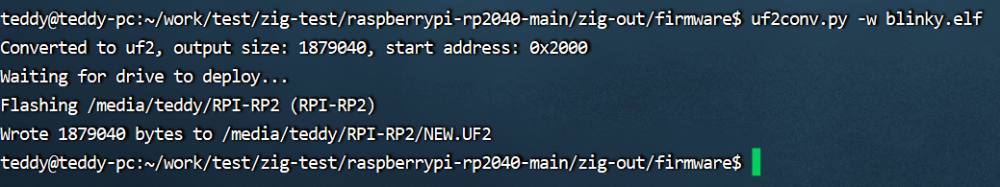

--

# 关键字

| 关键字         | 作用                                                         |
| -------------- | ------------------------------------------------------------ |
| addrspace      | 当前文档都没有。                                             |
| align          | 指定对齐方式，例如align(4)                                   |
| allowzero      | 该指针属性允许指针的地址为零。仅在独立操作系统目标上才需要这样做，其中地址零是可映射的。如果要表示空指针，请改用可选指针。带有allowzero的可选指针与指针的大小不同。在此代码示例中，如果指针没有 allowedzero 属性，这将是一个 Pointer Cast Invalid Null panic： |
| and            | 逻辑与                                                       |
| anyframe       | 指向函数栈帧的指针                                           |
| anytype        | 任意类型                                                     |
| asm            | 内联汇编                                                     |
| async          | 异步函数                                                     |
| await          | 异步函数                                                     |
| break          |                                                              |
| callconv       | 函数转换                                                     |
| catch          |                                                              |
| comptime       | 重要。编译时特性                                             |
| const          | 声明常量                                                     |
| continue       |                                                              |
| defer          | defer 将在控制流离开当前块时执行表达式。                     |
| else           |                                                              |
| enum           | 定义枚举                                                     |
| errdefer       | 当控制流离开当前块时，errdefer 将执行一个表达式，如果函数返回错误，errdefer 表达式可以捕获展开的值。 |
| error          | 定义一个错误类型                                             |
| export         | 导出使函数或变量在生成的目标文件中外部可见。导出的函数默认采用 C 调用约定。 |
| extern         |                                                              |
| fn             | 定义一个函数                                                 |
| for            |                                                              |
| if             |                                                              |
| inline         |                                                              |
| linksection    | 相当于ld连接脚本的作用，指定链接区域                         |
| noalias        |                                                              |
| noinline       |                                                              |
| nosuspend      | nosuspend 关键字可以用在块、语句或表达式前面，以标记未达到挂起点的范围。特别是在 nosuspend 范围内：<br/>使用 suspend 关键字会导致编译错误。<br/>在尚未完成的函数框架上使用await 会导致经过安全检查的未定义行为。<br/>调用 async 函数可能会导致安全检查的未定义行为，因为它等效于包含await 的await async some_async_fn()。<br/>nosuspend 作用域内的代码不会导致封闭函数成为异步函数。 |
| opaque         | 定义一个不透明的类型                                         |
| or             |                                                              |
| orelse         |                                                              |
| packed         | 对struct进行对齐                                             |
| pub            | 对外可见                                                     |
| resume         | 跟suspend一起，是不是说协程的行为？                          |
| return         |                                                              |
| struct         |                                                              |
| suspend        | 挂起将导致控制流返回到函数的调用站点或恢复程序。挂起也可以用在函数内的块之前，以允许函数在控制流返回到调用站点之前访问其框架。 |
| switch         |                                                              |
| test           | 写测试用例                                                   |
| threadlocal    |                                                              |
| try            |                                                              |
| union          |                                                              |
| unreachable    |                                                              |
| usingnamespace |                                                              |
| var            |                                                              |
| volatile       |                                                              |
| while          |                                                              |

# 操作符

不存在运算符重载。当您在 Zig 中看到一个运算符时，您就知道它正在执行此表中的某些操作，而不执行其他操作。

# zig build系统

Zig 构建系统提供了一种跨平台、无依赖性的方式来声明构建项目所需的逻辑。

使用该系统，构建项目的逻辑被写入 build.zig 文件中，

使用 Zig Build System API 来声明和配置构建工件和其他任务。

构建系统可以帮助完成的一些任务示例：

> 通过执行 Zig 编译器创建构建工件。这包括构建 Zig 源代码以及 C 和 C++ 源代码。
>
> 捕获用户配置的选项并使用这些选项来配置构建。
>
> 通过提供可由 Zig 代码导入的文件，将构建配置显示为 comptime 值。
>
> 缓存构建工件以避免不必要的重复步骤。
>
> 执行构建工件或系统安装的工具。
>
> 运行测试并验证执行构建工件的输出是否与预期值匹配。
>
> 在代码库或其子集上运行 zig fmt。
>
> 自定义任务。

## 生成一个exe文件

build.zig会在执行zig init-exe的时候自动生成。

# rp2040 zig编译运行

直接zig build就好了。

我的编译时会crash，发现是需要升级到0.11的正式版才行。

编译后得到的目录：

```
.
├── bin
├── firmware
└── stage2
```

没有UF2的，那就需要把uf2py的工具下载下来，转换一下。

但是我转换处理的运行不支持。

正常的应该是在把uf2放入到板端后，板端自动重启运行这个uf2文件。

但是我的放进去没有反应，而且上电后，也不是我的包的效果。



即使我用命令直接烧录也是如此。


# zon -- zig的包管理

看rp2040的microzig工程里有个build.zig.zon文件，内容是这样：

```
.{
    .name = "rp2040",
    .version = "0.0.0",
    .dependencies = .{
        .microzig = .{
            .url = "https://github.com/ZigEmbeddedGroup/microzig/archive/0b3be0a4cc7e6d45714cb09961efc771e364723c.tar.gz",
            .hash = "1220ada6d01db7b3d0aa8642df89b1af9ee71b681438249e9a7efb2275fc4cf32152",
        },
        .args = .{
            .url = "https://github.com/MasterQ32/zig-args/archive/91d1e89fb89a4d01dec7c9aec95b0a324080ebcc.tar.gz",
            .hash = "12203d04cafc97f952d74cdb077e74c0ab3414f9f6b5fbd159112c62bfa584a0dbed",
        },
    },
}

```

https://medium.com/@edlyuu/zig-package-manager-wtf-is-zon-df5ecbafcc54

# 数据类型

```
i8
u8
i16
u16
i32
u32
i64
u64
i128
u128
isize
usize
c_char
c_short
c_ushort
c_int
c_uint
c_long
c_ulong
c_longlong
c_ulonglong
f16
f32
f64
f80
f128
bool
anyopaque
void
noreturn
comptime_int
comptime_float
```


在 hello.zig 代码示例中，

main 函数使用 !void 返回类型进行声明。

**此返回类型称为错误联合类型。**

此语法告诉 Zig 编译器该函数将返回错误或值。

错误联合类型组合了错误集类型和任何其他数据类型（例如基元类型或用户定义类型，例如结构体、枚举或联合）。

错误联合类型的完整形式是错误集类型！任何数据类型。

在代码示例中，错误集类型未明确写在 ! 的左侧。操作员。

当以这种方式编写时，错误集类型是推断的错误集类型。后的虚空！运算符告诉编译器该函数在正常情况下（即没有错误发生时）不会返回值。


# 虚空运算符！

有经验的程序员请注意：Zig 还具有布尔运算符 !a，其中 a 是 bool 类型的值。错误联合类型包含语法中的类型名称：!任何数据类型。


在 Zig 中，函数的语句和表达式块由左大括号 { 和右大括号 } 包围。


传递给 stdout.print() 函数的两个参数“Hello, {s}!”和 .{“world”} 在编译时进行评估。

该代码示例是特意编写的，

旨在展示如何在打印函数中执行字符串替换。

第一个参数内的大括号被第二个参数内的编译时已知值（称为元组）替换。

第一个参数的双引号内的是换行符的转义序列。 

try 表达式计算 stdout.print 的结果。

如果结果是错误，则 try 表达式将从 main 返回并返回错误。

否则，程序将继续进行。

在这种情况下，主函数中没有更多的语句或表达式可以执行，因此程序退出。


在 Zig 中，标准输出 writer 的打印函数允许失败，

因为它实际上是定义为通用 Writer 一部分的函数。

考虑一个表示将数据写入文件的通用 Writer。

当磁盘已满时，写入文件将失败。

但是，我们通常不希望将文本写入标准输出失败。

为了避免处理打印到标准输出的失败情况，

您可以使用替代函数：std.log 中用于正确记录的函数或 std.debug.print 函数。

本文档将使用后一个选项打印到标准错误 (stderr) 并在失败时静默返回。

下一个代码示例 hello_again.zig 演示了 std.debug.print 的使用。

```
const print = @import("std").debug.print;

pub fn main() void {
    print("Hello, world!\n", .{});
}
```

# 注释

Zig 支持 3 种类型的注释。

普通注释将被忽略，

但编译器使用文档注释和顶级文档注释来生成包文档。

生成的文档仍处于实验阶段，可以通过以下方式生成：

```
zig test -femit-docs main.zig
```

文档注释是以三个斜杠开头的（即 /// 但不是 ////）；

一行中的多个文档注释合并在一起形成多行文档注释。文档注释记录了紧随其后的任何内容。

文件头部的注释是：

```
//! 文件级别的注释
```

注释也不能乱安排，顺序有问题，也是会报错的。

例如文件级别的注释前面就不能出现其他的注释。

# 多行文本

用2个反斜杠

```
const hello_world_in_c =
    \\#include <stdio.h>
    \\
    \\int main(int argc, char **argv) {
    \\    printf("hello world\n");
    \\    return 0;
    \\}
```


变量必须在定义的时候被赋值。

否则报错。

如果实在想要不给明确的初始值。那么给undefined。

```
var x: i32 = undefined;
```


undefined 可以强制转换为任何类型。

一旦发生这种情况，就不再可能检测到该值是否未定义。 

undefined 意味着该值可以是任何东西，甚至是根据类型来说是无意义的东西。

翻译成英语，未定义的意思是“不是一个有意义的值。使用这个值将是一个错误。该值将不被使用，或者在使用之前被覆盖。”


在调试模式下，Zig 将 0xaa 字节写入未定义的内存。

这是为了尽早发现错误，并帮助检测调试器中未定义内存的使用。

但是，此行为只是一种实现功能，而不是语言语义，因此不能保证代码可以观察到它。

# test写法

```
const std = @import("std");

test "expect addOne adds one to 41" {

    // The Standard Library contains useful functions to help create tests.
    // `expect` is a function that verifies its argument is true.
    // It will return an error if its argument is false to indicate a failure.
    // `try` is used to return an error to the test runner to notify it that the test failed.
    try std.testing.expect(addOne(41) == 42);
}

test addOne {
    // A test name can also be written using an identifier.
    try std.testing.expect(addOne(41) == 42);
}

/// The function `addOne` adds one to the number given as its argument.
fn addOne(number: i32) i32 {
    return number + 1;
}
```

这样测试：

```
 zig test src/main.zig
```


# 报告内存泄漏

```
const std = @import("std");

test "detect leak" {
    var list = std.ArrayList(u21).init(std.testing.allocator);
    // missing `defer list.deinit();`
    try list.append('☔');

    try std.testing.expect(list.items.len == 1);
}
```

# 标识符

变量标识符永远不允许隐藏来自外部作用域的标识符。

标识符必须以字母字符或下划线开头，后面可以跟任意数量的字母数字字符或下划线。它们不得与任何关键字重叠。请参阅关键字参考。

**如果需要不符合这些要求的名称（例如与外部库链接），则可以使用 @'' 语法。**

```
const @"identifier with spaces in it" = 0xff;
const @"1SmallStep4Man" = 112358;

const c = @import("std").c;
pub extern "c" fn @"error"() void;
pub extern "c" fn @"fstat$INODE64"(fd: c.fd_t, buf: *c.Stat) c_int;

const Color = enum {
  red,
  @"really red",
};
const color: Color = .@"really red";
```


容器级变量具有静态生命周期，并且与顺序无关且延迟分析。

容器级变量的初始化值隐式为comptime。

如果容器级变量是 const，那么它的值是编译时已知的，否则它是运行时已知的。

# 模拟C语言的static内部变量

用const容器（就是struct）来做。

```
const std = @import("std");
const expect = std.testing.expect;

test "static local variable" {
    try expect(foo() == 1235);
    try expect(foo() == 1236);
}

fn foo() i32 {
    const S = struct {
        var x: i32 = 1234;
    };
    S.x += 1;
    return S.x;
}
Shell
```

# 数组

