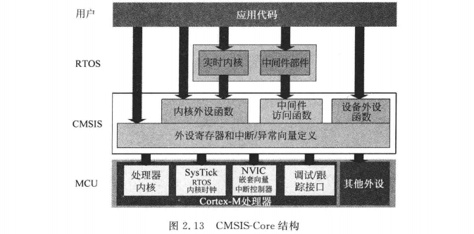
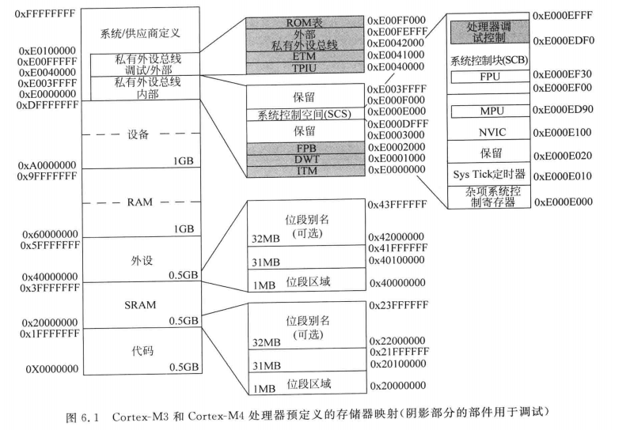

1

# 序

cm3是从2008年开始，以其高性能、低成本、易于使用的优点，迅速取代了arm7，称为了32位微处理器的主流。

cm4是在cm3的基础上增加了浮点单元和一些dsp指令。

这样就极大地提高了数学运算的效率。

厂家一般都提高了底层驱动库，我们使用这些芯片的时候，不需要过多关注寄存器细节，就可以进行开发。

提高了产品的开发效率。

# 1 arm cortex-m处理器简介

cm3是一个cortex处理器，在2006年发布。

cm4是2010年发布。

都是32位架构。

寄存器组的内部寄存器，数据通路，总线接口都是32位的。

使用的指令集架构是Thumb ISA。

cm3处理器具有如下特点：

```
1、三级流水线设计。
2、哈佛总线架构。但是指令和地址总线使用相同的地址空间（哈佛架构也可以使用不同的地址空间的）
3、32位寻址。
4、基于ARM AMBA总线技术，支持高吞吐量的流水线总线操作。
5、NVIC的中断控制器，支持最多240个中断请求。
6、支持多种os特性，例如tick定时器和影子栈指针。
7、休眠模式和多种低功耗特性。
8、支持可选的mpu。
9、位段特性支持位操作。
10、可以选择使用单个或者多个处理器。
```

提供了这些指令：

```
1、普通数据处理，包括硬件除法指令。
2、存储器访问指令，支持8位、16位、32位和64位数据。还有可以传输多个32位数据的指令。
3、位域处理指令。
4、乘累加以及饱和指令。
5、用于跳转、条件跳转以及函数调用指令。
6、用于系统控制、支持os等指令。
```

cm4还提供：

```
1、SIMD单指令多数据操作。
2、乘法指令。
3、饱和运算指令。
4、可选的单精度浮点指令。
```

虽然说arm是RISC指令集的，但是现在RISC和CISC的界限越来越模糊。

cm3和cm4都是armv7-M架构的。

而cm0-则是armv6-M架构的。它的指令集非常小。适合低成本。

# ２嵌入式软件开发简介

cmsis所做的标准化工作：

1、处理器外设的标准化。包括nvic寄存器，systick定时器、mpu、系统控制块SCB。

2、访问处理器特性的标准化函数。

3、操作特殊指令的标准化函数。cm支持几个用于特殊目的的指令，例如进入低功耗的wfi指令，这些指令无法用普通的C语言生成。

4、系统异常处理的标准化命名。

5、系统初始化的标准函数。




# 3 技术综述


# 4 架构

不使用rtos的话，则PSP不需要关注，只用MSP主栈指针就可以了。

SCB

系统控制块

包括：进入低功耗模式控制、向量表重定位。

# 5 指令集

指令集分类

```
1、处理器内传送数据。
2、存储器访问
3、算术运算。
4、逻辑运算。
5、移位运算。
6、转换运算。
7、位域处理指令。
8、程序调整
9、乘累加指令，简称MAC
10、除法指令。
11、存储器屏障指令。
12、异常相关指令。
13、休眠模式指令。
14、其他指令。
```

## 处理器内传送数据

```
mov r4, r0
movs r4, 40 # 跟上面一条的不同在于，会更新APSR寄存器。
mrs r7, primask # 从特殊寄存器primask读取到r7里。
msr control, r2 从r2读取到特殊寄存器control里
mov r3, #0x34
movw r3, #0x1234 # 把r3的低16位设置为0x1234
movt r3, #0x8765  # 把r3的高16位设置为0x8765
mvn r3, r7 # 把r7的内容取反后传递给r3
```

如果要把一个较大的立即数，传递给寄存器。

有几种方法：

1、使用ldr伪指令。

```
ldr r0, =0x12345678 # 把r0的值设置为0x12345678
这个实际上会被翻译成这样的汇编指令：
ldr r0, [pc, #offset]

DCD 0x12345678
```

2、组合使用movw和movt。

用ldr伪指令最简单。

## 存储器访问指令

有读和写两种。读是ldr，写是str。

```
字节
ldrb
strb
半字
ldrh
strh
字
ldr
str
多个字
ldm
stm
双字，也就是64位
ldrd
strd
栈操作
pop
push
```

### 立即数偏移（前序）

存储器的地址是寄存器里数值和立即数的和，这个叫做前序寻址。

```
ldrb r0, [r1, #0x3]
```

偏移值可以是负数。

后面加上感叹号。则表示把地址写到寄存器。

```
ldr r0, [r1, #0x08]! 先把r1+0x08地址的内容传递给r0，然后把r1的值更新为r1+0x08
```

### pc相关寻址

存储器访问可以产生相当于当前PC的地址值和偏移值。

一般是用来把立即数加载到寄存器。

也叫做文本池访问。

### 寄存器偏移（前序）

```
ldr r3, [r0, r2, LSL #2] # [r0 + (r2<<2)]指向的内容读取到r3
```

移位是可选的。

### 后序

```
ldr r0, [r1], #offset # 效果是把[r1]的内容读取到r0，然后r1被更新为r1+offset
```

这个一定会更新源寄存器，不需要加感叹号。

这个在处理数组的时候非常有用。

### 多加载和多存储

```
ldmia
ldmdb
stmia
stmdb
```

ia表示每次地址递增。

db表示每次地址递减。

### 压栈和出栈

```
push {r0,r4-r7,r9} ; 把这些寄存器的值压入栈中。
pop {r2,r2} #把栈里的内容放入r2和r3
```

### sp相关寻址

## 算术运算

```
add r0, r0, r1 ; r0 = r0+r1
adds r0, r0, #0x12 ;r0 = r0 + 0x12 ，更新APSR
adc r0, r1, r2 ; r0 = r1+r2 + 进位
```

## 逻辑运算

```
and r0, r1 ; r0 = r0 & r1
and r0, r1, #0x12 ; r0 = r1 & 0x12
and r0, r1, r2 ; r0 = r1 & r2
orr r0, r1 ; r0 = r0|r1
bic r0, r1 ; r0 = r0 &(~r1)

orn r0, r1, #0x1 或非
eor r0, r1 异或
```

## 移位和循环移位

```
asr r0, r1, #1 ; r0 = r1>>1
asr r0, r1 ; r0 = r0>>r1 算术右移
;逻辑左移
lsl r0, r1 ; r0 = r0 << r1

lsr
ror

```

## 数据转换运算

展开和反序。

就是把字节展开为字这些操作。

## 位域处理

## 比较和测试

```
cmp r0, r1 ; 计算r0-r1
cmn r0, r1 ; 计算r0+ r1
tst r0, r1 ; r0 & r1
teq r0, r1; r0^r1
```

## 程序流控制

### 跳转

```
多条指令都可以触发跳转。
1、跳转指令。例如b、bx
2、mov pc, r0 
3、ldr pc,=0x12345678
```

常用的是还是b（跳转）、bx（间接跳转）。

还有pop指令（一般用于函数返回）。

无条件跳转

```
b label
b.w label
	b跳转的范围在2KB以内。超过这个范围，用b.w来跳转。
	
bx r0
	间接跳转。
	跳转到r0里的值的地址。
```

### 函数调用

要调用函数，可以使用bl（链接跳转），blx（带链接的间接跳转）。

特点是结束后会自动返回到之前的位置。

### 条件跳转

```
bxx label
```

xx就是条件。可以是eq、ne等等。

### 比较和跳转

这个是armv7-M提供的新的指令。

它合并了和零比较以及条件跳转操作。

有两条指令。

```
cbz
cbnz
```

它们只支持前向跳转，不支持向后跳转。

一般是用来循环结构。

例如下面的c代码。

```
i = 5;
while(i!=0) {
	func1();
	i--;
}
```

编译得到的汇编可能是这样：

```
mov r0, #5
loop1:
	cbz r0, loop1exit
	bl func1
	subs r0, #1
	b loop1
loop1exit:

```

### 条件执行

就是if-then指令。

```
it <cond> 
	举例：
	it eq
	addeq r0, r0, r1
it<x> <cond>
	
it<x><y> <cond>
it<x><y><z> <cond>
```

这个指令可以不用。

## 异常相关指令

svc指令，一般用在rtos里。实现从非特权模式到特权模式的切换。

svc指令要求svc异常的优先级比当前的优先级要高。

而NMI和HardFault这2个异常的优先级比svc的要高。

所以这个异常的处理函数里，是不能使用svc指令的。

svc指令的格式：

```
svc #<immed>
```

立即数的长度是8位的。

另外一条和异常相关的指令是cps指令，这个指令是用来改变处理器状态的。

cps一般这样用：

```
cpsie I; 表示enable_irq
cpsid I; 表示disable_irq
cpsie F; 表示enable_fault
cpsid F; 表示disable_fault
```

## 休眠相关指令

```
wfi 等待中断
wfe 等待事件
```

## 存储器屏障指令

```
dmb
	数据存储器屏障。
dsb
	数据同步屏障
isb
	指令同步屏障。
```

## 其他指令

```
nop
brpt 断点。
```

# 6 存储器系统




参考资料

