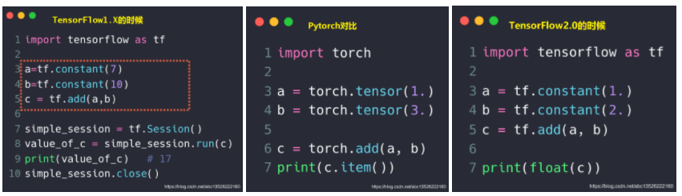

--

《TensorFlow2.0笔记》是csdn上布衣小张的系列教程。看起来不错。

图文并茂，内容翔实，非常有条理。

学习一下，并做一些笔记。

每一章，我都在google colab上新建一个01.ipynb这样的colab文件来对应。

把代码都写在里面。

# 1 介绍及安装

`Tensorflow2.0` 版本具有**简易性、更清晰、扩展性**三大特征，

大大简化 `API`，提高了`Tensorflow Lite`和 `TensorFlow.js` 部署模型的能力。

`Tensorflow2.0` 已经和 `Pytorch` 非常非常接近了，看下面 `TensorFlow1.x, Pytorch, TensorFlow2.x` 三者的对比！



所以学习的策略就是：不要再管tf1.x的了。

学习tf2.x的，然后pytorch的就可以触类旁通。

keras被谷歌收购了。keras可以看做封装了tf接口的上层api。

tf框架的特点：

1、GPU加速。

2、自动求导。

3、神经网络layer。

GPU和CPU在矩阵计算上的区别。是毫秒和秒这种量级的差别。

可以写一个大矩阵相乘的例子测试一下。

```
import tensorflow as tf
import time
gpu_a = tf.random.normal([10000,1000])
gpu_b = tf.random.normal([1000,2000])
start = time.clock()
c = tf.matmul(gpu_a, gpu_b)
print('use time:{}'.format(time.clock()-start))
```

在colab里运行的统计情况：

CPU：1.2484029999999997

GPU：0.283817

TPU：1.3562440000000002

自动求导这样写

```
import tensorflow as tf
x = tf.constant(1.0)
a = tf.constant(2.0)
b = tf.constant(3.0)
c = tf.constant(4.0)

with tf.GradientTape() as tape:
  tape.watch([a,b,c])
  y = a**2*x + b*x + c

[dy_da, dy_db, dy_dc] = tape.gradient(y, [a,b,c])
print(dy_da, dy_db, dy_dc)
```


tf.GradientTape定义在tensorflow/python/eager/backprop.py文件中，

从文件路径也可以大概看出，GradientTape是eager模式下计算梯度用的，

而eager模式（eager模式的具体介绍请参考文末链接）是TensorFlow 2.0的默认模式，

因此tf.GradientTape是官方大力推荐的用法。

然后是用keras api把mnist的数据训练并预测测试一下。

# 2 手写数字识别初步

这个没有看出什么，先跳过。

# 3 

没太看懂。

# 4 TF2的基本操作

numpy的缺点：

因为numpy是在深度学习流行之前就设计好了的。

所以numpy就没有考虑GPU加速的优化。

也不能自动求导。

所以才有TensorFlow来解决这个问题。

TensorFlow在api设计上跟numpy比较接近，降低numpy用户学习的难度。

```
tf.constant(1)
# 输出 <tf.Tensor: shape=(), dtype=int32, numpy=1>
```

怎样创建一个tensor？

有多种方法：

```
1、从numpy、list来创建。
	tf.convert_to_tensor(np.ones([2,3]))
	tf.convert_to_tensor([2,3])
2、用zeros和ones，创建全0和全1的张量。
	tf.zeros([])
	tf.zeros([1])
	tf.zeros([2,2])
	a = tf.zeros([2,3,3])
	b = tf.zeros_like(a)
3、fill函数
	tf.fill([2,3],0)
4、random函数
	tf.random.normal([2,2]) 随机正态分布
	
5、constant
	tf.constant([1,2])
6、Application
```

# 5 TF2的索引和切片

这个没什么，就跟list的index和slice差不多。

# 6 TF2的维度变换


# 参考资料

1、〖TensorFlow2.0笔记23〗TensorFlow2.0学习笔记总结!

https://blog.csdn.net/abc13526222160/article/details/101938410