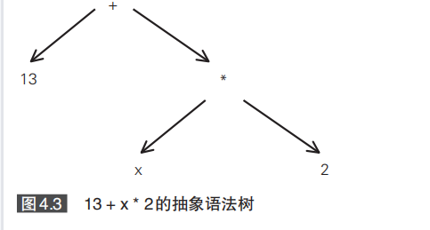

最近最大的兴趣点就是自己设计实现一个脚本语言引擎。

看到这本书，觉得不错。系统学习一下。

# 基础篇

## ch01

没有什么，就是介绍本书的构成。

使用java来实现。

不使用yacc这种80年代的方案。

## ch02

设计一个名字叫Stone的语言。

一种程序设计语言，需要哪些语法功能呢？

我们做如下的规定：

1、整数四则运算。

2、最好可以支持字符串处理。

3、对变量提供支持。不然就跟计算器没有区别了。

4、if、while支持。

5、因为是脚本语言，所以不需要数据类型。使用时不用先声明变量。这样语法就可以比较简单。

6、使用分号作为行尾结束。可以省略。

7、没有return关键字。

8、没有支持elseif。

一段完整的展示是这样：

```
even = 0
odd = 0
i = 1
while i< 10 {
	if i % 2 == 0{
		even = even+i
	} else {
		odd = odd + i
	}
	i = i + 1
}
even+odd
```

### 避免含糊的设计

语言设计里有一个dangling-else的情况。

例如：

```
if (a)
	if (b) 
		xx;
else
	yy
```

下面这个else应该属于哪个if呢？

两种都可以解释得通。java是就近优先，所以else属于第二个if。

我们当前是强制要求必须要大括号，就可以避免这种二义性。

## ch03 分割单词（词法分析 lexer）

语言处理器的第一个组成部分是lexer。

整个源代码程序，本质上是一长串字符串。

长字符串很难处理，所以首先就是要对它进行切割。

这个就是词法分析。

### token对象

```
while i < 10 {
```

这一行会被拆分成：

```
"while" "i" "<" "10" "{"
```

这样的5个字符串。

也叫5个Token。

lexer会筛选出程序解释和执行必须的部分。

空白和注释在这个阶段都会被去掉。

例如：

```
i = i + 1 //comment
i=i+1
```

在lexer之后，都是得到：

```
"i" "=" "i" "+" "1"
```

这5个token。

这个阶段后，就不用考虑空白和注释了。

token对象不仅包含了字符串内容，还包含了单词的类型，单词所处的行号等信息。

### 通过正则表达式来定义单词

要设计lexer，首先要考虑每一种类型的单词的定义。

规定怎样的一个字符串才能构成一个单词。

最重要的是没有歧义。

Stone语言支持3种类型的单词：

标识符。变量名、函数名、类名。运算符也算。

int字面量。

str字面量。

### 借助java.util.regex设计lexer

## ch04 用于表示程序的对象（ast）

在lexer将持续分割为单词后，就看一开始构造ast了。

ast，抽象语法树。

是一种表示程序结构的树形结构。

构造ast的过程，叫做语法分析。

语法分析的任务是分析各个单词之间的关系。

例如判断哪些单词属于同一个语句，处理括号的配对问题。

词法分析的结果就是输出ast。




### 设计ast的节点类

## ch05 设计语法分析器

### Stone语言的语法

## ch06 通过解释器执行程序

## ch07 添加函数功能

stone的代码

https://gitee.com/tisir/stone

依赖的库gluonj的代码

https://github.com/chibash/gluonj