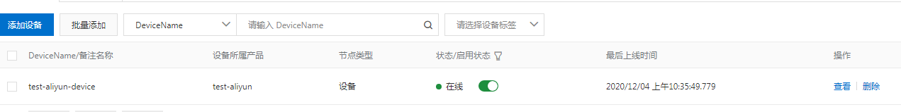
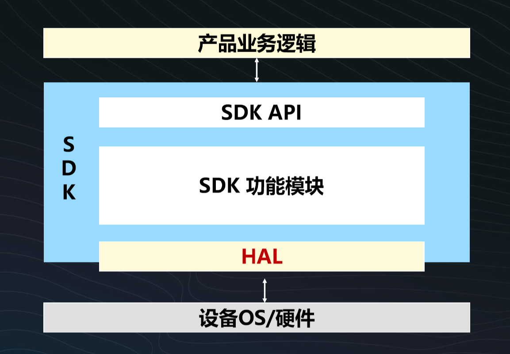
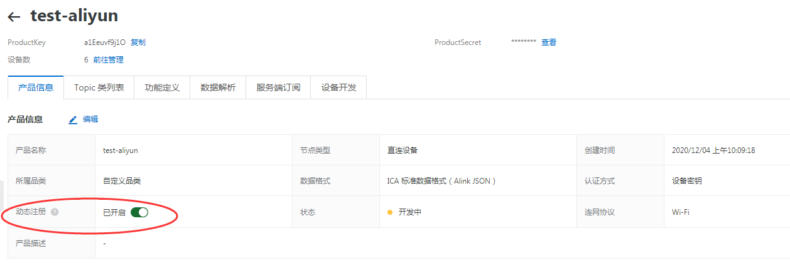

1

# 阿里云物联网平台

分为4个板块：

云：云端开发。

端：设备端开发。

管：lora网络管理。

边：边缘计算。

物联网平台的典型应用场景。

共享充电宝的案例。

上报状态，下发控制指令。

物联网平台提供的价值：海量连接、低延时、实时监控。

需要搭配：物联网卡、设备认证、云服务器。

设备端：iot sdk。

通信方式：mqtt。

云端应用：电量监控、状态管理、远程控制、远程升级、费用中心、售后服务。


阿里云提供的物联网卡服务。

我把这些业务串一遍。

首先，创建一个产品。

```
创建一个产品，test-aliyun，设备名字叫test-aliyun-device。
test-aliyun

下面这3个，就叫设备三元组。可以唯一标识一个设备。
ProductKey
a1Eeuvj1O

DeviceName
test-aliyun-device

DeviceSecret
4071835975720cdd4001dab8f
```

我选择Linux的C语言SDK。
很小，只有13K。

就是一个demo。4个文件。

```
.
├── device_id_password.json
├── makefile
├── sample.c
└── start.sh
```

从start.sh就可以看出，代码写得一般。

靠start.sh这个脚本来下载sdk，进行编译。

```
url=https://github.com/aliyun/iotkit-embedded/archive/v2.3.0.zip
```

编译过程的打印还是很清晰的。

编译之后的目录：

```
.
├── device_id_password.json
├── include 生成的头文件。
├── iotkit-embedded-2.3.0 这个是下载的sdk代码目录。
├── lib 生成的库文件。
├── linkkit_kv.bin 
├── makefile
├── quickstart  生成的二进制可执行文件。
├── sample.c
├── sample.o
└── start.sh
```

库文件有这些：

```
.
├── libalicrypto.a
├── libcurl.a
├── libid2client.a
├── libiot_hal.a
├── libiot_sdk.a
├── libiot_tls.a
├── libitls.a
├── libkm.a
├── libmbedcrypto.a
└── libplat_gen.a
```

头文件目录：

```
.
├── exports
│   ├── iot_export_awss.h
│   ├── iot_export_coap.h
│   ├── iot_export_compat.h
│   ├── iot_export_errno.h
│   ├── iot_export_event.h
│   ├── iot_export_http2.h
│   ├── iot_export_http2_stream.h
│   ├── iot_export_http.h
│   ├── iot_export_linkkit.h
│   ├── iot_export_mqtt.h
│   ├── iot_export_ota.h
│   ├── iot_export_shadow.h
│   ├── iot_export_state.h
│   ├── linkkit_export.h
│   └── linkkit_gateway_export.h
├── imports
│   ├── iot_import_awss.h
│   ├── iot_import_config.h
│   ├── iot_import_crypt.h
│   ├── iot_import_dtls.h
│   ├── iot_import_ota.h
│   ├── iot_import_product.h
│   ├── iot_import_tcp.h
│   ├── iot_import_tls.h
│   └── iot_import_udp.h
├── iot_export.h
└── iot_import.h
```

运行打印：

```
/*
 * Copyright (C) 2015-2018 Alibaba Group Holding Limited
 */

[prt] log level set as: [ 2 ]
main|294 :: sample start!

app_linkkit_sample|243 :: IOT_Linkkit_Open successfully
[prt] Loading the CA root certificate ...
[prt]  ok (0 skipped)
[prt] Connecting to /a1Eeuvf9j1O.iot-as-mqtt.cn-shanghai.aliyuncs.com/443...
[prt] dns server: 223.5.5.5
[prt] ip address: 101.133.196.128

[prt] setsockopt SO_SNDTIMEO timeout: 10s
[prt]  ok
[prt]   . Setting up the SSL/TLS structure...
[prt]  ok
[prt] Performing the SSL/TLS handshake...
[prt]  ok
[prt]   . Verifying peer X.509 certificate..
[prt] certificate verification result: 0x00
not found
HAL_Timer_Create
[prt] success to establish udp, fd=4
HAL_Timer_Create
mac_str: 
mac_str: 
user_initialized|158 :: Device Initialized, Devid: 0
app_linkkit_sample|251 :: IOT_Linkkit_Connect successfully
app_linkkit_sample|253 :: Linkkit enter loop
user_connected_event_handler|071 :: Cloud Connected
mac_str: 
mac_str: 
mac_str: 
mac_str: 
mac_str: 
app_post_all_property|180 :: Property post successfully, Message ID: 3, payload: {"Data": "Hello,World!", "Status": 1}
mac_str: 
user_report_reply_event_handler|134 :: Property Post Reply Received, Devid: 0, Message ID: 3, Code: 200, Reply: {}

```

云端可以看到设备在线了。



官网的路径图还是非常好的，把总体画得很清晰，然后里面的都可以点击跳转。


主要的用途我估计还是这样：

设备开发厂家，希望了解自己的产品的销售使用情况。

也可以让用户通过手机app来查看和控制设备。

物联网平台就是起数据中转的作用。

这样厂家就不要自己去搭建复杂的服务器后台了。

在阿里云的平台上开发难度要低一些。

运维也要方便很多。

这就是阿里云平台提供的价值。

我觉得可以以Ubuntu笔记本作为开发对象。

把它当成一个温度计。读取cpu温度进行上传。

要有双向数据，还要加一个控制指令。

控制什么呢？控制提示音播报吧。

cat /sys/class/thermal/thermal_zone0/temp 

这个是查看温度。

就这样定。

产品名字和设备名字就不改了。

选择批量添加，生成5个设备。生成的设备名字是随机的。

添加后的设备状态是未激活。

然后我就需要修改设备端的代码了。


## link-kit

也叫iot-kit。

文档在这里。

https://code.aliyun.com/edward.yangx/public-docs/wikis/user-guide/Linkkit_User_Manual

当前的LTS版本是3.0.1。

C-SDK提供的API可以使用之后, 就可以用来编写您自己的业务/应用程序了, 比如上报数据, 订阅主题, 接收命令等

**再次强烈建议在 `Ubuntu16.04` 等主机平台上完成业务逻辑代码的编写和测试, 再移动到嵌入式目标平台上去, 这样如果有问题, 也可以和主机上的同样源码运行效果做对比**

子设备
也叫从设备, 它本质上仍是设备, 

只不过表现形态是是通过另一台设备, 

 **连接到阿里云服务器, 而不是直接连到云端**

一般这种设备不具有独立自主的因特网(公网)连接能力

比如, 蓝牙耳机, Zigbee传感器等, 

它们基于自身的蓝牙或Zigbee协议连接到蓝牙网关和Zigbee网关上, 

后者建立和阿里云服务器之间的 TCP/IP 连接

网关

也叫主设备, 网关是一种直连云端的设备, 

但**区别于普通设备的地方**在于网关设备具备对子设备的管理能力, 

并且能够代替子设备连接云端

单品
这是相对于网关的概念来说的, 

这样的设备**不会**将自己和阿里云服务器之间的TCP/IP**通道分享**给下联的其它设备(子设备)

## 设备物模型

三要素

```
属性
	 一般用于描述设备运行时的状态
服务
	指可被外部调用的能力或方法, 包含输入参数和输出参数
事件
	相比于属性状态, 事件一般而言包含设备需要被外部感知和处理的通知信息
```


RRPC
即Revert-RPC. 从字面上理解, 可以实现由服务端请求设备端, 并能够使设备端同步响应的功能

Alink协议
阿里云定义的, 基于JSON格式的, 设备与云端之间的通信协议



## 设备认证

设备的身份认证分为一机一密以及一型一密两种：

- 一机一密： 在设备上烧写设备的ProductKey、DeviceName、DeviceSecret，然后适配相应的HAL并调用SDK提供的连接云端的函数即可，这种方式要求对设备的产线工具进行一定的修改，需要对每个设备烧写不同的DeviceName和DeviceSecret；
- 一型一密： 设备上烧写设备的ProductKey、ProductSecret，每个设备需要具备自己的唯一标识并将该标识预先上传到阿里云IoT物联网平台，然后调用SDK提供的函数连接云端。这种方式每个设备上烧写的信息是固定的ProductKey、ProductSecret


使用一型一密功能, 

用户必须对每个设备进行预注册,

 即在阿里云物联网平台的控制台上传每个设备的DeviceName，

并且在控制台上打开对应产品的动态注册功能



一型一密功能的例子程序在 `src/dynamic_register/examples/dynreg_example.c`

感觉有点对不上。文档和代码结构已经不匹配了。


分析sample.c的代码。

注册的事件：

```
连接
断开
服务请求：
	这个作用是什么？
属性get
属性set
report reply
	？
触发event reply
	？
初始化完成
```

设置mqtt domain。

从本质上来说，就是帮你搭建了一个mqtt服务端。

定义了一下标准主题，方便进行规范化的管理和数据呈现。

DOMAIN = iot-as-mqtt.cn-shanghai.aliyuncs.com

设置接收云端的消息答复。

```
int post_event_reply = 1;
IOT_Ioctl(IOTX_IOCTL_RECV_EVENT_REPLY, (void *)&post_event_reply);
```

创建主设备。

```
/* Create master device resource */
    app_context.device_id = IOT_Linkkit_Open(IOTX_LINKKIT_DEV_TYPE_MASTER, &device_meta_info);
```

连接阿里云服务器。

```
/* Start Connect AliCloud Server */
res = IOT_Linkkit_Connect(app_context.device_id);
```

然后进到主循环里。

```
{
	IOT_Linkkit_Yield(USER_EXAMPLE_YIELD_TIMEOUT_MS);//这个相当于sleep
	if (now % 5 == 0) {
            app_post_all_property();
        }//每5秒进行一次消息发布。
}
```

如果退出了循环。进行关闭服务。

```
/* close linkkit service */
    IOT_Linkkit_Close(app_context.device_id);
```

默认订阅的主题有。


基本通信主题

```
ota升级
	设备上报升级信息
	订阅了升级触发消息
	设备上报升级进度
	设备主动拉取升级
设备标签
	设备上报标签信息。
	云端下发标签回复。
	设备删除标签。
	云端下发删除标签回复。
ntp
	设备请求时间同步。
	云端响应同步。
设备影子
配置更新
广播
```

物模型通信主题

```
属性上报
属性设置
事件上报
服务调用
```

一个topic的格式：

```
/ota/device/inform/a1Eeuvf9j1O/${deviceName}
```


# 开源平台

```
kaaproject
	
```


参考资料

1、主流的IoT物联网架构方案整理

https://blog.csdn.net/hekuinumberone/article/details/110051328

2、9个顶级开发iot项目的开源物联网平台

https://www.cloudstone-iot.com/industry/9%E4%B8%AA%E9%A1%B6%E7%BA%A7%E5%BC%80%E5%8F%91iot%E9%A1%B9%E7%9B%AE%E7%9A%84%E5%BC%80%E6%BA%90%E7%89%A9%E8%81%94%E7%BD%91%E5%B9%B3%E5%8F%B0/

3、

https://iot.mushuwei.cn/#/