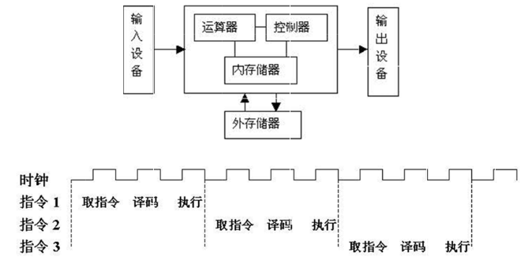
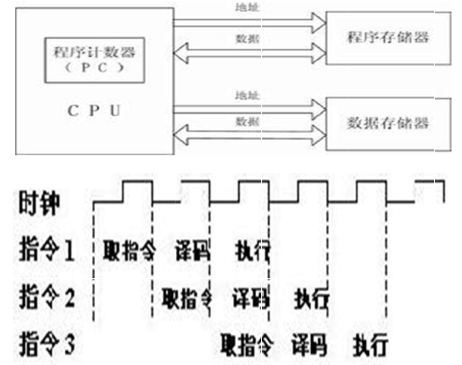

1

二者的区别就是程序空间和数据空间是否是一体的，冯·诺依曼结构数据空间和地址空间是不分开的，而哈佛结构数据空间和地址空间是分开的。

早期的微处理器大多采用冯·诺依曼结构，最典型的就是intel的x86微处理器，

取指令和取操作数都是在同一总线上，通过分时复用的方式进行，

优点是硬件简单，

但是缺点是在高速运行时，**不能达到同时取指令和取操作数**，从而会形成传输过程的瓶颈。

而哈佛总线技术的应用是以DSP和ARM为代表的，

采用哈佛总线体系结构的芯片**内部程序空间和数据空间是分开的**，

在硬件上也是分开的**，这就允许同时取指令和取操作数，**

也就是比冯结构快一步，**从而大大提高运算能力**，

例如最常见的运算中，一条指令同时可以取两个操作数，在流水线处理时，同时还有一个取指令操作，

冯式结构就需要先取指令，再取操作数，

而哈佛结构则允许同时运行，取指令同时，直接取操作数，**而且可以取完操作数后，直接取下一条指令**，

这样不会出现取指令和取操作数重叠执行的情况，效率大大提高。

参考资料

1、冯·诺依曼体系和哈佛总线体系的区别

https://www.cnblogs.com/zhuge2018/p/8465998.html