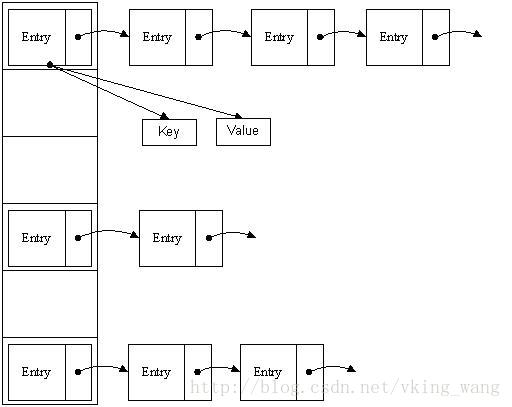

哈希表也叫散列表。它的出现，主要就是为了解决数据的快速定位问题。

一列键值对数据，存储在一个table里，如何通过key查找value呢？一个个比较key，是很低效率的。

在所有的线性数据结构中，数组的定位速度最快，因为它可以通过下标来直接定位到对应的内存上，而不需要一个个查找。哈希表就是利用了数组的这个特性。

具体是怎么做到的呢？

其实很简单，就是把key通过**哈希转换函数**转成一个int值。把这个值对数组长度取余，取余的结果作为数组的下标，把value存在数组的该下标处。

这就是典型的用空间换时间的方法。要多占用内存。


哈希碰撞


一个好的hash算法，具有这些特点：

```
1、压缩性。
	任意长度的数据都可以通过hash来压缩或者扩展到相同的长度。
2、抗计算原性。
	就是反向计算几乎是不可能的。
3、抗碰撞性。
	就是2个不同的明文，要计算得到相同的hash值，概率很低。
```


hashmap实际是链表，但是融合了数组的查找时间固定的优点。

hashmap有不同的实现方法，最常用的拉链法。

可以理解为链表的数组。

从根本上说，数据在内存里的存放，有顺序存储和链式存储这2种方式。




参考资料

1、哈希

https://hit-alibaba.github.io/interview/basic/algo/Hash-Table.html

2、Hash碰撞和解决策略

这个人的博客很有意思。

https://www.kawabangga.com/posts/2493

3、哈希碰撞与生日攻击

http://www.ruanyifeng.com/blog/2018/09/hash-collision-and-birthday-attack.html

4、关于 STL 中的 map 和 hash_map

http://blog.jobbole.com/109058/

5、一个1000万HashMap，会占用多少空间内存？

https://my.oschina.net/u/227422/blog/366683

6、HashMap的实现与优化

http://www.importnew.com/21294.html

7、常见数据类型的时间复杂度

http://bigocheatsheet.com/

8、

https://blog.csdn.net/wangxin1982314/article/details/51225566