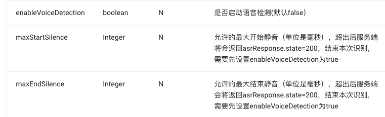

1

图灵机器人AI开发平台，是专门为儿童场景设计的。

可以应用的场景：

1、儿童机器人。

2、智能故事机。

3、儿童手表。

4、儿童平板。

5、公众号机器人。

6、绘本故事机。

7、绘本台灯。


api接入：这个不涉及语音输入，就是简单的文本性质的交互。

ai-wifi接入：这个就是语音输入，提到的目的url是不同的。这个的接口对api接入方便的有覆盖。只用这个就可以完成功能。


# 请求格式

请求的数据：

```
{
	"data": {
	
	},
	"key": "",
	"timestamp":""
}
```

data部分可以选择进行加密。

## data的构成

```
"data" : {
	"content": [
		{
			"data": "你好"
		}
	],
	"userInfo": {
		"uniqueId": "xxx"
	},
	"clientInfo": {
	
	}
}
```

只有userInfo是一定要有的。

### content的构成

```
type
	int类型，非必须。
	0：文本（默认）
	1：图片
	2：音频asr
	4：主动交互。
	5：音频技能（什么意思？）
data
	type=0，则data是文本的内容。
	type=1，则是图片的url。
	type=2或者5，则是数据的base64编码。
	type=4的，这个复杂一些，说明如下。
		"data": "osactive", # osgreet：开机提示语。osactive：主动交互。authorize：口语评测授权。
		"type": 4
```

### userInfo构成

```
uniqueId
	就是设备的sn号。长度小于等于32个字符。
	数字和字母构成。
	必须。
requestIP
	非必须。
```

### clientInfo构成

```
appState
	客户端状态。非必须。
robotSkill
	用户自定义参数。
```

# 响应格式

```
{
	"globalId": "xxx",
	"intent": {
		"code": 10002,
		"operateState": 1100,
	},
	"results": [
		{
			"groupType": 0,
			"values": {
				"text": "请告诉我您在哪个城市",
				"emotionId": 0
			},
			"resultType": "text"
		}
	]
}
```


# 儿童sdk

看这个主要是把流程梳理一下。

看这个就是使用了websocket的方式。

对应的demo编译安装不了。

算了。


# 对接过程

```
type=2-音频(asr)
	这个表示输入的音频，会进行语音分析。
type=5-音频(技能）
	这个表示就是一个命令，例如“打开台灯”这样的。
```

在之前对接讯飞的代码基础上，改动websocket地址。

可以连接上。

过了几秒收到这个消息：

```
{"code":4102,"globalId":"117837395253573002","message":"长时间未请求业务,关闭连接"}
```

请求的data构成

```
deviceId
	这个是sn号。16位的。以ai开头。我就这样：ai20200729000001
	必须
requestType
	int数组。0：asr。1：nlp。2：tts
	必须。
nlpRequest
	是一个json对象。
	有两种情况：一种是文本的形式，这个参考api文档里的格式。
	一种是图片或者音频这种二进制格式的。
	则里面的格式是这样：
	{
		"content": [
			{
				"data": "xxxxxxxxxxxxx", # 这个是32位的uuid。
				"type": 2  # 1：图片。2：音频asr。5：音频技能。
			}	
		]
	}
	必须。
asrRequest
	请求是音频asr的时候，需要的参数。
	json对象。里面的字段都是以asr开头的。
	{
		"asrFormatEnum": 0, # 0：pcm。1：opus。2：speex。
		"asrLanguageEnum": 0, # 0：中文。1：英文。
		"asrRateEnum": 1, # 0:8k。1:16k。
		#上面３个是必须的，下面的都不是必须的。
		
	}
binaryState
	json对象。
	二进制参数上传状态。
	openBinarysId：这个跟nlpRequest里的data的值一致。
	completeBinarysId
streamTts
	bool类型。
	默认是false。表示默认不是流式传输。
	不是流式，就是一个url，我们播放对应的url就好了。
	否则就是一段段的音频数据，我们播放不方便。
```

所以websocket传输音频是：先发一个openBinarysId，然后就是发送二进制音频数据，然后发送一个completeBinarysId。就好了。

关键就是nlpRequest，这个就相当于把api接入那里的文档，都相当于描述了这个json里的内容。


现在尝试发送语音数据。发送开始消息，得到这个返回。

```
{"code":4020,"globalId":"117846324311573002","message":"ASR权限异常"}
```

问了图灵的人，这个需要他们开一下权限，打开就好了。

现在发送openBinarysId，得到的返回：

```
{
	"asrResponse": {
		"binarysId": "32dc4e2edf58469ca60be3a0e4bf79e0",
		"state": 200,
		"value": ""
	},
	"code": 200,
	"globalId": "117906733283573001",
	"message": "success"
}
```

现在有个问题，就是很容易就出现服务端主动关闭websocket连接的情况。

我给nopoll注册了一个关闭回调函数。

我在这个回调函数里，调用disconnect和connect函数，尝试进行重连。

当连接被断开时，nopoll_loop_wait这个函数一直卡住了。

所以我只能在收到消息后，自己主动断开，过几秒再重新连接。

OS_ThreadDelete 关键是这个函数卡住了。

关键还是nopoll_loop_wait这个函数卡住导致的。

换成nopoll_conn_get_msg也一样会卡住。

所以问题就是，服务端关闭连接后，设备端的nopoll都会卡住。

这个怎么解决？

在close回调里，只进行打印，然后启动定时器来做断开和连接的操作。

这样可以退出循环。

但是系统卡死了。

```
OS_ThreadDelete(&this->recv_thread);
```

线程delete是在线程函数结尾的地方调用。

系统卡死是因为我启动一个timer导致的。

为什么？

启动定时器有什么问题？

我在启动定时器后面加上一行打印，再打开编译试一下，又好了。真是无语。

但是连接会失败。

是不是nopoll_conn还是需要重新创建呢？

创建了。可以连接成功。

反复被断开再连接，没有内存泄漏。

现在问题是图灵服务端在语音输入时，并没有下发云端vad。

在20s后，直接报错提示交互时间太长。

使用云端vad，需要设置下面这3个参数。



现在可以收到vad了。

```
{"code":220,"globalId":"117993116306599001","message":"参数上传完成，正在请求nlp/tts"}
```

```
{
	"code": 200,
	"globalId": "117993116306599001",
	"message": "success",
	"nlpResponse": {
		"intent": {
			"code": 100000,
			"operateState": 1010
		},
		"results": [{
			"groupType": 0,
			"resultType": "text",
			"values": {
				"emotionId": 0,
				"sentenceId": 0,
				"text": "蛙！图灵机器人知道你的年纪了哦～"
			}
		}]
	}
}
```

我也没有发送什么，服务端返回了这个。

```
{"code":4008,"globalId":"117997982585573001","message":"数据内容格式错误"}
```

# 配网方式

支持三种配网方式。

蓝牙、声波、


# mqtt

MQTT数据通道主要用于图灵IOT云端服务向设备端推送消息，

包括家长端H5资源页音频等消息的推送、微信公众号语音/文字信息推送、绑定解绑消息状态推送、设备状态上报等HTTP接口请求数据的推送等。

目前支持三种类型消息：音乐，故事，对讲。

建议设备联网成功后，立即建立与MQTT服务器的连接，以防推送的消息丢失。

**如果有使用mqtt心跳的话，建议1分钟请求一次（不要太频繁），连续三到五次没有收到回复断开链接后重新连接。**


参考资料

1、官网

http://docs.turingos.cn/