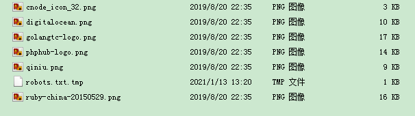

--

有时候有需要把看到的网站整个下载下来的需求。

有哪些方式可以做到？

# wget

wget可以。

这个简单而且强大。

一条可用的命令：

```
nohup wget -r -p -np -k  -S -N -nc -o 1.log https://xxx.com/ &
```

-r：递归下载。

-p：下载所有元素，图片之类。

-np：no parent的意思。不追溯至父目录。

-k：把链接转换成本地的。

-S：打印服务器响应。

-N：只获取比本地新的文件。这个就可以持续去拷贝，不要担心重复下载。

-nc：继续下载。不要覆盖。

-o：指定日志输出。


下载资源类的，例如WordPress搭建的图片网站。这种的效果不错。

但是下载论坛类的，例如php写的论坛，这种就效果非常差。

下载的东西就基本不可用。

的确，静态网站下载还好，动态网站真的很难解决。


我可以用我的2个网站来做测试。cnode和www。还有php写的bbs。也可以测试一下。

cnode是动态的，nodejs写的。

www是静态的，markdown渲染得到的，基于hexo。

需要指定一下代理。

## 常用选项

```
-U,  --user-agent=代理           标识自己为 <代理> 而不是 Wget/VERSION。
-e,  --execute=命令              运行一个“.wgetrc”风格的命令
-m to mirror the site
-D 留在这个domain内部。
-l,  --level=数字                最大递归深度 (inf 或 0 代表无限制，即全部下载)。
-t,  --tries=数字                设置重试次数为 <数字> (0 代表无限制)
-nd, --no-directories            不创建目录
-A,  --accept=列表               逗号分隔的可接受的扩展名列表
```

## 下载网站

```
wget -U Mozilla -m -k -D only4u.tech -np e robots=off "http://cnode.only4u.tech"
```

用这个命令把我的cnode下载下来。

是这个样子，基本不可用。对于动态网站的处理的确是很不好的。

这个从原理上就是无解的。

```
teddy@thinkpad:~/work/test/wget-test/cnode.only4u.tech$ tree -L 2
.
├── about
├── api
├── getstart
├── index.html
├── index.html?tab=all
├── index.html?tab=ask
├── index.html?tab=good
├── index.html?tab=job
├── index.html?tab=share
├── public
│   ├── images
│   ├── javascripts
│   ├── libs
│   └── stylesheets
├── robots.txt
├── rss
├── search_pass
├── signin
├── signup
├── topic
│   ├── 5ff3cb180f34163c70c4d63c
│   ├── 5ff3cb6c0f34163c70c4d641
│   ├── 5ff3cba00f34163c70c4d646
│   ├── 5ff3cc90da0b82c3daa50960
│   ├── 5ff3ccceda0b82c3daa50965
│   ├── 5ff3cd80da0b82c3daa5096a
│   ├── 5ff3ceabda0b82c3daa5098a
│   ├── 5ff3cef7da0b82c3daa50991
│   └── 5ff3cf4fda0b82c3daa50997
├── user
│   ├── baijuyi
│   ├── dufu
│   ├── libai
│   └── teddyxiong53
└── users
    └── top100
```

## 下载网站里的所有图片

```
wget -r -l 0 -t 1 -nd -D only4u.tech -A jpg,jpeg,gif,png "http://cnode.only4u.tech"
```

这样下载下来就是这样。



如果去掉-nd选项，那么就会创建目录。目录结构是这样：

```
teddy@thinkpad:~/work/test/wget-test/cnode.only4u.tech$ tree
.
├── public
│   └── images
│       ├── cnode_icon_32.png
│       ├── digitalocean.png
│       ├── golangtc-logo.png
│       ├── phphub-logo.png
│       ├── qiniu.png
│       └── ruby-china-20150529.png
└── robots.txt.tmp
```

然后配合find来删除一些很小的缩略图，就可以得到自己想要的图片了。


# httrack

这个有图形界面。也有命令行工具。

但是我觉得不值得尝试了。

# idm


# offline explorer


# teleport pro


# webzip

webzip太长时间不更新，而且只能机械的copy下html，不能自动修改其中链接指向，于是选择了功能强大的Offline Explorer。


参考资料

1、

https://superuser.com/questions/14403/how-can-i-download-an-entire-website

2、Wget: download whole or parts of websites with ease

https://linuxreviews.org/Wget:_download_whole_or_parts_of_websites_with_ease

3、一些wget脚本

https://www.krazyworks.com/wget-examples-and-scripts/