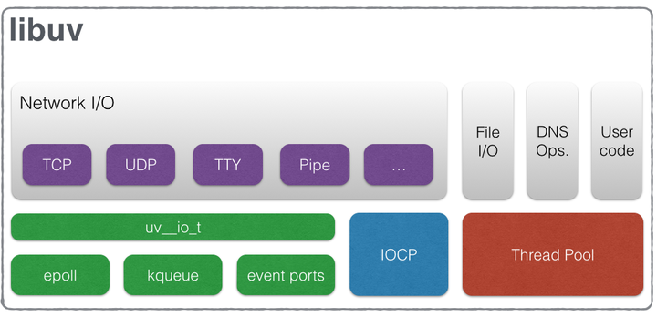
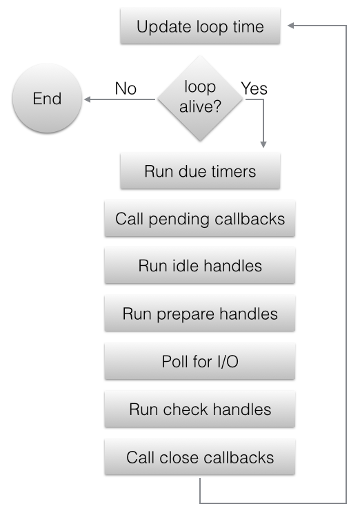

--

# 简介

libuv是一个高性能的、事件驱动的io库。

提供了跨平台的api。

libuv是封装了iocp和libev。

**nodejs的底层就用了libuv。**

libuv的核心工作就是提供一个eventloop。


系统编程里最经常处理的是输入和输出，而不是数据处理（这个一般是应用编程的工作）。

现在的os都提供了事件通知机制。

```
#include <stdio.h>
#include <uv.h>
#include <stdlib.h>

int main(int argc, char const *argv[])
{
    uv_loop_t *loop = malloc(sizeof(uv_loop_t));
    uv_loop_init(loop);
    uv_run(loop, UV_RUN_DEFAULT);
    uv_loop_close(loop);
    free(loop);
    return 0;
}
```


什么情况下需要用libuv？

你需要一个EventLoop的时候。

# 代码分析

```
UV_LOOP_PRIVATE_FIELDS
```

这样来把私有成员来隐藏。也是一个不错的手段。




单以 Linux 平台来看，libuv 主要工作可以简单划为两部分：

- 围绕 epoll，处理那些被 epoll 支持的 IO 操作
- 线程池（Thread pool），处理那些不被 epoll 支持的 IO 操作


为了追本溯源，我们将从 epoll 开始

简单来说，epoll 是由 Linux 内核提供的一个系统调用（system call），我们的应用程序可以通过它：

- 告诉系统帮助我们同时监控多个文件描述符
- 当这其中的一个或者多个文件描述符的 I/O 可操作状态改变时，我们的应用程序会接收到来自系统的事件提示（event notification）


回到 epoll 中，水平触发和边缘触发作为原始含义的衍生，当然还是具有类似电子学领域中的含义

我们通过一个例子来理解，比如我们有一个 fd（File descriptor） 表示刚建立的客户端连接，随后客户端给我们发送了 5 bytes 的内容，

如果是水平触发：

- 我们的应用会被系统唤醒，因为 fd 此时状态变为了可读
- 我们从系统的缓冲区中读取 1 byte 的内容，并做了一些业务操作
- 进入到新的一次事件循环，等待系统下一次唤醒
- 系统继续唤醒我们的应用，因为缓冲区还有未读取的 4 bytes 内容

如果是边缘触发：

- 我们的应用会被系统唤醒，因为 fd 此时状态变为了可读
- 我们从系统的缓冲区中读取 1 byte 的内容，并做了一些业务操作
- 进入到新的一次事件循环，等待系统下一次唤醒
- 此时系统并不会唤醒我们的应用，直到下一次客户端发送了一些内容，比如发送了 2 bytes（因为直到下一次客户端发送了请求之前，fd 的状态并没有改变，所以在边缘触发下系统不会唤醒应用）
- 系统唤醒我们的应用，此时缓冲区有 6 bytes = (4 + 2) bytes


水平触发，因为已经是可读状态，所以它会一直触发，直到我们读完缓冲区，且系统缓冲区没有新的客户端发送的内容；

边缘触发对应的是**状态的变化**，每次有新的客户端发送内容，都会设置可读状态，因此只会在这个时机触发


==水平触发是 epoll 默认的触发模式，==

==并且 libuv 中使用的也是水平触发。==

在了解了水平触发和边缘触发的区别后，我们其实就可以猜测 libuv 使用水平触发而不是边缘触发背后的考量：

如果是边缘触发，在 epoll 的客观能力上，我们不被要求一次读取完缓冲区的内容（可以等到下一次客户端发送内容时继续读取）。

但是实际业务中，客户端此时很可能在等待我们的响应（可以结合 HTTP 协议理解），而我们还在等待客户端的下一次写入，因此会陷入死锁的逻辑。

由此一来，一次读取完缓冲区的内容几乎就成了边缘触发模式下的必选方式，这就不可避免的造成其他回调的等待时间变长，让 CPU 时间分配在各个回调之间显得不够均匀


==epoll 并不能够作用在所有的 IO 操作上，比如文件的读写操作，就无法享受到 epoll 的便利性==

所以 libuv 的工作可以大致概括为：

- 将各种操作系统上的类似 epoll 的系统调用（比如 Unix 上的 kqueue 和 Windows 上的 IOCP）抽象出统一的 API（内部 API）
- 对于可以利用系统调用的 IO 操作，优先使用统一后的 API
- ==对于不支持或者支持度不够的 IO 操作，使用线程池（Thread pool）的方式模拟出异步 API==
- 最后，将上面的细节封装在内部，对外提供统一的 API




单看流程图可能太抽象，下面是对应的 libuv 内部的实现 [完整内容](https://link.zhihu.com/?target=https%3A//github.com/libuv/libuv/blob/v1.x/src/unix/core.c%23L365)：

```text
int uv_run(uv_loop_t* loop, uv_run_mode mode) {
  int timeout;
  int r;
  int ran_pending;

  r = uv__loop_alive(loop);
  if (!r) uv__update_time(loop);

  // 是循环，没错了
  while (r != 0 && loop->stop_flag == 0) {
    uv__update_time(loop);
    // 处理 timer 队列
    uv__run_timers(loop);
    // 处理 pending 队列
    ran_pending = uv__run_pending(loop);
    // 处理 idle 队列
    uv__run_idle(loop);
    // 处理 prepare 队列
    uv__run_prepare(loop);

    // 执行 io_poll
    uv__io_poll(loop, timeout);
    uv__metrics_update_idle_time(loop);

    // 执行 check 队列
    uv__run_check(loop);
    // 执行 closing 队列
    uv__run_closing_handles(loop);

    r = uv__loop_alive(loop);
    if (mode == UV_RUN_ONCE || mode == UV_RUN_NOWAIT) break;
  }

  return r;
}
```

之所以各种形式的回调（比如 `setTimeout`）在优先级上会有差别，就在于它们使用的是不同的队列，而不同的队列在每次事件循环的迭代中的执行顺序不同


到目前为止，我们已经确认过 io_poll 内部实现确实是使用的 epoll。在本文的开头，我们也提到 epoll 目前并不能处理所有的 IO 操作，对于那些 epoll 不支持的 IO 操作，libuv 统一使用其内部的线程池来模拟出异步 IO。接下来我们看看线程池的大致工作形式


# File I/O

与网络 I/O 不同，libuv 没有可以依赖的特定于平台的文件 I/O 原语，因此当前的方法是在线程池中运行阻塞文件 I/O 操作。

有关跨平台文件 I/O 格局的详细说明，请查看[这篇文章](https://link.zhihu.com/?target=https%3A//blog.libtorrent.org/2012/10/asynchronous-disk-io/)。

libuv 当前使用一个全局线程池，所有循环都可以在其中排队工作。 当前在此池上运行 3 种类型的操作：

- File system operations
- DNS functions (getaddrinfo and getnameinfo)
- User specified code via `uv_queue_work()`


# 参考资料

1、Basics of libuv

http://luohaha.github.io/Chinese-uvbook/source/basics_of_libuv.html

2、Libuv 之 - 只看这篇是不够的

https://zhuanlan.zhihu.com/p/361303238