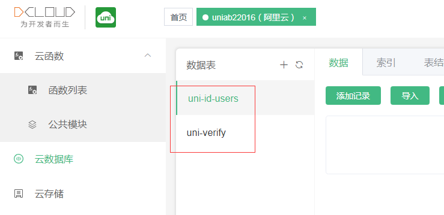
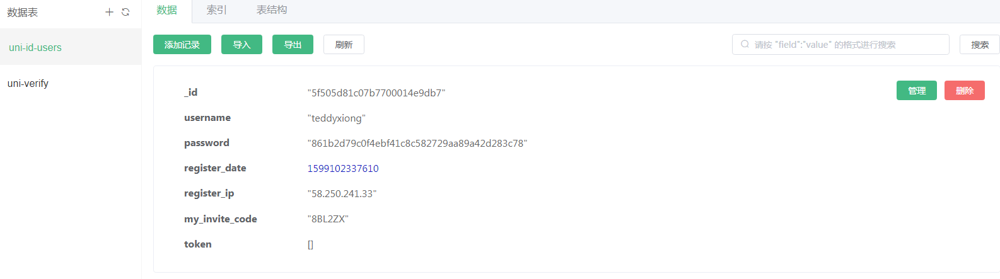
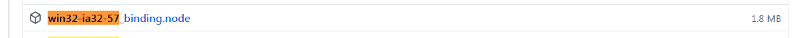

1

到这里下载app版本的hbuidlerx。

https://www.dcloud.io/hbuilderx.html

先创建一个hello uniapp项目。

这个就是一个比较完整的demo项目。

项目的配置文件是manifest.json。

用于指定应用的名称、图标、权限等。

需要申请一个项目对应的dcloud的appid。

在 HBuilderX 中创建项目时，HBuilderX 会自动联网生成 appid, 并将该 appid 保存在 manifest 文件中的 appid 字段；

登录 开发者中心 可以查看自己创建的应用列表。

到这个网址查看。

https://dev.dcloud.net.cn

dcloud的appi的用途

```
1、云打包。
	根据appid来判断用户是不是有权限进行打包。
2、数据统计。
3、广告。
4、统一推送。
```

进行快速测试，选择运行到chrome。可以看到效果。

DCloud于2012年开始研发小程序技术，优化webview的功能和性能，并加入W3C和HTML5中国产业联盟，推出了HBuilder开发工具，为后续产业化做准备。

为将该技术发扬光大，DCloud将技术标准捐献给工信部旗下的HTML5中国产业联盟，并推进各家流量巨头接入该标准，开展小程序业务。

传统的h5只有1端，即浏览器。而uni-app可跨多端，虽仍属前端，与传统h5有不同。

以前是.html文件，开发也是html，运行也是html。
现在是.vue文件，开发是vue，经过编译后，运行时已经变成了js文件。
现代前端开发，很少直接使用HTML，基本都是开发、编译、运行。所以uni-app有编译器、运行时的概念。

以前一个html大节点，里面有script和style节点；

现在template是一级节点，用于写tag组件，script和style是并列的一级节点，也就是有3个一级节点。

uni-app参考小程序规范，提供了一批内置组件。

js的变化，分为运行环境变化、数据绑定模式变化、api变化3部分。

标准js语法和api都支持，比如if、for、settimeout、indexOf等。

但浏览器专用的window、document、navigator、location对象，包括cookie等存储，只有在浏览器中才有，app和小程序都不支持。

现在前端趋势是去dom化，改用mvvm模式，更简洁的写法，大幅减少代码行数，同时差量渲染性能更好。

uni-app使用vue的数据绑定方式解决js和dom界面交互的问题。

小程序的数据绑定参考了vue，但自己修改了一些。在uni-app中只支持标准的vue，不支持小程序的数据绑定语法

每个可显示的页面，都必须在 pages.json 中注册。如果你开发过小程序，那么pages.json类似app.json。如果你熟悉vue，这里没有vue的路由，都是在pages.json里管理。

原来工程的首页一般是index.html或default.html，是在web server里配的。而uni-app的首页，是在pages.json里配的，page节点下第一个页面就是首页。一般在/pages/xx的目录下。

app和小程序中，为了提升体验，页面提供了原生的导航栏和底部tabbar，注意这些配置是在pages.json中做，而不是在vue页面里创建，但点击事件的监听在显示的vue页面中做。

DCloud与vue合作，在vue.js官网提供了免费视频教程，也可以直达教程地址：https://learning.dcloud.io

不需要专门去学习小程序的语法，uni-app使用的是vue的语法，不是小程序自定义的语法。


为了实现多端兼容，综合考虑编译速度、运行性能等因素，uni-app 约定了如下开发规范：


支持了类似C语言的条件编译。是写在注释里的。

```
// #ifdef  %PLATFORM%
平台特有的API实现
// #endif
```

定义在 App.vue 中的样式为全局样式，作用于每一个页面。在 pages 目录下 的 vue 文件中定义的样式为局部样式，只作用在对应的页面，并会覆盖 App.vue 中相同的选择器。

rpx 是相对于基准宽度的单位，可以根据屏幕宽度进行自适应。**uni-app 规定屏幕基准宽度 750rpx。**


**vue文件走的webview渲染**
**nvue走weex方式的原生渲染**


在 uni-app 中，nvue 和 vue 页面可以混搭使用。

虽然nvue也可以多端编译，输出H5和小程序，但nvue的css写法受限，所以如果你不开发App，那么不需要使用nvue。


```
$mount()手动挂载
当Vue实例没有el属性时，则该实例尚没有挂载到某个dom中；
假如需要延迟挂载，可以在之后手动调用vm.$mount()方法来挂载。例如：
```


头像加口罩这个例子。广告就是切换一个页面就引导你去关注一个公众号。
还有里面悬浮条广告。


当同时存在页面 a.vue 和 a.nvue 时， 

在 pages.json 中设置 app-plus 配置，**编译成 app 时优先使用 a.nvue 页面**，

且 app-plus 二级页面配置中只有 titleNView 有作用，

pullToRefresh 、scrollIndicator、bounce 设置后都无效，

如果去掉 a.nvue 页面，则在 a.vue 页面以上效果都有效


pages的配置。在pages.json里，按一下F1，就可以打开下面这个连接。

https://uniapp.dcloud.io/collocation/pages

pages.json 文件用来对 uni-app 进行全局配置，决定页面文件的路径、窗口样式、**原生的导航栏、底部的原生tabbar 等。**


看了一下视频教程。可以帮助快速抓住重点。

原生的导航栏、底部的原生tabbar


当navigationStyle设为custom或titleNView设为false时，原生导航栏不显示

app-plus
配置编译到 App 平台时的特定样式，部分常用配置 H5 平台也支持。


找一些简单实用的uniapp项目来看看。

头像加口罩，这个小程序，实际使用已经不行了。

界面也比较杂。不适合学习。

还是在uniapp官网找。

官方示例就2个，一个就是那个hello的对所有组件的展示的项目。

还有一个是nvue的案例。

这个是案例汇总。

https://uniapp.dcloud.io/casecode

这里是一个登陆模板。

https://github.com/dcloudio/uni-template-login

本地运行这个登陆看看。

服务端基于 uniCloud 实现，用户管理基于 [uni-id](https://uniapp.dcloud.net.cn/uniCloud/uni-id) 实现

支持裂变，可以邀请用户注册

还使用了云开发。

现在在hbuilder里运行，点击注册，会报错。

需要到cloudfunctions目录下，打开db_init.json文件，在文件里，右键，选择初始化云数据库。

然后会提示阿里云数据库获取失败，需要修改manifest.json里的appid。

点击重新获取。

获取成功后，再打开db_init.json文件，在文件里，右键，选择初始化云数据库。

成功后，打开dcloud的云端控制台。

https://unicloud.dcloud.net.cn

可以看到多了2个数据表。



然后我们再进行注册看看。

还是不行，应该是还需要创建对应的注册云函数才行。

默认云函数是有的，直接在cloudfunctions上右键，选择上传所有云函数。

然后再进行注册就可以成功了。

在云端就可以看到注册的用户的数据了



这个模板的代码和界面都比较简单，适合做入门学习。

关键是dcloud提供的登陆相关接口。

在云函数里进行调用。


框架本身是基于vue的，与vue和微信小程序很相似，会这两个技术的同胞，入手应该没有难度。

框架本身有一个App.vue文件，其中有一个onLaunch方法，是应用的生命周期。

正常打开应用首页，先执行应用的生命周期onLaunch，再执行页面的生命周期onLoad。

但是，如果在onLaunch中，使用到了异步请求，且请求的结果（res）在页面中有使用到，则会出现页面onLoad中调用res时，请求还未得到res值，res值为空。

询问官方，得到的回复是，使用vuex，监听res值更新，更新后页面再去获取res值。根据官方回答，做出的解决方案：

这个是一个新闻资讯的demo。

https://github.com/dcloudio/uni-template-news

看起来像今日头条。

但是页面逻辑很简单。

新闻数据是从这里请求的demo数据。

https://unidemo.dcloud.net.cn/api/news


uni-app是逻辑和渲染分离的，渲染层在app端提供了两套排版引擎。

 小程序方式的webview渲染，和weex方式的原生渲染，两种渲染引擎可以自己根据需要选。

 **vue文件走的webview渲染**

 **nvue走weex方式的原生渲染**

组件和js写法是一样的，css不一样，原生排版的能用的css必须是flex布局

`uni-app`的App端内置了一个基于weex改进的原生渲染引擎，提供了原生渲染能力。

在App端，如果使用vue页面，则使用webview渲染；

如果使用nvue页面(native vue的缩写)，则使用原生渲染。

一个App中可以同时使用两种页面，比如首页使用nvue，二级页使用vue页面，hello uni-app示例就是如此。

虽然nvue也可以多端编译，输出H5和小程序，但nvue的css写法受限，所以如果你不开发App，那么不需要使用nvue。

uinapp的帮助做得很好，直接在hbuilder里按F1就可以打开对应的帮助网页。非常方便。

这里有项目列表。

https://github.com/aben1188/awesome-uni-app/blob/master/README.md

要直接连着手机调试，还需要安装微信开发工具。

但是hbuilder实在做得很贴心了。直接在弹窗里把微信开发工具的下载连接都给出来了。

在手机上运行。

```
// #ifdef APP-PLUS
console.log("xhl -- app plus")//这个分支会进去。
// #endif
// #ifdef APP-NVUE
console.log("xhl -- app nvue")//这个分支不会。
// #endif
```

我就当weex不存在就好了。

不行，下面的代码还是生效的。

```
	// #ifdef APP-PLUS
	const dom = weex.requireModule('dom');
	// #endif
```

小程序和App的vue页面，主体是webview渲染的。

为了提升性能，小程序和App的vue页面下部分ui元素，

比如导航栏、tabbar、video、map使用了原生控件（详见: [原生组件使用说明](https://uniapp.dcloud.io/component/native-component)）。

这种方式被称为混合渲染。**虽然提升了性能，但原生组件带来了其他问题**：

1. 前端组件**无法覆盖原生控件的层级问题**。
2. 原生组件**不能嵌入特殊前端组件**(如scroll-view，swiper)。
3. 原生控件无法灵活自定义。
4. 无法对原生组件设置 CSS 动画
5. 无法定义原生组件为 position: fixed；
6. 不能在父级节点使用 overflow: hidden 来裁剪原生组件的显示区域。

为了解决webview渲染中原生组件层级最高的限制，

uni-app提供了 cover-view 和 cover-image 组件，

让其覆盖在原生组件上。

App端还提供了2种方案：plus.nativeObj.view、subNVue

**此外app-nvue 不涉及层级问题，天然所有组件都是同层渲染。**因此有如下方法解决层级覆盖问题:

1. cover-view：只能覆盖原生组件，不能覆盖其他原生界面元素。比如cover-view可以覆盖video、map，但无法覆盖原生导航栏、tabbar、web-view。
2. plus.nativeObj.view：简称nview，它是一个原生的类画布的控件，其实cover-view也是用plus.nativeObj.view封装的。详见: [API文档](https://www.html5plus.org/doc/zh_cn/nativeobj.html#plus.nativeObj.View)， 它的api很底层，开发比较复杂；不支持动画；不支持内部滚动。
3. subNVue：subNVue是把weex渲染的原生子窗体，覆盖在vue页面上，它解决了plus.nativeObj.view的所有不足，提供了最强大的层级问题解决方案。

在手机上运行。

```
// #ifdef APP-NVUE
console.log("xhl -- app nvue")
// #endif
// #ifdef APP-PLUS
console.log("xhl -- app plus")
// #endif
// #ifdef APP-PLUS-NVUE
console.log("xhl -- app plus nvue")
// #endif
// #ifdef APP-VUE
console.log("xhl -- app vue")
// #endif
```

打印。

```
xhl -- app plus at App.vue:9
xhl -- app vue at App.vue:15
```

但是这个项目里，大部分代码是nvue的。

应该是在vue文件里，APP-NVUE 是没有定义的。而在nvue文件里，APP-NVUE是定义了的。


这一年，小程序在用户规模及商业化方面都取得了极大的成功。微信小程序日活超过3亿，支付宝、百度、字节跳动小程序的月活也纷纷超过3亿。

对应小程序开发领域，这一年也发生了巨大变化。开发框架从单纯的微信小程序开发，过渡到多端框架成为标配，进一步提升开发效率成为开发者的强烈需求。

这一年 `mpvue` 停止更新，`Taro`开始探索 `taro next`，`uni-app` 产品和生态持续完善，微信新推出了支持H5和微信小程序的 `kbone` 框架...

跨端框架是一个重投入工作，在各框架的1年多的比拼中，很多框架因为投入不足而逐渐被开发者放弃，`uni-app`和`taro`依靠持续的大力度投入，成为了市场主流。

`kbone` 框架虽面世不久，但毕竟是微信官方发布，关注的人不少，故本次将 `kbone` 加入评测目标。

taro，京东凹凸实验室出品

`taro` 和 `uni-app` 是比较典型的多端框架，发布到各个端均可。而 `kbone` 只支持微信小程序和H5。

- uni-app：支持[条件编译](https://uniapp.dcloud.io/platform)，可在条件编译代码块中，随意调用各个平台新增的API及组件

我们继续沿用去年的测试模型，看看一年来，各家小程序开发框架的性能是否有提升。详细如下：

- 开发内容：开发一个仿微博小程序首页的复杂长列表，支持下拉刷新、上拉翻页、点赞。

测试代码在这里。

https://github.com/dcloudio/test-framework

我们以上述仿微博小程序为例，测试2个容易出性能问题的点：长列表加载、大量点赞组件的响应。

跨端开发，离不开条件编译。因为不能用统一来抹杀各个平台的特色。

因此，跨端的 serverless 方案才是开发者的最优解。

小程序是继原生和H5后第三大阵营。

如果是个人产品我强烈建议用uniapp，如果是公司产品看公司的要求吧，要求比较高的就不适合，尤其是产品和UI喜欢跟你扯的时候。


**以往的 weex** ，有个很大的问题是它**只是一个高性能的渲染器**，

**没有足够的API能力**（比如各种push sdk集成、蓝牙等能力调用），

使得开发时非常依赖原生工程师协作，

开发者本来想节约成本，结果需要前端、iOS、Android 3拨人开发，适得其反。 

nvue 解决了这个问题，**让前端工程师可以直接开发完整 App**，并提供丰富的[插件生态](https://ext.dcloud.net.cn/)和云打包。这些组合方案，帮助开发者切实的提高效率、降低成本。

同时uni-app扩展了weex原生渲染引擎的很多排版能力，修复了很多bug。

nvue的组件和API写法与vue页面一致，其内置组件还比vue页面内置组件增加了更多，[详见](https://uniapp.dcloud.io/component/list)。但nvue在css的写法限制较多

启用纯原生渲染模式，可以减少App端的包体积、减少使用时的内存占用。因为webview渲染模式的相关模块将被移除。

推荐使用`uni.$on`,`uni.$emit`的方式进行页面通讯，旧的通讯方式（`uni.postMessage`及`plus.webview.postMessageToUniNView`）不再推荐使用。

除了通信事件，vue 和 nvue 页面之间还可以共享变量和存储。

小程序有globalData机制，这套机制在uni-app里也可以使用，全端通用。

nvue的限制是：css有限制、动画性能不好。

小程序及 H5 等平台是没有 HTML5+ 扩展规范的，因此在 `uni-app` 调用 HTML5+ 的扩展规范时，需要注意使用条件编译。否则运行到h5、小程序等平台会出现 `plus is not defined`错误。

条件编译是利用注释实现的，在不同语法里注释写法不一样，js使用 `// 注释`、css 使用 `/* 注释 */`、vue/nvue 模板里使用 `<!-- 注释 -->`；

为提升开发效率，HBuilderX将 `uni-app` 常用代码封装成了以 `u` 开头的代码块，如在 `template` 标签内输入 `ulist` 回车，会自动生成如下代码


现在我并不关注复杂的页面布局，我只需要简单的布局就好了。

参考这个，用3个按键实现录音和播放功能。

https://uniapp.dcloud.io/api/media/record-manager

这里有很多新冠相关的app。都是开源的。可以直接部署使用的。
https://gitee.com/dcloud/xinguan2020

https://dcloud.io/ncp.html

下载这个出入人员登记系统。

https://gitee.com/dcloud/xinguan2020-alien-registration

按照readme里的说明进行配置。使用了云开发。

默认的登陆名和密码是：admin和123456


运行出入人员登记系统。

会报错。

```
16:11:45.215 Error: Module build failed (from ./node_modules/sass-loader/dist/cjs.js):
16:11:45.234 Error: Cannot find module 'D:\Downloads\HBuilderX.2.8.8.20200820.full\HBuilderX\plugins\compile-node-sass\node_modules\node-sass-china'
16:11:45.253 at Function.Module._resolveFilename (module.js:547:15)
```

是需要自己手动安装这个插件。compile-node-sass

这个在插件市场是找不到的。

查看版本。

```
D:\Downloads\HBuilderX.2.8.8.20200820.full\HBuilderX\plugins\node
λ  .\node.exe -p "[process.platform, process.arch, process.versions.modules].join('-')"
win32-ia32-57
```

到这里下载符合的版本。

https://github.com/sass/node-sass/releases

下载这个。



下载后，改名为binding.node，放到D:\Downloads\HBuilderX.2.8.8.20200820.full\HBuilderX\plugins\compile-node-sass\node_modules\node-sass-china 这个目录下。

放进去还是不行。

这次提示比较清楚了。

```
16:26:56.151 预编译器错误：代码使用了scss/sass语言，但未安装相应的编译器插件，请前往插件市场安装该插件:
16:26:56.160 https://ext.dcloud.net.cn/plugin?name=compile-node-sass at components\uni-icons\uni-icons.vue:1
```

插件市场里还是有这个插件的。

https://ext.dcloud.net.cn/plugin?name=compile-node-sass

下载zip文件，然后解压放到plugins目录下。

要把文件夹的名字从compile-node-sass_0.0.3改成compile-node-sass。

然后就可以编译了。

运行后，正常情况应该在我的这个tab下面，出现一个二维码。

让其他人扫描这个二维码就可以进行登记操作。

但是现在我手机上运行并没有出现。在内置浏览器运行可以出现二维码，但是扫描打不开。

先不管。目前基本功能是正常的。

```
Vue.prototype.$cloud = uniCloud
```


这个是H5应用。需要开通云端托管，也是免费。测试一下。

是查询新冠肺炎疫情形势的。

https://ext.dcloud.net.cn/plugin?id=1284

上传完了，会打印访问地址：

https://static-0331bc48-72c7-4332-bd5c-cd490ea195a7.bspapp.com

需要在url后面加上plague_query/index.html才能访问到。

但是这个完全就只是一个网页而已。


参考资料

1、官网资料

https://uniapp.dcloud.io/

2、

https://ask.dcloud.net.cn/article/35657

3、

https://uniapp.dcloud.io/frame?id=%e7%9b%ae%e5%bd%95%e7%bb%93%e6%9e%84

4、mpvue项目（组件）迁移指南、示例及资源汇总

https://ask.dcloud.net.cn/article/34945

5、uniapp中nvue与vue的区别

https://www.jianshu.com/p/6705eeb8eb3a

6、uni-app之nvue的使用详解

https://blog.csdn.net/Microsoft_GuangYing/article/details/102487682

7、把已经写好的Vue项目转成uni-app项目

https://blog.csdn.net/a519637560/article/details/86236410

8、vue和nvue通信

https://uniapp.dcloud.io/use-weex?id=nvue-%e5%90%91-vue-%e9%80%9a%e8%ae%af