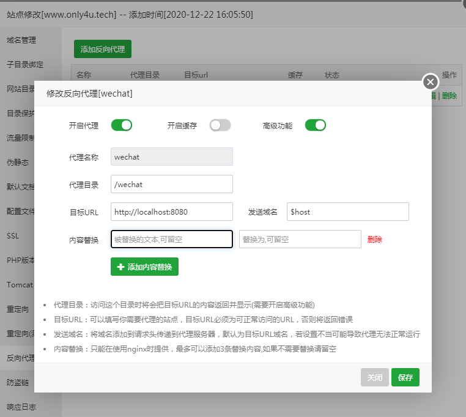
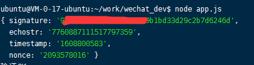
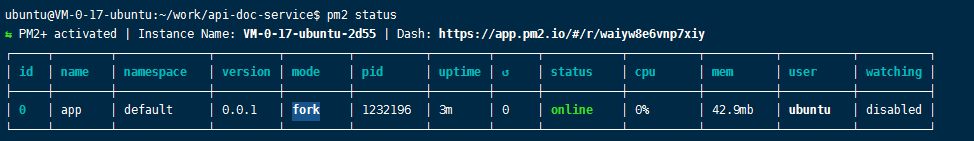
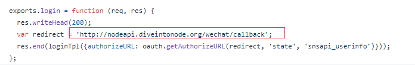

1

代码持续提交到：https://github.com/teddyxiong53/wechat_dyh

打算基于express来做。

现在有服务器，有域名，可以认真搞一下了。

先验证服务器和域名的。

# 验证

在服务器上，新建wechat_dev目录，下面放一个app.js。

内容如下：

```
var express = require('express')

const {createHash}= require('crypto');

 encrypt = (algorithm, content) => {
  let hash = createHash(algorithm)
  hash.update(content)
  return hash.digest('hex')
}

const sha1 = (content) => encrypt('sha1', content)


var app = express()

app.get('*', function(req, res) {
    console.log(req.query)
    var token = "xxx" // 填入你的token
    var signature = req.query.signature
    var nonce = req.query.nonce
    var timestamp = req.query.timestamp
    var echostr = req.query.echostr
    var str = [token, timestamp, nonce].sort().join('')
    var sha = sha1(str)
    if(sha === signature) {
        res.send(echostr+'')
        console.log('验证OK')
    } else {
        console.log('验证不对')
    }
})

app.listen(8080)
```

安装依赖。

```
npm install --save express
```

现在需要配置nginx，加一下转发规则。

把/wechat这个url下的东西转发过来。

我的nginx是在宝塔面板下配置的。所以都从宝塔面板下面来操作。保证操作的一致性和可复制性。


用nginx作为反向代理，转发请求给node服务。

宝塔中这个很容易实现。点击网站的设置。选择反向代理，增加一个反向代理。

设置如下：



微信公众平台点击验证，可以看到验证成功了。



参考StuQ《Node.js微信开发》来做。

首先，我想要把图灵机器人对接进来。


# 接入图灵机器人

前面的验证代码，就放着不动了。

其实流程还是很清晰的：

1、服务器收到微信发来的xml数据。

2、解析xml数据。提取问题部分。

3、把问题发送给图灵服务器。

4、收到图灵服务器的回复。

5、把回复组织成xml回复给微信服务器。

6、最后用户微信收到内容。


发现图灵机器人需要认证才能继续用。算了。放弃。

# 原样回复

这个可以验证消息的解析和生成。

依赖这2个库。

```
npm install -s  body-parser body-parser-xml
```

代码

```
var express = require('express')
const bodyParser = require("body-parser");
require("body-parser-xml")(bodyParser);

var app = express()

app.use(bodyParser.xml({
    limit: "1MB",
    xmlParseOptions: {
      normalize: true,
      normalizeTags: true,
      explicitArray: false
    },
    verify: function(req, res, buf, encoding) {
      if (buf && buf.length) {
        req.rawBody = buf.toString(encoding || "utf8");
      }
    }
  }));

app.post('/wechat', function(req, res) {
    res.writeHead(200, {'Content-Type': 'application/xml'})
    // console.log(req.body.xml)

    var data = req.body.xml
    var resMsg = '<xml>' +
    '<ToUserName><![CDATA[' + data.fromusername + ']]></ToUserName>' +
    '<FromUserName><![CDATA[' + data.tousername + ']]></FromUserName>' +
    '<CreateTime>' + parseInt(new Date().valueOf() / 1000) + '</CreateTime>' +
    '<MsgType><![CDATA[text]]></MsgType>' +
    '<Content><![CDATA['+data.content+']]></Content>' +
    '</xml>';
    res.end(resMsg);

})
app.listen(8080)
```

可以原样回复。

# easywechat

看网上微信后台开发，nodejs没有特别好的。都是多年不维护的trival项目。

php的easywechat反而是比较热门的。

我看看。

这个估计内容比较多，我另外开一篇文章来记录。

研究了一下，发现我要补的php知识太多。坑太深。不用这个了。


# co-wechat-api

文档在这。

https://doxmate.cool/node-webot/co-wechat-api/api.html

这个是基于nodejs的。就用这个试一下。

微信公共平台Node库API，ES6版本

作者给了一个示例，就是自动回复api文档查询的。

https://github.com/JacksonTian/api-doc-service

我可以先把这个部署一下看看效果。

下载代码到服务器上。

copy `config.template.js` to `config.js`.

去掉里面corp相关的配置，把我的订阅号的信息填入进去。

运行，报错。

是需要手动新建logs目录。

再运行，没有保存，但是也直接退出了。

这个是因为需要用pm2来运行。

安装pm2

```
npm i pm2 -g
```

启动

```
pm2 start app.js
```

查看状态

```
pm2 status 
```



但是现在不能正常访问。

这个还是需要企业号相关的信息吧。

现在log/access.log没有任何东西。

给我的订阅号发送消息，提示是服务端故障。

仔细看代码，这里面用到的服务也已经不能用了。



只能看看代码分析一下思路了。

# wexin-robot

微信机器人，这个是比较实用的了。

豆瓣同城这个正常运行的公众号就是基于这个搭建的。效果不错。

代码在这里。

https://github.com/node-webot/weixin-robot

这个部署很顺利。

```
npm i -s weixin-robot
```

然后把github里readme的实例代码拷贝到app.js里。

只需要改一下token和端口号就可以在我的服务器上正常运行。

估计验证等行为被封装到里面了。

不需要配置我的appid之类的吗？

weixin-robot 是 webot 和 wechat-mp 的 高级包装。webot 负责定义回复规则，wechat-mp 负责与微信服务器通信。


weixin-robot只有一个js文件。

代码不多。100行左右。

## wechat-mp

这个是负责跟微信服务器通信的组件。也就2个文件。

做了这些事情：

校验签名，接受并解析微信消息，处理回复内容为 XML ，并回复给微信。

这个模块是作为connect、express框架的中间件使用的。

```
var mp = require('wechat-mp')("xx")//xx is token
var express = require('express')
app = express()

app.use('/wechat', mp.start())
app.post('/wechat', function(req, res, next) {
  console.log(req.body)
  res.body = {
    msgType: 'text',
    content: 'hi'
  }
  next()
}, mp.end())
```

mp.start

开始，解析微信消息，把内容放入到req.body里。

mp.end

把js对象转成xml消息。

代码里是这样的

```
Wechat.prototype.start =
Wechat.prototype.parser = function bodyParser(opts) {

Wechat.prototype.end =
Wechat.prototype.responder = function responder() {
```

## webot

最简单的例子。

```
var express = require('express')
var webot = require('webot')

var app = express()
webot.set('hi', 'hello ')//收到hi，就回复hello
webot.set('subscribe', {
  pattern: function(info) {
    return info.event === 'subscribe'
  },
  handler: function(info) {
    return '感谢订阅'
  }
})
app.get('/webot', function(req, res, next) {
  var message = req.query.message
  webot.reply({
    text: message,
  }, function(err, info) {
    //回复完成时的回调
    if(err) {
      return res.json({
        r:err
      })
      res.json({
        r:0,
        reply: info.reply
      })
    }
  })
})
```

这个不能直接运行，因为没有对xml进行解析和生成。

这个有几个js文件，因为处理的内容复杂一些。

## webot-douban-event

https://github.com/node-webot/webot-douban-event

这个是豆瓣同城的代码。

这个代码需要吃透。

先部署测试一下。

需要修改conf/index.js里的配置。

需要申请豆瓣的api key。但是豆瓣已经关闭申请了。

所以只能看看代码了。

这个代码有年头了。2012年写的了。

看一下提交log。

规则文件是用txt写的。

大概是这个样子的。

```
/^你妹/
家妹十分安好，请勿挂念 or
我妹，妹妹，妹妹，咩咩咩...
```

属于人工智障。

把代码读懂。

然后可以根据情况来推送一篇我的网站文章。

代码确实比较老，mongodb都是自己扩展Model的。

模板引擎是jade。

## webot-example

https://github.com/node-webot/webot-example

这个是有些内容，又不至于太复杂的例子。

可以在这个基础上改。

这个代码也比较老，我改写一下。

这个的基本功能都是具备的。

我基于这个代码来写我的

我感觉效果还可以。

# 运营思路

现在就用webot来做服务端。已经基本功能跑起来了。

先暂时不做菜单项。

都通过文字交互来做。

后面可以做几个菜单项作为快捷方式。

# 高德地图

通过微信发送位置，实际上是发送了一个坐标信息。

通过高德的web api，可以获取到城市等信息。

api在这里，

https://restapi.amap.com/v3/geocode/geo?parameters

get请求，参数跟在后面。

```

```


https://lbs.amap.com/api/webservice/guide/api/georegeo


收到消息，

```
webot.watch(app, {path:'/wechat', token:'xx'})
```

实际上是：

```
app.use('/wechat', function parser(opts) {
	//...
	return function(req, res, next) {
		//如果已经设置了，直接next
		//否则检查签名
			如果签名不过，
				res.statusCode = 401
				return res.end('Invalid signature')
			如果是get
				return res.end(req.query.echostr)
			如果是head
				return res.end()
			把数据一段段收取下来。
			req.on('data')和req.on('end')
			生成一个sessionid。
			next()
		
	}
})
```

然后是交给self.middleware()

```
middleware = function() {
	return function(req, res, next) {
		var info = Info(req.body)//构造一个info对象。
		info有
			sessionId
			type
			wait
			rewait
			resolve
			webot
			session
			这属性。
			
		info.req = req
		info.res = res
		info.session = session
		调用自己的reply函数，在reply的回调里，调用next。
	}
}
```


# 作为京东cookie提交渠道

这个需求其实很简单。

就是收到cookie，进行一些检查，然后把文本插入到指定的文件里去。

在最基本的echo的例子基础上改。


# 参考资料

1、宝塔Linux面板使用Nginx反向代理Node.js服务器

https://blog.lakehani.com/?id=17

2、

https://i5ting.github.io/wechat-dev-with-nodejs/wechat/api.html

3、实现微信公众号聊天机器人，自动回复——nodejs+图灵机器人

https://blog.csdn.net/vipdatoucth/article/details/79621029