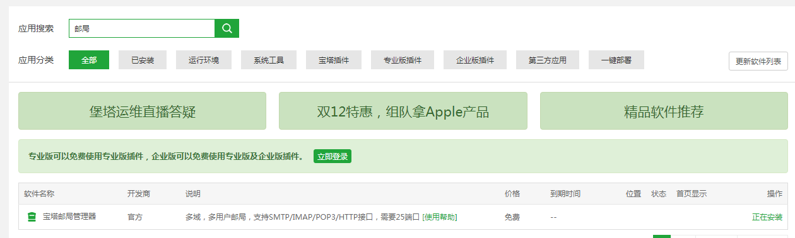
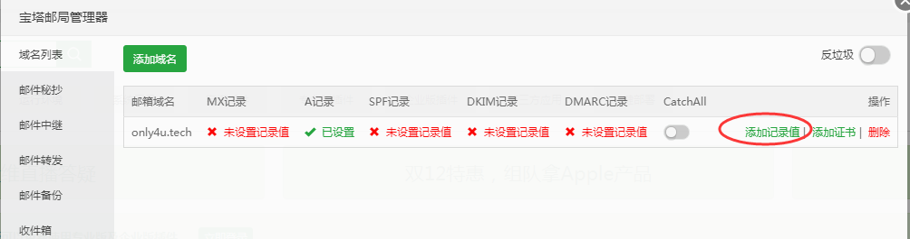
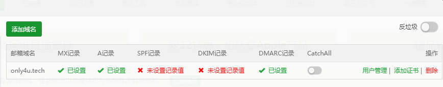

1

尽量用docker来搭建，保证快速安装和避免环境导致的问题。

目前ExtMail重点面向国内中小企业，是0成本自建企业邮箱的最佳解决方案。

由于ExtMail 较符合国内用户的使用习惯，提供本土化的论坛/QQ群等技术支持，

满足稳定收发和基本管理的需求，受到社区和商业用户的欢迎。

```
 sudo docker pull palidin/extmail
```

```
sudo docker run -itd  --name extmail_demo  -p 80:80 -p 110:110 -p 25:25 -p 143:143 palidin/extmail:latest
```

启动成功。我们可以访问：

only4u.tech这个网址，就可以看到管理界面了。

```
POP3 / SMTP configuration
POP3 :  pop3.only4u.tech
SMTP :  smtp.only4u.tech
```

感觉界面挺简陋的。

而且点击注册提示数据库错误。

这个不行。

ewomail这个是更主流的。

```
docker pull bestwu/ewomail
```


```
docker run  -d -h mail.only4u.tech --restart=always \
-p 25:25 \
-p 109:109 \
-p 110:110 \
-p 143:143 \
-p 465:465 \
-p 587:587 \
-p 993:993 \
-p 995:995  \
-p 80:80 \
-p 8080:8080 \
-v `pwd`/mysql/:/ewomail/mysql/data/ \
-v `pwd`/vmail/:/ewomail/mail/ \
-v `pwd`/ssl/certs/:/etc/ssl/certs/ \
-v `pwd`/ssl/private/:/etc/ssl/private/ \
-v `pwd`/rainloop:/ewomail/www/rainloop/data \
-v `pwd`/ssl/dkim/:/ewomail/dkim/ \
--name ewomail bestwu/ewomail
```

上面的命令执行后，在当前目录下生成了目录。

```
root@VM-0-17-ubuntu:~# tree -L 1
.
├── mysql
├── rainloop
├── ssl
└── vmail
```

[http://ip:8080](http://ip:8080/) 管理界面 默认账号：admin 密码：ewomail123

[http://ip:80](http://ip/) 邮件web界面

登陆进来后，把密码修改了。


但是收发邮件都没有成功。

那这个就没有什么用了。

需要申请开通25号端口。挺麻烦的。我只是玩一下而已。

# 用宝塔面板来安装

在宝塔里搜索“邮局”，可以找到宝塔邮局管理器。点击安装。



然后到域名解析那里。

添加一条A记录。mail.only4u.tech。

然后回到宝塔面板，点击邮局管理的设置。

先添加一个域名。可以看到有几个红叉。需要点击后面的添加记录值。



然后的弹窗会告诉你怎么设置。设置完之后，是这样。



然后点击用户管理。添加用户。

先添加一个admin用户。密码需要有大写字母。

```
POP服务【服务地址： mail.only4u.tech 、端口： 110 】
IMAP服务【服务地址： mail.only4u.tech 、端口： 143 】
SMTP服务【服务地址： mail.only4u.tech 、端口： 25 】
```

从后台日志看，这个是基于postfix的。

测试邮件收发都是可以的。

这样自己用邮箱就可以很随意了。

但是foxmail添加不成功。

需要在域名那里添加2条cname记录。

pop3和smtp的。都执行mail.only4u.tech。

现在可以在foxmail里添加成功了。


参考资料

1、在docker搭建自己的邮件服务器

https://www.jianshu.com/p/d94b9495f7f9

2、Docker 安装 MySQL

https://www.runoob.com/docker/docker-install-mysql.html

3、

https://www.cnblogs.com/Wuser/p/12249825.html

4、使用宝塔邮局管理器搭建私人邮局实现收发邮件功能

https://www.pieruo.com/12409.html