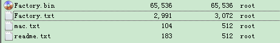

1

这个刷机好了。看到里面有不是的概念，我不是很清楚，梳理一下。

# K2 基本情况

breed 中可以看到*斐讯K2* 配置，*内存*RAM 容量为64M，*Flash* ROM 容量为8M，配置很一般。 


# padavan基本情况

是基于华硕的RT-N56U的改的。

http://detail.zol.com.cn/wireless_router/index234089.shtml

代码：

https://github.com/hanwckf/rt-n56u

使用的Linux内核是3.4.x的。

libc是uclibc。

https://github.com/gorden5566/padavan

padavan 是一个优秀的路由器固件，支持采用 RT3883/MT7620/MT7621/MT7628 等系列 CPU 的路由器

这个就是最原始的代码。

https://bitbucket.org/padavan/

这个固件也叫老毛子。是俄罗斯人基于华硕固件开发的。

padavan，和另外一个固件 merlin梅林，都是基于 华硕的官方固件（Asuswrt）来开发的


  **为何华硕固件开源？**

2003年Linksys公司推出WRT-54G，一款基于MIPS架构的无线路由器，WRT-54G操作系统以Linux取代vXworks，**哥伦比亚大学法学院教授Eben Moglen向Linksys提出开源要求。**
2003年7月，Linksys迫于压力，开源了WRT54G的firmware。
2004年1月出现所谓的OpenWRT，**第一个版本是基于Linksys源码及uclibc中的buildroot项目。**
2005年初，BrainSlayer发布了一个新的发行版：DD-WRT。接着又有HyperWRT、Tomato。  

 从此以后，开源路由器系统蓬勃发展，并吸引了很多厂家的加入 。

华硕路由器固件（Asuswrt）就是基于Tomato-RT/Tomato-USB进行二次开发的版本，需遵守GPL开源协议，

除了少部分比如 Broadcom/Ralink驱动以二进制格式闭源提供外，其他大部分模块都以源码格式开源提供。


**何为梅林固件、padavan固件？**

梅林固件基于华硕固件进行修改和增强，主要支持基于broadcom的设备，如ARM架构的平台（比如AC9）：

原版梅林(Asuswrt-merlin)
[https://asuswrt.lostrealm.ca](https://asuswrt.lostrealm.ca/)
原始设备：
RT-N66U RAM (256Mb) FlashRAM (32Mb) CPU：BCM4706KPBG. Switch：BCM53125SKMML.

padavan也是基于华硕固件修改，padavan针对的是mips（如7620）架构的平台（比如K2）
原版padavan：
<https://bitbucket.org/padavan/rt-n56u>
原始设备：
RT-N56U RAM (128Mb) FlashRAM (8Mb) CPU：Ralink RT3662F. Switch：Realtek RTL8367M WLAN: Ralink RT3092L
由于开发人员为俄罗斯人，又称老毛子固件  

  国内常用的梅林、padavan修改版本：

koolshare上面是小宝修改版merlin，Koolshare改版梅林主要就是多了以软件中心为主的第三方应用功能，譬如迅雷快鸟，SS，阿呆猫，kms自建服务器，广告过滤。

恩山上常见的是hiboy修改版padavan  


Padavan 是基于华硕的N14U,N54U开源固件的基础上,由俄国人二次深度开发出来的,所以又叫老毛子

作者的名字就叫Andy Padavan。


参考资料

【固件改造】腾达AC9基于华硕RT-AC1200G+源码及梅林源码修改过程

https://www.right.com.cn/forum/thread-215106-1-1.html

# hackpascal

这个是恩山论坛上的一个牛人。

他写了breed这个bootloader。多线程，提供了web操作界面。

https://breed.hackpascal.net/

他的博客

https://blog.hackpascal.net/

我是从这里找的下载。

https://www.imf8.cn/post/55.html

RT-AC54U-GPIO-1-PSG1208-64M,这个文件名开头的,大约是7.5MB左右


# 代码log查看

通过查看git log来看看思路。

```
git clone https://bitbucket.org/padavan/rt-n56u.git
```

https://github.com/andy-padavan/rt-n56u


用tortoise git来查看日志。

可以看到第一个版本提交是2012年5月3日。最近的是2018年的。

第一个版本是提交了工具链。在凌晨6点半提交的。

然后是修改了gitignore文件。

改了一些包的Makefile.in文件。

加了一个changelog。写得非常详细。

```
- Replaced Linux kernel from wive-rtnl project, with many backports from upstream 
  and many optimizations (also for Ralink SoC).
```

Linux内核来自于wive-rtnl这个项目。

这个时候还是2.6.x的内核。

后面的更新，很多是内核的修改。而且是从其他地方合并过来的。每一个提交，基本只改动几行代码。


padavan固件启动过程分析

https://my.oschina.net/u/4000302/blog/3038776

# 编译过程分析

这个跟openwrt架构模式不一样。

这个是把所有代码都放进来了。不会在编译过程中联网下载内容。

这样优点是很直观。没有弯弯绕绕。

所有的改动都看得到。

看Dockerfile里。

```
RUN git clone https://bitbucket.org/padavan/rt-n56u.git /opt/rt-n56u
RUN cd /opt/rt-n56u/toolchain-mipsel && ./clean_sources && ./build_toolchain_3.4.x
```

就是把代码下载到/opt/rt-n56u。然后执行脚本编译。

build_toolchain_3.4.x 主要看这个脚本内容。

这个脚本里一句话：

```
./build_toolchain --kernel-3_4
```


我还是以这个为主来看。这个比较新，而且是国人加了不少改动的。

https://github.com/hanwckf/rt-n56u

是可以编译出在我的K2能运行的固件的。

下载代码：

```
git clone --depth=1 https://e.coding.net/hanwckf/rt-n56u/padavan.git /opt/rt-n56u
```

准备工具链，直接下载编译好的。这样就省去了编译工具链的时间。

```
cd /opt/rt-n56u/toolchain-mipsel

# （推荐）使用脚本下载预编译的工具链：
sh dl_toolchain.sh
```

修改配置。可以不改。

```
vi /opt/rt-n56u/trunk/configs/templates/PSG1218.config
```

编译。

```
cd /opt/rt-n56u/trunk
./clear_tree
fakeroot ./build_firmware_modify PSG1218
```

分析编译日志。

首先是modules_prepare

```
make -C linux-3.4.x modules_prepare
```

然后

```
-C linux-3.4.x dep
```

这个就是编译mkimage这些工具。

看脚本内容。

是拷贝一下驱动到Linux目录下。根据配置拷贝不同的目录。


# breed

开源不开源是别人的事情，爱怎样怎样，不开源大部分原因还是TB奸商太多吧，随便改个界面就号称自主研发。

不过据我所知BREED确实是H大从头研发的，除了用c标准库里面的一些字符串操作函数以外都是自己写的。

首先uboot是单线程的，breed是多线程的。

然后H大还自己实现了TCP/IP协议栈。

当时就靠着print大法和wireshark，这个难度还是相当大的。

其余的就不多说了，H大对底层的了解大家都是有目共睹的。


如何看待恩山论坛的"自主Bootloader"？

https://www.zhihu.com/question/50175155


# 锐捷认证

为什么一般路由器不能用于校园联通网络认证？

我们家里常用的路由器一般只支持 PPPoE协议 , 

**而我们校园的联通网用的是锐捷认证的方式，**

**这种拨号方式比较特殊所以一般路由器并不支持。**

**mentohust** 是由华中科技大学首先是在Linux系统下开发出来，

而后扩展到支持Windows、Linux、Mac OS下的锐捷认证的程序（附带支持赛尔认证），

兼容Windows、Linux和MacOS所有主流版本，**完美代替锐捷认证。**

**现在市面上的智能路由器的官方固件里一般都集成了这种认证方式，**

一些路由三方固件也支持这种认证方式，比如 openwrt , ddwrt , Pandora , 梅林 这些。

路由器里面装的就是 Linux 系统，就利用 mentohust 来实现锐捷认证。

**所以校园联通网还是可以使用路由器的**。

这里我讲述一种我自己使用的方式，用 极路由1S 来上网。

至于再刷三方固件的来运行 mentohust 的方式也是可以的，只不过这里不做描述。

# 打开ssh和telnet

这样方便管理。

电脑上执行：

```
ssh admin@192.168.123.1
```

输入你的admin的密码。登陆进去就是root的身份。

# NATP66

这个也针对教育网的，方便在教育网里使用ipv6。

教育网拥有原生IPv6，大多数情况下教育网的IPv6无法使用IPv6子网，H大最新的固件中加入了NAPT66模块，方便了教育网用户使用IPv6。


参考资料

H大Padavan固件中NAPT66模块的使用方法【适用于教育网原生IPv6】

https://www.right.com.cn/forum/thread-260924-1-1.html


# 链路层拓扑发现

随着网络技术的发展，接入网络的设备的种类越来越多，配置越来越复杂，

来自不同设备厂商的设备也往往会增加自己特有的功能，

这就导致在一个网络中往往会有很多具有不同特性的、来自不同厂商的设备，

为了方便对这样的网络进行管理，就需要使得不同厂商的设备能够在网络中**相互发现并交互各自的系统及配置信息。** 
LLDP（Link Layer Discovery Protocol，链路层发现协议）就是用于这个目的的协议。

LLDP定义在802.1ab中,它是一个二层协议，

它提供了一种标准的链路层发现方式。

LLDP协议使得接入网络的一台设备可以将其主要的能力，管理地址，设备标识，接口标识等信息发送给接入同一个局域网络的其它设备。

当一个设备从网络中接收到其它设备的这些信息时，它就将这些信息**以MIB的形式存储起来。**

这些MIB信息可用于发现设备的物理拓扑结构以及管理配置信息。

需要注意的是LLDP**仅仅**被设计用于进行**信息通告，**

它被用于通告一个设备的信息并可以获得其它设备的信息，进而得到相关的MIB信息。

**它不是一个配置、控制协议**，无法通过该协议对远端设备进行配置，

它只是提供了关于网络拓扑以及管理配置的信息，这些信息可以被用于管理、配置的目的，如何用取决于信息的使用者。


链路层链路发现协议（LLDP）讲解

https://blog.csdn.net/gulansheng/article/details/46619401


#  /etc/storage目录

这个下面有很多的脚本。依次分析一下。

这个就是启动脚本目录。etc目录下没有init.d目录。

```
Linux version 3.4.113 (padavan@hms) (gcc version 4.4.7 (GCC) ) #6 Thu Aug 27 12:49:12 CST 2020

MediaTek SoC: MT7620A, RevID: 0206, RAM: DDR2, XTAL: 20MHz
CPU/OCP/SYS frequency: 580/193/193 MHz
CONFIG_RALINK_RAM_SIZE:64MB
prom get memory:64MB
CPU revision is: 00019650 (MIPS 24KEc)


Creating 7 MTD partitions on "raspi":
0x000000000000-0x000000030000 : "Bootloader"
0x000000030000-0x000000040000 : "Config"
0x000000040000-0x000000050000 : "Factory"
0x000000050000-0x000000184ff0 : "Kernel"
0x000000184ff0-0x0000007c0000 : "RootFS"
0x0000007c0000-0x000000800000 : "Storage"
0x000000050000-0x000000800000 : "Firmware_Stub"
```

# 安装包

分享 Padavan 添加第三方软件的方法

https://www.right.com.cn/forum/thread-216951-1-1.html

# 路由器芯片厂家

Ralink Technology公司成立于2001年，总部位于台湾新竹，并在美国加州Cupertino设有研发中心。

**Ralink方案是很多廉价无线路由最常见的。**

Ralink 产品因Wi-Fi、移动和嵌入式应用所需的出色吞吐量、扩展范围、低功耗及一致的可靠性而获得认可。

目前已知的Edimax、Tenda、ASUS及D-link都有采用Ralink的产品，

Ralink芯片产品主要是打低端市场，突出优点就是价格十分便宜，

不少100余元的802.11n无线路由都是采用Ralink的。

2011年3月16日，联发科（MTK）通过换股并购Ralink雷凌公司，将Ralink作为联发科旗下的无线技术事业群，2011年10月1日并购正式生效。

# eeprom里放了什么

你路由器上的无线信号校验数据，还有就是MAC地址，，你刷其它 系统时如果没有加个EEPROM  无线信号差很多的，  这个校验数据是唯一的  每一台都不一样的

eeprom.bin，它是设备出厂时刷入的包含无线校验码、MAC地址等的一段代码，也是唯一与其他设备不同的地方。(EEPROM 记录了路由器的 MAC 地址和无线校准数据，具有唯一性，每台路由器的 EEPROM 都是不一样的。)，编程器固件是救砖用的，需要有编程器写进闪存芯片里去的。

我们备份出来的压缩包里是这么几个文件。



我把压缩包保存到我的微云上。以免后面找不到。


参考资料

1、老毛子固件使用说明

https://www.jianshu.com/p/cb51fb0fb2ac