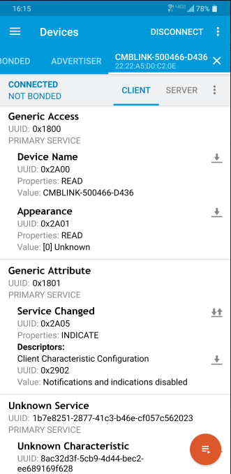

1

以rk3308的ble配网作为分析对象。

参考文档《RK3308_RTL8723DS_WIFI_BT_说明文档_V1.20》《Rockchip Linux WIFI BT 开发指南 V4.0 20181126》

蓝牙使用bluez + bluez-alsa来实现A2DP sink、HFP、ble蓝牙配网这3个功能。

需要去掉内核默认的HCI UART driver。因为wifi驱动自己另外写了。

蓝牙使用rk3308的ttys4串口来进行控制。


蓝牙ble配网，需要板端运行一个gatt-server。就是运行一个服务端，这个就是本质。ap配置，是一个基于wifi的服务端。

这个是在bluez的tools/gatt-server.c的基础上修改。所以本质是在板子上启动一个gatt服务器。

增加了给手机端连接的service及对应的characteristic。


操作过程：

板端：

```
1、打开蓝牙，可以用hciconfig hci0 up
2、执行gatt-service程序。
```

手机端：

```
1、安装rk提供的wifi introducer apk。打开扫描。

```

目前是扫描不到。

发现问题了。

是需要先手动执行bluetoothd。

```
# 板端依次执行：
hciconfig hci0 up
# 注意这个的位置，是没有在环境变量里的，所以要带上完整路径。
/usr/libexec/bluetooth/bluetoothd &
# 启动配置程序，则个有对应的package。自己编译出来。
ble_wificonfig
```

现在就可以看到了。

可以用配网程序连接上，并且把wifi信息发送过来。

我觉得需要通过dbus调试来分析过程。

```
export DBUS_SESSION_BUS_ADDRESS="unix:path=/var/run/dbus/system_bus_socket"
dbus-monitor
```

这样就可以观察dbus上的消息了。

如果没有上面那个环境变量设置，dbus-monitor会报错：

```
Failed to open connection to session bus: Using X11 for dbus-daemon autolaunch was disabled at compile time, set your DBUS_SESSION_BUS_ADDRESS instead
```


再看一下ble_wificonfig这个目录。

下面有一个bt_realtek_wificonfig脚本，内容如下：

```
#!/bin/sh

case "$1" in
    start)

    echo "start rtl8723ds bluetooth server"
    bt_pcba_test &
    sleep 7

    echo "start rtl8723ds bluetooth hciconfig"
    hciconfig hci0 up &

    echo "start rtl8723ds bluetooth wifi config"
    /usr/libexec/bluetooth/bluetoothd -C -E -d -n &
    sleep 2
    ble_wificonfig &

        ;;
    stop)
        echo -n "Stopping rtl8723ds bluez5_utils bluetooth server & app"
        killall ble_wificonfig
        sleep 1
        killall bluetoothd
        sleep 1
        if busybox cat /sys/class/rkwifi/chip | grep RTL8723DS; then
        killall rtk_hciattach
        fi
        if busybox cat /sys/class/rkwifi/chip | grep AP6255; then
        killall brcm_patchram_plus1
        fi

        ;;
    *)
        echo "Usage: $0 {start|stop}"
        exit 1
esac

exit $?
```

看到调用了bt_pcba_test。

这个是在/usr/bin目录下的一个脚本。内容是：

```
#!/bin/sh

echo 0 > /sys/class/rfkill/rfkill0/state
sleep 2
echo 1 > /sys/class/rfkill/rfkill0/state
sleep 2

insmod /usr/lib/modules/hci_uart.ko
rtk_hciattach -n -s 115200 /dev/ttyS4 rtk_h5 &
hciconfig hci0 up
```

在代码里，又是从哪里把这个脚本安装到系统里的呢？

直接locate bt_pcba_test。这个是找不到的。

通过grep rtk_hciattach ，发现rkbtwifi目录下有脚本有这个东西。

到packages目录下看，是bt_load_rtk_firmware安装的时候改名为bt_pcba_test。

```
$(INSTALL) -D -m 0755 $(@D)/bt_load_rtk_firmware $(TARGET_DIR)/usr/bin/bt_pcba_test
```

bt_pcba_test里做的事情是：

1、对蓝牙下电再上电。

2、加载hci_uart.ko驱动。

3、把hci接口跟ttyS4关联起来。

4、软件上打开蓝牙接口。

系统里为什么有2个wifi，2个蓝牙？

```
/ # rfkill
ID TYPE      DEVICE          SOFT      HARD
 0 bluetooth bt_default unblocked unblocked
 1 wlan      phy0       unblocked unblocked
 2 wlan      phy1       unblocked unblocked
 3 bluetooth hci0       unblocked unblocked
```


目前系统开机，默认就加载了hci_uart.ko。但是我并没有进行明确的加载操作。

那么是在哪里自动加载的呢？

/etc/init.d/S66load_wifi_modules这个脚本。

有这么一句，看起来比较像。

```
 rk_wifi_init BT_TTY_DEV
```

rk_wifi_init是一个可执行程序。但是这个是加载wifi驱动的。目前系统就2个ko文件。一个蓝牙串口的hci_uart.ko。一个8723.ko。

从dmesg看，大概在开机12秒的时候，自动加载蓝牙的。

```
[   12.927819] hci_uart: loading out-of-tree module taints kernel.
[   12.930438] Bluetooth: HCI UART driver ver 2.2.d448471.20181218-171515
[   12.930507] Bluetooth: HCI H4 protocol initialized
[   12.930530] Bluetooth: HCI Realtek H5 protocol initialized
[   12.930552] rtk_btcoex: rtk_btcoex_init: version: 1.2
[   12.930569] rtk_btcoex: create workqueue
[   12.930586] rtk_btcoex: Coex over UDP
[   12.931059] rtk_btcoex: alloc buffers 1792, 2432 for ev and l2
[   13.618641] Bluetooth: h5_open
[   13.618700] Bluetooth: hci_uart_register_dev
[   13.620833] rtk_btcoex: Open BTCOEX
[   13.620899] rtk_btcoex: create_udpsocket: connect_port: 30001
```

是靠/etc/init.d/S98_lunch_init这个脚本来做的。

```
case "$1" in
  start)
        aplay /usr/lib/silence.wav
        source /oem/RkLunch.sh #这里是启动我们的应用程序的。
        #recovery test
        if [ -e "/oem/rockchip_test/auto_reboot.sh" ]; then
            mkdir /data/cfg/rockchip_test
            cp /oem/rockchip_test/auto_reboot.sh /data/cfg/rockchip_test
        fi
        source /data/cfg/rockchip_test/auto_reboot.sh &
        bt_realtek_start &
```

bt_realtek_start 这个就是启动蓝牙的了。

/usr/bin/bt_realtek_start

```
#!/bin/sh

echo 0 > /sys/class/rfkill/rfkill0/state

sleep 2

echo 1 > /sys/class/rfkill/rfkill0/state

sleep 2

insmod /usr/lib/modules/hci_uart.ko

rtk_hciattach -n -s 115200 /dev/ttyS4 rtk_h5 &

hciconfig hci0 up

/usr/libexec/bluetooth/bluetoothd --compat -n  &
sleep 1
sdptool add A2SNK
sleep 1
hciconfig hci0 up
sleep 1
hciconfig hci0 piscan
sleep 1
hciconfig hci0 name 'realtek_bt'
sleep 1
hciconfig hci0 down
sleep 1
hciconfig hci0 up
sleep 2
bluealsa --profile=a2dp-sink & 
sleep 1
bluealsa-aplay --profile-a2dp 00:00:00:00:00:00 & 
sleep 1
```

但是目前开机后，hciconfig查看，是关闭状态的。

也没有看到蓝牙相关的进程启动。

bt_realtek_start 这个启动会失败的。

而bt_start.sh这个脚本是可以正常启动的。

```
/usr/libexec/bluetooth/bluetoothd --compat -n -d&
#sleep 1
sdptool add A2SNK
#sleep 1
hciconfig hci0 up
sleep 1
hciconfig hci0 piscan
sleep 1
hciconfig hci0 class 0x240404
#sleep 1
#hciconfig hci0 name 'sayinfo_bt'
#sleep 1
hciconfig hci0 down
#sleep 2
hciconfig hci0 up
#sleep 2
bluealsa --profile=a2dp-sink &
sleep 1
bluealsa-aplay --profile-a2dp 00:00:00:00:00:00 &
```

bt_start.sh这个没有明确加载hci_uart.ko啊。

但是执行后，确实hci_uart.ko被加载了。

再重启，看到不执行脚本，默认hci_uart.ko也是被加载的。

那么bt_realtek_start的问题应该就是重复加载的问题了。

而且我当前的版本的bt_realtek_start的后面的带blue的进程启动都被注释掉了。

为什么不一样呢？

external/rkwifibt/bt_realtek_start 这里就是原始的样子。这个后半部分都是注释的。

按道理应该是注释的。

蓝牙地址如果没有配置，会随机生成一个。

```
Realtek Bluetooth ERROR: vendor storage read bt addr failed, generate one
```


ble_wificonfig里的gatt-service.c文件分析


这个打印出来的名字是：

```
printf("gatt-service unique name: %s\n",
				dbus_bus_get_unique_name(connection));
```

```
gatt-service unique name: :1.5
```

这个名字挺奇怪的。

注册的服务：

```
Registered service: /service1
```

发送广播：

```
static void send_advertise(){
        printf("send_advertise\n");
```

板端执行：

```
/usr/libexec/bluetooth/bluetoothd -C &
hciconfig hci0 up
./ble_wificonfig 
```


用nordic connect这个手机app来连接上来。

可以看到有3个服务：

```
1800
	这个是GAP的。存放了蓝牙名字等信息。
1801
	这个是通用属性。
其他
	这个就是真正进行配网的。里面的UUID定义比较随意，没有发现明显规律。
	app也无法解释，所以显示为unknown。
```




依次分析最后一个service下面的characteristic。

```
1、device context。
	这个是试图从板端读取设备信息。当前实现是读取/data/property.txt文件。
	当前没有这个文件。
2、获取wifi list。
	这个是从板端获取所有扫描到的wifi热点信息。
	这个比较特殊，因为它支持notify。
	
```


gatt的bluez相关文档在bluez/doc/gatt-api.txt里有一些说明。


手机锁屏就会断开连接。

```
[CHG] Device: 5C:EC:83:86:08:DE Connected: no
```

收到的wifi ssid会写入到/data/cfg/wifi_ssid里。

当前用rk提供的wifi introducer这个app进行测试，板端只是收到了wifi ssid和password。

并没有保存并进行连接等操作。

看代码函数也没有调用。

wpa_supplicant_config_wifi 这个函数是保存信息到wpa_supplicant.conf里的。但是这个函数没有调用。

```
CHECKDATA_CHAR_UUID
	这个是特征是做什么呢？是名字看，叫检查数据。
	只有收到这个特征值的写人操作时，才会调用wifi_config_thread_create
	目前看到的打印，是没有收到这个的写入。
```

/data/cfg/check_data 这个也不知道是起什么作用。

config_wifi_thread这个线程的逻辑分析：

```
1、saveCheckdata(0, check_data);
	保存收到的check_data。
	当前因为并没有收到这个。
2、config_wifi
	这个是开始进行配网。
	我手动依次执行下面的命令进行测试。
	wpa_cli -iwlan0 disconnect
		断开当前网络。这个是打印OK。
	wpa_cli -iwlan0 add_network
		这个会打印一个数字，应该是索引值。当前返回的是0 。
	check_wifiinfo(0, wifi_ssid)
		这个是把“xhl“这样的字符串转成对应的十六进制字符串“78686c”
	wpa_cli -iwlan0 set_network 0 ssid 78686c
		ssid后面跟十六进制的字符串。这个才返回OK。
		如果写xhl会FAIL。
	check_wifiinfo(1, wifi_security);
		wpa_cli -iwlan0 scan
		wpa_cli -iwlan0 scan_result | grep xhl
		
	wpa_cli -iwlan0 set_network 0 key_mgmt WPA-PSK
		这个返回OK。
	wpa_cli -iwlan0 set_network 0 wep_key0 1234567890
	wpa_cli -iwlan0 set_network 0 scan_ssid X
		这个是设置hide。X得到值可以是0或者1.如果是1，表示要连接的热点是一个隐藏的热点。
	wpa_cli -iwlan0 set_network 0 priority 1
		设置priority。
	wpa_cli -iwlan0 enable_network 0
		使能这个网络。
	wpa_cli -i wlan0 select_network 0
	
	这个步骤如果失败：
		wpa_cli flush
		wpa_cli reconfigure
		wpa_cli reconnect
3、check_wifi_isconnected
	检查wifi是否已经连接。
	wpa_cli -iwlan0 status | grep wpa_state
		当前是返回wpa_state=INACTIVE
	如果已经连接，则保存当前的配置到文件里。
	wpa_cli save_config
	wpa_cli reconfigure
```


所以，总结一下手机app这边跟板端的交互过程：

```
1、板端启动ble_wificonfig。开始进行ble广播。这个是通过hcitool直接写16进制的几条命令来实现的。
	板端启动ble service。有几个uuid。
2、手机这边进行扫描，找到在进行广播的板端，点击连接。
3、连接好之后，手机点击配网按钮。
	板端这边会收到ssid和密码。
	然后手机应该继续发送CHECKDATA_CHAR_UUID。
	这样就会触发板端去使用ssid密码去进行连接操作。
```

手机对板端的读操作：

```
1、读取wifi板端扫描到的wifi列表。
2、读取板端设备信息。
```

手机对板端的写操作：

```
1、写ssid
2、写password
3、写加密方式。
4、写check data。
	这个就靠ssid和密码进行连接操作了。如果成功，就保存配置。
```

现在我们不要这么麻烦，就一个读，一个写。

写入，就是把ssid、密码发送过来，然后就进入联网操作。

联网成功，则对另外一个uuid进行写入一个标志，app这边去读取这个标志。来查看是否配网成功。


点击连接的时候，板端的打印是这个：

```
Device: /org/bluez/hci0/dev_58_C5_B9_85_BB_D5
chr_read_value[1]:
Device: /org/bluez/hci0/dev_58_C5_B9_85_BB_D5
chr_read_value[1]:
Device: /org/bluez/hci0/dev_58_C5_B9_85_BB_D5
chr_read_value[1]:
```

加上打印：

```
xhl -- chr->uuid:CAC2ABA4-EDBB-4C4A-BBAF-0A84A5CD93A1,
chr_read_value[1]:  
[ 2828.648655] rtk_btcoex: update_hid_active_state: ha
xhl -- chr->uuid:ACA0EF7C-EEAA-48AD-9508-19A6CEF6B356,
chr_read_value[1]:  
xhl -- chr->uuid:40B7DE33-93E4-4C8B-A876-D833B415A6CE,
```

看这几个uuid，实际上是在读取ssid、password、加密这3个。

但是当前没有处理这3个的读取。所以返回的是空的。

这个可以不处理。


触发ble关闭，只需要执行下面三条就可以：

```
hcitool -i hci0 cmd 0x08 0x0005 69 b1 09 8c 3c 71
hcitool -i hci0 cmd 0x08 0x0008 15 02 01 06 11 07 23 20 56 7c 05 cf 6e b4 c3
hcitool -i hci0 cmd 0x08 0x000a 1
```


notify当前是不支持的。

```
static DBusMessage *chr_start_notify(DBusConnection *conn, DBusMessage *msg,
							void *user_data)
{
	return g_dbus_create_error(msg, DBUS_ERROR_NOT_SUPPORTED,
							"Not Supported");
}
```


在板端执行：

```
dbus-send  --type=method_call --print-reply --dest=org.bluez /org/bluez/hci0/dev_54_A4_93_A0_00_08 org.freedesktop.DBus.Introspectable.Introspect
```

会报错：

```
Failed to open connection to "session" message bus: Using X11 for dbus-daemon autolaunch was disabled at compile time, set your DBUS_SESSION_BUS_ADDRESS instead
```

解决方法是：

```
export $(dbus-launch)
```

dbus-launch得到的输出是这样的：

```
DBUS_SESSION_BUS_ADDRESS=unix:abstract=/tmp/dbus-oy7Xhk3qXS,guid=7154dbb8ad648e9b3a95a4df0000131c
DBUS_SESSION_BUS_PID=751
```


当前手动ctrl+c结束ble_wificonfig的时候，bluetoothd也会挂掉。

```
/userdata # munmap_chunk(): invalid pointer

[1]+  Aborted                    /usr/libexec/bluetooth/bluetoothd
```


这个长度为什么改了好几次，最后为什么改为134？

```
#define BLE_SEND_MAX_LEN (134) //(20) //(512)
```


参考资料

1、

https://blog.csdn.net/z497544849/article/details/94575987

2、蓝牙BLE GATT完全分析和运用

https://blog.csdn.net/yueqian_scut/article/details/50752314

3、BlueZ5.45 D-Bus总线 GATT API 分析

https://blog.csdn.net/csdn_zyp2015/article/details/73089380

4、关于hiden的ssid

https://unix.stackexchange.com/questions/555380/wpa-cli-connection-to-hidden-ssid

5、用wpa_cli 连接无线网络

https://blog.csdn.net/cupidove/article/details/41545849

6、BCSphere入门教程01：Immediate Alert

https://www.ituring.com.cn/article/117570

7、nordic的资料，各种定义

`https://infocenter.nordicsemi.com/index.jsp?topic=%2Fcom.nordic.infocenter.sdk51.v9.0.0%2Fgroup__ble__sdk__srv__ias__c.html`

