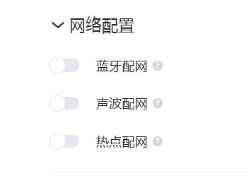
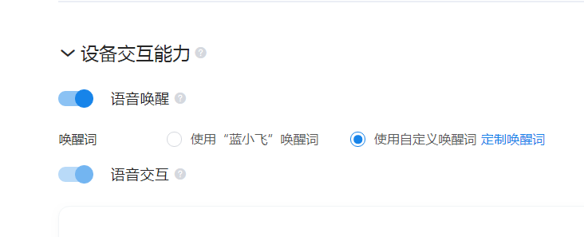
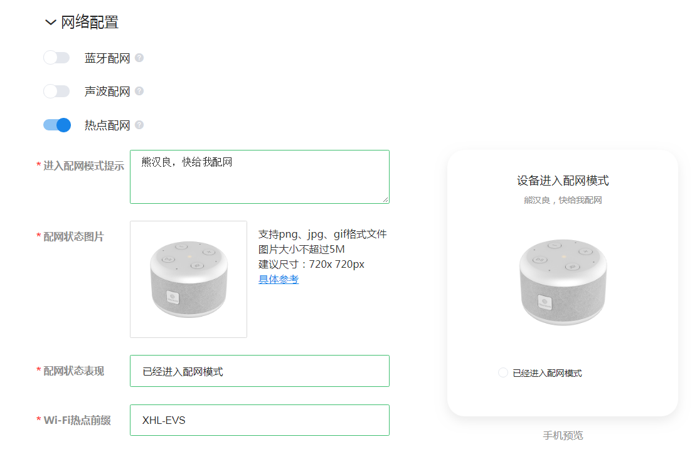

1

要基于iflyos做一个产品。

先跑一下参考代码。

还必须在树莓派上跑。

硬件环境：

树莓派3B，一个usb摄像头做录音用，耳机插到耳机孔。

树莓派系统安装Raspbian sketch。因为我手里有这个版本的镜像。

完全重新安装。

https://github.com/iFLYOS-OPEN/SDK-EVS-Linux

把这个代码下载到树莓派上。

安装依赖环境：

```
sudo apt install -y cmake libcurl4-openssl-dev libmbedtls-dev libsqlite3-dev libasound2-dev libsox-dev libatlas-base-dev libavutil-dev libavformat-dev libavdevice-dev libsdl2-dev pulseaudio
```

进行编译：

```
./build-iflyos.sh -p rpi -c 8d9a6f67-e2e7-4303-a4d7-77e5b09f3c07 -d 88991122 -o $HOME/evs-build 
```

编译有错误，不过很容易改。

加上include_path和link_path就可以了。

测试录音和播放正常。

默认树莓派没有加载v4l2的驱动。

需要在/etc/modules里，加上一行：

```
bcm2835-v4l2
```

然后重启树莓派。

录音测试命令：

```
arecord -D plughw:1,0 -d 2 1.wav
aplay 1.wav
```


但是跑起来还是有错误。

暂时不看Linux版本了。

看Android版本的。


https://github.com/iFLYOS-OPEN/SDK-EVS-Android


也有一点小错误导致编译不过。改了就好了。是用kotlin写的。

但是安装不了。

跑是跑不起来了。

只能自己理解代码了。


用python来做一下看看。


回过头来看Linux版本的。

```
URIError: init IPC port failed
```

这个是一个unix socket。

```
    strcpy(&routerAddr.sun_path[1], ROUTER_PORT_NAME);
```

ROUTER_PORT_NAME名字是

```S
#define ROUTER_PORT_NAME "router"
```

用netstat查看。

```
netstat -an |grep router
unix  2      [ ]         DGRAM                    16797    @router@@@@@@@@@@@@@@@@@@@@@@@@@@@@@@@@@@@@@@@@@@@@@@@@@@@@@@@@@@@@@@@@@@@@@@@@@@@@@@@@@@@@@@@@@@@@@@@@@@@@@
```

怎么把占用的unix socket关闭呢？

用netstat -anp |grep router 查看对应进程。

然后kill掉就可以了。

另外，需要改一下audio.js里的hw:1,0为plughw:1,0 。因为我这个

```
this.mic = new iflyos.ALSASource(props.deviceName || "plughw:1,0", 1, 20000, false);
```

当讯飞的官网上注册一个自己的测试产品。这个不需要审核。

https://device.iflyos.cn/product/integration-test

然后导入几个自己的sn号。随便写。我就写了4个，从20200001到20200004 。

然后添加自己的手机号。

```
client id
e3150fb6-592e-47ca-80fd-c737e245f077
client secret
8b28ecd2-6885-47b1-958a-c8a159bc1219
```

我希望可以跳过配网这一步，因为树莓派当前应该不方便配网。

但是当前开机有提示，我不能用snowboy唤醒。

看看能不能用其他的方式进行触发交互。

我当前也没有配置配网方式。



我把这个设置一下再看看。



需要配网，是因为需要token。

我把配网打开。把这些信息随便填。然后在小飞在线app上就可以看到我的设备了。



但是这样配置后，启动后还是没有进入配网。

配置蓝牙配网看看。


看了一下逻辑。

```
iflyosProduct: rpi
```

现在的关键是把唤醒测试一下。看看当前的硬件能不能正常唤醒。

因为我看了一下代码，是需要在唤醒后，才会进入到配网逻辑。

https://blog.csdn.net/QQqun751977302/article/details/95173694/

下载这个snowboy的预编译的二进制包。在我的Ubuntu16.04的笔记本上可以正常用snowboy唤醒。

https://s3-us-west-2.amazonaws.com/snowboy/snowboy-releases/ubuntu1404-x86_64-1.3.0.tar.bz2

把这个树莓派的版本在树莓派上跑一下。

https://s3-us-west-2.amazonaws.com/snowboy/snowboy-releases/rpi-arm-raspbian-8.0-1.3.0.tar.bz2

树莓派上的usb摄像头做录音还是有不少的问题。

算了。暂时不在树莓派上折腾了。


直接在我的笔记本上来跑这套代码。

```
./build-iflyos.sh -p linuxHost -r evs-test -c e3150fb6-592e-47ca-80fd-c737e245f077 -d 20200002 -o ./evs-build -m 1
```

提示：

```
no /home/teddy/work/iflyos/SDK-EVS-Linux/jsruntime/iflyosBoards/linuxHost/toolchain.txt
```

把/home/teddy/work/iflyos/SDK-EVS-Linux/jsruntime/iflyosBoards/rpi的目录拷贝一份，改名为linuxHost。

然后继续编译。这样可以往后执行。

这份代码真的写得不怎么样。

依赖的很多东西，都需要严格匹配版本。

解决了编译错误后。可以跑起来。

但是还是不行唤醒。


# EVS协议

嵌入式协议（Embedded iFLYOS Voice Service， 简称EVS）是一个相对IVS更简单的协议，为厂商接入提供方便，降低设备运行要求，本协议采取websocket进行通讯。

在连接到iflyos之前，需要先执行：

1、在设备接入平台添加设备。

2、参考设备认证授权文档实现设备端的授权功能流程。获取对应的token。

然后你可以得到2个token。

一个是access_token。

一个是refresh_token。

认证步骤：

1、设备授权。

2、用户授权。


认证过程：

第一步：

向https://auth.iflyos.cn/oauth/ivs/device_code 这个地址发送一个post请求。这一步的目的是进行设备授权。

带上的参数：

```
client_id:
scope: user_ivs_all
scope_data:
```

用curl来写是这样：

```
curl -X POST \
  https://auth.iflyos.cn/oauth/ivs/device_code \
  -H 'content-type: application/x-www-form-urlencoded' \
  -d 'client_id=e3150fb6-592e-47ca-80fd-c737e245f077&scope=user_ivs_all&scope_data=%7B%22user_ivs_all%22%3A%20%7B%22device_id%22%3A%20%20%2220200001%22%7D%7D'
```

得到的回复。

```
{"verification_uri":"https://auth.iflyos.cn/oauth/device","user_code":"561782","interval":2,"expires_in":120,"device_code":"JouUOtmeQWRO7BhzSJ2Tt1IcmwujLClw-34HKMegNJeVSidAGF1PpzPLkkHhQxwt"}
```

verification_uri 这个是用户校验授权码的地址。

user_code  这个是用户授权码。

interval 这个是请求的时间间隔。

expires_in  这个是有效时间，单位是秒。

device_code 这个是设备授权码。

第二步：

根据上一步得到的verification_uri和user_code  。生成一个url：

```
{{verification_uri}}?user_code={{user_code}}
```

对我的这个情况就是：

```
https://auth.iflyos.cn/oauth/device?user_code=010594
```

这个有时间限制，过期就失效的，失效了就重新执行上一步。

然后在电脑的浏览器打开这个url。是一个手机号登陆的界面。

点击授权，然后马上把下面的内容粘贴到命令行执行。

然后就可以提示授权成功了。

```
curl -X POST \
  https://auth.iflyos.cn/oauth/ivs/token \
  -H 'content-type: application/json' \
  -d '{
	"client_id": "e3150fb6-592e-47ca-80fd-c737e245f077",
	"grant_type": "urn:ietf:params:oauth:grant-type:device_code",
	"device_code": "gg_4cKOCfNrMNgnkxeguwunt8qD-1pnbtOgM2Cc3B-6ULOuwKGB1NsHDOhHA-lrm"
}'
```

结果是这样：

```
{"token_type":"bearer","refresh_token":"tn7YIMJ-ZbBzesRmQtoHZAY_Uqyz14r6JUL15en3OfUkWpkR8C7NgGOiekVFXCk8","expires_in":8640000,"created_at":1594002501,"access_token":"dNRAcNtbOeCrRDOgnWKFYw6blQ73mhTHMjwANoUnhqjLdfi5vQGhuDwKhXCXQTZC"}
```

现在信息是这样：

```
设备类型：evs-test
client id
e3150fb6-592e-47ca-80fd-c737e245f077
device id：20200001
user_code：010594
device_code：gg_4cKOCfNrMNgnkxeguwunt8qD-1pnbtOgM2Cc3B-6ULOuwKGB1NsHDOhHA-lrm
access_token：dNRAcNtbOeCrRDOgnWKFYw6blQ73mhTHMjwANoUnhqjLdfi5vQGhuDwKhXCXQTZC
refresh_token：tn7YIMJ-ZbBzesRmQtoHZAY_Uqyz14r6JUL15en3OfUkWpkR8C7NgGOiekVFXCk8
```


然后就是建立跟服务端的websocket连接。

```
wss://ivs.iflyos.cn/embedded/v1?token={access_token}&device_id={device_id}
```


- iFLYOS 系统提供两种闹钟能力，云端闹钟和本地闹钟**只能二选一**。为了降低设备开发成本，iFLYOS 建议你使用云端闹钟。
- 为了更好的用用户体验，我们约定，无论实现设备闹钟还是本地闹钟，在闹钟响起后，设备均应该在语音唤醒或按键操作之后停止闹钟。
- 纯软件项目无需实现闹钟能力（无论云端闹钟还是设备闹钟）。

在请求时，context中不包含`alarm`对象，则代表设备使用云端闹钟。


一个请求的模板：

```
data = {
    "iflyos_header": {
        "authorization": "dNRAcNtbOeCrRDOgnWKFYw6blQ73mhTHMjwANoUnhqjLdfi5vQGhuDwKhXCXQTZC",
        "device": {
            "device_id": "20200001",
            "ip": "192.168.0.101",
            "location": {
                "latitude": 132.56481,
                "longitude": 22.36549
            },
            "platform": {
                "name": "Linux",
                "version": "4.13"
            }
        }
    },
    "iflyos_context": {
        "system": {
            "version": "1.3",
            "software_updater": true,
            "power_controller": true,
            "device_modes": true,
            "factory_reset": true,
            "reboot": true
        },
        "recognizer": {"version": "1.1"},
        "speaker": {
            "version": "1.0",
            "volume": 10,
            "type": "percent"
        },
        "audio_player": {
            "version": "1.2",
            "playback": {
                "state": "PLAYING",
                "resource_id": "xxx",
                "offset": 60000,
            }
        },
        "playback_controller": {"version": "1.0"}

    },
    "iflyos_request": {
        
    }
}
```

一个回复的模板

```
{

    "iflyos_meta": {
        "trace_id": "xxxxxx",  # 本次交互的跟踪标识，提技术支持工单时可能会用到，建议打印在系统日志中
        "request_id": "xxxxx",  # 当云端主动发送response时，该字段不会出现
        "is_last": true  # 标记这组回复是不是这个request_id关联的最后一组回复
    },
    "iflyos_responses": [
        {
            "header": {
                "name": "xxx"
            },
            "payload": {...}
        },
        {
            "header": {...},
            "payload": {...}
        }
    ]
}
```

**除基础约定和音频焦点管理等基础实现外**，如果你已经有一套完善的，成体系的，有经验的设备体验规范，你并不需要完全遵循本规范进行实现。

设备进入网络配置模式时，若设备已经联网，不断开当前的网络连接，直到连接上新的网络。

设备断网(没有联网)时，每5min进行一次网络重连，遍历尝试设备本地的WiFi名和密码是否能够连接网络。

设备联网，但所连网络无法建立与IVS的连接时，每10s发送一次建立连接的请求。


发送语音数据
发送完音频上传指令之后，客户端应尽快开始发送二进制语音数据。除非平台硬件有特殊限制，请使用 20ms 采样（对PCM格式来说即640个字节语音数据，其余格式见上表）封装到一个 websocket binary 消息中发送。如果打开了服务端 vad ，那么在收到服务端recognizer.stop_capture时，应该结束本地录音；如果没有打开服务端 vad，那么客户端可以根据本地 vad 或者按键请求等，自己确定什么时候结束录音。


用cjson来构造请求字符串。


发送语音数据，结束以及取消。

```
    writeVoice(voice){
        this.ws.send(voice, {binary:true});
    }

    /**
     * end current writing voice stream
     */
    endVoice(){
        log('> __END__');
        this.ws.send("__END__");
    }

    cancelVoice(){
        log('> _CANCEL_');
        this.ws.send("__CANCEL__");
    }
```

看Linux版本的唤醒回调函数。

做了多个条件判断，

```
1、是否在配网中。
2、授权状态。
3、跟云端的连接状态。
4、如果当前音量是0，修改为10
5、执行recognize函数。
```


```
// 当设备被用户在app中删除时
        this.capSystem.on('device_removed', () => {
            this.authStatus = 'auth_expired';
            this.soundPlayer.play('tts_登录状态失效，请打开APP重新登录');
            this.client.stop();
        });
```

更新token后要重新连接？是的，因为token是url的一部分。

```
// 旧的access token失效后，重新获取到新的并更新至client
        this.authMgr.on('access_token', (token) => {
            log('update access token with ', token);
            this.authStatus = 'authorized';
            this.client.updateToken(token);
            this.client.startServerConnection();
        });
```


参考资料

1、Linux参考

https://github.com/iFLYOS-OPEN/SDK-EVS-Linux

2、树莓派+USB摄像头识别不到video0

https://blog.csdn.net/weixin_43791338/article/details/105300357