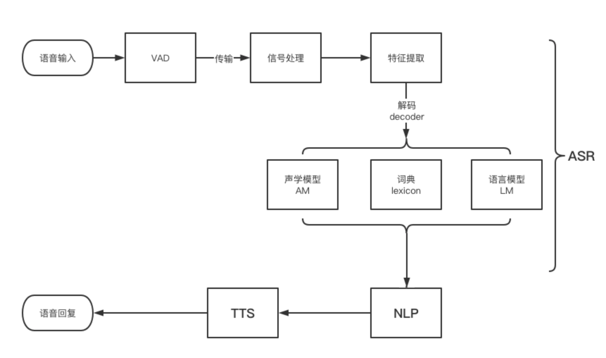

1

现在需要做本地vad。所以研究一下这个主题。

这个有个例子。在我的笔记本跑一下看看。

https://github.com/Baidu-AIP/speech-vad-demo

这个也是一个例子。但是代码看起来比较多。

https://github.com/dpirch/libfvad

unimrcp中vad算法的诸多弊端，但是有没有一种更好的算法来取代呢。

目前有两种方式 1. GMM   2. DNN。

 其中鼎鼎大名的WebRTC VAD就是采用了GMM 算法来完成voice active dector。

今天笔者重点介绍WebRTC VAD算法。

下面的章节中，将介绍WebRTC的检测原理。

首先呢，我们要了解一下人声和乐器的频谱范围，下图是音频的频谱。

根据音频的频谱划分了6个子带，

80Hz~250Hz，

250Hz~500Hz,

500Hz~1K,

1K~2K,

2K~3K,

3K~4K，

分别计算出每个子带的特征。

WebRTC的检测模式分为了4种:

 0:  Normal, 1. low Bitrate   2.Aggressive  3. Very Aggressive ，其激进程序与数值大小相关，可以根据实际的使用在初始化的时候可以配置。

vad 支持三种帧长，80/10ms   160/20ms   240/30ms 

采样这三种帧长，是由语音信号的特点决定的，**语音信号是短时平稳信号，**

在10ms-30ms之间被看成平稳信号，高斯马尔可夫等**比较信号处理方法基于的前提是信号是平稳的。**

 WebRTC 支持8kHz 16kHz 32kHz 48kHz的音频，但是WebRTC首先都将16kHz 32kHz 48kHz首先降频到8kHz，再进行处理。

VAD算法
基于信噪比（snr）的vad
基于DNN的vad
基于能量Energy的vad
基于Decoder的Vad
混合DNN和Decoder的Vad
基于信噪比的VAD算法
首先假设初始时的人是没有说话的，计算12帧初始声音的平均能量作为baseline，这个能量相当于底噪。

若进入的一帧的rms大于这个baseline，认为有人声，否则认为无人声。

初始时，连续n秒无人声，认为用户没有说话；连续3帧有声音，认为开始说话；说话后，又连续n秒没有声音，认为用户停止说话。

这就是几个状态处理，用个简单的状态机即可，switch， case。

用一个窗户来计算有声和无声的帧。

如何计算音量的呢？先计算一帧的rms，再10log（S/N）

这个是从webrtc里扒出来的vad库。

https://github.com/dpirch/libfvad

这里有个很简单的python实现，可以理解一下。

https://github.com/marsbroshok/VAD-python

百度的vad demo

https://github.com/Baidu-AIP/speech-vad-demo

传统 VAD 基于能量做判断，人声高一些 VAD 就会被激活，反之则待机。当处于地铁车厢、公交车站等背景嘈杂的环境中时，人声淹没在环境噪音中，传统 VAD 常常就会失效。

国芯自研的 VAD 则通过多维度的特征分析和判断机制，辅之以自动调节阈值的策略，再通过声学计算，即便在复杂的环境噪音中，也能准确地判断出人声。

同时，国芯在 VAD 上运行的算法已经固化到了硬件上，不依赖于 CPU，因此进一步地节省了功耗。

在开始语音识别之前，有时需要把首尾端的静音切除，降低对后续步骤造成干扰，这个切除静音的炒作一般称为VAD。

这个步骤一般是在本地完成的，这部分需要用到信号处理的一些技术。

VAD（Voice Activity Detection）：也叫语音激活检测，或者静音抑制。其目的是检测当前语音信号中是否包含话音信号存在，即对输入信号进行判断，将话音信号与各种背景噪声信号区分出来，分别对两种信号采用不同的处理方法。

**算法方面，VAD算法主要用了2-3个模型来对语音建模，并且分成噪声类、语音类还有静音类。目前大多数还是基于信噪比的算法，也有一些基于深度学习（DNN）的模型。**

一般在产品设计的时候，会固定一个VAD截断的时间，但面对不同的应用场景，可能会要求这个时间是可以自定义的，主要是用来控制多长时间没有声音进行截断。

**比如小孩子说话会比较慢，常常会留尾音，那么我们就需要针对儿童场景，设置比较长的VAD截断时间；而成人就可以相对短一点，一般会设置在400ms-1000ms之间。**

人的声音信息首先要经过麦克风整列收集和处理，然后再把处理好的音频文件传到云端，整个语音识别模型才开始工作。

这里的上传并不是直接把收音到的音频丢到云端，而是要进行压缩的，主要考虑到音频太小，网络等问题，会影响整体的响应速度。从本地到云端是一个压缩➡上传➡解压的过程，数据才能够到达云端。

**整个上传的过程也是实时的，是以数据流的形式进行上传，每隔一段时间上传一个包。**

你可以理解为每说一个字，就要上传一次，这也就对应着我们常常看到的一个字一个字的往屏幕上蹦的效果。**一般一句“明天天气怎么样？”，会上传大约30多个包到云端。**

一般考虑我们大部分设备使用的都是Wi-Fi和4G网络，**每次上传的包的大小在128个字节的大小，整个响应还是非常及时的。**

这里的信号处理一般指的是降噪，有些麦克风阵列本身的降噪算法受限于前端硬件的限制，会把一部分降噪的工作放在云端。

像专门提供云端语音识别能力的公司，比如科大讯飞、谷歌，自己的语音识别模型都是有降噪能力的，因为你不知道前端的麦克风阵列到底是什么情况。

除了降噪以外可能还涉及到数据格式的归一化等，当然有些模型可能不需要这些步骤，比如自研的语音识别模型，只给自己的机器用，那么我解压完了就是我想要的格式。

VAD截断

这属于比较常见的问题，就是机器只识别了用户一部分的语音信息，另一部分没有拾到音。

这个和用户的语速有很大关系，如果用户说话比较慢的，机器就容易以为用户说完了，所以会产生这样的问题。

一般的解决方案分为两种：第一种是根据用户群体的平均语速，设置截断的时间，一般400ms差不多；第二种是根据一些可见的细节去提示用户，注意说话的语速。

小微提供了云端VAD能力，同时也支持设备使用自己本地的VAD。例如，设备端通过按键进行push to talk的对话方式，当松开按键后，触发本地VAD即可。一般的，我们建议使用云端VAD，而非本地的VAD模型，这样准确性更高。

参考资料

1、第七章 语音检测(VAD)原理和实例

https://shichaog1.gitbooks.io/hand-book-of-speech-enhancement-and-recognition/content/chapter7.html

2、

https://www.cnblogs.com/damizhou/p/11318668.html

3、VAD算法

https://blog.csdn.net/ffmpeg4976/article/details/52416317

4、

http://www.woshipm.com/ai/4144034.html

5、

https://developers.weixin.qq.com/doc/xwei/xiaowei-feature/voice.html