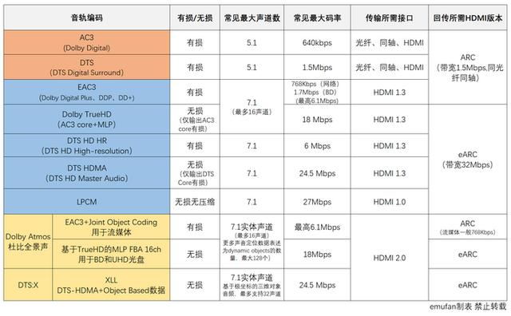

--

# 硬件构成

这些智能音箱内部是什么结构，又是如何工作的？

随着市场、资金、技术人员的研发投入加大，语音识别交互产业技术也在逐步完善，除了诞生许多配套的软硬件供应商外，甚至已经有不少数量的开源硬件及开发资源，我们也将通过硬件和软件两部分去分析并介绍一个典型的功能完整、支持远场拾音[FAR]的智能音箱是如何诞生的。


智能语音助手的工作流程大致可以分为语音识别[ASR]——语言处理[NLP]——语音合成[TTS]三个步骤，但实际上还需要细分为大量的专业项目，我们就以智能音箱的工作流程来介绍智能音箱内部的重要硬件组成部分。


为了接收语音，智能音箱自然少不了麦克风[Mic]以及模拟信号转数字的组件[ADC]，智能音箱为何一般会做成圆柱形？

是因为除圆柱形占地面积小的优点外，

圆柱形可让多个麦克风协同工作的阵列在箱体中不容易出现死角，

还能像人耳那样辨别声音的来源和方向。

**既然是“阵列”，那么就至少需要两个以上的麦进行协同工作。**

Alexa Echo、Echo Dot等就用了7个麦克风，

而Google Home、Home mini只用了两个。

当然智能音箱产品中还有一些是通过改变蓝牙音箱的内部电路实现智能化，没有增加麦克风阵列电路的空间。

**不支持远距离语音识别、需要通过按键操作说话的智能音箱，则往往只有一个麦克风进行拾音。**

除了体积大幅度减小，这些MEMS麦克风组件内部是由MEMS声音传感器和一个完整的Δ-Σ ADC流程电路的ASIC，这就意味着经过这样的麦克风可以直接输出数字音频PCM信号。市面上的MEMS数字麦克风主要来自AKM、娄氏、英飞凌等专业音频半导体厂商提供。


变成数字信号后，进一步的识别和语言处理工作就要通过ARM处理器工作，

国内的智能音箱一般采用全志、瑞芯微、AMLogic等小型处理器厂商的低功耗多核心ARM处理器，也有君正等MIPS处理器。

**由于省去了图形界面和显示输出，因此并不需要强大的处理性能。**

而美国厂商的智能音箱更偏爱集成度更高的TI、博通多媒体SoC，

而联想的智能音箱甚至用上了英特尔的Atom X86处理器。

虽然CPU性能不是最终影响智能音箱使用体验的关键因素，但更好的性能有利于更快地处理语音信息。


为了测试开发方便、优化语音处理的性能和速度，

开源硬件的麦克风阵列所在的电路板还包含了一些可编程芯片，

例如FPGA、DSP等，

甚至XMOS也提供了这样的开发板，

这些DSP子系统结合CPU通过操作系统的API用于语音的定向、降噪，

甚至直接进行语音转换文本处理，

DSP可以更低的功耗代价和更短的运算时间将语音信息转化为文本，

这样语音信息只要经过阵列这一层电路板，

实际上就经过了将模拟信号转变成一个可以供NLP工作流程的数字语音信号甚至是已经提取出来的文本信息。

通过网络发送至云端进行进一步的计算。

通过云端服务器获得的文本通过本地CPU运算转换为语音，也就是常说的TTS流程。

绝大多数智能音箱系统还支持智能家居功能，此时音箱内部的操作系统通过无线局域网络输出特定指令控制已经处于联网状态并且通电待机中的智能家电设备。


变成数字音频信号后，接下来自然就是Soomal读者们最为熟悉的音频输出部分了：将数字信号转换为模拟信号并通过功放和扬声器[喇叭]输出语音信息。

音频输出部分的功率和音质往往最终决定了一个智能音箱的体积和物料成本，通常就是简单的D类数字功放电路和扬声器了。


绝大多数智能音箱对音质并不偏重，

只需要一个小口径的全频单元就可以解决发声工作，

讲究一些的智能音箱还会有多单元分频、被动单元增强低音等方式提升音质和音效。

但也有少数以音质为长项的“音质派”智能音箱，音质成本反而占了很大比重，

例如JBL Horizon Smart和Google Home Max等，而后者售价甚至高达379美元。


亚马逊还考虑到绝大多数用户都有现成的音箱可用，

推出了通过模拟输出外接音箱将“功能机”变成“智能机”的音箱智能化产品Echo Dot[叮咚也有类似产品]。

不过这类产品上市后人们很快就发现一个问题：

它们需要传统的音箱产品保持待机工作，这对于使用待机功耗很低的数字功放音箱或许不是问题，但模拟功放电路设计的音箱甚至甲类功放待机，那就意味着严重的耗电暖炉和工作损耗了，这也注定了这类过渡产品市场潜力很小。


为了提供视觉化的交互信息，智能音箱一般还会有LED灯珠，

单LED一般通过闪烁和明暗、呼吸等效果进行工作状态反馈，

圆环状LED可以表示声音来源方向等效果，

甚至还有类似Google Home那样的RGB LED，LED通过系统和可编程MCU芯片进行控制。


但要看到，智能音箱还是有许多有用的功能以及这些技术应用背后的行业发展，

而且与其挂钩的产业和服务链条完整且规模已经不小，

除了硬件的研发和生产，智能音箱在与人交互所涉及的语音识别、语音处理、深度学习和语音生成等，

**都诞生了大量的技术算法方案和服务供应商。**

如果一个企业无法像亚马逊、谷歌那样有雄厚的财力和庞大的开发团队，以及强大的科研实力，要迅速向市场推出一款智能音箱就离不开这些方案商的帮助，

例如小米、百度、天猫推出的智能音箱就大规模地购买了成熟的现成技术方案。

今天，我们就来聊聊智能音箱在软件和服务功能上的成果和局限。


整体来说，除亚马逊外，目前智能音箱市场还未有出现第二个千万级用户规模的品牌，智能音箱市场看起来热火，

但销售仍然主要通过打折、打包等优惠方式进行出售，

智能音箱的功能、卖点仍处于探索当中，

而传说中的语音购物、语音订餐打车等号称改变生活习惯的功能过于简陋，

无法进行类似搜索、选择等语音操作，毫无实用价值，

天猫和亚马逊似乎也没有半点要改进的迹象。


由于智能音箱受到近年来热门的智能语音和人工智能、物联网等新的技术亮点影像，

而且即使不考虑智能音箱，智能语音的一系列技术进步，

可以最终让手机等所有互联网智能设备受益。

例如谷歌在Android手机上的实时语音、照片文字翻译等功能，

也同样是智能语音和深度学习技术进化的体现。

即使智能音箱市场表现达不到预期，无法成为下一个热门科技产品，

但将更多的科技企业参与智能语音、深度学习等技术的发展，

同样可以在未来深刻地影响着我们的生活。


由于智能音箱市场都被头部玩家长期垄断，导致产品在技术上无较大突破，新品上市节奏放缓，且产品同质化严重，因此对消费者的吸引力必然减弱。


此前，智能音箱是实现全屋智能的重要入口。由于每个家庭的智能家电越来越多，在全屋家电互联的趋势下，智能音箱被用来突破品牌和品类的限制，驱动全屋智能家电，以此满足便捷需求。不过目前来看，智能音箱的地位已经受到挑战，不再是智能家居中唯一的交互入口。

据内部文件显示，最近几年，包括Alexa在内的亚马逊设备部门每年的运营亏损超过50亿美元。 

# 音频前端处理

## vad

区分人声和噪音。

语音检测（英文一般称为 Voice Activity Detection，VAD）的目标是，准确的检测出音频信号的语音段起始位置，从而分离出语音段和非语音段（静音或噪声）信号。由于能够滤除不相干非语音信号，高效准确的 VAD 不但能减轻后续处理的计算量，提高整体实时性，还能有效提高下游算法的性能。

VAD 算法可以粗略的分为三类：基于阈值的 VAD、作为分类器的 VAD、模型 VAD。

基于阈值的 VAD：通过提取时域（短时能量、短期过零率等）或频域（MFCC、谱熵等）特征，通过合理的设置门限，达到区分语音和非语音的目的。这是传统的 VAD 方法。
作为分类器的 VAD：可以将语音检测视作语音/非语音的两分类问题，进而用机器学习的方法训练分类器，达到检测语音的目的。
模型 VAD：可以利用一个完整的声学模型（建模单元的粒度可以很粗），在解码的基础，通过全局信息，判别语音段和非语音段。

## 降噪


## 回声消除AEC

具体的，AEC 的目的是，在音箱扬声器工作（播放音乐或语音）时，从麦克风中收集的语音中，去除自身播放的声音信号。这是双工模式的前提。否则，当音乐播放时，我们的声音信号会淹没在音乐声中，不能继续对音箱进行有效的语音控制。

## 去混响

就是声音的反射消除。

在室内，语音会被墙壁等多次反射，麦克风采集到（图12）。混响对于人耳完全不是问题，但是，延迟的语音叠加产生掩蔽效应，这对语音识别是致命的障碍。

## 声源定位DOA

声源定位是根据麦列收集的声音语，确定说话人的位置。

DOA 至少有两个用途，

1）用于方位灯的展示，增强交互效果；

2）作为波束形成的前导任务，确定空间滤波的参数。

声源定位有如下常用方法有基于波束扫描的声源定位、基于起分辨率率谱估计的声源定位以及 基于到达时间差（Time Difference of Arrival, TDOA）的声源定位。考虑到算法复杂性和延时，一般采用TDOA方法。

## 波束形成（beam forming）

波束形成是利用空间滤波的方法，将多路声音信号，整合为一路信号。通过波束形成，一方面可以增强原始的语音信号，另一方面抑制旁路信号，起到降噪和去混响的作用（图13）。

# 唤醒

出于保护用户隐私和减少误识别两个因素的考虑，智能音箱一般在检测到唤醒词之后，才会开始进一步的复杂信号处理（声源定位、波束形成）和后续的语音交互过程。

一般而言，唤唤醒模块是一个小型语音识别引擎。

由于目标单一（检测 出指定的唤醒词），唤醒只需要较小的声学模型和语言模型（只需要区分出有无唤醒词出现），声学打分和解码可以很快，空间占用少，能够在本地实时。

也有唤醒做为关键词检索（key word search）或文本相关的声纹识别问题来解决。


构建智能音箱应用的过程包括以下几个关键步骤：

1. 语音采集与预处理：使用音频采集设备（如麦克风）获取用户的语音指令，并进行预处理，如降噪、音频格式转换等。
2. 语音识别：将预处理后的语音信号输入语音识别引擎，将其转化为文本形式。
3. 自然语言处理：对语音识别得到的文本进行自然语言处理，以理解用户的意图和需求。
4. 执行操作：根据用户的指令和意图，执行相应的操作，如播放音乐、查询信息等。
5. 语音合成：将执行结果转化为语音，并通过音频输出设备（如扬声器）进行播放。

# dspconcepts 公司介绍

我看avs的代码里有这个唤醒词的。

截至我知识截止日期2021年，DSP Concepts是一家位于美国加利福尼亚州的私营公司，成立于2003年。该公司专注于提供音频处理和声音智能解决方案，用于各种应用领域，包括汽车音频系统、消费电子、智能音箱、手机和音频通信等。

以下是DSP Concepts的一些主要业务和产品特点：

1. 音频处理软件：DSP Concepts提供了一套先进的音频处理软件，其中包括嵌入式音频处理算法、音频编解码器、降噪、回声消除、声音增强和音频混响等。这些软件模块可以嵌入到设备的硬件中，用于实现高质量的音频处理功能。

2. 音频开发工具：DSP Concepts还提供了一套用于音频开发的工具和平台，帮助开发人员快速构建和优化音频处理应用。这些工具可以加速产品的开发和市场推出。

3. 声音智能：DSP Concepts致力于将声音智能集成到各种设备和应用中。通过深度学习和人工智能技术，他们的声音智能解决方案可以实现语音识别、命令词识别、语音控制等功能，为设备提供更智能、更便捷的用户体验。

4. 市场覆盖：DSP Concepts的客户范围广泛，涵盖了多个行业和领域。他们的技术和解决方案被应用于汽车音频系统、智能音箱、智能手机、耳机、智能家居设备等多个产品类别。

需要注意的是，作为一个企业，其产品和业务可能会随着时间的推移而发展和改变。因此，我建议您在了解最新信息之前，访问DSP Concepts的官方网站或者参考其他可靠来源获取最新的公司介绍和产品信息。

# *AudioWeaver*

AudioWeaver是一种用于音频处理的软件开发平台，由美国的Octasic公司开发。该平台旨在为开发人员提供一个高度灵活和强大的工具，用于设计和优化各种音频处理算法和应用。

AudioWeaver具有以下主要特点：

1. 图形化编程界面：AudioWeaver采用图形化编程界面，使开发人员能够通过拖拽和连接不同的音频处理模块来构建复杂的音频处理图。这使得开发人员无需编写大量的底层代码，简化了开发流程。

2. 实时性能：AudioWeaver专注于提供高效的实时音频处理性能。它的设计旨在满足实时音频应用的需求，如语音识别、语音合成、音频效果处理等。

3. 可移植性：AudioWeaver支持在不同的处理器平台和操作系统上运行，使开发人员能够将其应用部署到各种硬件平台上，如DSP、FPGA、ARM等。

4. 预定义的音频库：AudioWeaver提供了一系列预定义的音频处理库，包括滤波器、均衡器、混响、压缩等模块，帮助开发人员快速构建音频处理应用。

5. 实时调试和优化：AudioWeaver允许开发人员在实时环境下进行调试和优化，以确保音频处理算法的准确性和效率。

AudioWeaver被广泛应用于消费电子、汽车音频系统、智能音箱、通信设备等领域，帮助开发人员实现高品质的音频处理功能。它提供了一种便捷的方式，让开发人员专注于算法设计和优化，而无需过多关注底层硬件和驱动的细节。

# 78款智能音箱拆解分析

https://www.52audio.com/archives/85057.html

# 天猫精灵产品系列

https://www.zhihu.com/tardis/zm/art/266070779?source_id=1003


https://www.52audio.com/archives/45239.html

# 小度系列

百度自己做的芯片

**[ESP32-DU1906](https://www.espressif.com/sites/default/files/documentation/esp32-du1906_esp32-du1906-u_datasheet_cn.pdf)** 和 **[ESP32-DU1906-U](https://www.espressif.com/sites/default/files/documentation/esp32-du1906_esp32-du1906-u_datasheet_cn.pdf)** 是两款 AI 模组，基于乐鑫 ESP32-D0WD-V3 芯片和百度鸿鹄语音芯片 DU1906 设计，集 Wi-Fi、 传统蓝牙、低功耗蓝牙性能，以及音频语音处理功能为一体，功能强大、用途广泛。两款模组具备行业领先的技术规格，其高集成、高性能、低功耗的特点在 AIoT 产品领域有着相当大的竞争力。

https://www.espressif.com.cn/zh-hans/products/devkits/esp32-korvo-du1906


# 前端信号处理

检测到语音并对其进行数字化处理之后，

便需要执行多项信号处理任务。

与处理外部噪声一样，

我们还需要考虑由收听设备产生的声音，

例如输出音乐的智能音箱或与线路另一端的人的对话。

为了抑制这些声音，设备使用回声消除（AEC）技术。

由此一来，即使智能音箱正在播放音乐或与用户对话，用户也可以进行干预并中断智能音箱的活动。

这类回声得到消除后，便会使用噪声抑制算法清除外部噪声。

尽管应用各有不同，

但我们可以将应用的语音控制设备分为两类：

近场拾音设备和远场拾音设备。

近场设备（如耳机、耳塞、可听戴设备和可穿戴设备）佩戴在用户的嘴边，

而远场设备（如智能音箱和智能电视）用于收听来自整个房间的用户语音。

**近场设备通常使用一个或两个麦克风，**

**但远场设备使用的麦克风数目通常在3到8个之间。**

这是因为远场设备面临的环境挑战要比近场设备复杂：

用户远离设备时，到达麦克风的语音会逐渐变小，而背景噪声大小保持不变。

同时，设备还需要将直接语音信号从墙壁和其它表面反射（也称为混响）信号中分离出来。

**为了处理这些问题，远场设备采用一项称为波束形成的技术。**

**此技术使用多个麦克风，根据到达各麦克风的声音信号之间的时差计算声源方向。**

这样一来，设备便可忽略反射和其它声音，而只收听用户的语音。

此外，还可以跟踪用户的移动情况，在有多人发声的情况下放大正确的语音。

对于智能音箱，另一项重要任务是识别“触发”词，比如“Alexa”。

由于音箱始终处于收听状态，

这种触发识别会带来隐私问题 — 如果用户音频一直上传到云端（即使用户没有说触发词），

用户对Amazon或Google监听他们所有的对话是否有意见？

更为可取的方法是在智能音箱本地处理触发识别以及“调高音量”等多种常用命令，

这样，只有在用户启动较为复杂的命令后，语音才会发送到云端。

最后，**清晰的语音样本必须先进行编码加密，然后发送到云端后台进行进一步处理。**


综上所述，前端语音处理必须能够处理多项任务。

处理过程必须快速、准确，对于由电池供电的设备，耗电量必须保持在最低水平，即使设备始终处于收听触发词的状态也不例外。

要满足这些需求，通用数字信号处理器（DSP）或微处理器在成本、处理性能、尺寸和功耗方面不太可能胜任，

而具有专用音频处理功能且软件得到优化的特定DSP有望成为更好的解决方案。

选择已针对语音输入任务进行优化的硬件/软件还将降低开发成本，并大幅度缩短上市时间，降低总成本。

例如，CEVA推出的ClearVox属于语音输入处理算法软件套件，可处理不同声学场景和麦克风配置，包括扬声器的语音到达方向、多麦克风波束形成、噪声抑制以及回声消除。

除语音处理外，边缘设备还需要具有处理触发词检测的功能。

WhisPro是专为CEVA DSP提供的基于神经网络的语音识别软件包，可帮助OEM厂商向其具有语音功能的产品添加语音激活功能。

WhisPro可处理始终在线（Always-on）收听需求，而主处理器在需要使用之前保持休眠状态，从而降低系统总功耗。


虽然关键字检测的词汇量极为有限，但其检测有多种用途。

例如，电灯开关或恒温器等简单智能家居设备可能只对几条命令作出响应，比如“开”、“关”、“调亮”、“调暗”等。

这种级别的ASR在本地（边缘设备）即可轻松处理，无需联网，从而降低成本、确保得到快速响应并避免安全和隐私问题。

另一个示例是说出“cheese”或“smile”可以命令多个Android智能手机拍照。

此时，向云端发送命令需要很长时间，前提是有网络连接可用，但对于智能手表或可听戴设备来说，并不总有网络可供连接。

另一方面，很多应用需要使用NLP。

要向Echo音箱询问天气情况或订一间今晚的酒店，您可以通过不同方式表达问题。

设备需要能够理解命令中可能存在的细微差别和俗语，以便正确辨别用户命令。

简而言之，设备需要能够将语音转换为语义，而不仅仅是将语音转换为文本。

这一过程需要进行大量处理，

通常会用到人工智能（AI）和神经网络，

仅在边缘设备上进行处理几乎是不切实际的。

采用嵌入式处理器的低成本设备所具备的功能无法处理请求的任务。

在这种情况下，正确的做法是将经过数字化处理的语音发送到云端进行处理。

语音将在云端得到解析，云端会向语音控制设备发回相应的响应。

设备上的边缘处理与云端中的远程处理之间会进行权衡。

如果所有任务都在本地处理，速度会更快，不要求设备联网，但难以处理更广泛的问题和信息获取。

这意味着对于家用智能音箱等一般用途设备，至少要将某些任务推送到云端进行处理。

为了解决云端处理存在的缺陷，

本地处理器的功能在不断发展。

在不久的将来，边缘设备的NLP和AI方面将取得长足进步。

新技术将降低所需内存的大小，处理器的速度会得到进一步提高，功耗会更低。


https://www.eet-china.com/news/2003008.html

# 回声消除 算法C语言实现

以下是一个简单的回声消除算法的C语言示例实现。请注意，这只是一个基本的示例，实际的回声消除算法可能更加复杂和精细，需要根据实际需求进行调整和优化。

```c
#include <stdio.h>

#define SAMPLE_RATE 44100 // 采样率
#define ECHO_DELAY 5000   // 回声延迟（以样本数为单位）
#define ECHO_ATTENUATION 0.5 // 回声衰减系数

void echoCancellation(float *input, float *output, int length) {
    for (int i = ECHO_DELAY; i < length; i++) {
        output[i] = input[i] + ECHO_ATTENUATION * input[i - ECHO_DELAY];
    }
}

int main() {
    int numSamples = SAMPLE_RATE * 5; // 5秒的音频
    float *inputSignal = (float *)malloc(numSamples * sizeof(float));
    float *outputSignal = (float *)malloc(numSamples * sizeof(float));

    // 假设初始化inputSignal为声音信号

    // 执行回声消除算法
    echoCancellation(inputSignal, outputSignal, numSamples);

    // 在这里可以将outputSignal保存为音频文件或播放出来

    free(inputSignal);
    free(outputSignal);

    return 0;
}
```

上述示例中的`echoCancellation`函数演示了一个简单的回声消除算法，它将输入信号中的回声成分减少一定的衰减系数并与原始信号相加，以产生输出信号。在实际应用中，回声消除算法通常会使用更复杂的自适应滤波器和信号处理技术来估计和减少回声成分。

请注意，实际的回声消除算法需要考虑许多因素，如信号延迟、回声路径估计、信号和回声的频谱特性等。这个示例只是一个基本的概述，实际的算法可能需要更多的细节和调整。


# 小米小爱AI音箱HD【硬件分析】

这个里面有硬件价格解析。

https://blog.csdn.net/weixin_33897085/article/details/113579059

# 智能音箱生态链简介 

国内相关生态如下：

阿里、京东、小米等互联网电商企业；

腾讯、百度、网易等互联网大数据、云计算相关企业；

思必驰、科大讯飞、云知声等语音算法处理及整体方案提供商；

科胜讯、瑞芯微、晶晨、全志、联发科等主处理器提供商；

芯唐、德州仪器、科胜讯、顺芯、苏州敏芯微等前端硬件提供商；

TCL通力、三诺、歌尔等代工厂商。

https://www.sohu.com/a/152022416_468626

# **半年报 | 2023上半年中国智能音箱市场总结与展望**

**2023年上半年，中国智能音箱市场全渠道销量为1148万台，同比下降19%；销额为33.7亿元，同比下降20%**。

这不是智能音箱市场的首次大幅下跌。

2022年，经历了三年极速狂奔期和两年大疫调整期之后，

在从业者的长期担忧和预判下，中国智能音箱市场就从“过高期望的峰值”落入了低谷期，当年销量大降28%。

市场的担忧和预判是有一定道理的，

智能音箱可以数出来的槽点可能远远多于其它消费电子产品。

作为罕见的**一开始巨头就进场**的行业，

直接打消了更多创业者的入场积极性，

缺乏更广泛的充分竞争和冲量活力。

产品缺乏创新，**同质化现象严重**，交互体验不佳，

无论是作为“智能”的助手还是作为享受的“音箱”，均未达到消费者的期待；

免费价值内容偏少，换新和尝鲜动力减值。

企业对产品预设的**中心地位受到挑战**，“去中心化”正趋于盛行。


整体来看，近年来，由于电商渠道红利的消退，以及智能音箱的低价特性，“618”和“双11”等促销节点对智能音箱消费的拉力明显不足。


# 音频产品发展趋势

音质

续航

无线


https://www.52audio.com/archives/89884.html

# le audio

北京时间2020年1月7日，蓝牙技术联盟（Bluetooth SIG）在美国拉斯维加斯举报的CES2020展会上正式推出了[新一代蓝牙音频技术标准——LE Audio](https://mp.weixin.qq.com/s?__biz=MzU5NzE0NjE0MQ==&mid=2247490502&idx=1&sn=0f39618992a797f68f0dd0bc5069f69b&chksm=fe56b4b4c9213da20fd4d6a4680232eafd74cfb5b21d2e56ad664a7bd53f75b303e5976f2080&token=1282359490&lang=zh_CN&scene=21#wechat_redirect)，我爱音频网在第一时间进行了报道。

新蓝牙音频技术标准LE Audio的主要特点是：

超低功耗；

ISOC（isochronous）架构；

全新的高音质、低功耗音频解码器LC3；

支持多重串流音频（Multi-Stream Audio）；

支持广播音频技术；

为助听器提供强大的支持。


https://mp.weixin.qq.com/s?__biz=MzU5NzE0NjE0MQ==&mid=2247490542&idx=1&sn=a171c1f7d805ebcb958930bb3b25674d&chksm=fe56b49cc9213d8a4bd368cf49e7a2b670f0f92570c1aed2d0d7caea01957f045fec27f20916&token=394396467&lang=zh_CN#rd

# 无线音频产品在2023年的3大发展趋势预测

两年后，第一批兼容LE Audio的设备出现。

当与同样支持LE Audio的手机配对时，

这些耳机、音箱将使用名为LC3的新默认蓝牙编解码器。

蓝牙技术联盟表示，LC3将提供与当前默认SBC相同的音频质量，即使只使用一半的数据。

当您将LC3的更低延迟、更低复杂性和更低内存占用考虑在内时，

这一切加起来让无线音频设备使用更少的功率来完成它们一直以来所做的同样的事情。

从理论上讲，今天的电池寿命估计值可能会翻倍，

例如，AirPods Pro的续航时间可达12小时，而不是6小时。


https://www.nxrte.com/class/7914.html


# le audio和ble是什么关系

LE Audio（低功耗音频）和BLE（Bluetooth Low Energy，低功耗蓝牙）是两种蓝牙技术，它们在一定程度上存在关系，但又有一些不同之处。

BLE（Bluetooth Low Energy）是一种低功耗蓝牙技术，旨在为低功耗设备提供短距离通信能力，如传感器、可穿戴设备、健康监测设备等。它消耗较少的电能，可以在长时间内工作，适用于需要低功耗的应用场景。BLE具有较小的数据传输速率，适用于周期性地传输小量数据。

**LE Audio（低功耗音频）是基于BLE的扩展**，

专门用于支持低功耗蓝牙设备之间的音频传输。

它的目标是提供低延迟、高质量的音频传输，使得蓝牙设备可以用于音频播放、耳机、助听器等音频相关的应用。

LE Audio引入了一种称为"LC3"（Low Complexity Communication Codec）的新音频编解码器，可以在低功耗的情况下实现高质量的音频传输。

因此，LE Audio可以看作是在BLE技术基础上增加了音频传输能力的一种扩展，它使得低功耗蓝牙设备能够在低功耗的情况下支持音频通信。

这种关系使得LE Audio在可穿戴设备、无线耳机、听力辅助设备等应用中变得更加有用和实用。

# LC3可以在A2DP上使用吗

是的，LC3（Low Complexity Communication Codec）可以在A2DP（Advanced Audio Distribution Profile）上使用。A2DP是蓝牙技术中的一个协议，用于在蓝牙设备之间传输高质量音频流，通常用于无线耳机、扬声器等音频设备。LC3作为一种音频编解码器，可以在A2DP协议下用于对音频数据进行编码和解码，从而实现在蓝牙设备之间高质量的音频传输。

LC3在蓝牙标准中被引入，旨在提供更高效、更低延迟的音频传输，特别适用于低功耗蓝牙（BLE）设备之间的音频通信。因此，当使用A2DP协议进行音频传输时，可以选择使用LC3编解码器，以获得更好的音频质量和性能。

需要注意的是，虽然LC3可以在A2DP上使用，但实际应用中是否支持LC3取决于设备的硬件和软件支持情况。在使用时，设备需要支持LC3编解码器并进行相应的配置。如果设备支持LC3，那么它可以作为A2DP的编解码器之一，提供更优质的音频传输体验。

# 5.1环绕声


https://manual.yamaha.com/av/18/rxv585/zh-CN/311009291.html

## **真正的革命性声音技术——浅谈杜比全景声**

杜比全景声 (Dolby Atmos) 是首个基于声音对象（Audio Object），而非声道的家庭影院系统。

什么是声音对象？

**您在电影场景中所听到的任何声音都是声音对象，**

如孩子的叫喊声、直升飞机的起飞声、汽车的鸣笛声。

电影制作者运用杜比全景声，

可以准确地确定这些声音的发声位置并随情节发展精确地控制声音的位移。

以这种方式来构思声音，

不会有基于声道的音频系统所存在的诸多限制。

在基于声道的系统中，

电影制作者需要考虑扬声器设置：

这个声音应该来自左后环绕声还是左侧环绕声？

而有了杜比全景声，电影制作者只需要考虑故事情节：

孩子大叫大喊着要跑向哪里？

无论在电影院还是家庭影院，杜比全景声系统都可以智能地决定使用哪些扬声器，来精确再现电影人想要呈现的孩子的移动方向。


而且，比起基于声道的家庭影院，

杜比全景声更加灵活、适应性更强。

在基于声道的系统中播放基于声道的内容，扬声器数量是固定的：

7.1 系统通常包含7个扬声器和1个低音扬声器。

有了杜比全景声，情况恰好相反，你会拥有无与伦比的灵活选择：

12个扬声器（7.1.4）就可让你畅享完美体验；

或者添加更多扬声器，聆听者会获得更加饱满、细腻的声音。

添加扬声器时，支持杜比全景声的接收器会自动判断如何使用扬声器营造妙不可言、身临其境的声音效果。

声音是立体的，想完美还原自然的声音，依靠切分成五组或七组音效的喇叭，明显是不够的。

为了让声音在水平和垂直方向都能完美定位，那就要依靠不同的解决方案。

杜比提出了最自然的声音（Dolby Atmos）由音床（Bed Audio）、声音对象（audio object）与（Metadata）全景声源数据构成。

如果这样还是有一点抽像，那么我用一个大家都能听懂的比喻来说明！

全景声技术非常像一个大型的网游！

而Bed Audio相当于网游中的大地图，

Audio Object相当于在里面游走的角色，

Metadata则相当于角色在地图中触发事件的座标等。


http://www.tonewinner.com/article.php?id=573

# dolby vs dts



而当杜比推出全景声Atoms时，改变了玩法，不再扩展码率或者声道数，

搞出了”基于对象的音频编码“，

不过仍然扩展了天空声道，让水平的声场扩展了高度。

这一方面是因为UHD碟片需要给视频留带宽，没法让音轨无限制的胖下去，

**另一方面通过增加声道增加音频定位实在太蠢了，**

这些插在已有编码中的附加信息，已经足够表达影片中偶尔出现的声音，

比如打雷、飞机起飞等等，

我猜可能是一些录音片段和位置信息，由功放根据用户实际音响配置融入不同声道。

而且Atoms还分别基于EAC3和TrueHD对应流媒体和UHD碟片市场，联合引领HDR图像技术的杜比视界，显露出王者之相。


DTS直到2015年才推出自己的基于对象的音频技术，DTS:X，

也是基于DTS HDMA，

增加用极坐标还原物体音频定位信息，

而且既然杜比已经音画双贯，DTS也只好拉着IMAX搞了个IMAX ENHANCED。

虽然DTS宣称对用户和制作方更易用，但看着铺天盖地的杜比视界+全景声内容，似乎胜负已定。

所以消费级的环绕音轨演进路线就是有损，+无损，再+对象音频信息。

为了便于大家理解，我打个比方，

AC3是128K的MP3，

DTS是320K的MP3，

TrueHD相当于APE附赠128KMP3，

DTSHD相当于FLAC附赠320KMP3，

对象信息也许是一堆散碎的wav+txt，什么时候放、哪个声道放由程序决定。


很多人以为全景声会有更好的音质，这可能是个误解，只能说定位信息更丰富了吧。

就像那些3D电影，后期时不时弄个出屏效果一样。

决定音质的是DTS HDMA和TrueHD，无损总是好的，虽然大多数人可能也听不出区别。


https://beebom.com/dolby-digital-vs-dts/

这篇文章非常好。值得反复读。

https://blog.csdn.net/weixin_42415451/article/details/113067874

# 影院的术语

https://www.kepuchina.cn/xmt/201905/t20190515_1055812.shtml

# 在家沉浸体验 BD 4K UHD HDR - Dolby ATMOS / DTS:X 电影——我的客厅影音系统搭建手记

https://post.smzdm.com/p/aoxv5kd9/

# 参考资料

1、

https://blog.csdn.net/qq_15079039/article/details/85318630

2、soomal这个网站不错。

http://www.soomal.com/search/101/%E6%99%BA%E8%83%BD%E9%9F%B3%E7%AE%B1.htm

3、

http://www.soomal.com/doc/10100007909.htm

4、2022年中国智能音箱行业报告

https://pdf.dfcfw.com/pdf/H3_AP202211021579823203_1.pdf?1667425285000.pdf

5、追赶风潮-DIY一款智能音箱之一:硬件设计篇 

https://www.sohu.com/a/203821887_464086

6、

https://ost.51cto.com/posts/23742

7、智能音箱App端产品设计之道：智能音箱App设计的三个原则

https://www.woshipm.com/pd/728684.html

8、**智能音箱声渐默**

https://znyj.ofweek.com/news/2023-01/ART-12300-8420-30583906.html

9、后智能音箱时代，什么才是制胜法宝？

https://www.esmchina.com/news/6349.html

10、前谷歌员工解锁智能音箱新玩法：客房里的注意力商人

https://aiello.ai/cn/%E5%89%8D%E8%B0%B7%E6%AD%8C%E5%91%98%E5%B7%A5%E8%A7%A3%E9%94%81%E6%99%BA%E8%83%BD%E9%9F%B3%E7%AE%B1%E6%96%B0%E7%8E%A9%E6%B3%95%EF%BC%9A%E5%AE%A2%E6%88%BF%E9%87%8C%E7%9A%84%E6%B3%A8%E6%84%8F%E5%8A%9B/

11、从众星捧月到前路暗淡，智能音箱做错了什么？

https://m.thepaper.cn/newsDetail_forward_20706915

12、

https://xueqiu.com/3928984383/245790326

13、智能音箱拆解汇总

https://www.52audio.com/archives/1971.html

14、

这篇文章对术语的列举和解释非常好。

https://blog.csdn.net/JackyTintin/article/details/62040823

15、

https://www.esmchina.com/news/5449.html

16、

https://developer.aliyun.com/article/1240740

17、

https://blog.csdn.net/weixin_42082222/article/details/80529850

18、

https://xie.infoq.cn/article/c065ee22cb4067d40a57d108d

19、“物联网开发实战”学习笔记-（四）智能音箱制作和语音控制

这篇文章非常不错。对基本概念讲解透彻，图片很好。

https://blog.csdn.net/weixin_47567401/article/details/113832567

20、

https://www.eet-china.com/news/2003008.html