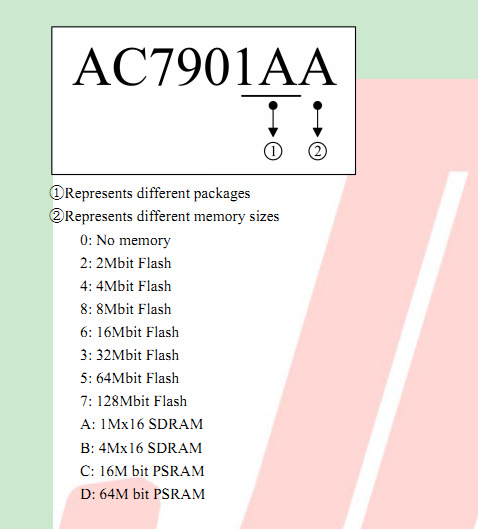

1

# 关于杰理

杰理全称为“珠海市杰理科技股份有限公司”，2010年8月成立于珠海，2020年杰理即将迎来TA的10岁生日。经过十年的发展，杰理在珠海、深圳、香港三地均成立了公司，员工人数已达到300余人，其中工程师占九成以上。

# 烧录方法

1、板端进入烧录模式。短接spi flash的1脚和2脚。

2、编译完全后，自动调用bat脚本。如果在编译完成的时候，板端并没有进入到烧录模式，则不会进行下载操作。

3、可以手动执行cpu\WL80\tools\download_to_sfc.bat脚本来进行烧录。不过最好还是靠工具自动下载吧。还方便一些。


# sdk分析

开发工具是codeblock。

需要安装他们自己的一个工具链。

芯片的参数：

```
主频320M
内部自带512K的sram
自带硬件图片codec
内置wifi、bt5.0
有些型号还会集成SDRAM，有2M和8M这2种。

从我手里的这个demo板上的丝印看，AC7901BA
最后2个字母，从文档里看，B代表了封装。
A代表sdram的尺寸，A表示的是2M的sdram
```



从故事机工程里的app_config.h里

```
#define __FLASH_SIZE__    (4 * 1024 * 1024)
#define __SDRAM_SIZE__    (2 * 1024 * 1024)
```


sdk支持的

```
1、绘本故事机。
2、wifi音箱。
3、扫描枪。
4、航拍图传。
5、记录仪。
6、ipc摄像头。
```

系统启动过程

```
上电
maskrom工作
uboot工作，读取flash里的代码到ddr执行，
```

目前看起来，似乎运行方式还比较常规。没有像炬力芯片那么奇怪。

封装还是非常严密的。

我需要搞清楚：

1、cpu的是哪种内核的？我觉得应该是mips的。手册里没有看到任何arm的东西，只是说是是双核risc。

但是看《如何定位异常死机地址》文档里的堆栈，有R0到R15，这明显是ARM 的。

从链接脚本里。

```
MEMORY
{
    rom(rx)             : ORIGIN =  0x2000000, LENGTH = FLASH_SIZE
    sdram(rwx)          : ORIGIN =  0x4000000, LENGTH = SDRAM_SIZE
```

这个明显是cortex-m系列的地址分布。那么就可以确定是cortex-m系列的了。

后面注意到有生成一个main.or32.resolution.txt文件，or32看起来就像是芯片架构的名字。

**搜索了一下，or32表示OpenRisc架构的。**

2、rtos是哪个？在include_lib目录下，可以看到是freertos。

看到有这样的函数。是不是基于microchip的PIC32来做的？

```
__builtin_pi32v2_cli
```

也提供了os_xxx的接口封装。

也对接了posix接口。

TICK是10ms。

```
#define OS_TICKS_PER_SEC          100
```

还是有一些load app到flash的概念的。

只要有内存运行，就需要做这个。

反正我就当黑盒用就好了。

主体代码是在app_music.c里。有3000行。

也是靠section来玩的。

```
REGISTER_APPLICATION(app_music)
```

就是放到.app这个section里的。

编译时，打印的工具链信息。

```
Build: Release in AC790N_picture_book_story (compiler: PI32V2 r3 Empty Compiler)
```

代码入口是这个结构体，一个状态机，一个事件处理。

```
static const struct application_operation app_music_ops = {
    .state_machine  = app_music_state_machine,
    .event_handler 	= app_music_event_handler,
};
```

事件有：

```
按键
	按键事件有：
	click
		mute
		ok
		up
		down
		mode
		menu
		...
	long
	hold
	up
设备事件
	sd卡插拔
	电量变化
	usb 插拔
网络事件
	连接
	断开
蓝牙事件
	连接
	断开
```

状态机

```
enum app_state {
    APP_STA_CREATE,
    APP_STA_START,
    APP_STA_PAUSE,
    APP_STA_RESUME,
    APP_STA_STOP,
    APP_STA_DESTROY,
};
就start里做了一些处理。
```

网络连接事件的回调做了不少事情

```
app_music_event_net_connected
注册了ai_server_event_handler这个回调。
```

主体功能，采用cs架构，例如编解码，都是采用请求的方式来做。

这种方式组织比较清晰。

可以把这些server，就理解一些死循环的线程。发出请求，就相当于post一个消息过去。

这些线程都阻塞在sem上。

有这样一个结构体。看看如何使用。

```
struct ai_sdk_api {
    const char *name;
    int (*connect)(void);
    int (*state_check)(void);
    int (*do_event)(int event, int arg);
    int (*disconnect)(void);
};
```

duer_api.c 、turing_api.c 以这2个为分析对象。

对应的宏定义：CONFIG_TURING_SDK_ENABLE、CONFIG_DUER_SDK_ENABLE

app\wifi_story_machine 目录下有个ai_user.c的文件，用来用户自定义，覆盖一些weak函数。

不同的ai_sdk的都是在这个文件里进行实现。

以图灵的为例。需要实现这4个接口。

```
#ifdef CONFIG_TURING_SDK_ENABLE

int get_turing_camera_id(void)
{
    return 291;
}

int get_turing_typeflag(void)
{
    return 6;
}

void set_turing_request_para(u8 *speed, u8 *pitch, u8 *volume, u8 *tone)
{

}

const char *get_turing_version_code(void)
{
    return "1.0.0";
}

#endif
```

对应的代码文件在lib/net/turing目录下。

```
tl_imgproc.c  
	这个是图灵翻页算法。
turing_airkiss.c  
	微信配网。
turing_api.c
	实现ai_sdk_api结构体。
turing_mqtt.c      
	
turing_speex_data.c
turing.c  
	实现http协议部分。
turing_alarm.c    
	
turing_iot.c  
turing_mqtt_cmd.c  
turing_wechat_api.c

```

分析入口就是turing_api.c

```
static struct turing_var turing_hdl;
```


连接

```
turing_sdk_open
	turing_app_init
		创建线程：
		turing_app_task
		这个线程从一个taskq里取出消息来分别处理。
```

上传事件：

```
turing_sdk_do_event
	这个是被库函数回调。传递进来的事件都是AI_XXX，需要通过一个表格来转化成TURING_XX的事件。
	其实二者的值是一样的。抽象的ai_sdk事件多一些，没有必要全部都实现。
	我看图灵有些事件，ai_sdk里也是没有的。
	dueros的也是一样的转化。
```

```
turing_sdk_check
	这个很简单，就是检查连接状态。
```

作为ai_server的事件有：

```
speak end
media end
play pause
prev
next
volume change
volume inc
volume dec
volume mute
record start
record break
record stop
voice mode：这个是什么？
play time：？
media stop
collect res：收集资源？
child lock：儿童锁？
自定义功能
run start
run stop
speak start
media start
media play time
quit = 0xff
```

上面这些都是在ai_server.h里定义的。

看了一下代码，图灵的闹钟是要靠本地来做的。

加密。

```
static void AES128_CBC_encrypt_buffer(u8 *output, u8 *input, u32 length, const u8 *key, u8 *iv)
{
    mbedtls_aes_context aes_ctx;
    mbedtls_aes_init(&aes_ctx);
    mbedtls_aes_setkey_enc(&aes_ctx, key, 128);
    mbedtls_aes_crypt_cbc(&aes_ctx, MBEDTLS_AES_ENCRYPT, length, iv, input, output);
    mbedtls_aes_free(&aes_ctx);
}
```

对lwip的socket接口，再封装了一层。方便注册一些自己的回调函数进去处理。

这套代码，就是把架子都搭建好了，必须在这个架子规范里进行代码编写。

配网是如何做的？

只有按键触发的，长按mode键触发。

```
    case KEY_MODE:
#ifdef CONFIG_NET_ENABLE
        puts("switch_net_config\n");
        app_music_net_config();
#endif
```

我觉得这个抽象做得还不错。

一个智能音箱产品，大部分逻辑的通用的。把不同云端的不同协议，抽象出一个公共部分。

按照抽象进行实现，这样就可以快速实现对不同云端的对接。

唤醒回调里，得到具体的唤醒词。

例如大声一点，是模拟了一个按键事件。

```
else if (!strcmp(str_keyword, "da sheng yi dian")) {
                evt.type = SYS_KEY_EVENT;
                evt.u.key.event = KEY_EVENT_CLICK;
                evt.u.key.value = KEY_DOWN;
```

唤醒词的模拟了KEY_ENC.

```
    case KEY_ENC:
        if (0 == app_music_ai_listen_start(__this->voice_mode, 1)) {
            __this->listening = LISTEN_STATE_WAKEUP;
        }
        break;
```

用差分mic代替linein回采。

分析一下mic_buf。

```
单mic
非差分的。
mic buf 的尺寸：16*512*2 = 16K 

还有3个cbuf，环形buf
mic_cbuf：跟上面的buf是配套使用的。因为cbuf初始化，就需要一个buf来作为参数。

cbuffer_t wtk_cbuf;
s16 wtk_buf[WTK_BUF_SIZE]; 16K

cbuffer_t asr_cbuf;
s16 asr_buf[AISP_BUF_SIZE]; 8K
```

mic_buf是给编码器作为输出用的。

```
req.enc.file = (FILE *)&__this->mic_cbuf;
```

录音数据被写入到唤醒引擎。

然后唤醒发生，触发了一个enc事件。

```
app_music_ai_listen_start
	server_request(__this->ai_server, AI_REQ_LISTEN
	接下来的就是看不到的。
	应该接下来就会调用注册的回调函数。
	TURING_RECORD_START 应该是这个事件被触发。
	把音频数据的获取，传递给编码器。
	u32(*read_input)(u8 *, u32) = get_asr_read_input_cb();
	req.enc.read_input = read_input;
```

```
TURING_RECORD_SEND
	音频发生是如何触发的？
	这个msg，有5个参数：、
	msg[0] = Q_USER
	msg[1] TURING_RECORD_SEND
	msg[2] data
	msg[3] len
	msg[4] 一个sem。
	是在收到编码数据后，进行的发送操作。
	
	在停止录音后，最后还会发送stop_cache_buf这个固定的尾部。看起来是一些opus帧。
	
```

每一个xx_api.c里，多有一个全局的sem。

用来做消息的同步，等待处理完成。其实是可以直接调用对应的函数的，只是处于解耦的考虑。

```
OS_TIMEOUT == os_sem_pend(&sem, 400)
```

就是发送音频。没有什么别的东西用到这个sem。

vad_status

```
这个变量表示vad的状态。
0：初始化值。
1：开始说话。
2：结束说话。
3：通知结束录音，最后还需要发送一个结束包。
4：发送最后一个包。
```

看看集成的本地vad，也是基于webrtc的。

如何工作。当前并没被打开，也没有看到哪里有使用的。

AUDIO_SERVER_EVENT_SPEAK_START 那就要看，是谁触发了这个？这个是标志开始说话的事件。

这个要把系统跑起来才好分析。

如果要对接iflyos，可以参考dui的对接，因为这个也是用websocket的。


对于只有一个数据包的时候，修改为非流式识别。这个倒是值得注意的。

```
if (p->para.index == -1) {	//只有一包数据使用非流模式识别
                            p->para.real_time = NOT_STREAM_IDENTIFY;
                            p->para.index = 0;
                        }
```


可以使用SD卡的方式进行软件升级。

是靠检测SD卡根目录下特定名字的文件来做。

dui_api.c里，用的是一个mutex。而turing_api.c里，用的是上一个sem。

作用应该都是一样的。

# 图灵分析

sdk默认就支持了图灵。看看能不能正常用起来。

开机有提示配网，默认是打开哪种配网方式呢？

各种配网方式都打开的。二维码、声波、AirKiss、ble。

开机默认不会进入配网模式，需要长按mode键进入配网模式。

配网正常。

按键里没有唤醒键。


靠这里来调用自己实现的iflyos的入口函数。

```
static void app_music_event_net_connected()
{
    union ai_req req = {0};

    /*
     * 网络连接成功,开始连接ai服务器
     */
    if (__this->ai_server) {
        return;
    }

    server_load(ai_server);
    __this->ai_server = server_open("ai_server", NULL);
    if (__this->ai_server) {
        server_register_event_handler(__this->ai_server, NULL, ai_server_event_handler);
        server_request(__this->ai_server, AI_REQ_CONNECT, &req);
    }
}
```

系统开机联网后，会自动获取时间。

```
[00:00:15.580]set_sys_time : 2020-8-19,16:4:54
[00:00:15.590]NET_EVENT_CONNECTED
```

自己实现，是这么写。

```
void iflyos_get_sys_time(struct sys_time *time)
{
    void *fd = dev_open("rtc", NULL);
    if (!fd) {
        memset(time, 0, sizeof(*time));
        return;
    }
    dev_ioctl(fd, IOCTL_GET_SYS_TIME, (u32)time);
    dev_close(fd);
}

void iflyos_set_sys_time(struct sys_time *time)
{
    void *fd = dev_open("rtc", NULL);
    if (!fd) {
        memset(time, 0, sizeof(*time));
        return;
    }
    dev_ioctl(fd, IOCTL_SET_SYS_TIME, (u32)time);
    dev_close(fd);
}
```

实际上我不需要管时间。系统已经做了。

关于新增自己的云端对接代码，即使按照规则注册了。还是不能被调用到。

需要显式写一个函数（内容随便写），被app_music.c里调用。

这样才可以。

看看https访问。

访问https://httpbin.org都返回400错误。

搜索一下里面的test代码，有get https://www.qq.com的例子。看看行不行。

get方式确实可以的。

get https://httpbin.org/get也可以的。

今天再试又可以了。

是因为加了这个吗？

```
	ctx->connection = "close";
```

现在先看当前的返回400错误的问题。

把header加多一点。现在是返回401错误。

再把证书加上看看。

还是不行。

可能我的post函数实现有问题。

先还是用httpbin来做测试。

烧录完的自动重启，会报https错误。

重启则是报400错误。

发现"Content-Type:application/x-www-form-urlencoded"方式，一直是不行。

是乐意form-data方式看看。

抓包，post http://httpbin.org/post 的数据。

```
POST /post HTTP/1.1
Connection: keep-alive
Cache-Control: no-cache
Accept: */*
Accept-Encoding: gzip, deflate
Content-Type: application/x-www-form-urlencoded
User-Agent: PostmanRuntime/7.26.3
Postman-Token: b0d65f6d-207e-40e9-afb1-b2c632550df6
Host: httpbin.org
Content-Length: 3

a=1HTTP/1.1 200 OK
```

最后的a=1后面没有换行符号？

填入我的数据。是这样：

```
POST /post HTTP/1.1
Connection: keep-alive
Cache-Control: no-cache
Accept: */*
Accept-Encoding: gzip, deflate
Content-Type: application/x-www-form-urlencoded
User-Agent: PostmanRuntime/7.26.3
Postman-Token: c8c95662-79eb-4fa3-a728-81b11f306d2d
Host: httpbin.org
Content-Length: 151

client_id=e3150fb6-592e-47ca-80fd-c737e245f077&scope=user_ivs_all&scope_data=%7B%22user_ivs_all%22%3A%20%7B%22device_id%22%3A%20%20%2220200001%22%7D%7DHTTP/1.1 200 OK
```

可见确实没有换行符号。

我按照这个格式，来自己组装https数据。

授权这一步先跳过。

现在发送语音，没有得到预期的回复。

先不用opus的，就用pcm看看。

现在websocket，每10s会自动发送一个ping。

```
[00:00:29.580][E][_handle_directive][1003]: 
[00:00:29.580]parse json fail, len:11, content:client ping
[00:00:29.590][E][_handle_directive][1004]: 
[00:00:39.690][E][_handle_directive][1003]: 
[00:00:39.690]parse json fail, len:11, content:client ping
[00:00:39.690][E][_handle_directive][1004]: 
```

说明websocket的双向通信的通的。

但是为什么语音得不到回复呢？

前面还有一个错误。

```
[00:00:19.500][D][_handle_directive][1038]: 
[00:00:19.500]try to find system.error proc
[00:00:19.510] websockets_client_socket_recv 1286 recv_timeout = 0
[00:00:19.510][D][_handle_directive][1038]: 
```

加上这个错误的处理看看。

打印错误号是400 ，表示参数错误。

把json都打印出来看看。

错误内容是没有语音输入。

```
message:No audio was sent within 2000 ms, recognize aborted
```

改成pcm的格式。再修改一下参数。现在可以正常交互了。

先就这样。

基本功能有了。现在可以把https的自己实现一下。

7901自动的http库的问题找到了，因为默认不会计算content-length。导致post的问题。

自己算一下content-length就好了。


# 唤醒库的工作逻辑

如果打开了唤醒功能，那么是初始化的时候，就会执行：

```
aisp_open(16000);
	打开了2个编码通道。
	__this->mic_enc = server_open("audio_server", "enc");
	__this->linein_enc = server_open("audio_server", "enc");
	分别设置编码的event_handler、cbuf
	给唤醒和asr也各分配一个cbuf。
	然后创建线程。
	
```

aisp_task线程工作逻辑

```
创建引擎。设置唤醒和aec的handler。
pstLfespdEng = LDEEW_RUN(pcMemPool, memPoolLen, "words=ni hao xiao le;thresh=0.44;", wtk_handler, aec_handler);
读取足够的数据，写入到引擎里。
LDEEW_feed(pstLfespdEng, (char *)buf, sizeof(buf));	
```

然后要看看唤醒handler的内容。

```
1、会得到一个json字符串。可以得出是用哪个词语唤醒的。
	例如可以是唤醒词，也可以是上一首。
	根据唤醒词不同，生成不同的event。
	把具体的工作，转给按键handler去做。
	sys_event_notify(&evt);
	
```

在收到唤醒后，有一个record_start事件，这个处理里，又进行了一次编码器的打开操作。

```
enc_server = server_open("audio_server", "enc");
```

而且在record_stop的时候，进行了close操作。

```
req.enc.cmd = AUDIO_ENC_CLOSE;
```

跟唤醒模块里的mic_enc有没有冲突？

当前roobo的唤醒词是“小爱小爱”。可以正常唤醒。


没有烧录sn号的机制，看dui代码里，是使用mac地址来做deviceid的。

心跳线程是在websocket_connect的时候创建的，我注释掉。不需要这个。

```
typedef struct {
    char *linkUrl;
    char *imageUrl;
    char *title;
    char *album;
    char *subTitle;
    int duration;
} media_item_t;
```

靠这个来决定是否进入expecting状态。

```
if (json_object_object_get_ex(first_node, "shouldEndSession", &second_node)) {

            if (json_object_get_boolean(second_node) == TRUE) {
                para->reply.sessionId[0] = 0;
                reopen_record = 0;
            } else {
                reopen_record = 1;
            }
        }
```

处理媒体链接的时候，是加入到链表里。

一个item是这样：

```
typedef struct  {
    struct list_head entry;
    char linkUrl[256];//不够用再加
    char imageUrl[256];
    char title[128];
    char album[128];
    char subTitle[128];
    int match;
} PLAY_LIST_INFO;
```

对于expecting的处理。在speak_end的处理里，如果检查到这个，就启动录音。

```
if (get_reopen_record()) {
                DUI_OS_TASKQ_POST("dui_app_task", 1, DUI_RECORD_START);
                break;
            }
```

speak_end这个事件，怎么决定是speak_end呢？而不是media_end呢？

是靠这个：

```
void dui_media_speak_play(const char *url)
{
    curr_url_type = DUI_SPEEK_URL;
    ai_server_event_url(&dui_sdk_api, url, AI_SERVER_EVENT_URL_TTS);
}
```


之前我加的iflyos的代码，之所以没有被链接到，是因为少了一个这样的东西。虽然也可以故意调用一个无用函数来触发链接。

```
//通过调用版本检测函数使的模块的代码能够被链接
#ifdef DUI_SDK_VERSION
MODULE_VERSION_EXPORT(dui_sdk, DUI_SDK_VERSION);
#endif
```


简单来说，对接一个新的云端，只需要3个文件。

xx.c

xx_api.c

xx_net.c


参考资料

1、杰理 开发环境搭建以及软件使用

https://blog.csdn.net/weixin_45378095/article/details/105708154

2、杰理：“TWS山寨耳机之父”如何跳出低价陷阱？

https://zhuanlan.zhihu.com/p/101624102