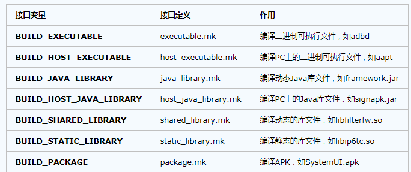
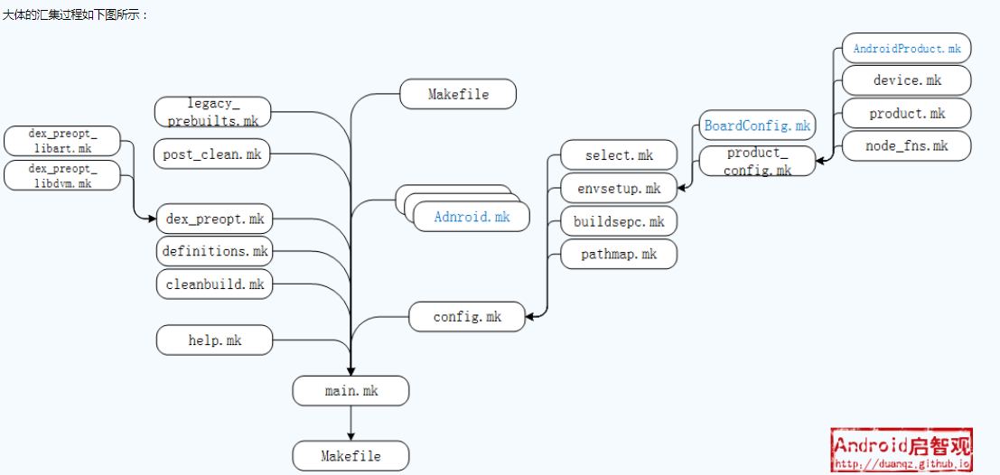
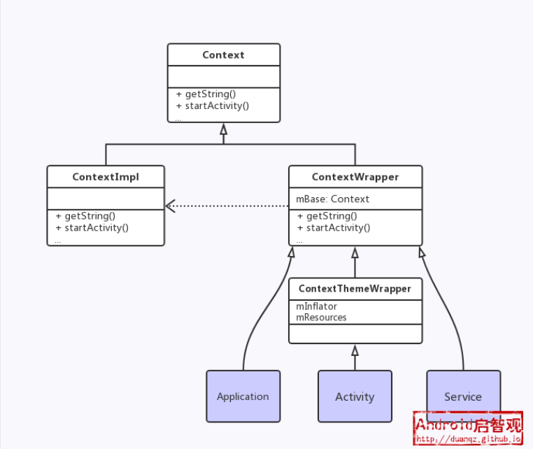

1

https://github.com/tab-pi/platform_manifest

初始化repo。需要挂着梯子。

```
repo init -u https://github.com/tab-pi/platform_manifest -b nougat
```

同步

```
repo sync
```

然后编译kernel。

````
cd kernel/rpi
# 调用merge_config.sh，看名字，这个脚本是合并配置。
ARCH=arm scripts/kconfig/merge_config.sh arch/arm/configs/bcm2709_defconfig android/configs/android-base.cfg android/configs/android-recommended.cfg
# 进行编译
ARCH=arm CROSS_COMPILE=arm-linux-gnueabihf- make zImage
ARCH=arm CROSS_COMPILE=arm-linux-gnueabihf- make dtbs
````

安装mako模块。

```
sudo apt-get install python-mako
```

编译Android源代码

```
source build/envsetup.sh
lunch rpi-eng
make ramdisk systemimage
```

# 准备SD卡

SD卡的分区如下：

```
p1: 512MB，作为boot分区。fat32格式。
p2： 1024MB，作为system分区。ext4格式。
p3: 512MB。作为cache分区。ext4格式。
p4：剩余部分，作为data分区。ext4格式。
```

用dd命令把镜像烧录到SD卡的对应分区里。

```
cd out/target/product/rpi3
sudo dd if=system.img of=/dev/mmcblk0p2 bs=1M
```

拷贝kernel和ramdisk到boot分区。

```
sudo mount /dev/mmcblk0p1 /mymnt
cp device/brcm/rpi3/boot/* /mymnt
cp kernel/rpi/arch/arm/boot/zImage /mymnt
cp kernel/rpi/arch/arm/boot/bcm2710-rpi-3-b.dtb /mymnt
cp kernel/rpi/arch/arm/dts/overlays/vc4-kms-v3d.dtbo /mymnt/overlays
cp out/target/product/rpi3/ramdisk.img /mymnt
```

在config.txt里加上下面的语句，打开hdmi。

```
hdmi_group=2
hdmi_mode=85
```


写一个copy_boot.sh脚本。

```
#!/bin/sh

AOSP_DIR=/home/teddy/aosp-rpi3
MNT_DIR=/mymnt
FAT_DEV=/dev/sdc1

umount $MNT_DIR
mount $FAT_DEV $MNT_DIR
mkdir -p $MNT_DIR/overlays


sudo cp $AOSP_DIR/device/brcm/rpi3/boot/bootcode.bin      $MNT_DIR
sudo cp $AOSP_DIR/device/brcm/rpi3/boot/cmdline.txt      $MNT_DIR
sudo cp $AOSP_DIR/device/brcm/rpi3/boot/config.txt      $MNT_DIR
sudo cp $AOSP_DIR/device/brcm/rpi3/boot/fixup.dat      $MNT_DIR
sudo cp $AOSP_DIR/device/brcm/rpi3/boot/start.elf      $MNT_DIR


sudo cp $AOSP_DIR/kernel/rpi/arch/arm/boot/zImage    $MNT_DIR
sudo cp $AOSP_DIR/kernel/rpi/arch/arm/boot/dts/bcm2710-rpi-3-b.dtb   $MNT_DIR
sudo cp $AOSP_DIR/kernel/rpi/arch/arm/boot/dts/overlays/vc4-kms-v3d.dtbo  $MNT_DIR/overlays
sudo cp $AOSP_DIR/out/target/product/rpi3/ramdisk.img    $MNT_DIR

# umount $MNT_DIR

```


# 使用清华源

下载了很久都没有下载完成。

所以打算修改为清华源来进行同步。

只需要改这一行就可以了。

```
   <remote  name="aosp"
-           fetch="https://android.googlesource.com"
+           fetch="https://aosp.tuna.tsinghua.edu.cn"
```

可以在之前的同步到一半的基础上继续进行同步。

repo sync过程中，会出现的问题：

1、UnicodeDecodeError 问题

这个可以通过修改sitecustomize.py文件。这个文件在你的python库目录下。locate找一下就可以找打。

在最前面加上：

```
import sys
sys.setdefaultencoding("utf-8")
```

2、fatal: 过早的文件结束符（EOF）

这个网上说是网络问题。多次尝试就好了。

可以试一下这个命令：

```
repo sync -f -j4
```

用这个脚本反复下载，应该可以成功。

```
#!/bin/bash  
  
 echo ¨================start repo sync===============¨  
  
 repo sync -f -j4  
  
 while [ $? == 1 ]; do  
 echo ¨================sync failed, re-sync again=============¨  
 sleep 3  
 repo sync -f -j4  
 done  
```

使用清华源，还是有很多的错误。算了。我还是切换到谷歌源，慢慢下。


# android-rpi

对应url：https://github.com/android-rpi

来自于android-rpi这个项目下的project有3个：

```
hardware/rpi
external/mesa3d
external/drm_gralloc
```


# tab-pi

代码：https://github.com/tab-pi


来自这个项目的project有：

```
kernel/rpi 这个也是重点。
device/brcm/rpi3  这个是重点。
vendor/tab-pi 
frameworks/native
frameworks/base
hardware/broadcom/libbt
```


看看device/brcm/rpi3目录。这个是新增自己产品的方法的一个参考。

```
hlxiong@hlxiong-VirtualBox:~/work3/aosp-rpi3/device/brcm/rpi3$ tree -L 1
.
├── AndroidProducts.mk
├── audio_policy_configuration.xml
├── bluetooth
├── BoardConfig.mk
├── boot
├── firmware
├── fstab.rpi3
├── Generic.kl
├── init.rpi3.rc
├── init.usb.rc
├── overlay
├── README.md
├── rpi3_core_hardware.xml
├── rpi3.mk
├── sepolicy
├── system.prop
├── ueventd.rpi3.rc
└── vendorsetup.sh 这个下面新增了3个选项，在lunch的时候可以看到。add_lunch_combo rpi3-eng 这样。
```


# 运行测试

按照上面的说明，把4个分区都写入到SD卡。修改config.txt的参数。就可以正常启动了。

鼠标键盘都是正常的。

需要注意的是：

内核的是需要自己手动编译的，上面也有写了。


看看树莓派的kernel，相比于标准的kernel代码，改动了什么。

这个是自动挂载U盘。在fstab里。

```
/devices/platform/soc/*.usb/usb*     auto   auto      defaults   
```


这个下面就一个脚本，就是编译kernel的命令在里面，怎样才能调用到呢？

```
<project path="vendor/tab-pi" name="vendor_tab-pi" revision="nougat" remote="tab-pi"/>
```


framework native，也是用的tab-pi修改的。这个改了些什么？


# 配置分析

以device/brcm/rpi3目录下的rpi3.mk来分析。

```
USE_OEM_TV_APP := true
$(call inherit-product, device/google/atv/products/atv_base.mk)
```

这个表示继承谷歌的tv标准配置。

atv_base.mk里的配置有：

```
PRODUCT_IS_ATV := true

PRODUCT_PACKAGES := \
    TvProvider \
    TvSettings \
    tv_input.default
# 这个package在这个目录下：aosp-rpi3/packages/providers/TvProvider
PRODUCT_COPY_FILES := \
    device/google/atv/permissions/tv_core_hardware.xml:system/etc/permissions/tv_core_hardware.xml
# 这个包括位置、画中画、语音识别等特征。
DEVICE_PACKAGE_OVERLAYS := \
    device/google/atv/overlay
# 这个会覆盖。
PRODUCT_PACKAGES += \
    ContactsProvider \
    DefaultContainerService \
    UserDictionaryProvider \
    
PRODUCT_PACKAGES += \
    BasicDreams \
    CalendarProvider \
    
PRODUCT_PACKAGES += \
    Bluetooth \
    SystemUI \
    librs_jni \
    
BOARD_SEPOLICY_DIRS += device/google/atv/sepolicy
$(call inherit-product-if-exists, frameworks/base/data/sounds/AllAudio.mk)
$(call inherit-product-if-exists, frameworks/webview/chromium/chromium.mk)
$(call inherit-product, $(SRC_TARGET_DIR)/product/core_minimal.mk)
```

继续回到rpi3.mk

```
PRODUCT_NAME := rpi3
PRODUCT_DEVICE := rpi3
PRODUCT_BRAND := Android
PRODUCT_MODEL := Raspberry Pi 3
PRODUCT_MANUFACTURER := brcm
```

```
# 这个定义了dalvik.vm的一些参数。
include frameworks/native/build/tablet-7in-hdpi-1024-dalvik-heap.mk
```

```
DEVICE_PACKAGE_OVERLAYS := device/brcm/rpi3/overlay
PRODUCT_AAPT_PREF_CONFIG := tvdpi
PRODUCT_CHARACTERISTICS := tv
```


# AOSP配置一个新的product

看了上面rpi3的配置，再看看具体怎样配置一个新的产品。

步骤1

在vendor目录下新建一个company_name的目录。

步骤2

在company_name目录下再新建一个product目录。


执行source build/envsetup.sh的时候，会搜索这些目录下的vendorsetup.sh脚本。

````
vendor/*/vendorsetup.sh 
vendor/*/*/vendorsetup.sh 
device/*/*/vendorsetup.sh
````

代码实现是：

```
# Execute the contents of any vendorsetup.sh files we can find.
for f in `test -d device && find -L device -maxdepth 4 -name 'vendorsetup.sh' 2> /dev/null | sort` \
         `test -d vendor && find -L vendor -maxdepth 4 -name 'vendorsetup.sh' 2> /dev/null | sort` \
         `test -d product && find -L product -maxdepth 4 -name 'vendorsetup.sh' 2> /dev/null | sort`
do
    echo "including $f"
    . $f
done
unset f
```


我们在vendorsetup.sh里添加这样三行：

```
add_lunch_combo rpi3-eng
add_lunch_combo rpi3-userdebug
add_lunch_combo rpi3-user
```


envsetup.sh执行过程分析：

1、搜索device等目录，搜索vendersetup.sh，并source 执行。

2、addcompletions。这个是检查bash版本要高于4，搜索sdk/bash_completion目录下以.sh结尾的文件，并source执行。当前这个目录下只有一个adb.sh文件。

这一步的作用就是添加一下命令补全。

这个文件写得并不太好读。函数和执行的脚本内容穿插着的。

首先应该是这个：

```
add_lunch_combo aosp_arm-eng
add_lunch_combo aosp_arm64-eng
add_lunch_combo aosp_mips-eng
add_lunch_combo aosp_mips64-eng
add_lunch_combo aosp_x86-eng
add_lunch_combo aosp_x86_64-eng
```


# sonng编译系统

在 Android 7.0 发布之前，Android 仅使用 [GNU Make](https://www.gnu.org/software/make/) 描述和执行其构建规则。

Make 构建系统得到了广泛的支持和使用，

但在 Android 层面变得缓慢、容易出错、无法扩展且难以测试。

[Soong 构建系统](https://android.googlesource.com/platform/build/soong/+/refs/heads/master/README.md)正好提供了 Android build 所需的灵活性。

因此，平台开发者应尽快从 Make 切换到 Soong

[Soong 构建系统](https://android.googlesource.com/platform/build/soong/+/refs/heads/master/README.md)是在 Android 7.0 (Nougat) 中引入的，旨在取代 Make。

它利用 [Kati](https://github.com/google/kati/blob/master/README.md) GNU Make 克隆工具和 [Ninja](https://ninja-build.org/)构建系统组件来加速 Android 的构建。

如需了解从 Make 转换到 Soong 所需执行的修改，请参阅 [Android.mk 编写人员须知的构建系统变更](https://android.googlesource.com/platform/build/+/master/Changes.md)。

对应的脚本文件是bp结尾的。表示blueprint。

# kati

Kati 是为了提高Android 编译速度而产生的实验性的GNU make 克隆的工具。

本身没有提供快速编译，**而是将Makefile 文件转换为Ninja 文件，再通过[Ninja](https://blog.csdn.net/shift_wwx/article/details/84770716) 进行编译提速。**

Kati 最开始在Go 中实现的，期初开发者认为Go 可以获取足够的性能，

但是最终却是使得Kati 的Go 版本变慢了。

所以后来Kati 用C++重写实现。

观看现在Kati 实现的代码，其中除了C++ 实现，还要部分的Go 和sh，这应该是考虑之后的最好性能。

目前，Kati的主要模式是--ninja模式。 Kati自己不用执行build命令，而是生成build.ninja文件，而ninja实际上运行命令。

kati的源代码在build/kati/目录下。

另外，Android 也再带编译好的kati 文件：

```
prebuilts/build-tools/linux-x86/bin/ckati
```

在Android项目中，ckati会在编译过程中，自动被使用，无需操心。

单独使用时，在包含Makefile的目录下，执行ckati，

效果与make基本相同。 

执行ckati --ninja，

可以根据Makefile生成build.ninja文件，并且附带env.sh和ninja.sh。 

通过env.sh来配置环境，通过执行./ninja.sh来启动Ninja、使用build.ninja编译。

 生成的ninja.sh文件，主要内容如下。

```
. ./env.sh
exec ninja -f ./build.ninja "$@"
```

后面也出现了Blueprint 替代了现在的Makefile，都是为了编译的快速、简便。以后Android 中也有可能不在需要Makefile，也一起期待吧！


**重新打包系统镜像**
编译好指定模块后,如果我们想要将该模块对应的apk集成到系统镜像中,

**需要借助`make snod`指令重新打包系统镜像,**

这样我们新生成的system.img中就包含了刚才编译的Launcher2模块了.重启模拟器之后生效.

**单独安装模块**
我们在不断的修改某些模块,总不能每次编译完成后都要重新打包system.img,

然后重启手机吧?有没有什么简单的方法呢?
在编译完后,

**借助adb install命令直接将生成的apk文件安装到设备上即可,**

相比使用make snod,会节省很多事件.

**SDK编译**

如果你需要自己编译SDK使用,很简单,只需要执行命令`make sdk`即可.


Android系统自带的apk文件都在`out/target/product/generic/system/apk`目录下;
一些可执行文件(比如C编译的执行),放在`out/target/product/generic/system/bin`目录下;
动态链接库放在`out/target/product/generic/system/lib`目录下;
硬件抽象层文件都放在`out/targer/product/generic/system/lib/hw`目录下.


### Android 的功能模块绝大部分是 C/S 架构


Android编译系统也是基于**make**的，

要编译出整个Android系统的镜像文件并打包成刷机包(OTA Package)，

编译出SDK和文档(JavaDoc)，

同时，Android引入了很多第三方开源项目，需要兼顾不同模块的编译，

仅仅是这些就已经够让Android编译系统受苦了，

还别提支持不同设备厂商的硬件类型，方便设备厂商进行定制这些兼容性、扩展性、编译效率的问题。

Android编译系统的复杂度可见一斑，纵观整个编译，除了大量的编译规则文件(**Makefile**文件片段)，

还有很多Shell和Python脚本组织在一起，基于**make**，

但又不同于已有传统项目的编译系统，Android有自己的一套编译机制。


Android编译系统的设计背景是什么？ 这涉及到Android编译系统设计的意图。
Android编译系统的设计原理是什么？ 这涉及到Android编译系统运转的内在机制。


同所有基于**make**的编译系统一样，Android也需要**Makefile**文件来定义编译规则和编译顺序。但与大多数编译系统不同的是，Android并不是**Recursive Make**的，那么什么是**Resursive Make**呢？

**Resurvise Make**会导致编译系统“做得太少(do too little)”或“做得太多(do too much)”， “do too little”会导致最终编译产物可能是错误的结果，而“do too much”会导致编译效率下降。


由于**Resurvise Make**的缺陷，Android采用了**Non-Resursive Make**的方式，

**将所有的编译规则集中于一个Makefile中**，可以想象最终成型的这个Makefile是极其庞大的。 

为了提升编译效率和灵活性，需要对模块的编译进行控制：

**单个模块可以单独进行编译，不需要的模块不会被重新编译，以便节省编译时间。**


**Makefile片段化**：最终的规则集中于一个**Makefile**，并不意味着编译系统会维护这么大一个**Makefile**。为了提高代码的重复利用率，编译系统包含很多**Makefile片段**，最终通过**include**将片段包含进来。 每一个待编译的模块都会有一个**Android.mk**，其内容也是**Makefile**片段。


在Android源码的根目录有一个**Makefile**文件，有效内容只有一行：

```
include build/core/main.mk
```

所有的编译规则都定义在[build/core/main.mk](https://android.googlesource.com/platform/build/+/master/core/main.mk)文件中，最终所有的**Makefile**片段都将汇聚在这一个文件中。


从Android源码来看，编译系统的核心功能位于**build/core/**目录， 在device和vendor目录下，存放了与具体机型相关的配置，这些配置信息都是**.mk**文件的形式存放的(譬如**BoardConfig.mk**和**AndroidProducts.mk**)， 另外，每一个模块的编译配置信息都是以独立的**Android.mk**文件的形式分散在各个模块的子目录中。


要使Android编译系统运转起来，首先需要经过初始化，其实就是完成所有参数的配置。

Android编译系统的配置，可以分为四个层级，从下到上依次是：

架构级(Architecture)，

芯片级(Board)，

产品级(Product),

模块级(Module)

这几个层级的配置并非独立的，而是在不同参数配置下相互影响的。Android提供两种方式来进行参数配置：运行*envsetup.sh*或配置*buildspec.mk*

该文件需要置于Android源码的根目录，Android提供一个配置模板[build/buildspec.mk.default](https://android.googlesource.com/platform/build/+/master/buildspec.mk.default)， 只需要将拷贝到根目录，重命名后，根据需要修改文件内容便可完成参数的配置。

无论是采用哪种方式，都会涉及到以下几个重要的参数：

```
TARGET_PRODUCT
TARGET_BUILD_VARIANT
TARGET_BUILD_TYPE
TARGET_TOOLS_PREFIX 编译工具链的路径前缀。默认情况下，Android使用prebuilts目录下的工具，但通过这个值也可自行定制为其他目录。
```

当**TARGET_PRODUCT**设定后，编译系统就可以基于它获取其他参数了。这个产品是哪个体系结构，哪个芯片，内核的命令参数是什么？ 这些硬件相关的参数都是通过**BoardConfig.mk**来配置的，编译系统会搜寻device和vendor目录下的**$(TARGET_DEVICE)/BoardConfig.mk**，这样就能找到对应产品的的芯片级(Board)配置了。

树莓派的就在device/brcm/rpi3目录下。





编译系统的运行过程可以分为两部分：

- **合成最终的Makefile**：零散的**Makefile**片段，会按照引用关系汇集到**main.mk**中，作为最终编译的**Makefile**
- **根据依赖关系逐步构建出最终产物**：**Makefile**的编译规则最终成型为一个**DAG**，**make**会按照*“后根顺序(post-order)”*来遍历**DAG**，被依赖的目标总是先被执行


通过**Makefile**的*include*语法，就能将其他**Makefile**片段包含到当前**Makefile**文件中来，当我们在Android目录下执行**make**命令时，实际上输入文件是根目录下的**Makefile**，所有的片段最终都汇集到该文件中。




*main.mk*会做编译环境检查，定义最重要的编译目标(droid)，**依次**引入其他功能片段:

- *help.mk*，最优先引入的片段，文件内容很简单，就是定义了一个名为**help**的目标，通过输入`make help`命令，就可以看到该目标的输出结果是一些最主要的**make**目标的帮助信息。

- *config.mk*，文件内容很庞大，目的就是为了配置编译环境。该文件定义了用于其他模块编译的常量(BUILD_JAVA_LIBRARY, CLEAR_VARS等)，也定义了编译时所依赖工具的本地路径(aapt, minigzip等)，同时也会引入与基于机型配置相关的其他片段(BoardConfig.mk, AndroidProducts.mk等)。

- *cleanbuild.mk*，定义了**installclean**这个编译目标，不同于**clean**，执行`make installclean`的时候，并不会完整的删除*out/*目录，而是仅仅删除与当前**TARGET_PRODUCT, TARGET_BUILD_VARIANT, PRODUCT_LOCALES**这属性关联到的编译产出。通俗一点来说，就是删除*out/target/product/*目录下本次机型编译的产物，*out/host*目录下的文件是保留下来的。

- *definitions.mk*，定义了大量的函数，这些函数都是编译系统的其他文件将用到的。譬如：my-dir， all-subdir-makefiles， find-subdir-files等，通过**Makefile**的*$(call func_name)*就能调用这些函数。

- *dex_preopt.mk*，为了提升代码的运行效率，Android会对可执行文件做优化，即将**dex**格式的文件转换为**odex**格式的文件。在ART虚拟机下，仍然采用**dex(Dalvik Executable)**和**odex(Optimized Dalvik Executable)**这个文件的命名方式，但实际上ART与Dalvik的文件格式是不同的。

- *Android.mk*，Android有全编译和模块编译之分：

  - 全编译，会通过[build/tools/findleaves.py](https://android.googlesource.com/platform/build/+/master/tools/findleaves.py)这个脚本将所有模块的*Android.mk*加载到一个名为 **subdir_makefiles**这个变量中，然后逐个引入**$subdir_makefiles**中的**Makefile**片段;
  - 模块编译，是通过命令解析将待编译模块的*Android.mk*文件加载到**ONE_SHOT_MAKEFILE**这个变量中，编译时，仅仅是引入**ONE_SHOT_MAKEFILE**中的**Makefile**片段。

  *Android.mk*的编写模板基本都是一致的,它会引入很多编译系统已经初始化好的变量，譬如CLEAR_VARS， BUILD_JAVA_LIBRARY, 其实就是引入变量所对应的*.mk*文件，所以*Android.mk*的生成过程，也是一个**Makefile**片段的汇集过程。

- *post_clean.mk*，在引入待编译模块后，就可以定义模块的清除规则了。该片段定义了基于上一次编译产出的清除规则，譬如，某个模块的AIDL文件或者资源发生了变化，那再次编译这个模块时，就需要清除上一次的编译产物。

- *legacy_prebuilts.mk*，定义了**GRANDFATHERED_ALL_PREBUILT**变量，表示不需要经过编译的预装文件，譬如gps.conf(GPS配置文件), radio.img(射频分区镜像文件)，这些文件都是预编译好的，只需要拷贝到编译产出即可。Android定义了一个默认的**PREBUILT列表**，而且不希望第三方改动这个列表。当第三方有预编译文件，但又不在**PREBUILT列表**中时，就需要通过**PRODUCT_COPY_FILES**这个变量来指定了。

- *Makefile*，不同于AOSP根目录下的**Makefile**，这个*Makefile*位于[build/core](https://android.googlesource.com/platform/build/+/master/core)目录下，Android官方对这个文件的解释是”定义一些杂乱的编译规则(miscellaneous rules)”，实际上，这个文件相当重要，诸如system.img, recovery.img, userdata.img, cache.img的目标定义都在这个文件中，更笼统点说，*out/target/product/PRODUCT_NAME/*目录下大部分的编译产出都是由该文件定义的。


Android有意淡化进程的概念，在开发一个Android应用程序时，**通常都不需要关心目标对象运行在哪个进程**，

只需要表明意图(Intent)，

譬如拨打电话、查看图片、打开链接等；

也不需要关心系统接口是在哪个进程实现的，只需要通过Context发起调用。

对于一个Android应用程序而言，

Context就像运行环境一样，无处不在。

有了Context，一个Linux进程就摇身一变，

成为了Android进程，变成了Android世界的公民，享有Android提供的各种服务。

那么，一个Android应用程序需要一些什么服务呢？

- 获取应用资源，譬如：drawable、string、assets
- 操作四大组件，譬如：启动界面、发送广播、绑定服务、打开数据库
- 操作文件目录，譬如：获取/data/分区的数据目录、获取sdcard目录
- 检查授予权限，譬如：应用向外提供服务时，可以判定申请者是否具备访问权限
- 获取其他服务，有一些服务有专门的提供者，譬如：包管理服务、Activity管理服务、窗口管理服务

在应用程序中，随处都可访问这些服务，这些服务的访问入口就是Context。

Context是一个抽象类，提供接口，用于访问应用程序运行所需服务，譬如启动Activity、发送广播、接受Intent等。Android是构建在Linux之上的，然而对于Android的应用开发者而言，已经不需要关心Linux进程的概念了，正是因为有了Context，为应用程序的运行提供了一个Android环境，开发者只需要关心Context提供了哪些接口。


在类的世界里面，要为一个类增加新的功能，

最直接的方式就是**继承**，子类可以基于父类进行扩展。

然而，**当要增加的功能维度有很多，并且功能相互叠加的时候，要扩展的子类会变得非常多。**

在GOF设计模式里面，把**继承**看成**静态**的类扩展，扩展功能的增多会导致子类膨胀。为了有效缓解这种情况，便产生了**动态**的类扩展：`修饰器模式(Decorator Pattern)`


理解Decorator模式，有助于大家理解Context类簇的设计，前文说过Context是一个抽象类，围绕Context还有很多实现类，这些类的结构设计就是Decorator模式。



一个典型的Decorator模式，基类**Context**定义了各种接口，**ContextImpl**负责实现接口的具体功能。对外提供使用时，**ContextImpl**需要被包装(Wrapper)一下，这就有了**ContextWrapper**这个修饰器。修饰器一般只是一个传递者，修饰器所有的方法实现都是调用具体的实现类**ContextImpl**，所以修饰器**ContextWrapper**需要持有一个**ContextImpl**的引用。


修饰器存在的价值是为了扩展类的功能，**Context**已经提供了丰富的系统功能，但仍不能满足最终应用程序编程的需要，因此Android又扩展了一些修饰器，包括**Application**、**Activity**和**Service**。虎躯一震，这些东西竟然就是**Context**，原来**Context**真的是无处不在啊！在**Activity**中调用startActivity启动另外的界面，原来就是通过父类**Context**发起的调用！


**Application**扩展了应用程序的生命周期，**Activity**扩展了界面显示的生命周期，**Service**扩展了后台服务的生命周期，它们在父类**Context**的基础上进行了不同维度的扩展，同时也仍可以将它们作为**Context**使用，这可以解释很多**Applicaiton、Activity和Service**的使用方式


但很多问题也随之而来：

- 为什么四大组件的另外两个**BroadcastReceiver**和**ContentProvider**不是**Context**的子类呢？
- 为什么**Application、Activity和Service**不直接继承**ContextImpl**呢，不是更直接吗？所谓的Decorator模式，也没看到有多大实际用处啊？

ContentProvider和BroadcastReceiver都需要把Context作为参数传入，虽然它们不继承于Context，但它们都依赖于Context，换个角度看：它们就是修饰器，包装了Context。因为这两个组件在使用上与Activity和Service存在较大的区别，所以它们的实现方式存在较大差异。

往深一步理解，Decorator模式的优势也体现出来了，譬如Application、Activity和Service都可以作为BroadcastReceiver的载体，只需要通过它们各自的Context去注册广播接收器就可以了，将BroadcastReceiver修饰在它们之上，就形成了新的功能扩展，而不是去扩展一个可以接收广播的Applicaiton、Activity或Service类。

Decorator模式在Android中随处可见，除了Context类簇，还有Window类簇。


**Context**本身作为一个最高层的抽象类，仅仅是定义接口，方法的实现都在**ContextImpl**中。因为**Context**是为应用程序设计的，笔者试图通过两条主线来渗透**Context**的各项知识点：

- **第一条主线**：应用程序Application的Context构建过程
- **第二条主线**：应用界面Activity的Context构建过程


参考资料

1、[ROM] [Testing] Tab-Pi | AOSP/Android TV for Raspberry Pi 3 android-7.1.2_r17

https://forum.xda-developers.com/raspberry-pi/development/rom-tab-pi-aosp-android-tv-raspberry-pi-t3593506

2、Configuring a New Product

https://wladimir-tm4pda.github.io/porting/build_new_device.html

3、Android Device

https://elinux.org/Android_Device

4、Soong 构建系统

https://source.android.com/setup/build

5、Android中Kati简介

https://blog.csdn.net/shift_wwx/article/details/84784567

6、如何阅读android framework源码

https://www.cnblogs.com/suxiaoqi/p/5109881.html

7、

https://www.cnblogs.com/0616--ataozhijia/p/8561796.html

8、Android FrameWork 学习之Android 系统源码调试

https://www.cnblogs.com/liumce/p/8027559.html

9、

https://www.cnblogs.com/android-blogs/p/5867292.html

10、Android编译系统(1)-概览

这个非常好。

https://www.cnblogs.com/ztguang/p/12644302.html

11、

https://duanqz.github.io/2015-08-30-Intro-to-automerger

12、

https://www.cnblogs.com/jukan/p/6699534.html