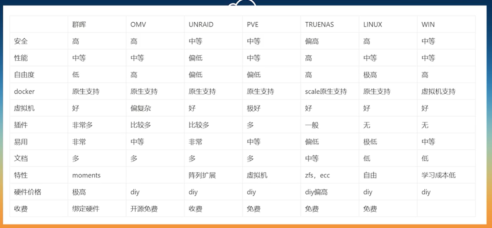

这两天升级了一下telegram，然后发现之前下载的视频都丢了。

真是坑爹。

看来还是要自己搭建一个简单的nas。

我的需求就很简单：

1、手机这边扫描指定目录下的东西，然后读取nas上对应目录的情况。

2、如果发现手机这边有新增的文件，那么手机这边把新增的文件上传到nas上。

3、手机这边删除了文件，对nas上的情况不产生影响。

我的主要目的就是把telegram上的视频自动上传保存，避免手机这边丢失文件。

先尽量找有没有现成的方案，如果没有，那就要自己写一个简单的版本。

初步设计的逻辑是这样：

```
手机这边在晚上两点启动对文件的扫描。
（如果可以用python实现当然是最好的）
发现有新增的文件（nas上先通过ls得到一个文件列表，拿下来对比查询），那么就上传到nas上。
尽量简单。
```

不过先还是进来找现成的方案，写代码也要花时间。

对于NAS的解决方案有很多，除了一站式的群晖/威联通，还有unraid，freeNas（现在改为TrueNas），OMV，黑群晖等，甚至linux也可以。




我的树莓派安装了Raspbian系统，为了减少折腾。我就直接通过脚本安装omv了。

安装时要翻墙，不然有些东西下载不下来。

我现在树莓派上最简单的翻墙方式，就是把我的手机的openclash打开，使能它的局域网连接功能。

然后树莓派命令行里配置：

```
export http_proxy=192.168.1.64:6666
export https_proxy=192.168.1.64:6666
```

就可以了。不用在树莓派配置太多东西。

因为都是临时用一下。

```
wget -O - https://cdn.jsdelivr.net/gh/OpenMediaVault-Plugin-Developers/installScript@master/install | sudo bash
```

omv其实是一套php写的网页系统。

yacht这个跟portainer类似，都是docker的图形化管理界面。

```
docker run -d \
   --name yacht \
   -p 8181:8000 \
   -v /var/run/docker.sock:/var/run/docker.sock \
   -v /data/docker/yacht/config:/config \
   --restart unless-stopped \
   selfhostedpro/yacht
```

各种东西把我的树莓派搞得很乱了。

可能更加合适的方法是：

网上搜索树莓派backup 手机数据。

然后学习相关的经验，然后自己写一套系统出来。

尽量简单。

先要找到一个Android定时执行脚本的工具。

其实就Android这边写一个脚本就可以了。

shell和python就可以了。

估计几十行脚本就可以。不会花太多的时间。


难道是硬盘导致系统没有起来？

我还是换成了sulinggg的openwrt的镜像了。

把这个用法就行了。懒得折腾太多的系统。

就用squashfs的版本，

硬盘插入后挂载在这个目录下：

```
/dev/sda                915.8G      1.8G    867.4G   0% /mnt/sda
```


用cx文件管理器来进行访问看看。

可以访问。现在这个环境就是很简单的。

然后要在Android上运行脚本的方案。

# 用syncthing同步文件

openwrt上搜索安装：

```
opkg install syncthing
opkg install luci-app-syncthing
```

手机上用f-droid这个应用市场来安装syncthing-fork这个App。

然后认真配置一下，就可以把进行自动的文件同步。

# ssh让手机termux和openwrt可以互相免密码登陆

先都是生成key：

```
ssh-keygen
```

直接回车，不用设置任何东西。

然后把生成的公钥拷贝到目标上去。192.168.1.64 这个是我的手机的ip。

```
ssh-copy-id -i ~/.ssh/id_rsa.pub root@192.168.1.64
```

但是我的openwrt上没有ssh-copy-id这个命令。

还有其他简单方式吗？

openwrt上的sshd的是dropbear，它配置免密码登陆的方式不一样。

```
/etc/dropbear/authorized_keys
```

当前我还没有任何授权的机器登陆过来。所以不存在这个文件。没关系，不管。

在我的手机termux上这样执行：

```
cat ~/.ssh/id_rsa.pub | ssh root@192.168.1.2 "cat >> /etc/dropbear/authorized_keys"
```

然后手机就可以免密码登陆openwrt了。

现在再看openwrt免密码远程到手机上来。

（这个什么情况下需要？在需要写一些要在手机上执行的脚本的时候方便一点，直接在openwrt上用vim写代码）

在openwrt上执行这个命令：

```
cat ~/.ssh/id_rsa.pub | ssh u0_a426@192.168.1.64 -p 8022 "cat >> ~/.ssh/authorized_keys"
```

但是执行后还是不行。算了先不管了。

这个场景用得少。


## 参考资料

1、

https://blog.csdn.net/zdx1996/article/details/114930897

2、

https://blog.csdn.net/cuma2369/article/details/107667122

3、

https://zhuanlan.zhihu.com/p/44441687

1、

https://www.zhihu.com/question/498148501/answer/2258930575

2、

https://www.bilibili.com/video/BV1Na411j7N1

3、Automatically backup the iPhone to the Raspberry Pi

这个是写脚本进行备份的。

https://valinet.ro/2021/01/20/Automatically-backup-the-iPhone-to-the-Raspberry-Pi.html

4、Android运行脚本与定时工具

https://amyangfei.me/2013/02/08/android-taskscheduler-and-scripting/