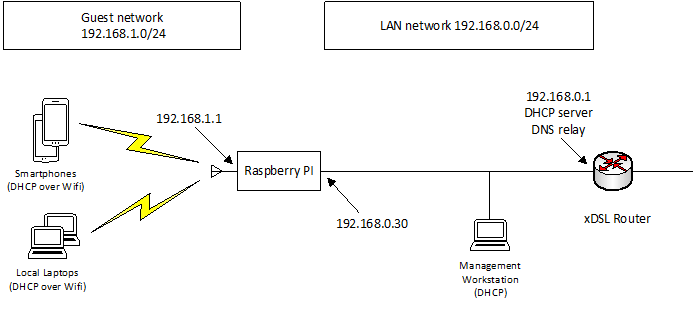

openwrt官方还没有对树莓派提供支持，但是openwrt的一个分支版本LEDE已经支持了。

# 1. 什么是LEDE

2016年5月，openwrt用户社区发布了LEDE。LEDE 是Linux Embedded Development Environment的缩写。它的特点是关注透明度，协作和分权。

官网地址是：https://lede-project.org/

树莓派3对应的镜像网上可以搜索到。我的百度网盘保存了一份。

# 2. 安装镜像到U盘

因为我只有一张SD卡，但是却有不少的U盘，所以我都把临时的系统安装到U盘。U盘启动速度慢很多。

用win32DiskImager直接把镜像写入都U盘，改一下cmdline.txt等配置。就可以从U盘启动系统了。

安装后，开机界面是这样的：

```
BusyBox v1.25.1 () built-in shell (ash)

     _________
    /        /\      _    ___ ___  ___
   /  LE    /  \    | |  | __|   \| __|
  /    DE  /    \   | |__| _|| |) | _|
 /________/  LE  \  |____|___|___/|___|                      lede-project.org
 \        \   DE / -----------------------------------------------------------
  \    LE  \    /   Reboot (17.01.2, r3435-65eec8bd5f)
   \  DE    \  /    Build By:Angelina_ACE
    \________\/    -----------------------------------------------------------

=== WARNING! =====================================
There is no root password defined on this device!
Use the "passwd" command to set up a new password
in order to prevent unauthorized SSH logins.
--------------------------------------------------
root@LEDE:/# 
```

reboot命令没有效果。

默认用户只有root，密码是空的。

luci界面的用户名和密码和这个一样。

# 3. 怎么把电脑连接上去？

直接把电脑的网线跟树莓派的网口直连，树莓派这个时候就扮演了路由器的角色，它会给电脑分配一个ip。我碰到了如下几个问题：

1、电脑没有成功得到ip地址。

把电脑的本地连接禁用再启用就好了。

2、电脑可以ping通树莓派，树莓派无法ping通板端。

把电脑的防火墙关闭就好了。

3、再chrome里访问192.168.1.1无法得到管理界面。

我用搜狗浏览器试一下就好了。

经过上面几个问题，现在可以进入到管理界面了。

网页上一个大大的警示，要求你改密码，好吧。那就改了。

# 4. 管理界面分析

管理界面右侧的树状结构是这样：

```
状态
	总览：这个是系统的一些基本信息
	防火墙：几张复杂的表。
	路由表
	系统日志
	内核日志
	进程：可以在这里进行杀死进程的操作
	实时信息：
	homenet：
	VNStat流量监控
系统：
	系统
	管理权
	软件包
	启动项
	计划任务
	时间同步
	挂载点
	webshell
	led配置
	备份升级
服务：就是各种插件

```


# 重新配置

现在openwrt和lede又合并了。

我下载树莓派最新的openwrt镜像。是19.07的。

但是烧录后的配置，发现有不少坑。

 因为默认情况下、刚开始安装的时候，镜像默认将树莓派的有线网卡设置为 `br-lan` 模式，所以如果你想将树莓派作为 AP 的话，需要将树莓派连接到电脑上(相应网卡为 DHCP 获取 IP 地址），然后访问 `http://192.168.1.1` ，然后配置 root 密码。

用笔记本有线直接跟树莓派的有线口进行直连。

然后用192.168.1.1访问树莓派。

配置开启无线AP。

默认有线是作为了lan口。我们是需要改成wan口的。

而要把无线作为lan口。

直接在板端用串口配置文件。

改/etc/config/network 和/etc/config/wireless这2个文件就好了。

```
root@OpenWrt:/# cat /etc/config/network 

config interface 'loopback'
        option ifname 'lo'
        option proto 'static'
        option ipaddr '127.0.0.1'
        option netmask '255.0.0.0'

config globals 'globals'
        option ula_prefix 'fd9e:8e63:1927::/48'

config interface 'lan'
        option type 'bridge'

config interface 'WAN'
        option proto 'dhcp'
        option ifname eth0
```

/etc/config/wireless后面改成这样。

```
config wifi-iface 'wifinet0'
        option ssid 'OpenWrt'
        option encryption 'none'
        option device 'radio0'
        option mode 'ap'
        option network 'lan'
```

重启，板端的有线可以获取到ip地址。板端可以ping通百度。

手机上可以搜索到openwrt的热点。但是连接是一直获取不到ip地址。

是因为我把lan口没有配置ip。改成下面这样。

```
root@OpenWrt:/# cat /etc/config/network 

config interface 'loopback'
        option ifname 'lo'
        option proto 'static'
        option ipaddr '127.0.0.1'
        option netmask '255.0.0.0'

config globals 'globals'
        option ula_prefix 'fd9e:8e63:1927::/48'

config interface 'lan'
        option type 'bridge'
        option proto 'static'
        option ipaddr '192.168.1.1'
        option netmask '255.255.255.0'
        option dns '114.114.114.114'
        option ip6assign '60'

config interface 'WAN'
        option proto 'dhcp'
        option ifname eth0
```

还是不行，继续修改wireless。

```
root@OpenWrt:/# cat /etc/config/wireless 

config wifi-device 'radio0'
        option type 'mac80211'
        option channel '11'
        option hwmode '11g'
        option path 'platform/soc/3f300000.mmc/mmc_host/mmc1/mmc1:0001/mmc1:0001:1'
        option disabled '0' # 加上这行。
config wifi-iface 'wifinet0'
        option ssid 'OpenWrt'
        option encryption 'none'
        option device 'radio0'
        option mode 'ap'
        option network 'lan'
```

现在重启，可以正常使用了。

还不是完全正常。电脑连到树莓派，无法相互ping通。

不是，是因为我的电脑的有线网段也是192.168.1.x网段的导致的干扰。

我把有线网卡关闭就可以正常访问树莓派的管理界面了。




# 更换国内源

我发现不换，目前默认的源，速度还可以。先不换了。

# 自动挂载分区

默认只用了不到300M的sd卡空间。

生效的20多G没有用。现在已经格式为一个主分区。现在有3个主分区。

希望开机自动把最后的新分区挂载进来。

怎么操作呢？

靠在/etc/config目录下，新建一个fstab文件来做。

依赖这个模块。

```
opkg install block-mount
```

执行下面的命令，就会自动读取分区信息，并写入到fstab文件里。

```
block detect | uci import fstab
```

内容如下：

```
root@OpenWrt:/etc/config# cat fstab 

config global
        option anon_swap '0'
        option anon_mount '0'
        option auto_swap '1'
        option auto_mount '1'
        option delay_root '5'
        option check_fs '0'

config mount
        option target '/boot'
        option uuid '49F7-A8CA'
        option enabled '0'

config mount
        option target '/'
        option uuid '57f8f4bc-abf4-655f-bf67-946fc0f9f25b'
        option enabled '0'

config mount
        option target '/mnt/mmcblk0p3'
        option uuid 'd2c1aede-708e-42fd-aa0b-7eba7513d4b6'
        option enabled '0'
```

好像还是不能自动挂载。

我直接在/etc/profile.d/下面加一个mount.sh文件。在这里面加上挂载。


参考资料

1、

https://ld246.com/article/1579269396219

2、

参考这篇做的。直接shell改文件。很方便。

https://blog.csdn.net/u012327058/article/details/77856112

3、Create a routed Access Point with Raspberry Pi and OpenWrt

https://gremaudpi.emf-informatique.ch/create-a-routed-access-point-with-raspberry-pi-and-openwrt/

4、Fstab Configuration

https://openwrt.org/docs/guide-user/storage/fstab