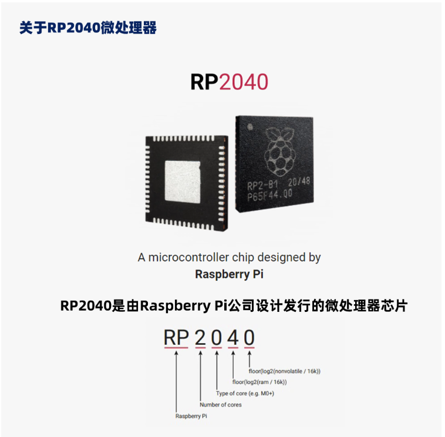

--

# rp2040芯片

RP2040 是一款由 Raspberry Pi 设计的低功耗双核微控制器芯片。它采用 Arm Cortex-M0+ 处理器核心，并具有丰富的外设和接口，适用于各种嵌入式应用。

以下是 RP2040 的主要特点和特性：

1. 处理器核心：RP2040 集成了两个 Arm Cortex-M0+ 处理器核心，工作频率高达 133 MHz。这使得它能够处理较复杂的任务和实现高性能应用。

2. 内存和存储器：RP2040 内核包含 264KB 的 SRAM，用于存储数据和程序。它还支持外部闪存，可通过 SPI Flash 接口进行扩展。

3. 外设和接口：RP2040 提供了丰富的外设和接口，包括 UART、SPI、I2C、PWM、GPIO 等。这些接口使其能够与外部设备和传感器进行通信和交互。

4. 低功耗：RP2040 的设计目标之一是低功耗。它采用了先进的功耗管理技术，能够在低功耗模式下运行，并支持快速唤醒。

5. 多种封装选项：RP2040 提供了多种封装选项，包括 QFN48、QFN56 和 WLCSP 封装，以适应不同的应用需求和 PCB 设计。

6. 开发生态系统：RP2040 具有活跃的开发生态系统，包括官方提供的开发工具链和开发环境（如 C/C++ SDK 和 MicroPython），以及丰富的社区支持。

7. 低成本：RP2040 的成本相对较低，这使得它成为许多嵌入式项目和产品的理想选择。

RP2040 可广泛应用于物联网设备、嵌入式系统、自动化控制、传感器网络和其他需要低功耗、高性能的应用领域。它的开源设计和丰富的开发生态系统为开发者提供了灵活和强大的工具，使他们能够快速开发创新的嵌入式解决方案。



# 树莓派rp2040板子

RP2040 板子是基于 Raspberry Pi 设计的开发板，采用了 RP2040 微控制器芯片。RP2040 板子提供了丰富的外设和接口，以及易于使用的开发环境，使开发者能够快速开始嵌入式开发。

下面是 RP2040 板子的主要特点和特性：

1. 微控制器芯片：RP2040 板子搭载了 Raspberry Pi 设计的 RP2040 微控制器芯片，内置双核 Arm Cortex-M0+ 处理器，运行频率高达 133 MHz。

2. 外设和接口：RP2040 板子具有多个 GPIO 引脚，可用于连接外部设备和传感器。它还提供了 UART、SPI、I2C、PWM 等常用接口，用于与其他设备进行通信。

3. 内存和存储器：RP2040 板子内置 264KB 的 SRAM，用于存储数据和程序。它还支持外部闪存，可通过 SPI Flash 接口进行扩展。

4. USB 支持：RP2040 板子具有 USB 2.0 支持，可用作串行调试接口（通过 USB 调试器）或作为 USB 设备进行通信。

5. 开发环境：RP2040 板子支持多种开发环境和编程语言，包括 C/C++、MicroPython 和 CircuitPython。官方提供了 Raspberry Pi Pico SDK，其中包含了开发所需的工具链、库和示例代码。

6. 丰富的社区支持：RP2040 板子有一个活跃的社区，开发者可以在社区中获得支持、交流和分享项目经验。

7. 低成本和易获取性：RP2040 板子的成本相对较低，并且可以通过各种渠道获得，包括官方渠道和其他供应商。

RP2040 板子适用于各种嵌入式项目和应用开发，例如物联网设备、机器人、传感器网络、嵌入式系统等。它提供了强大的性能和丰富的外设，同时也非常适合初学者入门学习嵌入式开发。

# 国内的便宜兼容板

https://item.taobao.com/item.htm?spm=a21n57.1.0.0.283b523ccudmMT&id=719769991832&ns=1&abbucket=0#detail

# github项目

以下是一些在 GitHub 上找到的与 RP2040 相关的有趣开源项目，供您参考：

1. [pico-playground](https://github.com/raspberrypi/pico-playground) - Raspberry Pi Pico 的示例代码和项目集合。
2. [pico-examples](https://github.com/raspberrypi/pico-examples) - Raspberry Pi Pico 的示例项目，涵盖了各种传感器、通信和显示等应用。
3. [pico-projects](https://github.com/raspberrypi/pico-projects) - Raspberry Pi Pico 的项目集，包括电子游戏、音乐播放器等有趣的应用。
4. [pico-tflmicro](https://github.com/raspberrypi/pico-tflmicro) - 在 Raspberry Pi Pico 上运行 TensorFlow Lite Micro 的示例。
5. [Pico-Invaders](https://github.com/james-fry/Pico-Invaders) - 用 C++ 编写的类似 Space Invaders 游戏的示例项目。
6. [RP2040Blinky](https://github.com/Wiz-IO/RP2040Blinky) - 用于 Raspberry Pi Pico 的简单示例项目，用于演示 LED 的闪烁。
7. [RP2040_SSD1306](https://github.com/Hermann-SW/RP2040_SSD1306) - 使用 SSD1306 OLED 显示器的 Raspberry Pi Pico 示例项目。
8. [pico-ssd1306](https://github.com/boochow/pico-ssd1306) - 使用 SSD1306 OLED 显示器的 Raspberry Pi Pico 示例代码。
9. [RP2040_FreeRTOS](https://github.com/Hermann-SW/RP2040_FreeRTOS) - 在 Raspberry Pi Pico 上运行 FreeRTOS 实时操作系统的示例项目。
10. [RP2040-Servo](https://github.com/urish/rp2040-servo) - 使用 Raspberry Pi Pico 驱动舵机的示例项目。
11. [RP2040-audio](https://github.com/Hexxeh/RP2040-audio) - Raspberry Pi Pico 上的音频播放器示例。
12. [RP2040_Firmware](https://github.com/kxynos/RP2040_Firmware) - Raspberry Pi Pico 的固件升级工具和示例固件。
13. [RP2040-Sound](https://github.com/farletech/RP2040-Sound) - 使用 Raspberry Pi Pico 播放声音的示例项目。
14. [RP2040-USB-Gamepad](https://github.com/Palmr/usb_gamepad) - 将 Raspberry Pi Pico 用作 USB 游戏手柄的示例。
15. [RP2040-MPU6050](https://github.com/Smithers-Robots/RP2040-MPU6050) - Raspberry Pi Pico 和 MPU6050 传感器的示例项目。
16. [RP2040-Servo-Driver](https://github.com/Gunstick/RP2040-Servo-Driver) - 使用 Raspberry Pi Pico 驱动 PCA9685 舵机驱动器的示例项目。
17. [RP2040-IR-Remote](https

://github.com/Jan--Henrik/RP2040-IR-Remote) - 使用 Raspberry Pi Pico 实现红外遥控器的示例项目。
18. [RP2040-Digital-Analog-Clock](https://github.com/WieeRd/RP2040-Digital-Analog-Clock) - Raspberry Pi Pico 的数字模拟时钟示例。
19. [RP2040-Thermostat](https://github.com/dekay/thermostat) - 使用 Raspberry Pi Pico 构建的温控器示例项目。
20. [RP2040-Simple-Audio](https://github.com/GregDavill/RP2040-Simple-Audio) - 使用 Raspberry Pi Pico 播放简单音频的示例项目。
21. [RP2040-WS2812B](https://github.com/boochow/pico-ws2812b) - 使用 Raspberry Pi Pico 控制 WS2812B LED 的示例代码。
22. [RP2040-Plant-Monitor](https://github.com/NorthernWidget-Skunkworks/RP2040-Plant-Monitor) - Raspberry Pi Pico 上植物监控系统的示例项目。
23. [RP2040-ILI9341](https://github.com/Xinyuan-LilyGO/RP2040-ILI9341) - 使用 ILI9341 TFT 显示器的 Raspberry Pi Pico 示例项目。
24. [RP2040-Barcode-Scanner](https://github.com/champierre/RP2040-Barcode-Scanner) - Raspberry Pi Pico 的条码扫描器示例项目。
25. [RP2040-ESP8266-Wifi](https://github.com/sticilface/RP2040-ESP8266-Wifi) - 使用 ESP8266 WiFi 模块的 Raspberry Pi Pico 示例项目。
26. [RP2040-OV7670](https://github.com/jujunjun110/RP2040-OV7670) - Raspberry Pi Pico 和 OV7670 摄像头的示例项目。
27. [RP2040-WebUSB](https://github.com/hideakitai/RP2040-WebUSB) - 将 Raspberry Pi Pico 用作 WebUSB 设备的示例。
28. [RP2040-FFT-Audio-Visualizer](https://github.com/Picovoice/RP2040-FFT-Audio-Visualizer) - Raspberry Pi Pico 上的 FFT 音频可视化示例。
29. [RP2040-LoRa](https://github.com/tftelkamp/single_chan_pkt_fwd) - 使用 Raspberry Pi Pico 实现的单通道 LoRa 网关示例。
30. [RP2040-BLE-Beacon](https://github.com/iamvictorli/RP2040-BLE-Beacon) - Raspberry Pi Pico 的 BLE Beacon 示例项目。

请注意，我提供的项目列表可能不是最新的，建议您在 GitHub 上进行搜索，以找到更多与 RP2040 相关的开源项目，并根据自己的兴趣和需求进行选择。

# windows下开发环境搭建

要在Windows上搭建树莓派RP2040的开发环境，你可以按照以下步骤进行：

1. 安装Python：首先，确保你的系统已经安装了Python。你可以从Python官方网站（https://www.python.org）下载并安装最新版本的Python。

2. 安装Git：在Windows上安装Git，你可以从Git官方网站（https://git-scm.com）下载并安装Git。

3. 安装Visual Studio Code：Visual Studio Code是一个流行的跨平台文本编辑器，适用于各种编程语言。你可以从Visual Studio Code官方网站（https://code.visualstudio.com）下载并安装Visual Studio Code。

4. 安装Pico SDK：Pico SDK是RP2040的开发工具包，提供了与RP2040芯片通信和编程的API和工具。在Windows上安装Pico SDK，可以按照以下步骤进行：
   - 打开Windows命令提示符（或PowerShell）。
   - 使用Git克隆Pico SDK的仓库：`git clone https://github.com/raspberrypi/pico-sdk.git`
   - 进入pico-sdk目录：`cd pico-sdk`
   - 运行脚本安装Pico SDK：`./contribute.sh`

5. 配置Visual Studio Code和Pico SDK：
   - 打开Visual Studio Code。
   - 安装C/C++扩展插件：在扩展（Extensions）面板中搜索并安装 "C/C++" 扩展插件。
   - 配置C/C++扩展插件：在Visual Studio Code的设置中，配置Pico SDK的路径。打开设置（Settings），搜索并编辑 "C_Cpp: IntelliSense Engine" 设置，将值设置为 "PCH"。然后搜索并编辑 "C_Cpp: IntelliSense PCH" 设置，将值设置为 "Absolute path to pico_sdk_import.cmake"。
   - 打开RP2040示例项目：在Visual Studio Code中，打开 "File" 菜单，选择 "Open Folder"，然后导航到RP2040示例项目的目录。

6. 构建和烧录RP2040程序：
   - 打开终端：在Visual Studio Code的 "View" 菜单中，选择 "Terminal"，打开集成终端。
   - 构建项目：在终端中，运行 `mkdir build` 命令创建一个build目录，然后运行 `cd build` 命令进入build目录。接下来，运行 `cmake .. -DPICO_SDK_PATH=<path_to_pico_sdk>` 命令，将 `<path_to_pico_sdk>` 替换为Pico SDK的路径。最后，运行 `make` 命令来构建项目。
   - 烧录程序：通过USB连接RP2040到计算机。然后，在终端中运行 `make <project_name>-flash` 命令，将 `<project_name>` 替换为你的项目名称，以将程序烧录到RP2040。

完成以上步骤后，你就可以在Windows上搭建树莓派RP2040的开发环境，并开始编写和烧录RP2040的程序。请注意，上述步骤中的一些细节可能因环境或工具版本而有所不同，建议在进行搭建过程中参考相关工具的官方文档或说明。

# pico-sdk介绍

Pico SDK是用于树莓派RP2040微控制器的官方开发工具包。RP2040是一款高性价比的双核ARM微控制器，由树莓派基金会开发，并采用了低功耗、高性能的ARM Cortex-M0+内核。

Pico SDK提供了与RP2040芯片通信和编程的API和工具。

它包含了一系列用于开发RP2040应用程序的库、头文件和示例代码。

使用Pico SDK，开发者可以利用RP2040的功能和性能，轻松地编写和调试各种类型的应用程序，包括嵌入式系统、物联网设备、传感器应用等。

Pico SDK的特点和功能包括：

1. 多种编程语言支持：Pico SDK支持C和C++编程语言，开发者可以根据自己的喜好和需求选择适合的编程语言进行开发。

2. 丰富的库和API：Pico SDK提供了一系列的库和API，涵盖了RP2040的各种功能和外设，如GPIO、UART、SPI、I2C、PWM、ADC等。这些库和API使开发者能够轻松地控制和访问RP2040的硬件资源。

3. 示例代码和项目模板：Pico SDK附带了一些示例代码和项目模板，以帮助开发者快速入门和理解如何使用SDK编写应用程序。这些示例代码涵盖了各种常见的应用场景，如LED控制、传感器读取、通信接口等。

4. 调试和性能分析工具：Pico SDK还提供了调试和性能分析工具，帮助开发者在开发过程中进行调试和优化。它支持使用调试器和仿真器进行单步调试，并提供了性能分析工具来检测和解决性能瓶颈。

5. 跨平台支持：Pico SDK可以在多种操作系统上运行，包括Windows、Linux和macOS。这使开发者可以在自己熟悉的开发环境中进行RP2040的应用程序开发。

总之，Pico SDK是树莓派RP2040的官方开发工具包，提供了一系列库、API和工具，用于开发和调试RP2040的应用程序。它简化了RP2040开发过程，并提供了丰富的功能和示例代码，使开发者能够充分发挥RP2040的潜力，并构建各种创新的嵌入式应用。

# 板子上电

买了一块pico的板子。

用usb线连接到电脑上，现在上电。

电脑上显示board in fs mode。这个是什么意思。

## board in fs mode是指什么

"Board in FS mode"是指开发板处于文件系统（File System）模式下。在这种模式下，开发板被连接到计算机，并作为可访问的外部存储设备出现，类似于一个USB闪存驱动器或硬盘。

在FS模式下，开发板的闪存或存储器被挂载为一个文件系统，计算机可以通过操作系统的文件管理工具来访问其中的文件和目录。这使得可以直接向开发板复制文件、编辑配置文件、访问日志文件等。

通常，FS模式用于固件的烧录和配置管理。通过将固件文件（如UF2文件）复制到开发板的文件系统中，可以方便地将固件更新到开发板上。此外，还可以修改配置文件、上传资源文件等，以满足特定应用的需求。

需要注意的是，FS模式通常需要特定的引导加载程序和驱动程序支持。这些程序负责将开发板切换到FS模式并与计算机进行通信。具体的操作步骤和支持的文件系统类型可能因开发板和平台而有所不同。建议查阅开发板的文档和说明，以了解如何将开发板置于FS模式下以及与之交互的方法。

从这里下载一些uf2的文件。直接下载进去看看。

https://pico.org.cn/

https://www.raspberrypi.com/documentation/microcontrollers/raspberry-pi-pico.html

直接从micropython的官网下载uf2文件。

https://micropython.org/download/rp2-pico/

根据这个文档来搭建环境。

https://datasheets.raspberrypi.com/pico/getting-started-with-pico.pdf

用pico_setup.sh脚本来一键安装。

本质是先安装一些开发工具。

然后下载了好几个git仓库。

然后编译了blink和HelloWorld这2个例子。

这个文档的其他部分可以不细看。


直接platformio安装开发环境看看。

要搭建 Pico 的开发环境并使用 PlatformIO 进行开发，可以按照以下步骤进行操作：

1. 安装 PlatformIO IDE：
   - 首先，安装 VSCode（Visual Studio Code）编辑器，可以从 [VSCode 官网](https://code.visualstudio.com/) 下载适用于你的操作系统的版本并进行安装。
   - 打开 VSCode，点击左侧侧边栏中的扩展（Extensions）图标，搜索并安装 "PlatformIO IDE" 扩展。
   - 安装完成后，重启 VSCode。

2. 创建 PlatformIO 项目：
   - 打开 VSCode，点击左侧侧边栏中的 "PlatformIO" 图标，选择 "PIO Home"。
   - 在 PIO Home 页面中，点击 "New Project"。
   - 选择 "PIO Project"。
   - 输入项目的名称和路径，并选择 "Raspberry Pi Pico" 作为开发板。
   - 点击 "Finish" 完成项目创建。

3. 配置项目：
   - 在 VSCode 中，打开项目文件夹。
   - 在项目文件夹中，打开 "platformio.ini" 文件，这是项目的配置文件。
   - 检查 "platformio.ini" 文件中的配置是否正确，如下所示：

     ```ini
     [env:pico]
     platform = raspberrypi
     board = pico
     framework = pico-sdk
     ```

4. 编写代码：
   
- 在项目文件夹中，打开 "src" 文件夹，你可以创建或编辑你的源代码文件（以 ".cpp" 或 ".c" 结尾）。
  
5. 构建和上传：
   - 在 VSCode 中，点击左侧侧边栏中的 "PlatformIO" 图标，选择 "PIO Home"。
   - 在 PIO Home 页面中，点击 "Open"，选择你的项目文件夹。
   - 在 "PlatformIO" 图标下拉菜单中，选择你的开发板（例如 "Raspberry Pi Pico"）。
   - 点击 "Build" 构建项目。
   - 构建完成后，可以点击 "Upload" 将固件上传到 Pico 开发板。

这样，你就可以使用 PlatformIO 搭建 Pico 的开发环境并进行开发了。你可以编写代码、构建固件并上传到开发板上进行测试和调试。记得根据你的具体项目需求进行配置和编写代码。


pico的相关教程。

https://shumeipai.nxez.com/tag/pico

不同的语法实现点灯。

https://shumeipai.nxez.com/2022/01/31/multilingual-blink-for-raspberry-pi-pico.html

用arduino ide来开发pico。

https://shumeipai.nxez.com/2021/06/04/program-the-raspberry-pi-pico-with-the-arduino-ide.html


arduino的库索引

https://www.arduino.cc/reference/en/libraries/

代码都在这里：

https://github.com/arduino-libraries


# 用thonny直接运行py脚本

直接把这个文件拷贝到thonny里运行，解释器选择连接到串口上的。

直接运行就可以了。非常方便。

https://github.com/raspberrypi/pico-micropython-examples/blob/master/blink/blink.py