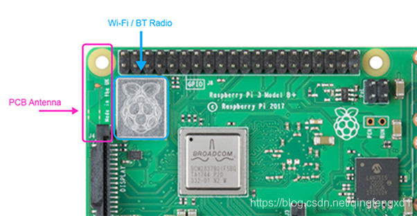

树莓派3自带了WiFi和蓝牙。蓝牙的版本是4.1版本的。还支持低功耗蓝牙。

可以用bluetoothctl这个工具来进行基本操作。

```
pi@raspberrypi:~$ sudo bluetoothctl 
[NEW] Controller B8:27:EB:AA:E4:60 raspberrypi [default]
[NEW] Device E0:19:1D:A4:56:E8 HUAWEI MT7-TL10
[bluetooth]# 
[bluetooth]# help
Available commands:
  list                       List available controllers
  show [ctrl]                Controller information
  select <ctrl>              Select default controller
  devices                    List available devices
  paired-devices             List paired devices
  power <on/off>             Set controller power
  pairable <on/off>          Set controller pairable mode
  discoverable <on/off>      Set controller discoverable mode
  agent <on/off/capability>  Enable/disable agent with given capability
  default-agent              Set agent as the default one
  scan <on/off>              Scan for devices
  info <dev>                 Device information
  pair <dev>                 Pair with device
  trust <dev>                Trust device
  untrust <dev>              Untrust device
  block <dev>                Block device
  unblock <dev>              Unblock device
  remove <dev>               Remove device
  connect <dev>              Connect device
  disconnect <dev>           Disconnect device
  version                    Display version
  quit                       Quit program
[bluetooth]# 
```

查看树莓派的蓝牙的基本信息：

```
[bluetooth]# show
Controller B8:27:EB:AA:E4:60
        Name: raspberrypi
        Alias: raspberrypi
        Class: 0x000000
        Powered: yes
        Discoverable: no
        Pairable: yes
        UUID: PnP Information           (00001200-0000-1000-8000-00805f9b34fb)
        UUID: Generic Access Profile    (00001800-0000-1000-8000-00805f9b34fb)
        UUID: Generic Attribute Profile (00001801-0000-1000-8000-00805f9b34fb)
        UUID: A/V Remote Control        (0000110e-0000-1000-8000-00805f9b34fb)
        UUID: A/V Remote Control Target (0000110c-0000-1000-8000-00805f9b34fb)
        Modalias: usb:v1D6Bp0246d0517
        Discovering: no
```

查看当前可以扫描的设备：

```
[bluetooth]# devices
Device E0:19:1D:A4:56:E8 HUAWEI MT7-TL10
```

把各种配置打开：

```
[bluetooth]# power on
Changing power on succeeded
[bluetooth]# scan on
Discovery started
[CHG] Controller B8:27:EB:AA:E4:60 Discovering: yes
[NEW] Device 88:0F:10:83:79:40 MI_SCALE
[bluetooth]# pairable on
```

查看我的手机的信息：

```
[bluetooth]# devices
Device E0:19:1D:A4:56:E8 HUAWEI MT7-TL10
Device 88:0F:10:83:79:40 MI_SCALE
[bluetooth]# info E0:19:1D:A4:56:E8
Device E0:19:1D:A4:56:E8
        Name: HUAWEI MT7-TL10
        Alias: HUAWEI MT7-TL10
        Class: 0x5a020c
        Icon: phone
        Paired: no
        Trusted: no
        Blocked: no
        Connected: no
        LegacyPairing: no
        UUID: OBEX Object Push          (00001105-0000-1000-8000-00805f9b34fb)
        UUID: Audio Source              (0000110a-0000-1000-8000-00805f9b34fb)
        UUID: A/V Remote Control Target (0000110c-0000-1000-8000-00805f9b34fb)
        UUID: Headset AG                (00001112-0000-1000-8000-00805f9b34fb)
        UUID: PANU                      (00001115-0000-1000-8000-00805f9b34fb)
        UUID: NAP                       (00001116-0000-1000-8000-00805f9b34fb)
        UUID: Handsfree Audio Gateway   (0000111f-0000-1000-8000-00805f9b34fb)
        UUID: Phonebook Access Server   (0000112f-0000-1000-8000-00805f9b34fb)
        UUID: Message Access Server     (00001132-0000-1000-8000-00805f9b34fb)
        UUID: PnP Information           (00001200-0000-1000-8000-00805f9b34fb)
        UUID: Generic Access Profile    (00001800-0000-1000-8000-00805f9b34fb)
        UUID: Generic Attribute Profile (00001801-0000-1000-8000-00805f9b34fb)
        Modalias: bluetooth:v001Dp1200d1436
```

在板端信任我的手机：

```
[bluetooth]# trust E0:19:1D:A4:56:E8
[CHG] Device E0:19:1D:A4:56:E8 Trusted: yes
Changing E0:19:1D:A4:56:E8 trust succeeded
[CHG] Device 88:0F:10:83:79:40 RSSI: -84
```

从板端连接我的手机：

```
[bluetooth]# connect E0:19:1D:A4:56:E8
Attempting to connect to E0:19:1D:A4:56:E8
Failed to connect: org.bluez.Error.Failed
[bluetooth]# 
```

会失败。当前在我的手机上也没有扫描到板端。

从板端向手机端发起配对：

```
[bluetooth]# pair E0:19:1D:A4:56:E8
Attempting to pair with E0:19:1D:A4:56:E8
[CHG] Device E0:19:1D:A4:56:E8 Connected: yes
[CHG] Device E0:19:1D:A4:56:E8 Paired: yes
Pairing successful
```

配对成功。

但是链接还是不成功。


# 从手机端给树莓派发送文字信息

编辑`/etc/systemd/system/dbus-org.bluez.service`文件。

修改这个：

```
ExecStart=/usr/lib/bluetooth/bluetoothd -C
ExecStartPost=/usr/bin/sdptool add SP
```

然后把树莓派reboot。

然后保证树莓派的蓝牙信任了你的手机，操作方法跟前面的意义。用bluetoothctl来做。

手机上下载Bluetooth terminal一类的软件。

但是我还是没有操作成功。


```
root@raspberrypi:~# systemctl status bluetooth
● bluetooth.service - Bluetooth service
   Loaded: loaded (/lib/systemd/system/bluetooth.service; enabled)
   Active: active (running) since Sat 2018-07-28 09:17:11 CST; 3 months 10 days ago
     Docs: man:bluetoothd(8)
 Main PID: 621 (bluetoothd)
   Status: "Running"
   CGroup: /system.slice/bluetooth.service
           └─621 /usr/lib/bluetooth/bluetoothd -C

Jul 28 09:17:11 raspberrypi bluetoothd[621]: Bluetooth daemon 5.23
Jul 28 09:17:11 raspberrypi bluetoothd[621]: Starting SDP server
Jul 28 09:17:11 raspberrypi bluetoothd[621]: Bluetooth management interface ...d
Jul 28 09:17:11 raspberrypi systemd[1]: Started Bluetooth service.
Jul 28 09:17:11 raspberrypi sdptool[664]: Serial Port service registered
Jul 28 09:17:11 raspberrypi bluetoothd[621]: Sap driver initialization failed.
Jul 28 09:17:11 raspberrypi bluetoothd[621]: sap-server: Operation not permi...)
Nov 06 17:13:00 raspberrypi bluetoothd[621]: GAP and GATT are mandatory
Nov 06 17:13:00 raspberrypi bluetoothd[621]: gap-gatt-profile profile probe ...D
Nov 06 17:13:40 raspberrypi bluetoothd[621]: a2dp-source profile connect fai...e
Hint: Some lines were ellipsized, use -l to show in full.
root@raspberrypi:~# 
```


```
root@raspberrypi:~# cat /var/log/syslog | grep -i protocol 
Nov  6 17:13:40 raspberrypi bluetoothd[621]: a2dp-source profile connect failed for B4:0B:44:F4:16:8D: Protocol not available
Nov  6 17:21:30 raspberrypi bluetoothd[1986]: a2dp-source profile connect failed for B4:0B:44:F4:16:8D: Protocol not available
root@raspberrypi:~# 
```

```
apt-get install --no-install-recommends pulseaudio pulseaudio-module-bluetooth
```


# 再次学习

```
sudo apt-get install pi-bluetooth bluez bluez-firmware blueman
```

这个需要安装大概170M的东西。

添加用户pi到蓝牙组。

```
sudo usermod -G bluetooth -a pi 
```

开启蓝牙设备。

```
sudo vi /etc/systemd/system/dbus-org.bluez.service
```

把2个工具的路径修改为实际路径。

然后reboot重启。

```
root@raspberrypi:~# hciconfig 
hci0:   Type: BR/EDR  Bus: UART
        BD Address: B8:27:EB:AA:E4:60  ACL MTU: 1021:8  SCO MTU: 64:1
        UP RUNNING PSCAN 
        RX bytes:717 acl:0 sco:0 events:42 errors:0
        TX bytes:1501 acl:0 sco:0 commands:42 errors:0
```


手机上下载蓝牙串口工具。

```
root@raspberrypi:~# sudo sdptool browse local 
Browsing FF:FF:FF:00:00:00 ...
Service RecHandle: 0x10000
Service Class ID List:
  "PnP Information" (0x1200)
Profile Descriptor List:
  "PnP Information" (0x1200)
    Version: 0x0103

Browsing FF:FF:FF:00:00:00 ...
Service Search failed: Invalid argument
Service Name: Serial Port
Service Description: COM Port
Service Provider: BlueZ
Service RecHandle: 0x10001
Service Class ID List:
  "Serial Port" (0x1101)
Protocol Descriptor List:
  "L2CAP" (0x0100)
  "RFCOMM" (0x0003)
    Channel: 1
Language Base Attr List:
  code_ISO639: 0x656e
  encoding:    0x6a
  base_offset: 0x100
Profile Descriptor List:
  "Serial Port" (0x1101)
    Version: 0x0100

Service Name: Generic Access Profile
Service Provider: BlueZ
Service RecHandle: 0x10002
Service Class ID List:
  "Generic Access" (0x1800)
Protocol Descriptor List:
  "L2CAP" (0x0100)
    PSM: 31
  "ATT" (0x0007)
    uint16: 0x0001
    uint16: 0x0008

Service Name: Generic Attribute Profile
Service Provider: BlueZ
Service RecHandle: 0x10003
Service Class ID List:
  "Generic Attribute" (0x1801)
Protocol Descriptor List:
  "L2CAP" (0x0100)
    PSM: 31
  "ATT" (0x0007)
    uint16: 0x0010
    uint16: 0x0010

Service Name: AVRCP CT
Service RecHandle: 0x10004
Service Class ID List:
  "AV Remote" (0x110e)
  "AV Remote Controller" (0x110f)
Protocol Descriptor List:
  "L2CAP" (0x0100)
    PSM: 23
  "AVCTP" (0x0017)
    uint16: 0x0103
Profile Descriptor List:
  "AV Remote" (0x110e)
    Version: 0x0105

Service Name: AVRCP TG
Service RecHandle: 0x10005
Service Class ID List:
  "AV Remote Target" (0x110c)
Protocol Descriptor List:
  "L2CAP" (0x0100)
    PSM: 23
  "AVCTP" (0x0017)
    uint16: 0x0103
Profile Descriptor List:
  "AV Remote" (0x110e)
    Version: 0x0104
```

```
sudo rfcomm watch hci0
```

还是总是不行。

我觉得需要把我买的蓝牙适配器连到树莓派上试一下。


# 插上usb蓝牙再试

我的usb蓝牙适配器是耳机的。CSR的。花了20元。

用Bluetoothctl还是失败。

网上看，查看日志。

```
root@raspberrypi:~# sudo cat /var/log/syslog | grep -i protocol 
Nov 28 09:03:54 raspberrypi bluetoothd[658]: a2dp-source profile connect failed for B4:0B:44:F4:16:8D: Protocol not available
Nov 28 09:04:02 raspberrypi bluetoothd[658]: a2dp-source profile connect failed for B4:0B:44:F4:16:8D: Protocol not available
root@raspberrypi:~# 
```

网上看到说是需要安装pulseaudio的库。

```
sudo apt-get install pulseaudio-module-bluetooth
```

我执行，发现我的树莓派是已经安装了的。

```
pulseaudio-module-bluetooth is already the newest version.
```

但是后面的步骤是有意义的，就需要启动pulseaudio。

```
pulseaudio --start
```

然后重启蓝牙。

```
systemctl restart bluetooth 
```

现在可以连接成功了。


现在这样看的话，我可以拔掉我的usb蓝牙看看自带的蓝牙，也是可以显示连接成功的。

但是无论usb的还是自带的，都是会断开的。

```
Pairing successful
[CHG] Device 3C:A6:16:68:AF:85 Connected: no
[CHG] Device 3C:A6:16:68:AF:85 Connected: yes
[CHG] Device 3C:A6:16:68:AF:85 Connected: no
[CHG] Device 3C:A6:16:68:AF:85 Connected: yes
[CHG] Device 3C:A6:16:68:AF:85 Connected: no
[CHG] Device 3C:A6:16:68:AF:85 Connected: yes
[CHG] Device 3C:A6:16:68:AF:85 Connected: no
```

所以实验没法继续。

我把树莓派系统升级到最新的stretch版本。20181113的。

再重头看这个问题。

20181113的会启动失败。我还是换成20181018的看看。

有时候usb转串口有问题，长时间都没有打印出来，拔掉再插入就好了。

# 重新配置树莓派

现在是stretch版本的。

Bluetoothctl是自带的。目前版本是5.43，之前的5.23的。

直接打开蓝牙。

从树莓派上连接手机看看。

```
[bluetooth]# connect B4:0B:44:F4:16:8D 
Attempting to connect to B4:0B:44:F4:16:8D
Failed to connect: org.bluez.Error.Failed
```

重新找一篇文章，重新来。

看状态。

```
root@raspberrypi:~# systemctl status bluetooth
● bluetooth.service - Bluetooth service
   Loaded: loaded (/lib/systemd/system/bluetooth.service; enabled; vendor preset: enabled)
   Active: active (running) since Wed 2018-11-28 02:03:28 UTC; 31min ago
     Docs: man:bluetoothd(8)
 Main PID: 445 (bluetoothd)
   Status: "Running"
   CGroup: /system.slice/bluetooth.service
           └─445 /usr/lib/bluetooth/bluetoothd

Nov 28 02:03:28 raspberrypi systemd[1]: Starting Bluetooth service...
Nov 28 02:03:28 raspberrypi bluetoothd[445]: Bluetooth daemon 5.43
Nov 28 02:03:28 raspberrypi systemd[1]: Started Bluetooth service.
Nov 28 02:03:28 raspberrypi bluetoothd[445]: Starting SDP server
Nov 28 02:03:29 raspberrypi bluetoothd[445]: Bluetooth management interface 1.14 initialized
Nov 28 02:03:29 raspberrypi bluetoothd[445]: Failed to obtain handles for "Service Changed" characteristic
Nov 28 02:03:29 raspberrypi bluetoothd[445]: Sap driver initialization failed.
Nov 28 02:03:29 raspberrypi bluetoothd[445]: sap-server: Operation not permitted (1)
Nov 28 02:03:29 raspberrypi bluetoothd[445]: Failed to set privacy: Rejected (0x0b)
Nov 28 02:34:11 raspberrypi bluetoothd[445]: B4:0B:44:F4:16:8D: error updating services: Connection timed out (110)
```

后面那些错误是正常的。

网上找到的说明。

```
The Sap warnings are normal. Ignore them.
```

在bluetoothctl里，连接我的手机看看。

```
Failed to connect: org.bluez.Error.Failed
```


这里下载xgcom。是Linux下的图形化串口调试工具。

https://github.com/wanzhang/xgcom

```
sudo apt-get install pi-bluetooth
```

这个是已经安装过的了。

```
启动/增加SPP
sudo nano /etc/systemd/system/dbus-org.bluez.service
```

```
ExecStart=/usr/lib/bluetooth/bluetoothd -C
ExecStartPost=/usr/bin/sdptool add SP
```

```
sudo rfcomm watch hci0
```


# 把串口关闭

还是不能连接上。


# 换hcitool工具来做

我现在只用usb的蓝牙，把树莓派自带的蓝牙关闭。

```
hciconfig hci0 down
```

也是不行，我到笔记本上试一下看看。


# 终于成功了

2018年12月14日16:56:06

还是用bluetoothctl来做的。

就是按照https://unix.stackexchange.com/questions/258074/error-when-trying-to-connect-to-bluetooth-speaker-org-bluez-error-failed

这篇文章的来做的。

```
sudo apt install pulseaudio-module-bluetooth 
pulseaudio -k
pulseaudio --start
```

都是在root下做。

现在连接成功了。

```
[bluetooth]# connect B4:0B:44:F4:16:8D 
Attempting to connect to B4:0B:44:F4:16:8D
[CHG] Device B4:0B:44:F4:16:8D Connected: yes
Connection successful
[CHG] Device B4:0B:44:F4:16:8D ServicesResolved: yes
[CHG] Controller B8:27:EB:AA:E4:60 Discoverable: no
```

现在播放歌曲，声音是到树莓派这边了。

当然不同还在于，我现在换成最新的系统了。也许跟这个也有点关系。

# 重新验证

下载我要从头来验证树莓派上的蓝牙。

下载树莓派4b，从u盘启动，默认就是支持的从U盘启动的。这个很好。

然后烧录就用树莓派官方的工具，下载镜像和烧录一步到位。

这种工具不难的，但是就是比较有意义，解决最后一公里的问题。

安装的树莓派的raspberry os 64bit。

bluez的版本是5.66，这个是支持le audio的了。

看内核版本也是6.6.20了。都是足够新的版本。

而且可以提前把用户名和wifi等信息提前配置好。这样就可以达到烧录系统后直接开机可用。

型号	蓝牙芯片	蓝牙版本
Raspberry Pi 3 Model A+	Broadcom BCM43438	4.1
Raspberry Pi 3 Model B	Broadcom BCM43438	4.1
Raspberry Pi Model 3B+	Cypress CYW43455	4.2
Raspberry Pi 4 Model B	Cypress CYW43455	5.0

树莓派4b集成了wifi和蓝牙芯片，蓝牙支持低功耗模式。

树莓派采用linux系统，并使用BlueZ Bluetooth stack，

但BlueZ Bluetooth stack对ble支持不够稳定，还需要更多的测试。

蓝牙5在树莓派上不支持long range模式。

long range模式一般没法支持wifi和蓝牙集成的芯片。

从Broadcom和现在的Cypress的角度来看，

Pi从射频性能和功能角度来看具有相当不错的芯片组。 

一些设备支持5GHz Wi-Fi频段，

可减少BLE使用的2.4GHz频段上的干扰。 

由于该系统是单芯片解决方案，因此还支持共存以减少干扰。

Raspberry Pi的最大问题是天线相对较小。 

该天线在某种程度上被GPIO连接器的引脚连接器围绕。 

尽管RPI基础并未提供详细的天线辐射信息，但这两者都对性能产生了一些影响。



由于以下几个原因，无法在树莓派上更改天线：

•没有物理连接器，这意味着需要焊接天线或连接器
•Raspberry Pi的认证未声明外部天线。 板端的任何修改都会使FCC和相关认证无效。

最终，Raspberry Pi设备的Bluetooth LE系列是不错的，但却是有限的，并且它无法满足使用外部天线和更复杂的系统所能提供的功能。 

如果您希望在一两个房间以外的任何合理距离内控制设备，最好添加另一个无线电或找到另一个解决方案。
综上所述，它可以为设备的室内控制提供良好的解决方案。 现在，让我们开始使用Raspberry Pi控制某些设备。


https://blog.csdn.net/qingfengxd1/article/details/105142193

## 普通蓝牙连接

先参考这个运行一下，可以把我的手机连接到树莓派。

https://www.cnblogs.com/blueberry-mint/p/16575252.html

## 然后看树莓派ble

为了连接到BLE设备，我们需要扫描，其中一种方法是使用hcitool实用程序：

```
sudo hcitool -i hci0 lescan 
```

在上面，我们将hci0称为hcitool进行扫描，并请求进行LE扫描。 这将查找附近的所有设备并提供MAC地址。

现在我们有了BLE设备的地址，让我们连接它们。 

为此，我们将使用gatttool实用程序，因为我们还将操纵BLE设备的GATT。 

hcitool基本上是所有HCI命令（经典蓝牙和BLE）的“瑞士刀”，但它本身不会操纵GATT工具。

gatttool可以以两种模式运行：交互和非交互。 

在交互模式下，控制台提供了一个界面，使您可以发出命令并与设备进行交互。 您将需要退出以返回到终端。

执行命令时，重要的是避免让命令自行终止。 使用CTRL + C停止命令可能会导致hci接口处于未知状态。 在这种情况下，关闭接口然后再打开将有帮助

sudo gatttool -i hci0 -b DB:F8:F9:65:59:15 -I -t random

上面的代码是标准的，但是必须注意-t参数的使用，该参数指定设备使用的地址是随机的还是公共的。 公共地址是使用分配的IEEE MAC地址的地址。 随机是在大多数情况下BLE设备中随机分配MAC的地址。

执行上面的命令后，就进入到一个交互命令行。

我现在是连接到我的小米手环上。

```
[E1:66:C0:45:0D:8E][LE]> connect
Attempting to connect to E1:66:C0:45:0D:8E
Connection successful
[E1:66:C0:45:0D:8E][LE]> primary
attr handle: 0x0001, end grp handle: 0x0007 uuid: 00001800-0000-1000-8000-00805f9b34fb
attr handle: 0x0008, end grp handle: 0x000b uuid: 00001801-0000-1000-8000-00805f9b34fb
attr handle: 0x000c, end grp handle: 0x000e uuid: 00001811-0000-1000-8000-00805f9b34fb
attr handle: 0x000f, end grp handle: 0x0019 uuid: 0000180a-0000-1000-8000-00805f9b34fb
attr handle: 0x001a, end grp handle: 0x0032 uuid: 0000fee0-0000-1000-8000-00805f9b34fb
attr handle: 0x0033, end grp handle: 0x0038 uuid: 00001530-0000-3512-2118-0009af100700
attr handle: 0x0039, end grp handle: 0x003c uuid: 0000180d-0000-1000-8000-00805f9b34fb
attr handle: 0x003d, end grp handle: 0x0041 uuid: 0000fee1-0000-1000-8000-00805f9b34fb
attr handle: 0x0042, end grp handle: 0x0045 uuid: 00003802-0000-1000-8000-00805f9b34fb
attr handle: 0x0046, end grp handle: 0x0049 uuid: cc353442-be58-4ea2-876e-11d8d6976366
attr handle: 0x004a, end grp handle: 0x005f uuid: 00001812-0000-1000-8000-00805f9b34fb
attr handle: 0x0060, end grp handle: 0x0063 uuid: 0000180f-0000-1000-8000-00805f9b34fb
```


# 参考资料

1、树莓派（Raspberry Pi 3）开启和连接蓝牙

https://blog.csdn.net/guzhong10/article/details/78574577


https://raspberrypi.stackexchange.com/questions/67617/bluetoothctl-fails-to-connect-to-any-device-failed-to-connect-org-bluez-erro

3、

https://blog.csdn.net/wangdamingll/article/details/77587541

4、树莓派之蓝牙编程

https://blog.csdn.net/qq_25005909/article/details/77512903

5、bluetoothctl fails to connect to any device [[ Failed to connect: org.bluez.Error.Failed ]]

https://raspberrypi.stackexchange.com/questions/67617/bluetoothctl-fails-to-connect-to-any-device-failed-to-connect-org-bluez-erro

6、树莓派 3B+ 原生蓝牙与手机通讯（BlueTooth SPP）方法和步骤

https://zhuanlan.zhihu.com/p/26309165