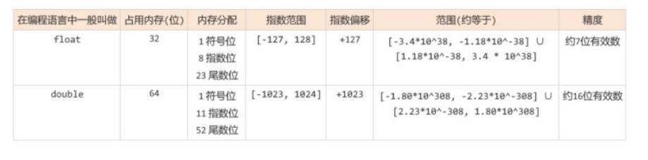
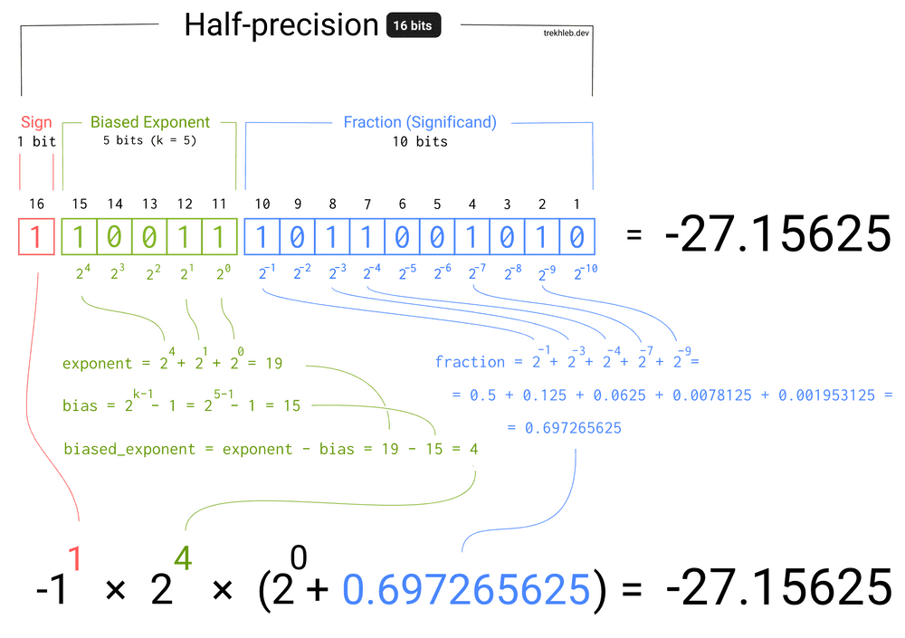

--

一个浮点数 (Value) 的表示其实可以这样表示：


也就是浮点数的**实际值**，等于符号位（sign bit）乘以**指数偏移值**(exponent bias)再乘以**分数值**(fraction)。


我们日常使用的 **浮点数** 也不例外, 最终也要被存储到这样的二进制小格子中.

这就涉及到了 **应该怎么存** 的问题, 比如, 对于浮点数 **20.5**, 是应该存储为 **0100011** 呢, 还是应该存储为 **1100110** 呢?

事实上直到20世纪80年代, 还是计算机厂商各自为战, 每家都在设计自己的浮点数存储规则, 彼此之间并不兼容. **直到1985年, IEEE754标准问世, 浮点数的存储问题才有了一个通用的工业标准.**

IEEE754标准提供了如何在计算机内存中,**以二进制的方式存储十进制浮点数**的具体标准,

IEEE754标准发布于1985年. 包括 javascript, Java, C在内的许多编程语言在实现浮点数时, 都遵循IEEE754标准.


IEEE754的最新标准是IEEE754-2008, 

但本篇文章主要参考的是IEEE754-1985, 

好在两者相差并不大, 而参照1985的标准可以让我们对一些基础概念有更好的理解


IEEE754提供了四种精度规范, 

其中最常用的是 **单精度浮点型** 和 **双精度浮点型** , 

但IEEE754并没有规定32位浮点数类型需要叫做 **float**, 或64位浮点数需要叫做 **double**. 

它只是提供了一些关于如何存储不同精度浮点数的规范和标准. 

不过一般情况下, 

如果我们提到 float, 其实指的就是IEEE754标准中的32位单精度浮点数. 

如果我们提到 double, 其实指的就是IEEE754标准中的64位双精度浮点数


下面是单精度浮点数和双精度浮点数的一些信息, 

可以先简单看一下, 看不懂也没关系, 下文会对这里的信息做详细的解释...




在以二进制格式存储十进制浮点数时, 首先需要把十进制浮点数表示为二进制格式, 还拿十进制数20.5举例:

十进制浮点数20.5 = 二进制10100.1

然后, 需要把这个二进制数转换为以2为底的指数形式:

二进制10100.1 = **1.01001** * 2^4

# 在线实验验证

这里可以在线查看浮点数的表示。

https://www.toolhelper.cn/Digit/FractionConvert




# 浮点数不精确可能导致什么问题

计算机中的浮点数确实存在精度问题，这些问题可能会在特定情况下引起一些意外的行为。主要的问题包括：

1. **舍入误差**：浮点数使用二进制表示，因此它们不能精确地表示某些十进制小数。例如，1/3（1除以3）在十进制中是无限循环小数，而在浮点数中的表示是有限的。这可能导致舍入误差。

2. **精度丢失**：在数学运算中，一系列的浮点数操作可能导致精度的丢失，特别是在进行重复的加法和减法运算时。

3. **比较问题**：由于浮点数精度问题，进行相等性比较时需要小心处理。比如，你可能会发现 `0.1 + 0.2 == 0.3` 这种比较在浮点数中并不总是成立。

4. **不可结合性**：浮点数加法和乘法通常不满足结合律，这意味着 `(a + b) + c` 可能与 `a + (b + c)` 不完全相同。这也是因为舍入误差引起的。

这些问题并不一定会导致严重的问题，但在某些情况下可能会引起意外行为。

为了解决这些问题，有几种方法可以采取：

1. **使用整数运算**：如果你需要更高的精度，可以使用整数运算进行计算，然后将结果除以一个固定的精度因子以获得所需的浮点数表示。

2. **使用固定点数**：固定点数是一种特殊的浮点数表示方式，它使用整数来表示小数部分，并在编程中提供更多的控制。

3. **避免直接相等性比较**：==在浮点数比较时，避免直接使用 `==` 运算符，而应该使用一个小的容忍度值来检查两个浮点数是否足够接近。==

4. **使用精确的库**：在某些情况下，你可以使用高精度的数学库，如 GNU MP（GMP）来处理精确数学运算。

浮点数精度问题通常与具体的应用和使用情况相关。了解这些问题并采取适当的措施，可以减小浮点数精度问题可能引发的风险。


# python里的浮点数

```
>>> 0.1+0.2 == 0.3
False
```

在 Python 中，由于浮点数的精度问题，直接使用相等性运算符 `==` 来比较浮点数通常是不可靠的。相反，你应该使用一种容忍度（tolerance）或差值的方法来比较浮点数。以下是一些在 Python 中进行浮点数比较的方法：

1. **容忍度比较**：比较两个浮点数时，引入一个小的容忍度值，允许它们在一定范围内相等。例如，你可以检查两个浮点数 `a` 和 `b` 是否在某个范围内相等：

   ```python
   tolerance = 1e-9  # 容忍度值
   if abs(a - b) < tolerance:
       print("a 和 b 大致相等")
   ```

   这里的 `1e-9` 是一个很小的容忍度，可以根据你的需求进行调整。

2. **math.isclose 函数**：Python 的 `math` 模块提供了 `isclose` 函数，用于比较浮点数，并允许指定相对容忍度和绝对容忍度。这个函数更为灵活，适用于不同的比较情况：

   ```python
   import math

   a = 0.1 + 0.1 + 0.1
   b = 0.3
   if math.isclose(a, b, rel_tol=1e-9, abs_tol=1e-9):
       print("a 和 b 大致相等")
   ```

   这里，`rel_tol` 是相对容忍度，`abs_tol` 是绝对容忍度。

3. **使用 Decimal 类**：如果需要更高的精度，可以使用 Python 的 `decimal` 模块，它提供了固定精度的浮点数表示。==这可以避免许多浮点数精度问题，但会带来一些性能开销。==

   ```python
   from decimal import Decimal

   a = Decimal("0.1") + Decimal("0.1") + Decimal("0.1")
   b = Decimal("0.3")
   if a == b:
       print("a 和 b 相等")
   ```

总之，在 Python 中进行浮点数比较时，使用容忍度、`math.isclose` 函数或固定精度的 `decimal` 类可以帮助你避免浮点数精度问题。

选择哪种方法取决于你的具体需求和性能要求。


# 参考资料

1、

https://baike.baidu.com/item/IEEE%20754/3869922?fr=aladdin

2、这篇文章很详尽了

https://blog.csdn.net/gao_zhennan/article/details/120717424