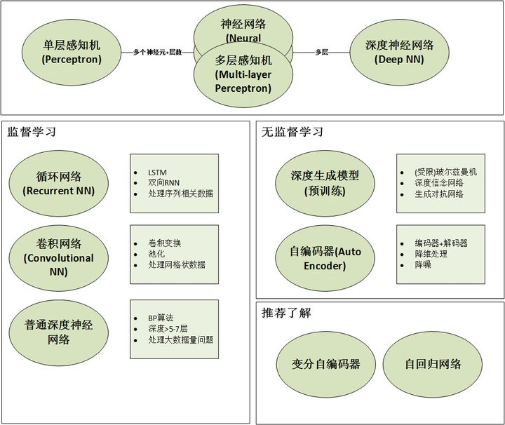
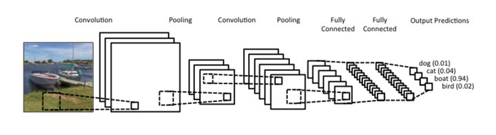

--

看12306抢票这个开源软件，用到了深度学习，我就从这个开始，对深度学习进行了解。

代码在这里。

https://github.com/testerSunshine/12306

这个项目引用了另外一个项目，

https://github.com/zhaipro/easy12306/wiki

这个是对验证码进行识别的。

所以先从easy12306开始看。

下载代码，安装依赖。

```
sudo pip3 install -r requirements.txt
```

安装时间比较久，下载东西比较多。

然后从easy12306的github上保存那张示例图片下来。

从对应的百度网盘下载model.h5和12306.image.model.h5这2个文件下来，放在easy12306根目录。

运行：

```
python3 main.py 1.jpg
```

运行后，打印如下：

```
电子秤
风铃
0 0 电子秤
0 1 绿豆
0 2 蒸笼
0 3 蒸笼
1 0 风铃
1 1 电子秤
1 2 网球拍
1 3 网球拍
```

正确识别了文字和图片内容。

分析一下代码。


什么是深度学习？

深度学习是学习样本数据的内在规律和表示层次。

它的最终目的是让机器有像人一样的分析学习能力。能够识别文字、图像、声音等数据。

深度学习是一个复杂的机器学习算法，在语音和图像识别方面取得的效果，远超于之前的技术。


深度学习是一类模式分析方法的统称。根据研究内容而言，主要设计三类方法：

1、基于卷积计算的神经网络系统。

2、基于多层神经元的自编码神经网络。

3、以多层自编码神经网络的方式进行预训练，


在更详细的介绍各种网络前，首先说明：

- 大部分神经网络都可以用**深度(depth)**和**连接结构(connection)**来定义，下面会具体情况具体分析。
- 笼统的说，神经网络也可以分为**有监督的神经网络**和**无/半监督学习**，但其实往往是你中有我我中有你，不必死抠字眼。
- 有鉴于篇幅，只能粗略的**科普**一下这些非常相似的网络以及**应用场景**，具体的细节无法展开详谈，有机会在专栏中深入解析。





追根溯源的话，神经网络的基础模型是感知机(Perceptron)，

因此神经网络也可以叫做多层感知机(Multi-layer Perceptron)，简称MLP。


单层感知机叫做感知机，多层感知机(MLP)  ≈ 人工神经网络(ANN)。


那么多层到底是几层？

一般来说有1-2个隐藏层的神经网络就可以叫做多层，

准确的说是(浅层)神经网络(Shallow Neural Networks)。

随着隐藏层的增多，更深的神经网络(一般来说超过5层)就都叫做深度学习(DNN)。

然而，**“深度”只是一个商业概念，很多时候工业界把3层隐藏层也叫做“深度学习”，所以不要在层数上太较真。**

在机器学习领域的约定俗成是，名字中有深度(Deep)的网络仅代表其有超过5-7层的隐藏层。


**神经网络的结构指的是“神经元”之间如何连接，它可以是任意深度**。

以下图的3种不同结构为例，我们可以看到连接结构是非常灵活多样的。


需要特别指出的是，

卷积网络(CNN)和循环网络(RNN)一般不加Deep在名字中的原因是：

它们的结构一般都较深，因此不需要特别指明深度。

想对比的，自编码器(Auto Encoder)可以是很浅的网络，也可以很深。

所以你会看到人们用Deep Auto Encoder来特别指明其深度。


**应用场景**：

全连接的前馈深度神经网络(Fully Connected Feed Forward Neural Networks)，

也就是DNN适用于大部分分类(Classification)任务，比如数字识别等。

但一般的现实场景中我们很少有那么大的数据量来支持DNN，

所以纯粹的全连接网络应用性并不是很强。


**循环神经网络(Recurrent Neural Networks)和递归神经网络(Recursive Neural Networks)**

虽然很多时候我们把这两种网络都叫做RNN，

但事实上这两种网路的结构事实上是不同的。

而我们常常把两个网络放在一起的原因是：**它们都可以处理有序列的问题，比如时间序列等**。

举个最简单的例子，

我们预测股票走势用RNN就比普通的DNN效果要好，

原因是股票走势和时间相关，

今天的价格和昨天、上周、上个月都有关系。

**而RNN有“记忆”能力，可以“模拟”数据间的依赖关系(Dependency)**。

为了加强这种“记忆能力”，人们开发各种各样的变形体，

如非常著名的Long Short-term Memory(LSTM)，用于解决“长期及远距离的依赖关系”。

如下图所示，左边的小图是最简单版本的循环网络，而右边是人们为了增强记忆能力而开发的LSTM。


卷积网络早已大名鼎鼎，

从某种意义上也是为深度学习打下良好口碑的功臣。

不仅如此，卷积网络也是一个很好的**计算机科学借鉴神经科学**的例子。

**卷积网络的精髓其实就是在多个空间位置上共享参数**，

据说我们的视觉系统也有相类似的模式。

首先简单说什么是卷积。

卷积运算是一种数学计算，**和矩阵相乘不同，卷积运算可以实现稀疏相乘和参数共享，可以压缩输入端的维度。**

和普通DNN不同，CNN并不需要为每一个神经元所对应的每一个输入数据提供单独的权重。

与池化(pooling)相结合，**CNN可以被理解为一种公共特征的提取过程，**

不仅是CNN大部分神经网络都可以近似的认为大部分神经元都被用于特征提取。




# 参考资料

1、深度学习

https://baike.baidu.com/item/%E6%B7%B1%E5%BA%A6%E5%AD%A6%E4%B9%A0/3729729?fr=aladdin

2、什么是深度学习？

https://www.jianshu.com/p/96da78caddfe

3、三个月教你从零入门深度学习

https://www.cnblogs.com/charlotte77/p/7735611.html

4、

https://zhuanlan.zhihu.com/p/29769502