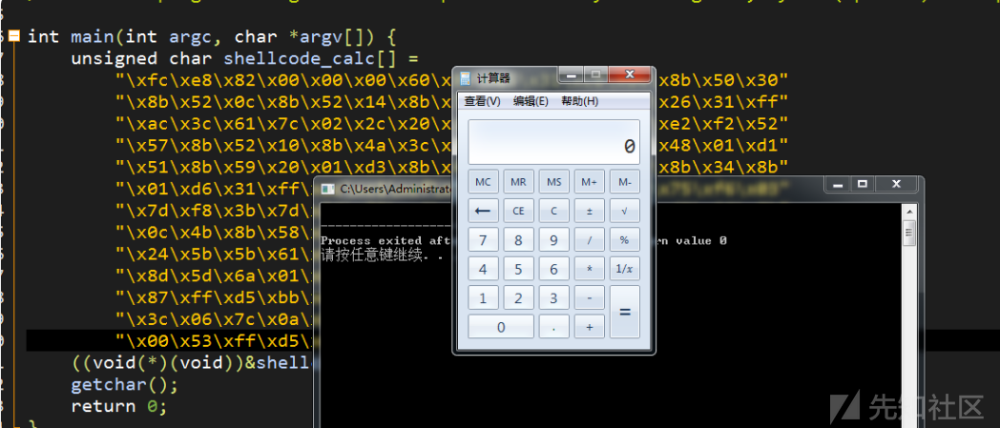

1

那么shellcode叫shellcode只是因为很早的时候劫持流程后都会去拿一个shell...

所以就这么叫了，慢慢沿用下来。 

其实shellcode功能很多，不限于拿shell，也有下载文件添加用户之类的，

反正都是代码执行了，执行什么代码都是攻击者指定的。

shellcode按照放置的位置可以分为三种：用户态shellcode和内核态shellcode或者二者混合。

文中我将shellcode免杀技巧分为 "分离“、”混淆“两个大类，通过不同技巧针对不同检测方式，也就是常听到的特征检测、行为检测、云查杀。

首先来看看关于shellcode常用得C/C++加载方式

常见方式比如函数指针执行、内联汇编指令、伪指令等方式。

但是这种shellcode明显 和执行程序在一起很容易被查杀

所以大多数分离免杀的思想就是把执行shellcode和加载程序分开。

参考资料

1、[原创]Python免杀ShellCode加载器(Cobaltstrike/Metasploit)

https://www.cnblogs.com/k8gege/p/11223393.html

2、shellcode原理是啥？

https://www.zhihu.com/question/30943194

3、那些shellcode免杀总结

https://xz.aliyun.com/t/7170